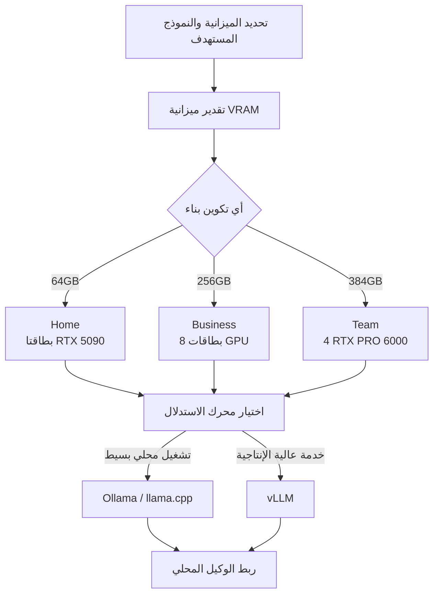

في الأيام القليلة الماضية انتشر بهدوء مشروع على خطوط زمنية المطورين. إنه "حاسوب الذكاء الاصطناعي الشخصي": فبدلًا من استئجار واجهة برمجية سحابية، تقوم بتجميع جهاز ذكاء اصطناعي في المنزل أو المكتب وتشغّل النماذج مفتوحة الأوزان بالكامل على عتاد تملكه أنت. تصل الأدلة إلى 384GB من ذاكرة VRAM، وهو ما يطرح سؤالًا عمليًا للغاية: عند هذه السعة، ما النماذج التي يمكن تشغيلها محليًا فعلًا؟ هذا المقال موجّه إلى قادة الهندسة وفرق منصات تعلم الآلة الذين يقيّمون بنية الذكاء الاصطناعي داخل المؤسسة، وإلى علماء البيانات الراغبين في تشغيل النماذج محليًا. نستخدم الحساب للتأكد من كيفية تحديد ذاكرة VRAM لجدوى النماذج، ونتناول ما الذي يتغير عند توسيع جهاز شخصي واحد إلى تشغيل بمستوى المؤسسة، إلى جانب منظور منصة ai-platform لدى ThakiCloud.

لأبدأ بالخلاصة. تُحدَّد جدوى الذكاء الاصطناعي المحلي في معظمها بمتغير واحد: ذاكرة VRAM. وما يثبته البناء الشخصي هو أنه "ممكن تقنيًا"، لا أن "المؤسسة تستطيع تشغيله كما هو". وهذه الفجوة هي بالضبط سبب وجود منصات التشغيل داخل المؤسسة.

## ما هذه التقنية

المستودع في قلب النقاش هو `autonomous-ai/autonomous-computer`، وهو دليل مفتوح المصدر صادر برخصة MIT لبناء حاسوب ذكاء اصطناعي في المنزل من الصفر. ما يميزه أنه لا يشرح بالنص وحده. يأتي كل بناء مع قائمة مواد (BOM) تحمل الأسعار وروابط الشراء، وملفات ثلاثية الأبعاد (STL و STEP) لطباعة الهيكل أو تصنيعه، ومخطط أسلاك، وقيم ضبط BIOS، وصور تجميع خطوة بخطوة. أما جانب البرمجيات فيمتد من تثبيت نظام التشغيل وبرامج تعريف NVIDIA، مرورًا بثلاثة محركات استدلال (Ollama و vLLM و llama.cpp)، وصولًا إلى ربط وكيل محلي.

تُقدَّم ثلاثة تكوينات.

- **Home**: بطاقتا RTX 5090، بإجمالي 64GB من VRAM
- **Business**: تكوين من 8 بطاقات GPU، بإجمالي نحو 256GB من VRAM
- **Team**: أربع بطاقات RTX PRO 6000 Blackwell، بإجمالي 384GB من VRAM

الفلسفة التي يؤكد عليها المشروع باستمرار هي "امتلك ذكاءك". فالنموذج الذي تستأجره من السحابة قد يختفي بين ليلة وضحاها عند تغيّر سياسة أو إيقاف خدمة، بينما لا يحدث ذلك لنموذج يعمل في منزلك. إنه موقف يتعلق بتأمين سيادة البيانات والتحكم على مستوى العتاد، وهو ينسجم تمامًا مع تنامي الإقبال على التشغيل داخل المؤسسة.

يبدو التدفق الكلي على النحو التالي.

## ذاكرة VRAM تحدد الجدوى

أيّ نموذج يعمل محليًا يعود عمليًا إلى ذاكرة VRAM وحدها. القاعدة التقريبية التي استقر عليها المجتمع واضحة. عند FP16 (نصف الدقة) تحتاج إلى نحو 2GB لكل مليار معامل؛ وعند التكميم من فئة INT4 (Q4) نحو 0.5GB؛ وفوق ذلك تضيف 15 إلى 20 بالمئة لذاكرة KV cache والتنشيطات وحمل إطار العمل. بعبارة أخرى، عند Q4 يكون الحد الأدنى من VRAM تقريبًا "عدد المعاملات (B) × 0.5 × 1.2".

يعطي تطبيق هذه الصيغة على أحجام نماذج تمثيلية الجدول أدناه. وتتضمن هذه القيم حمل الـ 20 بالمئة.

| حجم النموذج | VRAM عند Q4 | VRAM عند Q8 |
|---|---|---|
| 8B | 5GB | 10GB |
| 32B | 19GB | 38GB |
| 70B | 42GB | 84GB |
| 122B | 73GB | 146GB |
| 235B | 141GB | 282GB |
| 405B | 243GB | 486GB |

هذا الحساب ليس اختراعًا اعتباطيًا؛ بل يتقاطع مع أدلة منشورة. فتشغيل Llama 3 70B عند Q4_K_M يُبلَّغ عنه بأنه يحتاج نحو 40 إلى 43GB، وهو ما يطابق القيمة المحسوبة 42GB. ويُقال إن نموذجًا من فئة 122B مثل Qwen 3.5 122B يحتاج 70 إلى 81GB عند Q4، والقيمة المحسوبة 73GB تقع ضمن هذا النطاق. أما Llama 3.1 405B فيصل إلى 243GB عند Q4، وهو ما يطابق الجدول تمامًا. وللإشارة، فإن Q4_K_M هو المعيار المجتمعي الذي يكاد لا يُميَّز عن Q8 في معظم المهام، مع ارتفاع في الحيرة (perplexity) بنحو 0.2 إلى 0.5 فقط مقارنةً بـ FP16.

## ما الذي يشغّله كل بناء فعليًا

بمطابقة متطلبات VRAM المحسوبة على خطوط السعة للتكوينات الثلاثة، تتضح الصورة.

يعمل النموذج على تكوين معيّن حين يقع عموده تحت خط سعة ذلك التكوين. وباختصار:

- **Home (64GB)**: يستوعب بأريحية 70B عند Q8 و 122B عند Q4. وهذا يكفي للتجارب الشخصية ومساعدة البرمجة لفريق صغير.
- **Business (256GB)**: يمكنه دفع نموذج من فئة 235B قريبًا من Q8، وهو مناسب لإبقاء عدة نماذج متوسطة مقيمة في آنٍ واحد لأغراض التوجيه.
- **Team (384GB)**: يحمّل 405B عند Q4 (243GB) ويبقى لديه 141GB. وهذا الفائض هو ما يمتص فعليًا ذاكرة KV cache للسياقات الطويلة والطلبات المتزامنة.

هناك نقطة يسهل إغفالها هنا. الأرقام في الجدول ليست سوى "الحد الأدنى اللازم لتحميل الأوزان". في الاستخدام الفعلي، ومع نمو طول السياق وعدد المستخدمين المتزامنين، تتضخم ذاكرة KV cache بأسرع من الخطي وتلتهم ميزانية VRAM. فتكوين "يكاد يتسع" فيه 405B وآخر "يخدمه بمساحة فائضة" قصتان مختلفتان تمامًا.

## دلالات لـ ThakiCloud

ما يثبته حاسوب الذكاء الاصطناعي الشخصي قوي لكنه محدود أيضًا، لأنه لا يصح إلا ضمن مقدمات جهاز واحد ومستخدم واحد وتشغيل يدوي. وفي لحظة توسيع هذا "الجهاز الواحد في المنزل" إلى حجم المؤسسة، تظهر مجموعة مختلفة تمامًا من المشكلات، وهذا بالضبط هو المجال الذي تعالجه منصة **ai-platform** لدى ThakiCloud.

تصف منصة ai-platform وحدات GPU وتجدولها باستخدام Kueue فوق Kubernetes، وتخدم النماذج بتعدد المستأجرين عبر vLLM. في البناء الشخصي يحتكر شخص واحد أربع بطاقات GPU، أما في المؤسسة فتتنافس فرق متعددة ونماذج متعددة على مجمّع GPU نفسه. وما يلزم حينها هو عزل المستأجرين، والاصطفاف العادل، والجدولة القائمة على الأولوية، ومراقبة الاستخدام والتكلفة. فالقرار اليدوي في البناء الشخصي بـ"تحميل هذا النموذج فقط الآن" هو ما تُؤتمِته المنصة عبر السياسة والمجدول.

وتشير الاقتصاديات في الاتجاه نفسه. فإذا كان "امتلك ذكاءك" في البناء الشخصي هو منطق تأمين سيادة البيانات والتحكم عبر العتاد، فإن منصة ai-platform تحقق المنطق نفسه على نطاق المؤسسة. إن النشر داخل المؤسسة والسيادي، وانخفاض تكلفة الخدمة لكل وحدة، والتحكم في البيانات عبر الاستضافة الذاتية، أمور تحمل وزنًا خاصًا في بيئات العملاء التي يجب أن تلبي المتطلبات التنظيمية المحلية. كما أن رفع معدل استغلال وحدات GPU من فئة RTX PRO 6000، التي يصعب على فرد تبريرها، عبر مشاركتها بين أعباء عمل كثيرة، هو أمر لا تقدر عليه سوى منصة.

وإن كنت تشغّل وكلاء فوق نماذج محلية، فإن منظور **Paxis** لدى ThakiCloud يتقاطع أيضًا. فـ Paxis هي مستوى تحكم من نوع Agent-Native Cloud يعمل فوق منصة ai-platform، وينفّذ المهارات في صناديق رمل معزولة ويمرّر كل فعل عبر بوابة سياسة وسجل تدقيق. أرفق مستوى تحكمك الخاص بنموذج يعمل على عتادك الخاص، وستمتد فلسفة البناء الشخصي في "امتلاك الذكاء" إلى حوكمة على مستوى المؤسسة.

## الحدود والحجج المضادة

قبل تبنّي رومانسية البناء الشخصي، تستحق بعض الحقائق الانتباه.

أولًا، تكلفة العتاد نفسه وعبء تشغيله. فتكوين من أربع بطاقات RTX PRO 6000 Blackwell يحمل نفقات رأسمالية أولية كبيرة، وتتبعه باستمرار الطاقة والحرارة والضوضاء والصيانة. كما أن الجهاز الواحد هو نقطة فشل واحدة.

ثانيًا، هناك حالات لا تزال السحابة فيها منطقية بوضوح. فأعباء العمل المتقطعة ذات الاستخدام غير المنتظم، والمهام التي تتطلب فعلًا أحدث نموذج متقدم، والخدمات العالمية منخفضة الكمون، يصعب خدمتها من صندوق واحد داخل المؤسسة. ونقطة التعادل للتشغيل داخل المؤسسة لا تصح إلا على مقدمة "استغلال مرتفع ومستقر".

ثالثًا، تكميم Q4 ليس مجانيًا. ففي المتوسط يكون فقدان الجودة ضئيلًا، لكن في المهام الحساسة للدقة مثل البرمجة أو الرياضيات قد يظهر التدهور. وكما ذُكر، فإن السياقات الطويلة والتزامن العالي يستنزفان ميزانية VRAM عبر ذاكرة KV cache، مما يخلق وضعًا "تتسع فيه الأوزان لكن الخدمة لا تتسع".

في النهاية، حاسوب الذكاء الاصطناعي الشخصي نقطة انطلاق ممتازة وإثبات مفهوم قوي. لكن كي تنعم مؤسسة بأكملها بالتحكم الذي يقدّمه جهاز شخصي واحد، وبطريقة مستقرة، فهي تحتاج إلى طبقة منصة فوقه تضيف العزل والجدولة والمراقبة والحوكمة. إن الإجابة على السؤال الذي يطرحه البناء الشخصي ("هل يمكنك امتلاك ذكائك؟") على نطاق المؤسسة هي المشكلة التي تحلّها منصات الذكاء الاصطناعي داخل المؤسسة.

## المصادر

- [autonomous-ai/autonomous-computer (GitHub)](https://github.com/autonomous-ai/autonomous-computer)
- [Autonomous Computer: Build Your Own Home AI (writeup)](https://pasqualepillitteri.it/en/news/4998/autonomous-computer-build-home-ai-locally)
- [Best Local AI Models by VRAM: 8GB to 384GB (2026)](https://www.modemguides.com/blogs/ai-infrastructure/best-local-ai-models-by-vram-2026)
- [GPU Memory Requirements for LLMs (Spheron)](https://www.spheron.network/blog/gpu-memory-requirements-llm/)
- [Build an AI PC in 2026: Complete Hardware Guide (Local AI Master)](https://localaimaster.com/blog/ai-pc-build-guide)
- شارَكه أصلًا [@tom_doerr، أدلة بناء حاسوب الذكاء الاصطناعي الشخصي](https://x.com/tom_doerr)
