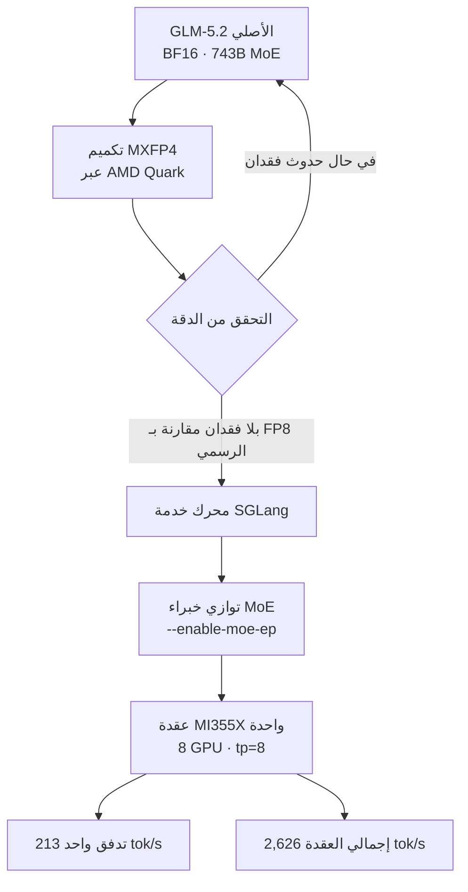

انتشرت نتيجة اختبار أداء بسرعة في تايم لاين المطورين الأسبوع الماضي. كانت تفيد بأن GLM-5.2 تم تشغيله على عقدة واحدة من AMD MI355X بمعدل 2,626 رمزاً (token) في الثانية، وبتكلفة أقل بأكثر من الضعف مقارنة بـ Blackwell. إذا نظرنا إلى الأرقام فقط، يبدو الأمر كدعاية اعتيادية من نوع "عتادنا أسرع"، لكن سبب أهمية هذه الحالة يكمن في مكان آخر. فهي تجمع بين تشغيل نموذج MoE ضخم بحجم 743B على معالج رسوميات من AMD وليس من NVIDIA، مع ضغطه إلى مستوى 4 بت دون فقدان في الدقة.

هذا المقال موجه لقادة الهندسة الذين يدرسون الخدمة المحلية (on-premise) والخدمة متعددة السحابات، وفرق منصات التعلم الآلي التي تفكر في اختيار مورّد وحدات معالجة الرسوميات، وعلماء البيانات الذين يحتاجون إلى تقييم اقتصاديات خدمة النماذج المفتوحة الأوزان الكبيرة. سنتحقق أولاً من المصدر الأصلي لمعرفة ما الذي قاسته هذه النتيجة بالضبط، ثم نحلل لماذا كان تكميم MXFP4 وتوازي MoE في SGLang حاسمين، وأخيراً نوضح أين تقف منصة ai-platform من ThakiCloud ضمن هذا التوجه.

لنبدأ بالخلاصة. الرسالة الحقيقية لهذا الاختبار ليست "AMD أسرع"، بل أن **مكدس الخدمة (صيغة التكميم ومحرك الاستدلال) بدأ يفكّ قفل الاعتماد على مورّد عتاد واحد**. وهذه النقطة التي ينفكّ فيها القفل هي بالضبط سبب وجود منصات الخدمة المحلية.

## ما هي هذه التقنية

هذه نتيجة تلاقي ثلاثة عناصر: النموذج، والعتاد، ومكدس الخدمة الذي يربط بينهما.

**النموذج، GLM-5.2.** هو نموذج MoE مفتوح الأوزان أصدرته Z.ai (المعروفة سابقاً باسم Zhipu)، بإجمالي معلمات (parameters) يبلغ نحو 743B، ومعلمات نشطة لكل رمز تبلغ نحو 39B. يصل طول السياق إلى مليون رمز (1M)، ويُعرف بأنه قوي بشكل خاص في مهام برمجة الواجهة الأمامية (frontend). ورغم أن إجمالي معلماته كبير، فإن معلماته النشطة لا تتجاوز 39B بفضل بنية MoE، ما يجعله نموذجاً متفرقاً (sparse) ضخماً نموذجياً من نوع "يُخزَّن بثقل ويُستخدم بخفة".

**العتاد، AMD Instinct MI355X.** هو أحدث مسرّع لمراكز البيانات من AMD، وتكمن قوته في سعة الذاكرة الكبيرة لكل وحدة معالجة رسوميات (GPU)، ما يتيح احتواء نماذج كبيرة على عدد أقل من وحدات المعالجة. تم قياس هذه الحالة على تكوين عقدة واحدة (8 وحدات معالجة رسوميات، مع توازي موتّرات tp=8). وللإشارة، فإن استهلاك الذاكرة لكل وحدة معالجة رسوميات وفق FP8 يبلغ نحو 89 جيجابايت، أي نصف مستوى BF16 البالغ نحو 175 جيجابايت.

**مكدس الخدمة، تكميم MXFP4 (عبر AMD Quark) مع SGLang.** هنا يكمن جوهر الموضوع. تم تحويل نموذج GLM-5.2 الأصلي بصيغة BF16 إلى صيغة **MXFP4** (فاصلة عائمة دقيقة التدرج بـ 4 بت) باستخدام أداة التكميم من AMD المسماة **Quark**، ويذكر المصدر الأصلي أن هذا التحويل كان "بلا فقدان" (lossless) في الدقة مقارنة بتكميم FP8 الرسمي. أما محرك الاستدلال المختار فكان **SGLang**. والسبب واضح: من بين الأطر التي جرى اختبارها، كان SGLang الوحيد الذي يدعم MXFP4 بشكل أصلي، واستطاع من خلال خيار `--enable-moe-ep` توزيع الخبراء (experts) على وحدات المعالجة ثم توجيه الرموز عبر NVLink/NVSwitch، أي تفعيل توازي MoE بالشكل الصحيح.

وفيما يلي ملخص لخط الأنابيب الكامل.

يكمن الاختلاف عن النهج التقليدي في نقطتين. الأولى، أن صيغة التكميم هي MXFP4 وليست FP8. فتقليل عدد البتات عادة ما يؤدي إلى اضطراب الدقة، لكن أسلوب التدرج الدقيق (microscaling) يضع مقياساً منفصلاً لكل كتلة صغيرة، وهو تصميم يهدف إلى الحفاظ على الجودة حتى عند مستوى 4 بت. الثانية، أن كل هذا تم تشغيله خارج نظام CUDA البيئي، أي على AMD ROCm.

## نتائج اختبار الأداء الفعلية

الأرقام التي نشرها المصدر الأصلي (Wafer.ai) تنقسم إلى مسارين. ينبغي النظر إليهما بشكل منفصل لأن ظروف حمل العمل تختلف بينهما.

**سيناريو زمن استجابة تدفق واحد.** في طلب واحد بمدخل 10 آلاف رمز ومخرج 1.5 ألف رمز، بلغ المعدل **213 رمزاً في الثانية**. يمثل هذا الرقم حالة مستخدم واحد يُدخل سياقاً طويلاً ويتلقى الإجابة عبر البث المباشر (streaming).

**سيناريو الإنتاجية الإجمالية للعقدة.** في ظروف مدخل 20 ألف رمز، ومخرج ألف رمز، ومعدل إصابة ذاكرة تخزين مؤقتة (cache) بنسبة 60%، تمت معالجة 2.4 طلب في الثانية (2.4 rps)، محققةً إنتاجية إجمالية بلغت **2,626 tok/s لكل عقدة**. وفي هذه الحالة، ظل زمن الوصول إلى أول رمز (TTFT) عند 5 ثوانٍ أو أقل. تمثل هذه الظروف حالة قريبة من الخدمة الإنتاجية التي تدفع طلبات متعددة في آن واحد.

أما فيما يخص التكلفة، فتذكر Wafer.ai أن تكوين MXFP4 هذا يحقق **تكلفة أقل بأكثر من الضعف مقارنة بـ Blackwell**، أي إنتاجية لكل دولار أعلى بأكثر من الضعف. وفي تحليل منفصل، أفادت SemiAnalysis (InferenceX) أن MI355X، ضمن تكوين مختلف يستخدم SGLang وFP8، أرخص بنسبة تصل إلى **40% لكل مليون رمز** مقارنة بـ B200. وبما أن صيغة التكميم وحمل العمل مختلفان بين الرقمين، فمن الأدق عدم مقارنتهما مباشرة، بل قراءتهما على أنهما "مصدران مستقلان يشيران إلى نفس الاتجاه العام"، وهو التنافسية السعرية لـ MI355X. ولا بد من التوضيح أن مؤشر التكلفة في الرسم البياني أعلاه هو تصوير بصري لادعاء Wafer.ai بـ"أكثر من الضعف"، وهو مؤشر نسبي وليس سعراً مطلقاً.

تجدر الإشارة هنا إلى نقطة مهمة. هذه الأرقام ليست نتيجة إعادة إنتاج قمنا بها بأنفسنا بعد الحصول على عقدة MI355X فعلية، بل هي قيم قياس نشرها المصدر الأصلي. ولعدم توفر جهاز MI355X فعلي لدينا، لم نتمكن من إعادة الإنتاج المستقل، وبالتالي فإن جميع الأرقام الواردة في هذا المقال هي قيم مقتبسة. نخطط للتعامل مع إعادة الإنتاج بنفس الظروف بشكل منفصل حالما نحصل على العتاد.

## لماذا كان MXFP4 وSGLang حاسمين

الأهم من العتاد في هذه النتيجة هو اختيار مكدس الخدمة. وهناك ثلاثة أسباب لذلك.

**أولاً، يتيح التكميم بـ 4 بت احتواء نماذج MoE الضخمة على عدد أقل من وحدات المعالجة.** تحميل 743B معلمة بصيغة BF16 يتطلب مئات الجيجابايتات من الذاكرة. وعند خفضها إلى MXFP4، تنخفض ذاكرة الأوزان بشكل كبير، ما يتيح وضع النموذج نفسه في عدد أقل من وحدات المعالجة وضمن عقدة أضيق. وبما أن جزءاً كبيراً من تكلفة الخدمة يتحدد بحسب "عدد وحدات المعالجة اللازمة لاحتواء هذا النموذج"، فإن التكميم بـ 4 بت القريب من عدم الفقدان ينعكس مباشرة على سعر الوحدة.

**ثانياً، يجعل توازي MoE عملية الحساب مقتصرة على المعلمات النشطة فقط.** في نماذج MoE، لا يُفعَّل لكل رمز سوى عدد قليل من الخبراء. ويقوم خيار `--enable-moe-ep` في SGLang بتوزيع الخبراء على وحدات المعالجة وإرسال الرموز إلى الخبير المعني عبر وصلات بينية عالية السرعة. والمفتاح الحقيقي للإنتاجية هو إحياء بنية "حساب 39B النشطة فقط بدل حساب كامل 743B" على مستوى توزيع العتاد.

**ثالثاً، تناغم الصيغة مع المحرك يفك قيد الاعتماد على مورّد واحد.** هنا يكمن الاستنتاج الهادئ لهذا الإنجاز. فبمجرد توفر محرك يدعم MXFP4 بشكل أصلي (SGLang) وأداة تحوّل إلى تلك الصيغة بلا فقدان (AMD Quark)، أصبحت الخدمة على مستوى الإنتاج ممكنة على ROCm وليس فقط على CUDA. وكلما زاد توحيد مكدس الخدمة، تحوّل سؤال "أي مورّد لوحدة المعالجة" من مسألة أداء إلى مسألة توفر وسعر. وهذا هو التحول الذي يعيد قوة التفاوض إلى المشتري.

## دلالات التطبيق على منتجات ThakiCloud

ترتبط هذه الحالة ارتباطاً مباشراً باستراتيجية **ai-platform** من ThakiCloud. فمنصة ai-platform هي بنية تحتية لخدمات AI/ML SaaS قائمة على Kubernetes، تقوم بخدمة النماذج في بيئات عملاء متنوعة وجدولة موارد وحدات المعالجة عبر Kueue. ومن هذا المنظور، تحمل هذه النتيجة ثلاث دلالات.

**الخدمة متعددة الموردين لم تعد تنازلاً في الأداء.** في الماضي، كان الافتراض القائل بأن "الأداء لا يتحقق إلا مع NVIDIA" يغلق عملياً باب اختيار المورّد. وحالة GLM-5.2 على MI355X دليل على تزعزع هذا الافتراض. فإذا استطاعت ai-platform تجريد vLLM وSGLang كخلفيات خدمة (backends)، وجدولة عقد NVIDIA وAMD معاً فوقها، فسيتمكن العملاء من توجيه طلباتهم إلى أرخص عتاد متاح حسب حمل العمل. وفي عناقيد (clusters) متعددة المستأجرين، هذه المرونة تعني مباشرة تنافسية في سعر الخدمة.

**التكميم أصبح شاغلاً من الدرجة الأولى للمنصة.** الصيغ منخفضة البتات القريبة من عدم الفقدان مثل MXFP4 تتيح تحقيق "نفس اتفاقية مستوى الخدمة (SLA) بعدد أقل من وحدات المعالجة". وبالنسبة للعملاء الذين يعتمدون الخدمة المحلية، خصوصاً في بيئات القطاع العام والمالي المحلية التي تتطلب سيادة البيانات والاستضافة الذاتية (self-hosting)، فإن كمية وحدات المعالجة المتاحة نفسها تشكل قيداً. والتكميم بلا فقدان يتيح تشغيل نماذج أكبر ضمن هذا القيد، لذا فإن استيعاب ai-platform لسلاسل أدوات مثل Quark كخطوة قياسية في خط أنابيب الخدمة يُعد توجهاً طبيعياً.

**كفاءة التكلفة هي الحجة الأساسية لعرض الخدمة المحلية.** أكثر سؤال يُطرح على ThakiCloud عند اقتراح الخدمة المحلية والسحابة السيادية هو "إذاً، ما مدى الرخص؟". واختبارات الأداء المستقلة التي تشير إلى تكلفة أقل بأكثر من الضعف مقارنة بـ Blackwell، وأرخص بنسبة تصل إلى 40% مقارنة بـ B200، يمكن استخدامها كدليل على أن تنويع العتاد فوق مكدس خدمة مناسب يخفض التكلفة الإجمالية للملكية (TCO) فعلياً. وبالطبع فإن هذا يفترض إمكانية إعادة الإنتاج في بيئة العميل، وهذه القدرة على إعادة الإنتاج هي بحد ذاتها القيمة التي تقدمها المنصة.

## القيود والاعتراضات

من أجل التوازن، نستعرض أسباب عدم المبالغة في الثقة بهذه النتيجة.

**أولاً، اختبار الأداء هو لقطة لظروف محددة.** رقم 2,626 tok/s جاء من حمل عمل محدد بمدخل 20 ألف رمز، ومخرج ألف رمز، ومعدل إصابة ذاكرة تخزين مؤقتة 60%. وفي حمل عمل تتركز فيه توليدات طويلة على مطالبات (prompts) قصيرة، أو حيث يكون معدل إصابة الذاكرة المؤقتة منخفضاً، ستختلف الإنتاجية بشكل كبير. والفجوة بين 213 tok/s للتدفق الواحد و2,626 tok/s لإجمالي العقدة تُظهر بالفعل هذه الحساسية.

**ثانياً، ادعاء "عدم الفقدان" في MXFP4 محدود بنطاق التحقق.** يذكر المصدر الأصلي أنه بلا فقدان مقارنة بـ FP8 الرسمي، لكن من المرجح أن هذا مبني على مجموعة تقييم محددة. وتأثير التكميم بـ 4 بت قد يختلف حسب المهمة، سواء في البرمجة أو الرياضيات أو السياقات الطويلة، لذا يجب قبل الاعتماد الفعلي قياس تدهور الجودة مباشرة باستخدام مجموعة تقييم خاصة بالشركة.

**ثالثاً، لا يزال مستوى نضج تشغيل نظام ROCm البيئي متغيراً غير محسوم.** نجاح اختبار الأداء وثبات التشغيل الموثوق في بيئة الإنتاج أمران مختلفان. فلا تزال هناك فجوة مع نظام CUDA البيئي في توافق برامج التشغيل (drivers) والنواة (kernel) والمكتبات، وفي نضج أدوات التعامل مع الأعطال. والحكم على التكلفة الإجمالية للملكية بالاعتماد فقط على سعر العتاد قد يغفل تكاليف الطاقم التشغيلي وتوقف الخدمة.

ومع ذلك، فإن الاتجاه العام واضح. فتوحيد مكدس الخدمة يوسّع خيارات العتاد المتاحة، والمستفيد من هذا التحول هو منصات الخدمة، وعملاؤها، القادرون على الإفلات من قيد المورّد الواحد واختيار العتاد الأمثل لكل حمل عمل. وهذا بالضبط ما تستهدفه منصة ai-platform من ThakiCloud.

## المصادر

- Wafer.ai, "Performance per dollar is getting faster and cheaper": <https://www.wafer.ai/blog/glm52-amd>
- SemiAnalysis InferenceX, "AMD MI355X GLM-5 Inference: Up to 40% Cheaper per Million Tokens than B200 on SGLang FP8": <https://inferencex.semianalysis.com/blog/mi355x-glm5-fp8-sglang-40-cheaper-than-b200>
- LMSYS, "Win on TCO: How AMD Instinct MI355X Achieves Cost-Competitive Distributed Inference Through SGLang with MoRI": <https://www.lmsys.org/blog/2026-05-28-mori/>
- بطاقة نموذج GLM-5.2 (743B / 39B نشطة · MoE · سياق 1024K): <https://recipes.vllm.ai/zai-org/GLM-5.2>
