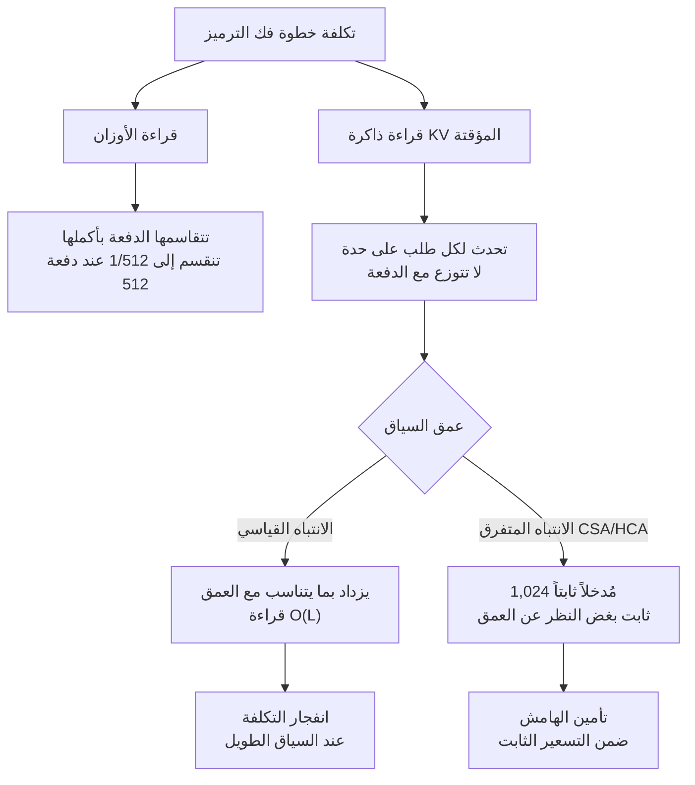

## نظرة عامة: مفارقة أن يكون نموذج أكبر بثمانية أضعاف أرخص بخمسة أضعاف

طرح سؤال مثير للاهتمام مؤخراً في مجتمع بنية استدلال النماذج. فـ DeepSeek V4 Flash، وهو نموذج بإجمالي 284 مليار معلمة، يسعّر رموز الإخراج (output) بأرخص بنحو خمسة أضعاف من Qwen3.6-35B-A3B البالغ 35 مليار معلمة. وإذا نظرنا إلى الأسعار الفعلية، نجد أن رموز الإدخال (input) لكلا النموذجين متقاربة عند نحو 0.14 دولار لكل مليون رمز، لكن رموز الإخراج تبلغ 0.18-0.28 دولار لكل مليون رمز في DeepSeek V4 Flash، مقابل 1.00-1.49 دولار لكل مليون رمز في Qwen3.6.

وهناك ما هو أغرب من ذلك. فمن حيث المعلمات النشطة لكل رمز، يستخدم Qwen3.6 نحو 3 مليارات معلمة بينما يستخدم DeepSeek V4 Flash نحو 13 مليار معلمة. أي أن Qwen، من ناحية حجم الحوسبة، أخف بأربعة أضعاف تقريباً، ومع ذلك يسير سعر السوق في الاتجاه المعاكس تماماً. وهكذا تنكسر مرتين متتاليتين الفكرة البديهية القائلة إن عدد المعلمات يساوي التكلفة.

يشرّح هذا المقال تلك المفارقة على ثلاثة مستويات: أولاً، لماذا يكون الحد المهيمن في تكلفة فك الترميز (decode) هو قراءة الذاكرة وليس الحوسبة؛ ثانياً، التوتر البنيوي بين عمق ذاكرة KV المؤقتة والتسعير الثابت؛ وثالثاً، ما الذي يظهر عند حساب صيغة الخدمة المثلى على 8xH100 مباشرة باستخدام نموذج roofline. وبالنسبة لجهة مثل ThakiCloud تقدم خدمة النماذج مباشرة في بيئات العملاء، فإن هذه البنية تتحول مباشرة إلى قدرة تنافسية في التكلفة، لذا نستعرض أيضاً الدلالات العملية لذلك.

## التحقق من الحقائق المعمارية للنموذجين

لنبدأ أولاً بتحديد المواصفات بدقة.

DeepSeek V4 Flash هو نموذج MoE بإجمالي 284 مليار معلمة و13 مليار معلمة نشطة. يختار الموجّه (router) أفضل 6 خبراء (top-6) من بين 256 خبيراً موجَّهاً (routed expert) بالإضافة إلى خبير مشترك واحد (shared expert). أما الانتباه (attention) فهو مكدس هجين يجمع بين CSA (الانتباه المتفرق المضغوط) وHCA (الانتباه شديد الضغط)، حيث يقرأ فقط أفضل 1,024 مُدخلاً مضغوطاً من ذاكرة KV المؤقتة في كل تمريرة استعلام. ووفقاً للمصادر الرسمية، عند سياق يبلغ مليون رمز (1M) يخفّض ذلك عمليات الفاصلة العائمة (FLOPs) لكل رمز إلى 27%، وذاكرة KV المؤقتة إلى 10% مقارنة بـ V3.2. أما نقطة التفتيش (checkpoint) فهي بصيغة مختلطة، حيث تكون خبراء MoE بصيغة FP4 والباقي بصيغة FP8.

Qwen3.6-35B-A3B هو نموذج MoE بإجمالي 35 مليار معلمة و3 مليارات معلمة نشطة (256 خبيراً، 8 موجَّهين + خبير مشترك واحد). والانتباه هجين بين طبقات انتباه خطي من نوع Gated DeltaNet وطبقات انتباه كامل (full attention) (برأسي KV اثنين، وبُعد رأس 256). السياق الأصلي يبلغ 262 ألف رمز، ويمتد حتى مليون رمز عبر تقنية YaRN. وعند نقطة تفتيش بصيغة FP8 يبلغ حجمه نحو 35 جيجابايت، ما يجعله يتسع في وحدة H100 واحدة.

وباختصار، كلا النموذجين تصميمان حديثان وموجهان نحو الكفاءة. وما يجعل هذه المقارنة أكثر إثارة هو أن Qwen ليس مكلفاً لأنه مجرد نموذج كثيف (dense) ساذج.

## البنية الحقيقية لتكلفة فك الترميز: نموذج roofline

توليد الرموز (فك الترميز) مقيد بعرض النطاق الترددي للذاكرة، لا بالحوسبة. والتقريب من الدرجة الأولى لزمن خطوة فك الترميز هو كالتالي.

```text
T_step = (بايتات الأوزان المطلوب قراءتها + مجموع بايتات قراءة KV لكل طلب) / عرض النطاق الترددي للذاكرة
throughput = حجم الدفعة (batch_size) / T_step
```

وهنا يختلف طابع الحدّين اختلافاً تاماً.

قراءة الأوزان (weight) تتقاسمها الدفعة. فإذا قُرئت الأوزان مرة واحدة في كل خطوة، فإن جميع الطلبات داخل الدفعة تشترك في هذه القراءة. فعند دفعة بحجم 512، تنخفض تكلفة الأوزان لكل رمز إلى 1/512. وهذا هو سبب أن إجمالي معلمات MoE يصبح "شبه مجاني عند الدفعات الكبيرة".

أما قراءة ذاكرة KV المؤقتة فهي منفصلة لكل طلب. فكل طلب يجب أن يقرأ ذاكرة KV الخاصة بسياقه، وهذه التكلفة لا تتوزع حتى مع تكبير الدفعة. وتزداد خطياً كلما ازداد عمق السياق.

لذلك، عندما تكون الدفعة كبيرة بما يكفي ويطول السياق، يتحول الحد المهيمن في التكلفة من الأوزان إلى قراءة ذاكرة KV. غير أن تسعير واجهة برمجة التطبيقات (API) ثابت لكل رمز بغض النظر عن عمق السياق: فالطلب الذي يحمل تاريخاً بطول 32 ألف رمز والطلب الذي يحمل تاريخاً بطول 500 ألف رمز يدفعان السعر نفسه لكل رمز إخراج. ومن منظور مزوّد الخدمة، فإن النموذج القادر على إبقاء قراءة ذاكرة KV محدودة بغض النظر عن العمق هو الذي يحقق هامش ربح ضمن نظام التسعير الثابت.



## صيغة الخدمة على 8xH100: مقارنة بالأرقام

لننتقل الآن إلى وضع النموذجين فعلياً على 8xH100 (طراز SXM5، بذاكرة 80 جيجابايت HBM3 لكل وحدة، وعرض نطاق 3.35 تيرابايت/ثانية لكل وحدة، بإجمالي 640 جيجابايت، وتجميع إجمالي 26.8 تيرابايت/ثانية). وحددنا التكلفة بالساعة عند نحو 20 دولاراً وفق نموذج الطلب عند الحاجة (on-demand).

وفرضيات النمذجة هي كالتالي: يمتلك Qwen3.6 أوزاناً بصيغة FP8 تبلغ نحو 35 جيجابايت؛ وبافتراض أن 10 من طبقاته الهجينة الأربعين هي طبقات انتباه كامل، فإن ذاكرة KV لكل رمز تبلغ نحو 10 كيلوبايت [تقدير] (رأسا KV اثنان × بُعد 256 × 2 لـ K/V × 10 طبقات × بايت واحد). أما DeepSeek V4 Flash فوزنه الفعلي يبلغ نحو 150 جيجابايت [تقدير] بخبراء بصيغة FP4 وطبقات كثيفة (dense) بصيغة FP8؛ وذاكرة KV المخزَّنة، استناداً إلى الادعاء الرسمي بنسبة 10% مقارنة بـ V3.2، تبلغ نحو 3.5 كيلوبايت لكل رمز [تقدير]، بينما تكون القراءة عند فك الترميز ثابتة عند نحو 4 ميغابايت لكل طلب في كل خطوة عبر أفضل 1,024 مُدخلاً.

### صيغة الخدمة تختلف من الأساس

الصيغة المثلى لـ Qwen3.6 هي ثماني نسخ مستقلة (DP8). وبما أن النموذج يتسع في وحدة واحدة، فلا يوجد أي اتصال بين وحدات المعالجة على الإطلاق، ويتبقى نحو 38 جيجابايت من ميزانية ذاكرة KV لكل وحدة. وهذه هي صيغة الخدمة النموذجية للتصميم الموجَّه نحو الاستضافة المحلية.

أما DeepSeek V4 Flash فيتطلب تجميع الوحدات الثماني كلها في مجموعة واحدة من نوع TP/EP. وفي مقابل اتصال all-to-all الذي يفرضه ذلك، تشترك الدفعة بأكملها في ميزانية ذاكرة KV تبلغ نحو 490 جيجابايت.

### حسابات الإنتاجية حسب عمق السياق

هذه نتائج حسابات roofline (والقيم المتحققة فعلياً عادة ما تكون 50-60% من هذه الأرقام، ولا تشمل اتصال EP ولا مرحلة prefill).

عند سياق 8 آلاف رمز (8K)، تعمل مجموعة Qwen بمعدل نحو 76 ألف رمز/ثانية وDeepSeek V4 Flash بنحو 90 ألف رمز/ثانية، وهما متقاربان. وإذا أُخذ في الحسبان عبء الاتصال، فإن Qwen يصبح في الواقع أفضل. وهذا يعني أنه عند السياق القصير، يكون النموذج الأصغر أرخص من الناحية الحوسبية أو مكافئاً له.

عند 32 ألف رمز (32K) تبدأ الفجوة بالاتساع. إذ ترتفع قراءة ذاكرة KV لكل طلب في Qwen إلى 320 ميغابايت، فينخفض إلى نحو 31 ألف رمز/ثانية، بينما يحافظ DeepSeek V4 Flash على نحو 90 ألف رمز/ثانية لأن قراءة ذاكرة KV لديه لا تزال ثابتة. أي فارق يقارب ثلاثة أضعاف.

عند 256 ألف رمز (256K)، تصل ذاكرة KV لكل طلب في Qwen إلى 2.56 جيجابايت، ويؤدي سقف التخزين إلى تقييد حجم الدفعة لكل وحدة عند 14، فينخفض إلى نحو 5.3 آلاف رمز/ثانية. أما DeepSeek V4 Flash فيعمل بنحو 45 ألف رمز/ثانية، بفارق قدره 8.5 أضعاف.

عند مليون رمز (1M)، يتعين على Qwen قراءة 10 جيجابايت لكل طلب في كل خطوة، فينخفض إلى نحو 1.2 ألف رمز/ثانية بسقف 24 جلسة متزامنة. أما DeepSeek V4 Flash فيعمل بنحو 11 ألف رمز/ثانية مع 64 جلسة متزامنة، بفارق يقترب من عشرة أضعاف.

وبتحويل ذلك إلى دولارات، عند 32K يكون السعر 0.18 دولار لكل مليون رمز لـ Qwen مقابل 0.06 دولار لكل مليون رمز لـ DeepSeek V4 Flash؛ وعند 1M يكون 4.6 دولار لكل مليون رمز لـ Qwen مقابل 0.5 دولار لكل مليون رمز لـ DeepSeek V4 Flash. وفي النطاق من عشرات إلى مئات الآلاف من الرموز، وهو متوسط العمق لأحمال العمل الوكيلية (agentic)، تتسع فجوة التكلفة إلى 3-10 أضعاف، وهو ما يقع بالضبط في نفس رتبة حجم فارق أسعار واجهة برمجة التطبيقات الملحوظ (نحو خمسة أضعاف).


وهناك أمر يجدر الإفصاح عنه بأمانة: يوجد تباين يصل إلى 40 ضعفاً بين المصادر العامة بخصوص ذاكرة KV المخزَّنة لكل رمز في DeepSeek V4 Flash (إذ يتعارض ادعاء وثائق vLLM recipes بنسبة "10% مقارنة بـ V3.2" مع جدول ذاكرة KV في بعض أدلة النشر). وقد اعتمد الحساب أعلاه على الادعاء الأول، الأقرب إلى مصدر أولي، ونشدد على أن الاستنتاج يستند إلى اتجاه التوسع (بنية اتساع الفجوة مع تزايد العمق) لا إلى القيم المطلقة.

## ثلاثة أمور يكشفها الحساب

أولاً، عنق الزجاجة في Qwen ليس تخزين ذاكرة KV بل قراءتها. فبفضل Gated DeltaNet، التخزين (نحو 10 كيلوبايت لكل رمز) ممتاز بالفعل. المشكلة أن قراءة O(L) في طبقات الانتباه الكامل تتكرر في كل خطوة فك ترميز. أما DeepSeek V4 Flash فتخزينه صغير أيضاً، وقراءته مقيدة بثابت تماماً.

ثانياً، تمتص الدفعة قراءة أوزان MoE البالغة 284 مليار معلمة. فعند دفعة كبيرة، تكون قراءة الأوزان لكل خطوة ثابتة عند نحو 150 جيجابايت، وهو ما يصل إلى 0.3 جيجابايت لكل رمز عند توزيعه على 512 رمزاً. في المقابل، تقرأ كل وحدة في Qwen بنمط DP8 نحو 35 جيجابايت بشكل مستقل، ما يصل إجمالاً إلى 280 جيجابايت لكل خطوة على مستوى العنقود (cluster). وهكذا ينعكس الفارق البالغ ثمانية أضعاف في إجمالي المعلمات عند النظر إلى القراءة الفعلية.

ثالثاً، رغم أن Qwen أرخص من الناحية الحوسبية عند السياق القصير، فإن سعره في السوق أعلى بخمسة أضعاف. وهذا دليل كمّي على أن قائمة الأسعار لا تعكس التكلفة الفعلية. فـ DeepSeek يشغّل واجهة برمجة تطبيقاته الخاصة (1st-party API) بحجم حركة مرور ضخم، وينقل إلى التسعير وفورات التكلفة الناتجة عن تحسينات البنية التحتية، مثل النوى المخصصة (deep_gemm_mega_moe، وذاكرة مؤشر FP4)، وفصل مرحلتي prefill وdecode، وMTP، وخصم بنسبة 98% عند إصابة الذاكرة المؤقتة (cache hit). أما Qwen3.6-35B، الذي صُمم أساساً للاستخدام المحلي أو وحدة معالجة رسوميات واحدة، فإن خدمته عبر واجهة برمجة التطبيقات تتولاها غالباً جهات خارجية باستخدام مكدس vLLM عام؛ وعندما تكون كثافة حركة المرور منخفضة، يتعين إدماج وقت خمول وحدة المعالجة ضمن السعر، ما يرفع السعر المعروض. وسعر السوق دالة على كثافة الطلب ومستوى التحسين، لا على التكلفة الفعلية.

## دلالات التطبيق على منتج ThakiCloud

يرتبط هذا التحليل ارتباطاً مباشراً بالقرارات التي تواجهها منصة ai-platform من ThakiCloud يومياً. فعند خدمة النماذج على وحدات معالجة الرسوميات الخاصة بالعملاء في بيئات السحابة المحلية (on-prem) والسحابة السيادية، فإن ما يحدد تكلفة الرمز على العتاد نفسه ليس حجم النموذج بل صيغة الخدمة. وكما توضح الحسابات أعلاه، يمكن أن تختلف الإنتاجية الفعلية بعدة أضعاف على نفس تكوين 8xH100 تبعاً للاختيار بين DP8 ومجموعة TP/EP، ونوع بيانات ذاكرة KV المؤقتة (dtype)، وإعداد max-model-len. وتعتمد ai-platform كإجراء قياسي ضبط معاملات خدمة vLLM، فوق جدولة وحدات معالجة الرسوميات القائمة على K8s وKueue، بما يتناسب مع ملف حمل العمل (متوسط عمق السياق، وعدد الجلسات المتزامنة)، ونموذج roofline في هذا المقال هو نقطة انطلاق ذلك التحجيم (sizing).

وهناك أيضاً بُعد يتعلق بأحمال عمل الوكلاء (agents). ففي Paxis (السحابة الأصيلة للوكلاء من ThakiCloud)، ينتج الوكلاء تاريخاً طويلاً واستدعاءات أدوات (tool call) متكررة، وهذا بالضبط نوع حركة المرور الذي يدفع عمق ذاكرة KV إلى العمق. والاستنتاج العملي لهذا التحليل هو أن الجمع بين نموذج يظل قوياً عند السياق العميق وبنية تحتية للتخزين المؤقت للسوابق (prefix cache) هو ما يحدد اقتصاديات الوكلاء. فتكلفة الخدمة المنخفضة (ai-platform) هي ما ينتج اقتصاديات وحدة الوكيل (Paxis).

## القيود والحجج المضادة

لنوضح قيود هذا التحليل صراحة. أولاً، roofline نموذج للحد الأعلى. فالإنتاجية الفعلية عادة ما تكون عند 50-60% من هذه الأرقام بسبب كفاءة النوى (kernels)، واتصال all-to-all في EP، والتداخل بين prefill وdecode، بينما تدفع تقنيات تنبؤية مثل MTP الإنتاجية في الاتجاه المعاكس إلى الأعلى. ثانياً، تتعارض أرقام ذاكرة KV لدى DeepSeek V4 Flash بين المصادر العامة، لذا أبقينا على وسم [تقدير]. ثالثاً، عدد طبقات الانتباه الكامل في Qwen3.6 تقدير مبني على الإعداد (config) العام، وتتغير القيم المطلقة إذا اختلفت نسبة الهجين. رابعاً، الجودة محور منفصل: فـ DeepSeek V4 Flash أضعف من V4 Pro في الاستدلال متعدد الخطوات المعقد، لذا فإن اختيار النموذج بناءً على التكلفة وحدها استنتاج خاطئ. ويجيب هذا التحليل الخاص بالتكلفة فقط على سؤال: أي صيغة خدمة اقتصادية عند مستوى ثابت ومحدد من متطلبات الجودة.

## المراجع

- [vLLM Recipes: DeepSeek-V4-Flash](https://recipes.vllm.ai/deepseek-ai/DeepSeek-V4-Flash)
- [vLLM Recipes: Qwen3.6-35B-A3B](https://recipes.vllm.ai/Qwen/Qwen3.6-35B-A3B)
- [DeepSeek API Docs: Models & Pricing](https://api-docs.deepseek.com/quick_start/pricing)
- [OpenRouter: DeepSeek V4 Flash](https://openrouter.ai/deepseek/deepseek-v4-flash)
- [OpenRouter: Qwen3.6 35B A3B](https://openrouter.ai/qwen/qwen3.6-35b-a3b)
- [مدونة Qwen الرسمية: Qwen3.6-35B-A3B](https://qwen.ai/blog?id=qwen3.6-35b-a3b)
- [Spheron: Deploy DeepSeek V4-Flash on GPU Cloud](https://www.spheron.network/blog/deploy-deepseek-v4-flash-gpu-cloud/)
