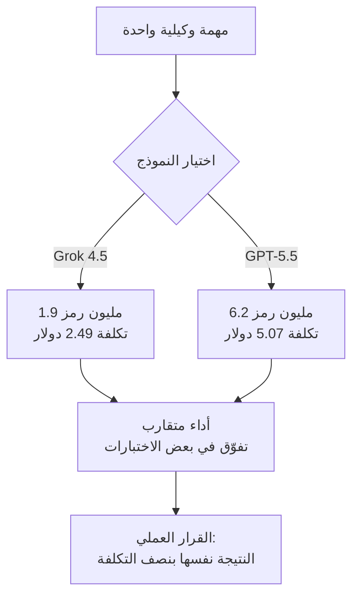

على مدى الأرباع القليلة الماضية، كان التنافس بين النماذج المتقدمة يدور حول نقطة أو نقطتين في الاختبارات المعيارية. لكن في 8 يوليو 2026، غيّر إصدار Grok 4.5 من SpaceXAI طبيعة السؤال نفسه. فحين يقترب أداء نموذج ما من Opus 4.8 وGPT-5.5، يصبح السؤال التالي ليس "من الأذكى" بل "من ينجز المهمة نفسها بتكلفة أقل". هذا المقال موجّه إلى قادة الهندسة وفرق الذكاء الاصطناعي الذين يديرون بنية تحتية ويدفعون فاتورة النماذج شهرياً. بالاستناد إلى الأرقام المعلنة لـ Grok 4.5، نناقش إلى أين تتجه اقتصاديات النماذج، وما تعنيه هذه الاتجاهات لمنصة استدلال متعددة المستأجرين مثل ThakiCloud.

## نظرة عامة: من سباق الاختبارات المعيارية إلى سباق الجدوى الاقتصادية

طوّرت SpaceXAI، إحدى شركات مجموعة xAI، نموذج Grok 4.5، وهو متاح فوراً عبر Grok Build وCursor وكونسول xAI. وصف إيلون ماسك هذا النموذج بأنه "نموذج بمستوى Opus"، وقد تفوّق فعلاً على Opus 4.8 وGPT-5.5 في بعض الاختبارات. لكن أبرز ما يميز هذا الإصدار ليس الأداء بل جدول الأسعار. يبلغ سعر Grok 4.5 دولارين لكل مليون رمز إدخال، وستة دولارات لكل مليون رمز إخراج. وبالمقارنة مع GPT-5.5 وGPT-5.6 اللذين يُصنّفان في فئة مماثلة بسعر خمسة دولارات للإدخال و30 دولاراً للإخراج، يصبح Grok 4.5 أرخص بنحو خمس المرات من حيث تكلفة الإخراج.

يتضح سبب أهمية هذا الهيكل السعري عند النزول إلى مستوى وحدة العمل الفعلية. تحمل نتائج الاختبارات المعيارية معنى على لوحات الصدارة، لكن ما يحدد الفاتورة فعلياً هو عدد الرموز المستهلكة فعلاً لكل مهمة مضروباً في سعر الوحدة. وهنا بالتحديد يوسّع Grok 4.5 الفجوة بشكل كبير.

## ما هو هذا النموذج: أداء متقارب وتكلفة متباعدة

لنكن صريحين بشأن الأداء أولاً. لا يتفوّق Grok 4.5 في كل الاختبارات المعيارية. فيما يلي الأرقام المعلنة كما وردت:

- في اختبار Terminal Bench 2.1، سجّل Grok 4.5 نسبة 83.3 بالمئة، وهي متساوية تقريباً مع نسبة GPT-5.5 البالغة 83.4 بالمئة.
- في مؤشر Coding Agent Index، سجّل 76 نقطة، وهو مستوى مطابق لـ GPT-5.5 عند تشغيله في بيئة Codex.
- في اختبار DeepSWE 1.1، سجّل 53 بالمئة، متأخراً بفارق كبير عن نسبة GPT-5.5 البالغة 67 بالمئة.
- في مؤشر الذكاء الخاص بـ Artificial Analysis، سجّل 54 نقطة، وهو رقم قريب من نقاط GPT-5.5 البالغة 55.

باختصار، يقف Grok 4.5 نداً لأفضل النماذج في مهام البرمجة ووكلاء الطرفية، لكنه ما زال متأخراً في المهمة الهندسية البرمجية الصعبة الممثلة باختبار DeepSWE. أي أن Grok 4.5 ليس "النموذج الذي يتفوّق على الجميع"، بل هو "النموذج الذي ينجز معظم المهام العملية قريباً من القمة".

وهنا يدخل عنصر الجدوى الاقتصادية إلى المشهد. فيما يلي الأرقام المعلنة لمهمة وكيلية فعلية واحدة:

- تكلفة المهمة الواحدة: 2.49 دولار لـ Grok 4.5 على Grok Build، مقابل 5.07 دولار لـ GPT-5.5 على Codex.
- متوسط الرموز المستهلكة لكل مهمة: 1.9 مليون رمز لـ Grok 4.5، مقابل 6.2 مليون رمز لـ GPT-5.5.

إذا كان الفارق في الأداء بضع نقاط مئوية فقط، فإن الفارق في التكلفة يتجاوز الضعف، وفي استهلاك الرموز يتجاوز ثلاثة أضعاف. قد يبدو هذا سطراً واحداً في جدول اختبارات معيارية، لكن في بيئة تشغيلية تعالج آلاف المهام يومياً، يغيّر هذا الفارق مرتبة الفاتورة الشهرية بأكملها.

## لماذا يهم هذا التوجه الآن

الإشارة التي يحملها هذا الإصدار بسيطة. مع تقارب أداء النماذج المتقدمة نحو سقف مشترك، ينتقل معيار اختيار النموذج من "الأذكى" إلى "الذكاء الكافي بأقل تكلفة". وكما أشارت The Decoder، فحين تضيق الفجوة في الاختبارات المعيارية إلى هذا الحد، قد تفقد الفجوة نفسها أهميتها في الاختيار العملي.

تتقاطع هذه الرؤية تماماً مع مبدأ تناولناه في مقال سابق. فمعظم أعمال الوكلاء ليست مسائل إبداعية معقدة، بل مهام منظّمة مثل التصنيف والتلخيص والتوجيه والعرض. وجودة هذا النوع من المهام تتحدد بحواجز الحماية المضمّنة في الكود أكثر من ذكاء النموذج نفسه. وإذا صح ذلك، فإن توجيه المهام المنظّمة إلى نموذج أرخص، والاحتفاظ بالنموذج الأعلى للاستدلال الصعب حقاً، يصبح خياراً منطقياً. ويوسّع Grok 4.5 نطاق الخيارات المتاحة في فئة "الرخيص لكن الذكي بما يكفي".

في المقابل، هناك نقطة تستحق الانتباه. فانخفاض استهلاك الرموز إلى الثلث لكل مهمة لا يتعلق فقط بسعر الوحدة، بل قد يعني أن النموذج ينجز المهمة نفسها بعدد أقل من الجولات، وهو ما ينعكس إيجاباً على زمن الاستجابة والإنتاجية أيضاً. غير أن هذا الرقم مأخوذ من بيئة اختبار محددة (Grok Build مقابل Codex)، وينبغي التحقق منه بقياس ذاتي على عبء العمل الفعلي.

## الأثر على منتجات ThakiCloud

منصة ai-platform التابعة لـ ThakiCloud هي منصة استدلال متعددة المستأجرين، تخدم النماذج لبيئات عملاء متنوعة فوق جدولة موارد GPU المبنية على K8s وKueue. ويحمل إصدار مثل Grok 4.5 دلالة على مستويين بالنسبة لنا.

المستوى الأول هو اقتصاديات توجيه النماذج. نعتمد بالفعل على تقسيم مستويات النماذج بحسب طبيعة العمل: المستوى الرخيص للاستكشاف والتصنيف، والمستوى المتوسط للتنفيذ والمراجعة، والمستوى الأعلى للهندسة المعمارية والاستدلال المعقد. وحين يظهر نموذج يقارب أداء النماذج المتقدمة بأقل من نصف السعر، تتوسّع تغطية المستوى "الرخيص لكن الكافي"، وتتقلّص الحالات التي تستدعي استدعاء النموذج الأعلى. والنتيجة هي الحفاظ على الجودة نفسها بتكلفة إجمالية أقل. والمهم هنا أن يُبنى هذا القرار على جودة المخرجات الفعلية المقيسة بالكود، لا على الحدس البشري.

المستوى الثاني هو منطق التكلفة في البيئات المحلية والسيادية. بالنسبة للعملاء الذين لا يمكنهم إخراج بياناتهم من بيئتهم، مثل الجهات الحكومية والمالية الكورية أو المتطلبات المرتبطة بجهاز الاستخبارات الوطني، يصبح الاستضافة الذاتية شرطاً أساسياً. وفي هذه البيئات تكون موارد GPU محدودة، لذا فإن النموذج الذي يستهلك رموزاً أقل لكل مهمة يتيح للأجهزة نفسها معالجة طلبات متزامنة أكثر. أي أن كفاءة الرموز ليست مسألة فاتورة API فقط، بل هي أيضاً مسألة إنتاجية فعلية للعناقيد المحلية. وهذا بالضبط ما تتفوّق فيه ai-platform، حيث تُعزّز النماذج ذات الكفاءة العالية في الرموز هذه الميزة مباشرة.

أما المستوى الثالث فيتصل بمنظور الوكلاء عبر Paxis. Paxis هي مستوى التحكم الخاص بالسحابة الأصلية للوكلاء (Agent-Native Cloud) الذي يعمل فوق ai-platform، وينفّذ المهارات في بيئات معزولة، ويمرّر كل إجراء عبر بوابات سياسات وسجلات تدقيق. وتنحصر جدوى الوكلاء الاقتصادية في النهاية بـ "تكلفة النموذج اللازمة لإنجاز مهمة واحدة"، وظهور نموذج منخفض التكلفة وعالي الكفاءة يحسّن مباشرة الميزانية التشغيلية لكل تدفق عمل وكيلي. وهذا يؤكد مجدداً الفرضية القائلة إن الاستضافة الرخيصة هي ما يصنع جدوى اقتصادية للوكلاء.

## القيود والحجج المضادة

قبل الانجراف نحو التفاؤل المطلق، لا بد من النظر إلى الجانب الآخر. أولاً، معظم هذه الأرقام صادرة عن الشركة المزوّدة وعن جهات تحليل مبكّرة. ومعايير مثل Terminal Bench أو Coding Agent Index لا ترتبط ارتباطاً كاملاً بأعباء العمل الإنتاجية الفعلية. وكما توضّح الفجوة بين 53 بالمئة و67 بالمئة في اختبار DeepSWE 1.1، ما زالت النماذج الأعلى تحتفظ بتفوّقها في المهام الصعبة. وإذا دُفعت المهام الاستدلالية الصعبة نحو نموذج رخيص لمجرد رخص سعره، فقد ترتفع تكلفة إعادة المحاولة واستعادة الفشل إلى درجة تقلب المعادلة الإجمالية للتكلفة.

ثانياً، رقم الكفاءة البالغ 1.9 مليون رمز لكل مهمة مُقاس في بيئة محددة (Grok Build)، وقد لا يتكرر في إطار عمل وكيلي مختلف أو بنية تلقين مختلفة. واعتماد الأرقام التي تنشرها الشركة المزوّدة مباشرة على فاتورتك الخاصة أمر محفوف بالمخاطر، ويجب التحقق منه عبر قياس A/B ذاتي على مجموعة بيانات مرجعية.

ثالثاً، Grok 4.5 ليس نموذجاً مفتوح الأوزان، بل نموذج مغلق يُقدَّم عبر واجهة برمجة تطبيقات. وهذا يعني استحالة نشره مباشرة في البيئات المحلية التي تكون فيها سيادة البيانات شرطاً جوهرياً. وما زال العملاء ذوو المتطلبات السيادية بحاجة إلى نموذج مفتوح الأوزان قابل للاستضافة الذاتية، وتبقى الجدوى الاقتصادية لـ Grok 4.5 محصورة في أعباء العمل السحابية عبر واجهة برمجة التطبيقات.

في الخلاصة، يجسّد Grok 4.5 بشكل واضح اتجاهاً أوسع: حين يتقارب أداء النماذج المتقدمة، تنتقل المعركة التالية إلى الجدوى الاقتصادية. والفرق الأكثر نجاحاً في هذه المرحلة ليست تلك التي تطارد نقطة أو نقطتين إضافيتين في الاختبارات المعيارية، بل تلك التي تقيس فعلياً تكلفة المهمة الواحدة وكفاءة الرموز على عبء عملها الخاص، وتوجّه النماذج بناءً على تلك النتائج. وأتمتة هذا القياس وهذا التوجيه هي بالضبط ما نقوم به كل ليلة.

## المصادر

- [Introducing Grok 4.5 · Cursor](https://cursor.com/blog/grok-4-5)
- [SpaceXAI releases Grok 4.5, which Elon describes as an 'Opus-class model' · TechCrunch](https://techcrunch.com/2026/07/08/spacexai-releases-grok-4-5-which-elon-describes-as-an-opus-class-model/)
- [Grok 4.5 is so cheap compared to Fable 5 and GPT 5.5 that benchmark gaps may not matter much · The Decoder](https://the-decoder.com/grok-4-5-is-so-cheap-compared-to-fable-5-and-gpt-5-5-that-benchmark-gaps-may-not-matter-much/)
- [Grok 4.5 (high): Intelligence, Performance & Price Analysis · Artificial Analysis](https://artificialanalysis.ai/models/grok-4-5)
