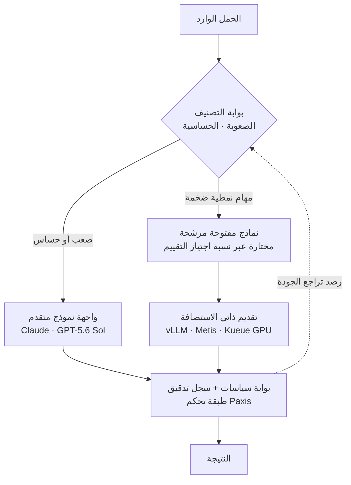

في الأسابيع الأخيرة، تحول حديث صناعة الذكاء الاصطناعي من سؤال "من الأذكى" إلى سؤال "من الأرخص". وجاء المشهد الأكثر دلالة من مايكروسوفت. فالشركة ذاتها التي وضعت OpenAI على المسار الذي تسير عليه اليوم، بدأت بتوجيه عشرات آلاف الطلبات الأسبوعية للذكاء الاصطناعي داخل Excel وOutlook إلى نماذجها الخاصة بدلاً من نماذج OpenAI وAnthropic. ولم يُخفِ مصطفى سليمان، مسؤول الذكاء الاصطناعي في مايكروسوفت، هذا التوجه، إذ قال: "Anthropic باهظة الثمن للغاية. هدفنا هو خفض هذه التكلفة والقضاء عليها في نهاية المطاف."

هذا المقال موجّه لقادة الهندسة وفرق الذكاء الاصطناعي وصنّاع القرار المسؤولين عن تكلفة الاستدلال في خدماتهم. سنوضح لماذا حرب التكاليف الدائرة اليوم ليست ضجيجاً عابراً بل تحولاً بنيوياً، ونضع دليلاً عملياً لترحيل إنفاق واجهات النماذج المتقدمة نحو النماذج المفتوحة والاستضافة الذاتية، ثم نختم بموقع ThakiCloud كطبقة تحكم تُنفذ هذا الترحيل فعلياً.

## ما الذي تغيّر

قرار شركة واحدة لا يصنع اتجاهاً عاماً. لكن إشارات متعددة تشير إلى الاتجاه نفسه تراكمت خلال أسابيع قليلة.

أولاً، كان تحرك مايكروسوفت دقيقاً. فالمهام الأصعب والأندر ما زالت تُرسل إلى النماذج المتقدمة، بينما استعادت الشركة إلى نماذجها الخاصة فقط المهام المتكررة عالية الحجم، مثل الرد على البريد الإلكتروني وتلخيص المحادثات وصيغ الجداول البسيطة. وأهمية هذا الأمر تكمن في أن تلك المهام المتكررة الضخمة هي بالضبط حيث يتدفق المال فعلياً ([تقرير SiliconANGLE](https://siliconangle.com/2026/07/07/microsoft-reportedly-ditching-openais-anthropics-ai-models-favor-cut-costs/)).

ثانياً، تتجه الشركات الأمريكية نحو النماذج الصينية المفتوحة هرباً من الأسعار. وبحسب تقرير CNBC، عالجت النماذج الصينية أكثر من 30 بالمئة من استخدام الذكاء الاصطناعي لدى الشركات الأمريكية على إحدى منصات التوجيه الرئيسية، وبلغت ذروتها عند 46 بالمئة، مقارنة بمتوسط 11 بالمئة قبل عام واحد فقط. وتكاليفها أقل بنسبة تتراوح بين 60 و90 بالمئة، وفي بعض اختبارات الأداء الخاصة بالوكلاء ضاقت الفجوة مع أفضل النماذج الأمريكية إلى نقطة واحدة فقط ([تقرير CNBC](https://www.cnbc.com/2026/07/07/chinese-ai-models-costs-us-openai-anthropic.html)).

ثالثاً، ظهرت إشارة إلى فائض في العرض. فقد أعلنت Meta عزمها إنشاء عمل سحابي لبيع قدرة الحوسبة "الفائضة" الخاصة بالذكاء الاصطناعي، وهو ما يعني عملياً تحويل الاعتراف بالإفراط في البناء إلى نموذج عمل ([تقرير CNBC](https://www.cnbc.com/2026/07/01/meta-stock-cloud-ai-compute.html)).

رابعاً، تفاعلت الأسواق. ففي أواخر يونيو، تبخر ما يزيد على تريليون دولار من القيمة السوقية لأسهم أشباه الموصلات والشركات المرتبطة بالذكاء الاصطناعي خلال أيام معدودة، وبدأ وول ستريت يتساءل عمّا إذا كان هذا الإنفاق الهائل قابلاً للاسترداد فعلاً (نحو 1.3 تريليون دولار وفق تجميع رويترز، غير مؤكد ولغرض المرجعية فقط).

القاسم المشترك بين هذه الإشارات ليس تراجع أداء النماذج المتقدمة، فأداؤها في الواقع يستمر في التحسن. المشكلة أن حتى أكبر العملاء لم يعودوا يقبلون الافتراض القائل باستخدام أفضل نموذج لكل مهمة ودفع أعلى سعر مقابل ذلك.

كما أن الأسعار نفسها تنخفض بسرعة. فنموذج GPT-5.6 Sol الذي أطلقته OpenAI مؤخراً يُسعَّر بنحو 5 دولارات لكل مليون رمز إدخال و30 دولاراً لكل مليون رمز إخراج، وهو انخفاض حاد في تكلفة الرمز مقارنة بالجيل السابق ([تقرير CNBC](https://www.cnbc.com/2026/07/08/openai-expanding-gpt-5point6-ai-model-release-ending-government-limits.html)). وهذا يعني أن مختبرات النماذج المتقدمة نفسها دخلت في حرب أسعار فيما بينها. لم تعد الجبهة الأمامية حرب ذكاء، بل تحولت إلى حرب قيمة.

## لماذا الآن

اندلعت حرب التكاليف الآن بسبب طبيعة توزّع الأحمال العملية.

عند تفكيك ما يعالجه الوكلاء يومياً، يتضح انقسام واضح في الطبيعة. من جهة، هناك استدلال صعب فعلياً: قرارات تصميم غامضة، أخطاء برمجية دقيقة، وتفكيك مشكلات لم يسبق مواجهتها. ومن جهة أخرى، هناك مهام نمطية ضخمة الحجم: التصنيف والتوجيه والتلخيص وفحص المواصفات والردود ذات الصيغة الثابتة. ومن حيث العدد، تهيمن هذه الفئة الأخيرة بشكل ساحق.

كان الافتراض المالي لمختبرات النماذج المتقدمة بسيطاً: أن الشركات حول العالم ستستمر في معالجة مليارات هذه الطلبات الصغيرة إلى الأبد باستخدام نماذج باهظة الثمن. وكان ذلك النهر اللامتناهي من الرموز هو الأساس الذي استندت إليه التقييمات المرتفعة لتلك المختبرات.

لكن جودة المهام النمطية تُحدَّدها الضوابط الحاكمة أكثر مما يُحدَّدها ذكاء النموذج. تذبذب صيغة الإخراج لا يعني نقص قدرة النموذج، بل يعني أن الصيغة طُلبت نثراً بدلاً من فرضها. فحين تفرض الشيفرة البرمجية الحد الأقصى للطول ومجموعة القيم المسموحة ومواصفات العرض ومعايير الاجتياز، تخرج تلك المهمة بثبات حتى من نماذج مفتوحة أرخص بكثير. وفي اللحظة التي يصبح فيها "الجيد الكافي" متاحاً بجزء يسير من السعر، تصبح استعادة نهر المهام الضخمة قراراً منطقياً. وهذا بالضبط ما فعلته مايكروسوفت.

## من المتقدم إلى المفتوح: دليل الترحيل العملي

فكيف يُنقل هذا النهر عملياً. تغيير النموذج بشكل ارتجالي أمر محفوف بالمخاطر. الترحيل الموثوق يمر بخمس خطوات.

أولاً، تصنيف الحمل. تُقسَّم كل طلبية على محورين: الصعوبة والحساسية. تبقى المهام الصعبة أو الحساسة على النماذج المتقدمة، بينما تُوضَع علامة على المهام النمطية عالية الحجم فقط باعتبارها هدفاً للترحيل.

ثانياً، تقييم البدائل المرشحة. لكل مهمة مُعلَّمة للترحيل، تُقيَّم نماذج مفتوحة مرشحة باستخدام بيانات فعلية. والعنصر الجوهري هنا هو نسبة الاجتياز التي تحسبها الشيفرة البرمجية، لا الانطباع البشري. تُختبر المخرجات الفعلية مقابل فحوصات المواصفات، ويُستبعد أي مرشح لا يبلغ الحد الأدنى المطلوب.

ثالثاً، بناء التوجيه. تُعرَّف في مكان واحد القواعد التي تحدد أي نموذج يعالج أي نوع من المهام. هذه القواعد يجب أن تكون مصدر الحقيقة الوحيد حتى يسهل لاحقاً استبدال النموذج أو التراجع عنه.

رابعاً، الاستضافة الذاتية للنموذج المفتوح. يُنشر النموذج المفتوح المختار على البنية التحتية الخاصة بالشركة باستخدام محرك تقديم مثل vLLM. في هذه الخطوة تتحقق مزايا النشر المحلي والسيادة على البيانات وانخفاض التكلفة لكل وحدة.

أخيراً، التحقق والتراجع. بعد الترحيل، تستمر عملية قياس الجودة، وإذا تراجعت نسبة الاجتياز، تُعاد تلك المهمة تحديداً إلى النماذج المتقدمة. الترحيل بلا مسار للتراجع ليس ترحيلاً بل مقامرة.

شارك أحد المطورين على منصة X أن هذا النهج خفّض إنفاقه الشهري على واجهات البرمجة من 60 ألف دولار إلى 12 ألف دولار عبر النماذج المفتوحة، أي بنسبة تقارب 80 بالمئة. ولم يتسنَّ التحقق من المنشور الأصلي بشكل مستقل لأن الوصول إليه كان مقيداً، لذا يُعامَل الرقم باعتباره غير مؤكد ولغرض المرجعية فقط. غير أن حجم الوفورات نفسه يتسق مع البيانات الموثقة: التكلفة الأقل بنسبة 60 إلى 90 بالمئة للنماذج الصينية المفتوحة، وحرب الأسعار الدائرة بين مختبرات النماذج المتقدمة نفسها، تشير جميعها إلى الاتجاه ذاته.

## دلالات الأمر على منتجات ThakiCloud

هذا الدليل واضح من الناحية المفاهيمية، لكن تنفيذه فعلياً يتطلب أمرين: بنية تحتية تقدّم النماذج المفتوحة بتكلفة منخفضة، وطبقة تحكم تختار النموذج المناسب لكل مهمة مع ضمان الأمان عبر السياسات والتدقيق. توفر ThakiCloud هذين المحورين معاً من خلال منتجين.

### ai-platform: بنية تحتية منخفضة التكلفة للتقديم

ai-platform هي بنية تحتية لتقديم أنظمة الذكاء الاصطناعي والتعلم الآلي مبنية على Kubernetes. تُجدوِل وحدات معالجة الرسوميات عبر Kueue، وتُقدّم النماذج المفتوحة عبر vLLM، وتدعم العزل متعدد المستأجرين والنشر المحلي. الخطوة الرابعة من دليل الترحيل، أي نشر النموذج المفتوح المختار على البنية التحتية الخاصة لخفض التكلفة لكل وحدة، تحدث في هذه الطبقة تحديداً. وبالنسبة للعملاء الذين لا يمكنهم إرسال بياناتهم خارج نطاقهم، مثل الجهات الحكومية أو الصناعات الخاضعة للتنظيم، يصبح النشر السيادي عاملاً حاسماً، وهو متطلب لا تستطيع واجهات النماذج المتقدمة تلبيته من الأساس.

### Paxis: السحابة الأصيلة للوكلاء التي تُنفذ الترحيل

Paxis هي طبقة التحكم الأصيلة للوكلاء التي تعمل فوق ai-platform. فكما تتعامل السحابة التقليدية مع الأجهزة الافتراضية وقواعد البيانات كموارد من الدرجة الأولى، تتعامل Paxis مع المهارات والأدوات والسياسات وسجلات التدقيق كموارد من الدرجة الأولى. ومن منظور دليل الترحيل، يُعد توجيه النموذج الجزء الأهم. تستخدم Paxis ملف `models.yaml` كمصدر حقيقة وحيد لتوجيه Claude وOpenAI وOllama وKimi وMiniMax، بالإضافة إلى تقديم vLLM الخاص بـ ai-platform (المسمى Metis)، جميعها من مكان واحد. وهذا يقابل تماماً الخطوتين الثالثة والخامسة من الدليل المذكور أعلاه: تحديد النموذج لكل نوع مهمة، وإعادة مهمة بعينها إلى النموذج المتقدم لحظة تراجع الجودة، وهو قرار يُتخذ في هذه الطبقة.

إضافة إلى ذلك، توفر Paxis طبقة مهارات تختار من بين أكثر من 960 مهارة باستخدام خوارزمية BM25، وتنفيذاً معزولاً داخل صندوق رملي، ومحرك معرفة قائماً على الويكي، وتنسيقاً متعدد الوكلاء عبر رسم بياني موجه (DAG)، وموصلات MCP مع إعادة اتصال تلقائية عبر OAuth. ويمر كل إجراء يقوم به الوكيل عبر بوابة سياسات وسجل تدقيق. بمعنى آخر، يمكن التحول إلى نماذج أرخص مع الاحتفاظ بالقدرة على تتبع ما عولج بأي نموذج بدقة.

يمكن تلخيص العلاقة بين المنتجين في جملة واحدة: التقديم منخفض التكلفة (ai-platform) هو ما يصنع اقتصاديات الوكيل (Paxis). فبدون بنية تحتية قادرة على تشغيل النماذج المفتوحة بتكلفة منخفضة، تبقى قواعد التوجيه مجرد خطة على الورق، وبدون توجيه وسياسات، يتحول التقديم الرخيص إلى مخاطرة لا يمكن التحكم بها. تحويل الترحيل إلى عمل حقيقي يتطلب المحورين معاً في آنٍ واحد. وتجدر الإشارة إلى أن Paxis ما زالت في مرحلة إثبات المفهوم، وقد تتغير واجهاتها ومخططاتها بسرعة.

## الحدود والحجج المضادة

إنهاء هذا العرض بتفاؤل مطلق لن يكون أمانة. الحجج المضادة واضحة.

أولاً، فجوات الجودة ما زالت قائمة. المجال الذي ضيّقت فيه النماذج المفتوحة الفارق هو المهام النمطية وبعض اختبارات الأداء الخاصة بالوكلاء. أما في تفكيك مشكلات لم تُشاهَد من قبل أو الاستدلال الدقيق عبر سياق طويل، فما زالت النماذج المتقدمة متقدمة. محاولة نقل كل شيء إلى النماذج المفتوحة تعني إعادة دفع ما وُفّر في المهام الضخمة على شكل تكاليف فشل في المهام الصعبة. جوهر الترحيل ليس الاستبدال الشامل بل التصنيف الدقيق.

ثانياً، الاستضافة الذاتية ليست مجانية. استدعاء واجهة برمجية ينقل العبء التشغيلي إلى المختبر، بينما الاستضافة الذاتية تعني تحمّل توفير وحدات معالجة الرسوميات وتحسين التقديم والاستجابة للأعطال بشكل مباشر. وبعد احتساب النفقات الرأسمالية الأولية والقوى العاملة التشغيلية، قد تكون استدعاءات الواجهة البرمجية في الواقع أرخص عند حجوم الحركة الصغيرة. نقطة التعادل تعتمد على حجم الحركة ومعدل الاستغلال.

ثالثاً، لا ينبغي التسليم بأرقام الاختبارات المتداولة كما هي. أثناء إعداد هذا المقال، لم يتسنَّ تتبّع بعض جداول ومقاييس الاختبارات إلى مصدر أصلي موثّق، فاستُبعدت من متن المقال. ينبغي أن تُبنى مقارنة النماذج فقط على نتائج قِيست مباشرة على الحمل الخاص بالشركة. اختبارات الآخرين ليست سوى نقطة انطلاق لا أكثر.

رابعاً، التوجيه نفسه يضيف تعقيداً. نظام يتنقّل بين نماذج متعددة أصعب في التشخيص والمراقبة من نظام أحادي النموذج. وهذا بالضبط سبب كون بوابات السياسات وسجلات التدقيق ليست اختيارية بل ضرورية.

ومع ذلك، فإن الاتجاه واضح. فحتى مايكروسوفت ترفض اليوم دفع أسعار النماذج المتقدمة مقابل كل مهمة، والسؤال الحقيقي هو من سيستمر في دفع ذلك السعر. القدرة على ترحيل الأحمال الضخمة بدقة إلى النماذج المفتوحة، والتحكم في ذلك الترحيل بأمان، ستكون كفاءة جوهرية في تشغيل الذكاء الاصطناعي خلال السنوات المقبلة. وتحتل ThakiCloud موقعاً يمكّنها من تقديم هذا الترحيل عبر البنية التحتية وطبقة التحكم معاً.

## المصادر

- [Microsoft reportedly ditching OpenAI's, Anthropic's AI models to cut costs (SiliconANGLE)](https://siliconangle.com/2026/07/07/microsoft-reportedly-ditching-openais-anthropics-ai-models-favor-cut-costs/)
- [Chinese AI models gain ground with US companies on cost (CNBC)](https://www.cnbc.com/2026/07/07/chinese-ai-models-costs-us-openai-anthropic.html)
- [Meta plans cloud business to sell AI compute (CNBC)](https://www.cnbc.com/2026/07/01/meta-stock-cloud-ai-compute.html)
- [OpenAI expands GPT-5.6 Sol access and pricing (CNBC)](https://www.cnbc.com/2026/07/08/openai-expanding-gpt-5point6-ai-model-release-ending-government-limits.html)
