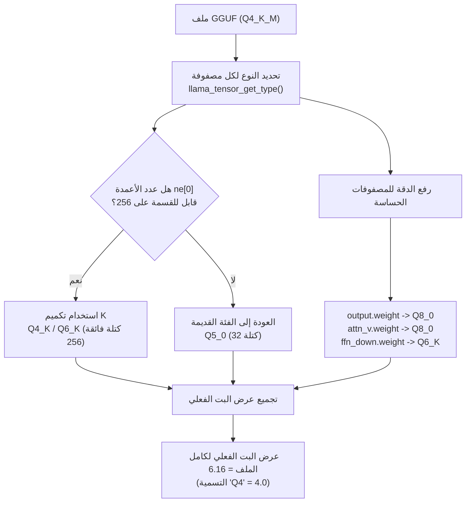

## نظرة عامة

إذا سبق لك تشغيل نموذج لغوي كبير محليا، فمن المرجح أنك رأيت تسميات مثل `Q4_K_M` و`Q5_K_M` و`Q8_0`. يتوقف معظم الناس عند فهم مفاده أن "Q4 يعني 4 بت، إذن لا بد أنه الأصغر والأسرع"، ثم يقومون بتحميل الملف وتشغيله مباشرة. لكن هذه التسمية تخفي أكثر مما تظهر. قلة قليلة من الناس فتحوا فعليا ملفا موسوما بـ `Q4_K_M` وتحققوا، مصفوفة تلو الأخرى، مما إذا كان ممتلئا حقا ببيانات ذات 4 بت.

هذا المقال موجه لقادة الهندسة، والممارسين المسؤولين عن تكلفة الاستدلال، والفرق التي تسعى لتقديم النماذج محليا (on-premises). قمنا بتحميل ملف GGUF لنموذج Qwen2.5-0.5B-Instruct على عدة مستويات تكميم، وقسنا أحجام الملفات الفعلية، وقمنا بتشريح ملف واحد من نوع `Q4_K_M` بشكل كامل مصفوفة تلو الأخرى. جاءت النتيجة مختلفة تماما عن الحدس. نوضح لماذا يهم فهم هذه الفجوة لتكلفة الخدمة وجودتها، وماذا يعني ذلك بالنسبة لبنية الاستدلال التحتية لدى ThakiCloud.

ولنذكر الخلاصة أولا: في ملف `Q4_K_M` الخاص بهذا النموذج، لم تشكل المصفوفات التي هي فعلا تكميم K رباعي البت (Q4_K) سوى 6.1 بالمئة من إجمالي سعة الأوزان، وكان عرض البت الفعلي للملف ليس 4 بل **6.16 بت**. أي أن التسمية كانت أقرب إلى كذبة تقريبا.

## ما هي هذه التقنية

GGUF هو صيغة نموذج أحادية الملف تستخدم في منظومة llama.cpp. يجمع ملف واحد بين البيانات الوصفية (البنية المعمارية، أداة تجزئة الرموز، المعاملات الفائقة) وأوزان جميع المصفوفات المكممة معا. النقطة الجوهرية هي أن **كل مصفوفة يمكن أن تستخدم نوع تكميم مختلفا**. لذلك فإن تسمية على مستوى الملف مثل `Q4_K_M` لا تشير إلا إلى "النوع السائد"، وليس إلى أن الملف بأكمله من ذلك النوع.

تنقسم أنواع التكميم في llama.cpp إلى فئتين رئيسيتين. الأولى هي **الفئة القديمة (legacy)** (Q4_0، Q5_0، Q8_0) التي تجمع 32 وزنا في كتلة واحدة. والثانية هي **فئة تكميم K** (Q4_K، Q5_K، Q6_K) التي تجمع 256 وزنا في كتلة فائقة واحدة (superblock). ولأن تكميم K يقسم المقياس (scale) والحد الأدنى داخل الكتلة الفائقة بشكل أدق، فإنه يقدم جودة أفضل من الفئة القديمة عند نفس عرض البت. الحرف `K` في `Q4_K_M` يشير إلى تكميم K هذا، بينما `M` يعني الإعداد المسبق "المتوسط" الذي يرفع بعض المصفوفات الحساسة إلى دقة أعلى (Q6_K).

بالنظر عن قرب إلى بنية الكتلة الفائقة، يتضح سبب كفاءة تكميم K الأعلى. على سبيل المثال، يخزن Q4_K 256 وزنا في 144 بايت. من ذلك، تشغل القيم النقية ذات 4 بت مساحة 256 × 4 بت = 128 بايت، أما البايتات الـ16 المتبقية فهي بيانات وصفية تقسم الكتلة الفائقة إلى 8 كتل فرعية وتعيد تكميم مقياس كل منها وحدها الأدنى بـ6 بت. بعبارة أخرى، القيم نفسها ذات 4 بت، لكن الاحتفاظ بمقاييس دقيقة لإعادة بنائها يقلل من الخطأ. وهذا يتباين مع Q4_0 القديم الذي يحتفظ بمقياس واحد فقط لكل 32 وزنا. لذا فإن عرض البت الفعلي لـ Q4_K هو 144 × 8 ÷ 256 = 4.5 بت، أكبر قليلا من 4 بت النقية، لكن الجودة أكثر استقرارا بكثير.

هناك قيد حاسم واحد هنا. **لا يمكن استخدام تكميم K إلا عندما يكون عدد أعمدة المصفوفة (`ne[0]` بمصطلحات ggml) قابلا للقسمة على 256.** والسبب أن الكتلة الفائقة تعمل بوحدات من 256. وإذا لم يتحقق هذا الشرط، فإن llama.cpp يعود بصمت إلى الفئة القديمة (غالبا Q5_0). هذه القاعدة الواحدة تفسر نتيجة تجربة اليوم بأكملها.



## الإعداد والتكامل

يمكن إعادة إنتاج التجربة دون أي تبعيات إضافية. تعيد واجهة برمجة تطبيقات Hugging Face عدد البايتات الفعلي لحجم الملف، ويمكن قراءة أنواع المصفوفات مباشرة باستخدام قارئ `gguf`.

```bash
# 1) تثبيت أداة القراءة والتحميل
pip install gguf huggingface_hub

# 2) تحميل ملف واحد فقط من نوع Q4_K_M (أقل من 500 ميجابايت لأنه نموذج 0.5B)
hf download Qwen/Qwen2.5-0.5B-Instruct-GGUF \
  qwen2.5-0.5b-instruct-q4_k_m.gguf --local-dir ./gguf
```

فيما يلي الشيفرة الخاصة بفتح أنواع مصفوفات الملف المحمل. يحتوي رأس (header) ملف GGUF على اسم كل مصفوفة وأبعادها ورقم نوع ggml مباشرة، لذا فإن مجرد تجميع هذه القيم يكشف بالضبط ما الذي يملأ الملف فعليا.

```python
from collections import Counter
from gguf import GGUFReader

r = GGUFReader("gguf/qwen2.5-0.5b-instruct-q4_k_m.gguf")
hist = Counter()
for t in r.tensors:
    hist[t.tensor_type.name] += 1
    # التحقق من النوع الفعلي لبعض المصفوفات التمثيلية
    if t.name in ("token_embd.weight", "output.weight",
                  "blk.0.attn_v.weight", "blk.0.ffn_down.weight",
                  "blk.0.attn_q.weight"):
        print(f"{t.name:26s} {t.shape} -> {t.tensor_type.name}")
print(dict(hist))
```

عدد البايتات لكل كتلة يأتي مباشرة من تعريفات ggml. فمثلا، يخزن Q4_K 256 وزنا في 144 بايت أي 4.5 بت لكل وزن، ويخزن Q6_K 256 وزنا في 210 بايت أي 6.5625 بت لكل وزن، بينما يخزن Q5_0 القديم 32 وزنا في 22 بايت أي 5.5 بت لكل وزن. وبجمع (عدد العناصر ÷ حجم الكتلة) × بايتات الكتلة لكل مصفوفة، يمكن حساب عرض البت الفعلي للملف بدقة.

## نتائج التجربة الفعلية

أولا، أحجام الملفات. هذه هي القيم المقاسة فعليا لنفس النموذج بعد تحميله على 7 مستويات تكميم، مقارنة بالأصل بصيغة fp16 (1266 ميجابايت).

| التكميم | حجم الملف | مقارنة بـ fp16 |
|---|---|---|
| Q2_K | 415.2 MB | 32.8% |
| Q3_K_M | 432.0 MB | 34.1% |
| Q4_0 | 428.7 MB | 33.9% |
| **Q4_K_M** | **491.4 MB** | **38.8%** |
| Q5_K_M | 522.2 MB | 41.2% |
| Q6_K | 650.4 MB | 51.4% |
| Q8_0 | 675.7 MB | 53.4% |

هناك ما يثير الغرابة بالفعل هنا. الفرق بين Q2_K (415 ميجابايت) و Q4_0 (429 ميجابايت) هو 14 ميجابايت فقط. خفضنا عدد البتات إلى النصف، لكن حجم الملف لم ينخفض تقريبا. بل إن `Q4_K_M` (491 ميجابايت) أكبر فعليا من `Q4_0` (429 ميجابايت) ذي 4 بت النقية. بالنظر إلى الأسماء وحدها، هذه النتيجة غير مفهومة.

يتضح السبب الحقيقي عند فتح ملف `Q4_K_M` مصفوفة تلو الأخرى. فيما يلي توزيع الأنواع عبر 291 مصفوفة فيه.

| النوع الفعلي | عدد المصفوفات | عرض البت الاسمي | حصة سعة الأوزان |
|---|---|---|---|
| Q5_0 | 133 | 5.5 | 54.9% |
| Q8_0 | 13 | 8.5 | 30.1% |
| Q6_K | 12 | 6.5625 | 8.8% |
| Q4_K | 12 | 4.5 | 6.1% |
| F32 (norm/bias) | 121 | 32.0 | 0.1% |


على الرغم من تسمية `Q4_K_M`، لم يشكل تكميم K الحقيقي رباعي البت (Q4_K) سوى **6.1 بالمئة** من إجمالي سعة الأوزان. وبدلا من ذلك، استحوذ النوع القديم Q5_0 ذو 5.5 بت على أكثر من النصف (54.9 بالمئة)، واستهلك Q8_0 ذو 8.5 بت نسبة 30 بالمئة. وعند حساب عرض البت الفعلي لكامل الملف، نحصل على **6.16 بت**، أي أكثر من 1.5 ضعف الـ4 بت التي توحي بها التسمية.

بالتحقق من المصفوفات التمثيلية واحدة تلو الأخرى، يتضح النمط بجلاء. كانت الأنواع المقاسة فعليا كما يلي:

- `token_embd.weight` (896 × 151936) -> **Q5_0**
- `output.weight` (896 × 151936) -> **Q8_0**
- `blk.0.ffn_down.weight` (4864 × 896) -> **Q6_K**
- `blk.0.attn_v.weight` (896 × 128) -> **Q8_0**
- `blk.0.attn_q.weight` (896 × 896) -> **Q5_0**

هل تلاحظ النمط؟ لم تظهر المصفوفات التي تحمل تكميم K (Q4_K، Q6_K) إلا حيث كان عدد الأعمدة `ne[0]` يساوي 4864، كما في `ffn_down`. والرقم 4864 قابل للقسمة على 256 (19 × 256). أما معظم المصفوفات الأخرى فعدد أعمدتها `ne[0]` يساوي 896، والرقم 896 غير قابل للقسمة على 256 (3.5 × 256). لذلك لم تتمكن هذه المصفوفات من استخدام تكميم K إطلاقا وعادت جميعها إلى الفئة القديمة Q5_0. وإذا أضفنا إلى ذلك رفع الدقة (Q5_0، Q8_0) للمصفوفات الحساسة للجودة مثل التضمين (embedding) والمخرجات وقيمة الانتباه (attention value)، نحصل على ملف موسوم بـ `Q4_K_M` لكن جوهره الفعلي كتل تتراوح بين 5.5 و8.5 بت.

هذا بالضبط مصدر عرض البت الفعلي البالغ 6.16. يحتوي هذا الملف على ما مجموعه 630 مليون وزن خاضع للتكميم، مخزنة في نحو 485 ميجابايت من البايتات. 485,452,288 بايت × 8 ÷ 630,167,424 وزنا = 6.16 بت لكل وزن. وبإضافة نحو 6 ميجابايت من البيانات الوصفية للملف وحشو المحاذاة (alignment padding)، تتطابق النتيجة تماما مع حجم الملف الفعلي البالغ 491 ميجابايت. وتطابق الحساب مع حجم الملف هو أيضا دليل على دقة قراءة أنواع المصفوفات.

هذا يفسر أيضا النقطتين الغريبتين في جدول أحجام الملفات. السبب في أن Q2_K (415 ميجابايت) أصغر بالكاد من Q4_0 (429 ميجابايت) هو أن مصفوفات التضمين والمخرجات في هذا النموذج الصغير تشكل حصة كبيرة من إجمالي الأوزان، وهي تبقى بدقة عالية عند أي مستوى تكميم. مهما خفضت عدد البتات، تبقى تكلفة ثابتة في القاع لا تنخفض. أما سبب كون `Q4_K_M` أكبر من `Q4_0` النقي ذي 4 بت، فهو أن الإعداد المسبق `M` دفع ثمن رفع المصفوفات الحساسة إلى Q6_K وQ8_0 على شكل زيادة في حجم الملف. رقم التسمية أقل، لكن عرض البت الفعلي أعلى في الواقع.

وباختصار، أظهرت هذه التجربة من خلال القياس ثلاث حقائق. أولا، تشير التسمية على مستوى الملف إلى النوع السائد فقط ولا تضمن عرض البت الفعلي. ثانيا، في النماذج الصغيرة التي لا يكون فيها الحجم المخفي (hidden size) من مضاعفات 256، يتعطل تكميم K إلى حد كبير، مما يوسع الفجوة بين التسمية والجوهر. ثالثا، تشكل مصفوفات التضمين والمخرجات في النماذج الصغيرة حصة كبيرة من إجمالي السعة، وبمجرد الاحتفاظ بها بدقة عالية، تتضاءل بشكل كبير وفورات "التكميم الرباعي البت" المفترضة.

## الدلالات على منتجات ThakiCloud

اقتصرت هذه التجربة على تشريح نموذج صغير واحد، لكن دروسها تنتقل مباشرة إلى بنية الخدمة الإنتاجية التحتية. تقدم منصة ai-platform التابعة لـ ThakiCloud النماذج لبيئات عملاء متنوعة فوق Kubernetes وجدولة موارد GPU القائمة على Kueue. وفي هذا السياق، فإن "أي تكميم نختار" ليس مسألة ذوق، بل قرار يحدد تخصيص ذاكرة GPU، وحجم الدُفعة (batch)، وفي النهاية التكلفة لكل رمز (token).

الثقة بالتسمية كما هي تخل بتخطيط السعة. إذا افترضت أن `Q4_K_M` يعني "4 بت، إذن ربع الحجم الأصلي" وخصصت ذاكرة GPU على هذا الأساس، فستجد، كما في التجربة أعلاه، أنه يستهلك فعليا نحو 40 بالمئة من الأصل، وتنفد فتحات الدُفعات أسرع مما هو متوقع. يهم هذا الأمر بشكل خاص في الخدمة متعددة المستأجرين (multi-tenant)، حيث يجب حشر العديد من النماذج الصغيرة بكثافة على عقدة واحدة. وهناك، فإن الفرق بين قياس عرض البت الفعلي فعليا والاكتفاء بالثقة بالتسمية ينعكس مباشرة على عدد النماذج التي يمكن للعقدة استيعابها. لهذا السبب بالتحديد نتحقق من ملفات GGUF مصفوفة تلو الأخرى عند بناء صور الخدمة (serving images). وبالنسبة للعملاء الذين يتطلبون استضافة ذاتية أو نشرا محليا أو سياديا على وجه الخصوص، تتحول عادة القياس هذه بدلا من الافتراض إلى ميزة تنافسية حقيقية من حيث التكلفة.

جعل هذا التحقق نفسه مهمة قابلة للتكرار هو دور Paxis. وPaxis هي منصة التحكم الخاصة بـ ThakiCloud للسحابة الأصلية للوكلاء (Agent-Native Cloud) التي تعمل فوق ai-platform، وتتعامل مع المهارات والأدوات والسياسات وسجلات التدقيق كموارد من الدرجة الأولى. فإذا تم تسجيل تجربة اليوم، أي تحميل ملف GGUF وتجميع أنواع المصفوفات وإطلاق تحذير عند تجاوز عرض البت الفعلي حدا معينا، كمهارة واحدة، فإنها تعمل في بيئة معزولة (sandbox) وتمر جميع النتائج عبر بوابات السياسات وسجلات التدقيق. وبدلا من أن يفتح شخص الملف يدويا في كل مرة يصل فيها نموذج جديد إلى السجل، يعمل هيكل معتمد (validated skeleton) تلقائيا. هكذا يترابط الاقتصاد الذي تخلقه الخدمة منخفضة التكلفة (ai-platform) مع التنسيق (Paxis) الذي يجعل تلك الخدمة قابلة للتكرار بأمان.

## القيود والحجج المضادة

هناك بعض النقاط التي يجب توضيحها بشكل صريح.

أولا، هذه النتائج تقترب من حالة قصوى خاصة بنموذج Qwen2.5-0.5B الذي يبلغ حجمه المخفي 896. أما في النماذج الأكبر التي يكون فيها الحجم المخفي من مضاعفات 256 (مثل 4096 أو 8192)، فإن تكميم K يُطبق بشكل طبيعي، ويقترب عرض البت الفعلي لـ `Q4_K_M` كثيرا من التسمية، عند نحو 4.8 بت.

بعبارة أخرى، الدرس الصحيح ليس أن "التسمية كذبة دائما"، بل أن "الفجوة بين التسمية والجوهر تختلف بشكل كبير حسب بنية النموذج، وتكون أكبر كلما كان النموذج أصغر".

ثانيا، ليس بالضرورة أن يكون حجم الملف الكبير أمرا سيئا. فالاحتفاظ بمصفوفات التضمين والمخرجات بدقة عالية هو خيار متعمد لمنع انهيار الجودة في النماذج الصغيرة. بعبارة أخرى، ملف `Q4_K_M` هذا ليس ملفا "سيء الصنع"، بل هو نتيجة منطقية لرفع الدقة تلقائيا للحفاظ على الجودة في نموذج صغير. غير أن هذا الثمن لا يظهر في التسمية.

ثالثا، اقتصر هذا المقال على قياس بنية الملف وسعته، ولم يقس جودة الاستدلال الفعلية (الحيرة اللغوية perplexity، أو نتائج المعايير القياسية). وتتطلب العلاقة بين عرض البت والجودة تجربة منفصلة، نتركها موضوعا لمقال قادم. وما يمكن قوله هنا هو مبدأ تشغيلي واحد فقط: لا تخطط للسعة والذاكرة استنادا إلى التسمية، بل قسها فعليا.

الفرق بين الاكتفاء بالضغط على زر تشغيل نموذج محلي ومعرفة ما بداخل الملف فعليا يكمن بالضبط في عادة القياس هذه. خمس دقائق تقضيها في التحقق من الأرقام وراء التسمية يمكن أن تغير دقة خطة تكلفة الخدمة بأكملها.

## المصادر

- مستودع نموذج Qwen2.5-0.5B-Instruct-GGUF: [huggingface.co/Qwen/Qwen2.5-0.5B-Instruct-GGUF](https://huggingface.co/Qwen/Qwen2.5-0.5B-Instruct-GGUF)
- وثائق التكميم في llama.cpp: [github.com/ggml-org/llama.cpp](https://github.com/ggml-org/llama.cpp/blob/master/tools/quantize/README.md)
- تم قياس أحجام الملفات وتوزيعات أنواع المصفوفات وعروض البت الفعلية مباشرة من ملفات فعلية تم تحميلها من المستودع أعلاه.
