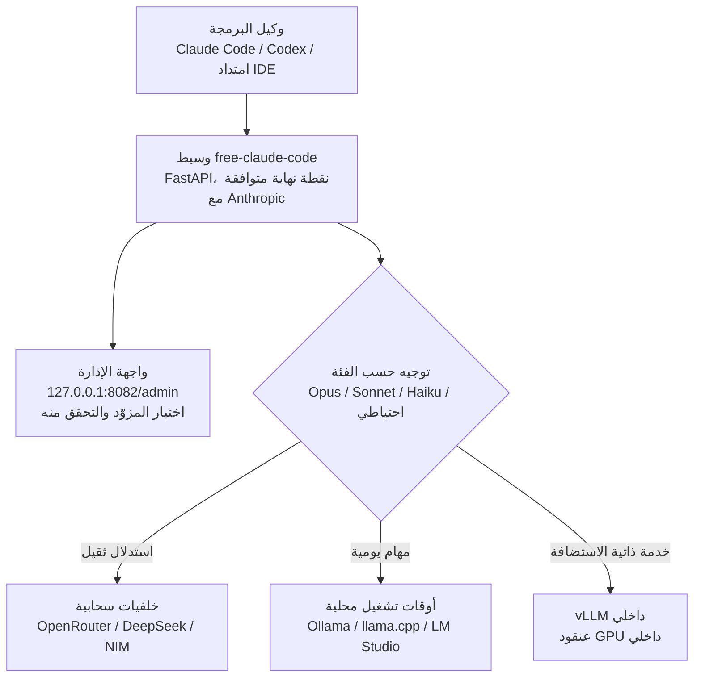

## نظرة عامة

أصبح Claude Code وCodex خلال العام الماضي من أكثر وكلاء البرمجة استخداماً داخل الطرفيات وبيئات التطوير المتكاملة. المشكلة أن كلا الوكيلين مرتبط ارتباطاً وثيقاً بواجهة برمجة تطبيقات سحابية واحدة، Anthropic بالنسبة لأحدهما وOpenAI للآخر. بالنسبة للفرق التي لا تستطيع، بموجب سياسات داخلية، إرسال الكود المصدري إلى واجهة خارجية، أو التي تعمل ضمن شبكات معزولة، أو التي تُشغّل بالفعل نماذج مفتوحة الأوزان على وحدات معالجة رسومية خاصة بها، يتحول هذا الارتباط إلى جدار حقيقي.

هذا المقال موجّه لقادة الهندسة الذين يوازنون بين تكلفة تشغيل وكلاء البرمجة وسيادة البيانات، وللممارسين الذين يسعون لتقديم النماذج داخل بنيتهم التحتية الخاصة. تناولنا بالفحص وسيطاً مفتوح المصدر يُدعى `free-claude-code` أثار اهتماماً واسعاً في مجتمعات المطورين مؤخراً، وذلك بالرجوع إلى المستودع الفعلي مباشرة. عُرف هذا المشروع بشعار تسويقي مثير للجدل نوعاً ما حول "التخلص من الاشتراك"، لكن الجانب المثير تقنياً يكمن في مكان آخر. فهو يحافظ على تجربة استخدام وكيل مُثبَت الجدارة، هو Claude Code، بينما يستبدل فقط النموذج القابع خلفه ببنية تحتية خاصة.

وللإيجاز منذ البداية: القيمة الجوهرية لهذا الوسيط ليست "المجانية" بل "العزل". فصل واجهة الوكيل عن خلفية النموذج يتيح نقل نفس سير العمل إلى نموذج مفتوح يعمل على وحدات معالجة رسومية داخلية. نستعرض هنا سبب أهمية هذا الفصل من منظور من يُشغّل بنية تحتية للذكاء الاصطناعي داخل مؤسسته، والقيود التي يجب أخذها بعين الاعتبار معه.

## ما هذه الأداة

`free-claude-code` هو خادم وسيط محلي مبني على FastAPI. يوفر نقطة نهاية متوافقة مع واجهة برمجة تطبيقات Anthropic، لذا فإن Claude Code CLI وCodex CLI وامتدادات VS Code وJetBrains ACP، وحتى بعض روبوتات المحادثة، تظنه خادم Anthropic الحقيقي وتتصل به مباشرة. من منظور الوكيل لم يتغير شيء، فقط النموذج الذي يعالج الطلب فعلياً هو الذي يُستبدَل من خلف الكواليس.

ما يميز هذا المشروع هو اتساع نطاق الخلفيات المدعومة. وفقاً لوصف المستودع، يمكن التبديل بين 24 مزوداً بين السحابي والمحلي من واجهة الإدارة، تشمل واجهات برمجة تطبيقات سحابية مثل NVIDIA NIM وOpenRouter وDeepSeek، إلى جانب أوقات تشغيل محلية مثل LM Studio وllama.cpp وOllama. بمعنى آخر، يمكن الاتصال بواجهة تجارية أو بنموذج مفتوح يعمل على وحدة معالجة رسومية خاصة بك.

بنية التوجيه أيضاً ليست مجرد مفتاح تبديل بسيط. يُقسّم Claude Code داخلياً العمل على ثلاث فئات من النماذج حسب الموقف: Opus وSonnet وHaiku. يُرسَل الاستدلال الثقيل إلى Opus، وتُرسَل المهام اليومية إلى Sonnet، ويُرسَل الاستكشاف الخفيف إلى Haiku. يتيح `free-claude-code` تعيين كل من هذه الفئات الثلاث، إضافة إلى حركة الاحتياط (fallback)، إلى نموذج خلفي مختلف. يبقى دعم البث (streaming) واستدعاء الأدوات (tool use) والاستدلال (reasoning) قائماً ضمن حدود ما يدعمه النموذج المستهدف. هذا التوجيه القائم على الفئات يتطابق تماماً مع مبدأ مطبَّق بالفعل داخل ThakiCloud: إرسال الاستكشاف إلى نموذج رخيص، والتنفيذ إلى نموذج متوسط، وحجز النموذج الأغلى لقرارات الهندسة المعمارية فقط.

يمكن تلخيص تدفق الطلب الكامل في المخطط التالي.



الفرق عن الطريقة السابقة واضح. حتى الآن، كان تشغيل وكيل برمجة على نموذج مفتوح يعني إما فرع (fork) الوكيل نفسه، أو بناء غلاف واجهة برمجة تطبيقات مختلف يدوياً لكل نموذج. يجمع هذا الوسيط طبقة التحويل هذه في مكان واحد، تاركاً الوكيل دون مساس بينما يتغير النموذج فقط.

## التثبيت والتكامل

يوفر المستودع مسارين للتثبيت. الأول هو تنزيل سكربت التثبيت وتشغيله دفعة واحدة.

```bash
curl -fsSL "https://github.com/Alishahryar1/free-claude-code/blob/main/scripts/install.sh?raw=1" | sh
```

يجهّز هذا السكربت `free-claude-code` نفسه مع `uv` وPython 3.14. إذا لم يكن Claude Code وCodex مثبّتَين، يتم تثبيتهما أيضاً، وهذا يتطلب وجود npm مسبقاً، أي أن Node.js يجب أن يكون مثبتاً قبل ذلك. تشغيل نفس الأمر مرة أخرى يعمل كتحديث.

لمن يفضّل التثبيت اليدوي، يمكن استنساخ المستودع مباشرة ثم تجهيز ملف البيئة بدلاً من ذلك.

```bash
git clone https://github.com/Alishahryar1/free-claude-code.git
cd free-claude-code
cp .env.example .env
pip install uv
```

بعد تشغيل الوسيط، يمكن فتح واجهة الإدارة المحلية حصراً من المتصفح لاختيار المزوّد والتحقق من الاتصال.

```text
http://127.0.0.1:8082/admin
```

من هذه الشاشة تُدخَل مفاتيح كل مزوّد ويُتحقَّق من حالة الاتصال، ثم يُحدَّد النموذج الذي يوضع في فتحات Opus وSonnet وHaiku والاحتياط. بعد إتمام الإعداد، يكفي تغيير عنوان قاعدة واجهة برمجة التطبيقات في Claude Code ليشير إلى هذا الوسيط. من هنا فصاعداً تُستخدَم أوامر Claude Code المعتادة كما هي، لكن الاستدلال الفعلي يحدث على الخلفية التي حُدِّدت.

## كيف يعمل فعلياً، وما الذي تحقّقنا منه

في هذا التحليل تحققنا من الوثائق العامة للمستودع وسكربت التثبيت فعلياً للتأكد من صحة الأوامر والبنية أعلاه. لكننا لم نقس زمن الاستجابة الفعلي ولا الدقة عبر جميع الخلفيات الأربع والعشرين. أي قياس أداء ذي معنى يجب أن يُجرى بعد تحميل نموذج مفتوح فعلياً على وحدة معالجة رسومية خاصة، والبيئة التي كُتب فيها هذا المقال لا تملك وحدة معالجة رسومية محلية، لذا لم نتمكن من إجراء قياس فعلي للرحلة الكاملة عبر كل خلفية. تجنباً لاختلاق أرقام، لم نُدرج في هذا المقال أي أرقام زمن استجابة أو معدل نقل غير موثَّقة.

في المقابل، هناك حقيقة بنيوية يمكن التحقق منها بوضوح. بما أن الوسيط يعرض نقطة نهاية متوافقة مع Anthropic، فإن الوكيل ليس بحاجة لمعرفة ما هي الخلفية فعلياً. طالما بقي هذا العقد قائماً، فإن تبديل الخلفية من Ollama إلى نشر vLLM داخلي لا يتطلب أكثر من إعادة تعيين فتحة واحدة من واجهة الإدارة. لا حاجة لإعادة تثبيت الوكيل ولا لتغيير سير العمل. اقتراب تكلفة هذا التبديل من الصفر هو نقطة القوة الفعلية في هذه البنية.

من المهم أيضاً تسجيل الحقيقة الموضوعية بخصوص الجودة. جودة البرمجة عند الاتصال بنموذج مفتوح ليست مماثلة لنماذج Anthropic العليا. وقد تظهر الفجوة تحديداً في سلاسل استدعاء الأدوات الطويلة أو عمليات إعادة الهيكلة المعقدة. لذا فالأدق فهم هذا الوسيط لا بوصفه "أداة تحافظ على الجودة مجاناً" بل بوصفه "أداة تتيح للفريق نفسه اختيار نقطة التوازن بين الجودة والسيادة".

## دلالات لمنتجات ThakiCloud

السؤال الذي تطرحه هذه الأداة يتقاطع تماماً مع المشكلة التي تحلها ThakiCloud عبر منتجين.

أولاً، من زاوية **Paxis**. Paxis هو مستوى التحكم الخاص بـThakiCloud لسحابة موجَّهة بالوكلاء (Agent-Native Cloud)، حيث تُعامَل المهارات والأدوات والسياسات وسجلات التدقيق كموارد من الدرجة الأولى. الفصل بين واجهة الوكيل وخلفية النموذج الذي يُظهره `free-claude-code` هو نسخة مصغرة من الاتجاه الذي تسعى إليه Paxis. في Paxis، لا يُترَك توجيه نموذج وكيل البرمجة لاختيار فردي يدوي من واجهة إدارة محلية، بل يمكن ضبطه عبر بوابة سياسات على مستوى المؤسسة بأكملها. أي فريق يرسل أي طلب إلى أي خلفية، وهل يُفرَض إلزامياً أن يُعالَج كود مستودع حساس عبر نموذج داخلي فقط، كل ذلك يُسجَّل في السياسات وسجلات التدقيق. إذا كان وسيط واحد يغيّر إنتاجية الفرد، فإن Paxis ترفع نفس المبدأ إلى مستوى حوكمة المؤسسة. وإذا أُضيفت إلى ذلك موصلات MCP وتنفيذ ضمن بيئة معزولة (sandbox)، يدخل حتى استدعاء الأدوات الخارجية ضمن نطاق التحكم.

ثانياً، من زاوية **ai-platform**. كون هذا الوسيط يدعم Ollama وllama.cpp كأوقات تشغيل محلية يعني، في النهاية، أن على أحدهم أن يقدّم ذلك النموذج المفتوح بشكل موثوق. يكفي Ollama على حاسوب محمول شخصي لعرض توضيحي، لكنه لا يتحمل الحمل الناتج عن فريق كامل يشغّل وكيل برمجة طوال اليوم. تُجدوِل منصة ai-platform الخاصة بـThakiCloud وحدات معالجة الرسومات عبر K8s وKueue، وتقدّم النماذج المفتوحة عبر vLLM في بيئة متعددة المستأجرين. عند توجيه حركة وكيل البرمجة إلى طبقة التقديم هذه، يصبح ممكناً تشغيل وكيل برمجة داخلي بحجم فريق كامل دون سقف قدرة الجهاز الفردي. تنخفض تكلفة التقديم ويصبح التعامل مع الشبكات المعزولة ميزة تنافسية هنا.

يُكمِّل المنظوران أحدهما الآخر. عندما تقدّم ai-platform النماذج المفتوحة بتكلفة منخفضة وموثوقية عالية، تتولى Paxis التحكم في حركة الوكيل فوق ذلك عبر السياسات والتدقيق. التقديم منخفض التكلفة هو ما يصنع جدوى الوكيل اقتصادياً، والحوكمة هي ما يحوّل تلك الجدوى إلى شكل تستطيع المؤسسة استخدامه براحة بال.

## القيود والاعتراضات

أولاً، يجب الإشارة بصراحة إلى مسألة الشروط والأحكام. استخدام عملاء مثل Claude Code أو Codex بطريقة تلتف حول اشتراك مدفوع قد يتعارض مع شروط استخدام كل خدمة. الاستخدام الذي يعتبره هذا المقال ذا معنى يقتصر على السيناريو الداخلي المتمثل في توجيه الحركة إلى نماذج مفتوحة مملوكة ذاتياً أو خلفية واجهة برمجة تطبيقات متعاقَد عليها بشكل قانوني، وليس التفافاً غير مصرَّح به على خدمة مدفوعة. أي مؤسسة تعتزم تبني هذا الحل يجب أن تراجع شروط استخدام كل عميل أولاً.

ثانياً، تتسع سطح الهجوم. الوسيط، بحكم تعريفه، يقف في موقع يعترض كل الحركة بين الوكيل والنموذج، أي الكود المصدري والمطالبات (prompts) بالكامل. أي إعداد وسيط لا يمكن الوثوق به قد يتحول إلى مسار تسريب للكود. لا تتحقق الفائدة إلا عند تشغيله داخل بنية تحتية خاصة وبطريقة قابلة للتدقيق. هذه بالضبط النقطة التي تجعل بوابات السياسات وسجلات التدقيق في Paxis ضرورية.

ثالثاً، هناك عبء يتعلق بالجودة والصيانة. كما ذُكر سابقاً، جودة البرمجة على النماذج المفتوحة تختلف عن أفضل النماذج التجارية، ودعم أربع وعشرين خلفية يعني أيضاً هشاشة أكبر أمام تغييرات واجهات برمجة تطبيقات المزوّدين. عندما تغيّر Anthropic أو أي مزوّد عقد واجهة برمجة تطبيقاته، على الوسيط أن يواكب ذلك. تحميل سير عمل مؤسسة بأكمله على صيانة بمستوى مشروع فردي أمر محفوف بالمخاطر.

وخلاصة القول، تكتسب `free-claude-code` قيمتها الحقيقية حين تُقرأ لا بوصفها شعار "Claude Code مجاني"، بل بوصفها "تجربة مفتوحة المصدر تفصل طبقة النموذج عن وكيل البرمجة". وعندما يلتقي هذا الفصل بالتقديم الداخلي، ينفتح طريق واقعي لتشغيل وكيل برمجة بحجم فريق كامل مع الحفاظ على سيادة البيانات. وما تبنيه ThakiCloud عبر ai-platform وPaxis هو بالضبط تمكين المؤسسة من السير في هذا الطريق بأمان.

## المصادر

- مستودع free-claude-code: [github.com/Alishahryar1/free-claude-code](https://github.com/Alishahryar1/free-claude-code)
- سكربت التثبيت: [scripts/install.sh](https://github.com/Alishahryar1/free-claude-code/blob/main/scripts/install.sh)
