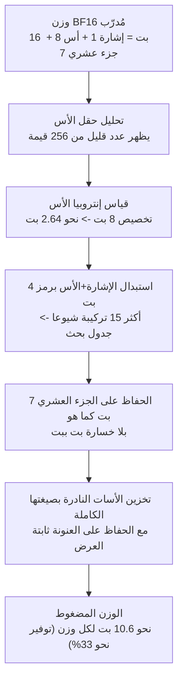

## نظرة عامة

كل فريق خدَم نموذجا كبيرا مفتوح الأوزان محليا يعرف أن العائق الأول هو دائما الحجم. نموذج مثل GLM-5.2، بأكثر من 700 مليار معامل، يقترب من 1.4 تيرابايت في صيغة BF16 الخام، وتوزيعه على عدة وحدات GPU يجعل ذاكرة VRAM تكلفة مباشرة. وكان الجواب على هذه المشكلة دائما تقريبا هو التكميم: خفض 16 بت إلى 8 ثم إلى 4 بل إلى 2، مع التضحية بقليل من الجودة في الطريق.

هذا المقال موجه لقادة الهندسة المسؤولين عن تكلفة الاستدلال، وللممارسين الذين ينشرون النماذج محليا (on-premises)، ولعلماء البيانات في البيئات الخاضعة للتنظيم الذين لا يمكنهم فقدان بت واحد من الدقة. نشر مؤخرا باحث باسم brianbell-x أنه حذف 423 غيغابايت من GLM-5.2. صار 1403 غيغابايت يساوي 980 غيغابايت، والمثير أن الطريقة لم تكن تكميما. لم تكن تشذيبا ولا تقطيرا، بل ضغطا بلا خسارة يعيد بناء الأصل بت ببت عند فك الضغط. فإذا كان شيء بلا خسارة ومع ذلك يتقلص بنسبة 30 بالمئة، فهذا يعني أن الصيغة الأصلية كانت تهدر هذا القدر بالضبط.

بدل أن نأخذ الادعاء على محمل الثقة، قررنا التحقق منه مباشرة. فتحنا 490 مليون وزن مُدرّب فعلي من Qwen2.5-0.5B وقِسنا إنتروبيا حقل الأس في BF16، مؤكدين أن الثمانية بتات المخصصة تحمل فقط 2.64 بت من المعلومات الحقيقية. جاء الحد النظري للضغط بلا خسارة عند 33.5 بالمئة، وهو ما تطابق تقريبا مع 30.17 بالمئة التي حققها المؤلف الأصلي بترميز فعلي. يغطي هذا المقال تلك القياسات ويشرح لماذا يحدث التوفير ليس على القرص فحسب بل في VRAM أيضا.

## ما هي هذه التقنية

علينا أولا أن نرى كيف يخزّن BF16 رقما واحدا. يقسم BF16 (brain floating point 16) الستة عشر بت إلى ثلاثة أجزاء: بت إشارة واحد، و8 بتات أس، و7 بتات جزء عشري (mantissa). يحصل الأس على 8 بتات كاملة لأن BF16 مصمم للحفاظ على نطاق ديناميكي واسع مماثل لـ FP32، حتى يستطيع تمثيل قيم كبيرة جدا أو صغيرة جدا.

المشكلة أن أوزان نموذج مُدرّب بالكاد تستخدم هذا النطاق الواسع. في شبكة عصبية مدربة جيدا، تتجمع معظم الأوزان حول قيم صغيرة قرب الصفر. ونتيجة لذلك يتكتل حقل الأس حول حفنة من القيم، ومن بين 256 احتمالا تستطيع الثمانية بتات تمثيلها، لا يظهر فعليا سوى جزء ضئيل. هنا يكمن الهدر: تُخصَّص 8 بتات، لكن المعلومات المحمولة فعليا أقل بكثير.

فكرة الضغط بلا خسارة بسيطة. رمّز حقل الأس منخفض المعلومات بترميز إنتروبي إلى تمثيل قصير، واترك الثمانية بتات من الإشارة والجزء العشري كما هي لأنها شبه غير قابلة للضغط. يجمع تنفيذ المؤلف الأصلي الإشارة والأس في رمز من 4 بتات يشير إلى جدول بحث يضم أكثر 15 تركيبة أُس شيوعا. أما القيم النادرة غير الموجودة في الجدول فتُخزَّن منفصلة بصيغتها الكاملة. تلخّص الصورة التالية هذه العملية.



يختلف هذا النهج جوهريا عن التكميم. فالتكميم يقتطع الجزء العشري أو يقرّب القيم، مسقِطا الدقة فعليا. أما الضغط بلا خسارة فلا يسقط شيئا. إنه يعيد كتابة المعلومات نفسها برمز أقصر فقط، فيعيد فك الضغط الأوزان الأصلية دون خطأ بت واحد. تنتمي أعمال حديثة مثل DFloat11 و ZipNN إلى العائلة نفسها. أفاد ZipNN أن حقل الأس في BF16 لأوزان نماذج اللغة المدربة يحمل نحو 2.6 بت فقط من إنتروبيا شانون ضمن تخصيصه البالغ 8 بت. ما أردنا معرفته هو ما إذا كان هذا الرقم يتكرر على نموذج حقيقي.

## قياس إنتروبيا الأس بأنفسنا

للتحقق، فتحنا نموذج BF16 مُدرّبا حقيقيا واحدا في بيئة عمل معزولة. كان الهدف Qwen2.5-0.5B، وهو نموذج منشور فعلي بـ 490 مليون وزن. حللنا البنية الثنائية لملف safetensors مباشرة، وقرأنا كل مصفوفة BF16 كأعداد صحيحة من 16 بت، واستخرجنا الثمانية بتات الخاصة بالأس، وحسبنا توزيع القيم وإنتروبيا شانون. لم نستخدم أي تقدير من إطار عمل، بل الأرقام المستخرجة من بايتات المصفوفة الفعلية فقط.

في ما يلي شفرة القياس الأساسية، وهي الجزء الذي يرى قيمة BF16 كعدد صحيح من 16 بت ويقتطع حقل الأس.

```python
import numpy as np

def bf16_exponent_bytes(raw: np.ndarray) -> np.ndarray:
    # raw = قيم BF16 مرئية كـ uint16. الأس = البتات 14..7 (8 بت)
    return ((raw >> 7) & 0xFF).astype(np.uint8)

# حلّل ترويسة safetensors، اقرأ مصفوفات BF16 كـ uint16، واحسب
# إنتروبيا شانون من تكرار قيم الأس.
```

كانت النتيجة أكثر إثارة مما توقعنا. في ما يلي ما أظهره مسح عبر 290 مصفوفة BF16 بمجموع 494 مليون وزن.

| البند | القيمة المقاسة |
|---|---|
| عدد مصفوفات BF16 | 290 |
| إجمالي الأوزان | 494,032,768 |
| قيم الأس الظاهرة فعليا | 38 من أصل 256 |
| إنتروبيا شانون لحقل الأس | **2.6386 بت** (من 8 مخصصة) |
| نصيب أكثر 3 أسات شيوعا | نحو 72 بالمئة من كل الأوزان |
| البت لكل وزن بعد الضغط | 16 بت -> 10.64 بت |
| التوفير النظري بلا خسارة | **33.5 بالمئة** |

يستطيع حقل الأس تمثيل 256 قيمة، لكن ظهرت 38 فقط، وغطت أعلى 3 منها 72 بالمئة من كل الأوزان. كانت إنتروبيا شانون 2.6386 بت، مطابقة تقريبا لـ 2.6 بت التي أفاد بها ZipNN. بعبارة أخرى، كان حقل الأس البالغ 8 بت يحمل 2.64 بت فقط من المعلومات، والبتات الـ 5.36 المتبقية هدر خالص.

إزالة هذا الهدر بلا خسارة تخفض البت لكل وزن من 16 إلى 10.64، مع الحفاظ على الثمانية بتات من الإشارة والجزء العشري وضغط الأس حتى حده الإنتروبي. وكتوفير، هذا يعادل 33.5 بالمئة.


بإسقاط هذه الـ 33.5 بالمئة على حجم GLM-5.2 (753B)، يصبح 1403 غيغابايت نحو 933 غيغابايت. أما القيمة التي حققها المؤلف الأصلي بترميز فعلي فكانت 980 غيغابايت، أي توفير 30.17 بالمئة. الفجوة البالغة نحو 3 نقاط مئوية بين حدنا النظري (33.5 بالمئة) والتنفيذ الفعلي (30.17 بالمئة) ليست صدفة. فمرمّزات الإنتروبيا الفعلية لا تبلغ حد شانون كاملا، ويجب تخزين قيم الأس النادرة بصيغتها الكاملة، ويجب أن تكون الرموز ثابتة العرض للسماح بالوصول العشوائي على GPU، وكل ذلك يضيف عبئا طفيفا. أن تتقارب النظرية والتنفيذ إلى هذا الحد دليل قوي على أن الادعاء الأصلي صحيح وأن النهج سليم.

## لماذا تتقلص VRAM أيضا على GPU

هنا النقطة الأسهل إساءة فهمها. معظم الضغط يتقلص على القرص فقط ويعود إلى حجمه الكامل لحظة تحميل النموذج على GPU، لأنه يجب فك ضغطه للحساب. لكن الـ 30 بالمئة في هذا الضغط بلا خسارة هي رقم VRAM لا رقم قرص. وهذا ما يجعل هذه التقنية مختلفة عن ضغط الملفات العادي.

السر في الرموز ثابتة العرض. لأن رمز كل وزن مضغوط بالعرض نفسه، يمكنك حساب موضع الوزن رقم N بالضبط دون فك ضغط. لا حاجة لتمرير فك تعبئة منفصل ولا لنسخة ثانية بالصيغة الأصلية. تقرأ نواة GPU البايتات المضغوطة مباشرة وتبحث عن كل رمز في جدول صغير محفوظ في المسجلات (registers) أثناء إجراء الضرب. الصيغة الكاملة من 16 بت لا توجد أبدا في VRAM. لذلك تظهر الـ 30 بالمئة في البصمة الفعلية للذاكرة، لا على القرص فحسب.

الأثر العملي كبير. خدمة نموذج 1403 غيغابايت تتطلب 18 بطاقة H100 سعة 80 غيغابايت على الأقل. ومع خفض الضغط بلا خسارة له إلى 980 غيغابايت، ينخفض ذلك إلى نحو 13. توفّر خمس وحدات GPU دون فقدان بت واحد من الجودة. إذا كان التكميم مقايضة للجودة بالذاكرة، فهذه التقنية أقرب إلى وجبة غداء مجانية. لكنها ليست مجانية تماما، ونتناول الثمن أدناه.

## الآثار على منتجات ThakiCloud

هذه التقنية جذابة بشكل خاص من منظور ai-platform لدى ThakiCloud. الـ ai-platform بنية تحتية تخدم النماذج لبيئات عملاء متنوعة فوق Kubernetes وجدولة GPU المبنية على Kueue. كثير من العملاء المحليين يطلبون السحابة المحلية والسيادية، وفي تلك البيئات تكون كل وحدة GPU نفقة رأسمالية ومهلة توريد. يقلّل الضغط بلا خسارة عدد وحدات GPU المطلوبة دون التضحية بأي دقة، ما يجعله ورقة أسهل في الإقناع من التكميم أمام العملاء الحساسين للجودة في القطاعات المنظمة. في المال أو الرعاية الصحية، حيث تصبح قابلية إعادة إنتاج مخرجات النموذج خاضعة للتدقيق، يمكن أن يكون التطابق بت ببت متطلبا بحد ذاته.

الأثر أكبر في الإعدادات متعددة المستأجرين التي تخدم نماذج كبيرة بـ vLLM أو SGLang. استعادة 30 بالمئة من VRAM تتيح تركيب نافذة سياق أكبر على العتاد نفسه، أو تشغيل مزيد من الطلبات المتزامنة، أو تحميل نموذج أكبر على عقدة واحدة. تراكم هذا النوع من كفاءة الموارد بالضبط هو حيث ينافس ai-platform على تكلفة خدمة منخفضة. الضغط بلا خسارة محور متعامد مع التكميم و paged attention والتوازي التنسوري، فيُضاف مباشرة فوق التحسينات القائمة.

والخدمة منخفضة التكلفة تغذّي بدورها اقتصاديات الوكلاء. Paxis، وهو مستوى التحكم Agent-Native Cloud لدى ThakiCloud، يشغّل مئات المهارات في صناديق رمل معزولة ويمرّر كل فعل عبر بوابات سياسة وسجلات تدقيق، وهذه أحمال عمل الوكلاء تستدعي نماذج كبيرة مفتوحة الأوزان مرارا. وكلما انخفضت تكلفة وحدة الخدمة، أمكن تشغيل الوكلاء بجرأة أكبر، فتكون كفاءة موارد ai-platform ركيزة لاقتصاديات تشغيل Paxis.

## القيود والاعتراضات

هذه التقنية ليست علاجا شاملا. أولا، فرضية انخفاض إنتروبيا الأس تصح فقط في النماذج المدربة جيدا. يجب أن تتجمع الأوزان قرب الصفر ليتكتل الأس، لذا فالنماذج غير المدربة بما يكفي، أو ذات التوزيعات الواسعة، أو المكمَّمة بشدة أصلا، ستشهد توفيرا أقل. كما أن قياسنا يأتي من نموذج واحد، فالأرقام الفعلية ستتغير بحسب البنية وطريقة التدريب.

ثانيا، فك رموز الضغط في الوقت الحقيقي يتطلب من نواة GPU معالجة البحث والضرب معا. وإن لم تُحسَّن تلك النواة جيدا، فقد ينتهي بك الأمر إلى توفير الذاكرة مع زيادة زمن الاستجابة. قد تعمل أسرع في أحمال العمل المقيدة بعرض نطاق الذاكرة، لكن هذا يعتمد بشدة على العتاد وتنفيذ النواة، لذا يجب قياس الأداء على GPU المستهدف قبل النشر.

ثالثا، بما أنه بلا خسارة، لا يستطيع هذا النهج بلوغ توفير الضغط الشديد مثل التكميم إلى 4 بت. توفير 30 بالمئة ممتاز، لكنه يخدم غرضا مختلفا عن التكميم الذي يتنازل عن قليل من الجودة ليتقلص 4 أضعاف. الاثنان متكاملان لا متنافسان، والجواب الواقعي يجمعهما: ضغط بلا خسارة حيث تكون الدقة حاسمة تماما، وتكميم حيث يوجد فسحة في الجودة.

أخيرا، تستند هذه النتيجة إلى تجربة عامة لباحث واحد وإلى إعادة إنتاج صغيرة النطاق من جانبنا. تطبيقها في الإنتاج يتطلب التحقق المستقل من التطابق بت ببت للضغط وإعادة البناء، ومن أداء النواة، ومن توفير VRAM الفعلي على النموذج المستهدف وحزمة الخدمة.

## المصادر

- brianbell-x, "Lossless Model Compression Experiment": [https://brianbell-x.github.io/weight-compression/](https://brianbell-x.github.io/weight-compression/)
- النموذج المقاس: Qwen/Qwen2.5-0.5B (Hugging Face)
- أعمال ذات صلة: ZipNN, DFloat11 (عائلة ترميز إنتروبيا الأس في BF16)
