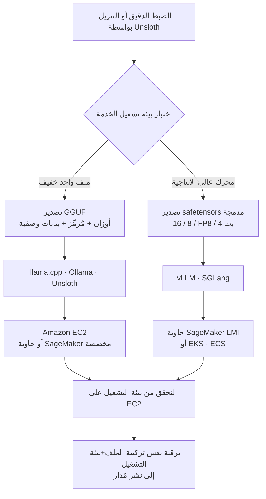

## نظرة عامة

هناك بالفعل مقالات كثيرة عن كيفية تكميم نموذج. GPTQ و AWQ و GGUF و Unsloth Dynamic؛ وصفة لتقليص نموذج 16 بت إلى 4 بت تبعد بضع عمليات بحث. لكن النقطة التي تتعثر عندها الفرق فعلا هي ما يأتي بعد ذلك. أين بالضبط تضع ذلك الملف ذا الـ 4 بت، وكيف؟ هل تشغّله مباشرة على مثيل EC2، أم تغلّفه في نقطة نهاية SageMaker، أم تدرجه في حجيرة على عنقود EKS الذي تديره أصلا؟ لا يوجد جواب واحد، لكن توجد خريطة تتفرع بحسب صيغة ملف النموذج.

هذا المقال موجه لمهندسي المنصات الذين ينشرون نماذج مفتوحة الأوزان على بنيتهم التحتية، وللممارسين الذين يصممون تكلفة الاستدلال. نشرت AWS مؤخرا دليلا مع Unsloth بعنوان "Deploying quantized models on Amazon SageMaker AI with Unsloth" ينظّم قرار النشر هذا في أربعة أنماط. نحلل المنطق الأساسي لهذا الدليل، ونشرح لماذا تحدد صيغة ملف النموذج بيئة التشغيل، وبيئة التشغيل بدورها تحدد خدمة AWS، ونربط هذا التفكير بكيفية تصميم بنية مثل ThakiCloud التي تقوم بالخدمة متعددة المستأجرين على Kubernetes.

نوضّح أمرا مسبقا: أمثلة الأوامر هنا مسارات تم التحقق منها في دليل AWS الرسمي ووثائق Unsloth، ولم نختلق أي أرقام قياس أداء. بيئة تحققنا هي Apple Silicon، لذا لم نتمكن فعليا من تشغيل وإعادة إنتاج تكميم Unsloth وخدمة vLLM المعتمدين على CUDA محليا. لذلك فهذا المقال ليس تقرير تجربة بل تحليل بنيوي لدليل موثوق.

## لماذا يعود التكميم مهما عند النشر

يُناقَش التكميم عادة بوصفه مسألة سرعة تدريب أو استدلال فقط. لكن دليل AWS يشير إلى أن التكميم عند مرحلة النشر يغيّر ثلاثة أمور دفعة واحدة. الأول قرار المثيل. فمع صيرورة نموذج كبير قابلا للتشغيل عمليا على GPU أصغر بل على CPU، تنخفض فئة المثيل المطلوبة نفسها. الثاني ملف تعريف الإقلاع والتخزين. فملفات النموذج الأصغر تُنقل وتُخزَّن أسرع، ما يساعد على الإقلاع البارد والتوسع الأفقي. الثالث مرونة النشر. إذ يمكنك اختيار نموذج أصغر للاستدلال الحساس للتكلفة وتصدير أعلى دقة للاستدلال الحساس للجودة.

قوة Unsloth أنه يربط الضبط الدقيق والتشغيل والتصدير والنشر في سير عمل واحد. وبخاصة، يتيح تكميم Unsloth Dynamic v2.0 تشغيل وضبط نماذج LLM المكمَّمة مع الحفاظ على الدقة قدر الإمكان، ويُفاد أن التدريب المدرك للتكميم (QAT)، المبني بالتعاون مع PyTorch، يستعيد جزءا كبيرا من الدقة المفقودة في التكميم الساذج إلى 4 بت. بعبارة أخرى، يمكنك اختيار موضعك بدقة على مقايضة الجودة مقابل الحجم قبل النشر.

## الصيغة تحدد بيئة التشغيل، وبيئة التشغيل تحدد AWS

الفكرة الجوهرية للدليل: لا تبدأ قرار النشر من "أي خدمة أستخدم". بل ابدأ من "إلى أي صيغة أصدّر"، وسيتبع الباقي طبيعيا. هناك فرعان.

الأول GGUF. وهو صيغة ملف واحد تجمع الأوزان والمُرمِّز (tokenizer) والبيانات الوصفية معا، وتستخدمه بيئات تشغيل خفيفة مثل llama.cpp و Ollama و Unsloth. على AWS يُربَط هذا الفرع بـ Amazon EC2 أو حاوية SageMaker AI مخصصة. إنه المسار حين تريد التحقق بخفة والاحتفاظ بتحكم مباشر.

الثاني safetensors المدمجة. فدمج وتصدير أوزان 16 بت أو 8 بت أو FP8 أو 4 بت بواسطة Unsloth يتيح التشغيل على محركات عالية الإنتاجية مثل vLLM و SGLang، ويُربَط ذلك بحاويات الاستدلال للنماذج الكبيرة (LMI) في SageMaker AI، أو EKS، أو ECS. إنه مسار الخدمة الإنتاجية حيث تهمّ الإنتاجية والتوسع. تلخّص الصورة التالية هذا الفرع.



## الإعداد والدمج

سير العمل الذي يعرضه الدليل من أربع خطوات. اضبط أو نزّل نموذجا في Unsloth، صدّره بالصيغة المطابقة لبيئة التشغيل المستهدفة، تحقق من بيئة التشغيل على EC2 أو محليا، ثم رقِّ نفس تركيبة الملف وبيئة التشغيل مباشرة إلى نشر مُدار. عبارة "نفس تركيبة الملف وبيئة التشغيل" مهمة هنا، لأنه إذا اختلفت الصيغة أو المحرك بين التحقق والإنتاج، يتسلل سلوك غير متوقع.

يتفرع التصدير من Unsloth بحسب بيئة التشغيل المستهدفة. مسار GGUF يبدو هكذا.

```python
# تصدير GGUF (مسار llama.cpp / Ollama / EC2)
model.save_pretrained_gguf(
    "qwen-merged-gguf",
    tokenizer,
    quantization_method="q4_k_m",
)
```

مسار safetensors المدمجة يستهدف vLLM أو SGLang.

```python
# تصدير safetensors مدمجة (مسار vLLM / SGLang / SageMaker LMI)
model.save_pretrained_merged(
    "qwen-merged-16bit",
    tokenizer,
    save_method="merged_16bit",  # أو merged_4bit، إلخ
)
```

يمكن التحقق من خدمة النموذج المدمج المصدَّر مباشرة بـ vLLM.

```bash
# التحقق من الخدمة على EC2 أو محليا
vllm serve ./qwen-merged-16bit --port 8000
```

للنشر المبني على الحاويات، توفر حاويات التعلم العميق من AWS (DLCs) بيئات Docker محسّنة عبر EC2 و EKS و ECS. وحاوية vLLM DLC على وجه الخصوص مضبوطة للاستدلال عالي الأداء وتدعم أصلا التوازي التنسوري وتوازي خطوط الأنابيب عبر عدة وحدات GPU وعقد. أي أن تكوينا تم التحقق منه على مثيل EC2 واحد يتدفق بسلاسة إلى حجيرة EKS تستخدم بيئة التشغيل نفسها للتوسع الأفقي.

## الآثار على منتجات ThakiCloud

تتداخل خريطة النشر هذه مباشرة مع فلسفة تصميم ai-platform لدى ThakiCloud. يخدم ai-platform النماذج فوق Kubernetes وجدولة GPU المبنية على Kueue، والمبدأ الذي يذكره دليل AWS، وهو أن الصيغة تحدد بيئة التشغيل وبيئة التشغيل تحدد البنية التحتية، غير مقيّد بسحابة بعينها. فتقسيم GGUF للتحقق الخفيف والنشر الطرفي مقابل safetensors المدمجة للخدمة عالية الإنتاجية المبنية على vLLM ينطبق بالتساوي سواء كان EKS من AWS أو Kubernetes محلي. بل إن ThakiCloud، الذي لديه كثير من العملاء الذين يطلبون السحابة المحلية والسيادية، يستفيد أكثر من حيث قابلية النقل بتوحيد مسار النشر عبر صيغة الملف وبيئة التشغيل بدل الارتباط بخدمة مُدارة بعينها.

عمليا، يستطيع ai-platform الجمع بين التوازي التنسوري وتوازي خطوط الأنابيب اللذين توفرهما vLLM DLC وبين طابور Kueue للتشغيل متعدد المستأجرين. يمكنه اختيار تصدير بدقة مختلفة لكل عميل، مسندا نماذج 4 بت المدمجة للأحمال الحساسة للتكلفة و FP8 أو 16 بت للحساسة للجودة. وإذا استخدمت QAT من Unsloth لاستعادة الدقة حتى عند 4 بت، تتسع النقطة التي تربح فيها تكلفة خدمة منخفضة وجودة معا. هذا المطابقة الدقيقة بين الصيغة وبيئة التشغيل هي بالضبط خلفية منافسة ai-platform على تكلفة وحدة خدمة منخفضة.

وهذه الخدمة منخفضة التكلفة تغذّي بدورها اقتصاديات الوكلاء. Paxis، مستوى التحكم Agent-Native Cloud لدى ThakiCloud، يشغّل المهارات في صناديق رمل معزولة ويستدعي نماذج كبيرة مفتوحة الأوزان مرارا، فإذا كمّمت نموذج مجال مضبوطا بواسطة Unsloth ووضعته على ai-platform، أمكن لوكلاء Paxis استهلاكه بثمن زهيد. توحيد النشر المبني على الصيغة هو بحد ذاته البنية التي تخفض تكلفة وحدة أحمال عمل الوكلاء.

## القيود والاعتراضات

كخريطة نشر، هذا الدليل واضح، لكن ثمة تحفظات. أولا، تتفاوت الجودة والإنتاجية الفعليتان كثيرا بحسب تركيبة طريقة التكميم وبيئة التشغيل. كم تحتفظ نماذج 4 بت المدمجة بالدقة على vLLM، أو هل يعطي التوازي التنسوري توسعا خطيا فعلا على نموذج بعينه، يجب قياسه مباشرة على النموذج والعتاد المستهدفين؛ فعموميات الدليل وحدها لا تخبرك.

ثانيا، تأتي ملاءمة الخدمات المُدارة بثمن هو التكلفة والارتباط. حاويات SageMaker LMI تخفّض العبء التشغيلي، لكن في البيئات ذات المتطلبات المحلية القوية، قد يكون تشغيل بيئة التشغيل نفسها بنفسك على EKS أو Kubernetes الخاص بك أفضل للتحكم والتكلفة. كون دليل AWS خريطة جيدة أمر منفصل عن الحكم بنقل تلك الخريطة إلى بنيتك التحتية، وهو قرار كل فريق بنفسه.

ثالثا، كما أُشير أعلاه، هذا المقال تحليل بنيوي دون إعادة إنتاج محلية. قبل التبني الفعلي، يجب تصدير النموذج المستهدف بواسطة Unsloth وخدمته على vLLM وتأكيد زمن الاستجابة والإنتاجية والدقة لكل صيغة عبر قياساتك الخاصة.

## المصادر

- AWS Machine Learning Blog, "Deploying quantized models on Amazon SageMaker AI with Unsloth": [https://aws.amazon.com/blogs/machine-learning/deploying-quantized-models-on-amazon-sagemaker-ai-with-unsloth/](https://aws.amazon.com/blogs/machine-learning/deploying-quantized-models-on-amazon-sagemaker-ai-with-unsloth/)
- Unsloth Documentation: [https://unsloth.ai/docs](https://unsloth.ai/docs)
- AWS, "Deploy LLMs on Amazon EKS using vLLM Deep Learning Containers"
