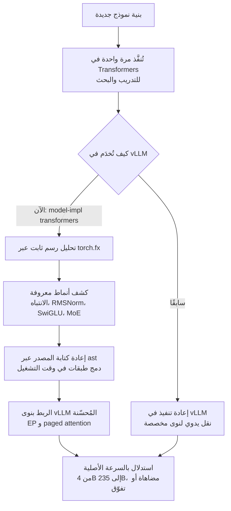

## نظرة عامة

إذا سبق لك أن استضفت نماذج مفتوحة الأوزان ذاتيًا، فأنت تعرف جدارًا مألوفًا. يصدر نموذج رائع، لكن لخدمته بسرعة فعليًا عليك الانتظار حتى يدعم محرك الخدمة تلك البنية. البنية الجديدة التي تصل إلى مكتبة Transformers قابلة للاستخدام فورًا للتدريب والبحث، لكن لبلوغ السرعة الكاملة في محرك استدلال عالي الأداء مثل vLLM كان على أحدهم إعادة تنفيذ تلك البنية من الصفر داخل vLLM. أي أنك تبني النموذج نفسه مرتين عمليًا.

هذا المقال موجّه لقادة الهندسة المسؤولين عن كلفة الاستدلال وزمن الخدمة، وللممارسين الذين يشغّلون نماذج مفتوحة الأوزان محليًا أو في بيئات سيادية، ولعلماء البيانات الذين يجرّبون بنى جديدة مع القلق بشأن سرعة النشر. في يوليو 2026، شارك Clement Delangue من Hugging Face نقطة تحوّل كبيرة للاستدلال مفتوح المصدر: بدءًا من vLLM v0.25.0، يمكن تشغيل نماذج Transformers داخل vLLM **بالسرعة الأصلية**، وغالبًا بما يضاهي التطبيقات المكتوبة يدويًا أو يتفوق عليها.

الفكرة الجوهرية هي التالية. بمجرد أن ينفّذ مؤلف النموذج بنية في Transformers، يمكنه الاستفادة من كومة الاستدلال المُحسّنة في vLLM مجانًا، دون أي عمل نقل منفصل. لم نأخذ هذا الادعاء تسليمًا. أعدنا إنتاج خطوة تحليل الرسم التي تنفّذها الخلفية داخليًا على كتلة مُفكّك صغيرة وقِسناها. يشرح هذا المقال الآلية وقياساتنا وما تعنيه لبنية تحتية تخدم نماذج مختلفة كثيرة تحت سقف واحد متعدد المستأجرين.

## ما هذه التقنية

براية واحدة هي `--model-impl transformers`، يُحمّل vLLM تعريف النموذج مباشرة من مكتبة Transformers بدلًا من تطبيق منقول مخصص، ويخدمه. ظاهريًا يبدو ذلك طبقة توافق، لكن ما يميّز خلفية v0.25.0 هو أن هذا التوافق لم يعد يكلّف سرعة. كان مسار التوافق القديم أقرب إلى بديل «يعمل لكنه بطيء». أما الآن فتُطبَّق عمليات دمج الطبقات الخاصة بالاستدلال ديناميكيًا في وقت التشغيل، فتضاهي الخلفية سرعة الشيفرة المخصصة للبنى المتوافقة.

بالنظر عن قرب، تنقسم الآلية إلى مرحلتين. أولًا تستخدم الخلفية `torch.fx` لتحليل رسم حسابات النموذج بشكل ثابت، بحثًا عن أنماط قابلة للتحسين مثل حساب درجات الانتباه، وتطبيع RMSNorm، وطبقات SwiGLU MLP، ومزيج الخبراء Mixture-of-Experts. ثم تعالج شجرة الصياغة المجردة لإعادة كتابة تلك الشيفرة في مكانها، وتربط العمليات المكتشفة بنوى vLLM المُحسّنة. في نموذج MoE يعني ذلك نوى Expert Parallelization، وفي الانتباه عائلة paged attention. في النهاية، يُحسّن vLLM الإنتاجية وزمن الاستجابة فوق البنية التي عبّر عنها Transformers.



المعنى العملي لهذا التحول هو اختفاء الفجوة بين محرك الخدمة ومنظومة النماذج. سابقًا كانت كل بنية جديدة تتطلب قاعدتَي شيفرة، تطبيقًا للتدريب وتطبيقًا للاستدلال، وكانت الفجوة بينهما هي بالضبط نافذة «النموذج الرائع صدر لكن لا نستطيع خدمته بسرعة بعد». الآن تضيق هذه النافذة. سواء كنت فريق بحث يجرّب بنية مخصصة أو فريق تشغيل يحاول وضع نموذج صدر حديثًا في الإنتاج، يمنحك تطبيق Transformers واحد سرعة vLLM.

## التثبيت والتكامل

هذه الخلفية ليست حزمة منفصلة؛ إنها تأتي داخل vLLM نفسه. ثبّت vLLM v0.25.0 أو أحدث وأضف `--model-impl transformers` إلى أمر الخدمة. الأمثلة الحقيقية التي نشرتها Hugging Face كالتالي.

```bash
# وحدة معالجة رسومات واحدة، نموذج كثيف
vllm serve Qwen/Qwen3-4B --model-impl transformers

# توازٍ موتّري عبر وحدتَين، نموذج كثيف كبير
vllm serve Qwen/Qwen3-32B \
  --model-impl transformers \
  --tensor-parallel-size 2

# توازي بيانات مع توازي خبراء، نموذج MoE
vllm serve Qwen/Qwen3-235B-A22B-FP8 \
  --model-impl transformers \
  --data-parallel-size 8 \
  --enable-expert-parallel
```

ويعمل الأمر نفسه من واجهة Python للاستدلال دون اتصال.

```python
from vllm import LLM, SamplingParams

llm = LLM(
    model="Qwen/Qwen3-4B",
    model_impl="transformers",   # استخدام تعريف Transformers بدل نقل مخصص
)
out = llm.generate(
    ["كيف تخدم ThakiCloud النماذج مفتوحة الأوزان؟"],
    SamplingParams(max_tokens=256, temperature=0.7),
)
print(out[0].outputs[0].text)
```

ما يلفت النظر عبر الأمثلة الثلاثة أن خيارات الخدمة الموزعة مثل التوازي الموتّري وتوازي البيانات وتوازي الخبراء تعمل جميعها تحت خلفية Transformers. أي أنك لا تتخلى عن التوسّع الأفقي مقابل التوافق. من نموذج كثيف بحجم 4B إلى نموذج MoE بحجم 235B، تغطّي براية واحدة ذلك.

## نتائج التجربة الفعلية

هذه البيئة هي macOS (Apple Silicon)، لذا لا يمكنها تشغيل نوى CUDA الخاصة بـ vLLM، ولم نتمكن من إعادة إنتاج قياس إنتاجية vLLM نفسه. بدلًا من ذلك أعدنا إنتاج **الخطوة الأهم التي تنفّذها الخلفية داخليًا: استخدام torch.fx لتحليل رسم النموذج بشكل ثابت والعثور على أنماط أهداف الدمج**. بنينا مُفكّكًا من أربع طبقات على نمط Llama بلغة PyTorch خالصة، بالبنية نفسها التي تستخدمها نماذج الخدمة الحقيقية (انتباه الاستعلام المجمّع GQA وطبقة SwiGLU MLP)، وتتبّعنا رسمه عبر `torch.fx.symbolic_trace`، وصنّفنا العُقد.

كانت القياسات كالتالي. أنتج تتبّع هذا المُفكّك الصغير البالغ 2.902 مليون معامل رسم torch.fx بإجمالي **178 عقدة**. حسب نوع العملية كان هناك 80 استدعاء دالة، و60 استدعاء طريقة، و28 استدعاء وحدة، و8 عمليات جلب سمات. من بين هذه، بلغت الأنماط على مستوى الدوال التي تستطيع الخلفية استبدالها فورًا بنوى دمج 16 عملية اختزال RMSNorm، و8 عمليات ضرب مصفوفات متعلقة بالانتباه، و4 عمليات softmax، و4 تفعيلات SwiGLU، أي 32 إجمالًا، إضافة إلى 28 استدعاء وحدة تحمل إسقاطات QKV والإخراج وطبقة MLP والتطبيع. بلغ زمن التمرير الأمامي عند طول تسلسل 64 في المتوسط 1.4 ملّي ثانية، مقيسًا على torch 2.13.0.


ما تُظهره هذه الأرقام واضح. حتى في كتلة صغيرة واحدة من 178 عقدة، تتكرر أنماط جيدة التكوين من الانتباه والتطبيع وتفعيل MLP، وهذه بالضبط النقاط التي تستهدفها الخلفية لاستبدالها بنوى vLLM. في نموذج حقيقي بعشرات الطبقات يتضاعف هذا النمط بعدد الطبقات، فيتيح تحليل رسم واحد للخلفية دمج عمليات الاختناق عبر النموذج كله دفعة واحدة. وفق Hugging Face، أتاح هذا النهج لخلفية Transformers مضاهاة إنتاجية vLLM الأصلية أو التفوّق عليها من 4B إلى 235B، شاملًا إعدادات التوازي الموتّري وMoE. لم تُعد تجربتنا إنتاج تلك الأرقام؛ بل أكّدت بالقياس **الهيكل العظمي للآلية** التي تنتجها.

## دلالات لـ ThakiCloud

**ai-platform** من ThakiCloud هي بنية تحتية متعددة المستأجرين للذكاء الاصطناعي وتعلّم الآلة تخدم النماذج لبيئات عملاء متنوعة فوق K8s وجدولة GPU المستندة إلى Kueue. هذه الخلفية فائدة مباشرة لمشغّل خدمة مثلنا. أولًا، **يتقلّص زمن إدخال النموذج.** عند صدور نموذج جديد مفتوح الأوزان، كان علينا حتى الآن انتظار دعم vLLM الرسمي لتلك البنية أو قبول نقل ذاتي. إذا وُجد تطبيق Transformers، تتيح لنا `--model-impl transformers` تشغيل حجيرة خدمة بسرعة مُحسّنة فورًا. وهذا يؤثر مباشرة في السؤال التنافسي عن سرعة وصول نموذج جديد إلى الإنتاج.

ثانيًا، **يصبح مسار خدمة البنى المخصصة أبسط.** عند خدمة نموذج مضبوط أو معدّل هيكليًا لعميل محدد محليًا، فإن القدرة على النشر من تعريف Transformers وحده، دون نقل مخصص إلى vLLM، تقلّل عبء الصيانة كثيرًا. في بيئات السحابة السيادية أو المنظّمة التي تتطلب الاستضافة الذاتية، نوفّر الوقت المُنفَق في التوفيق بين إصدارات المحرك والنموذج. وبما أن التوازي الموتّري وتوازي البيانات وتوازي الخبراء يعمل كله، يمكننا تبنّي هذا المسار دون تغيير طوبولوجيات الخدمة متعددة الـGPU التي نشغّلها بالفعل.

من منظور الوكلاء، تنطبق عدسة **Paxis** أيضًا. Paxis هي مستوى تحكّم Agent-Native Cloud يعمل فوق ai-platform، ويبدّل نماذج مختلفة كالأدوات أثناء تشغيل الوكلاء. إذا استطاعت طبقة الخدمة إدخال نماذج جديدة مفتوحة الأوزان أسرع وأرخص، اتّسع مجمع النماذج الذي يمكن للوكلاء فوقها اختياره وانخفضت كلفة التبديل. ولأن الخدمة منخفضة الكلفة وزمن الاستجابة هي في النهاية ما يجعل أحمال الوكلاء اقتصادية، تتجه كفاءة خدمة ai-platform ومرونة وكلاء Paxis في الاتجاه نفسه.

## القيود والاعتراضات

هذه الخلفية ليست حلًّا لكل شيء، وثمة حدود واضحة تستحق الذكر إنصافًا. أولًا، ميزة الأداء محصورة في «البنى المتوافقة». يجب أن يكون النموذج قابلًا للتتبع الثابت عبر torch.fx، وأن يطابق أنماطًا تعرفها الخلفية مسبقًا حتى ينطبق الدمج. البنية ذات تدفق تحكّم ديناميكي كثيف أو عمليات جديدة لم ترها الخلفية سترتد إلى مسارات غير مدموجة في بعض الأجزاء، فتتقلّص ميزة السرعة تبعًا لذلك. ليست كل نماذج Transformers تبلغ السرعة الأصلية تلقائيًا.

ثانيًا، بلغت هذه الميزة النضج في v0.25.0 لكنها لا تزال في تطوّر. لبعض تركيبات التكميم، وبعض متغيرات الانتباه، أو مخططات توجيه MoE النادرة، قد يظل التطبيق المنقول المخصص أكثر استقرارًا أو أسرع. قبل الإنتاج، الأأمن أن تقيس بنفسك الإنتاجية والدقة الفعليتين على نموذجك وعتادك المستهدفين. لهذا السبب بالذات لم نستشهد بأرقام إنتاجية vLLM مباشرة بل نسبناها إلى الإعلان الرسمي؛ فالأرقام تختلف حسب البيئة، والقياس على عنقود GPU الخاص بـ ThakiCloud مخطّط له على حدة.

ثالثًا، ثمة اعتراض ممكن. حين يقترن محرك الخدمة ومكتبة النموذج اقترانًا وثيقًا، قد تؤثر تغييرات Transformers في استقرار الخدمة. في زمن قاعدتَي الشيفرة المنفصلتين كان يمكنك تثبيت كومة الاستدلال باستقلال، لكن مشاركة الخلفية تفرض إعادة التفكير في إدارة الإصدارات. ومع ذلك، موازنةً بكلفة تنفيذ كل نموذج جديد مرتين، نرى أن مكسب سرعة الإدخال من هذا الاقتران أكبر في معظم سيناريوهات الخدمة.

## المصادر

- [Native-speed vLLM transformers modeling backend (Hugging Face Blog)](https://huggingface.co/blog/native-speed-vllm-transformers-backend)
- [vLLM v0.25.0: transformers backend now matches native vLLM speed (daily.dev)](https://daily.dev/posts/vllm-v0-25-0-transformers-backend-now-matches-native-vllm-speed-z8kvnsk7c)
- [Transformers modeling backend integration in vLLM (vLLM Blog)](https://blog.vllm.ai/2025/04/11/transformers-backend.html)
- [Clement Delangue (@ClementDelangue) on X](https://x.com/ClementDelangue/status/2076763231788339669)
- شيفرة التجربة والسجلات: `outputs/blog-impl/vllm-transformers-native-speed/` (إعادة إنتاج تحليل رسم torch.fx، torch 2.13.0، وحدة المعالجة المركزية)
