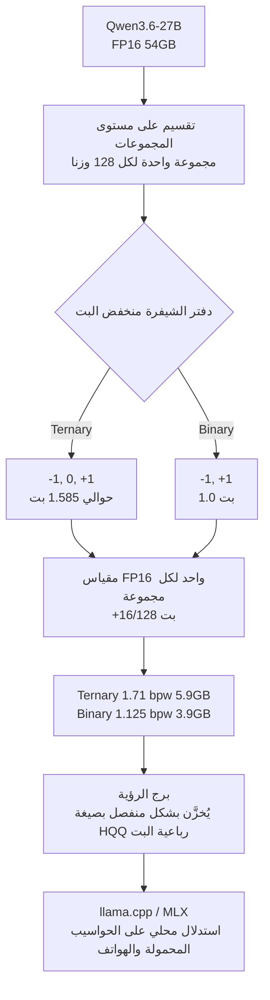

## نظرة عامة

تسير معظم محاولات تشغيل النماذج الكبيرة على أجهزة صغيرة في أحد اتجاهين. الأول هو تدريب نموذج صغير من الصفر، والثاني هو ضغط أوزان نموذج كبير بعد تدريبه. وقد اصطدم الاتجاه الثاني دائما بالجدار نفسه: عند النزول إلى ما دون 4-bit، تبدو نتائج المعايير القصيرة جيدة، لكن الجودة تنهار في مهام الاستدلال الطويلة مثل الرياضيات أو البرمجة.

في 14 يوليو 2026، أصدرت PrismML نموذج Bonsai 27B الذي يواجه هذا الجدار مباشرة. Bonsai 27B ليس نموذجا مدربا من جديد، بل يُبقي Qwen3.6-27B كما هو ويكتفي بتمثيل الأوزان فقط بصيغة منخفضة البت. البنية المعمارية لم تتغير. صدرت نسختان بترخيص Apache 2.0، وأفادت التقارير بأن نسخة ternary تحافظ على 94.6% من جودة النموذج الأصلي بحجم 5.9GB، بينما تحافظ نسخة 1-bit على 89.5% بحجم 3.9GB.

يقرأ هذا المقال Bonsai 27B من منظور ThakiCloud في خدمة النماذج منخفضة البت لبيئة متعددة المستأجرين. سنستعرض بالترتيب كيفية عمل الضغط، ولماذا تُعد الذاكرة، لا سعة التخزين، القيد الحقيقي، وما الأثر العملي لهذا التوجه على بنيتنا التحتية للاستدلال. ونوضح مسبقا أن جميع أرقام المعايير أدناه هي قيم نشرتها PrismML، وليست قيما أعادت ThakiCloud إنتاجها بنفسها.

## ما هو Bonsai 27B

Bonsai 27B هو تمثيل منخفض البت لنموذج Qwen3.6-27B. وبالتطبيق على نموذج متعدد الوسائط يتكون من نحو 24.8B من أوزان اللغة، و0.46B لبرج الرؤية، و2.5B للتضمينات ورأس LM، يُحوَّل النموذج بالكامل، بكل مكوناته كثيفة عمليات المصفوفات، إلى صيغة منخفضة البت. ويشمل ذلك التضمينات، وإسقاطات الانتباه، وإسقاطات MLP، ورأس LM، بينما يبقى جزء ضئيل جدا فقط، مثل معاملات التطبيع والمقياس، بدقة عالية. أما برج الرؤية فيُحفظ بشكل منفصل بصيغة 4-bit HQQ ولا يُحمَّل إلا عند وجود مدخل صورة.

تختلف طبيعة النسختين. تُمثل نسخة Ternary Bonsai 27B الأوزان بثلاث قيم `{-1, 0, +1}` لتصل إلى فعالية 1.71 بت وسعة مثالية قدرها 5.9GB. أما نسخة 1-bit Bonsai 27B فتستخدم قيمتين فقط `{-1, +1}` لتصل إلى فعالية 1.125 بت بحجم 3.9GB. ويُدعم السياق حتى 262K رمز (token)، ويظل هذا عمليا لأن نحو 75% من آلية انتباه Qwen3.6-27B خطية.

## كيف يعمل الضغط

الفكرة الأساسية بسيطة. يُخزَّن كل وزن كرمز واحد، وتشترك كل مجموعة من 128 وزنا في مقياس FP16 واحد. ويُعاد بناء الوزن الفعلي كحاصل ضرب مقياس المجموعة في الرمز، بالصيغة `w_i = s_g · t_i`.

بتتبع حساب البتات تتضح تكلفة التخزين. تحمل قيمة ternary واحدة `log2(3) ≈ 1.585` بت. وبإضافة مقياس FP16 واحد لكل 128 قيمة، تُضاف `16/128` بت ليصل المجموع إلى نحو 1.71 بت، أي تقليص بمقدار نحو 9.4 مرة مقارنة بـ FP16. أما binary فالقيمة نفسها بت واحد، وبإضافة عبء المقياس نفسه يصبح `1 + 16/128 = 1.125` بت، أي تقليص بمقدار نحو 14.2 مرة.

يظهر هنا تباين لافت. فنسخة Q4_K_XL من Qwen3.6-27B، التي تُسمى عادة 4-bit، يبلغ متوسطها الفعلي 5.2 بت، ونسخة IQ2_XXS التي تُسمى 2-bit يبلغ متوسطها الفعلي 2.8 بت. أي أن الاسم يختلف عن متوسط البت الفعلي. كما يختلف Bonsai عن BitNet. فـ BitNet يُدرَّب من الصفر بدقة منخفضة البت تجنبا للانهيار، بينما يضغط Bonsai نموذجا مدربا مسبقا بعد تدريبه. وتدعي PrismML أنها تجنبت الانهيار دون إعادة تدريب، لكن تفاصيل هذا الادعاء تعتمد على الوثائق التقنية المنشورة.

## نتائج المعايير المُبلَّغ عنها

أفادت PrismML بأنها قيّمت 15 معيارا في وضع thinking باستخدام EvalScope وvLLM على H100. يعرض الجدول أدناه هذه القيم المُبلَّغ عنها. ونؤكد مجددا أن هذه الأرقام هي قيم نشرها المزوّد، وليست قيما أعادت ThakiCloud إنتاجها، وأن إعادة الإنتاج المستقلة تتطلب تحققا منفصلا.

| النسخة | bpw الفعلي | الحجم | متوسط Thinking | مقارنة بـ FP16 |
|---|---|---|---|---|
| Qwen3.6-27B FP16 | 16.0 | 54GB | 85.07 | خط الأساس |
| Q4_K_XL (4-bit) | 5.2 | 17.6GB | 84.99 | 99.9% |
| IQ2_XXS (2-bit) | 2.8 | 9.4GB | 72.73 | 85.5% |
| Ternary Bonsai 27B | 1.71 | 5.9GB | 80.49 | 94.6% |
| 1-bit Bonsai 27B | 1.125 | 3.9GB | 76.11 | 89.5% |

وعند التقسيم حسب الفئة، يتضح أن الضغط لا يُحدث خسارة موحدة. فالرياضيات تصمد نسبيا جيدا، من 95.33 عند FP16 إلى 93.40 لـ ternary و91.66 لـ 1-bit. في المقابل، تنخفض مهام الوكيل (agent) واستدعاء الأدوات بشكل حاد من 80.00 إلى 74.01 لـ ternary و66.03 لـ 1-bit، وتنخفض الرؤية من 72.61 إلى 59.57 لـ 1-bit. كما تنخفض القدرة على اتباع التعليمات بشكل كبير من 78.47 إلى 65.74 لـ 1-bit.

التباين الذي تُبرزه PrismML هو الانهيار الانتقائي في نسخ sub-4-bit السابقة. فنسخة IQ2_XXS تحافظ على 88.93 في مهام الإجابات القصيرة مثل MMLU-Redux، لكنها تنهار إلى 57.5 في AIME26 و56.4 في LiveCodeBench. والملاحظة هي أن المعايير القصيرة تُخفي هذا الانهيار. وهذه الملاحظة بحد ذاتها بصيرة عملية يتفهمها كل من تعامل مع الضغط منخفض البت من قبل.

## الذاكرة هي القيد الحقيقي

قراءة إصدار Bonsai 27B بالاعتماد فقط على أرقام الحجم تُفوّت الجوهر. فشروط تشغيل النموذج على هاتف أكثر صرامة بكثير من سعة التخزين وحدها. يقيّد iOS التطبيق الواحد باستخدام نحو نصف الذاكرة الفعلية فقط، لذا فإن هاتف iPhone بذاكرة 12GB لا يُتيح فعليا سوى نحو 6GB. وهنا تكمن أهمية نسخة 3.9GB.

الميزانية الثانية هي ذاكرة التخزين المؤقت KV cache. وبما أن 16 فقط من أصل 64 طبقة تمتلك ذاكرة تخزين مؤقت كاملة الانتباه ومتنامية، فإن التكلفة تبلغ نحو 64KiB لكل رمز عند FP16. وملء نافذة 262K بالكامل يكلف نحو 17.2GB، ويؤدي استخدام ذاكرة تخزين مؤقت KV بدقة 4-bit إلى خفض ذلك إلى نحو 4.3GB. ومهما قلّصنا أوزان النموذج، فإن السياق الأطول سيستهلك الذاكرة عبر ذاكرة التخزين المؤقت KV، لذا يجب أن تسير الأوزان منخفضة البت وذاكرة التخزين المؤقت منخفضة البت معا.

وأفادت PrismML أيضا بأنها قاست الأثر على الجودة الناتج عن ضغط الذاكرة المؤقتة. فمقارنة بخط الأساس FP16-KV الخاص بها، أظهرت نسخة Ternary Bonsai قيمة forward-KL للمخرجات بلغت 0.0011 nats على MATH-500، بينما أظهرت Q4_K_XL قيمة 0.0146. وعند 100K رمز باستخدام ذاكرة مؤقتة FP16، تبلغ الذروة نحو 11.6GB لنسخة 1-bit ونحو 14.7GB لنسخة ternary. أي أنه حتى بعد تقليص الأوزان، يتطلب السياق الطويل خفض دقة الذاكرة المؤقتة أيضا حتى يتسع النموذج فعليا على الجهاز.

## الإنتاجية وفك الترميز التخميني

التوليد مقيد بعرض النطاق الترددي للذاكرة. فكلما قلّت البايتات المقروءة في كل خطوة، زاد عدد الرموز في الثانية. أما التعبئة المسبقة prefill فمقيدة بالحوسبة، لذا يكون أثر الضغط عليها أصغر نسبيا. والإنتاجية التي نشرتها PrismML تُظهر هذه الخاصية بوضوح.

| المنصة | النسخة | tg128 (التوليد) | pp512 (التعبئة المسبقة) |
|---|---|---|---|
| M5 Max | Binary | 66.4 | 874 |
| M5 Pro | Ternary | 26.2 | 393 |
| iPhone 17 Pro Max | Binary | 11.0 | 111 |
| H100 (CUDA) | Binary | 104.8 | 2755 |

أصدرت PrismML أيضا مُسوِّدا (drafter) باسم DSpark مدربا خصيصا لاستهداف Bonsai 27B. وعلى H100، وبعمق مُسوَّدة (draft depth) k=4، أفادت بطول قبول tau=3.6 للنسخة binary المستهدفة، أي 143.8 tok/s، بتسريع قدره 1.37 مرة. والتحقق بلا فقدان (lossless)، لذا يبقى توزيع المخرجات مطابقا. بيد أن المُسوِّد معطّل افتراضيا على شرائح Apple silicon عند حجم دفعة (batch size) يساوي 1.

التشغيل نفسه معياري تماما. يمكن تشغيل خادم llama.cpp أو التوليد مباشرة عبر llama-cli، كما يُوفَّر مسار MLX أيضا. ويستخدم استدعاء الأدوات مصفوفة `tools` بأسلوب OpenAI كما هي، وتعود الاستجابة عبر `choices[0].message.tool_calls`. ووضع thinking مفعّل افتراضيا ويمكن تبديله لكل طلب.

## ماذا يعني هذا لـ ThakiCloud

تتقاطع الخدمة منخفضة البت مع منتجَي ThakiCloud كليهما.

**منظور ai-platform (البنية التحتية والخدمة).** تخدم منصة ai-platform التابعة لـ ThakiCloud نماذج مفتوحة الأوزان عبر بيئات عملاء متنوعة. وما يُظهره Bonsai هو إمكانية وضع جودة بمستوى 27B على GPU واحدة بسعة 24GB مع ذاكرة تخزين مؤقت KV بدقة 4-bit. وهذا يؤثر مباشرة على كثافة تعدد المستأجرين. فإذا أمكن تشغيل عدد أكبر من المستأجرين على GPU نفسها، أو تحقيق نفس اتفاقية مستوى الخدمة SLA ببطاقة أصغر، تنخفض تكلفة الخدمة. ولهذا أهمية خاصة في عمليات النشر المحلية (on-premises) والسيادية. فالقطاع العام المحلي والصناعات الخاضعة للتنظيم تتطلب استضافة ذاتية self-hosting تمنع خروج البيانات، بينما تظل ميزانيات الأجهزة محدودة. وخفض أوزان النموذج وذاكرة التخزين المؤقت KV معا إلى صيغة منخفضة البت يتيح تجميعا أكثف في تجمع GPU تُجدوله Kueue، وهذا يصب مباشرة في كفاءة التكلفة وكثافة الموارد التي نُشدد عليها دائما. غير أن منخفض البت ليس الحل دائما. فإذا كان عبء العمل متمركزا حول الوكلاء (agent) أو استدعاء الأدوات، تكون خسارة الجودة كبيرة كما يُبيّن قسم القيود أدناه، وهو ما يستدعي توجيها (routing) يُغيّر الدقة بحسب عبء العمل.

**منظور Paxis (الوكلاء والحافة).** Paxis هو مستوى تحكم Agent-Native Cloud الذي يعمل فوق ai-platform، ويتعامل مع Skills وTools وPolicies وAudit Logs كموارد من الدرجة الأولى. والنموذج الذي يعمل على هاتف بحجم 3.9GB يفتح الباب أمام وكلاء on-device في السياقات الحساسة للخصوصية. فإعداد لا يغادر فيه الطلب (prompt) الجهاز مفيد للامتثال التنظيمي ولسير العمل دون اتصال (offline). ومن منظور Paxis، يبدو طبيعيا التعامل مع هذه النماذج المحلية داخل تنفيذ معزول في صندوق رملي (sandbox)، مع تمرير كل إجراء عبر بوابات السياسات وسجلات التدقيق. فالاستدلال المحلي منخفض البت يخلق اقتصاديات وكلاء الحافة، وPaxis هو الطبقة التي تحكم ذلك التنفيذ.

يُكمّل المنظوران أحدهما الآخر. فالخدمة منخفضة التكلفة (ai-platform) هي ما يخلق اقتصاديات الوكلاء (Paxis).

## القيود والحجج المضادة

أكبر تحفظ يتعلق بمصدر المعايير. فكل الأرقام أعلاه هي تقييمات ذاتية من PrismML، ولا توجد إعادة إنتاج مستقلة حتى الآن. والحجة التي تُشير إلى الانهيار الانتقائي لـ IQ2_XXS مقنعة، لكن المعايير التي تُظهر تفوق Bonsai هي أيضا قياسات ذاتية من المزوّد نفسه. والحكم العادل يتطلب إعادة إنتاج من طرف ثالث.

وعدم انتظام خسارة الجودة مهم عمليا أيضا. فدرجة الوكيل واستدعاء الأدوات لنسخة 1-bit لا تتجاوز 66.03. ودقة استدعاء الأدوات عند هذا المستوى تنطوي على مخاطر لخطوط أنابيب الوكلاء في الإنتاج. كما أن الرؤية عند 59.57 واتباع التعليمات عند 65.74 يشهدان انخفاضا كبيرا بالمثل، مما يعني أن نسخة 1-bit تقتصر عمليا على الاستدلال النصي البسيط والاستخدام على الجهاز ذي الأولوية للخصوصية. أما المسارات التي تحتاج جودة، فيجب أن ترتقي إلى ternary أو دقة أعلى.

كما يجب قراءة أرقام أداء الهاتف بحذر. فأرقام tok/s على iPhone كافية للتفاعلات القصيرة لكنها بطيئة للتوليد الطويل. والحرارة والبطارية والإنتاجية المستدامة لا تظهر في جدول المعايير. وتذكر الورقة البيضاء أنها قاست 672 رمزا لكل 1% من بطارية iPhone، لكن زمن الاستجابة الفعلي والاستمرارية في الاستخدام الحقيقي مسألتان منفصلتان.

وأخيرا، يعتمد الادعاء الأساسي بتجنب الانهيار دون إعادة تدريب على تفاصيل المنهجية الواردة في الوثائق المنشورة. والترخيص هو Apache 2.0، لكن علاقة وراثة الترخيص من نموذج Qwen3.6 الأساسي تتطلب تحققا قبل النشر التجاري. وخلاصة القول إن Bonsai 27B يمثل تقدما عمليا حقيقيا في الضغط منخفض البت، لكن قرارات التبني ينبغي أن تُتخذ بالتوازي مع متطلبات الجودة الخاصة بكل عبء عمل وإعادة الإنتاج المستقلة.

## نتائج إعادة الإنتاج المستقلة من ThakiCloud

في القيود أعلاه ذكرنا أنه لا توجد بعد إعادة إنتاج مستقلة. لقد أجريناها. القارئ المستهدف هو مهندس بنية تحتية يفكر في بناء مسار تكميم منخفض البِتّات ذاتي الاستضافة. باختصار، نموذج البِتّة الواحدة الذي أصدرته PrismML يعمل فعلاً، لكن طريقة الضغط نفسها لا يمكن إعادة إنتاجها لأنها لم تُنشر قط.

قرأنا أولاً الأوراق البيضاء الثلاث كاملة بعد استخراج نصها. المنشور هو صيغة التخزين ونوى الاستدلال ونتائج القياس فقط. أما خوارزمية إسناد أوزان البِتّة الواحدة دون إعادة تدريب مع تجنب الانهيار فلا تظهر في أي مكان. تصفها ورقة 8B صراحةً بأنها "ملكية فكرية خاصة من Caltech". الطريقة مغلقة.

ثم حمّلنا إصدارهم `Bonsai-1.7B-unpacked` (أوزان البِتّة الواحدة معادة إلى FP16) بأدوات قياسية. استخدمت كل مجموعة من 128 وزناً مقياساً واحداً فقط، وكانت الحيرة على مقطع ثابت 3.492، أي مطابقة عملياً لنفس أساس Qwen3-1.7B عند FP16 (3.507). النموذج المُصدَر حقيقي وشبه خالٍ من الفقد.

في المقابل، إعادة الإنتاج الساذجة من الصيغة العامة وحدها (تثنية BWN المعيارية) تنهار تماماً عند نفس 1.125 بِتّة. يؤكد شاهد الـ4 بِتّات سلامة أداة القياس.

| المتغير | bpw | الحيرة | مقابل FP16 |
|---|---|---|---|
| Qwen3-1.7B FP16 | 16 | 3.507 | 1.00x |
| PrismML بِتّة واحدة (طريقتهم) | 1.125 | 3.492 | 0.995x، بلا فقد |
| تثنية ساذجة (الصيغة العامة) | 1.125 | 2,109,839 | 601,600x، انهيار |
| شاهد 4 بِتّات | 4.125 | 4.209 | 1.14x، سليم |

الطريقة المغلقة يمكن التنبؤ بها. لأننا نملك أوزانهم الفعلية، قارنّاها مع أوزان الأساس واستخرجنا بصمة الطريقة. توافقت إشاراتهم مع الأساس بنسبة 71.6% فقط، أي أن نحو 28% من الإشارات قُلبت، بينما تحافظ التثنية الساذجة على كل إشارة. كما كانت مقاييس مجموعاتهم أكبر بمقدار 2.26 مرة من المتوسط الساذج. هذه بصمة تعويض الخطأ الذي يقلّل خطأ خرج الطبقة لا خطأ الوزن المفرد، أي عائلة GPTQ. وبما أن التوافق أعلى بكثير من 50% العشوائية، فالأساس هو Qwen غير معدّل، بما يتسق مع ادعائهم "دون إعادة تدريب".

نفّذنا هذا التنبؤ لاختباره. مكمِّم ثنائي بتعويض الخطأ كتبناه يدوياً (عائلة GPTQ) استرجع نحو 10 أضعاف من الانهيار الساذج. الاتجاه كان صحيحاً. لكن بقيت فجوة كبيرة مع FP16 حتى بعد الاسترجاع، وتكبير المقياس 2.26 مرة وحده زاد الأمر سوءاً، ما يعني أن المقياس الأكبر لا يفيد إلا مقترناً بتحسين الإشارة. تعويض الخطأ المعياري ضروري لكنه غير كافٍ. الوصول إلى بِتّتهم الواحدة بلا فقد يحتاج معالجة الأوزان البارزة أو مخططات المتبقي، وهو بالضبط الجزء الذي حجبوه.

تنبيه واحد: هذه الحيرة إشارة خشنة على مقطع قصير وعلى نماذج صغيرة. إعادة إنتاج الاحتفاظ حسب الفئة (استدعاء الأدوات، الرؤية) تتطلب بناء نواهم الخاصة وخدمة نموذج 27B وتشغيل حزمة القياس كاملة، وهو ما نتركه عملاً منفصلاً. مع ذلك، إجابة "هل تعمل البِتّة الواحدة فعلاً" هي نعم، وإجابة "هل يمكن للمواد العامة إعادة إنتاج تلك الجودة" هي لا. تلك الفجوة هي قيمة هذه التقنية.

كما دفعنا أحدث الطرق العامة إلى أقصى حد. في أبحاث التكميم منخفض البِتّات الحديثة (QuIP وBiLLM وQuaRot وSpinQuant) أكبر رافعة هي دوران عدم التماسك: دوران متعامد عشوائي يوزّع الأوزان الشاذة إلى توزيع شبه غاوسي يُثنّى بنظافة، وعند اقترانه بتعويض الخطأ يُنعش البِتّة الواحدة النقية بشكل كبير. الدوران وحده يضر فعلاً ويجب دمجه مع GPTQ، وهو ما أكدناه. مقيساً على نفس الأساس الذي استخدموه، Qwen3-1.7B، بنفس الأداة:

| الطريقة | eff bpw | الحيرة | مقابل FP16 | escape |
|---|---|---|---|---|
| FP16 | 16 | 2.027 | 1.00x | لا |
| PrismML Bonsai (طريقتهم) | 1.125 | 1.971 | 0.97x | لا |
| QuIP لدينا (دوران + تعويض خطأ) | 1.125 | 4.213 | 2.1x | لا |
| QuIP + salient 3% لدينا | 1.571 | 2.24 | 1.1x | 3% |

تبلغ الحزمة العامة (QuIP + salient) قيمة 2.24، تقارب جودتهم 1.971. لكن تبقى فجوة حاسمة: هم يحققون تلك الجودة عند 1.125 bpw نقية دون منفذ عالي الدقة، بينما احتجنا 1.57 bpw و3% دقة عالية، وعند نفس نقطة البِتّة الواحدة النقية نصل إلى 4.21 مقابل 1.97 لهم. الجودة تكاد تتقارب، لكنهم يحتفظون بأفضلية كفاءة على منحنى باريتو. ملاحظة لافتة أن الدوران يفيد أكثر بكثير كلما كبر النموذج: كان المكسب صغيراً عند 0.6B وكبيراً عند 1.7B، ما يفسّر جزئياً كيف يصلون إلى انعدام الفقد عند 27B. هذه الأرقام إشارة خشنة على مقطع قصير، لذا تحتاج الادعاءات القاطعة إلى تقييم قياسي كامل. كود إعادة الإنتاج الكامل منشور مفتوح المصدر.

نقطة أخيرة نوضحها بصراحة. تجري هذه الدراسة كاملة ضمن قيد التكميم بعد التدريب، لمجاراة ادعائهم "دون إعادة تدريب" على قدم المساواة. إذا كنت مستعداً للتدريب، فإن البِتّات المنخفضة شبه عديمة الفقد مسار معروف بالفعل. يدرّب BitNet وBitNet b1.58 أوزاناً ثنائية وثلاثية من الصفر ويطابقان جودة FP16 على نطاق واسع، ويصل التدريب الواعي بالتكميم والتقطير إلى النتيجة نفسها بوسائل أخرى. إذن جواب سؤال "هل يمكن وجود نموذج بِتّة واحدة عديم الفقد" هو نعم بديهياً إن دربت من أجله. المشكلة الصعبة والقيّمة هي بلوغ تلك الجودة لاحقاً على نموذج مدرَّب مسبقاً دون إعادة تدريب، وهو بالضبط ما فعلته PrismML. وبالعكس، بالنسبة لمؤسسة تتحكم في تدريبها، فإن التدريب الأصلي منخفض البِتّات بأسلوب BitNet يتجاوز هذه الفجوة اللاحقة كلياً، مقايضاً كلفة GPU بالجودة.

## المصادر

- [prism-ml/Bonsai-27B-gguf (Hugging Face)](https://huggingface.co/prism-ml/Bonsai-27B-gguf)
- [PrismML Releases Bonsai 27B (MarkTechPost)](https://www.marktechpost.com/2026/07/14/prismml-releases-bonsai-27b-1-bit-and-ternary-builds-of-qwen3-6-27b-that-run-on-laptops-and-phones/)
- [PrismML Bonsai 27B docs](https://docs.prismml.com/models/bonsai-27b)
