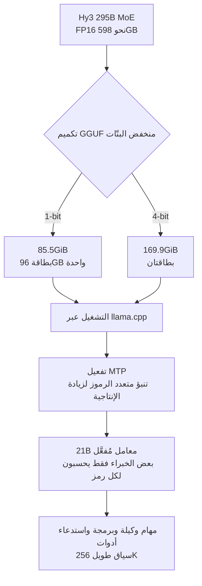

## نظرة عامة

أول جدار يصطدم به أي فريق عند خدمة نموذج كبير على بنيته التحتية الخاصة ليس الحوسبة بل الذاكرة. يتطلّب تحميل نموذج بحجم 295B بدقة FP16 نحو 598GB من الأوزان مقيمة في ذاكرة وحدة المعالجة الرسومية، وهو حجم يكاد لا يتّسع إلا عبر ثماني بطاقات H100 بسعة 80GB. لهذا ظلّت النماذج الرائدة مفتوحة الأوزان في موضع محرج: مُعلنة، لكن يصعب علينا خدمتها فعلياً.

تستهدف نسخ Hy3 بصيغة GGUF بدقة 1-bit و4-bit التي أصدرتها Tencent Hunyuan في 14 يوليو 2026 هذه النقطة مباشرةً. فهي تضغط نموذج MoE بحجم 295B إلى صيغة منخفضة البتّات ليعمل على بطاقة واحدة، وتُنشر الأوزان برخصة Apache 2.0. عرّفت Tencent النموذج على منصة X بأنه «نموذج بحجم رائد 295B يمكن خدمته على وحدة معالجة رسومية واحدة»، مع ذكر llama.cpp وMTP معاً.

تقرأ هذه المقالة نسخ Hy3 المكمّمة من منظور ThakiCloud بوصفنا فريقاً يخدم نماذج منخفضة البتّات في بيئة متعددة المستأجرين. نستعرض ما تغيّره الضغطة فعلياً، ولماذا يجب قراءة عبارة «وحدة واحدة» بحذر، وماذا يعني هذا الاتجاه لبنية الاستدلال المحلية لدينا. ولنكن واضحين منذ البداية: كل أرقام الحجم والأداء أدناه قيَم أبلغت عنها Tencent والمجتمع، وليست أرقاماً أعادت ThakiCloud إنتاجها.

## ما هذه التقنية

‏Hy3 نموذج Mixture-of-Experts بإجمالي 295B معامل، لكن ما يُفعَّل لمعالجة رمز واحد نحو 21B فقط. يدعم سياقاً طويلاً بحجم 256K رمز، ويستهدف المهام الوكيلة والبرمجة واستدعاء الأدوات. الجديد هنا ليس نموذجاً جديداً بل تمثيلاً منخفض البتّات بصيغة GGUF لأوزان Hy3 القائمة. صدرت نسختان.

تُقلّص نسخة 1-bit النموذج من نحو 598GB إلى 85.5GiB. بهذا الحجم تتّسع الأوزان على بطاقة واحدة من فئة 96GB. تشغل نسخة 4-bit مساحة 169.9GiB وتحتاج إلى الامتداد عبر بطاقتين، لكنها بالمقابل تحافظ على جودة أقرب بكثير إلى الأصل وفق ما أُبلغ. تعمل النسختان مع llama.cpp، وصُمِّمتا لتفعيل MTP (التنبؤ متعدد الرموز) لرفع إنتاجية توليد الرموز.



بنية MoE هي ما يجعل هذه الضغطة جذّابة بوجه خاص. فمن أصل 295B، لا يشارك في الحساب لكل رمز سوى خبراء بحجم 21B، لذا فالحوسبة نفسها في حدود نموذج كثيف بحجم 21B. يكمن عنق الزجاجة كلياً في «أين تُقيم كل أوزان الخبراء». والضغط منخفض البتّات يهاجم تحديداً تكلفة الإقامة تلك.

## لماذا تحتاج عبارة «وحدة واحدة» إلى قراءة متأنية

هذه أسهل عبارة يُساء فهمها في التسويق. «الخدمة على وحدة واحدة» صحيحة، لكن المقصود بالوحدة هنا جهاز بذاكرة موحّدة من فئة 128GB. فكّر في DGX Spark، أو Mac Studio بسعة 128GB، أو Strix Halo. إن تخيّلت بطاقة RTX 3060 واحدة بسعة 16GB، فهذا التوقع بعيد.

يهمّ هذا التمييز لأن الحساب العملي يتغيّر كلياً. يتطلّب تحميل 85.5GiB من الأوزان بطاقة سعتها 96GB على الأقل، وبمجرد إضافة ذاكرة KV cache وذاكرة التنشيط وحالة الانتباه لسياق طويل، يتقلّص الهامش الفعلي أكثر. حتى على جهاز من فئة 128GB يكون العبء ضيّقاً مع عبء عمل يملأ سياق 256K فعلاً. «بطاقة واحدة» تشير إلى عدد المنافذ الفيزيائية، لا إلى عتاد رخيص.

ومع ذلك، فهذا الإصدار مهم لأن مرجع المقارنة عقدة H100 من ثماني بطاقات. فإذا استُبدلت العقدة متعددة البطاقات التي كانت خدمة FP16 تتطلّبها ببطاقة واحدة عالية السعة، تنخفض الطاقة والمساحة وتعقيد الربط البيني بشكل حادّ. لا تنخفض التكلفة المطلقة بقدر ما يصبح شكل النظام المطلوب أبسط جوهرياً.

## ‏1-bit مقابل 4-bit: ماذا تكسب وماذا تخسر

تمثّل النسختان خيارين مختلفين. نسخة 1-bit مُحسّنة لدفع النموذج إلى أقل عتاد ممكن. حجم 85.5GiB نتيجة ضغط شديد، وتقبل في المقابل خسارة جودة مقابل الأصل. أما نسخة 4-bit فتطلب ضعف الذاكرة تقريباً عند 169.9GiB، لكن تقارير المجتمع تقول إنها تحافظ على أداء قريب من الأصل.

هنا تبرز قاعدة قرار عملية. في مهام الوكلاء حيث تتراكم استدعاءات الأدوات وسلاسل الاستدلال الطويلة، تتراكم تراجعات الجودة الصغيرة وتميل إلى إفساد النتيجة النهائية. تبدو الأسئلة القصيرة سليمة حتى مع 1-bit، لكن في العمل الوكيل المتعدد الخطوات يعمل هامش 4-bit الإضافي كحاجز أمان. إن سمحت ميزانية العتاد، فتفضيل 4-bit لخدمة الوكلاء هو الخيار الافتراضي المعقول.

يندرج ذكر MTP في هذا السياق أيضاً. فالتنبؤ متعدد الرموز يقترح ويتحقّق من عدة رموز من تمريرة أمامية واحدة، ما يرفع إنتاجية مرحلة فك التشفير المقيّدة بعرض نطاق الذاكرة. ولأن النماذج منخفضة البتّات أوزانها أصغر، فهي تحرّر هامشاً نسبياً من عرض نطاق الذاكرة يتناسب جيداً مع تقنيات الإنتاجية مثل MTP.

## منظور التثبيت والخدمة

بما أنها ملفات GGUF قائمة على llama.cpp، فمسار الخدمة نفسه مألوف. تجلب ملف GGUF، وتحمّله عبر llama.cpp، وتفعّل خيار MTP، ثم تعرضه كخادم متوافق مع OpenAI. من الناحية المفاهيمية تبدو البنية هكذا.

```bash
# تحميل نسخة 1-bit GGUF (مثال مفاهيمي، راجع مستودع الإصدار لأسماء الملفات والرايات الدقيقة)
./llama-server \
  --model hy3-295b-1bit.gguf \
  --ctx-size 262144 \
  --n-gpu-layers 999 \
  --draft-max 4          # تنبؤ متعدد الرموز على طراز MTP
```

إن أردت إعطاء الأولوية للإنتاجية عند FP8 أو دقة أعلى بدلاً من ذلك، فقد وثّق المجتمع أيضاً مساراً يخدم عبر بطاقات متعددة باستخدام vLLM أو SGLang مع Expert Parallelism. يستهدف مسار GGUF منخفض البتّات الخدمة من عقدة واحدة على أقل عتاد، بينما يستهدف مسار vLLM الإنتاجية وعدد المستخدمين المتزامنين.

لم ننزّل فعلياً نسخة 85.5GiB ولم نشغّل الاستدلال لأجل هذه المقالة. فمتطلّب العتاد بذاكرة موحّدة 96GB أو أكثر يقع خارج نطاق بيئة هذا التصريف. وعليه فالأرقام أعلاه كلها قيَم أبلغت عنها Tencent والمجتمع، ونذكر بصدق غياب إعادة الإنتاج. على أي جهة تقيّم التبنّي أن تدرج خطوة للتحقق من الجودة والإنتاجية بقياساتها الخاصة على العتاد المستهدف.

## دلالات لمنتجات ThakiCloud

يهمّ هذا الإصدار خصوصاً من منظور **ai-platform** لدى ThakiCloud. تجدول ai-platform وحدات المعالجة الرسومية عبر K8s وKueue وتخدم النماذج عبر بيئات عملاء متنوعة بالاعتماد على vLLM. تشغيل نموذج بحجم رائد على عقدة واحدة عالية السعة يعني أن وحدة توزيع العقد للخدمة متعددة المستأجرين تصبح أبسط. فبدلاً من جدولة مبنية على عقد H100 من ثماني بطاقات، تصبح معالجة بطاقة واحدة من فئة 128GB كوحدة خدمة واحدة تجعل إدارة الطوابير وتوزيع الأولويات في Kueue أكثر قابلية للتنبؤ.

في سياق الاستضافة المحلية والذكاء الاصطناعي السيادي، يكون هذا الاتجاه أكثر مباشرةً. فالعملاء الذين لا يمكنهم إرسال بياناتهم المحلية إلى الخارج مضطرون لتشغيل النماذج على عتادهم الخاص، وعقدة بثماني بطاقات حاجز مرتفع في التوريد والمساحة والطاقة. فإذا أمكن خدمة نموذج رائد على جهاز واحد من فئة 128GB، تنخفض عتبة العتاد للنشر السيادي بوضوح. مع ذلك، فإن التحقق مما إذا كانت خسارة الجودة منخفضة البتّات مقبولة لعبء عمل العميل مسؤولية يجب أن نتحمّلها.

من منظور أعباء عمل الوكلاء، يتّصل هذا بـ **Paxis** أيضاً. Paxis هي Agent-Native Cloud التي تعمل فوق ai-platform، تنفّذ المهارات في بيئات معزولة وتمرّر كل إجراء عبر بوّابات السياسات وسجلات التدقيق. فإذا أمكن خدمة نموذج متخصص في الوكلاء واستدعاء الأدوات مثل Hy3 بتكلفة عتاد منخفضة، تنخفض تكلفة التشغيل لكل وكيل، وهذا بدوره يعني إمكانية تشغيل مزيد من التدفقات المستقلة اقتصادياً. الخدمة منخفضة التكلفة هي البنية التي تصنع اقتصاديات الوكلاء.

## القيود والاعتراضات

أكبر اعتراض هو حقيقة «الوحدة الواحدة». فجهاز بذاكرة موحّدة من فئة 96GB إلى 128GB لا يزال باهظاً وليس عتاداً سائداً بحق. قراءة هذا الإصدار على أنه «يمكن للجميع الآن تشغيل 295B على حاسوب محمول» سوء فهم. الأدقّ هو أن «عبء عمل كان يتطلّب عقدة متعددة البطاقات نزل إلى بطاقة واحدة عالية السعة».

ثانياً، قد تكون خسارة جودة نسخة 1-bit قاتلة حسب عبء العمل. تقول ملخّصات القياس «قريب من الأصل»، لكن هذا يُقاس عادةً مقابل 4-bit أو على تقييمات تغلب عليها المهام القصيرة. أما كيف تصمد 1-bit تحت سلاسل استدلال طويلة واستدعاءات أدوات دقيقة متكرّرة في المهام الوكيلة فلا يتأكّد إلا على أعباء العمل الحقيقية.

ثالثاً، لم تُتحقّق هذه الأرقام بعد على نطاق واسع وبشكل مستقل. فهي تعتمد على تقارير من Tencent والمجتمع المبكر، وإلى أن تتراكم نتائج إعادة الإنتاج عبر عتاد ومهام متنوعة، يبقى التعامل معها بحذر الموقف الأكثر أماناً. ونحن أيضاً سنستخدم الأرقام المنشورة نقطة انطلاق فقط عند تقييم التبنّي، ونتّخذ قياساتنا الخاصة على البيئة المستهدفة مرجعاً.

ومع ذلك، فالاتجاه نفسه واضح. انتقال وحدة الخدمة للنماذج الرائدة مفتوحة الأوزان من عقدة متعددة البطاقات إلى بطاقة واحدة عالية السعة إشارة مرحّب بها لأي بنية تحتية تتعامل مع الاستضافة المحلية والذكاء الاصطناعي السيادي.

## المصادر

- [Tencent Hunyuan، إصدار Hy3 بدقة 1-bit و4-bit (X)](https://x.com/TencentHunyuan/status/2076953120765280284)
- [tencent/Hy3 (Hugging Face)](https://huggingface.co/tencent/Hy3)
- [Tencent Hy3 GGUF 1-bit 4-bit Single GPU (explainX)](https://explainx.ai/blog/tencent-hy3-gguf-1-bit-4-bit-single-gpu-llama-cpp-july-2026)
- [تحليل إصدار Hunyuan Hy3 المكمّم (Remio)](https://www.remio.ai/post/tencent-hunyuan-hy3-quantized-release-1bit-single-card-deployment-4bit-near-full-performance)
- [نشر Hunyuan Hy3 عبر vLLM وExpert Parallelism (Spheron)](https://www.spheron.network/blog/deploy-hunyuan-3-gpu-cloud/)
