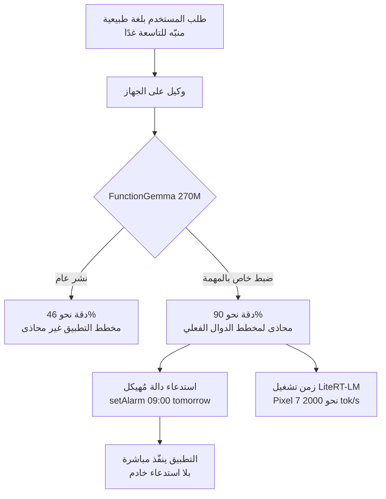

## نظرة عامة

صمدت طويلًا فكرة أن النماذج الصغيرة ليست ذكية. لذلك ألقى الممارسون كل مهمة تقريبًا على النماذج الكبيرة، ودفعوا ثمن ذلك كمونًا وتكلفةً وخطرَ خروج البيانات من الجهاز. لكن إن حصرت المهمة بشكل ضيّق جدًا تتغير الحكاية. تخلَّ عن العمومية واضبط نموذجًا صغيرًا ليُتقن شيئًا واحدًا بالضبط، وضمن ذلك المجال الضيّق لا يبقى سبب لاستدعاء نموذج كبير.

يستهدف عرض «From 46% to 90%: Fine-Tuning Tiny LLMs for On-Device Agents»، الذي قدّمه Cormac Brick، المهندس الرئيسي في Google AI Edge، هذه النقطة بالضبط. رفع ضبطُ نموذج FunctionGemma بحجم 270 مليون معامل على مهمة وكيل محددة الدقةَ من 46% إلى 90%، وهذا هو عنوان العرض وخلاصته معًا. ويُبلَّغ أن هذا النموذج يحقق نحو 2000 رمز في الثانية من إنتاجية المعالجة المسبقة (prefill) على Pixel 7. كل ذلك يحدث داخل الهاتف، بلا استدعاء خادم.

يقرأ هذا المقال ذلك العرض من منظور ThakiCloud التي تُشغّل بنية استدلال متعددة المستأجرين. ننظر في سبب كون نموذج صغير متخصص منطقيًا على الجهاز، وماذا يغيّر الضبط فعلًا، وكيف يبسّط زمن تشغيل مثل LiteRT-LM النشرَ، وما المعنى العملي الذي يحمله هذا الاتجاه لبنية الخدمة ومنصة الوكلاء لدينا. أرقام الدقة والإنتاجية والمدة المذكورة أدناه كلها قيم مُبلَّغ عنها من العرض والتغطية المرتبطة، وليست قيمًا أعاد ThakiCloud إنتاجها.



الفيديو أعلاه هو عرض Cormac Brick الأصلي كاملًا. والتحليل أدناه مبني على ذلك العرض والتغطية العامة.

## ما هي هذه التقنية

FunctionGemma نموذج بحجم 270 مليون معامل من عائلة Gemma متخصص في استدعاء الدوال (function calling). استدعاء الدوال هو السلوك الجوهري لوكيل على الجهاز، لأنه يحوّل طلب المستخدم بلغة طبيعية إلى استدعاء أداة مُهيكل يستطيع التطبيق تنفيذه. تحويل «اضبط منبّهًا للتاسعة صباح الغد» إلى استدعاء مثل `setAlarm(time="09:00", date="tomorrow")` مثال على ذلك. وما دام هذا التحويل دقيقًا، فلا حاجة لاستدعاء نموذج عام بمليارات المعاملات.

المشكلة أن نموذجًا صغيرًا منشورًا بشكل عام تكون دقته منخفضة على مخطط أدوات تطبيق محدد. الـ46% التي يذكرها العرض هي تلك النقطة بالضبط. وهنا يدخل الضبط. اضبط النموذج بشكل ضيّق على مخطط الدوال الفعلي وأنماط الطلبات في التطبيق المستهدف، فيرتفع النموذج نفسه بحجم 270 مليون إلى 90%.

## من 46% إلى 90%: ماذا يفعل الضبط

فهم طبيعة هذه الفجوة مهم. يستدلّ النموذج الكبير عبر حتى مخطط غير مألوف بفضل معرفة عامة هائلة. أما النموذج الصغير فيفتقر إلى ذلك الفائض. لكن ركّزه على توزيع ضيّق، فيصبح ضمن ذلك التوزيع دقيقًا بقدر نموذج كبير تقريبًا. الضبط أقرب إلى توجيه السعة التي يملكها النموذج أصلًا نحو المهمة المستهدفة منه إلى حقن ذكاء جديد فيه.

وفقًا للعرض، ينتهي هذا الضبط في زمن قصير على نحو لافت. تُبلّغ التغطية المرتبطة بأن التدريب يكتمل في نحو 21 دقيقة. وبفضل الحجم الصغير البالغ 270 مليون، يكون التدريب نفسه خفيفًا وقابلًا للإدارة حتى على عتاد استهلاكي. ويحمل هذا دلالات مباشرة لممارسة علم البيانات. فهو يعني أن نموذج تشغيل يكون فيه لكل تطبيق ولكل مجموعة أدوات نموذجه الصغير المتخصص، ويُدرَّب كلٌّ منها بإيجاز، هو نموذج واقعي. فبدل تغطية كل تطبيق بنموذج عام واحد ضخم، تحتفظ بعدة نماذج متخصصة مُقسَّمة بدقة حسب المهمة.

تلامس هذه الفكرة أيضًا مبدأً حافظنا عليه في عملنا الدُّفعي على المحتوى. حلٌّ متخصص يملأ هيكلًا ضيّقًا مُتحقَّقًا منه يتفوق على حلٍّ عام عالي درجة الحرية في متوسط الجودة. وضبط نموذج صغير يطبّق ذلك المبدأ على مستوى النموذج.

## ماذا يمنحك التشغيل على الجهاز: الكمون والخصوصية والعمل دون اتصال والتكلفة

يشدّد العرض على التشغيل على الجهاز لأربعة أسباب.

ينخفض الكمون. لأن الطلب لا يقطع رحلة ذهاب وإياب عبر الشبكة، ينتهي تحويل استدعاء الدالة فورًا داخل الهاتف. ولواجهة يجب أن يتفاعل فيها الوكيل مع أفعال المستخدم في الزمن الحقيقي، يكون هذا الفارق حاسمًا.

تُصان الخصوصية. لا تغادر طلبات المستخدم وبياناته الشخصية الجهاز أبدًا. وفي سياقات حساسة كالصحة والمال والمراسلة، تصبح حقيقة عدم ذهاب البيانات إلى خادم بحد ذاتها متطلبًا للمنتج.

يعمل دون اتصال. يؤدي الوكيل وظيفته حتى بلا شبكة. النموذج السحابي عاجز حين ينقطع الاتصال؛ أما النموذج على الجهاز فلا.

تختفي التكلفة. لأن الاستدلال يجري على الجهاز، لا توجد محاسبة API لكل رمز. وكلما زاد استخدام التطبيق، كبُر هذا التوفير.

## ‏LiteRT-LM وحزمة النشر

تدريب نموذج صغير ونشره على أجهزة لا تُحصى مشكلتان منفصلتان. يعرض العرض LiteRT-LM كزمن تشغيل للنشر. LiteRT-LM زمن تشغيل يتيح لك وضع نماذج مثل Gemma 4 على طيف واسع من العتاد من المحمول إلى الأنظمة المدمجة. وبدمجه مع AI Core، كما يشرح العرض، يمكنك تشغيل مهارات وكيل على الجهاز.

الجوهر أن ثمة مسارًا لنشر نموذج واحد باتساق عبر عتاد متنوع. فدون عناء إعادة تركيب نموذج متخصص مُدرَّب على مُسرِّع كل جهاز، يمتص زمن التشغيل ذلك التغاير. وهذا هو الشرط العملي الذي يرفع الوكلاء على الجهاز من مستوى التجربة إلى مستوى المنتج.

## ماذا يعني هذا لمنتجات ThakiCloud

قد يبدو اتجاه النماذج المتخصصة على الجهاز إشارةً معاكسة لنا نحن مُشغِّلي الخدمة السحابية، لكنه في الواقع يحمل دلالات مباشرة لكلا المنتجين.

**عدسة ai-platform.** يزيح صعود النماذج الصغيرة المتخصصة تركيز بنية الخدمة. توفّر منصة ai-platform من ThakiCloud جدولة GPU قائمة على K8s وKueue، وعزلًا متعدد المستأجرين، وخدمة داخل المؤسسة. السؤال الذي يطرحه الضبط على الجهاز هنا ليس «إذا انتقل كل شيء إلى الجهاز، فهل يصبح الخادم غير ضروري؟» بل العكس. فلتدريب نموذج متخصص منفصل بإيجاز لكل تطبيق، تحتاج بنية تحتية تشغّل تلك المهام التدريبية بتكلفة منخفضة وعلى نطاق واسع. إن عبء عمل يكرّر ضبطًا بحجم 270 مليون يستغرق 21 دقيقة عبر مئات مجموعات الأدوات هو بالضبط ما تستهدفه بنية تصفّ الـGPU عبر Kueue وتعزل حسب المستأجر. التدريب على الخادم والاستدلال على الجهاز هو الخلاصة الطبيعية.

في الوقت نفسه، لا تكتفي كل مؤسسة بالاستدلال على الجهاز وحده. فحين يلزم سياق أكبر أو استدلال أعقد، يتدخّل نموذج خادم. وللمؤسسات المتحفظة على إرسال بيانات المصدر إلى سحابة خارجية، تصبح الخدمة داخل المؤسسة والاستضافة الذاتية مهمة. والتنافسية على تكلفة خدمة منخفضة هي مفتاح الاحتفاظ بتلك المؤسسات.

**عدسة Paxis.** جوهر FunctionGemma هو تحويل اللغة الطبيعية إلى استدعاء أداة مُهيكل. وهذا نسخة مصغّرة مما تفعله Paxis. إن Paxis هي السحابة الأصيلة للوكلاء من ThakiCloud، تختار من أكثر من 960 مهارة عبر BM25، وتشغّلها في صناديق رملية معزولة، وتمرّر كل فعل عبر بوابات السياسة وسجلات التدقيق. إذا عالج وكيل على الجهاز استدعاءات الدوال لمجموعة أدوات ضيّقة على الهاتف، فإن Paxis تعالج توجيه الأدوات عبر فضاء مهارات أوسع بكثير في السحابة. الطبقتان لا تتنافسان؛ بل تتكاملان. تنشأ بنية طبقية يتولى فيها الجهاز تفسير النية المحلي الخفيف، وتتولى Paxis العمل الذي يتطلب تنسيقًا معقدًا متعدد الوكلاء وتدقيقًا.

## القيود والاعتراضات

لهذا النهج حدود واضحة أيضًا.

أولًا، ثمن التخصص هو العمومية. ذلك النموذج الذي رفع 46% إلى 90% قويٌّ فقط في المهمة الضيّقة التي دُرِّب عليها. غيّر مخطط الأدوات أو انتقل إلى مجال تطبيق جديد وعليك الضبط من جديد. وفي بيئة تتغير فيها التطبيقات والأدوات كثيرًا، يكبُر عبء الصيانة تبعًا لذلك.

ثانيًا، هل تكفي الـ90% يعتمد على المهمة. إن الخطأ في استدعاء دالة يعني تنفيذ فعل خاطئ، ففي المجالات التي تكون فيها كلفة الفشل عالية قد يكون خطأ بنسبة 10% قاتلًا. وفي تلك الحالة تحتاج بنية مزدوجة يتحقق فيها نموذج خادم من نتيجة الجهاز.

ثالثًا، رقم الـ21 دقيقة للتدريب يعتمد بشدة على الحجم والعتاد. فالتكلفة التشغيلية الحقيقية بما فيها إعداد البيانات ومحاذاة المخطط والتقييم لا يمكن الحكم عليها بزمن التدريب وحده. وينبغي أخذ أرقام العرض المبهرة كقيم في ظروف مُرتَّبة جيدًا.

رابعًا، يواجه النشر على الجهاز تجزئة الأجهزة. فحتى لو امتص LiteRT-LM التغاير، يبقى الأداء الفعلي وقيود الذاكرة لكل جهاز يطلبان تحققًا فرديًا.

مع ذلك، اتجاه تشغيل نموذج صغير متخصص على الجهاز مقنع. إنه النقطة التي تتحقق فيها الفوائد الأربع، الكمون والخصوصية والعمل دون اتصال والتكلفة، في آنٍ واحد. وبالنسبة لنا، هذا الاتجاه ليس إشارة إلى أن الخادم يصبح غير ضروري، بل إشارة تجعلنا نعيد رسم أين ينبغي أن يقع الفصل بين التدريب والاستدلال.

## المصادر

- [From 46% to 90%: Fine-Tuning Tiny LLMs for On-Device Agents - Cormac Brick, Google (YouTube)](https://www.youtube.com/watch?v=-TiET_K-E_g)
- [Google's Cormac Brick on Tiny LLMs for On-Device Agents - StartupHub.ai](https://www.startuphub.ai/ai-news/ai-research/2026/google-s-cormac-brick-on-tiny-llms-for-on-device-agents)
- [Fine-tune FunctionGemma 270M for Mobile Actions - Google AI for Developers](https://ai.google.dev/gemma/docs/mobile-actions)
