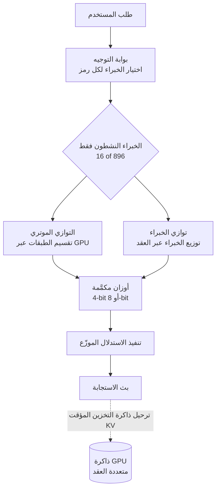

## نظرة عامة

في 16 يوليو 2026، أطلقت شركة Moonshot AI الصينية نموذج Kimi K3. بإجمالي 2.8 تريليون معلمة، يُعد هذا أكبر نموذج مفتوح الأوزان تم الإفصاح عنه حتى الآن. وصفت وسائل إعلام عديدة هذا الإطلاق بأنه اللحظة التي وصل فيها معسكر النماذج المفتوحة الأوزان إلى مستوى الأداء المتقدم (frontier).

الجانب الذي لفت الانتباه أكثر من غيره كان الواجهة الأمامية (frontend). في اختبار من منصة تقييم الذكاء الاصطناعي Arena يقيس القدرة على بناء واجهات الويب، احتل Kimi K3 المرتبة الأولى، وفي اختبارات عمياء فضّل المطورون Kimi على Fable 5 من Anthropic وGPT-5.6 من OpenAI في برمجة الواجهات الأمامية. وقد عرضت Moonshot ذلك من خلال عرض توضيحي بنى لعبة ثلاثية الأبعاد بعالم مفتوح داخل متصفح الويب باستخدام Three.js وWebGPU.

بدلاً من تكرار ترتيب نتائج الاختبارات، تركز هذه المقالة على السؤال الذي يلي ذلك. مفتوح الأوزان يعني أن بإمكان أي شخص تشغيل هذا النموذج على بنيته التحتية الخاصة. فماذا يتطلب فعلياً تشغيل نموذج بـ 2.8 تريليون معلمة. بما أن ThakiCloud تعتبر تشغيل النماذج في البيئات المحلية (on-premise) لدى العملاء قدرة أساسية لديها، سنقرأ هذا الإطلاق من منظور المشغّل.

## ما هو Kimi K3

Kimi K3 هو نموذج بمعمارية خليط الخبراء (Mixture of Experts، أو MoE). يمتلك إجمالي 2.8 تريليون معلمة، لكن ليست جميعها تُفعّل عند معالجة كل رمز (token). وفقاً للمعلومات المُعلنة، يُفعّل النموذج 16 خبيراً من أصل 896 خبيراً، ويُقدَّر عدد المعلمات النشطة المستخدمة فعلياً في الحساب بنحو 50 مليار [تقديري]. لم تُفصح Moonshot رسمياً عن عدد المعلمات النشطة.

من الناحية المعمارية، جرى تقديم ابتكارين. الأول هو Kimi Delta Attention (KDA)، والثاني هو Attention Residuals (AttnRes). تشرح Moonshot أن هذين العنصرين معاً يرفعان الكفاءة وجودة الاستدلال في آن واحد. يبلغ طول السياق مليون رمز، وهو تصميم يُقرأ على أنه موجّه نحو أعباء عمل الوكلاء (agent) التي تتعامل مع سياقات طويلة.

يجب توخي الحذر فيما يتعلق بالترخيص. صدرت السلسلة السابقة، Kimi K2، بترخيص MIT معدّل في يوليو 2025، لكن شروط ترخيص K3 نفسها لم تكن قد تأكدت أو أُعلنت بشكل نهائي وقت كتابة هذا المقال. تصف Moonshot النموذج K3 بأنه مفتوح، وأعلنت أنها ستنشر كامل الأوزان بحلول 27 يوليو 2026، لكن حتى وقت النشر لم تكن نقاط التحقق (checkpoints) الرسمية قد ظهرت بعد على حساب Moonshot التنظيمي في Hugging Face. لذلك، فإن أي جهة تفكر في اعتماد النموذج فعلياً يجب أن تتحقق بنفسها من نص الترخيص النهائي ومن حالة توفر الأوزان.

## لماذا يهم هذا الإطلاق

لم يعد أمراً نادراً أن يتفوق نموذج مفتوح الأوزان على أفضل النماذج المغلقة في مهمة ضيقة محددة. لكن أن يحتل هذا الموقع في مجال يستخدمه المطورون يومياً، وهو برمجة الواجهات الأمامية، وبأكبر مجموعة أوزان مفتوحة في العالم، أمر يحمل دلالة مختلفة. فهذا إشارة إلى ظهور بديل يمكن تشغيله ذاتياً، بعد أن كانت الحاجة إلى الأداء وحدها تفرض الارتباط بواجهات برمجية مغلقة.

الواجهة الأمامية وتوليد واجهات المستخدم تحديداً مجال يمكن فيه رؤية النتيجة بالعين مباشرة. وفي هذا السياق يأتي تأكيد Moonshot على ما تسميه الرؤية داخل الحلقة (vision in the loop)، وهي دورة يرى فيها النموذج ما ولّده ثم يصححه. الادعاء هو أن هذه الحلقة مفيدة بشكل خاص في المهام البصرية مثل تطوير الألعاب وتصميم واجهات المستخدم والتصميم بمساعدة الحاسوب. إنه تجاوز لمجرد توليد الكود كنص، نحو اعتماد النتيجة المعروضة فعلياً كتغذية راجعة.

## ماذا يعني فعلياً تشغيل نموذج بـ 2.8 تريليون معلمة

هنا يبدأ مجال المشغّل. هناك مسافة كبيرة بين حقيقة أن النموذج مفتوح الأوزان وحقيقة أن بإمكانك تشغيله ذاتياً.

الذاكرة أولاً. تحميل كامل 2.8 تريليون معلمة بدقتها الأصلية يتطلب عدة تيرابايت من ذاكرة GPU. هذا مستوى يصعب على GPU واحد التعامل معه، بل حتى على خادم واحد يحتوي عدة وحدات GPU، مما يجعل التشغيل الموزّع عبر عقد (nodes) متعددة أمراً مفروضاً مسبقاً. غير أن بنية MoE تخفف العبء إلى حد ما. بما أن جزءاً فقط من الخبراء يُفعّل لكل رمز وليس النموذج بأكمله، يبقى حجم الحساب الفعلي قريباً من حجم المعلمات النشطة. ومع ذلك، يجب أن تبقى أوزان جميع الخبراء مقيمة في الذاكرة كي يمكن استدعاؤها في أي وقت، لذا يبقى عبء التخزين مرتبطاً بإجمالي عدد المعلمات.

لهذا السبب تصبح تقنيتان شبه إلزاميتين للتشغيل الذاتي الواقعي. الأولى هي التكميم (quantization). خفض دقة الأوزان إلى 8 بت أو 4 بت يقلل استهلاك الذاكرة ويخفض بشكل كبير عدد وحدات GPU المطلوبة. والثانية هي التوازي (parallelism). يقسّم التوازي الموتري (tensor parallelism) طبقات النموذج عبر عدة وحدات GPU، وبالنسبة لنماذج MoE، يضيف التوازي بين الخبراء (expert parallelism) توزيع الخبراء عبر عدة أجهزة. مسار التشغيل يمكن تصويره كما يلي.

هذه هي النقطة الجوهرية. مفتوح الأوزان يعني أن الأوزان مجانية، لا أن التشغيل مجاني. تشغيل نموذج بهذا الحجم بشكل موثوق على بنيتك التحتية الخاصة يتطلب عنقود GPU متعدد العقد، وخط أنابيب للتكميم، ومحرك استدلال موزّع، وطبقة جدولة ومراقبة تربط كل ذلك معاً. هنا بالضبط تظهر قيمة المنصة.

## دلالات على منتجات ThakiCloud

يوضح هذا الإطلاق في آن واحد سبب الحاجة إلى منتجين من منتجات ThakiCloud.

أولاً، من منظور البنية التحتية: ai-platform. منصة ai-platform لدى ThakiCloud هي بنية تحتية للذكاء الاصطناعي وتعلّم الآلة قائمة على Kubernetes، توفر جدولة GPU عبر Kueue، وعزلاً متعدد المستأجرين (multi-tenant)، وتشغيلاً موزّعاً، وقابلية مراقبة. بالنسبة لعميل يرغب في تشغيل نموذج ضخم مفتوح الأوزان مثل Kimi K3 على بنيته التحتية الخاصة، هذه الطبقة ليست خياراً بل شرطاً مسبقاً. إدارة موارد GPU عبر عقد متعددة وفق سياسات محددة، وتحويل التشغيل المكمَّم والموازي إلى شكل قابل للتشغيل الفعلي، هو ما يحدد إمكانية الاعتماد من الأساس. في بيئة ذات سيادة بيانات (sovereign) لا يمكن فيها إخراج البيانات إلى الخارج، تصبح القدرة على تشغيل نموذج مفتوح الأوزان بمستوى متقدم ذاتياً مبرراً قوياً بحد ذاته للاعتماد على المنصة.

ثانياً، من منظور الوكلاء (agents): Paxis. قوة Kimi K3 في برمجة الواجهات الأمامية والتوليد البصري ترتبط مباشرة بوكلاء البرمجة. Paxis هي السحابة الأصلية للوكلاء (Agent-Native Cloud) لدى ThakiCloud، وتتعامل مع المهارات (skills) والأدوات والسياسات وسجلات التدقيق كموارد من الدرجة الأولى. تُشغّل المهارات داخل صناديق رملية (sandbox) معزولة، وتنسّق وكلاء متعددين على شكل رسم بياني موجّه غير دوري (DAG)، وتُمرر كل إجراء عبر بوابات سياسات وسجلات تدقيق. بالنسبة لمنظمة ترغب في تشغيل وكيل برمجة يعتمد على الرؤية داخل الحلقة، أي يولّد كوداً ويتحقق من نتيجته ويصححه، ضمن حدود تنفيذ آمنة، تصبح طبقة التحكم هذه ضرورة. وعندما يلتقي نموذج برمجة قوي مفتوح الأوزان مع بيئة تنفيذ آمنة للوكلاء، تكتمل صورة وكيل برمجة عملي يعمل على البنية التحتية الخاصة بك.

المنظوران يكمّلان بعضهما البعض. التشغيل الذاتي منخفض التكلفة (ai-platform) هو ما يجعل تشغيل الوكلاء بشكل مستمر أمراً مجدياً اقتصادياً (Paxis)، وعبء عمل الوكلاء القوي (Paxis) هو ما يمنح بنية التشغيل هذه (ai-platform) سبب وجودها.

## حدود وحجج مضادة

بمعزل عن الحماس السائد، هناك نقاط تستحق نظرة باردة.

أولاً، حتى وقت كتابة هذا المقال، قد لا تكون كامل الأوزان قد نُشرت بشكل كامل بعد، ولم تُحسم شروط الترخيص النهائية. نتيجة اختبار الأداء وحصولك الفعلي على نموذج يمكن تشغيله تجارياً أمران مختلفان. من يفكر في الاعتماد على النموذج يجب أن يبني قراره على الأوزان المنشورة فعلياً ونص الترخيص، لا على مواد الإعلان.

ثانياً، احتلال المرتبة الأولى في اختبار أداء لا يعني تفوقاً في كل الحالات. اختبار تفضيل الواجهة الأمامية هو تقييم نسبي في مهمة محددة، ويجب التحقق مباشرة من كيفية أداء النموذج في عبء العمل الفعلي لديك. افتراض أن نتيجة أعلنها آخرون تنطبق على نتائجك الخاصة أمر محفوف بالمخاطر.

ثالثاً، التكلفة الإجمالية للتشغيل الذاتي ليست صغيرة على الإطلاق. عند احتساب وحدات GPU والطاقة والكوادر التشغيلية اللازمة لتشغيل نموذج بـ 2.8 تريليون معلمة عبر عقد متعددة، قد يكون استخدام واجهة برمجية مغلقة في الواقع أرخص للمنظمات ذات حركة المرور المنخفضة. الميزة الحقيقية للنماذج مفتوحة الأوزان ليست منخفضة التكلفة بشكل مطلق، بل تكمن في سيادة البيانات، وتجنب الارتباط بمزوّد واحد، وإمكانية التحكم في التكلفة عند الحجم الكافي. يجب حساب حجم حركة المرور ومتطلبات البيانات الخاصة بك أولاً، ثم اتخاذ القرار.

## المصادر

- [China's Moonshot AI releases Kimi K3, the largest open-source model ever (VentureBeat)](https://venturebeat.com/technology/chinas-moonshot-ai-releases-kimi-k3-the-largest-open-source-model-ever-rivaling-top-u-s-systems)
- [Moonshot AI Releases Kimi K3: A 2.8 Trillion Parameter Open MoE Model With Kimi Delta Attention (MarkTechPost)](https://www.marktechpost.com/2026/07/16/moonshot-ai-releases-kimi-k3-a-2-8-trillion-parameter-open-moe-model-with-kimi-delta-attention-and-1m-context/)
- [China's open-weight Kimi model stuns AI world with frontier-level results (Axios)](https://www.axios.com/2026/07/16/moonshot-kimi-ai-china-model-openai-anthropic)
- [China's Moonshot throws down the gauntlet with Kimi K3 (SiliconANGLE)](https://siliconangle.com/2026/07/16/chinas-moonshot-throws-gauntlet-kimi-k3-worlds-largest-open-weights-model/)
