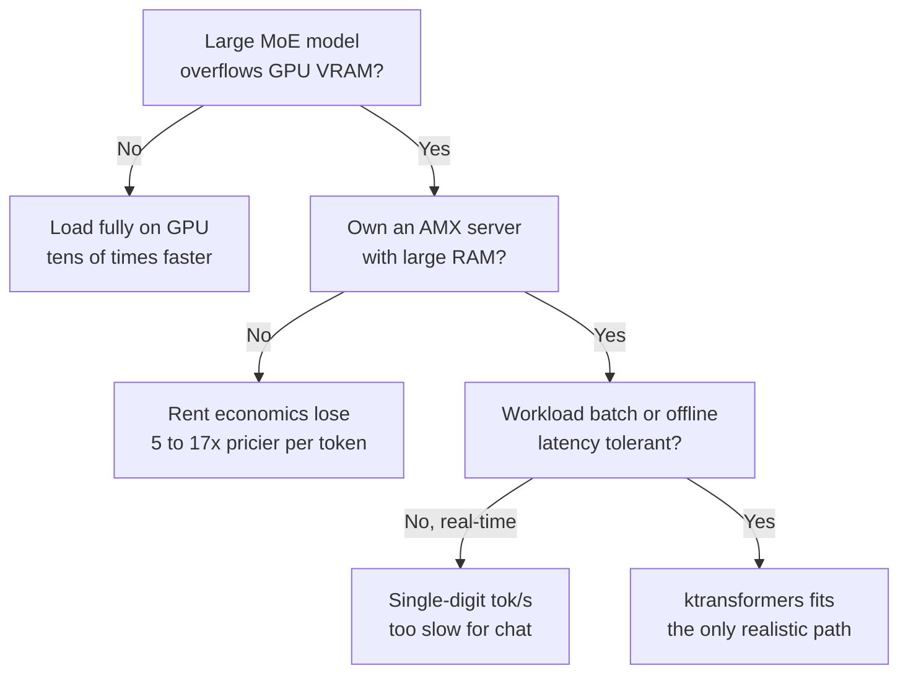

كُتب هذا المقال للمهندسين الذين يفكرون في استضافة نموذج MoE بأنفسهم، وكذلك لمسؤولي البنية التحتية الذين عليهم أن يقرروا إلى أي مدى يثقون بموجة التغريدات الحالية التي تقول "شغّل نموذجاً ضخماً على GPU واحدة". باختصار: حيلة ktransformers حقيقية وتعمل فعلاً. لكن عبارتي "28 ضعفاً" و"خزانة بقيمة 400 ألف دولار على بطاقة واحدة بسعة 24 جيجابايت" اللتين انتشرتا تقومان كل منهما على افتراض خفي. إليكم ما هي هذه الافتراضات، بناءً على قياسات من عمليتي استئجار GPU منفصلتين على RunPod.

## ما الذي أثار الجدل

فكرة ktransformers (kvcache-ai/ktransformers، رخصة Apache 2.0، 17 ألف نجمة)، التي أصدرها مختبر MADSYS في جامعة تسينغهوا، يمكن تلخيصها في جملة واحدة. في نموذج MoE، أبقِ فقط الخبراء الذين يتم استدعاؤهم فعلياً بالقرب من GPU، وضع الخبراء الخاملين معظم الوقت في ذاكرة CPU، مع استدعائهم فقط عند الحاجة. بهذا الترتيب، يُقال إن DeepSeek-V3 وR1 يعملان على 24 جيجابايت من VRAM بسياق يبلغ 139 ألف رمز، وبسرعة تصل إلى 28 ضعفاً مقارنة بالإعداد القياسي.

الحيلة نفسها بسيطة إلى حد يثير الريبة. وهذا بالضبط ما جعلها مثيرة للشك. الطريقة الوحيدة لمعرفة ما إذا كانت هذه وجبة مجانية حقيقية، أو ما إذا كانت هناك فاتورة مخفية في مكان ما، هي استخراج الأرقام بأنفسنا.

## تصميم التجربة: عزل الآلية باستخدام نموذج أصغر

DeepSeek-V3 يبلغ حجمه 671 مليار معامل، أي أنه لن يتسع على بطاقة بسعة 24 جيجابايت. استخدمنا Qwen3-30B-A3B (بإجمالي 30 مليار معامل، منها 3.3 مليار نشطة) كنموذج بديل، وهو نسخة مصغّرة من نفس العائلة (MLA مع MoE دقيق التحبيب). لم يكن الهدف إعادة إنتاج أرقام المُورّد الخاصة بنموذج 671 مليار معامل، بل معرفة ما إذا كانت آلية "نقل الخبراء إلى CPU" تحقق فائدة فعلية، وإذا كانت كذلك، تفكيك مصدر هذه الفائدة.

قسّمنا القياس إلى مرحلتين. أولاً، اختبرنا الآلية نفسها على جهاز AMD جاهز تجارياً. ثانياً، قسنا بشكل منفصل نواة Intel AMX التي تدّعي ktransformers أنها مصدر الأداء.

## المرحلة الأولى: قياس الآلية على بطاقة 4090 تجارية مع AMD

استأجرنا RTX 4090 (بسعة 24 جيجابايت) مع معالج AMD Ryzen 9 7950X و188 جيجابايت من الذاكرة العشوائية على RunPod. هنا ظهر الافتراض الخفي الأول على الفور. نواة الخبراء الخاصة بـ CPU في ktransformers مُحسّنة لتعليمات Intel AMX، وهذا المعالج من AMD لا يملك AMX. لذلك، بدلاً من نواة ktransformers الخاصة، قسنا الآلية بشكل نظيف باستخدام خاصية `--n-cpu-moe` في llama.cpp (الخبراء على CPU، والانتباه (attention) وذاكرة KV المؤقتة على GPU)، التي تنفّذ نفس الحيلة تماماً.

قمنا بضغط (quantize) Qwen3-30B-A3B إلى Q4 وقارنّا سرعة فك الترميز (decode) عبر ثلاثة أوضاع.

| الوضع | سرعة فك الترميز |
|---|---|
| النموذج بالكامل على GPU (full-GPU) | 261.5 tok/s |
| الخبراء على CPU، والانتباه على GPU (الآلية) | 12.0 tok/s |
| الكل على CPU (CPU-only) | 7.4 tok/s |

يظهر هنا أمران. الآلية أسرع بـ 1.62 ضعفاً من CPU الخالص. نقل الانتباه إلى GPU حقق فائدة فعلية. لكن عندما يتسع النموذج بالكامل في VRAM (نسخة Q4 حجمها 18 جيجابايت، وهي تتسع في 24 جيجابايت)، تفوّق full-GPU على الآلية بـ 22 ضعفاً. بمعنى آخر، إذا كان النموذج يتسع على GPU، فإن نقل الخبراء إلى CPU خيار خاسر. هذه الحيلة لا تكتسب معناها إلا في اللحظة التي يتجاوز فيها النموذج سعة VRAM. في تلك الحالة، القيمة تكمن في "أنه يعمل أصلاً، ولو بسرعة 12 tok/s"، وليس في السرعة بحد ذاتها.

## المرحلة الثانية: قياس المضاعف الحقيقي لنواة Intel AMX

لمواجهة نواة AMX مباشرة، وهي المصدر المزعوم للـ 28 ضعفاً، احتجنا إلى معالج Xeon من جيل Sapphire Rapids. بعد تشغيل عدة نسخ من H100 pods على RunPod والتحقق من معالجاتها، حصلنا على مضيف يحتوي على Intel Xeon Platinum 8470 (يدعم AMX bf16/int8/tile)، و208 نواة معالجة افتراضية، و1 تيرابايت من الذاكرة العشوائية.

حزمة kt_kernel تضم أنوية لكل خلفية (backend)، لذا استطعنا داخل نفس العملية تشغيل نواة AMX ونواة AVX2 جنباً إلى جنب على نفس أوزان BF16. قسنا عمليات التمرير الأمامي (forward pass) لـ MoE بحجم يعادل DeepSeek-V3 (256 خبيراً، وبُعد مخفي 7168) باستخدام كلا النواتين.

| النواة (BF16 مطابقة، فك ترميز) | السرعة |
|---|---|
| AMX (AMXBF16_MOE) | 145.5 tok/s |
| AVX2 (AVX2BF16_MOE) | 105.5 tok/s |

كانت نواة AMX أسرع من AVX2 بـ 1.38 ضعفاً. فائدة واضحة، لكنها بعيدة كل البعد عن 28 ضعفاً. استخدام عمليات التبليط (tile) الخاصة بـ INT8 وحدها قد يوسّع هذه الفجوة أكثر (اقتصرنا في هذه الجولة على مقارنة BF16 بنفس مستوى الدقة بسبب التكلفة)، لكن نواة واحدة بمفردها لا تنتج مضاعفاً بـ 28 ضعفاً.

## عند تفكيك "28 ضعفاً"

عند دمج التجربتين معاً، يتضح كيف تتكوّن الـ 28 ضعفاً التي أعلن عنها المُورّد. هذا الرقم ليس سحر نواة واحدة، بل هو مقارنة للنظام بأكمله مع تنفيذ llama.cpp الخالص على CPU. عند التفكيك، يبدو الأمر كالتالي.

نقل الانتباه وذاكرة KV المؤقتة إلى GPU هو الرافعة الأكبر بلا منازع. على جهاز AMD التجاري، حقق هذا الترتيب وحده مكسباً بـ 1.62 ضعفاً مقارنة بـ CPU الخالص، وعندما يتسع النموذج على GPU، تتسع هذه الفجوة إلى 35 ضعفاً. فوق ذلك، تضيف نواة الخبراء AMX نحو 1.4 ضعف إضافي مقارنة بـ AVX2. يُضاف إلى ذلك ضغط INT8/INT4 وتحسينات خط الأنابيب (pipeline). كل عامل على حدة مضاعف متواضع، لكن في ظروف معينة تتضاعف هذه العوامل معاً لتُنتج مكسباً من رتبتين عدديتين. تلك الظروف هي: أن يتجاوز النموذج سعة VRAM، وأن يدعم المعالج AMX، وأن يكون معيار المقارنة هو llama.cpp الخالص على CPU.

## حقيقة "400 ألف دولار إلى 24 جيجابايت"

هذه العبارة لا تُلغي الذاكرة، بل تنقلها. كانت وحدتا الحوسبة لدينا تملكان 188 جيجابايت و1 تيرابايت من ذاكرة النظام على التوالي. تشغيل DeepSeek-V3 بضغط Q4 يتطلب نحو 380 جيجابايت من DRAM على جانب CPU. أوزان الخبراء لا تختفي، بل تنتقل فقط من VRAM إلى ذاكرة النظام. لذا فإن الوصف الدقيق هو "بطاقة GPU واحدة بسعة 24 جيجابايت زائد خادم بذاكرة عشوائية ضخمة". تم استبدال بطاقة GPU باهظة الثمن بذاكرة عشوائية رخيصة، وليس تقليل إجمالي الاحتياج من الذاكرة. هذا يختلف عن الصورة القائلة إن بطاقة استهلاكية واحدة بسعة 24 جيجابايت تحل محل خزانة كاملة في مركز بيانات.

## إذن، كم tok/s فعلياً، وبأي تكلفة

فكّكت التجارب السابقة الآلية، لكنها أغفلت الرقمين اللذين يهمّان الممارسين فعلياً: ما مدى سرعة نموذج كبير حقيقي، وكم من المال يوفّر ذلك فعلاً. لذا أعدنا القياس في الإعداد الذي تكون فيه ktransformers ذات معنى فعلاً: معالج خادم متعدد الأنوية (Intel Xeon Platinum 8570، يدعم AMX، 224 نواة)، و2 تيرابايت من ذاكرة النظام، وقرص NVMe محلي، وبطاقة GPU واحدة. النموذج هو Qwen3-235B-A22B (بضغط Q4، بحجم يقارب 130 جيجابايت)، وهو لا يتسع لا على بطاقة 24 جيجابايت ولا على بطاقة واحدة بسعة 80 جيجابايت. هذه حالة يكون فيها النقل (offload) ضرورة لا خياراً.

أولاً، يتم التحقق من صحة الادعاء المتعلق بالعتاد. عند نقل جميع الخبراء إلى CPU، لا تتجاوز ذاكرة GPU المستخدَمة 11 جيجابايت. أي أن نموذجاً من فئة 235 مليار معامل يستهلك فقط 11 جيجابايت من ذاكرة GPU. هذا يتسع ليس فقط على 24 جيجابايت، بل على بطاقة بسعة 12 جيجابايت أيضاً. صورة "تشغيل نموذج من فئة 671 مليار معامل على خادم كبير مع بطاقة 4090 واحدة" تتحقق فعلياً.

المشكلة تكمن في السرعة. عند تحميل نفس النموذج بالكامل على 2×A100 بسعة 80 جيجابايت، يبلغ فك الترميز 51.5 tok/s، وهذا كافٍ بشكل مريح لمحادثة فورية. لكن حالة النقل، حيث الخبراء على CPU، عالم مختلف تماماً. قسنا ذلك بطريقتين مستقلتين، وكانت النتيجتان من رتبة عددية واحدة (خانة آحاد). تشغيل llama.cpp من البداية للنهاية يعطي 1.2 tok/s. وقياس حساب الخبراء فقط باستخدام نواة AMX الفعلية الخاصة بـ ktransformers (kt_kernel) يعطي 3.8 tok/s بمعيار BF16. حتى مع وضع بعض الخبراء على بطاقة GPU بسعة 24 جيجابايت، ترتفع النتيجة قليلاً فقط من 1.2 إلى 1.5.

لماذا لا يمكن لتغيير النواة كسر حاجز الخانة الآحادية. لأن العنق الحقيقي للزجاجة هو حساب 22 مليار معامل نشط على CPU في كل رمز. صحيح أن نواة AMX أسرع من AVX2 بنحو 1.3 ضعف، لكن هذا المضاعف لا يكفي لتجاوز الجدار. أرقام 8 إلى 15 tok/s التي أعلنتها ktransformers علناً (استناداً إلى DeepSeek-V3 الأكبر) تجمع ضغط INT4 وتوزيع الخبراء على GPU وخط الأنابيب معاً، وحتى هذا الرقم هو رقم إنتاجية دفعية (batch)، وليس سرعة خدمة تفاعلية.

هذا الرقم يقلب الاستنتاج. عند حساب التكلفة لكل مليون رمز باستخدام أسعار الإيجار الفعلية في RunPod، تكون النتيجة كالتالي.

| الإعداد | العتاد | التكلفة بالساعة | فك الترميز | التكلفة لكل مليون رمز |
|---|---|---|---|---|
| Full-GPU | 2×A100 80GB | نحو 3 دولارات | 51.5 tok/s | نحو 16 دولاراً |
| Offload | خادم AMX + بطاقة GPU واحدة | نحو 3 دولارات | نحو 2 إلى 4 tok/s | نحو 80 إلى 280 دولاراً |

على أساس الإيجار، يكلف النقل (offload) أكثر بـ 5 إلى 17 ضعفاً لكل رمز. إنها ليست، بأي معنى، أداة لخفض تكاليف تشغيل السحابة. وفوق ذلك، خادم AMX الكبير نفسه ليس رخيصاً. RunPod لا يوفر أصلاً تركيبة "بطاقة 4090 رخيصة مع خادم AMX كبير"، لذا يأتي AMX دائماً مرتبطاً ببطاقات GPU الخاصة بمراكز البيانات.

إذن، المكان الوحيد الذي تنجح فيه الاقتصاديات هو داخل المنشأة، على خادم تملكه بالفعل. إذا كان لديك بالفعل خادم Xeon كبير قيد التشغيل، فإن إضافة بطاقة 4090 بقيمة 1,600 دولار فوق تلك التكلفة الغارقة لتشغيل نموذج من فئة 671 مليار معامل بشكل دفعي، أرخص بكثير من شراء بطاقتي A100 جديدتين بقيمة 30 ألف دولار. إنها ليست أداة لخفض تكاليف التشغيل، بل أداة تُغيّر، على العتاد الذي تملكه أصلاً، الحد الفاصل بين "يعمل" و"لا يعمل". واستخدامها ليس في الخدمة الفورية، بل في الأعمال الدفعية وغير المتصلة والوكلاء (agents) التي لا تحساس فيها للتأخير.

## إذن، هل يجب اعتمادها

ابدأ بالتحقق مما إذا كانت هذه الشروط الثلاثة متوفرة جميعها. هل تملك بالفعل (أو يمكنك الحصول عليه بتكلفة زهيدة) خادم AMX كبير بذاكرة عشوائية ضخمة. هل النموذج الذي تريد تشغيله هو نموذج MoE كبير (من فئة V3، R1) يتجاوز فعلياً سعة VRAM لبطاقة GPU. وهل هذا العمل يتحمّل التأخير، أي أنه دفعي أو غير متصل أو من نوع الوكلاء، وليس استجابة فورية. إذا تحققت الشروط الثلاثة جميعها، تصبح ktransformers المسار الواقعي الوحيد لتشغيل ذلك النموذج دون شراء إعداد باهظ بعدة بطاقات GPU. أما إذا اختلّ شرط واحد، يتغيّر الجواب. إذا كنت بحاجة إلى محادثة فورية، فإن سرعة النقل من رتبة عددية واحدة (خانة آحاد) بالـ tok/s غير كافية، وإذا كان النموذج يتسع على GPU، فإن تحميله بالكامل مباشرة على GPU أسرع، دون أدنى شك، بعشرات الأضعاف.

فيما يلي هذا القرار موضّحاً في مسار واحد.

من وجهة نظرنا، القيمة الحقيقية لـ ktransformers ليست "28 ضعفاً" ولا "خدمة رخيصة". إنها مسألة واحدة تتعلق بإمكانية الوصول: فريق لا يستطيع شراء أو استئجار بطاقات GPU متعددة أصبح بإمكانه الآن تشغيل نموذج MoE من فئة 671 مليار معامل أصلاً، باستخدام خادم كبير يملكه بالفعل مع بطاقة GPU واحدة. يجب النظر إليها ليس كبطلة سرعة ولا كأداة لخفض التكاليف، بل كأداة دفعية تخفض حاجز الدخول.

## معلومات إعادة الإنتاج

أُجريت جميع التجارب الثلاث على RunPod، وبلغت التكلفة الإجمالية لاستخدام GPU نحو 15 دولاراً. تم نشر إطار عمل القياس بالكامل (llama.cpp `--n-cpu-moe`، ومقارنة نواتي AMX/AVX2 في kt_kernel، والقياس الشامل لنموذج 235 مليار معامل) بالإضافة إلى نتائج JSON الخام. إذا أردت إعادة الإنتاج بنفسك أو التحقق من الأرقام، يمكنك زيارة [github.com/sylvanus4/ktransformers-moe-offload-bench](https://github.com/sylvanus4/ktransformers-moe-offload-bench) (رخصة Apache-2.0). المرشح المتبقي للتحقق هو بناء حزمة الخدمة الرسمية الكاملة لـ ktransformers مع تفعيل ضغط INT4 وتوزيع الخبراء على GPU وخط الأنابيب معاً، لقياس المدى الحقيقي الذي يمكن أن تصل إليه إنتاجية الدفعات (batch throughput).
