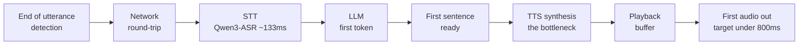

كل من بنى وكيل صوت فوري يصطدم بالجدار نفسه. بمجرد أن يطول قليلاً زمن الاستجابة بين لحظة توقف المستخدم عن الكلام ولحظة إصدار الوكيل لصوته الأول، تبدأ المحادثة تبدو غير طبيعية. لكن حين تسأل "أي مرحلة من مكدسي بطيئة"، لا تأتي الإجابة بسهولة. كشف نهاية الكلام، والذهاب والإياب عبر الشبكة، والتعرف على الكلام (STT)، والرمز الأول من نموذج اللغة الكبير (LLM)، وتحويل النص إلى كلام (TTS)، كلها مراحل متسلسلة كالحلقات، وكل SDK من مزوّد لا يُظهر إلا أرقام مقطعه الخاص. يتناول هذا المقال أداة مفتوحة بنيناها لتشخيص هذه السلسلة كاملة بنظرة واحدة، تُدعى voice-latency-budget، إلى جانب نتائج قياس سيناريو الاستضافة الذاتية لهذه الأداة على وحدات GPU فعلية. هذا المقال موجّه لمهندسي البنية التحتية والذكاء الاصطناعي الذين يريدون تشغيل وكيل صوت فوري بأنفسهم. والخلاصة المختصرة: في الاستضافة الذاتية على GPU، لم تكن نقطة اختناق زمن الاستجابة في نموذج اللغة الكبير كما يُفترض عادة، بل في تصميم التزامن واختيار أداة تحويل النص إلى كلام.

## لماذا نحتاج إلى منظور ميزانية زمن الاستجابة

تشير الأبحاث إلى أنه عندما يتحدث شخصان، تتقارب الفجوة الزمنية بين انتهاء أحدهما من الكلام واستجابة الآخر إلى وسيط يبلغ نحو 200 ميلي ثانية بغض النظر عن اللغة (Stivers et al., 2009, PNAS). لكي يشعر وكيل الصوت الفوري بأنه "بشري"، يجب أن يكون الزمن من انتهاء الكلام إلى صوت الاستجابة الأول قريباً من هذا النطاق، وفي الممارسة العملية، يُعد البقاء دون الثانية الواحدة، أي أقل من 800 ميلي ثانية، هدفاً شائعاً. يتطابق هذا الرقم إلى حد كبير مع الأهداف التي ينشرها مزودو الخدمة أيضاً. تذكر Deepgram أقل من 300 ميلي ثانية، وتذكر Vapi أقل من 500 ميلي ثانية.

المشكلة هي كيفية توزيع هذه الميزانية الإجمالية. إذا استهلكت الشبكة 40 ميلي ثانية ذهاباً وإياباً، واستهلك التعرف على الكلام 300 ميلي ثانية، واستهلك الرمز الأول من نموذج اللغة الكبير 500 ميلي ثانية، تكون الميزانية قد تجاوزت حدها بالفعل. من الصعب الحكم بالحدس على أي مرحلة يجب تقليصها لتحقيق أكبر فائدة. لذلك بنينا حاسبة تُظهر الجدول الزمني التراكمي ونقطة الاختناق وما إذا كنت ضمن نطاق محادثة طبيعية فور إدخال زمن الاستجابة المتوقع لكل مرحلة. تعمل الأداة بالكامل من جانب المتصفح، دون خادم ودون مفتاح API، ولا تغادر مدخلاتك المتصفح أبداً. سعينا لبناء أداة نفع عام لا تروّج لمنتج بعينه.

تغطي الأداة سبع مراحل: كشف نهاية الكلام، والذهاب والإياب عبر الشبكة، والتعرف على الكلام، والرمز الأول من نموذج اللغة الكبير، وجاهزية الجملة الأولى، وتوليف تحويل النص إلى كلام، ومخزن التشغيل المؤقت. يحمل تلميح شريط التمرير لكل مرحلة نطاقاً معتاداً مستمداً من مواد عامة من عامي 2025 و2026، وحين تتجاوز نقطة اختناق ذلك النطاق تعرض الأداة توصية. يمكنك البدء من إعداد مسبق، وتراكب تهيئتين في وضع المقارنة، ورؤية قيمة p95 تقريبية تحت الحمل أيضاً.

تشكّل المراحل السبع سلسلة، ويجب أن يقع مجموع هذه الأزمنة ضمن الميزانية المستهدفة كي تبدو المحادثة طبيعية. في التدفق أدناه، كانت المرحلة التي استهلكت أكبر جزء من الميزانية فعلياً هي تحويل النص إلى كلام غير المتدفق.

## كيف تتغيّر الأرقام عند الاستضافة الذاتية

يمكنك الحصول على فكرة تقريبية عن نطاق زمن استجابة واجهة برمجة تطبيقات متدفقة مُدارة من الوثائق. لكن "ما الرقم الذي نحصل عليه فعلياً حين نضع المحرك الذي نستخدمه حقاً على GPU" أمر لا يمكن معرفته دون قياسه مباشرة. لذلك أخذنا المكدس ذاته الذي كنا نشغّله محلياً على جهاز MacBook لأغراض التطوير، ووضعناه على وحدة RunPod H200 (بسعة 141 جيجابايت) لقياسه. كانت المحركات هي Qwen3-ASR-1.7B للتعرف على الكلام، وVoxCPM2 وQwen3-TTS-1.7B لتحويل النص إلى كلام، وأحدث نموذج Qwen3.5-9B لنموذج اللغة الكبير.

أولاً، ملاحظة حول كيفية خفض التكاليف. إذا أعدت تنزيل عشرات الجيجابايتات من النماذج وحزم CUDA في كل مرة تُنشئ فيها وحدة GPU، تبقى وحدة GPU المكلفة خاملة في انتظار التنزيل بينما تُحاسب على وقتها. لذلك قمنا بتنزيل البيئة الافتراضية والأوزان مرة واحدة فقط على حجم شبكي واحد (67 جيجابايت)، ثم جعلنا وحدة GPU تُركّب ذلك الحجم وتُجري القياس دون إعادة التنزيل. وضمِنّا حذف الوحدة والحجم بالكامل بعد الانتهاء باستخدام كتلة finally إضافة إلى شبكة أمان قائمة على الاسم لآلية التفكيك. بلغت التكلفة الإجمالية بما في ذلك تصحيح الأخطاء نحو 17 دولاراً، ولم تتسرب أي موارد.

## نتائج القياس: لم تكن نقطة الاختناق في نموذج اللغة الكبير ولا في التعرف على الكلام، بل في تحويل النص إلى كلام

هذه هي الأرقام التي قسناها على H200، على أساس طلب واحد.

| المحرك | النموذج | زمن الاستجابة (طلب واحد) | معامل الزمن الحقيقي (RTF) |
|---|---|---|---|
| STT | Qwen3-ASR-1.7B | 133 ميلي ثانية / 10 ثوانٍ صوت | 0.013 |
| TTS | VoxCPM2 (غير متدفق) | 673 ميلي ثانية / جملة | 0.149 |
| TTS | Qwen3-TTS-1.7B (غير متدفق) | 6778 ميلي ثانية / جملة | 1.205 |

لم يكن التعرف على الكلام مرحلة تستحق القلق. يقوم Qwen3-ASR بنسخ 10 ثوانٍ من الصوت في 133 ميلي ثانية. معامل زمن حقيقي قدره 0.013 يعني فعلياً استجابة فورية. القصة الحقيقية كانت في تحويل النص إلى كلام. على وحدة H200 نفسها، قام VoxCPM2 بتوليف الجملة الكورية نفسها في 0.67 ثانية، بينما استغرق Qwen3-TTS 6.8 ثانية. على البطاقة نفسها، يكون VoxCPM2 أسرع بنحو عشرة أضعاف. والمهم أن كلا المحركين غير متدفقين. ولأن الجملة كاملة يجب أن تُوَلَّف قبل صدور الصوت الأول، فإن حتى 0.67 ثانية عند VoxCPM2 ليست "زمن وصول أول صوت متدفق قدره 100 ميلي ثانية" بل هي "الصوت الأول بعد 0.67 ثانية". صحيح أن VoxCPM2 انخفض من نطاق الثواني المتعددة على MPS المحلي إلى 0.67 ثانية على GPU، لكن ذلك لا يعني أنه أصبح متدفقاً. لبناء دورة محادثة فورية حقيقية، عليك التحول إلى أداة تحويل نص إلى كلام متدفقة أو توليف الجمل على شكل مقاطع قصيرة. كان إظهار هذه النقطة تحديداً كرقم هو السبب الذي دفعنا لبناء هذه الأداة أصلاً.

## فجوة صريحة: تعطّل نموذج اللغة الكبير على هذا المضيف

لم نتمكن من الحصول على أرقام تشغيل vLLM لنموذج Qwen3.5-9B هذه المرة. لم يكن السبب أداء المحرك، بل عدم تطابق في إصدارات البنية التحتية. اعتباراً من يوليو 2026، يجلب أحدث إصدار من vLLM إصدار torch مبنياً لـ CUDA 13، بينما كان تعريف الوحدة على مضيف H200 المخصص لنا هو CUDA 12.8، فرفض المحرك العمل بحجة أن التعريف قديم جداً. وحين خفّضنا torch إلى إصدار متوافق مع 12.8، تعطّلت عمليات vLLM المُجمَّعة مسبقاً، وحين استخدمنا transformers كبديل، ظهرت أخطاء في مسار التوليد متعدد الوسائط. يتطلب كل محرك إصدار torch مختلفاً، وإصلاح واحد يُعطّل آخر، وهو تعارض تبعيات كلاسيكي. للحصول على أرقام vLLM نظيفة، تحتاج إلى مضيف مزوّد بتعريف CUDA 13. أدخلنا قيمة تقديرية في شريط تمرير نموذج اللغة الكبير في الحاسبة وأوضحنا صراحة أنها تقديرية. الوقوع في تعريف قديم أثناء محاولة تشغيل أحدث نموذج على أحدث مكدس هو أيضاً فخ واقعي في الاستضافة الذاتية، لذا نكتبه بصراحة بدلاً من إخفائه.

## كيف تُعِدّ هذا للتشغيل الفعلي

عند تحويل القياسات إلى وصفة عملية، تصبح كالتالي. التعرف على الكلام جيد كما هو باستخدام Qwen3-ASR. أما تحويل النص إلى كلام، فاختر VoxCPM2، الأسرع بعشرة أضعاف بين المحركين، لكن قرّب صدور الصوت الأول عبر التدفق أو تقسيم النص إلى مقاطع جملية. لا يمكن استخدام زمن Qwen3-TTS غير المتدفق البالغ 6.8 ثانية كما هو في دورة محادثة فورية. شغّل نموذج اللغة الكبير عبر vLLM على مضيف بتعريف CUDA 13. ضع المحركات الثلاثة على العقدة نفسها لإزالة القفزات الشبكية، واستخدم تدفقاً على مستوى الجملة يُشغّل تحويل النص إلى كلام فور جاهزية الجملة الأولى. مكدسنا المحلي على MacBook مخصص للتطوير، وليس نظام تشغيل فعلياً، وقد وسمنا صراحة الإعداد المسبق المحلي في الحاسبة بأنه "غير مناسب للتشغيل الفوري".

نشرنا هذه العملية بأكملها بحيث يمكن إعادة إنتاجها. تُفتح الحاسبة مباشرة في المتصفح، وتجمع أداة القياس بين إنشاء الحجم الشبكي، والتنزيل، وقياس الأداء على GPU، والتفكيك الكامل في سكربت واحد. كما حفظنا نتائج القياس الخام بصيغة JSON ودليل تشغيل في المستودع. نأمل أن يكون هذا نقطة انطلاق لكل من يريد الحديث عن زمن استجابة مكدس صوتي ذاتي الاستضافة بالأرقام بدلاً من الحدس.

- الحاسبة: [voice-latency-budget](https://sylvanus4.github.io/voice-latency-budget/)
- المستودع وأداة القياس ودليل التشغيل: [github.com/sylvanus4/voice-latency-budget](https://github.com/sylvanus4/voice-latency-budget)
