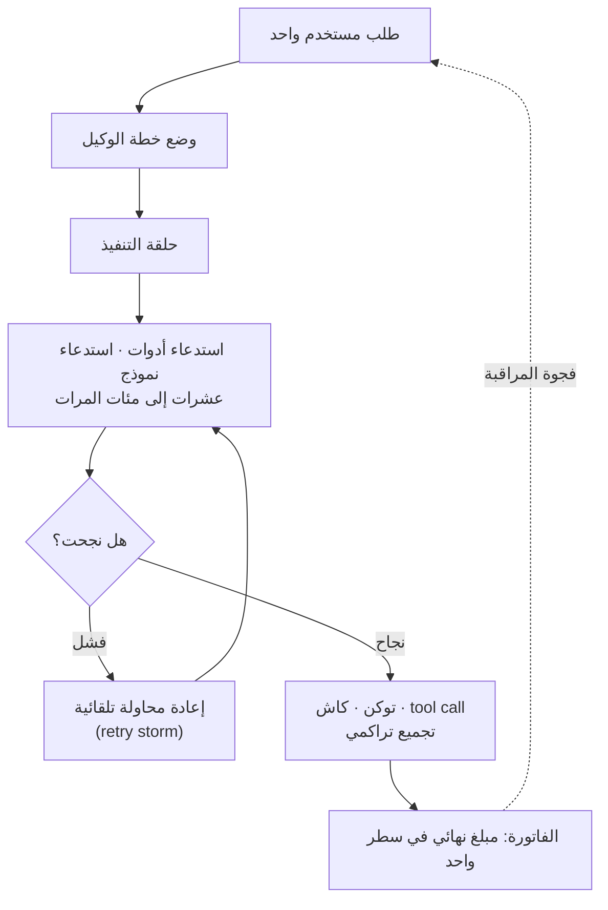

كُتب هذا المقال لمهندسي المنصات والبنية التحتية الذين يخططون لإدخال Claude Code أو وكلاء الذكاء الاصطناعي إلى مؤسساتهم، وللمسؤولين الماليين ومسؤولي المشتريات الذين سيضطرون لتفسير فاتورة الذكاء الاصطناعي في الشهر القادم. ولنبدأ بالخلاصة: أخبار تكلفة الذكاء الاصطناعي التي توالت خلال الشهر الأخير لا تدور حول أن "الذكاء الاصطناعي مكلف". المشكلة الحقيقية هي أن **الفاتورة لا تفسر ما الذي تمثله**. ففي بنية الوكلاء، حيث يتحول طلب مستخدم واحد إلى عشرات أو مئات من استدعاءات النموذج وتنفيذ الأدوات، ثم إلى إعادة محاولة تلقائية عند الفشل، لا يمكن للمبلغ النهائي وحده أن يكشف أين تسربت الأموال داخل أي حلقة تنفيذ. نرى أن هذه الفجوة في المراقبة هي بالضبط جوهر الألم الذي يعيشه السوق الآن.

## نظرة عامة

يمكن تلخيص أخبار الفترة من أواخر يونيو حتى يوليو 2026 في سطر واحد: الاستخدام العشوائي للنماذج المتطورة (frontier models) في كل مهمة يجعل التكلفة يصعب تحملها، بل ويصعب حتى تتبع مصدرها. وقد ظهرت الحادثة بشكل درامي. فقد جرت محاولة تحصيل مبلغ يقارب 2.5 مليار وون من مستخدم محلي واحد، ثم محاولة تحصيل نحو 25 مليار وون لاحقا. ولحسن الحظ لم يُسحب أي مبلغ فعليا بسبب تجاوز حد البطاقة، غير أن تكرار وصول مبلغ غير طبيعي إلى مرحلة طلب موافقة البطاقة، وليس مجرد خطأ عرض، هو ما يمنح الحادثة وزنها المختلف.

وفي الفترة نفسها توالت أخبار من مستويات أخرى. فقد راجعت شركة تدقيق تكاليف الذكاء الاصطناعي فواتير 60 شركة وادّعت وجود فوترة زائدة كبيرة، وبدأت عدة شركات كبرى بتوزيع استخدام النماذج المتطورة على نماذج أرخص بحسب طبيعة المهمة، كما ورد أن شركات أمريكية وأوروبية انتقلت إلى نماذج صينية مفتوحة الأوزان بدافع خفض التكلفة. والمثير أن مزودي النماذج أنفسهم بدؤوا بالرد بما يفيد أن "تشغيل أفضل النماذج أداءً لفترات طويلة في كل مهمة أمر غير مستدام". وكانت أخبار متعددة الاتجاهات تشير إلى النقطة نفسها.

## ماذا حدث في الشهر الأخير

أول ما لفت الانتباه كان مشكلة موثوقية نظام الفوترة. وبحسب تقرير ZDNet Korea، بدأ المبلغ المطلوب من طالب جامعي محلي بنحو 1.66 مليون دولار، ثم تضخم إلى نحو 16.62 مليون دولار أي عشرة أضعاف. وأوضحت أنثروبيك لاحقا أن الخطأ كان في إعداد مبلغ الشحن التلقائي الذي ضُبط بشكل غير طبيعي المرتفع، إلا أن المستخدم أكد أنه لم يُفعّل خاصية الشحن التلقائي إطلاقا، ما يترك سبب نشوء هذا الإعداد غامضا حتى الآن. وتُظهر واقعة إرسال المستخدم أكثر من خمس عشرة رسالة إلى عدة أقسام دون تلقي رد آلي إلا بعد مرور أربعة أيام، فجوةً في منظومة الاستجابة أوضح من كونها مجرد خطأ تقني.

المشكلة الثانية كانت في قابلية مراقبة تكلفة الوكلاء. وبحسب تقارير AI Times و The Information، أعلنت شركة ناشئة متخصصة في تدقيق التكاليف تُدعى Vaudit أنها راجعت فواتير 60 شركة بقيمة إجمالية نحو 34 مليون دولار، وخلصت إلى أن نحو 1.7 مليون دولار منها كانت فوترة زائدة. وشكّل استخدام Claude Code جزءا كبيرا من نطاق المراجعة، وذُكرت شركات مثل باناسونيك وHP وهوندا ضمن العملاء. وحسب ادعاء الشركة، فإن الأنماط شملت تسجيل استخدام نموذج رخيص بأسعار نموذج أغلى، وفرض رسوم على مهام لم تُنجز، وتكرار إعادة المحاولة التلقائية بعد الخطأ فيما يُعرف بـ**عاصفة إعادة المحاولة (retry storm)**. وهنا ينبغي توضيح نقطتين. أولا، ردت أنثروبيك بأنها لا تفرض رسوما على الطلبات غير المكتملة أو الاستجابات الخاطئة، وأنه لا يوجد دليل واسع على فوترة زائدة. ثانيا، تحصل Vaudit على نسبة من مبالغ الاسترداد الناجحة، أي أنها شركة تدقيق تجارية، لذا يجب قراءة هذه الأرقام كنتيجة تحقيق من طرف واحد لا كتدقيق حسابي مستقل. وبعبارة أخرى، نحن الآن في مرحلة تصادم بين ادعاءات شركة التدقيق ونفي المزود.

المشكلة الثالثة كانت في استجابة السوق. وذكرت The Information أن الشركات بدأت بفصل المهام: النماذج الرخيصة للتصنيف والتلخيص والتحويل البسيط، والنماذج المتطورة للبرمجة المعقدة ومهام الوكلاء، والنماذج مفتوحة الأوزان أو المستضافة ذاتيا للمهام المتكررة عالية الحجم. ونقلت الفايننشال تايمز أن شركات مثل DoorDash وSiemens وAirbnb اعتمدت نماذج DeepSeek أو من عائلة Moonshot لخفض التكلفة. وفي تقرير لـ Business Insider، اعترف حتى مسؤولو المنصة في أنثروبيك بأن ما يُعرف بـ**التقنية المعلوماتية الظل (shadow IT)**، أي اعتماد كل قسم لأدواته الخاصة بشكل منفصل، أدى إلى تضخم تكاليف الذكاء الاصطناعي في بعض الشركات، لكنهم شددوا على أن الحل ليس إيقاف الاستخدام أو فرض سقف ميزانية موحد، بل اختيار النموذج بحسب المهمة وإدارة مركزية للتكلفة على مستوى المؤسسة. كما تغيرت سياسات التسعير نفسها مرارا: تعدّلت مرات عدة شمولية النماذج عالية الأداء الأحدث ضمن الاشتراك وتوقيت التحول إلى الدفع بحسب الاستخدام، وتكرر تمديد مواعيد انتهاء العروض الترويجية. بل ورد أن إتاحة Claude Fable 5 مجانا امتدت حتى 19 يوليو. وكانت صعوبة توقع تكلفة الشهر القادم أكبر إزعاج لمسؤولي المشتريات، أكثر حتى من مسألة الأداء.

## لماذا لا يمكن مراقبة تكلفة الوكلاء

السبب المشترك الذي يجمع بين هذه المسارات الثلاثة من الأخبار هو في النهاية واحد. ففي أحمال عمل الوكلاء، اتسعت المسافة كثيرا بين ما يراه المستخدم وما تسجله الفاتورة. كانت استدعاءات API التقليدية طلبا واحدا مقابل استجابة واحدة وسطر تكلفة واحد. أما وكلاء البرمجة أو حزم تطوير الوكلاء (agent SDK)، فإن أمرا واحدا فيها يتوسع إلى وضع خطة وتنفيذ واستدعاء أدوات وتحرير ملفات وتحقق، ثم إعادة محاولة عند الفشل. يحدث هذا التوسع في مكان لا يراه المستخدم، بينما تسجل الفاتورة مجموعه الكلي في سطر واحد فقط.

في هذه البنية، تقع معظم نقاط تسرب التكلفة خارج مجال رؤية المستخدم. فحلقة إعادة المحاولة تعمل بصمت وتضخم عدد الاستدعاءات، ويحدث تباين بين الاستخدام الفعلي للنموذج والتفاصيل النهائية للفاتورة عند المرور عبر مزود سحابي وسيط، وإذا اختل إعداد واحد مثل الشحن التلقائي فقد يتدفق مبلغ غير طبيعي حتى مرحلة طلب موافقة البطاقة. تبدو الأخبار الثلاثة وكأنها حوادث منفصلة، لكنها في الواقع أوجه مختلفة لفجوة المراقبة نفسها. لذلك لا يكفي مجرد وضع حد شهري لكل مستخدم. المطلوب هو طبقة قياس مركزية تلتقط تكلفة كل نموذج، وتوكنات كل جلسة، وتوكنات الكاش، وعدد استدعاءات الأدوات، وتكلفة الفشل وإعادة المحاولة، ومعدل الزيادة اليومي غير الطبيعي **في اللحظة التي يحدث فيها الاستدعاء نفسه**. فبلا مراقبة لا توجد سيطرة، وبلا سيطرة تبقى الفاتورة دائما وثيقة مفاجأة بعد وقوع الحدث.

## دلالات التطبيق على منتجات ThakiCloud

هذه المشكلة هي النقطة التي يستهدفها منتجا ThakiCloud من زاويتين مختلفتين. ولأن منظور البنية التحتية ومنظور الوكلاء يكملان بعضهما، نستخدم في هذا الموضوع العدستين معا.

**عدسة ai-platform: الملكية هي الحل لأحمال العمل المتكررة.** الاستنتاج الذي وصل إليه السوق واضح. فمعالجة حتى المهام السهلة بنماذج متطورة يجعل التكلفة غير محتملة، بينما تصبح استضافة نموذج مفتوح الأوزان ذاتيا خيارا اقتصاديا للمهام المتكررة عالية الحجم. ومنصة ai-platform من ThakiCloud هي بالضبط بنية تحتية للذكاء الاصطناعي وتعلم الآلة قائمة على K8s مصممة لهذه النقطة. فهي تستخدم Kueue لجدولة وحدات GPU في طابور وزيادة معدل استخدامها، وتستخدم vLLM لخدمة النماذج مفتوحة الأوزان، وتعزل الاستخدام بحسب كل قسم عبر عزل متعدد المستأجرين مع فوترة منفصلة. فإذا كانت واجهات برمجة التطبيقات القائمة على الدفع بحسب الاستخدام تنتج فواتير يصعب توقعها، فإن الاستضافة الذاتية تبني بنية تكلفة GPU ثابتة لا يتقلب سعرها حتى مع تزايد الاستخدام. وعلى عكس الأنظمة الخارجية القائمة على الدفع بحسب الاستخدام التي تتغير سياساتها باستمرار، يحوّل النشر الداخلي أو السيادي إمكانية التنبؤ بالتكلفة نفسها إلى أصل قائم بذاته. كما أن عدم خروج البيانات إلى الخارج يمثل قيمة إضافية للمؤسسات ذات متطلبات التنظيم والأمن المحلية العالية.

**عدسة Paxis: جعل كل تصرف للوكيل قابلا للتدقيق.** كان جوهر فجوة المراقبة هو حلقة الوكيل، وهذا هو بالضبط المجال الذي تعالجه Paxis. فـPaxis هي مستوى التحكم في السحابة الأصيلة للوكلاء (Agent-Native Cloud) من ThakiCloud، وتعمل فوق ai-platform، وتتعامل مع المهارات (Skills) والأدوات (Tools) والسياسات (Policies) وسجلات التدقيق (Audit Logs) كموارد من الدرجة الأولى. فكل ما يخص أي مهارة استدعاها الوكيل وبأي أداة وكم مرة، وفي أي بيئة معزولة تم التنفيذ، يُسجَّل بالكامل في سجل التدقيق. وفي هذه البنية، بدلا من أن تُضخّم عاصفة إعادة المحاولة الفاتورة بصمت، تظهر حلقة إعادة المحاولة بوضوح في سجل التدقيق، وتوقف بوابات السياسة الاستدعاءات التي تتجاوز العتبة المحددة. فتصميم يختار من بين أكثر من 960 مهارة عبر خوارزمية BM25 وينفذها في بيئة معزولة، ويُمرّر كل تصرف عبر السياسة والتدقيق، هو إجابة بنيوية بالضبط على مشكلة صعوبة معرفة أين نشأت التكلفة من مجرد النظر إلى الفاتورة. فالخدمة منخفضة التكلفة (ai-platform) تجعل الوكلاء اقتصاديين، بينما تجعل المراقبة على مستوى كل تصرف (Paxis) هذه الجدوى الاقتصادية قابلة للتنبؤ. وهكذا تتكامل العدستان.

## الحدود والرأي المعاكس

من أجل التوازن، نوضح الجانب المعاكس بجلاء. أولا، ليست النماذج المتطورة تبذيرا بالضرورة. فبحسب تقرير وول ستريت جورنال، ترى شركات مثل Shopify أن النماذج المتطورة، في مهام البرمجة المعقدة والوكلاء متعددة الخطوات، توفر وقت المهندسين بما يبرر سعرها المرتفع. في المقابل، تتوخى شركات مثل Spotify وTwilio الحذر في تقييم ما إذا كان التحسن الطفيف في الأداء يبرر التكلفة الإضافية. أي أن الجواب ليس "تخلَّ عن النماذج المتطورة"، بل "وزّع بحسب صعوبة المهمة". كما أن الاستضافة الذاتية ليست حلا شاملا لكل شيء؛ فتخفيض المهام التي تتطلب أعلى مستوى من الاستدلال إلى نماذج مفتوحة الأوزان يؤدي إلى تراجع الجودة، ويخلق عبئا تشغيليا جديدا يشمل تشغيل وحدات GPU وتحديث النماذج وتصحيحات الأمان.

ثانيا، الأرقام المتعلقة بالفوترة الزائدة المذكورة في هذا المقال ليست حقائق مؤكدة. فادعاء Vaudit هو إعلان من شركة تدقيق تجارية، وقد نفته أنثروبيك، لذا فإن الأدق حاليا هو قراءة الموقف على أنه تصادم بين طرفين. وحادثة الفوترة بمبلغ 25 مليار وون كذلك لم يُسحب فيها أي مبلغ فعليا، ولم يُكشف بعد عن تفسير تقني لسبب نشوء إعداد الشحن التلقائي. والاستنتاج الذي نخلص إليه من هذه الأخبار لا يستهدف مزودا بعينه، بل هو مبدأ مفاده أنه في عصر الوكلاء، وأيا كان المزود المستخدَم، يجب على الجهة المستخدِمة نفسها أن تؤمّن مراقبة التكلفة وحوكمتها. فمسألة اختيار نموذج جيد ومسألة ضبط ذلك النموذج مسألتان منفصلتان، وما كشفته أخبار الشهر الأخير هو أن المسألة الثانية كانت فارغة طوال الوقت.

## المصادر

- [ZDNet Korea، "مستخدم محلي تلقى طلب دفع بقيمة 25 مليار وون... جدل حول خطأ فوترة أنثروبيك" (2026-07-09)](https://zdnet.co.kr/view/?no=20260709165452)
- [ZDNet Korea، "أنثروبيك التي طالبت بـ25 مليار وون: تبين أنه خطأ في إعداد الشحن التلقائي" (2026-07-16)](https://zdnet.co.kr/view/?no=20260716093004)
- [AI Times، "أنثروبيك في جدل 'الفوترة الزائدة للذكاء الاصطناعي': تحصيل رسوم حتى على المهام الفاشلة" (2026-06)](https://www.aitimes.com/news/articleView.html?idxno=212155)
- [The Information، تقرير عن سيطرة الشركات على تكلفة الذكاء الاصطناعي وتوزيع النماذج (2026-06-23)](https://www.theinformation.com/titv/fedld)
- [Financial Times، "Companies turn to Chinese AI models to cut costs" (2026-07)](https://www.ft.com/content/9c8ff45b-7c20-4c2e-93c9-c52339ffdcee)
- [Business Insider، "Anthropic Official Warns Against 'Wrong' AI Cost Response" (2026-07-15)](https://www.businessinsider.com/anthropic-ai-costs-responses-routers-2026-7)
- [The Wall Street Journal، "Meet the Companies Shelling Out for Top AI Models" (2026-07)](https://www.wsj.com/cio-journal/meet-the-companies-shelling-out-for-top-ai-models-e1fe3375)
