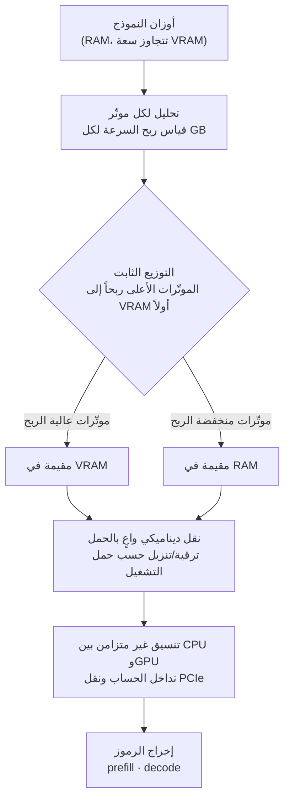

هذه المقالة موجّهة للمهندسين الذين يوازنون إمكانية تشغيل نموذج كبير ذاتياً على بطاقة GPU استهلاكية واحدة، ولمسؤولي البنية التحتية الذين يقرّرون مدى تصديق تغريدات "شغّل 120B على 24GB". بدايةً: فكرة ATSInfer الأساسية (arXiv:2607.10183)، الصادرة عن باحثين في جامعة نانجينغ، بسيطة ومقنعة. حيث كان الإنزال (offloading) السابق ينقل الأشياء كتلاً على مستوى "الطبقة" أو "الخبير"، يقسّم ATSInfer وصولاً إلى **الموتّرات (tensors) فرادى**. ومع ذلك، فإن الرقم البارز "حتى 3.29 ضعفاً" يقوم على عدة افتراضات، والشيفرة لم تُنشر بعد. لم نُعِد إنتاج بطاقة RTX 4090 تشغّل نموذجاً بحجم 120B هنا، لذا فإن كل رقم في هذه المقالة هو **قيمة أبلغت عنها الورقة**، مذكورة على هذا الأساس.

## نظرة عامة

كل من شغّل نموذج LLM محلياً يصطدم بالجدار نفسه: إذا كانت أوزان النموذج أكبر من ذاكرة الـ GPU، يفيض الزائد إلى ذاكرة الـ CPU. وراية `-ngl` في llama.cpp (عدد الطبقات التي توضع على الـ GPU) تفعل هذا بالضبط. المشكلة أنها تقطع فقط على **مستوى الطبقة**. تخلط الطبقة الواحدة موتّرات مختلفة الطبيعة تماماً (أوزان attention، وأوزان FFN، ومعاملات التطبيع)، ومع ذلك تُعامَل بمبدأ الكل أو لا شيء: إما أن يذهب الكل إلى الـ GPU أو يبقى على الـ CPU.

سبب خسارة هذا الوضع الكتلي بسيط. قد يجعل نفس الـ 1GB في الـ VRAM موتّراً أسرع 10 أضعاف وآخر أسرع ضعفين فقط. الـ VRAM مورد نادر، والقطع الكتلي يمنعك من انتقاء الموتّرات ذات الربح الأعلى لكل GB. يستهدف ATSInfer هذا بالضبط. فهو يحلّل أداء كل موتّر على الـ CPU والـ GPU ويملأ الـ VRAM بدءاً من الموتّرات ذات **أعلى ربح سرعة لكل GB**. إذا كان ktransformers الأخير حيلةً على "مستوى الخبير" تدفع خبراء MoE إلى الـ CPU (انظر [مقالتنا ذات الصلة: إعادة إنتاج الـ 28 ضعفاً لـ ktransformers](/ar/llmops/ktransformers-moe-offload-28x-validation/))، فإن ATSInfer هو التعميم الأدق على "مستوى الموتّر". واللافت أنه ينطبق على النماذج الكثيفة (dense) وليس MoE فقط.

## ما هذه التقنية

ATSInfer نظام استدلال هجين CPU-GPU مبنيّ كامتداد لـ llama.cpp بنحو 15 ألف سطر من C++. كما يقول الاسم، فإن "الجدولة الآلية للموتّرات (Automated Tensor Scheduling)" هي الجوهر، وتتشابك ثلاث آليات.

**أولاً، التوزيع الثابت للموتّرات (static placement).** قبل تحميل النموذج، يقيس مدى تسارع كل موتّر على الـ GPU، ثم يضع الموتّرات على الـ GPU بترتيب "أكبر سرعة مُعادة لكل GB من الـ VRAM مستخدَم". هذا قريب من مسألة حقيبة الظهر (knapsack) ويستغل مباشرةً التباين على مستوى الموتّر الذي تجاهله التوزيع الكتلي.

**ثانياً، النقل الديناميكي الواعي بالحمل (load-aware dynamic transfer).** التوزيع الثابت وحده لا يكفي. خلال الاستدلال الفعلي، يتغير الحمل لحظةً بلحظة مع حجم الدفعة وطول السياق وعدد الطلبات المتزامنة. يرقّي ATSInfer موتّراً معيناً من الـ RAM إلى الـ GPU أو ينزّله بناءً على حالة التشغيل. إذا كان التوزيع الثابت هو خط الانطلاق، فالنقل الديناميكي هو تغيير المسار أثناء القيادة.

**ثالثاً، التنسيق غير المتزامن بين CPU وGPU (asynchronous coordination).** يُداخِل بين حساب الـ CPU وحساب الـ GPU ونقل الـ PCIe الذي يصل بينهما. التنفيذ الساذج يترك الـ GPU خاملاً ينتظر عمل الـ CPU أو حركة البيانات؛ وطبقة التنسيق هذه تملأ ذلك الوقت الخامل. تُبلّغ الورقة أن هذا يرفع متوسط استغلال SM (المعالج المتعدد التدفق) في الـ GPU بنحو 70%.

## النتائج التي تبلّغ عنها الورقة

مرة أخرى: الأرقام أدناه **قيم أبلغت عنها الورقة**، لا شيء أعدنا إنتاجه. شيفرة ATSInfer لم تُنشر بعد (حتى نقاش التغريدات قال "أيها الباحثون، رجاءً شاركوا الشيفرة مع فريق llama.cpp")، وإعادة إنتاج نموذج بحجم 120B مع RTX 4090 صعبة في البيئة المعزولة وراء هذه المقالة. لذا بدلاً من إعادة الإنتاج، نركّز على **التحليل البنيوي والدلالات**.

عنوان الورقة العريض: مقابل الأنظمة الهجينة الحالية (بما فيها إنزال llama.cpp على مستوى الطبقة)، يتحسّن الـ prefill (الإنتاجية حتى أول رمز) حتى 1.94 ضعفاً، والـ decode (الرموز المولّدة في الثانية) حتى 3.29 ضعفاً.

الإعداد هو نظام RTX 4090 (24GB) وRTX 3060 مع 64GB من الـ RAM، والنماذج المُتحقَّق منها هي:

- Llama 3.1-70B (INT4)
- Qwen3-Next-80B-A3B (INT4)
- Qwen3.5-122B-A10B (INT4)
- GPT-OSS-120B (MXFP4)

فالادّعاء المركزي هو تشغيل نموذج بـ 122 مليار معامل (وهو MoE بعدد معاملات نشطة أقل بكثير) على بطاقة 24GB واحدة. اقرأ هنا أمرين منفصلين. أولاً، "3.29 ضعفاً" هو **حدّ أقصى** تحت ظروف محددة، لا متوسط عبر كل نموذج وكل دفعة. ثانياً، الربح يأتي جوهرياً لا من "إدخال ما لم يكن يدخل في الـ GPU" بل من "جعل حركة CPU-GPU الحتمية أذكى". تبقى الفيزياء نفسها في أن عرض نطاق الـ PCIe هو عنق الزجاجة، لذا فإن مساهمة ATSInfer هي استخدام ذلك العرض دون هدر وتقليل الوقت الخامل للـ GPU.

## دلالات لمنتجات ThakiCloud

منصة **ai-platform** من ThakiCloud بنية تحتية للذكاء الاصطناعي/تعلّم الآلة تخدم النماذج عبر بيئات عملاء متنوعة على Kubernetes وKueue. الجدولة على مستوى الموتّر مثل ATSInfer تتوافق مع اتجاه نراقبه عن كثب.

أولاً، **اقتصاديات البيئات المحلية (on-premises) والسيادية.** في السياقات التي لا يمكن أن تغادر فيها البيانات المبنى، كعملاء القطاع العام والمالي المحليين، يجب أن تعمل النماذج على بطاقات GPU مملوكة. إذا استطاعت بضع بطاقات استهلاكية حمل نموذج متوسط إلى كبير بدلاً من رف من ثماني بطاقات H100، تنخفض النفقات الرأسمالية الأولية بشكل كبير. ما تُظهره تجارب ATSInfer هو أن الافتراض "إن نقص الـ VRAM فعليك ببساطة شراء المزيد من الـ GPU" يمكن تخفيفه جوهرياً عبر تحسين توزيع الموتّرات. الثمن، بالطبع، هو انخفاض الإنتاجية، لذا فهو غير مناسب لأحمال حرجة الكمون. الحكم على هذه المقايضة لكل حمل هو دور طبقة الخدمة لدينا.

ثانياً، **الاقتران بالجدولة متعددة المستأجرين.** "النقل الديناميكي الواعي بالحمل" في ATSInfer هو حركة موتّرات داخل عقدة واحدة، لكن الفكرة تصمد على مستوى العنقود أيضاً. عندما يصفّ Kueue موارد الـ GPU ويوزّعها، فإن سياسة تقرّر أي طلب يُعالَج بأي دقة وأي ملف إنزال بناءً على الحمل هي مجال نفكّر فيه بالفعل. تماماً كما يعصر التحليل على مستوى الموتّر مكاسب الموارد داخل العقدة، يفعل مجدول العنقود الشيء نفسه عبر العقد.

ثالثاً، **إعادة تعريف منحنى الكلفة-الجودة.** في [مقالة إعادة إنتاج ktransformers](/ar/llmops/ktransformers-moe-offload-28x-validation/) أظهرنا بالقياس المباشر أن أرقاماً بارزة مثل "28 ضعفاً" تقوم على افتراضات خفية. و"3.29 ضعفاً" في ATSInfer يستحق العدسة نفسها. ليس رقماً تسويقياً، بل القيمة التي تظهر على نماذج عملائنا الفعلية ودفعاتهم الفعلية واتفاقيات مستوى الخدمة الفعلية، هي ما نتحقق منه. التنافسية عند كلفة خدمة منخفضة تأتي في النهاية من تراكم هذا النوع من التحقق بالضبط.

## الحدود والحجج المضادة

أكبر حدّ هو **عدم نشر الشيفرة.** لا يمكن التحقق مما إذا كانت أرقام الورقة قابلة لإعادة الإنتاج، وما إذا كانت تصمد على أجهزة ونماذج أخرى، إلا بعد ظهور الشيفرة. امتداد بـ 15 ألف سطر من C++ هو أيضاً مهمة صيانة ودمج مع المنبع (upstream) غير هيّنة. الفرع (fork) الذي لا يُدمج أبداً يتخلّف عن تغييرات المنبع مع الوقت ويفقد قيمته.

ثانياً، **اعتماد المكاسب على الظروف.** يعتمد أثر التوزيع على مستوى الموتّر بشدة على أداء الـ CPU، وعرض نطاق الـ RAM، وجيل الـ PCIe. تفترض تجارب الورقة 64GB من الـ RAM؛ فإن نقص الـ RAM لا يترك مجالاً لإبقاء الموتّرات على الـ CPU أصلاً. على أنظمة PCIe 3.0، يرجّح أن يصبح النقل عنق الزجاجة ويقلّص الربح جوهرياً ([تقدير]، لا تفصّل الورقة مقارنةً جيلاً بجيل).

ثالثاً، **السقف المتأصّل لتحسين الـ decode.** الـ decode مهمة مقيّدة بالذاكرة (memory-bound). مهما أحسنت الجدولة، يجب الوصول إلى الأوزان خارج الـ VRAM بطريقة ما مع كل رمز، فيكون حتماً أبطأ من الإقامة الكاملة في الـ VRAM. ما يفعله ATSInfer هو "تقليل مقدار التباطؤ"، لا "إزالة التباطؤ". وبناءً على الحجة المعاكسة: لخدمة إنتاجية تحتاج حقاً كموناً منخفضاً وإنتاجية عالية، يبقى استخدام بطاقة GPU تحمل النموذج كاملاً في الـ VRAM هو القرار الصائب. يتألق ATSInfer في مجال التطوير والتقييم والدفعات الصغيرة حيث لا تقدر على تلك البطاقة أو لا تحتاجها.

ومع ذلك، للاتجاه قيمة واضحة. عصر استغلال الموارد عبر البرمجيات بدلاً من إضافة العتاد يناسب منصةً مثل منصتنا بشكل خاص، منصةً تتخذ من العمل المحلي وكفاءة الكلفة والاستضافة الذاتية أسلحةً لها. حالما تُنشر الشيفرة، نخطط لإدماجها في معايير الخدمة لدينا وقياس الأرقام الحقيقية بأنفسنا.

## المصادر

- ورقة ATSInfer: [arXiv:2607.10183, Automated Tensor Scheduling for Hybrid CPU-GPU LLM Inference on Consumer Devices](https://arxiv.org/abs/2607.10183)
- مقالة ذات صلة: [رفّ بـ 400 ألف دولار على 24GB؟ أعدنا إنتاج الـ 28 ضعفاً لـ ktransformers](/ar/llmops/ktransformers-moe-offload-28x-validation/)
