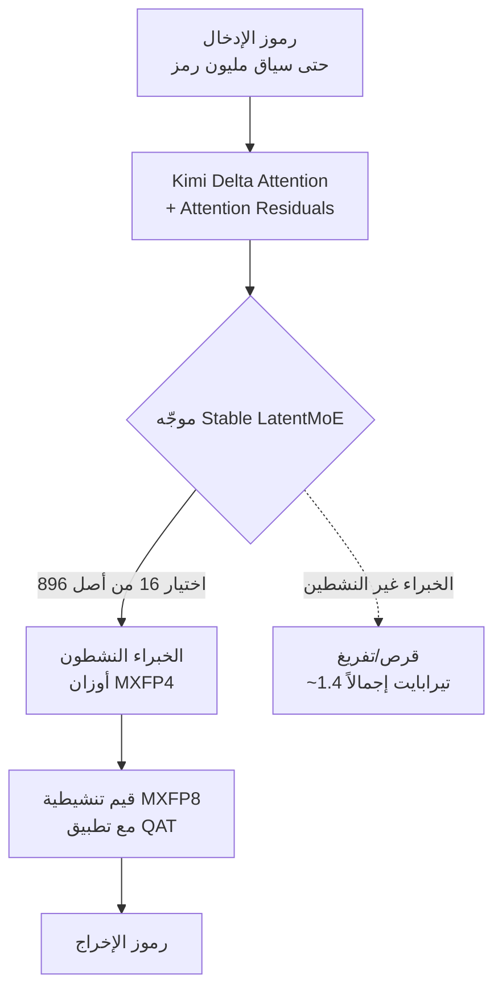

في كل مرة يظهر فيها نموذج جديد، أول ما يلفت انتباهنا هو جدول واحد. ننظر إلى نتائج المعايير القياسية المصفوفة جنباً إلى جنب، فنستنتج بسرعة أن "هذا النموذج أفضل من ذاك". لكن في يوليو 2026، بمجرد أن أطلقت Moonshot AI نموذج Kimi K3، أكبر نموذج مفتوح الأوزان في التاريخ، اندلع جدل يضع فرملة على هذه العادة. النتائج واضحة في القمة، لكن شكوكاً بأنه "ربما تم الإفراط في تكييفه مع المعايير القياسية" رافقتها على الفور.

يستعرض هذا المقال أولاً الحقائق المؤكدة حول ماهية Kimi K3، ثم ينتقل إلى كيفية قراءة لوحة نتائجه المبهرة، وأخيراً إلى ما يحتاج المشغّلون للتحقق منه قبل وضع هذا النموذج في منتج فعلي. بالنسبة لشركة بنية تحتية مثل ThakiCloud، التي تخدم وتشغّل النماذج عبر بيئات عملاء متعددة، هذا السؤال ليس فضولاً أكاديمياً بل هو قرار الاعتماد نفسه. إذا وثقنا بسطر نتيجة واحد ونشرنا نموذجاً بـ 2.8 تريليون معامل داخلياً (on-premises)، لنكتشف لاحقاً أنه لا يفي بالتوقعات في العمل الفعلي، فإن التكلفة تقع بالكامل علينا وعلى عملائنا.

## ما هو Kimi K3

Kimi K3 هو نموذج مزيج خبراء (Mixture-of-Experts، أو MoE) واسع النطاق أطلقته Moonshot AI في 16 يوليو 2026. يبلغ إجمالي عدد المعاملات 2.8 تريليون، ما يجعله أول نموذج مفتوح الأوزان يدخل فئة الـ 3 تريليون معامل. غير أن هذه الـ 2.8 تريليون هي الحجم الإجمالي، وفي الاستدلال الفعلي يستخدم النموذج بنية متناثرة (sparse) تُفعّل فقط 16 خبيراً من أصل 896 خبيراً، لذا لا تعمل جميع المعاملات في كل رمز (token). إغفال هذه النقطة يقود بسهولة إلى سوء فهم مفاده أن "كامل الـ 2.8 تريليون يعمل دفعة واحدة".

تتضمن البنية المعمارية عدة عناصر جديدة. تسمي Moonshot هذا إطار عمل Stable LatentMoE، وتوضح أنه يدعم سياق يصل إلى مليون رمز من خلال Kimi Delta Attention (KDA) و Attention Residuals (AttnRes). أُضيفت إلى ذلك مكونات مثل Quantile Balancing لتوزيع الخبراء، وتحسين Per-Head Muon، وتفعيل SiTU، و Gated MLA. تدّعي الشركة أن هذه التحسينات أدت إلى تحسن في كفاءة التوسّع بنحو 2.5 ضعف مقارنة بالإصدار السابق K2. بما أن هذا الرقم هو ادعاء من الجهة المعلنة، فمن الأسلم قراءته كقيمة مرجعية إلى أن يظهر تكرار مستقل من طرف ثالث.

من منظور التقديم (serving)، أهم جانب عملي هو التكميم (quantization). يتعامل K3 مع الأوزان بصيغة MXFP4 ومع القيم التنشيطية بصيغة MXFP8، وطبّق تدريباً واعياً بالتكميم (QAT) بدءاً من مرحلة الضبط الدقيق الموجّه (SFT). ونتيجة لذلك، انخفضت سعة تخزين أوزان النموذج بأكمله (2.8 تريليون) إلى نحو 1.4 تيرابايت، أي ما يقارب ربع الـ 5.6 تيرابايت التي كانت ستتطلبها أوزان FP16. ومع ذلك، يظل 1.4 تيرابايت رقماً كبيراً. من المقرر إصدار الأوزان الكاملة في 27 يوليو بموجب ترخيص MIT معدّل.

فيما يلي مخطط مبسّط لمسار الاستدلال في K3.

## ما تقوله المعايير القياسية

بالنظر إلى النتائج وحدها، فإن Kimi K3 مبهر بالتأكيد. عند الإطلاق، سجّل K3 نسبة 93.5% في GPQA Diamond، وهي أعلى نتيجة بين النماذج مفتوحة الأوزان المتاحة علناً في ذلك الوقت. حصل على 88.3% في Terminal-Bench 2.1، وتصدّر SWE Marathon و Program Bench، اللذين يقيسان جلسات البرمجة المستمرة، بالإضافة إلى BrowseComp و OmniDocBench. هذا يشير إلى أنه قوي بشكل خاص في مهام الوكلاء طويلة الأمد وفي البرمجة.

لكنه ليس في المركز الأول في كل المؤشرات. تخلّف K3 عن Fable 5 من Anthropic في FrontierSWE و HLE-Full، ويُقيَّم في المركز الثالث تقريباً، خلف Fable 5 و GPT-5.6 Sol، في التقييمات المركّبة الصعبة للوكلاء والبرمجة. يلخّص الجدول التالي ذلك.

| المعيار القياسي | مرتبة Kimi K3 | ملاحظات |
|---|---|---|
| GPQA Diamond | 93.5% | الأفضل بين النماذج مفتوحة الأوزان عند الإطلاق |
| Terminal-Bench 2.1 | 88.3% | مهام وكلاء الطرفية (terminal) |
| SWE Marathon / Program Bench | متصدّر | قوة في جلسات البرمجة الطويلة |
| BrowseComp / OmniDocBench | متصدّر | التصفح وفهم المستندات |
| FrontierSWE / HLE-Full | متأخر عن Fable 5 | فجوة عند أعلى درجات الصعوبة |
| المهام المركّبة للوكلاء والبرمجة | حوالي المركز الثالث | خلف Fable 5 و GPT-5.6 Sol |

استجاب السوق بحساسية لهذا الإعلان. غطت عدة وسائل إعلامية الأعقاب المباشرة لإطلاق K3 بمقارنته بصدمة DeepSeek السابقة، مفيدة بأن نموذجاً مفتوحاً ضخماً من أصل صيني ضغط على أسهم أشباه الموصلات الأمريكية. بعبارة أخرى، لم يكن هذا النموذج حدثاً محصوراً في الوثائق التقنية، بل حدثاً تفاعلت معه الأسواق المالية.

## لكن هل يمكننا الوثوق بالمعايير القياسية

هنا تبدأ الحجة الأساسية لهذا المقال. حقيقة أن النتيجة عالية وحقيقة أن هذه النتيجة تتكرر في عملنا الفعلي أمران مختلفان. مباشرة بعد إطلاق K3، تداولت آراء على منصة X مفادها أن "Moonshot ربما أفرطت في التكيّف مع المعايير القياسية". أشار Guillermo Rauch من Vercel، استناداً إلى تقييم داخلي، إلى أن K3 كان في القمة في مهام الأمن السيبراني وأظهر "ذكاءً خاماً (raw IQ) يتجاوز النتائج الظاهرة"، وهو أمر مثير للاهتمام تحديداً لأنه يعتمد على تقييم خاص وليس معياراً قياسياً علنياً. هذا يشكّل إشارة إلى أن نتائج لوحة الصدارة العلنية ونتائج التقييم الخاص قد تتباعد.

جاء انتقاد مماثل من قطاع الأمن والتقييم أيضاً. أشارت إحدى الوسائل الإعلامية إلى أن حالة Kimi K3 تكشف حدود لوحات صدارة المعايير القياسية للذكاء الاصطناعي. تدفع نتائج لوحة الصدارة بسهولة نحو تحسين موجّه لمجموعة اختبار محددة، وإذا اختلطت توزيعات مشابهة للمعايير القياسية في بيانات التدريب، فقد تتضخّم النتيجة عن قدرة النموذج الحقيقية على التعميم. أشار المطوّر Simon Willison إلى أن اختبار النموذج بمهام غير معيارية، مثل "ارسم بجعة"، بدلاً من المعايير القياسية الشائعة، لا يزال نهجاً صالحاً، وهي نقطة تعيد التأكيد على قيمة التقييم المحجوز (held-out) في وضع تسهل فيه ملوثة المعايير القياسية العلنية.

الشك في الإفراط في التكيّف لا يعني بالضرورة الغش. قد يكون نموذج ضخم قوياً بالفعل في قدرة معينة. النقطة مختلفة. لا تسمح لنا النتائج العلنية وحدها بالتمييز بين ما إذا كان هذا تعميماً حقيقياً أو نتيجة صُقلت لتناسب لوحة الصدارة. وهذا التمييز يتحول إلى تكلفة في اللحظة التي يوضع فيها النموذج في منتج فعلي.

## ما الذي يحتاج المشغّلون للتحقق منه

لذلك، يجب أن يأتي قرار الاعتماد ليس من لوحة الصدارة، بل من تقييم محجوز (held-out) في أيدينا نحن. من الناحية العملية، نوصي بالتسلسل التالي.

أولاً، إعداد مجموعة تقييم خاصة تتكون من مهام فعلية من مجالنا الخاص. يجب أن تُستخرج من بيانات العملاء التي على الأرجح لم تُعرض أثناء التدريب، ويجب أن نمتلك نحن الإجابات الصحيحة ومعايير التصحيح. المعايير القياسية العلنية ليست سوى سقف مرجعي.

ثانياً، تشغيل النماذج المرشّحة جنباً إلى جنب على نفس الأداة التشغيلية (harness). ما لم تُوحَّد الشروط مثل التلقينات (prompts) والأدوات وميزانية الرموز ودرجة الحرارة (temperature)، لا يمكننا معرفة ما إذا كان الفرق في النتيجة يعود إلى فرق في قدرة النموذج أو فرق في الإعداد. الفخ الذي أشارت إليه BankInfoSecurity في لوحات الصدارة ينبع في النهاية من عدم تطابق الشروط.

ثالثاً، النظر إلى الاتساق عبر الجلسات الطويلة بدلاً من الدقة في محاولة واحدة. حقيقة أن K3 كان قوياً في SWE Marathon تلميح مفيد، لكن ما إذا كان ذلك يستمر في مهمة من 20 خطوة في سير عملنا الخاص يجب التحقق منه بشكل منفصل.

رابعاً، تسجيل أنماط الفشل. هناك تقارير تفيد بأن K3 يميل إلى التصرف فوراً دون طرح أسئلة توضيحية في المواقف الغامضة، وهذه العادة قد تؤدي إلى فشل صامت في خطوط الأنابيب الآلية. لا يظهر هذا في جداول الدقة، لكنه قد يكون قاتلاً في التشغيل.

## دلالات التطبيق على منتجات ThakiCloud

يمسّ هذا النقاش مباشرة كلا منتجَي ThakiCloud.

أولاً، من منظور ai-platform. تقديم (serving) أوزان MXFP4 بحجم 1.4 تيرابايت داخلياً (on-premises) يعني أن ذاكرة GPU والترابط البيني (interconnect) واستراتيجية تفريغ الخبراء يجب أن تُصمَّم معاً. توفر منصة ai-platform من ThakiCloud الأساس لوضع مثل هذه النماذج المفتوحة الضخمة في بيئات العملاء من خلال جدولة GPU المعتمدة على K8s و Kueue، وتقديم من عائلة vLLM، وعزل متعدد المستأجرين (multi-tenant). بالنسبة للعملاء الذين لا يكون فيهم استخدام واجهات برمجة تطبيقات خارجية خياراً أصلاً، سواء بسبب متطلبات جهاز الاستخبارات الوطني أو سيادة البيانات، فإن خيار تشغيل نموذج مفتوح بـ 2.8 تريليون معامل على بنيتهم التحتية الخاصة يحمل قيمة كبيرة في حد ذاته. مع ذلك، وكما شُدّد عليه أعلاه، يجب أن يُحدَّد النموذج المراد تقديمه من خلال تقييم مجال العميل، لا من خلال لوحة الصدارة.

بعد ذلك، من منظور Paxis. Paxis هو مستوى تحكم Agent-Native Cloud الذي يعمل فوق ai-platform، ويتعامل مع Skills و Tools و Policies و Audit Logs كموارد من الدرجة الأولى. موضوع هذا المقال، وهو التحقق من اعتماد النموذج، هو بالضبط المشكلة التي تستهدفها بوابات سياسات Paxis وسجلات التدقيق فيه. عندما يُفرض عبر السياسات، قبل ربط نموذج جديد بسير عمل وكيل، اجتيازُه للتقييم المحجوز، ويُترك سجل تدقيق يوضح أي نموذج اتخذ أي قرار في التشغيل الفعلي، يمكن كبح الدافع نحو "الثقة به لأن النتيجة عالية" على مستوى النظام. نقل مشكلة الثقة بالمعايير القياسية من الانضباط البشري إلى بوابة المنصة، هذه هي القيمة التي يوفرها Paxis بالضبط.

## القيود والحجج المضادة

هذا المقال لا يهدف إلى التقليل من شأن K3. حقيقة ظهور نموذج مفتوح الأوزان بفئة 3 تريليون معامل، وبلوغه القمة في عدة مقاييس قدرة، هي في حد ذاتها تقدم كبير. لا يزال الشك في الإفراط في التكيّف قرينة، وقد يتبدد إلى حد كبير بمجرد إصدار الأوزان الكاملة في 27 يوليو وتراكم تقييمات إعادة الإنتاج المستقلة.

الحجة المعاكسة تستحق الاحترام أيضاً. الحجة المضادة القائلة إنه "إذا انتظرنا التحقق الكامل، فلن نعتمد أي نموذج على الإطلاق" واقعية. لذا فإن خلاصة هذا المقال ليست "لا تثق به"، بل "لا تجعل من لوحة الصدارة أساساً لقرار الاعتماد". استخدم النتائج العلنية كمرشّح لتضييق نطاق المرشحين، واتخذ القرار النهائي بناءً على التقييم المحجوز والملاحظة التشغيلية في مجالنا الخاص. في وقت تتدفق فيه النماذج المفتوحة الضخمة بفارق أسابيع قليلة فقط، بدون هذا الانضباط سنجد أنفسنا مسحوبين في كل مرة خلف أحدث لوحة نتائج ظهرت.

## المصادر

- [Moonshot AI Releases Kimi K3: A 2.8 Trillion Parameter Open MoE Model With Kimi Delta Attention and 1M Context - MarkTechPost](https://www.marktechpost.com/2026/07/16/moonshot-ai-releases-kimi-k3-a-2-8-trillion-parameter-open-moe-model-with-kimi-delta-attention-and-1m-context/)
- [Kimi K3 Model Overview: 2.8T Parameters, MXFP4 Quantization - Hugging Face](https://huggingface.co/blog/ResterChed/kimi-k3-model-overview-mxfp4-quantization-open-wei)
- [China's 2.8-trillion-parameter Kimi K3 - Tom's Hardware](https://www.tomshardware.com/tech-industry/artificial-intelligence/moonshot-releases-2-8-trillion-parameter-kimi-k3)
- [Kimi K3 Highlights Limits of AI Benchmark Leaderboards - BankInfoSecurity](https://www.bankinfosecurity.com/kimi-k3-highlights-limits-ai-benchmark-leaderboards-a-32264)
- [Kimi K3, and what we can still learn from the pelican benchmark - Simon Willison](https://simonwillison.net/2026/Jul/16/kimi-k3/)
- [Guillermo Rauch on internal evals (X)](https://x.com/rauchg/status/2078647648307880209)
