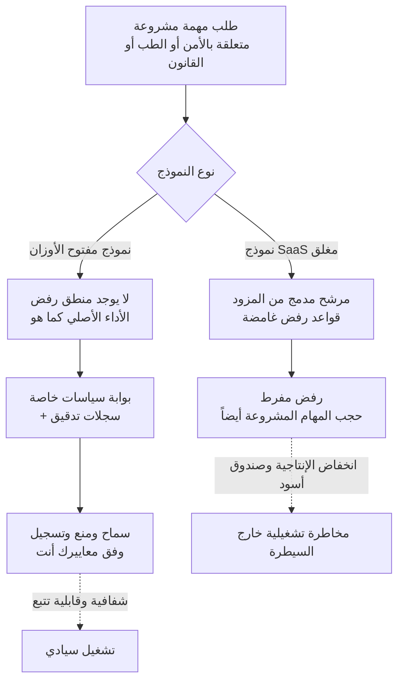

لا شك أن كثيرين مرّوا بتجربة مشابهة: مسؤول أمني يلصق كوداً في روبوت محادثة ليراجع سكريبت اختبار اختراق، فلا يحصل إلا على رد من نوع "لا يمكنني المساعدة في هذا الطلب". إنها مهمة دفاعية مشروعة تهدف إلى اكتشاف الثغرات وإصلاحها، لكن النموذج يغلق الباب بمجرد أن يستشعر كلمات مفتاحية مرتبطة بـ"الأمن السيبراني". في يوليو 2026، ومع الإعلان عن نموذج جديد في معسكر النماذج مفتوحة الأوزان هو Kimi K3، عادت هذه النقطة بالذات لتصبح موضع جدل ساخن من جديد. زعم أحد المستثمرين أن K3 أصلح عدداً من الثغرات الأمنية التي رفضت أدوات البرمجة المغلقة التعامل معها بسبب "حواجز الأمن السيبراني". هذا الادعاء بحد ذاته لم يُتحقق منه، لكن السؤال الكامن وراءه حقيقي تماماً: **من ينبغي أن يملك سلطة تحديد ما يرفضه النموذج؟**

يتناول هذا المقال ذلك السؤال من خلال حالة Kimi K3 كمثال ملموس. نبدأ بتفكيك ظاهرة الرفض المفرط (over-refusal)، ثم نستعرض بوقائع مؤكدة كيف وضع تصميم K3 هذا النموذج في قلب هذا الجدل، لننتقل بعدها إلى ما تنقله النماذج مفتوحة الأوزان فعلياً إلى المشغّلين، وكيف يمكن لشركة مثل ThakiCloud، التي تستضيف نماذج لعملاء متعددين، أن تتعامل مع هذا العبء. والخلاصة التي نقدمها سلفاً هي أن النموذج الخالي من الحواجز الوقائية لا يلغي المشكلة، بل **ينقلها إليك.**

## ما هو الرفض المفرط؟

الرفض المفرط هو ظاهرة يحجب فيها النموذج طلبات مشروعة أثناء محاولته منع طلبات خطيرة. مرشحات السلامة ليست دقيقة بطبيعتها. فطلب "اكتب لي كوداً يستغل هذه الثغرة في النظام" بنية هجومية، وطلب "أريد إعادة إنتاج هذه الثغرة في نظامنا للتحقق من فعالية الترقيع" بنية دفاعية، يكادان يتطابقان لفظياً على السطح. وحين يعجز المرشح عن تمييز النية، يميل نحو الجانب الآمن فيرفض الطلبين معاً.

المشكلة أن هذا الرفض يترتب عليه كلفة معتبرة في الواقع العملي. فالمهام المشروعة التي تتضمن حتماً مفردات حساسة، كتحليل الثغرات في فرق الأمن، ودعم القرار السريري في المستشفيات، ومراجعة السوابق القضائية في مكاتب المحاماة، هي الأكثر عرضة للاصطدام بالمرشحات. يضاف إلى ذلك أن منطق الرفض في نماذج SaaS المغلقة غالباً ما يكون غامضاً؛ فلماذا رُفض الطلب، وأي قاعدة تحرك الرفض، وكيف يمكن تجاوزه، كلها أمور غير موثقة ومخبأة داخل خوادم المزود. وبذلك يجد المشغّل نفسه مضطراً لتسليم سير عمله إلى صندوق أسود لا يملك عليه أي سيطرة.

وثمة طبقة إضافية هنا. فبعض الخدمات المغلقة تقوم، عند اكتشاف موضوع حساس، بتحويل الاستعلام بصمت إلى نموذج أصغر أو أكثر تقييداً. يظن المستخدم أنه يستدعي النموذج نفسه بالاسم ذاته، بينما يحصل فعلياً على استجابة مخفّضة الجودة. ينكسر بذلك اتساق الأداء، وبما أن هذا لا يظهر للعيان، فهو يقوّض قابلية إعادة الإنتاج والموثوقية معاً.

## الجدل الذي أثاره Kimi K3

Kimi K3 هو نموذج ضخم من نوع خليط الخبراء (Mixture-of-Experts) أعلنته شركة Moonshot AI في 16 يوليو 2026. بإجمالي 2.8 تريليون معامل، يُعد أول نموذج مفتوح الأوزان يدخل فئة الثلاثة تريليون معامل، ويدعم سياق يصل إلى مليون رمز بالإضافة إلى الوسائط المتعددة الأصلية. من المقرر إصدار الأوزان الكاملة في 27 يوليو، وقد تناولنا بتفصيل مسائل المعمارية وموثوقية معايير القياس اللازمة للتحقق من صلاحية اعتماده في [مقال منفصل](https://thakicloud.github.io/ar/llmops/kimi-k3-benchmark-trust-overfit/).

أما تركيز هذا المقال فهو مختلف. الميزة التي أجمعت عليها وسائل إعلام عدة عن K3 هي أنه لا يحتوي على تصفية للمحتوى ولا تحويل خفي للاستعلامات. وبعبارة أخرى تماماً: "النموذج الذي تستدعيه هو ذاته النموذج الذي تحصل عليه". لا يخفّض الأداء أو يحوّل إلى نموذج آخر لمجرد استشعار موضوع حساس. وهذا يعني من منظور الباحث أن الأداء يبقى ثابتاً حتى في المهام القريبة من الطب والقانون والأمن.

الشرارة التي أشعلت الجدل كانت ادعاء انتشر على وسائل التواصل الاجتماعي مفاده أن K3 أصلح ثغرات أمنية رفضت الأدوات المغلقة التعامل معها. ورغم أن الادعاء تضمن أرقاماً محددة، فإن هذه الأرقام لم يتحقق منها أي طرف ثالث، لذا فمن الأمانة اعتبارها [تقديرية]. لكن سواء أكان هذا الادعاء صحيحاً أم مبالغاً فيه، فإن سبب رواجه واضح؛ فكثير من الممارسين اختبروا فعلياً رفض مهام أمنية مشروعة، وعبارة "نموذج بلا مرشحات" أصابت تلك الإحباط في الصميم.

من حيث القدرات، يُنظر إلى K3 على أنه بات قريباً من أفضل النماذج المغلقة. وفيما يلي معايير الأداء التي أعلنتها Moonshot لوكيل البرمجة الخاص بها. هذه الأرقام كلها صادرة عن الشركة نفسها وتُعد مرجعية أولية قبل أي تكرار مستقل من طرف ثالث.

بالنظر إلى الأرقام وحدها، يمتلك K3 القدرات الكافية ليكون بديلاً عن الأدوات المغلقة. لكن المشكلة ليست في القدرة، بل في المسؤولية التي ترافقها.

## ما تنقله النماذج مفتوحة الأوزان: من يملك سلطة الرفض

هنا لا بد من توضيح نقطة يسهل الوقوع في سوء فهمها. فالنموذج الخالي من المرشحات لا يلغي مشكلة السلامة، بل **ينقل سلطة الحكم على السلامة ومسؤوليتها من المزود إليك**. فإذا كنت غير راضٍ عن قواعد الرفض التي يفرضها المزود في نموذج مغلق، فإن استخدام نموذج مفتوح الأوزان يعني أن عليك أنت وضع تلك القواعد بنفسك. وإن لم تفعل، فستُشغّل النموذج في حالة انعدام تام للقواعد.

هذا التحول سلاح ذو حدين. الجانب الإيجابي أنه يمكنك بناء سياسة دقيقة تتناسب مع مجالك وبيئتك التنظيمية. فشركة أمنية مثلاً يمكنها السماح بتحليل الثغرات لأغراض دفاعية بينما تمنع توليد كود هجومي صريح، وهو معيار أدق بكثير من مرشحات المزود الفجّة. أما الجانب السلبي فهو أن وضع هذه السياسة وصيانتها وتدقيقها يصبح بالكامل مسؤوليتك. وإن لم تفعل شيئاً، فسينفّذ K3 كل ما يُطلب منه كما هو.

يقارن الرسم التالي بين موقع سلطة الرفض في المسارين.

الفكرة الجوهرية أن المسار الأيمن لا يكتمل تلقائياً. فمربعا "بوابة السياسات الخاصة" و"سجلات التدقيق" لا يتحققان إلا إذا قمت أنت بملئهما. وإن لم تمتلك هذين العنصرين، فإن تبني نموذج مفتوح الأوزان لن يعدو كونه استبدال مرشح المزود الغامض بحالة انعدام تام لأي مرشح.

## الدلالات على منتجات ThakiCloud

هذه المسألة هي بالضبط ما تعالجه ThakiCloud مباشرة عبر منتجين اثنين.

**عدسة ai-platform، الاستضافة المحلية السيادية.** إذا أردت الاستفادة الحقيقية من نموذج مفتوح الأوزان خالٍ من المرشحات، فيجب أن تضع هذا النموذج تحت سيطرتك أنت. فاستدعاء K3 عبر واجهة برمجية تابعة لمزود خارجي قد يعني أن ذلك المزود سيضيف مرشحاته الخاصة من جديد، فتضيع بذلك ميزة "غياب المرشحات". تستضيف منصة ai-platform التابعة لـ ThakiCloud النماذج في بيئة محلية سيادية، مبنية على جدولة معالجات GPU عبر K8s وKueue. فحتى مع تطبيق التكميم، تتجاوز أوزان نموذج بحجم 2.8 تريليون معامل حاجز التيرابايت الواحد، مما يجعل التقديم الموزع متعدد المعالجات ضرورة حتمية، وهذا هو المجال الذي نتعامل معه تحديداً في تقديم النماذج الضخمة لعملاء متعددين مع عزل الموارد بينهم. وبالنسبة للعملاء في القطاعات الأمنية والحكومية والطبية، حيث تمنع اللوائح التنظيمية إخراج البيانات خارج حدود الدولة، فإن حقيقة تشغيل النموذج داخل مجموعتنا نفسها تصبح شرطاً مسبقاً للتبني.

**عدسة Paxis، سلطة الرفض تعود إليك.** كما أوضحنا آنفاً، التحدي الحقيقي في النماذج مفتوحة الأوزان هو أن تمتلك أنت مسألة "من يرفض ماذا". Paxis هو مستوى التحكم السحابي الأصيل للوكلاء (Agent-Native Cloud) التابع لـ ThakiCloud، ويتعامل مع السياسات (Policies) وسجلات التدقيق (Audit Logs) كموارد من الدرجة الأولى. فكل سلوك يصدر عن النموذج يُنفَّذ داخل صندوق معزول (sandbox) ويمر عبر بوابة سياسات، ويُسجَّل كل ما يُسمح به أو يُمنع في سجل تدقيق. وبدلاً من مرشح غامض يخفيه المزود خلف خوادمه، تحصل على طبقة سياسات شفافة تُعرّفها أنت وتطّلع عليها وتعدّلها. يستطيع فريق الأمن وضع قواعد تسمح بمهام الدفاع، ويستطيع الفريق الطبي وضع قواعد تناسب السياق السريري، ويمكن لكل منهما تتبع لماذا مُنع أمر معين ومتى، عبر السجل.

تلتقي العدستان في نقطة واحدة. فـ ai-platform تشغّل النموذج الخالي من المرشحات بالكامل داخل بنيتك التحتية، وPaxis يضيف فوقه طبقة السياسات والتدقيق التي تملكها أنت. والنتيجة أنك تنشئ منطقة وسطى قابلة للضبط بيديك، بين نقيضين هما "الرفض المفرط من المزود" و"غياب أي ضبط على الإطلاق".

## الحدود والحجج المضادة

لا مبرر لتصوير النموذج الخالي من المرشحات بصورة رومانسية. وفيما يلي بعض الحجج المضادة التي ينبغي توضيحها بجلاء.

أولاً، غياب الحواجز الوقائية خطر فعلي. صحيح أن مرشحات المزود مصدر إحباط بسبب الرفض المفرط، لكن صحيح أيضاً أن هذه المرشحات منعت طلبات ضارة بوضوح. وحين تُزال المرشحات، يزول معها ذلك الخط الدفاعي أيضاً. فالمؤسسة التي تستضيف نموذجاً مفتوح الأوزان دون امتلاك بوابة سياسات خاصة بها قد تنزلق نحو رفض ناقص (under-refusal) أسوأ من الرفض المفرط ذاته.

ثانياً، لا ينبغي اتخاذ قرار التبني بناءً على ادعاءات غير موثقة. فالحديث المتداول حول "أن K3 أصلح ثغرات رفضتها الأدوات المغلقة" مثير للاهتمام، لكن لا يوجد أي تكرار مستقل من طرف ثالث يؤكده. ومعرفة أي النماذج أفضل في مهمة بعينها لا تتحقق إلا من خلال تقييم held-out على بياناتك الفعلية أنت. فالحكايات المتداولة على وسائل التواصل الاجتماعي نقطة انطلاق لفرضية، لا مسوّغ للتبني.

ثالثاً، نقل المسؤولية هو أيضاً نقل للمسؤولية القانونية والأخلاقية. في زمن الاعتماد على مرشحات المزود، كان بالإمكان القول عند وقوع مشكلة إن "النموذج كان ينبغي أن يمنعها". أما حين تمتلك أنت السياسة الخاصة بك، فتقع عليك أيضاً مسؤولية ما تفوته تلك السياسة. وبدون حوكمة ونظام تدقيق قادرين على تحمّل هذا العبء، تتحول حرية النموذج مفتوح الأوزان من أصل إلى التزام.

خلاصة القول، إن الرسالة الحقيقية التي يحملها Kimi K3 ليست "النموذج الخالي من المرشحات أفضل". بل إن سلطة الرفض تنتقل تدريجياً من المزود إلى المشغّل، ولا تتحول هذه السلطة إلى ميزة حقيقية إلا للمؤسسات المستعدة لتحمّلها. والاستعداد هنا يعني امتلاك القدرة على الاستضافة المحلية وطبقة سياسات وتدقيق شفافة، وهذا بالضبط ما تقدمه ThakiCloud كمنتج جاهز.

## المصادر

- [Moonshot AI Launches Kimi K3 | Constellation Research](https://www.constellationr.com/insights/news/moonshot-ai-launches-kimi-k3)
- [China's Moonshot AI releases Kimi K3, the largest open-source model ever | VentureBeat](https://venturebeat.com/technology/chinas-moonshot-ai-releases-kimi-k3-the-largest-open-source-model-ever-rivaling-top-u-s-systems)
- [Kimi K3 vs DeepSeek V4 Pro vs GLM-5.2 | MarkTechPost](https://www.marktechpost.com/2026/07/18/kimi-k3-vs-deepseek-v4-pro-vs-glm-5-2-open-trillion-scale-moe-models-compared-on-benchmarks-license-and-serving-cost/)
- [Chinese AI has leveled up | CNBC](https://www.cnbc.com/2026/07/17/moonshot-ai-kimi-k3-model-openai-anthropic-china.html)
