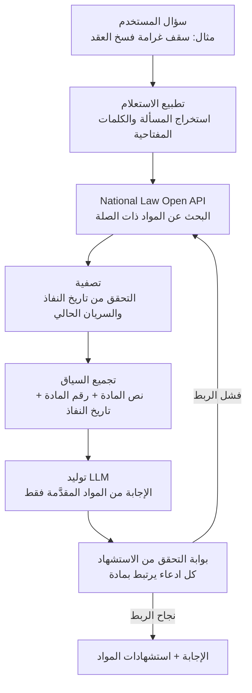

## لماذا تقرأ هذا

كُتب هذا للمهندسين الذين يريدون ربط نموذج LLM بأسئلة قانونية أو تنظيمية، ولمسؤولي البنية التحتية الذين يتحملون مسؤولية جودة الإجابة في المجالات عالية المخاطر. الخلاصة أولاً: حين يختلق النموذج نصوصاً قانونية في استعلام قانوني فلن تحلّ المشكلة باستبدال نموذج أكبر. تُحل فقط بتصميم مؤرّض (RAG) يربط الإجابة بنص قانوني موثّق. اربط واجهة National Law Information Open API الكورية كمصدر مرجعي، فيستشهد النموذج بأرقام مواد وتواريخ نفاذ حقيقية بدلاً من اختلاقها.

## نظرة عامة

انتشرت نصيحة على منصات التواصل: إن أردت مساعدة قانونية من ChatGPT أو Claude لكنك تخشى أن يختلق نصوصاً، فزوّده ببيانات قانونية محلية. القلق له ما يبرره. في الولايات المتحدة رُفعت دعوى ضد OpenAI بتهمة السماح لـ ChatGPT بتقديم استشارة قانونية دون تدخل مختص مرخّص، ويحذّر الخبراء من أن مجرد مناقشة المسائل القانونية مع روبوت محادثة قد يكون محفوفاً بالمخاطر. النموذج مُحسَّن لإكمال النص بشكل معقول، ولا يستطيع بمفرده أن يمنع نفسه من كتابة مادة غير موجودة وكأنها حقيقية.

ومع ذلك يرسل السوق نفسه الإشارة المعاكسة أيضاً. في كوريا الجنوبية تجاوز Claude نموذج ChatGPT لأول مرة في سوق الذكاء الاصطناعي التوليدي المدفوع، وأعلنت شركة Law&Company القانونية الناشئة أن مساعدها القانوني SuperLawyer المدعوم بـ Claude وصل إلى 6,000 محامٍ، أي نحو 20% من المحامين الممارسين في البلاد، خلال 180 يوماً من الإطلاق. حين تُوصف التقنية نفسها بالخطورة من جهة وتترسّخ في الممارسة اليومية من جهة أخرى، فالفارق ليس في النموذج بل في التصميم الذي يتعامل مع الإجابة. يفكّك هذا المقال ذلك التصميم، أي خط المعالجة المؤرّض الذي يربط إجابة LLM القانونية بنص مصدري موثّق، متخذاً واجهة National Law Open API مثالاً.

## ما هذه التقنية

الفكرة الأساسية بسيطة. بدلاً من أن تسأل النموذج "هل تعرف ماذا يقول القانون"، تأمره بأن "يسترجع أولاً المواد ذات الصلة ثم يجيب مستنداً إلى ذلك النص المصدري فقط". يوفّر الاسترجاع المادة الخام للإجابة، ويتم التوليد داخل تلك المادة وحدها، ويحمل كل ادعاء استشهاداً على هيئة رقم مادة وتاريخ نفاذ. الفراغات التي كان النموذج يملؤها بالخيال تُستبدل بنص موثّق.

هنا تحدد موثوقية المادة كل شيء. قد يكون ملخص قانوني مأخوذ من أي صفحة ويب مادةً قبل التعديل أو مجهول المصدر. لذا يجب أن يكون المصدر المرجعي هو الأصل الرسمي. توفّر واجهة National Law Information Open API الكورية نصوص القوانين النافذة وأرقام المواد وتواريخ النفاذ وسجل التعديلات والجهة المختصة بصيغة مهيكلة. بل تتيح الاستعلام عن القوانين النافذة في تاريخ معيّن، فيمكنك الاستشهاد بـ"المادة النافذة الآن" منفصلة عن "المادة النافذة آنذاك". في الاستعلامات القانونية، تمييز تاريخ النفاذ ليس تفصيلاً هامشياً بل هو المحور الذي يفصل الإجابة الصحيحة عن الخاطئة.

التدفق الكامل، مرتّباً عمودياً:



الفارق عن النهج البسيط هو بوابة التحقق. يتوقف RAG البسيط عند لصق المستندات المسترجعة في المُوجّه وأخذ الإجابة. في مجال عالي المخاطر تضيف خطوة أخرى. يتحقق الكود مما إذا كان كل ادعاء قانوني في الإجابة المولّدة يرتبط بمادة استُرجعت فعلاً، وإن فشل ادعاء واحد في الربط فلن تُرسل تلك الإجابة إلى المستخدم أبداً. هذه البوابة هي الخط الأخير الذي يرشّح الجمل التي اختلقها النموذج خارج أدلته.

## التثبيت والتكامل

الخطوة الأولى في ربط المصدر المرجعي هي إصدار مفتاح واجهة. تسجّل في بوابة National Law Information (open.law.go.kr) وتحصل على مفتاح مصادقة. بعدها يتم البحث عن المواد وجلب النص الكامل عبر استدعاءات قائمة على URL، ويوفّر الدليل الرسمي أمثلة بعدة لغات منها Python وNode.js.

فيما يلي نمط أدنى يبحث في القوانين النافذة بكلمة مفتاحية للمسألة ثم يجمّع ذلك النص المصدري وحده كسياق. اعتبر دليل الاستخدام في البوابة مرجعاً لمخطط الاستجابة والمعاملات الفعلية.

```python
import requests

LAW_API = "https://www.law.go.kr/DRF/lawSearch.do"

def search_statutes(keyword: str, oc_key: str) -> list[dict]:
    """البحث في القوانين النافذة عبر National Law Open API. إرجاع المواد كمصدر مرجعي."""
    params = {
        "OC": oc_key,          # مفتاح المصادقة المُصدَر
        "target": "law",       # البحث في القوانين
        "type": "JSON",
        "query": keyword,
        "display": 5,
    }
    resp = requests.get(LAW_API, params=params, timeout=10)
    resp.raise_for_status()
    return resp.json().get("LawSearch", {}).get("law", [])

def build_context(hits: list[dict]) -> str:
    """تجميع المواد المسترجعة في سياق قابل للاستشهاد، مع حمل تاريخ النفاذ والجهة لإظهار الأساس."""
    lines = []
    for h in hits:
        lines.append(
            f"[{h.get('법령명한글')}] "
            f"effective {h.get('시행일자')}, agency {h.get('소관부처명')}\n"
            f"{h.get('법령상세링크')}"
        )
    return "\n\n".join(lines)
```

حين تحمّل هذا السياق في المُوجّه، اجعل التعليمة صريحة: "أجب من المواد المقدَّمة أدناه فقط، ولا تستشهد بمواد لم تُقدَّم، وإن لم توجد مادة ذات صلة فقل ذلك." التعليمة التي تجعل النموذج يقول "لا يوجد" عند غياب الأساس هي جوهر منع الهلوسة. تجعله يترك الفراغ بأمانة بدلاً من ملئه.

أخيراً تمتلك بوابة التحقق في الكود. تستخرج أرقام المواد المستشهد بها في الإجابة المولّدة وتقارنها بقائمة المواد المحمّلة فعلاً في السياق. إن استشهد بمادة ليست في القائمة، تعود تلك الإجابة إلى حلقة الاسترجاع. يجب أن يأتي هذا الحكم من كود حتمي لا من تقرير النموذج الذاتي كي يكون جديراً بالثقة.

## ما يغيّره التصميم المؤرّض

لم نجرِ قياساً خاصاً لإنتاج أرقام جديدة. بدلاً من ذلك يُظهر مؤشر تشغيلي منشور بالفعل أثر التصميم المؤرّض. يعمل SuperLawyer من Law&Company على Claude لكنه مصمَّم لربط الإجابات بالسوابق والقوانين، ووفقاً لحالة العميل التي نشرتها Anthropic فقد وصل إلى 6,000 محامٍ (نحو 20% من المحامين الممارسين في البلاد) خلال 180 يوماً من الإطلاق، بمعدل تحويل من المجاني إلى المدفوع 60.2%، ومعدل عودة في الشهر الثاني 79.1%، وتوفير تراكمي قدره 2.3 مليون ساعة في أول 180 يوماً. أن تحافظ أداة يتحقق منها المحترفون يومياً على هذا القدر من العودة يُقرأ كإشارة إلى أن الإجابات لم تكن معقولة فحسب بل جديرة بالثقة فعلاً.

على الجانب الآخر تقف كلفة ترك القانون يُجاب دون تأريض. دعوى OpenAI في الولايات المتحدة والتحذير من مناقشة المسائل القانونية مع روبوت محادثة يُظهران أن الإجابات القانونية غير المؤرّضة قد تتصاعد إلى مسائل مسؤولية قانونية. حتى مع النموذج نفسه، يفصل ربطه بنص مصدري أو عدمه بين النتيجتين بهذه الحدّة. الدرس الذي تعلّمه المؤشرات واضح: في مجال عالي المخاطر، الرافعة التي ترفع الجودة ليست فئة النموذج بل تصميم التأريض.

## ماذا يعني هذا لمنتجات ThakiCloud

يتلاءم هذا النمط طبيعياً مع منتجَي ThakiCloud.

من زاوية Paxis، الإجابة القانونية المؤرّضة هي عبء عمل نموذجي لـ Agent-Native Cloud. يعامل Paxis الـ Skills وTools وPolicies وAudit Logs كموارد من الدرجة الأولى. البحث القانوني هو Tool يُنفَّذ في صندوق رمل معزول، وبوابة التحقق من الاستشهاد هي Policy يجب أن تجتازها الإجابة قبل خروجها، وأيّ مواد أرّضت أيّ إجابة يُسجَّل في Audit Log. في مجال تهم فيه المساءلة، كالقانون، يجب أن تكون قادراً على تتبع سبب صدور الإجابة بعد وقوعها، وتوفّر بوابات السياسة وسجلات التدقيق هذا التتبع افتراضياً. إن جمعت بوابة التأريض التي تفرض استشهاداً على كل ادعاء في skill قابل لإعادة الاستخدام، أمكنك نقلها كما هي إلى مجالات أخرى عالية المخاطر تحتاج استشهادات مصدرية، كالطب والمال والامتثال التنظيمي.

وهناك زاوية ai-platform أيضاً. بيانات كالقوانين والسوابق قد تكون حساسة لإرسالها عبر واجهة خارجية أصلاً، وكثيراً ما تطالب الجهات العامة والتنظيمية بسيادة البيانات والخدمة داخل المنشأة. تخدم ai-platform من ThakiCloud النماذج بنمط متعدد المستأجرين على K8s وجدولة GPU المبنية على Kueue، وهي مصمَّمة لتشغيل المصدر المرجعي والنموذج معاً على بنيتك التحتية الخاصة. أبقِ البيانات القانونية داخلياً وشغّل الاسترجاع والتوليد فوقها، فتحفظ الدقة المؤرّضة وسيادة البيانات معاً. الكلفة المنخفضة للخدمة هي الشرط المسبق الذي يتيح تشغيل خط معالجة متخصص كهذا باستمرار.

## الحدود والاعتراضات

التصميم المؤرّض ليس دواءً شافياً لكل شيء. أولاً، إن لم يكن المصدر المرجعي محدّثاً فالإجابة خاطئة أيضاً. حتى لو عكست بيانات National Law التعديلات فوراً، فقد تستشهد لقطة قديمة خزّنها خط المعالجة بمادة مُلغاة. يجب أن تدعمها مرشّحات تاريخ النفاذ والمزامنة الدورية. ثانياً، الاستشهاد بمادة بدقة لا يضمن صحة تفسيرها. جوهر الاستشارة القانونية ليس البحث عن المادة بل تطبيقها على الوقائع، وذلك الحكم يبقى من اختصاص مختص مؤهل. ينبغي النظر إلى خط المعالجة هذا كأداة مساعِدة تبني مسودة فوق الأدلة، لا كبديل عن الخبير. ثالثاً، إن كانت بوابة التحقق تفحص ربط الاستشهاد فقط، فقد تمرّر إجابة تستشهد بالمادة صحيحاً لكنها تستدل خطأ. تحفظ البوابة الحد الأدنى ضد الهلوسة؛ ولا تضمن جودة الحجة.

## الخلاصة

حين ينتج نموذج LLM نصوصاً قانونية مختلقة على سؤال قانوني، فالمشكلة ليست حدّ النموذج بل فجوة في التصميم. اربط الإجابة بنص مصدري موثّق، واجعلها تقول "لا يوجد" حين لا يوجد أساس، وامتلك في الكود بوابة تفرض استشهاداً على كل ادعاء، فيقدّم النموذج نفسه مستوى ثقة مختلفاً تماماً. هنا بالضبط تكمن الفجوة بين أداة قانونية مدعومة بـ Claude ترسّخت في الممارسة في كوريا واستشارة روبوت محادثة غير مؤرّضة تصاعدت إلى دعوى قضائية. الخطوة التالية واضحة. إن كنت تربط نموذج LLM بمجال عالي المخاطر، فاوصل مصدراً مرجعياً موثوقاً كـ National Law Open API قبل أن تبحث عن نموذج أكبر، وأقم بوابة تحقق من الاستشهاد أولاً. الرافعة دائماً في جانب الأدلة.

## المصادر

- [بوابة National Law Information Open API](https://open.law.go.kr/LSO/openApi/guideList.do)
- [خدمة مشاركة National Law Information (بوابة البيانات العامة)](https://www.data.go.kr/data/15000115/openapi.do)
- [حالة عميل Anthropic: Law&Company](https://www.anthropic.com/customers/law-and-company)
- [KED Global: Claude يتجاوز ChatGPT في سوق الذكاء الاصطناعي التوليدي المدفوع بكوريا الجنوبية](https://www.kedglobal.com/artificial-intelligence/newsView/ked202604270002)
- [Forbes: دعوى ضد OpenAI بشأن الاستشارة القانونية](https://www.forbes.com/sites/lanceeliot/2026/03/09/landmark-lawsuit-against-openai-for-allowing-chatgpt-to-provide-legal-advice-could-be-a-huge-game-changer-for-all-ai-makers/)
