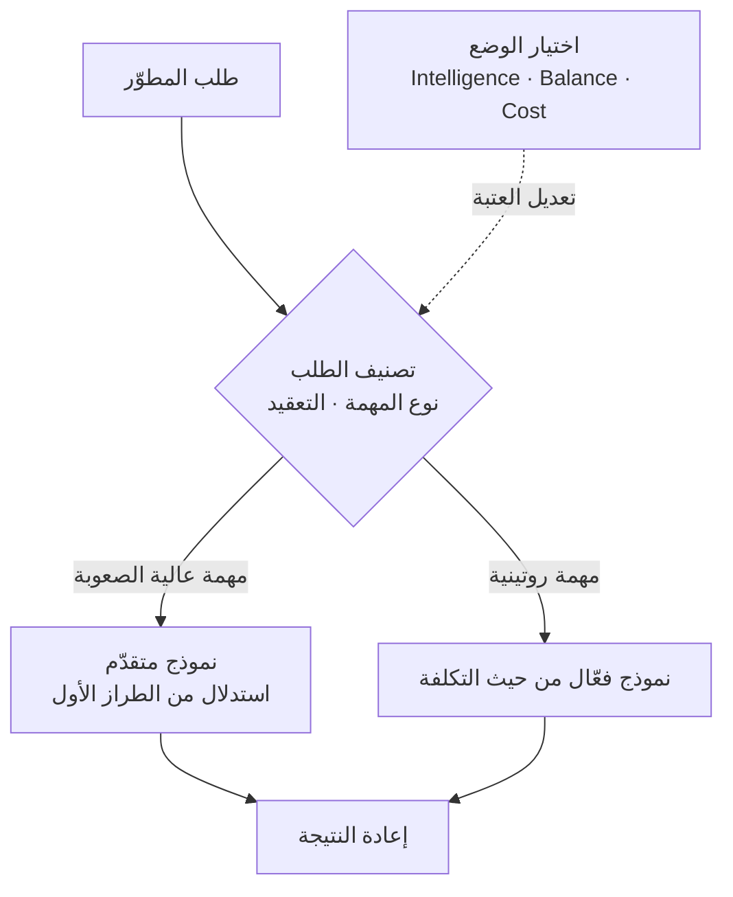

إذا كان فريقكم يُشغّل بيئة برمجة بالذكاء الاصطناعي تعتمد على نماذج متعددة، وتفاجَأون كل شهر بفاتورة تكاليف الاستدلال، فهذا المقال لكم. الخلاصة أولاً: التوجيه الذي يحلّل كل طلب على حدة ويخصّص له بالضبط القدر الذي يحتاجه من الذكاء هو رافعة عملية تخفّض التكلفة بنسبة 30 إلى 60% مع الحفاظ على الجودة تقريباً كما هي. أثبت Cursor Router، الذي أطلقته Cursor في يوليو 2026، هذا الأمر ببيانات استخدام فعلي واسعة النطاق. والمبدأ نفسه هو نمط تشغّله ThakiCloud بالفعل يومياً داخل مكدّس عملائها الذكيين (agent stack).

*توضّح الصورة فكرة التوجيه الذي يخصّص لكل طلب بالضبط القدر الذي يحتاجه من الذكاء.*

## لماذا تقرأ هذا المقال

يُكتب هذا المقال لمسؤولي المنصّات الذين يشغّلون عدّة نماذج لغوية كبيرة معاً أو أدخلوا أدوات برمجة بالذكاء الاصطناعي إلى فرقهم، وللمهندسين الذين يحتاجون إلى خفض تكلفة الاستدلال دون التضحية بالجودة. الخلاصة الجوهرية واحدة: إرسال كل طلب إلى أغلى نموذج متقدّم هو هدر في معظم الحالات، وتصنيف صعوبة الطلب أولاً ثم توجيهه إلى النموذج المناسب يخفّض التكلفة بشكل كبير دون خسارة في الجودة. أثبت Cursor Router هذه الفرضية على أكثر من 600,000 طلب فعلي، وسنحلّل آليّته هنا ثم نضعها جنباً إلى جنب مع تطبيق ThakiCloud للتوجيه.

## نظرة عامة

على مدى العامين الماضيين، دار سباق أداء النماذج اللغوية الكبيرة غالباً حول محور واحد: نموذج أكبر، نموذج أفضل. لكن بمجرّد أن تُشغّل عدّة نماذج معاً في بيئة إنتاج فعلية، تدرك حقيقة بسرعة: نحو 90% من الطلبات لا تحتاج إلى أفضل نموذج. استدعاء نموذج استدلال من الطراز الأول لإعادة تسمية متغيّر أو إكمال دالة قصيرة أشبه باستئجار طائرة شحن لإرسال رسالة واحدة.

هنا يظهر التوجيه كمحور جديد. عند وصول الطلب، يُقيَّم أولاً مدى صعوبته، فتُرسل الطلبات الصعبة إلى نموذج متقدّم والطلبات السهلة إلى نموذج أرخص. يتولّى هذا التقييم نموذج صغير وسريع، لذلك لا يضيف عبئاً كبيراً. حوّلت Cursor هذا النهج إلى منتج أسمته Cursor Router، وتقول إنه يوفّر جودة بمستوى النماذج المتقدّمة بتكلفة أقل بنسبة 60%.

واللافت أنّ هذا ليس مجرّد ميزة لخفض التكاليف. رأت Cursor في إعلانها أنّ الموجّه سيدفع، على المدى الطويل، قدرات النماذج المتقدّمة نفسها إلى ما هو أبعد ممّا يمكن لنموذج واحد بلوغه بمفرده. الفكرة هي أنّ الجمع بين نقاط قوّة عدّة نماذج على مستوى كل طلب يمكن أن يُنتج نتائج لا يستطيع أي نموذج منفرد تحقيقها وحده.

## ما هذه التقنية

Cursor Router طبقة توجيه تحلّل، مع كل طلب برمجي وارد، نوع المهمّة ومستوى تعقيدها، ثم ترسله إلى النموذج الأكثر فاعلية. إن تطلّبت المهمّة ذلك، تستدعي نموذجاً متقدّماً، وإلا فتُعالجها بنموذج أكثر كفاءة من حيث التكلفة.

وفيما يلي المسار الكامل.

المقبض الذي يمكن للمستخدم ضبطه هو ثلاثة أوضاع: Intelligence وBalance وCost. تحدّد هذه الأوضاع أين تقف على حدود باريتو (Pareto frontier) بين التكلفة والذكاء. يدفع وضع Intelligence عتبة التوجيه نحو الجودة، ويدفعها وضع Cost نحو التكلفة، بينما يقف Balance بينهما. صُمّم الموجّه نفسه ليعمل بشكل مختلف تبعاً لأولويات كل مؤسسة.

تأتي قدرة الموجّه على التصنيف من البيانات. تقول Cursor إنها دربت هذا الموجّه على أكثر من 600,000 طلب فعلي، وتحقّقت منه إضافياً على ملايين الطلبات. تعلّم الموجّه أي الطلبات تحتاج فعلاً إلى نموذج متقدّم وأيها لا تحتاج، من سلوك برمجة حقيقي لمطوّرين فعليين لا من بيانات اصطناعية. هذا هو جوهر جودة التوجيه؛ فأي خطأ في تقييم الصعوبة يؤدي إمّا إلى هدر نموذج مكلف على طلب سهل، أو إلى تحميل طلب صعب على نموذج رخيص فتنخفض الجودة.

## النتائج المُعلَنة

الأرقام التي نشرتها Cursor نوعان. الأول رقم إجمالي: يوفّر الموجّه جودة بمستوى النماذج المتقدّمة بتكلفة أقل بنسبة 60%. والثاني بيانات حسابات فعلية من مرحلة الوصول المبكّر. قارنت ثلاثة حسابات كبيرة، لكل منها آلاف المستخدمين، بين إرسال كل الطلبات إلى Opus 4.8 واستخدام التوجيه التلقائي (Auto)، فوجدت خفضاً في التكلفة بنسبة 30 إلى 50% دون أي تراجع في الجودة.

هذه الأرقام صادرة عن Cursor نفسها بخصوص منتجها، وليست معياراً مُتحقَّقاً منه بشكل مستقل. مع ذلك، فإن حجم التدريب على 600,000 طلب والتحقّق على ملايين الطلبات، إلى جانب مقارنة استخدام فعلي عبر ثلاثة حسابات كبيرة، أكثر موثوقية من مثال تسويقي منفرد. الرسالة الجوهرية واضحة: اختفى 30 إلى 50% من التكلفة بفضل التوجيه وحده، مع بقاء الجودة كما هي.

راعى شكل الطرح الجانب التشغيلي أيضاً. يُتاح Cursor Router في خطط Teams وEnterprise، مع أدوات تحكّم تتيح للمسؤولين السماح بنماذج محدّدة أو حظرها، وتحديد الإعدادات الافتراضية، وإيقاف وضع التحسين. معاملة التوجيه كسياسة يمكن للمؤسسة التحكّم بها، لا كميزة أتمتة مغلقة، تمنح هذا النهج بُعداً تشغيلياً يتجاوز مجرّد الأتمتة.

## دلالات على منتجات ThakiCloud

التوجيه ليس مفهوماً جديداً بالنسبة لنا. تُشغّل Paxis، السحابة الأصيلة للعملاء الذكيين (Agent-Native Cloud) من ThakiCloud، توجيهاً على مستوى الطلب في طبقتين بالفعل.

الطبقة الأولى هي توجيه المهارات (skill routing). يختار Skill Harness في Paxis من بين أكثر من 960 مهارة عبر بحث BM25. فبدلاً من استدعاء كل المهارات مع كل طلب، يطابق مفردات الطلب مع أوصاف المهارات، ويشغّل فقط القلّة الأكثر صلة داخل بيئة معزولة (sandbox). إذا كان Cursor Router يوجّه الطلب إلى نموذج، فإنّ Paxis يوجّه الطلب إلى مهارة. يعالج كلاهما المشكلة نفسها: هدر استدعاء كل شيء طوال الوقت.

الطبقة الثانية هي توجيه مستويات النماذج. حين نُشغّل وكيلاً فرعياً (subagent)، نخصّص له مستوى نموذج حسب طبيعة المهمّة. تذهب مهام الاستكشاف مثل قراءة الملفات والبحث إلى نموذج رخيص، وتذهب كتابة الشيفرة ومراجعتها إلى نموذج متوسط المستوى، وتذهب القرارات المعمارية والاستدلال المتعدد الخطوات المعقّد إلى النموذج الأعلى. تتولّى طبقة التنسيق (orchestration) نموذج منخفض التكلفة، ولا يُستدعى النموذج المكلف إلا لمرّة واحدة عند الخطوة التي تحتاج استدلالاً ثقيلاً. هذه الفكرة مطابقة تماماً لما تفعله أوضاع Intelligence وBalance وCost في Cursor عند اختيار موقع على حدود باريتو.

وإذا مضينا خطوة أبعد، نصل إلى الترقية القائمة على المراجعة الرجعية (retrospective). تبدأ المهارات المجدولة في Paxis افتراضياً بنموذج رخيص، وإذا أخفقت مهارة معيّنة بشكل متكرر في تحقيق الجودة المطلوبة، تُرقّى تلك المهارة وحدها تلقائياً إلى نموذج أعلى. فالتوجيه هنا ليس ثابتاً، بل يستمر في التعديل استناداً إلى بيانات الإخفاق. تماماً كما تعلّم Cursor Router قدرته على التصنيف من 600,000 طلب فعلي، نتعلّم نحن سياسة التوجيه من المراجعات التشغيلية الرجعية.

هناك أيضاً بُعد بنيوي. تخدم منصّة ai-platform التابعة لـThakiCloud النماذج لبيئات عملاء متعدّدة فوق جدولة K8s وKueue GPU. وخفض تكلفة الاستدلال بنسبة 30 إلى 50% عبر التوجيه يعني معالجة عدد أكبر من الطلبات بالميزانية نفسها من وحدات معالجة الرسوميات (GPU)، أو تقديم الخدمة بتكلفة أقل للوحدة. الخدمة منخفضة التكلفة (ai-platform) هي ما يصنع اقتصاديات العملاء الذكيين (Paxis). فبدون توجيه يقتصد في استخدام النماذج المتقدّمة، لا يصبح تشغيل أعباء عمل الوكلاء الذكيين على نطاق واسع وباستمرار مجدياً اقتصادياً.

## الحدود والاعتراضات

التوجيه ليس حلاً سحرياً. له عدّة نقاط ضعف واضحة.

أولاً، قد يخطئ مصنّف الصعوبة نفسه. لأنه يحكم على صعوبة الطلب من مؤشّرات سطحية، فهناك خطر أن يُرسل طلباً يبدو قصيراً لكنه يحتاج فعلياً استدلالاً دقيقاً إلى نموذج رخيص. وأي خطأ في التصنيف يترجم مباشرة إلى تراجع في الجودة، ولا يظهر هذا الإخفاق إلا بعد أن يرى المستخدم النتيجة. تركيز Cursor على أنه "لا تراجع في الجودة" يستهدف هذا القلق تحديداً.

ثانياً، يضيف الموجّه طبقة تحكّم إضافية. فإذا تعذّر تتبّع أي طلب ذهب إلى أي نموذج، يصعب تحديد السبب عندما تبدو النتيجة غريبة. لذلك لا بد أن يرافق التوجيهَ شفافيةٌ رصدية (observability). فبدون طبقة تسجّل أي طلب ذهب إلى أي نموذج ولماذا، يصبح تصحيح الأخطاء مستحيلاً.

ثالثاً، هناك مخاوف من الارتباط بمزوّد واحد (vendor lock-in). منطق التوجيه في Cursor Router وبيانات تدريبه أصول غير مُعلَنة. وحين تُترك مهمّة التوجيه لمنتج بعينه، يصعب التحكّم في كيفية تغيّر معايير تصنيفه. أمّا المؤسسات التي تشغّل بنيتها التحتية الخاصة، فالأسلم لها على المدى الطويل أن تمتلك سياسة التوجيه بنفسها. وهذا أيضاً سبب معاملة ThakiCloud للتوجيه كسياسة حتمية (deterministic) تملكها الشيفرة البرمجية.

## خلاصة

أظهر Cursor Router، عبر استخدام فعلي واسع النطاق، أنّ الطريق إلى ضبط التكلفة والجودة معاً ليس "نموذجاً واحداً أفضل" بل "النموذج المناسب لكل طلب". التدريب على 600,000 طلب، وخفض التكلفة بنسبة 30 إلى 50%، والتحقّق دون خسارة عبر ثلاثة حسابات كبيرة، كلّها أدلّة تشير إلى أنّ التوجيه محور جديد للأداء المتقدّم. وهذا يؤكّد الخلاصة التي افتتح بها هذا المقال: إرسال كل طلب إلى أفضل نموذج هدر، والتوجيه القائم على الصعوبة يزيل ذلك الهدر.

إن كنتم ستطبّقون هذا في عملكم فوراً، ننصح بمراعاة ثلاثة أمور: إنشاء طبقة تصنيف تفرز الطلبات حسب الصعوبة، وإضافة شفافية رصدية تسجّل أي طلب ذهب إلى أي نموذج، وامتلاك سياسة التوجيه بأنفسكم بدلاً من تركها لمزوّد خارجي. تُشغّل ThakiCloud هذه الأمور الثلاثة بالفعل عبر توجيه المهارات وتوجيه مستويات النماذج والترقية القائمة على المراجعة الرجعية. فالتوجيه ليس ميزة لخفض التكاليف في المقام الأول، بل شرط أساسي لتشغيل الوكلاء الذكيين على نطاق واسع.

## المصادر

- [إطلاق Cursor Router (مدونة Cursor)](https://cursor.com/blog/router)
- [سجل تغييرات Cursor Router (Cursor)](https://cursor.com/changelog/router)
- [الإعلان الرسمي من Cursor (X)](https://x.com/cursor_ai/status/2079993729532989500)
