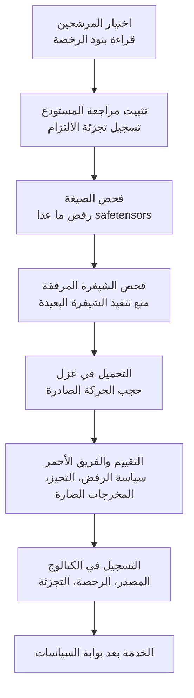

*تجسيد لفكرة أن الأمان يحدده إجراء الإدخال المحيط بالأوزان لا الأوزان نفسها.*

## لماذا يستحق هذا المقال القراءة

كُتب هذا المقال لمهندسي MLOps ومشغّلي المنصات الذين عليهم أن يقرروا إدخال نموذج مفتوح الأوزان إلى بيئة محلية أو سيادية، ولمسؤولي الأمن الذين عليهم اعتماد ذلك القرار. إن أردتم الإجابة عن سؤال "هل نستخدم نموذجا صينيا" بإجراء لا بانطباع سياسي، فهذا المقال لكم.

أبدأ بالخلاصة. الاعتقاد الشائع بوجود باب خلفي مزروع داخل ملفات الأوزان يستند إلى أساس تقني ضعيف، وفي هذه النقطة جينسن هوانغ محق في معظم كلامه. لكن هذا لا يعني انعدام الخطر، بل يعني أن الخطر يقيم في مكان آخر. فسطح الهجوم الحقيقي ليس الأرقام داخل الأوزان، بل صيغة التحميل التي تغلفها وشيفرة بايثون المرفقة في المستودع وحدود الشبكة في بيئة التشغيل. ولذلك ينبغي أن يقوم قرار التبني على إجراء الإدخال لا على جنسية النموذج.

## ماذا حدث

في 22 يوليو 2026 أدلى جينسن هوانغ، الرئيس التنفيذي لشركة NVIDIA، بتصريحات صريحة على غير المعتاد بشأن النماذج الصينية مفتوحة المصدر. وخلاصة ما نقلته عدة وسائل إعلامية كالآتي.

كان ادعاؤه الأول أنه ينبغي السماح للشركات الأمريكية باستخدام نماذج الذكاء الاصطناعي الصينية. وقال إن فكرة وجود أبواب خلفية متصلة بالصين بشكل ما هي سوء فهم، موضحا أنك تنزّل النماذج وتضبطها بدقة وتضع عليها حواجز الأمان بالطريقة التي تريدها. وأضاف أن النماذج الصينية مفتوحة المصدر ممتازة، وأشار إلى أن السوق أساء قراءة أثر DeepSeek في المرة الأولى، وهو يسيء قراءة أثر Kimi هذه المرة.

أما ادعاؤه الثاني فقلب منطق الأمن المعتاد. فبما أن الباحثين الخارجيين يستطيعون فحص نموذج مفتوح وكشف نقاط ضعفه، فإن الانفتاح يجعله أكثر أمانا لا أقل. وقال إنه إذا تجمع كل شيء في نموذج واحد فستنشأ نقطة هجوم واحدة ومصدر فشل واحد، وعندها يصير العالم أكثر هشاشة بكثير.

ولهذه التصريحات خلفية. ففي اليوم نفسه قال وزير الخزانة سكوت بيسنت لقناة Fox Business إن الإدارة تدرس ما إذا كانت نماذج الذكاء الاصطناعي الصينية قد بُنيت على ملكية فكرية أمريكية مسروقة، وأشار إلى وجود صلاحية لفرض عقوبات إن ثبتت السرقة. أي أنه في اللحظة التي كانت واشنطن تدرس فيها حظر النماذج الصينية، اتخذ الرئيس التنفيذي للشركة الأكثر استفادة موقفا معاكسا علنا.

أما النموذج محور النقاش، Kimi K3، فقد أصدرته Moonshot AI في 16 يوليو. وهو نموذج من نوع خليط الخبراء بإجمالي 2.8 تريليون معامل، ينشّط 16 خبيرا من أصل 896، ويدعم سياقا بمليون رمز ومدخلات متعددة الوسائط. وأُعلن عن إطلاق الأوزان برخصة MIT معدّلة بحلول 27 يوليو.

## إلى أي مدى يصح القول إنه لا يوجد باب خلفي

يجب تقسيم هذه المسألة بدقة.

ملف الأوزان نفسه مجموعة من الموترات العددية. وصيغة safetensors هي صيغة تسلسل تخزّن أسماء الموترات وأنواع بياناتها وأشكالها وإزاحاتها بالبايت فقط، ولا يمكنها حمل شيفرة قابلة للتنفيذ. وقراءة أوزان موزّعة بهذه الصيغة لا تنفّذ بحد ذاتها شيفرة عشوائية. وإلى هذا الحد فالتصريح دقيق، إذ لا يمكن وضع قدرة مثل الاتصال بخادم خارجي داخل المعاملات.

المشكلة في كل ما يحيط بها.

أولا الصيغة. فملفات PyTorch القديمة القائمة على pickle قادرة على تنفيذ شيفرة عشوائية أثناء فك التسلسل. وهذا الخطر لا علاقة له بجنسية النموذج وهو معروف منذ سنوات. لذا يصبح رفض أي ملف أوزان غير safetensors هو خط الدفاع الأول.

ثانيا شيفرة بايثون المرفقة داخل المستودع. فالمعماريات الجديدة كثيرا ما لا تدعمها المكتبة الأساسية بعد، فيرفق المستودع شيفرة النمذجة الخاصة به، ويتطلب استخدامها تفعيل خيار يسمح بتنفيذ شيفرة بعيدة. وفي اللحظة التي يُفعّل فيها هذا الخيار تُنفَّذ ملفات بايثون عشوائية من المستودع داخل عملية خادم الاستدلال لديكم. هنا يقع سطح الهجوم الحقيقي. لا تشكّوا في الأوزان بل في هذا الخيار.

ثالثا بيئة التشغيل. فحتى لو عجز النموذج عن الاتصال، فإن صورة الحاوية المحيطة به وخادم الاستدلال وأي مسارات صادرة يتركها ذلك الخادم مفتوحة قادرة على الاتصال بالتأكيد. فتسريب البيانات يحدث عند حدود الشبكة لا داخل المعاملات. وبالمقابل، في بيئة معزولة تُمنع فيها الحركة الصادرة، يُغلق هذا المسار بنيويا.

باختصار، حجة هوانغ صحيحة عند الطبقة الأولى وصامتة عن الطبقتين الثانية والثالثة. وفي الممارسة العملية تنشأ الحوادث غالبا في الطبقتين الثانية والثالثة.

## المخاطر الحقيقية الباقية، وليست أبوابا خلفية

سلامة سلسلة التوريد تأتي أولا. فإن لم تثبّتوا أي مراجعة من أي مستودع سحبتم، فقد يصير نموذج بالاسم نفسه محتوى مختلفا مع مرور الوقت. وبدون التثبيت بتجزئة الالتزام وتسجيل مجاميع تحقق للملفات، لا تملكون قابلية إعادة الإنتاج ولا قابلية التدقيق.

حالة طبقة الأمان تأتي ثانيا. ففي منظومة الأوزان المفتوحة تتكاثر النماذج المشتقة أسرع بكثير من الأصلية. وخلال الضبط الدقيق تضعف سياسات الرفض وطبقات الأمان أو تُنزع كليا، ثم تنتشر تلك النسخ بأسماء مشابهة للأصل. وهذا خطر أكثر واقعية بكثير من بلد المنشأ. وقد شهدت الأشهر الأخيرة جدلا متواصلا حول التقطير، حيث جُمعت كميات ضخمة من مخرجات نموذج تجاري لتدريب نموذج مشتق، والنماذج المصنوعة بهذه الطريقة لا ترث طبقة الأمان التي كان يحملها الأصل.

المخاطر القانونية والسياسية تأتي ثالثا. عليكم قراءة بنود الرخصة فعليا، وحساب احتمال أن تتحول النزاعات حول مصدر الملكية الفكرية إلى عقوبات. وهذا البند لا يمكن ضبطه بالتقنية، فالتحوط الوحيد هو الاحتفاظ بالقدرة على تبديل النموذج. والتصميم الذي لا يلحم خط المعالجة بنموذج بعينه هو ذاته التحوط ضد المخاطر السياسية.

## إجراء الإدخال إلى البيئة المحلية

ترجمة التحليل أعلاه إلى تسلسل قابل للتنفيذ:



*بدل السؤال عن الجنسية، اسألوا هل اجتاز النموذج هذه الخطوات الثماني.*

عند التنزيل ثبّتوا المراجعة وقيّدوا الصيغة. فواجهة Hugging Face تتيح تحديد التزام بعينه وحصر أنماط الملفات المطلوبة، ما يمنع وصول ملفات عائلة pickle من الأساس.

```bash
hf download <org>/<model> \
  --revision <commit-sha> \
  --include "*.safetensors" "*.json" "tokenizer*" \
  --local-dir /srv/models/<model>
```

وبعد التنزيل تأكدوا من عدم تسلل ملفات من عائلة pickle، وسجّلوا تجزئات قائمة الملفات.

```bash
find /srv/models/<model> -name "*.bin" -o -name "*.pt" -o -name "*.pkl"
sha256sum /srv/models/<model>/*.safetensors > /srv/models/<model>/SHA256SUMS
```

وعند الخدمة، القاعدة هي عدم تفعيل تنفيذ الشيفرة البعيدة. فإما أن تنتظروا حتى يدعم خادم الاستدلال المعمارية رسميا، أو، إن كان لا بد، أن تقرأوا شيفرة النمذجة المرفقة وتراجعوها بأنفسكم ثم تنسخوا المستودع داخليا لتشغيل نسخة مثبتة. وتفعيل هذا الخيار بحكم العادة أثناء التسرع في تشغيل معمارية جديدة هو الخطأ الأكثر شيوعا.

```bash
# التشغيل دون تفعيل تنفيذ الشيفرة البعيدة
vllm serve /srv/models/<model> \
  --served-model-name <alias> \
  --tensor-parallel-size 8
```

وأخيرا اعزلوا بيئة التشغيل. احجبوا الحركة الصادرة من جراب الاستدلال افتراضيا واسمحوا بالوجهات الضرورية فقط، وعندها لن تخرج البيانات حتى لو كان هناك خلل ما. وفي Kubernetes يمكنكم تثبيت هذه الحدود كشيفرة عبر سياسة شبكة.

## ماذا تقيسون بعد الإدخال

اكتمال الإدخال لا يعني اكتمال التحقق. فكثير من الفرق يكتفي بمراجعة درجة معيار قياسي ثم يمضي، لكن رقم لوحة الصدارة العامة لا يخبركم بنصف ما يحتاجه قرار التبني. وقبل ربط نموذج مفتوح الأوزان بخدمة حقيقية، قيسوا أربعة أمور على الأقل ببياناتكم أنتم.

الأول شكل سياسة الرفض. فأين يتوقف النموذج وأين يجيب أمام الطلب الضار نفسه يتباين تباينا هائلا بحسب تاريخ الضبط الدقيق. وتشغيل الأصل والمشتق جنبا إلى جنب على مجموعة المطالبات نفسها يكشف كم بقي من طبقة الأمان. فإن أجاب المشتق بسهولة أكبر بكثير من الأصل، فقد لا يكون ذلك أداء أفضل بل طبقة أمان منزوعة.

الثاني التباين بحسب اللغة والمجال. فحتى النماذج الموصوفة بأنها متعددة اللغات كثيرا ما يتدهور أداؤها بحدة على وثائق العمل الكورية أو المصطلحات التنظيمية المحلية. والتبني استنادا إلى معايير إنجليزية ثم خيبة الأمل عند حركة الإنتاج مسار مطروق. ومجموعة تقييم صغيرة مبنية من بياناتكم أنفع بكثير من معيار عام.

الثالث نزعة الاستجابة في الموضوعات الحساسة سياسيا. فالنزعة التي تحقنها دولة أو شركة أثناء التدريب لا تغطيها مطالبة النظام تغطية كاملة. وفي الخدمات المواجهة للعملاء تتحول هذه النزعة مباشرة إلى مخاطرة على العلامة التجارية، لذا خذوا عينات من الاستجابات في هذا المجال قبل التبني وأضيفوا مرشح مخرجات منفصلا عند الحاجة.

الرابع الإنتاجية على عتادكم الفعلي. فلأن نماذج خليط الخبراء الكبيرة تختلف فيها المعاملات الإجمالية عن المعاملات النشطة اختلافا حادا، يصعب تقدير متطلبات الذاكرة والإنتاجية الفعلية من المواصفات المنشورة وحدها. حددوا عدد الطلبات المتزامنة المستهدف وطول السياق، ثم قيسوا مباشرة على تكوين وحدات المعالجة لديكم قبل أن تتحدثوا عن تكلفة التبني.

## ما الذي يعنيه هذا لمنتجات ThakiCloud

نتعامل مع هذه المسألة على طبقتين.

في طبقة ai-platform نتحكم في التنفيذ نفسه. فأحمال خدمة النماذج معزولة لكل مساحة أسماء فوق Kubernetes، والحركة الصادرة محجوبة افتراضيا عبر سياسة الشبكة، وتكوين الخدمة القائم على vLLM موحّد بحيث لا تستطيع الفرق تفعيل تنفيذ الشيفرة البعيدة اعتباطا. ولأنها صُممت للبيئات المحلية والسيادية، فإن شرط عدم عبور البيانات للحدود مضمّن في شكل النشر نفسه. وإخبار عميل في قطاع خاضع للتنظيم بأنه يستطيع استخدام نموذج بعينه، صينيا كان أم أمريكيا، يتطلب تحقق هذا الشرط أولا.

وفي طبقة Paxis نتحكم فيما يُدخَل وما يُنفَّذ. Paxis هي السحابة الأصيلة للوكلاء من ThakiCloud، وتتعامل مع المهارات والأدوات والسياسات وسجلات التدقيق بوصفها موارد من الدرجة الأولى. ويحفظ كتالوج النماذج المصدر والرخصة وتجزئة المراجعة معا، ما يحوّل الخطوتين الأخيرتين من إجراء الإدخال أعلاه إلى شيء يفرضه النظام. وتمنع بوابة السياسات النسخ غير المفحوصة من التسلل إلى مسارات تنفيذ الوكلاء، وتتيح سجلات التدقيق تتبع أي نموذج فعل ماذا ومتى بأثر رجعي. ومن هنا تأتي أيضا القدرة على تبديل النماذج، فحين تملكون خيار انتقاء النموذج المناسب لكل مهمة، لا يجبركم تغيّر البيئة التنظيمية على إعادة بناء خط المعالجة.

## الحدود والاعتراضات

لهذا المقال نقاط ضعف أيضا.

فبعض المخاطر لا يمسكها الإجراء. فالباب الخلفي المزروع عبر بيانات التدريب، والذي يجعل النموذج يستجيب بصورة مختلفة لمدخل محفّز بعينه، لن ترشحه فحوص صيغة الملفات. وهذا الصنف يصعب كشفه كليا بأدوات التقييم العامة الحالية، وقائمة الفحص المعروضة هنا لا تدّعي تغطيته. غير أن هذا الخطر ليس حكرا على نماذج بلد بعينه، بل يوجد في كل نسخة لم يُتحقق من مصدرها.

وثمة اعتراض في الاتجاه المعاكس أيضا: كون الخطر قابلا للإدارة ليس سببا للتعجل في التبني. فبالنسبة لبعض المؤسسات يكون الاقتصار على النماذج المحلية أو النماذج التجارية المفحوصة خيارا أعقل من حيث التكلفة الإجمالية، وإن فرضت شروط التوريد قيدا على بلد المنشأ فإن نقاش الأمان التقني يصبح بلا معنى من الأساس. هذا المقال ليس دعوة إلى التبني، بل غايته توفير معايير القرار.

وأخيرا ضعوا مصالح المتحدث في الحسبان. فهذه أقوال شخص يستفيد موقعه من ارتفاع الطلب على المسرّعات مع انتشار النماذج مفتوحة الأوزان، وقد قال صراحة إن النماذج المفتوحة تفيد الصناعة كلها وإن نمو الاستخدام يعني طلبا حوسبيا أكبر. وسلامة الحجة شيء وحياد قائلها شيء آخر.

## الخلاصة

بفرز ما يُؤخذ وما يُترك من تصريحات هوانغ: النقطة القائلة إن الاعتقاد الشائع بوجود باب خلفي متصل داخل ملفات الأوزان يستند إلى أساس ضعيف نقطة جديرة بالقبول. أما الخلاصة القائلة بأنك تنزّل وتضبط وتضع حواجز الأمان فحسب، فتبسّط أكثر مما ينبغي ما يجب فحصه فعليا أثناء الإدخال.

المعيار الذي ينبغي أن يخرج به الممارس واحد. بدل السؤال عن جنسية النموذج، اسألوا هل اجتاز إجراء الإدخال. هل أخذتم safetensors فقط، وهل ثبّتم المراجعة بالتجزئة، وهل تركتم تنفيذ الشيفرة البعيدة معطلا، وهل يعمل في بيئة محجوبة الحركة الصادرة، وهل سُجّل المصدر والرخصة في الكتالوج. فإن استطعتم الإجابة عن هذه الخمس، فذلك النموذج أصل قابل للتحكم أيا كان منشؤه. وإن عجزتم، فالنموذج الأمريكي خطر بالقدر نفسه تماما.

## المصادر

- Axios, [Exclusive: Nvidia's Jensen Huang defends Chinese AI amid Kimi panic](https://www.axios.com/2026/07/22/nvidia-jensen-huang-china-open-source-ai)
- Fortune, [As Washington panics about Chinese AI, Jensen Huang says open-source models like Kimi are 'excellent' and should be embraced, not banned](https://fortune.com/2026/07/22/jensen-huang-chinese-open-source-ai-models-kimi-deepseek-washington-ban-nvidia-chips-data-centers-security/)
- Cybernews, [Nvidia's Jensen Huang defends China's open-source models](https://cybernews.com/ai-news/nvidia-china-models/)
- Quartz, [Jensen Huang says U.S. firms should use Chinese AI models](https://qz.com/jensen-huang-chinese-open-source-ai-models-072226)
- Moonshot AI, [Kimi K3 Tech Blog: Open Frontier Intelligence](https://www.kimi.com/blog/kimi-k3)
- Interconnects, [Kimi K3: The open-weights escalation](https://www.interconnects.ai/p/kimi-k3-the-open-weights-escalation)
