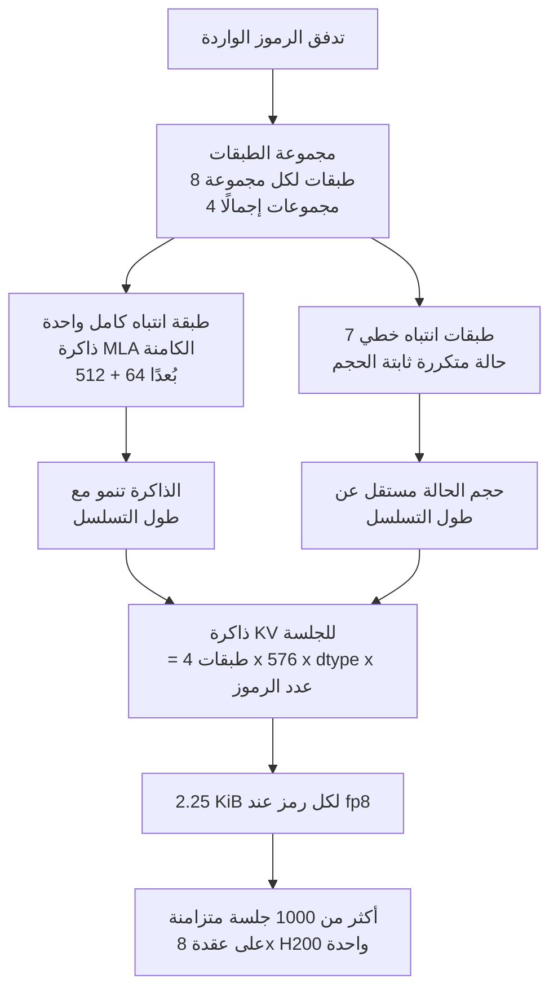

*تجسيد لبنية MoE التي تحتفظ بسعة هائلة بينما تنشّط جزءًا ضئيلًا منها لكل رمز.*

## لماذا يهمك هذا

كُتب هذا المقال لمهندسي البنية التحتية الذين عليهم أن يقرروا ما إذا كان نموذج مفتوح الأوزان أُعلن حديثًا يستحق مكانًا على عنقود GPU الخاص بالشركة، ولمشغّلي المنصات الذين عليهم تحديد عدد العقد المطلوبة. الخلاصة أولًا: لا يمكنك التخطيط لنشر Ling-3.0-flash اليوم لأنك لا تستطيع تنزيله، لكن إن قست الجيل السابق المنشور الآن فستتمكن من جدولته يوم فتح الأوزان دون مراجعة جديدة. وخلال ذلك القياس ظهر أمر يستحق المعرفة بذاته: معادلة ذاكرة KV التي تعتمد عليها معظم خطط السعة تبالغ في التقدير بمقدار 113 ضعفًا في عائلة النماذج هذه.

## نظرة عامة

في 23 يوليو أعلنت inclusionAI التابعة لمجموعة Ant عن Ling-3.0-flash. وهو نموذج Mixture-of-Experts بإجمالي 124 مليار معامل، ينشّط منها 5.1 مليار فقط لكل رمز. ويذكر الإعلان أنه بثُمن إجمالي المعاملات وواحد من اثني عشر من المعاملات النشطة يضاهي أو يتفوق على النموذج الرائد لدى الفريق نفسه بحجم تريليون معامل في معظم المقاييس المعروضة. كما يذكر دعم سياق أصلي بطول 256 ألف رمز مع مسار نحو مليون رمز.

مواصفات كهذه تلفت الانتباه فورًا لدى كل من يقيّم الخدمة المحلية. خمسة مليارات معامل نشط تعني ملف حوسبة بحجم نموذج صغير، وفي أحمال الوكلاء التي تستهلك رموزًا كثيرة يغيّر ذلك منحنى التكلفة بالكامل. أعلن فريق SGLang عن عمله على دعم يوم الإطلاق في اليوم نفسه، ونشر vLLM تهنئة. وقد حصل الجيل السابق، Ling-2.6-flash وLing-2.6-1T، على دعم vLLM يوم الإطلاق.

ثم حاولنا تنزيله فعليًا واصطدمنا بجدار. لا توجد أوزان.

## ما هو هذا النموذج فعليًا

تحققنا أولًا. عند استعلام واجهة HuggingFace عن كل النماذج تحت منظمة inclusionAI مرتبة حسب آخر تعديل، لم يظهر أي مستودع يبدأ بـ Ling-3.0. أحدث عنصر كان Ling-2.6-flash-base بتاريخ 22 يونيو. وطلب الملف `inclusionAI/Ling-3.0-flash/config.json` يعيد 401 دون مصادقة و404 مع رمز صالح. هذا المزيج يعني أن المستودع ليس خاصًا، بل غير موجود.

إذن صدر Ling-3.0-flash عبر تكاملات مزوّدي الاستدلال أولًا. يمكنك استدعاؤه مجانًا على OpenRouter حتى 3 أغسطس، لكن لا توجد بطاقة نموذج ولا تقرير تقني ولا نقطة تحقق قابلة للتنزيل. يصف الإعلان وكثير من التغطية هذا بأنه إصدار مفتوح الأوزان، غير أن الشيء الوحيد الممكن الآن هو استدعاء واجهة برمجية. وبالنسبة لتقييم محلي فهذا التمييز حاسم. إن كان إبقاء البيانات داخل نطاقك هو سبب النظر في النموذج، فالمتطلب لا يتحقق في وضعه الحالي.

غيّرنا المقاربة. قسنا Ling-2.6-flash الذي نشره الفريق نفسه ضمن عائلة البنية ذاتها، واعتبرنا النتيجة تحضيرًا ليوم فتح Ling-3.0-flash. الجيلان مختلفان فلا تنتقل الأرقام حرفيًا، لكن بنية الذاكرة المؤقتة وحساب العقد ينتقلان كما هما.

يكشف ملف config.json الخاص بـ Ling-2.6-flash بصمة العائلة بوضوح. نوع النموذج `bailing_hybrid`، وعدد الطبقات 32، وقيمة `layer_group_size` تساوي 8. أي أن ثماني طبقات تشكّل مجموعة واحدة، وداخل كل مجموعة تعمل طبقة واحدة فقط بانتباه كامل بينما تعمل السبع الباقية بانتباه خطي. من أصل 32 طبقة، أربع فقط بانتباه كامل. وهذه الأربع ليست تقليدية أيضًا. قيمة `kv_lora_rank` هي 512 و`qk_rope_head_dim` هي 64، وهو نمط MLA الذي يضغط المفاتيح والقيم في تمثيل كامن بدل تخزينها لكل رأس.

توجيه الخبراء صارم بالقدر نفسه. هناك 256 خبيرًا قابلًا للتوجيه ويُختار ثمانية لكل رمز، أي واحد من 32. وتشير الملخصات المنشورة إلى أن Ling-3.0-flash يرصّ طبقات KDA وMLA بنسبة 5 إلى 1 ويدفع ندرة الخبراء إلى واحد من 64 [تقديري]. يستند الرقمان إلى مصادر ثانوية لعدم وجود وثيقة أولية بعد. لكن الاتجاه واضح: طبقات انتباه كامل أقل وخبراء أكثر ندرة.



الأرقام في القسم التالي تبيّن سبب أهمية هذه البنية.

## التثبيت والتكامل

جرت التجربة على مرحلتين. أولًا معرفة نقاط التحقق الموجودة فعلًا، ثم قراءة أعداد البايتات والإعدادات الحقيقية للموجود منها. النصان البرمجيان محفوظان في المستودع ويعملان مع أي نموذج بتغيير اسم المستودع.

```bash
# 1) التحقق من مستودعات Ling المنشورة فعلًا
.venv/bin/python scripts/experiments/ling3-flash-serving/probe_repo.py

# 2) حساب الحجم الحقيقي وبنية الذاكرة لنقاط التحقق المنشورة
.venv/bin/python scripts/experiments/ling3-flash-serving/fetch_and_size.py
```

لا يضرب النص الثاني عدد المعاملات في عدد البايتات لكل معامل، بل يجمع الأحجام الفعلية لكل شظية safetensors عبر واجهة شجرة الملفات في HuggingFace. فنقاط التحقق المكمّمة تُبقي موترات مثل التضمينات والبوابات بدقة أعلى، ولذلك تنحرف التقديرات الحسابية عن الواقع باستمرار.

أما ذاكرة KV فيحسبها بمعادلتين جنبًا إلى جنب: معادلة GQA التي يلجأ إليها المشغّلون بحكم العادة، والمعادلة التي تتبعها هذه البنية فعليًا.

```python
# المعادلة المعتادة: تفترض أن كل طبقة تخزّن K وV كاملين لكل رأس
naive = 2 * layers * kv_heads * head_dim * bytes_per_element

# البنية الحقيقية: طبقات الانتباه الكامل وحدها تخزّن، وبإسقاط كامن فقط
mla = full_attention_layers * (kv_lora_rank + qk_rope_head_dim) * bytes_per_element
```

وعند تنزيل الأوزان فعليًا لا نتصل بـ HuggingFace مباشرة. فمنفذ الخروج الخارجي في عنقودنا بطيء إلى حد أن عشرات الغيغابايتات تستغرق ساعات. نتحقق أولًا من السجل المهيأ داخليًا ولا نجلب من الخارج إلا عند غياب النموذج، ثم نضيفه إلى السجل.

```bash
python3 scripts/skills/model_registry.py --from-secret tkai-stage <ns> ls
python3 scripts/skills/model_registry.py pull inclusionAI/Ling-2.6-flash /work/models/ling-2.6-flash
```

## النتائج المقيسة

كل رقم أدناه مأخوذ مباشرة من سجل التشغيل في `outputs/blog-impl/ling-3-0-flash-moe-serving/run-5.log`، والرسم البياني مُولّد بتحليل السجل نفسه.


*يسارًا: بايتات safetensors الحقيقية لكل نقطة تحقق منشورة. يمينًا: ذاكرة KV لكل جلسة وفق المعادلة المعتادة مقابل البنية الفعلية.*

نبدأ بالأوزان. النسخة الأصلية bf16 تبلغ 200.2 غيبي بايت موزعة على 27 شظية. ونسخة fp8 تبلغ 101.5 غيبي بايت، ونسخة int4 تبلغ 60.4 غيبي بايت على 26 شظية. عند int4 تدخل الأوزان داخل 141 غيبي بايت لبطاقة H200 واحدة، لكن ذاكرة KV والتنشيطات يجب أن تسكن هناك أيضًا، ولذلك لا ننصح بتكوين ببطاقة واحدة.

المثير هو ذاكرة KV. تعطي المعادلة المعتادة 512 كيبي بايت لكل رمز، بافتراض أن الطبقات الاثنتين والثلاثين جميعها تخزّن 32 رأس KV بـ128 بُعدًا. في الواقع أربع طبقات فقط تخزّن شيئًا، وهي تخزّن تمثيلًا كامنًا بـ576 بُعدًا. القيمة الحقيقية 4.5 كيبي بايت لكل رمز، أي بفارق 113.8 ضعفًا.

على مستوى الجلسة تكون الفجوة أشد. بذاكرة fp8 تكلّف جلسة واحدة بسياق 128 ألف رمز 32 غيبي بايت وفق المعادلة المعتادة و0.295 غيبي بايت وفق البنية الحقيقية. وتحتفظ طبقات الانتباه الخطي الثماني والعشرون بحالة ثابتة تُقدّر بنحو 14 ميبي بايت لكل جلسة، اشتُقت من عدد الرؤوس وبُعد الرأس لأن الإعدادات لا تذكرها صراحة [تقديري]. وهذا الجزء لا ينمو مع طول السياق.

وعلى مستوى العقدة ينقلب الاستنتاج. تحتوي عقدة بثماني بطاقات H200 على 1128 غيبي بايت من HBM، وبحجز عشرة بالمئة للتنشيطات والتجزئة يتبقى 954.8 غيبي بايت بعد أوزان int4. وفق المعادلة المعتادة لا تستوعب تلك العقدة خمس عشرة جلسة بسياق 256 ألف رمز. ووفق البنية الحقيقية تستوعب 1657 جلسة.

المقصود ليس الرقم 1657 بذاته، بل أن عنق الزجاجة ينتقل. إن وثقت بالمعادلة المعتادة بدا النموذج مقيدًا بالذاكرة، وهو ما يقود إلى شراء عقد إضافية أو تقصير السياق. في الواقع الذاكرة مريحة والقيد ينتقل إلى الحوسبة والجدولة. معادلة خاطئة واحدة قادرة على إعادة كتابة قرار شراء بأكمله.

يلزم تحفّظ واحد هنا. عمود 256 ألف رمز يتجاوز النافذة الأصلية لـ Ling-2.6-flash البالغة 131072 رمزًا. فهو يسقط هدف 256 ألف الذي أعلنه Ling-3.0-flash على هندسة الجيل السابق، ويجب إعادة قياسه حين تتوفر نقطة تحقق حقيقية للإصدار 3.0. ما نحتفظ به ليس الأرقام بل الطريقة.

## ماذا يعني هذا لـ ThakiCloud

تجدول منصة ai-platform لدى ThakiCloud وحدات GPU عبر Kueue على Kubernetes وتخدم النماذج عبر vLLM. وحين يطلب عميل نموذجًا مفتوح الأوزان جديدًا فالسؤال الأول الذي علينا الإجابة عنه ليس مدى جودته بل كم بطاقة يحتاج. أحكم هذا القياس تلك الإجراءات بخطوة واحدة: بدل الإجابة بعملية ضرب انطلاقًا من عدد المعاملات في بطاقة النموذج، تُقرأ بنية الانتباه في config.json أولًا ثم تُختار معادلة الذاكرة. والنماذج التي تمزج MLA بالانتباه الخطي تزداد شيوعًا، لذا ستتكرر هذه الفجوة.

في البيئات متعددة المستأجرين تتحول الفجوة مباشرة إلى تكلفة وحدة. فحين يتغير عدد الجلسات المتزامنة لكل عقدة بمرتبتين عشريتين تتغير معه سياسة الحصص لكل مستأجر ونموذج الفوترة. وهنا أيضًا نتنافس في النشر المحلي والسيادي. فالقدرة على الإجابة بالقياس عن عدد المستخدمين الذين تستوعبهم عتادٌ محدد تختصر مدة التقييم.

أما في أحمال الوكلاء فتنطبق عدسة Paxis. وPaxis هو مستوى التحكم Agent-Native Cloud لدى ThakiCloud ويعمل فوق ai-platform، ويتعامل مع المهارات والأدوات والسياسات كموارد من الدرجة الأولى. يستهلك الوكلاء رموزًا أكثر بكثير عبر سياقات أطول بكثير مما يفعل البشر. ونموذج بمعاملات نشطة قليلة وذاكرة سياق طويل رخيصة يغيّر اقتصاديات الوكلاء مباشرة. فحين تنخفض تكلفة الرمز تصبح تركيبات المهارات التي كانت باهظة قابلة للتشغيل الدائم. الخدمة الرخيصة شرط مسبق لوكلاء لا يتوقفون.

لكن توصيتنا للعملاء في هذه المرحلة قاطعة. Ling-3.0-flash ليس مرشحًا للنشر المحلي بعد. فحتى تُفتح الأوزان يبقى تقييمًا عبر واجهة برمجية، وللعملاء المقيدين بإقامة البيانات لا ننصح حتى بذلك.

## الحدود والاعتراضات

هذه الأرقام ليست قياسات أداء. لا شيء هنا يقيس الإنتاجية أو زمن الاستجابة على نموذج قيد التشغيل، بل هي حسابات سعة مشتقة من أحجام ملفات وإعدادات منشورة. تضيف الخدمة الحقيقية تجزئة داخلية من التخصيص بالصفحات، ومخازن CUDA graph، وذاكرة تنشيط مرحلة التعبئة المسبقة، وكلها تخفض عدد الجلسات المتزامنة دون القيمة المحسوبة. يُستحسن اعتبار 1657 قريبًا من حد أعلى.

وحجم حالة الانتباه الخطي مشتق أيضًا. حسبناه من عدد الرؤوس وبُعد الرأس، لكن التنفيذ قد يحتفظ بالحالة بشكل مختلف فيتغير الثابت لكل جلسة. وتتقلص حصة هذا الحد من الإجمالي كلما طال السياق، فيبقى استنتاج السياق الطويل صحيحًا على الحالين.

ومعظم التفاصيل المعمارية عن Ling-3.0-flash نفسه مصادر ثانوية. فنسبة 5 إلى 1 بين KDA وMLA وندرة الخبراء بواحد من 64 تحتاج تأكيدًا عند صدور تقرير تقني. أما ادعاءات الأداء فمنشورة من المزوّد وغير محققة بشكل مستقل.

ويستحق اعتراض واحد إجابة مباشرة. قد يبدو حساب حجم نموذج لا يمكنك تنزيله جهدًا ضائعًا، وقد يتأخر الإصدار أشهرًا أو لا يحدث أبدًا. لكن ناتج هذا العمل غير مرتبط بنموذج واحد. تعمل النصوص البرمجية مع أي مستودع بتغيير اسم، وعادة قراءة بنية الانتباه قبل تقدير الذاكرة صالحة في كل مكان.

## الخلاصة

أُعلن Ling-3.0-flash لكن لا يمكن تنزيله. تحققنا مباشرة من عدم وجود أي مستودع على HuggingFace، والمسار الوحيد المتاح اليوم هو استدعاء واجهة برمجية. وإن كنت تقيّم النشر المحلي فهذه الحقيقة هي معيار القرار الأول.

لذلك قسنا الجيل السابق بدلًا منه. بلغت الأوزان 200.2 غيبي بايت عند bf16، و101.5 عند fp8، و60.4 عند int4، وبالغت معادلة KV المعتادة في التقدير بمقدار 113.8 ضعفًا. وبالحساب وفق البنية الحقيقية تستوعب عقدة واحدة بثماني بطاقات H200 جلسات بسياق 256 ألف رمز بالآلاف. عنق الزجاجة في الحوسبة لا في الذاكرة.

خذ أمرين إلى تقييمك القادم لنموذج مفتوح الأوزان. أولًا، تحقق عبر الواجهة البرمجية من أن الأوزان منشورة فعلًا، فالإعلانات وحالة الإصدار قد تفترقان. ثانيًا، اقرأ بنية الانتباه في config.json قبل أي حساب للحجم. فحين يدخل MLA أو الانتباه الخطي في التركيبة تخطئ المعادلة المألوفة بمرتبتين عشريتين.

## المصادر

- Ant Ling، [إعلان Ling-3.0-flash](https://x.com/AntLingAGI/status/2080351022028095681)
- SGLang، [إشعار دعم يوم الإطلاق لـ Ling-3.0-flash](https://x.com/sgl_project/status/2080372971219415458)
- inclusionAI، [بطاقة نموذج Ling-2.6-flash](https://huggingface.co/inclusionAI/Ling-2.6-flash)
- inclusionAI، [نقطة تحقق Ling-2.6-flash-int4](https://huggingface.co/inclusionAI/Ling-2.6-flash-int4)
- OpenRouter، [توفر Ling-3.0-flash](https://openrouter.ai/inclusionai/ling-3.0-flash)
