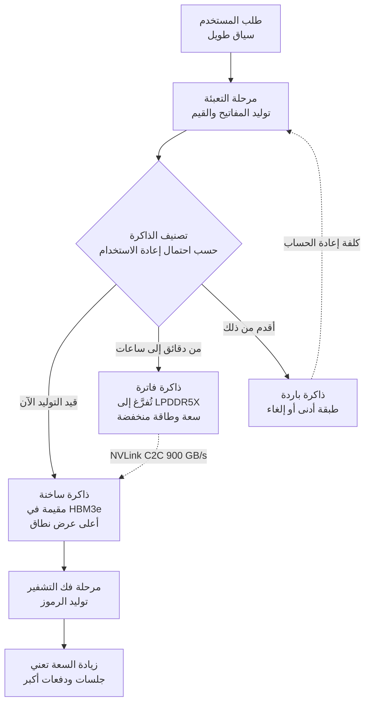

*تجسيد للبنية التي تقوم عليها هذه الورقة: نواة HBM ضيقة وساخنة وطبقات LPDDR واسعة وباردة.*

## لماذا يهمك هذا

كُتب هذا المقال لمهندسي البنية التحتية الذين عليهم تشغيل خدمة طويلة السياق محليًا دون أن يحسموا عدد بطاقات GPU المطلوبة، ولمشغّلي المنصات الذين عليهم تفسير سبب تضخم بند الذاكرة في عرض السعر. الخلاصة أولًا: عنق الزجاجة في الاستدلال طويل السياق ليس المساحة التي يُحمَّل فيها النموذج، بل المساحة التي تُحفظ فيها ذاكرة KV التي راكمتها المحادثة، وبمجرد نقل هذه الذاكرة إلى ذاكرة منخفضة الطاقة خارج وحدة المعالجة الرسومية يتغير عدد المستخدمين المتزامنين الذين تحتملهم البطاقة نفسها. نشرت Micron ورقة تقيس هذا الفرق، وقد أعدنا نحن الحساب الذي يقوم عليه افتراضها.

## نظرة عامة

في أواخر يوليو انتشر على المنصات خبر مفاده أن Micron وMeta نشرتا ورقة مشتركة. وعند التحقق تبيّن أن الأمر مساران. الأول ورقة نشرتها Micron وحدها بعنوان [LPDDR at Scale: Enabling Efficient LLM Inference Through High-Capacity Memory](https://www.micron.com/content/dam/micron/global/public/products/memory/mobile-dram/lpddr5/documents/lpddr-at-scale-llm-inference-white-paper.pdf). والثاني عمل مشترك جلس فيه مهندسو الشركتين جنبًا إلى جنب لتشغيل LPDDR على أحمال فرط النطاق باستخدام DCPerf، حزمة القياس مفتوحة المصدر من Meta. الورقة الأولى هي المتاحة كاملة اليوم، ومنها جاءت معظم أرقام هذا المقال.

عند قراءتها تصادف جملة يصعب تجاوزها بوصفها دعاية مورّد. تنص على أن المحرك المهيمن للطلب على الذاكرة في الاستدلال ليس عدد معاملات النموذج بل نمو ذاكرة KV. فمع امتداد السياق إلى مئات الآلاف من الرموز ترتفع متطلبات الذاكرة إلى مئات الغيغابايتات أو التيرابايتات وتتجاوز تكوينات ذاكرة النظام التقليدية. وهذا ادعاء بأن تخطيط السعة يتغير من جذوره، وحين أجرينا الحساب لم يكن الادعاء مبالغة.

ثمة سبب يجعل الموضوع أشد إلحاحًا في كوريا. فمعظم الفرق التي تشغّل عناقيد GPU خاصة بها تعاني ضيق عدد البطاقات، بينما تتوالى طلبات تمديد السياق. وإذا أمكن حل المشكلة نفسها بتوسيع الذاكرة المجاورة للبطاقة بدل شراء بطاقات إضافية فإن شكل عرض السعر نفسه يتغير.

## ما هذه التقنية

ذاكرة KV آلية تحفظ مفاتيح الانتباه وقيمه المحسوبة سلفًا لإعادة استخدامها. وبدونها يلزم إعادة حساب المفاتيح والقيم لكل الرموز السابقة عند توليد كل رمز جديد، ولذلك تستخدمها عمليًا كل محركات الخدمة. المشكلة أن هذه الذاكرة تكبر بتناسب مباشر مع طول التسلسل وعدد الطلبات المتزامنة. فأوزان النموذج ثابتة الحجم بعد تحميلها، أما الذاكرة المؤقتة فتتضخم كلما واصل المستخدمون محادثاتهم.

تصنّف الورقة هذه الذاكرة إلى ثلاث درجات بحسب احتمال إعادة الاستخدام. مجموعة العمل النشطة للجلسة الجارية هي الذاكرة الساخنة وتبقى في HBM حيث عرض النطاق أعلى ما يكون. أما ما أُنشئ قبل دقائق أو ساعات فيُعد فاترًا ويُنقل إلى LPDDR5X. وما هو أقدم من ذلك يُعد باردًا فيُنقل إلى طبقة أدنى أو يُلغى. وعلى جانب البرمجيات تفعل طبقات مثل LMCache الشيء نفسه حين تدفع الذاكرة من ذاكرة GPU إلى ذاكرة CPU ثم إلى SSD. والفرق أن Micron ثبّتت هذه الدرجة الثانية في مواصفة عتادية ووسّعت سعتها.

التكوين العتادي لافت أيضًا. منصة الاختبار هي NVIDIA GH200 Grace Hopper Superchip. فذاكرة LPDDR5X متصلة بمعالج Grace وذاكرة HBM3e متصلة بمعالج Hopper الرسومي، ويربط بينهما NVLink C2C مع اتساق ذاكرة مؤقتة. وفي هذا الترتيب يستطيع إطار العمل التعامل مع LPDDR بوصفها امتدادًا لذاكرة GPU. تستخدم الورقة تكوينًا برقاقة واحدة وتكوينًا برقاقتين تحمل كل منهما 512 غيغابايت من LPDDR5X لمحاكاة تيرابايت واحد، ثم تسقط من ذلك على 1.5 تيرابايت لكل معالج باستخدام ثماني وحدات LPDDR5X SOCAMM2 سعة 192 غيغابايت. والنموذج هو Llama 3 70B بدقة FP16 عبر TensorRT-LLM وvLLM.

## تحققنا من الأرقام بأنفسنا

لاختبار صحة افتراض الورقة يكون إجراء الحساب أسرع من قراءة رسم بياني لغيرك. يستخدم Llama 3 70B في إعداده المنشور 80 طبقة و8 رؤوس KV وبعد رأس يساوي 128. وبحفظ المفاتيح والقيم معًا بدقة FP16 يشغل الرمز الواحد 2 × 80 × 8 × 128 × 2 بايت، أي 320 كيبيبايت. ويكفي ضرب هذا في طول السياق للحصول على حجم الجلسة الواحدة.

*حجم ذاكرة KV لجلسة واحدة مقابل خطوط سعة الطبقات. عند 500 ألف رمز يتجاوز الحجم بكثير سعة HBM في بطاقة H100 واحدة.*

والنتيجة كالتالي. عند سياق 8 آلاف رمز تبلغ الجلسة 2.7 غيغابايت وهو حجم خفيف. وعند 128 ألفًا تصبح 42.9 غيغابايت، وعند 500 ألف رمز وهو السياق الذي استخدمته الورقة لاختبار الزمن الحقيقي تطلب الجلسة الواحدة 163.8 غيغابايت. وعند مليون رمز تبلغ 327.7 غيغابايت. وبوضع ذلك بجانب 141.2 غيغابايت هي حجم أوزان النموذج نفسه بدقة FP16 يتأكد ادعاء الورقة حرفيًا. فعند سياق 500 ألف رمز تكون ذاكرة مستخدم واحد أكبر من النموذج كله.

هنا تُقرأ من جديد حقيقة أن بطاقة H100 في منصة الاختبار تحمل 96 غيغابايت من HBM3. فهذه البطاقة لا تستوعب حتى أوزان Llama 3 70B بدقة FP16 وحدها. ومن دون ضم ذاكرة LPDDR في جانب Grace بوصفها ذاكرة موحدة لا تقوم التجربة أصلًا. وبحسابنا، بافتراض تخصيص كل ما يتبقى بعد الأوزان للذاكرة المؤقتة، يستوعب تكوين 512 غيغابايت جلستين بسياق 500 ألف رمز بينما يستوعب تكوين 1.5 تيرابايت ثماني جلسات. وبخفض السياق إلى 128 ألفًا يصبح العددان ثماني وإحدى وثلاثين جلسة. ويتجاهل هذا الحساب حمل إطار العمل وذاكرة التنشيط، لذا يجب اعتباره حدًا أعلى وتخطيط الدفعات دونه.

## ما الذي قاسته Micron

تعرض الورقة نتيجتين رئيسيتين. ففي الاستدلال الفوري طويل السياق أدى رفع سعة LPDRAM لكل معالج من 512 غيغابايت إلى 1.5 تيرابايت إلى خفض زمن أول رمز بنسبة تصل إلى 98 بالمئة. وجرى القياس على Llama 3 70B بدقة FP16 وسياق 500 ألف رمز، وتذكر الورقة أن هذا التحسن مكّن نظامًا واحدًا من خدمة 16 مستخدمًا كحد أقصى. أما في الاستدلال الدفعي غير الفوري، مثل تفريغ تسجيلات الاجتماعات دفعة واحدة، فقد ضاعفت الزيادة نفسها حجم الدفعة المعرّف بعدد الطلبات المتزامنة. والتفسير المرفق أن التكوينات الضيقة السعة تضطر إلى إعادة حساب المفاتيح والقيم مرارًا فتتباطأ معالجة الطلبات.

يبدو رقم 98 بالمئة ضخمًا لكن الآلية بسيطة. فحين لا يوجد مكان لحفظ الذاكرة تحدث إعادة الحساب، وإعادة الحساب تعني إعادة مرحلة التعبئة كاملة وهو ما ينعكس مباشرة على زمن أول رمز. وبتوفير المساحة يختفي هذا العمل. والأدق قراءته على أنه إزالة هدر لا تحسين أداء.

أما النتيجة الثانية فترد في الموجز التقني السابق [The role of low-power (LP) memory in data center workloads](https://assets.micron.com/adobe/assets/urn:aaid:aem:5a10a15d-ae6c-40f9-8fc2-e522e7c6749f/renditions/original/as/lp-in-data-center-technical-brief.pdf). قارنت Micron نظام GH200 بذاكرة LPDDR5X بخادم x86 بذاكرة DDR5 من جيل 2022 إلى 2023. وفي حالة القراءة والكتابة المختلطة في اختبار multichase حقق LPDDR5X سرعة 293 غيغابايت في الثانية مقابل 215 لدى DDR5، أي فارق 36 بالمئة. وانخفضت طاقة الذاكرة بنسبة تصل إلى 77 بالمئة حسب الظروف. وعلى Llama 3 8B كان الأداء لكل واط أفضل بنسبة 10 بالمئة، وعلى 70B تذكر الورقة إنتاجية أعلى بأكثر من خمسة أضعاف وزمن استجابة أقل بنحو 80 بالمئة واستهلاك طاقة أقل بنسبة 73 بالمئة.

والتحفظ الذي تضيفه Micron بنفسها مهم هنا. فهي تنص على أن مضاعفة الإنتاجية خمس مرات على نموذج 70B ليست أثر نوع الذاكرة وحده بل نتيجة اجتماع معالج Grace والذاكرة منخفضة الطاقة وNVLink. فالنظامان يختلفان في معمارية المعالج، ويختلف ربط GPU بين NVLink C2C بسرعة 900 غيغابايت في الثانية في الاتجاهين وPCIe بسرعة 128 غيغابايت في الثانية. وبما أن التجربة تنقل ذاكرة KV عبر وصلة يفصل بينها فارق سبعة أضعاف فإن الاستشهاد بالنتيجة كمقارنة خالصة بين LPDDR وDDR5 يكون خطأ.

## الجزء الذي جرى التحقق منه مع Meta

للعمل المشترك بين Micron وMeta طابع مختلف. فبحسب العرض الذي كتبه خيام أنجم من فريق هندسة أحمال مراكز البيانات في Micron، استخدم مهندسو الشركتين معًا [DCPerf](https://engineering.fb.com/2024/08/05/data-center-engineering/dcperf-open-source-benchmark-suite-for-hyperscale-compute-applications/)، وهي حزمة القياس مفتوحة المصدر من Meta، لقياس سلوك LPDDR على أحمال فرط النطاق الحقيقية. وقد بُنيت DCPerf بالرجوع إلى تطبيقات كبيرة في أسطول خوادم Meta الإنتاجي، وصُممت لتحاكي خصائص الطاقة والتردد في تطبيقات مراكز البيانات بدقة تفوق الأحمال الاصطناعية.

أهمية هذا المزيج أنه يفصل جهة التحقق. فحين يقيس مورّد ذاكرة منتجه بمقياسه الخاص لا يصدقه أحد. أما حين يقيسه مشغّل يدير واحدًا من أكبر الأساطيل في العالم بأداة مبنية على أحماله الفعلية ومنشورة للعموم فإن طبيعة النتيجة تختلف. غير أننا لم نحصل على وثيقة هذا العمل المشترك كاملة حتى لحظة كتابة هذا المقال. اكتفينا بالتحقق من نص العرض على صفحات منتجات Micron ومن توثيق DCPerf نفسه، ولم نستشهد بأي رقم منفرد منه. وحين تُنشر الوثيقة سنتناول أرقامها في مقال منفصل.

## ماذا يعني ذلك لـ ThakiCloud

تشغّل منصة ai-platform من ThakiCloud موارد GPU للعملاء فوق Kubernetes وتدير الخدمة عبر vLLM. وبترجمة الورقة إلى لغتنا التشغيلية تبقى ثلاث نقاط.

أولًا، يجب تغيير معادلة حساب السعة. فتحديد عدد العقد بناءً على ما إذا كان النموذج يُحمَّل على GPU سيخطئ حتمًا في الخدمات طويلة السياق. وكما يبيّن الحساب أعلاه فإن جلسة واحدة عند سياق 500 ألف رمز تطلب ذاكرة أكبر من الأوزان، لذا يُستحسن تثبيت عدد الجلسات المتزامنة المستهدف وطول السياق المستهدف أولًا ثم اشتقاق الذاكرة اللازمة عكسيًا. وهو التمرين نفسه الذي تناولناه مؤخرًا في [حساب ذاكرة KV لنماذج MoE](/tech-blog/ar/llmops/ling-3-0-flash-moe-serving/)، وتخطيه يعني تكرار تقليص حجم الدفعة يوم النشر.

ثانيًا، يمكن السير في الاتجاه نفسه دون تغيير العتاد. فحتى بغياب GH200 يمكن اليوم تطبيق التدرج الذي يدفع ذاكرة KV من ذاكرة GPU إلى ذاكرة CPU ثم إلى NVMe عبر تكوينات من فئة LMCache. وهو محاكاة برمجية للدرجة الثانية التي وسّعتها Micron عتاديًا، مع ملاحظة أن نافذة تفوّق التفريغ على إعادة الحساب تضيق حين يكون عرض نطاق الوصلة في مستوى PCIe. ويبقى قياس نقطة التقاطع لكل حمل عمل هو الواجب المتبقي في التشغيل الفعلي.

ثالثًا، تدخل الطاقة في عرض السعر. فبالنسبة للعملاء الذين يدرسون النشر المحلي والسيادي غالبًا ما تحسم طاقة الرف والتبريد إمكانية التبني من عدمها. ووجود خيار يخفض طاقة نظام الذاكرة الفرعي بدرجة كبيرة يعني إنتاج رموز أكثر ضمن ميزانية الطاقة نفسها، وهو ما يتصل مباشرة بمنطق التكلفة الإجمالية للملكية الذي نؤكد عليه في عروضنا.

أما في أحمال الوكلاء فالتركيز يختلف. فمنصة Paxis من ThakiCloud هي سحابة أصلية للوكلاء تتعامل مع المهارات والأدوات والسياسات وسجلات التدقيق بوصفها موارد من الدرجة الأولى، والوكلاء يشغّلون سياقات أطول بكثير ويعيدون استخدامها أكثر بكثير من البشر. فهم يعيدون قراءة موجه النظام نفسه وحزمة المستندات نفسها مئات المرات، ما يرفع معدل إعادة استخدام ذاكرة KV لديهم فوق معدل المحادثة البشرية. ولهذا ينعكس توسيع مساحة حفظ الذاكرة مباشرة على اقتصاديات الوكلاء، وتخفض خيارات البنية التحتية التي تقلل كلفة الخدمة سعر الوحدة لمنصة الوكلاء العاملة فوقها.

## الحدود والاعتراضات

أكبر حد هو طبيعة المصدر. فهذه الورقة صادرة عن شركة تبيع LPDDR، وخادم x86 بذاكرة DDR5 المختار للمقارنة من جيل 2022 إلى 2023. وما إذا كان الفارق نفسه سيظهر أمام منصة x86 حديثة أو تكوين MRDIMM أمر لا تجيب عنه هذه الوثيقة. كما أن التكرار المستقل من طرف ثالث غير متاح بعد.

ثانيًا، أرقام مثل 98 بالمئة وخمسة أضعاف هي قيم أفضل الحالات. فنسبة 98 بالمئة ناتجة عن إزالة إعادة حساب كانت تحدث بسبب ضيق السعة عند طول متطرف يبلغ 500 ألف رمز، والفائدة تتقلص كلما قصر السياق. وخمسة أضعاف، كما ذُكر، مقارنة تغيّر فيها المعالج والوصلة أيضًا.

ثالثًا، التفريغ ليس مجانيًا. فالذاكرة المحفوظة خارج GPU يجب سحبها عند الحاجة، وثمة دائمًا نقطة يتجاوز فيها زمن النقل زمن إعادة الحساب. وكلما انخفض عرض نطاق الوصلة جاءت نقطة التقاطع أبكر. ونقل استنتاج مبني على NVLink C2C إلى بيئة PCIe قد يجعل الأداء أبطأ بدل أن يحسنه.

وأخيرًا هناك مشكلة التوريد. فذاكرة LPDDR5X ملحومة على اللوحة، ما يصعّب التوسعة أو الاستبدال ميدانيًا. وتستهدف الصيغ المعيارية مثل SOCAMM2 هذه المشكلة تحديدًا، لكنها صيغة جديدة ومسارات توريدها وصيانتها ليست مألوفة بقدر وحدات RDIMM التقليدية.

## الخلاصة

مسألة السعة في الاستدلال طويل السياق ليست أين نضع النموذج بل أين نضع الذاكرة التي راكمتها المحادثة. ويبيّن الحساب ذلك بوضوح: بتشغيل Llama 3 70B بدقة FP16 يطلب الرمز الواحد 320 كيبيبايت، وعند سياق 500 ألف رمز تشغل الجلسة الواحدة 163.8 غيغابايت وهو ما يفوق حجم الأوزان نفسها. وقد وسّعت Micron هذه المساحة بذاكرة منخفضة الطاقة وأبلغت عن خفض زمن أول رمز بنسبة تصل إلى 98 بالمئة ومضاعفة حجم الدفعة، مع إرفاق معالج Grace وNVLink بوصفهما شرطين للنتيجة.

المهمة الفورية واضحة. ثبّت السياق المستهدف وعدد الجلسات المتزامنة المستهدف في تكوين الخدمة الذي تشغّله اليوم ثم احسب حجم ذاكرة KV. فإن تجاوز الرقم سعة ذاكرة GPU فإن تدرج الذاكرة يستحق الدراسة قبل شراء بطاقات إضافية. أما تغيير جيل العتاد فقرار يمكن تأجيله إلى ما بعد ذلك.

## المصادر

- [LPDDR at Scale: Enabling Efficient LLM Inference Through High-Capacity Memory](https://www.micron.com/content/dam/micron/global/public/products/memory/mobile-dram/lpddr5/documents/lpddr-at-scale-llm-inference-white-paper.pdf)، ورقة بيضاء من Micron، فبراير 2026
- [The role of low-power (LP) memory in data center workloads](https://assets.micron.com/adobe/assets/urn:aaid:aem:5a10a15d-ae6c-40f9-8fc2-e522e7c6749f/renditions/original/as/lp-in-data-center-technical-brief.pdf)، موجز تقني من Micron
- [Every watt matters: How low-power memory is transforming data centers](https://www.micron.com/about/blog/applications/data-center/every-watt-matters-how-low-power-memory-is-transforming-data-centers)، مدونة Micron
- [DCPerf: An open source benchmark suite for hyperscale compute applications](https://engineering.fb.com/2024/08/05/data-center-engineering/dcperf-open-source-benchmark-suite-for-hyperscale-compute-applications/)، Engineering at Meta
- سكربت حساب حجم ذاكرة KV: `scripts/blog/kv_cache_calc.py` استنادًا إلى الإعداد المنشور لنموذج Llama 3 70B
