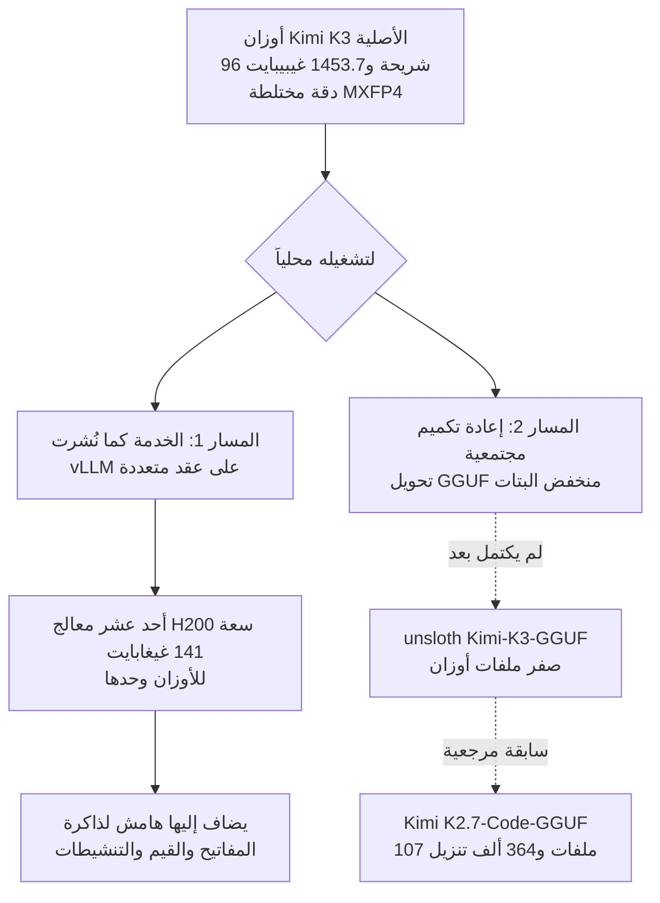

حين يصدر نموذج مفتوح الأوزان، تظهر عادة خلال نصف يوم منشورات عن تشغيله محلياً. أما Kimi K3 فحالة مختلفة. جمعنا كل ملفات الأوزان المنشورة عبر واجهة HuggingFace البرمجية فبلغ المجموع 1,453.7 غيبيبايت موزعة على 96 شريحة. هذا يتطلب أحد عشر معالج H200 سعة 141 غيغابايت لحفظ الأوزان وحدها، ولا يشمل الرقم ذاكرة المفاتيح والقيم ولا التنشيطات.


## لماذا يعنيك هذا

هذا المقال موجّه إلى مسؤولي البنية التحتية الذين يقررون إدخال نموذج مفتوح الأوزان إلى المؤسسة، وإلى مهندسي المنصات الذين يضعون ميزانيات المعالجات الرسومية. فائدته أقل لمقارنة درجات القياس، وأكبر إن أردت الأرقام الكامنة خلف خدمة أوزان منشورة فعلياً. الخلاصة أولاً: بين عبارة "صدر نموذج مفتوح الأوزان من الطراز الأمامي" وعبارة "يمكننا تشغيله هنا" توجد اليوم فجوة بعرض أحد عشر معالجاً، ومن يسدّ هذه الفجوة ليس صانعو النموذج بل مجتمع التكميم ومنظومة الخدمة. لذلك ما يجب فحصه يوم الإصدار ليس بطاقة النموذج بل قائمة ملفات مستودع GGUF.

## نظرة عامة

أصدرت Moonshot AI نموذج Kimi K3. وفق بطاقة النموذج فهو نموذج مزيج خبراء بإجمالي 2.8 تريليون معامل و104 مليارات معامل نشط، متعدد الوسائط أصلاً، وبنافذة سياق تبلغ 1,000,000 رمز. وتقدّمه البطاقة بوصفه أول نموذج مفتوح من طراز 3 تريليونات في العالم.

سبب كتابة هذا المقال بسيط نوعاً ما. نشرت Unsloth، التي تبني أدوات التكميم، ملاحظة قصيرة تشكر فيها Moonshot وتقول إنها ستحاول جعله يعمل محلياً. عادةً تمرّ هذه المجاملة دون انتباه، لكننا هنا فضولنا انصبّ على حجم العمل الذي تشير إليه تلك الجملة الواحدة. فبدل الانطباع ذهبنا نتحقق من الأرقام.

وقت فحصنا كانت حال المستودعات الثلاثة كالآتي. المستودع الأصلي `moonshotai/Kimi-K3` لديه 6,064 إعجاباً و2,850 تنزيلاً، وآخر تعديل في 27 يوليو 2026. ونسخة Unsloth المرآة `unsloth/Kimi-K3` أُنشئت بعد ظهر اليوم نفسه وتحوي أوزاناً مطابقة. أما `unsloth/Kimi-K3-GGUF`، المنشأ في اليوم نفسه، فكان يحوي ملفين اثنين فقط: ملف README وملف gitattributes. ولم يُرفع فيه أي ملف أوزان بعد.

## ما هذا النموذج

نقلاً عن بطاقة النموذج وملف الإعداد المنشور مباشرة:

| البند | القيمة |
|---|---|
| إجمالي المعاملات | 2.8 تريليون |
| المعاملات النشطة | 104 مليارات |
| عدد الطبقات | 93 (منها طبقة كثيفة واحدة) |
| تركيب الانتباه | 69 KDA + 24 Gated MLA |
| الخبراء | 16 نشطاً من أصل 896 |
| البعد المخفي للانتباه | 7168 |
| رؤوس الانتباه | 96 |
| طول السياق | 1,048,576 رمزاً |
| حجم المفردات | 163,840 |
| صيغة الإصدار | MXFP4 compressed-tensors |

عدة أسماء معمارية جديدة هنا. إذ يقوم Kimi Delta Attention وAttention Residuals تحت إطار اسمه Stable LatentMoE يرفع التباعد، وتقول بطاقة النموذج إن هذا المزيج يحسّن كفاءة التوسع الإجمالية بنحو 2.5 ضعف مقارنة بـ K2. وهذا ادعاء من الصانعين، فيُستحسن التعامل معه بحذر إلى حين تحقق مستقل.

الجزء ذو الأثر التشغيلي المباشر هو صيغة الإصدار. فقسم التكميم في ملف الإعداد يبيّن صيغة `mxfp4-pack-quantized` بأربع بتات، وحجم مجموعة 32، وتكميماً متناظراً. لكن قائمة الاستثناءات طويلة. فالانتباه الذاتي، والخبراء المشتركون، وإسقاطات البوابة والصعود والهبوط في الشبكة الكثيفة، ورأس النموذج اللغوي، وبرج الرؤية، ومسقط الوسائط المتعددة، كلها مستثناة من التكميم بأربع بتات. أي أن هذا الإصدار ليس نموذجاً ضُغط بالكامل إلى أربع بتات، بل توزيع بدقة مختلطة تُضغط فيه أوزان الخبراء الموجَّهة وحدها إلى أربع بتات ويبقى الباقي بدقة أعلى.

وترتبط هذه الحقيقة بحساب الحجم مباشرة. فحفظ 2.8 تريليون معامل بأربع بتات خالصة سيتطلب نظرياً نحو 1.27 تيبيبايت. والذي قِسناه فعلياً هو 1,453.7 غيبيبايت، أي نحو 1.42 تيبيبايت. والفارق البالغ نحو 150 غيبيبايت هو ما تشغله الأجزاء غير المكمَّمة وموترات القياس. الأرقام تتوافق، لذا نطمئن إلى سلامة طريقة الحساب.



## الجلب والخدمة

تنزيل الأوزان بحد ذاته أمر اعتيادي.

```bash
# الأوزان الأصلية (تحتاج مساحة تتجاوز 1.4 تيبيبايت بوضوح)
hf download moonshotai/Kimi-K3 --local-dir ./Kimi-K3

# لفحص قائمة الملفات والحجم الإجمالي أولاً
curl -s "https://huggingface.co/api/models/moonshotai/Kimi-K3?blobs=true" \
  | python3 -c "import json,sys; d=json.load(sys.stdin); \
print(sum((s.get('lfs') or {}).get('size',0) for s in d['siblings'])/1024**3, 'GiB')"
```

الأمر الثاني هو ما استخدمناه. فبلا تنزيل 1.4 تيبيبايت يمكنك جمع أحجام كتل LFS التي تُبلغ عنها واجهة HuggingFace والحصول على حجم التوزيع الدقيق. ولأغراض تقدير السعة هذا أسرع بكثير، ويُظهر لك أيضاً كيف يتركب المستودع.

الخدمة لا تعمل على عقدة واحدة. فحتى مع 141 غيغابايت من الذاكرة عالية النطاق لكل H200، تحتاج الأوزان وحدها أحد عشر معالجاً، ما يوجب دمج التوازي الموتري والتوازي الأنبوبي عبر العقد.

```bash
# صيغة مفاهيمية. التخطيط المتوازي الفعلي وعدد العقد يعتمدان على عنقودك.
vllm serve moonshotai/Kimi-K3 \
  --tensor-parallel-size 8 \
  --pipeline-parallel-size 2 \
  --max-model-len 131072 \
  --trust-remote-code
```

قلّصنا طول السياق بدل فتح المليون رمز كاملة بسبب ذاكرة المفاتيح والقيم. ففي نموذج بـ 93 طبقة انتباه و96 رأساً، يكلّف فتح نافذة بمليون رمز ذاكرة كبيرة فوق الأوزان. وفي الإنتاج يكون أأمن أن تحدد الطول الأقصى الذي تحتاجه فعلاً ثم توازن الذاكرة على أساسه.

ومما يجب فحصه أيضاً الرخصة. فالجيل السابق `moonshotai/Kimi-K2.7-Code` كان يحمل رخصة MIT معدّلة. أما K3 فيصدر بشروط منفصلة اسمها رخصة Kimi K3. يبدأ النص بمنح شبيه برخصة MIT، لكن يتبعه شرطان. فإن كنت تشغّل نشاط نموذج كخدمة تتجاوز إيراداته عشرين مليون دولار أمريكي خلال أي اثني عشر شهراً متتالية، وجب عليك إبرام اتفاق منفصل مع Moonshot AI قبل أي استخدام تجاري. وإن استخدمته في منتج يتجاوز مئة مليون مستخدم نشط شهرياً أو عشرين مليون دولار من الإيراد الشهري، وجب إظهار اسم "Kimi K3" بوضوح في واجهة المستخدم. ولا ينطبق الشرطان على الاستخدام الداخلي، المعرَّف بأنه استخدام لا يتيح البرمجية أو مخرجاتها أو قدراتها لأطراف ثالثة. ومعظم الاعتماد الداخلي يقع هناك، لكن إن كنت تبيع الاستدلال للعملاء فاطلب مراجعة قانونية قبل الالتزام.

## ما الذي قِسناه

قِسنا بجمع كل أحجام كتل LFS لكل مستودع عبر واجهة نماذج HuggingFace، مقصورةً على امتدادات ملفات الأوزان. ولم نُنزّل شيئاً، فكانت كلفة الشبكة بضعة نداءات برمجية.


| المستودع | ملفات الأوزان | الحجم الإجمالي | التنزيلات |
|---|---:|---:|---:|
| moonshotai/Kimi-K3 | 96 | 1,453.7 GiB | 2,850 |
| unsloth/Kimi-K3 | 96 | 1,453.7 GiB | 0 |
| unsloth/Kimi-K3-GGUF | 0 | 0 GiB | 0 |
| moonshotai/Kimi-K2.7-Code | 64 | 554.3 GiB | 695,744 |
| unsloth/Kimi-K2.7-Code-GGUF | 107 | 4,007.1 GiB | 364,041 |

ثلاثة أمور تبرز في هذا الجدول.

الأول أن القفزة بين الجيلين كبيرة. فقد كان K2.7-Code بحجم 554.3 غيبيبايت وصار K3 بحجم 1,453.7 غيبيبايت، أي بمعامل 2.6. والفريق المجهّز للجيل السابق لا يستطيع استيعاب هذا الجيل بالعتاد نفسه.

لكن لا تُدخل هذه النسبة مباشرة في الميزانية. فزيادة الحجم 2.6 ضعف لا تعني عدد معالجات أكبر بـ 2.6 ضعف بالضبط، لأن تجاوز حدود العقدة يضيف كلفة اتصال بنداً مستقلاً. والتكوين الذي تحله ثماني بطاقات في عقدة واحدة يختلف تشغيلياً عن التكوين الذي يوجب عقدتين أو أكثر.

الثاني أن النسخ المرآة والتكميم عملان مختلفان تماماً. فقد نسخت Unsloth الحجم المطابق 1,453.7 غيبيبايت يوم الإصدار، بينما لم يحتوِ مستودع GGUF المنشأ في اليوم نفسه على أي ملف أوزان. فنسخ الملفات مسألة نطاق ترددي، وإعادة الضغط إلى بتات أقل عملية منفصلة تحتاج معايرة وتحققاً.

الثالث أن الجيل السابق يُظهر شكل الأنبوب المكتمل. إذ يحوي `unsloth/Kimi-K2.7-Code-GGUF` عدد 107 ملفات بمجموع 4,007.1 غيبيبايت. وهو يتجاوز الأصل لأن المستودع الواحد يحمل تحويلات بعدة مستويات بتات لا نموذجاً واحداً. وتبلغ التنزيلات التراكمية 364,041، أي أكثر من نصف تنزيلات الأصل. فما يجلبه الناس فعلاً هو النسخة المعاد تكميمها لا الأصل.

وحسبنا كذلك التحويل إلى معالجات. فـ 1,453.7 غيبيبايت تعادل نحو 1,560 غيغابايت، فحفظ الأوزان وحدها يتطلب أحد عشر معالج H200 سعة 141 غيغابايت، أو عشرين معالج H100 سعة 80 غيغابايت، أو تسعة وأربعين معالج RTX 5090 سعة 32 غيغابايت. ونكرر أن ذلك يستثني ذاكرة المفاتيح والقيم والتنشيطات وهامش التفتت. وتكوينات الخدمة الحقيقية تنمو من هناك.

وثمة سوء قراءة شائع يجدر تفاديه هنا. فكون 104 مليارات معامل نشطة لا يخفض متطلب الذاكرة إلى 104 مليارات. فمزيج الخبراء يحسب بـ 16 خبيراً فقط من أصل 896 لكل رمز، لكن أي الخبراء سيُختار لا يُعرف قبل وصول الرمز، لذا يجب أن تكون أوزان كل الخبراء مقيمة في مكان ما. فما يخفضه عدد المعاملات النشطة هو الحوسبة لا الذاكرة. وإغفال هذا التمييز يجعل تقدير سعتك مخطئاً بمرتبة عشرية كاملة.

وجانب ذاكرة المفاتيح والقيم يستحق نظرة في البنية أيضاً. فطبقات الانتباه الـ 93 تنقسم إلى 69 من نوع KDA و24 من نوع Gated MLA. وعائلة MLA تضغط ذاكرتها في فضاء كامن، فيكون ضغط الذاكرة عند طول سياق معين أقل منه في الانتباه القياسي. لذا فتقدير حجم الذاكرة بضرب طول السياق في عدد الطبقات والرؤوس يبالغ في التقدير. ولم نشغّل النموذج فلا نستطيع إعطاءك الرقم الدقيق، ونكتفي بالقول إن الضرب التقريبي لا يناسب هذه المعمارية.

## ماذا يعني هذا لـ ThakiCloud

يتقاطع هذا القياس تماماً مع المشكلة التي تحلها منصة ai-platform لدى ThakiCloud. فالمنصة توزّع وحدات المعالجة الرسومية على Kubernetes وKueue وتخدم النماذج عبر vLLM، وتشغّل النماذج داخل حدود العميل في البيئات ذات متطلبات التشغيل المحلي والسيادة الرقمية.

وللعملاء ذوي متطلبات السيادة تحديداً، هذه الأرقام ليست تجريدية. فقرار تشغيل النموذج داخل حدودك بدل استدعاء واجهة خارجية يتحول إلى قرار بشأن مكان وكيفية وضع أحد عشر إلى عشرين معالجاً. وتأتي معها الطاقة والتبريد والنطاق الترددي بين العقد. فنقاشات الاعتماد تبدأ فعلاً من جودة النموذج وتنتهي عند مرافق مركز البيانات.

وأكثر الدلالات عملية أن أتمتة تقدير السعة يوم الإصدار تستحق العناء. فالطريقة التي استخدمناها هنا بضعة نداءات برمجية، وحساب الحجم الإجمالي للأوزان وعدد البطاقات المطلوب تلقائياً كلما ظهر نموذج مفتوح الأوزان جديد يجتاز البوابة الأولى لمراجعة الاعتماد دون جهد بشري. ومعرفة أنك لا تستطيع استضافة نموذج بحجم 1.4 تيبيبايت بعد تنزيله تكلّف أكثر بكثير من معرفة أنه يتطلب أحد عشر معالجاً مسبقاً.

والثاني هو الجدولة. فشَغل حِمل استدلال واحد لأحد عشر إلى عشرين معالجاً أمر محرج في بيئة متعددة المستأجرين. وحتى مع طوابير Kueue منفصلة، فإن مهمة بهذا الحجم تستحوذ عملياً على قسم كامل من العنقود. وفي عنقود مشترك تكون النماذج بهذا الحجم أكثر واقعية في قسم محجوز منها في خدمة دائمة التشغيل.

والثالث هو سياسة التشغيل أثناء انتظار نسخة معاد تكميمها. فكما تُظهر إحصاءات الجيل السابق، ما يُستخدم عملياً هو التحويل المجتمعي لا الأصل. لكن التحويلات ذات منشأ موزّع، فما لم تقرر داخلياً أي مستوى بتات وأي نسخة معيارك، ينتهي الأمر بفرق مختلفة تستخدم ملفات مختلفة. وممارستنا أن نضيّق قائمة التحويلات المرشحة ونقارنها بمجموعة تقييم واحدة ثم نثبّت معياراً داخلياً واحداً. وفي وضع كهذا لا يوجد فيه تحويل بعد الإصدار مباشرة، لا يمكنك حتى بدء تلك العملية، فيكون أكثر واقعية أن تجدول الاعتماد اعتباراً من تاريخ إصدار التحويل لا تاريخ إصدار النموذج.

والرابع هو اختيار النموذج نفسه. فخدمة نموذج مفتوح الأوزان من الطراز الأمامي ذاتياً خيار قائم دائماً، لكن نماذج أصغر بكثير تناسب معظم الأعمال الداخلية. وما نؤكده مراراً في بيئات العملاء أن القدرة التنافسية تأتي من نطاق كلفة الخدمة المنخفضة. فنموذج بحجم 2.8 تريليون مثير للإعجاب بمعاييره، لكن قرار الاعتماد ينبغي أن يبدأ من سؤال: هل يوجد فعلاً عمل لا يقدر عليه ما هو أصغر. فإن وُجد أمكننا رفعه في تكوين متعدد العقد. وإن لم يوجد فالميزانية نفسها تخدم مستخدمين متزامنين أكثر بكثير.

## الحدود والاعتراضات

أرقام هذا المقال تخص الحجم لا الأداء. فلم نشغّل النموذج ولم نقس الجودة ولا زمن الاستجابة. وتنزيل 1.4 تيبيبايت ورفعه عبر عقد متعددة عمل منفصل، وهذا المقال يغطي تقدير السعة السابق له فقط.

وملاحظة أن مستودع GGUF فارغ هي أيضاً حقيقة مرتبطة بلحظة. فما فحصناه هو الحال مساء 27 يوليو 2026، وعلى الأرجح ظهرت تحويلات وقت قراءتك هذا. وقد ملأت Unsloth 107 ملفات للجيل السابق، فالاتجاه واضح. ومقصدنا ليس أن المستودع ناقص بل أن تأخراً بنيوياً قائم بين الإصدار وقابلية التشغيل.

وعدد المعالجات رقم مبسّط كذلك. ففي الواقع لا تنقسم الأوزان بالتساوي على البطاقات، وتُدخل استراتيجيات التوازي ازدواجاً، وتلزم مخازن اتصال. فأحد عشر حدٌّ أدنى، والتكوينات الحقيقية تحتاج هامشاً فوقه.

وأخيراً، التكميم منخفض البتات ليس وجبة مجانية. فظهور تحويل لا يعني الحفاظ على الجودة، والعمل الوكيلي طويل الأفق تحديداً يميل إلى تراكم التدهور عند عروض بتات منخفضة. فقيّم كل تحويل مقابل حِملك الخاص قبل اعتماده.

## الخلاصة

حجم Kimi K3 كما نُشر 1,453.7 غيبيبايت، وحفظ الأوزان وحدها يتطلب أحد عشر معالج H200 سعة 141 غيغابايت. وهذا 2.6 ضعف الجيل السابق، وانتقلت الرخصة من MIT معدّلة إلى شروط منفصلة مقترنة بعتبات إيرادية. وحتى يوم الإصدار لم يوجد أي تحويل منخفض البتات.

وما يجدر أخذه من هذا ليس حجم نموذج بعينه بل عادة واحدة. فحين يصدر نموذج مفتوح الأوزان جديد، افحص الحجم الإجمالي للأوزان ووجود نسخة معاد تكميمها قبل قراءة جدول القياس. الأمر يستغرق بضعة نداءات برمجية، والجواب يحسم نصف مراجعة الاعتماد. وقد ربطنا هذا الفحص بأنبوب رصد الإصدارات لدينا كي يُحسب عدد البطاقات لحظة ظهور نموذج جديد.

## المصادر

- بطاقة نموذج Kimi K3: <https://huggingface.co/moonshotai/Kimi-K3>
- نص رخصة Kimi K3: <https://huggingface.co/moonshotai/Kimi-K3/blob/main/LICENSE>
- المدونة التقنية لـ Kimi K3: <https://www.kimi.com/blog/kimi-k3>
- نسخ Unsloth المرآة: <https://huggingface.co/unsloth/Kimi-K3>، <https://huggingface.co/unsloth/Kimi-K3-GGUF>
- مرجع مقارنة الجيل السابق: <https://huggingface.co/unsloth/Kimi-K2.7-Code-GGUF>
- أرقام الأحجام حصر كامل أجريناه بأنفسنا عبر واجهة نماذج HuggingFace في 28 يوليو 2026.
