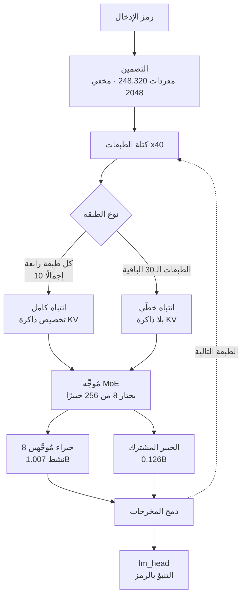

عادةً ما يستحضر الحديث عن نموذج بحجم 35B صورة عدة بطاقات رسومية. غير أن نموذج KAT-Coder-V2.5-Dev الذي أصدرته Kwaipilot مبنيّ على نحو مختلف: من بين 35 مليار معامل، لا يُفعَّل سوى 3 مليارات لكل رمز. حمّلنا ملف `config.json` وفهرس safetensors المنشورَين وأجرينا الحساب بأنفسنا. من بين 256 خبيرًا يُفعَّل 8 فقط، ومن بين 32.2 مليار معامل موجودة في الخبراء المُوجَّهين لا يشارك في أي رمز سوى 1.007 مليار. أي بنسبة 3.12%.


## لماذا يهمّك هذا

كُتب هذا المقال لمهندسي المنصّات الذين يجهّزون وكيل برمجة داخليًا، ولمسؤولي البنية التحتية الذين عليهم تحديد النموذج مفتوح الأوزان الذي يستحق ميزانية البطاقات الرسومية. وهو ليس مدخلًا إضافيًا في جداول ترتيب المعايير. الخلاصة أولًا: يناسب KAT-Coder-V2.5-Dev التشغيل داخل المؤسسة لا لأنه يتطلّب موارد أقل، بل لأن **شكل توزيع تلك الموارد مختلف**. تشغل الأوزان 65.2 جيجابايت بدقّة bf16 وتتّسع في بطاقة H200 واحدة، ولا يضيف سياق بطول 262 ألف رمز سوى 5 جيجابايت من ذاكرة KV. وبقية المقال تشرح من أين جاء هذان الرقمان.

## نظرة عامة

أصدرت Kwaipilot نموذج KAT-Coder-V2.5 في يوليو، ثم نشرت النسخة مفتوحة الأوزان KAT-Coder-V2.5-Dev على Hugging Face. الترخيص هو Apache-2.0 والنموذج الأساس هو Qwen3.6-35B-A3B. أي أنه ليس نموذجًا دُرِّب من الصفر، بل هو وصفة التدريب اللاحق الخاصة بـ KAT-V2.5 مطبَّقة فوق عمود فقري من نوع MoE مثبتة جدارته سلفًا.

وهذا يجعله لافتًا لسببين. أولهما أنه يُظهر بوضوح ما الذي يشتريه التدريب اللاحق وحده ضمن معمارية ثابتة. ففي جدول بطاقة النموذج يسجّل الأساس Qwen3.6-35B-A3B نتيجة 64.40 في SWE-bench Verified، بينما يسجّل KAT-Coder-V2.5-Dev نتيجة 69.40. هذا الفارق البالغ خمس نقاط ناتج بالكامل عن SFT وRL. وثانيهما أن اشتراك النموذج الأساس يعني أن حزمة التشغيل لديكم لن تحتاج إلى استيعاب شيء جديد تقريبًا.

وثمة تنبيه يجدر ذكره مسبقًا. تتضمّن هذه النسخة أوزان النموذج اللغوي فحسب، من دون برج الرؤية، وتنصّ بطاقة النموذج صراحةً على أنه يعمل بالنصّ فقط. وحين صنّفنا أسماء المصفوفات في فهرس نقطة التحقّق لم تظهر ولا مصفوفة رؤية واحدة. وترتبط هذه الحقيقة مباشرةً بخيارات التشغيل الواردة أدناه.

## ما هو هذا النموذج

منقولًا حرفيًا من `text_config` في ملف `config.json` المنشور:

| البند | القيمة |
|---|---|
| إجمالي المعاملات | 35B (نشط 3B) |
| عدد الطبقات | 40 |
| البعد المخفي | 2048 |
| الخبراء | 8 نشطون من أصل 256 |
| البعد الوسيط للخبير | 512 |
| رؤوس الانتباه | 16 (رأسا KV، بعد الرأس 256) |
| تركيب الطبقات | انتباه كامل 10 + انتباه خطّي 30 |
| طول السياق | 262,144 رمزًا |
| حجم المفردات | 248,320 |
| الترخيص | Apache-2.0 |

يستحق سطران انتباهًا خاصًا.

أولهما تركيبة الخبراء. كل خبير شبكة تغذية أمامية صغيرة جدًا تنتقل من بعد مخفي 2048 إلى بعد وسيط 512، فالخبراء أفراد خفيفون وعددهم كبير. وهذا هو الاتجاه العام لتصميم MoE اليوم: كلما دقّ تقسيم الخبراء اتّسع عدد التوليفات التي يستطيع المُوجِّه تركيبها، وهو ما يشتري تمثيلًا أوسع بالعدد نفسه من المعاملات النشطة.

وثانيهما ترتيب الانتباه. لا تستخدم الطبقات الأربعون النوع نفسه من الانتباه، بل تستخدم كل طبقة رابعة انتباهًا كاملًا فيما تستخدم البقية انتباهًا خطّيًا. وعدّ مصفوفة `layer_types` يعطي 10 طبقات انتباه كامل و30 طبقة انتباه خطّي. وبما أن ذاكرة KV لا تنمو مع طول التسلسل إلا في طبقات الانتباه الكامل، فإن هذا الترتيب يحدّد مباشرةً كلفة السياقات الطويلة.

وبجمع العنصرين معًا:



## التثبيت والتكامل

فيما يلي أوامر التشغيل من بطاقة النموذج، مع مأزق واحد يستحق التصريح به.

يُنصح باستخدام vLLM إصدار 0.19.0 أو أحدث.

```shell
uv pip install vllm --torch-backend=auto

vllm serve Kwaipilot/KAT-Coder-V2.5-Dev \
    --port 8000 \
    --tensor-parallel-size 8 \
    --max-model-len 262144 \
    --reasoning-parser qwen3 \
    --enable-auto-tool-choice \
    --tool-call-parser qwen3_coder \
    --language-model-only
```

الخيار الأخير `--language-model-only` إلزامي لا اختياري. فكما ذُكر أعلاه لا تحمل هذه النسخة أوزان برج الرؤية، وبدون هذا الخيار يحاول vLLM تهيئة مُرمِّز رؤية غير موجود في نقطة التحقّق فيفشل عند الإقلاع. وتحمل بطاقة النموذج التحذير نفسه.

ويُنصح باستخدام SGLang إصدار 0.5.10 أو أحدث، مع تحديد مُحلِّل لاستدعاء الأدوات.

```shell
uv pip install sglang[all]

python -m sglang.launch_server \
    --model-path Kwaipilot/KAT-Coder-V2.5-Dev \
    --port 8000 \
    --tp-size 8 \
    --mem-fraction-static 0.8 \
    --context-length 262144 \
    --reasoning-parser qwen3 \
    --tool-call-parser qwen3_coder
```

لا يملك SGLang خيارًا واحدًا يقابل `--language-model-only` في vLLM. وبحسب الإصدار قد يفشل الإقلاع أثناء محاولة بناء المكوّنات متعدّدة الوسائط، وتوجيه بطاقة النموذج هنا هو مراجعة `--help` للعثور على خيار النموذج اللغوي فقط في ذلك الإصدار.

وثمة خيار آخر يهمّ عند التشغيل كوكيل. يحتفظ النموذج افتراضيًا بكتلة التفكير الخاصة بآخر رسالة للمستخدم فقط، لكن `preserve_thinking` ينقل آثار الاستدلال من الأدوار السابقة.

```python
chat_response = client.chat.completions.create(
    model="Kwaipilot/KAT-Coder-V2.5-Dev",
    messages=messages,
    max_tokens=32768,
    temperature=0.7,
    top_p=0.8,
    presence_penalty=1.5,
    extra_body={
        "top_k": 20,
        "chat_template_kwargs": {"preserve_thinking": True},
    },
)
```

تصف بطاقة النموذج هذا الخيار بأنه يرفع اتساق القرار في سيناريوهات الوكلاء، وكثيرًا ما يخفض استهلاك الرموز الإجمالي لأن النموذج يتوقف عن إعادة اشتقاق الاستدلال نفسه. ويتحسّن معه استغلال ذاكرة KV.

## ما الذي قسناه فعليًا

إفصاح صريح أولًا. لم نُشغّل النموذج لقياس زمن الاستجابة أو الإنتاجية. فتهيئة تتطلّب توازيًا تنسوريًا ثمانيًا لم تكن ممكنة في هذه البيئة، كما احتاجت بعض الخطوات مثل تثبيت حزمة MCP SDK إلى موافقة منفصلة. لذلك أحصينا **كل ما يمكن التحقّق منه دون تنزيل الأوزان**: جلبنا `config.json` و`model.safetensors.index.json` المنشورَين واشتققنا توزيع المعاملات ومتطلبات الذاكرة من أسماء المصفوفات وأشكالها الحقيقية. والسكربت موجود في `scripts/experiments/kat-coder-v25-dev/analyze_checkpoint.py`.

بنية نقطة التحقّق أولًا:

```
tensors=31333 shards=13
tensor counts by bucket: {"backbone": 451, "embedding": 2,
                          "routed_expert": 30720, "shared_expert": 160}
```

من بين 31,333 مصفوفة هناك 30,720 مصفوفة أوزان خبراء مُوجَّهين، أي 98% من الإجمالي. وبوجود 40 طبقة و256 خبيرًا وثلاث مصفوفات لكل خبير (gate وup وdown)، يعطي حاصل ضرب 40 في 256 في 3 رقم 30,720 بالضبط. وحين يستقيم هذا الحساب يصبح بالإمكان الوثوق ببقية الأرقام.

وبتقسيم المعاملات بحسب الدور:

| الدور | المعاملات |
|---|---|
| الخبراء المُوجَّهون (الإجمالي) | 32.212B |
| الخبراء المُوجَّهون (النشط لكل رمز) | 1.007B |
| الخبير المشترك | 0.126B |
| المُوجِّه | 0.021B |
| التضمينات + lm_head | 1.017B |
| **تناثر الخبراء** | **3.12%** |

ويتّضح من ذلك أمر واحد. هذا النموذج خبراء في معظمه، ولا يشارك في حساب أي رمز سوى 3.12% منهم. غير أن **الباقي يظل مضطرًا للبقاء في الذاكرة**. وهنا تحديدًا يُساء فهم MoE عادةً: وجود 3 مليارات معامل نشط لا يعني أن النموذج يستهلك الذاكرة كنموذج بحجم 3 مليارات.

مساحة الأوزان بحسب الدقّة:

| الدقّة | كل الأوزان مقيمة | (للمرجع) النشط فقط |
|---|---|---|
| bf16 | 65.2 جيجابايت | 5.6 جيجابايت |
| fp8 | 32.6 جيجابايت | 2.8 جيجابايت |
| int4 | 16.3 جيجابايت | 1.4 جيجابايت |

العمود الأيمن نظري وغير قابل للبلوغ في التشغيل الفعلي، لأن اختيار المُوجِّه غير معروف مسبقًا. والعمود الذي يهمّ تشغيليًا هو الأيسر.

وهنا يأتي أكثر رقم عملي في هذا المقال.


يشغل تسلسل واحد يملأ 262,144 رمزًا ذاكرة KV بحجم 5.00 جيجابايت بدقّة bf16. ولو كانت الطبقات الأربعون كلها انتباهًا كاملًا لاحتاج التسلسل نفسه إلى 20.00 جيجابايت. قرار واحد في ترتيب الانتباه يخفض كلفة السياق الطويل بنسبة 75%. ووكلاء البرمجة يدفعون مستودعات كاملة إلى السياق عادةً، مما يجعل عدد الجلسات المتزامنة مساويًا عمليًا لإجمالي ذاكرة KV، فتستطيع البطاقة نفسها حمل أربعة أضعاف عدد الجلسات.

وبحساب عدد البطاقات للأوزان وحدها، بافتراض ذاكرة قابلة للاستخدام بنسبة 85%:

| البطاقة | bf16 (65.2 ج.ب) | fp8 (32.6 ج.ب) | int4 (16.3 ج.ب) |
|---|---|---|---|
| H200 NVL 141GB | 1 | 1 | 1 |
| H100 / A100 80GB | 1 | 1 | 1 |
| RTX 5090 32GB | 3 | 2 | 1 |
| RTX 4090 24GB | 4 | 2 | 1 |

مثال `--tensor-parallel-size 8` في بطاقة النموذج يفترض أقصى إنتاجية عبر جلسات متزامنة كثيرة بطول 262 ألف رمز. أما للأوزان مع ذاكرة KV لتسلسل واحد فمجموع 65.2 و5.0 يعطي 70.2 جيجابايت، وهو ما يترك متّسعًا في بطاقة H200 واحدة. وإذا كنتم تشغّلون مساعد برمجة داخليًا بحجم فريق وبعشرات المستخدمين المتزامنين، فليست ثماني بطاقات هي نقطة البداية اللازمة.

## ماذا يعني هذا لـ ThakiCloud

يمسّ هذا النموذج منتجَينا معًا.

**من منظور ai-platform.** منصّة ai-platform من ThakiCloud بنية تحتية متعدّدة المستأجرين للذكاء الاصطناعي والتعلّم الآلي تتقاسم البطاقات الرسومية عبر Kubernetes وKueue. وهنا بالضبط تؤتي الحسابات أعلاه ثمارها. فبما أن 65.2 جيجابايت بدقّة bf16 تتّسع داخل بطاقة H200 NVL واحدة، يمكن جدولة هذا النموذج كحمل عمل ببطاقة واحدة لمساعد برمجة خاص بفريق بدل احتلال عقدة كاملة، فتبقى البطاقات الأخرى لمهام تدريب مستأجرين آخرين. يُضاف إلى ذلك أن النموذج الأساس Qwen3.6-35B-A3B مُهيّأ سلفًا في سجلّ النماذج الداخلي لدينا، فسحب الأوزان داخل العنقود أسرع كثيرًا من جلبها خارجيًا. وبالنسبة إلى العملاء الذين عليهم تشغيل مساعد برمجة دون إرسال الشيفرة المصدرية إلى واجهة خارجية، ولا سيما في البيئات المعزولة أو السيادية، يمثّل الجمع بين ترخيص Apache-2.0 وهذا الحجم خيارًا واقعيًا.

**من منظور Paxis.** إن Paxis هو مستوى التحكّم السحابي الأصلي للوكلاء الذي يعمل فوق ai-platform، ويتعامل مع Skills وTools وPolicies وAudit Logs بوصفها موارد من الدرجة الأولى. لذلك لم يكن ما استوقفنا في هذا النموذج نتيجة معيار بل معدّل سلوك شاذّ. تفيد بطاقة النموذج بأن تدريب RL خفض وسوم الأدوات الشاذة من 9.34% إلى 0.28%، والتكرار داخل الدور الواحد من 0.34% إلى 0%. ومن أدار منظومة وكلاء يعرف أن نموذجًا تنكسر استدعاءات أدواته تسع مرات من كل مئة لا يصلح للأتمتة مهما كان استدلاله جيدًا، لأن إعادة المحاولة ومعالجة استثناءات التحليل تلتهم خط المعالجة. وفي نظام يختار فيه Paxis من أكثر من 960 مهارة عبر BM25 وينفّذها في صناديق رمل معزولة ويمرّر كل فعل عبر بوابات السياسات وسجلّات التدقيق، تصبح موثوقية استدعاء الأدوات هي موثوقية المنظومة كلها. وتحسين يبدو تفصيلًا في خانة عشرية يغيّر شعور التشغيل فعليًا.

وفي وصفة التدريب درس أيضًا. تصف Kwaipilot بناء مكافآت هرمية من تغذية راجعة لتنفيذ المنظومة، تمنح رصيدًا جزئيًا حين تُحرز محاولة فاشلة تقدّمًا ذا معنى. وهذا يولّد إشارة تعلّم أكثف من مكافأة ثنائية بنجاح أو فشل، ويوازي ما نفعله حين نسجّل لا مجرد النجاح أو الفشل بل إلى أي مدى وصل التشغيل عند إلحاق بوابات تحقّق بحلقات الوكلاء.

## الحدود والاعتراضات

أكبر تحفّظ أن كل رقم معياري هنا صادر عن مؤلّفي النموذج. تعاملوا مع نتيجة 69.40 في SWE-bench Verified كنقطة مرجعية إلى أن تُكرَّر بشكل مستقلّ. ومعايير البرمجة الوكيلية تحديدًا تتأرجح بشدّة تبعًا لتهيئة المنظومة وميزانية المحاولات. وكون متوسط KAT-Coder-V2.5-Dev في Terminal-Bench 2.1 البالغ 41.02 مطبوعًا إلى جانب قيمتين لكل منظومة هما 32.60 و49.44 هو بذاته برهان على هذا التباين.

ثانيًا، كل رقم في هذا المقال ناتج عن تحليل ساكن. فالتشغيل الفعلي يضيف ذاكرة التنشيطات ومخازن رسوم CUDA والتجزئة، فخصّصوا فوق الجداول الواردة هنا. ويجلب MoE مشكلة إضافية هي عدم توازن حمل الخبراء عبر الدفعات، ما يعني أن الإنتاجية الفعلية تتوقف كثيرًا على كيفية مزج التوازي التنسوري مع توازي الخبراء. وما حسبناه أرضية لا مواصفة تشغيلية.

ثالثًا، غياب برج الرؤية يمتدّ أثره أبعد مما يبدو أولًا. فقراءة لقطة شاشة لإصلاح واجهة، أو تفسير مخطّط، خارج نطاق هذه النسخة. وإذا بقي وكيل البرمجة لديكم ضمن العمل النصّي على المستودعات فلا بأس، أما إذا كانت أتمتة الواجهات الأمامية في خطّتكم فينبغي تقييم بدائل بالتوازي.

وأخيرًا الاعتراض المضادّ. ثلاثة مليارات معامل نشط لا تُترجَم إلى رخص التكلفة. فطلب الذاكرة يوازي نموذجًا بحجم 35B، وما توفّرونه هو الحساب. وإذا كانت ذاكرة البطاقة عنق الزجاجة لديكم أصلًا فالفائدة هنا أصغر مما تبدو. أما إن كانت البطاقات متوفّرة والإنتاجية ناقصة فالفائدة كبيرة. حدّدوا أولًا في أي الحالتين أنتم.

## الخلاصة

خرجنا من فحص KAT-Coder-V2.5-Dev بثلاثة أمور. تشغيل 8 خبراء من 256 يعطي تناثرًا بنسبة 3.12% ويخفض الحساب؛ وإبقاء 10 طبقات فقط من 40 على انتباه كامل يحصر ذاكرة KV لسياق 262 ألف رمز في 5 جيجابايت؛ وهذان معًا يضعان 65.2 جيجابايت من أوزان bf16 داخل بطاقة H200 واحدة. وبهذا تُستعاد الخلاصة التي بدأنا بها: يناسب هذا النموذج التشغيل داخل المؤسسة لا لأنه صغير، بل لأن موارده تقع في مواضع مختلفة.

لذا فالخطوة التالية واضحة. إذا كنتم تقيّمون مساعد برمجة داخليًا فلا تتّخذوا أمر المثال بثماني بطاقات خطَّ أساس. ثبّتوا عدد الجلسات المتزامنة أولًا، ثم اعملوا رجوعًا من ذاكرة KV واشتقّوا منها عدد البطاقات. وسكربت التحليل المستخدم هنا يعمل بالطريقة نفسها على أي نموذج MoE آخر. وقبل الالتزام، قيسوا معدّل فشل استدعاء الأدوات قبل نتائج المعايير. فهذا المؤشّر أصدق بكثير لمن يشغّل الوكلاء.

## المصادر

- [بطاقة النموذج Kwaipilot/KAT-Coder-V2.5-Dev](https://huggingface.co/Kwaipilot/KAT-Coder-V2.5-Dev)
- [التقرير التقني لـ KAT-Coder](https://huggingface.co/papers/2607.05471)
- [صفحة مشروع KAT-Coder](https://kwaipilot.github.io/KAT-Coder/)
