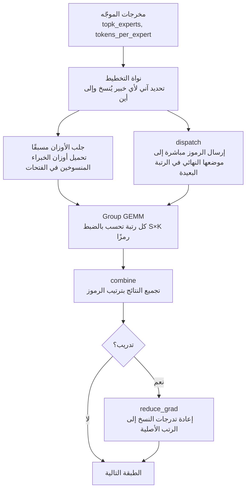
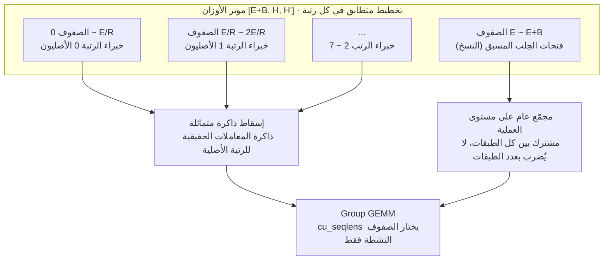

## لماذا يهمك هذا

كُتب هذا المقال لمهندسي البنية التحتية الذين يوزّعون نموذج MoE على عدة وحدات معالجة رسومية ولا يجدون تفسيرًا لانخفاض معدل الاستخدام عن المتوقع. نفعه أقل لمن يتعرف على التوازي الخبيري لأول مرة، وأكبر لمن ركّب بالفعل مكتبة مثل DeepEP وعليه أن يشرح سبب تذبذب زمن التكرار. الخلاصة أولًا: ما تبيعه MoonEP ليس سرعة الاتصال بل **قابلية التنبؤ**. حين شغّلنا شيفرة التخطيط من المستودع بأنفسنا، استقبلت كل رتبة العدد نفسه من الرموز بالضبط حتى مع انحياز توجيه شديد، وكان الثمن أن نحو 30 بالمئة من الرموز غادرت الرتبة التي تنتمي إليها. في ما يلي الأرقام اللازمة للحكم على جدوى هذه المقايضة في عنقودك.

## نظرة عامة

أصدرت Moonshot AI مكتبة MoonEP برخصة MIT. هي مكتبة اتصال للتوازي الخبيري، وتعريفها في سطر واحد أنها "تحافظ على اتزان تام لأحمال الرموز بين الرتب عبر خبراء زائدين ديناميكيين".

لفهم أهمية ذلك، انظر إلى أين يتسرب الوقت في تدريب MoE. في طبقة MoE يختار الموجّه بضعة خبراء لكل رمز، وينتقل كل رمز إلى الوحدة التي تحتضن هؤلاء الخبراء. المشكلة أن الموجّهات ليست عادلة. تكدّس الرموز على خبراء بعينهم أمر شائع في أي مرحلة من التدريب، فتنتهي الرتبة التي تحمل خبيرًا مزدحمًا إلى حساب رموز أكثر بكثير من جاراتها.

في التدريب الموزّع تنتهي الخطوة حين تنتهي أبطأ رتبة. تنتظر السبع الأخريات. بعبارة أخرى، **الحمل الأقصى هو ما يحدد زمن الخطوة، لا الحمل المتوسط.** وتأتي مشكلة ثانية مع الأولى. لأن عدد الرموز لكل رتبة يتغير كل خطوة، تتغير أيضًا أشكال موترات التنشيط، فتتشظى ذاكرة الوحدة. تفيد Moonshot بأن هذا التشظي هو ما يدفع DeepEP في النهاية إلى الفشل بنفاد الذاكرة عند الانحياز الشديد.

تحل MoonEP المشكلتين بحركة واحدة: جعل كل رتبة تستقبل بالضبط `S × K` رمزًا، حيث `S` عدد رموز الدخل لكل رتبة و`K` عدد الخبراء الموجّه إليهم لكل رمز. بتثبيت هذه القيمة يتساوى الحمل الأقصى مع المتوسط، ولأن أشكال الموترات تصبح ثابتة يختفي التشظي أيضًا.

## ما هذه التقنية

الأداة الجوهرية هي **الخبير الزائد الديناميكي**. حين تتكدس الرموز على خبير، تُوضع نسخة مؤقتة منه على رتبة لديها متسع ويُوجَّه الفائض إليها. لا تُحدَّد النسخ مسبقًا، بل **تُخطَّط آنيًا من مخرجات الموجّه في الخطوة الحالية.** وفي التدريب تُعاد التدرجات التي أنتجتها النسخة إلى رتبتها الأصلية أثناء المرور الخلفي.

التدفق العام كالتالي.



يضاف إلى ذلك قراران في التنفيذ. الأول هو **النسخ الصفري**. عادةً تستقبل الرموز في مخزن اتصال ثم تعيد ترتيبها حسب الخبير في مخزن حساب. تحسب MoonEP الموضع النهائي لكل خبير في الرتبة المستقبِلة من جهة الإرسال وتكتب هناك مباشرة. يختفي الترتيب والنسخ تمامًا، وتقرأ نواة الحساب مخزن الاتصال في مكانه.

الثاني هو **الأشكال الساكنة**. لأن المخزن ثابت دائمًا عند `S × K`، تُعرف الأشكال مسبقًا ولا حاجة لمزامنة المضيف مع الوحدة في كل طبقة للسؤال عن عدد الرموز الواردة. في تدريب MoE تكلفة هذه المزامنة أعلى مما يُظن.

تعمل قياسات Moonshot المنشورة على H20 بثماني رتب، وتمسح مقياس اختلال الموجّه المسمى maxvio مقابل DeepEP v2. زمن اتصال MoonEP أقل في كل مستويات الاختلال ويبقى شبه مستوٍ مع تزايده، بينما يتدهور DeepEP باطراد لأن زمنه تحدده أكثر الرتب ازدحامًا. وتذكر Moonshot أن هذه الأرقام تتضمن أصلًا نوى التخطيط والجلب المسبق الإضافية في MoonEP.

## التثبيت والدمج

التثبيت مباشر.

```bash
git clone https://github.com/MoonshotAI/MoonEP.git
cd MoonEP
pip install -e .
```

أما تشغيل الاختبارات فيتطلب عدة وحدات موصولة بـ NVLink.

```bash
torchrun --nproc_per_node=8 -m pytest tests/test_planning.py
torchrun --nproc_per_node=8 -m pytest tests/test_dispatch.py
torchrun --nproc_per_node=8 -m pytest tests/test_e2e.py
```

للعقد مع إطار العمل شقّان. يحتفظ كل إسقاط خبيري بـ **موتر أوزان واحد متصل في ذاكرة متماثلة**، ويختار `cu_seqlens` الناتج عن التخطيط صفوف الخبراء النشطة في هذه الخطوة. شكل موتر الأوزان `[E+B, H, H']` ويجب أن يكون تخطيطه متطابقًا في كل رتبة. الصفوف `[0, E)` هي ذاكرة معاملات الخبراء الحقيقية لكل رتبة مُسقَطة عبر الذاكرة المتماثلة، والصفوف `[E, E+B)` هي فتحات الجلب المسبق التي تحتضن النسخ.



أهم قيمة عمليًا هي `B`، أي فتحات الجلب المسبق لكل رتبة. يشدد التوثيق على أن **التدريب يجب أن يستخدم `B = E/R`**. فالتخطيط ينسخ خبراء من مجموعة أصلية بعيدة واحدة على الأكثر لكل رتبة، ولتغطية كل خبير يلمسه Group GEMM محليًا يلزم هذا العدد من الفتحات. أما في الاستدلال فلا تدرجات، فتكفي قيمة 3 أو 4؛ وإذا نقصت الفتحات يقرأ Group GEMM أوزان الرتبة الأصلية عن بُعد عبر الإسقاط المتماثل. أبطأ قليلًا وصحيح تمامًا.

## ما الذي قسناه

أولًا ما لم نستطع فعله. **لم نشغّل نوى الاتصال.** فهي تحتاج CUDA وعدة وحدات موصولة بـ NVLink، وهو ما لا تملكه هذه البيئة. شغّلنا بدلًا من ذلك **التنفيذ المرجعي بـ torch لمرحلة التخطيط** الموجود في المستودع، على المعالج. الملف `tests/planning_reference.py` مكتوب ليعيد إنتاج نتيجة نواة التخطيط، و`tests/generate_topk_routing.py` هو مولّد التوجيه المنحاز نفسه الذي تستخدمه القياسات. كلاهما من شيفرة المشروع، ولم نضف سوى القياس حولهما.

الإعداد 256 خبيرًا و8 رتب و2048 رمزًا لكل رتبة وtop-8. سعة الرتبة إذن `S × K` أي 16,384 رمزًا. يُضبط انحياز الموجّه بسيغما التوزيع اللوغاريتمي الطبيعي: 0 اتزان تام، و1 ما يسميه التوثيق انحياز dropless MoE النموذجي، و5 توجيه شبه متدهور.


| سيغما الانحياز | ذروة الحمل المرجعي | أدنى حمل مرجعي | الذروة/المتوسط | MoonEP الذروة/المتوسط | الرموز المهاجرة | فتحات النسخ |
|---|---|---|---|---|---|---|
| 0.0 | 16,384 | 16,384 | 1.000 | 1.000000 | 0.00% | 0 |
| 0.5 | 20,343 | 14,168 | 1.242 | 1.000000 | 3.65% | 9 |
| 1.0 | 25,525 | 11,282 | 1.558 | 1.000000 | 8.95% | 9 |
| 2.0 | 35,864 | 5,335 | 2.189 | 1.000000 | 20.81% | 8 |
| 5.0 | 44,929 | 747 | 2.742 | 1.000000 | 29.82% | 7 |

يثبّت الخط المرجعي الخبراء في رتبهم الأصلية. عند سيغما 1، وهي حالة اعتيادية، تأخذ أكثر الرتب ازدحامًا 1.56 ضعف المتوسط بينما لا تنال أهدؤها سوى 11,282 رمزًا. وعند سيغما 5 يحسب طرف 44,929 رمزًا بينما يحسب آخر 747، أي بفارق ستين ضعفًا. تدريب بهذه الحال يعني أن سبعًا من وحداتك الثماني تقضي معظم الوقت في الانتظار.

بتمرير التوجيه نفسه عبر مخطط MoonEP استقبلت الرتب الثماني بالضبط 16,384 رمزًا في **كل مستويات الانحياز الخمسة**. لا تقريبًا، بل بالضبط. بل إن الشيفرة ترفع استثناءً إذا تجاوز `alloc.sum(dim=0)` السعة، فتجاوزها مستحيل بنيويًا. تبين أن عبارة "اتزان تام" حرفية لا تسويقية.

العمود الأيمن هو الفاتورة. الاتزان يعني أن الرموز تغادر الرتبة التي كانت متجهة إليها، وترتفع هذه الحصة مع الانحياز: 8.95 بالمئة عند سيغما 1 و29.82 بالمئة عند سيغما 5. تعبر هذه الرموز NVLink فيرتفع حجم الاتصال تبعًا. لا تنجح المقايضة إلا لأن MoonEP جعلت الاتصال نفسه رخيصًا بالنسخ الصفري أولًا.

ولفت انتباهنا أمر آخر. بقي عدد فتحات النسخ بين **سبع وتسع** مهما اشتد الانحياز. من أصل 256 خبيرًا تكفي أقل من عشر نسخ. فالانحياز الشديد يركّز الرموز على قلة من الخبراء، ونسخ تلك القلة وحدها يحمل الباقي. عبارة "عدد صغير من الخبراء الزائدين" في التوثيق يؤكدها هذا العمود.

حسبنا أيضًا كلفة الذاكرة من الأشكال الواردة في التوثيق، بافتراض `S=4096` و`H=7168` وثلاثة إسقاطات وبُعد وسيط لشبكة الخبير قدره 2048. تختلف هذه القيمة الأخيرة بين النماذج، فاعتبرها تقديرًا.

| الوضع | B | أوزان الجلب المسبق | مخزن اختزال التدرجات | مخزن dispatch | الإجمالي |
|---|---|---|---|---|---|
| الاستدلال | 4 | 0.33 GiB | لا يوجد | 0.44 GiB | 0.77 GiB |
| التدريب | 32 | 2.62 GiB | 5.25 GiB | 0.44 GiB | 8.31 GiB |

أقل من 1 GiB لكل رتبة في الاستدلال أمر مهمل. أما التدريب فيتجاوز 8 GiB، وهو ليس صغيرًا بجانب 2.6 GiB من أوزان الخبراء الأصليين التي تحملها الرتبة أصلًا. غير أن التوثيق ينص على أن مجمّع الجلب المسبق ومخزن الاختزال يأتيان من **مجمّع عام على مستوى العملية مشترك بين كل الطبقات**. فهما لا يُضربان بعدد الطبقات، وفي نموذج واقعي بعشرات الطبقات يصبح وزنهما النسبي أصغر بكثير.

## ماذا يعني هذا لـ ThakiCloud

تجدول منصة **ai-platform** لدى ThakiCloud أحمال وحدات المعالجة الرسومية على Kubernetes وتدرّب النماذج وتخدمها فوقها. ولأن Kueue يصفّ الوحدات ويتشارك عدة مستأجرين عنقودًا واحدًا، فإن معدل الاستخدام لدينا مقياس تكلفة قبل أن يكون مقياس أداء. كل بطاقة عاطلة سعة كان يمكن بيعها لمستأجر آخر.

من هذه الزاوية، المشكلة التي تستهدفها MoonEP هي مشكلتنا بالضبط. معظم النماذج مفتوحة الأوزان التي تناولناها مؤخرًا من نوع MoE، وتشيع التهيئات بـ 256 خبيرًا وtop-8، ولهذا استخدمنا الإعداد نفسه. درّب نموذجًا كهذا على 8 رتب توازٍ خبيري بانحياز موجّه عند سيغما 1، ووفق القياسات أعلاه تأخذ أكثر الرتب ازدحامًا 1.56 ضعف المتوسط. ولأن زمن التكرار يتبع الحمل الأقصى، فإن أكثر من ثلث العنقود نظريًا في حالة انتظار.

ولا يقل تشظي الذاكرة أهمية. في بيئة متعددة المستأجرين أسوأ الأعطال ليس مهمة بطيئة بل **مهمة ليلية تموت بنفاد الذاكرة**. موترات التنشيط المتغيرة الأشكال في كل خطوة تسبب التشظي، وتصحيح التشظي مكلف لأنه يصعب تكراره. البنية ذات الأشكال الثابتة تزيل هذا الصنف من الأعطال من جذوره. وتتيح لنا أيضًا تقدير السعة بمنطق "دائمًا هذا القدر" بدل "هذا القدر في أسوأ الحالات"، ما يجعل سياسة تخصيص الوحدات أدق بكثير.

مع ذلك ليست مرشحًا للإنتاج اليوم. فهي تفترض ذاكرة متماثلة وNVLink، أي أن الوحدات يجب أن تكون موصولة بـ NVLink داخل العقدة، وخط تدريبنا لا يلمس طبقة اتصال التوازي الخبيري مباشرة. الخطوة الواقعية التالية إعادة إنتاج القياس أعلاه على عقدة H200 واحدة لنرى هل يبقى زمن الاتصال مستويًا على عتادنا أيضًا. ما يثبته هذا المقال هو صحة مرحلة التخطيط؛ أما مكسب الاتصال فلم نقسه بأنفسنا بعد.

## الحدود والاعتراضات

أولًا، يغطي هذا التحقق مرحلة التخطيط فقط. تقدّم MoonEP ادعاءين، الاتزان وسرعة الاتصال، وقد أكدنا الأول فحسب. أما الثاني فيستند إلى أرقام قياس H20 المنشورة من Moonshot، ولم نعد إنتاجها باستقلال.

ثانيًا، الاتزان التام ليس مكسبًا دائمًا. الانحياز الأشد يعني رموزًا مهاجرة أكثر واتصالًا أكثر. هجرة قرابة 30 بالمئة من الرموز عند سيغما 5 تعني أن الاتزان قد يكلف أكثر مما يوفر في تهيئة يغلب عليها الاتصال لا الحساب. وأي الطرفين يفوز يعتمد على حجم النموذج والبعد الخفي وعرض حزمة الربط، فلا يقبل التعميم.

ثالثًا، انحياز الموجّه يتقلص عادةً أثناء التدريب. معظم تشغيلات MoE توزّع الحمل بخسارة مساعدة أو حد انحياز، وحيث ينجح ذلك لا تبلغ سيغما 2 أو 5. أكبر فائدة لـ MoonEP حين تغيب هذه الآليات أو تضعف، أو في بداية التدريب والموجّه لا يزال غير مستقر. أما تركيبها على تشغيل متزن أصلًا فلا يتبقى منه سوى مكسب الاتصال من النسخ الصفري.

رابعًا، الدمج ليس رخيصًا. يجب إعادة ترتيب أوزان الخبراء في موتر واحد متصل بذاكرة متماثلة لكل إسقاط، وهذا يغيّر طريقة إدارة المعاملات في شيفرة التدريب القائمة. ويجب فصل اختزال التدرجات كي لا يصطدم باختزال إطار العمل نفسه. ليست مسألة استيراد وسطر واحد.

خامسًا، خيارات العتاد ضيقة. الدعم اليوم لوحدات NVIDIA، وZhenwu PPU قيد المراجعة. وفي أسطول يشغّل مسرّعات مختلطة يبقى نطاق التطبيق محدودًا.

## الخلاصة

ما تفعله MoonEP فعليًا ليس تسريع الاتصال بل **فصل زمن الخطوة عن الموجّه**. بتشغيل شيفرة التخطيط من المستودع كما هي، رأينا الرتب الثماني تستقبل بالضبط 16,384 رمزًا مهما انحاز الموجّه. وفي المقابل غادرت 8.95 بالمئة من الرموز رتبتها الأصلية عند الانحياز النموذجي و29.82 بالمئة عند الشديد، وبناء هذا الاتزان تطلب أقل من عشر نسخ خبراء من أصل 256.

إن كنت تشغّل MoE على عدة بطاقات، فسجّل عدد الرموز المستقبَلة لكل رتبة في مهمة التدريب القادمة. نسبة ذروة إلى متوسط تتجاوز 1.5 تعني أنك لا تستخدم الوحدات التي دفعت ثمنها، وMoonEP تستهدف هذه الفجوة بالذات. وإعادة إنتاج قياس الاتصال على عقدة H200 هي التالية في قائمتنا.

تستدعي القياسات هنا الملفين `tests/planning_reference.py` و`tests/generate_topk_routing.py` من مستودع MoonEP مباشرة، وكل ما أضفناه هو تجميع الأحمال.

## المصادر

- [MoonEP: A Perfectly Balanced Expert Parallelism Library via Dynamic Redundant Experts (GitHub)](https://github.com/MoonshotAI/MoonEP)
- [DeepEP (خط المقارنة)](https://github.com/deepseek-ai/DeepEP)
- [Echo (arXiv 2603.07685)](https://arxiv.org/abs/2603.07685)
- [UltraEP](https://github.com/Dots-Infra/UltraEP)
