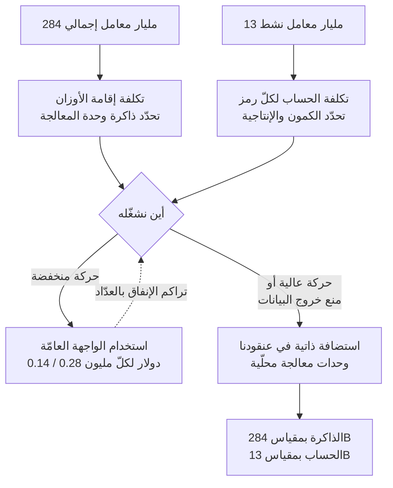

أوّل رقم ينظر إليه الناس في إعلان نموذج هو عدد المعاملات عادةً. لكن حين تصبح أنت من عليه وضع ذلك النموذج على وحدات المعالجة الرسومية لديك، يصير رقم آخر أهمّ بكثير. ونموذج DeepSeek-V4-Flash، الذي فُتح للتجربة العامّة في 31 يوليو 2026، مثال جيّد لشرح الفارق. الإجمالي 284 مليارًا، وما يشتغل فعليًا لإنتاج رمز واحد هو 13 مليارًا.

*يبقى أغلبه مطفأً ولا يضيء إلّا جزء منه. هذا هو توجيه الخبراء المتناثر في صورة واحدة.*

## لماذا يستحقّ هذا القراءة

كُتب هذا النصّ لمهندسي تعلّم الآلة الذين يختارون نموذجًا لأحمال الوكلاء، ولمسؤولي البنية التحتية الذين يقرّرون بين البقاء على واجهة تجارية ونقل النموذج إلى عنقودهم الخاصّ. الخلاصة أولًا: **ما يستحقّ الانتباه في هذا الإصدار ليس ترتيب المعايير بل أمران: أنّ أداء الوكلاء ارتفع بالتدريب اللاحق وحده دون مسّ المعمارية، وأنّ بصمة 13 مليارًا نشطة تقرّب نقطة التعادل للاستضافة الذاتية كثيرًا.** وبدل تصفّح جدول النتائج ننظر فيما يغيّره كلّ من الأمرين على تصميم خطّ الأنابيب وعلى ميزانية وحدات المعالجة الرسومية.

## نظرة عامة

أعلنت DeepSeek دخول واجهة V4-Flash الرسمية مرحلة التجربة العامّة في 31 يوليو 2026. غطّت [Bloomberg](https://www.bloomberg.com/news/articles/2026-07-31/deepseek-unveils-public-beta-api-for-flagship-ai-model) و[TechNode](https://technode.com/2026/07/31/deepseek-puts-v4-flash-api-into-public-beta/) الخبر في اليوم نفسه، وذكرت الشركة عبر حسابها الرسمي أنّ قدرات الوكلاء رُقّيت بصورة كبيرة.

وأبرز ما في الإعلان انقلاب في التراتب المعتاد. إذ يُذكر أنّ إصدار V4-Flash الرسمي يتجاوز V4-Pro-Preview الأعلى فئة في عدّة معايير برمجية. وخطّ Flash يقايض الأداء عادةً بالسرعة والسعر، وهذه المرّة تخطّى الفئة التي فوقه.

المواصفات: نموذج مزيج خبراء بـ284 مليار معامل، و13 مليار معامل نشط لكلّ رمز، ونافذة سياق بمليون رمز. والتسعير العلني مدرج عند 0.14 دولار لكلّ مليون رمز إدخال و0.28 دولار لكلّ مليون رمز إخراج. وعلى المؤشّرات المجمّعة سُجّلت درجة 50 على مؤشّر الذكاء لدى Artificial Analysis.

ويرافق ذلك بند آخر هو توافق الصيغة. فالنموذج يدعم صيغة واجهة Responses دعمًا أصيلًا ويتوافق مع Codex، ما يعني أنّ التطبيقات التي تستخدم مخطّطات إخراج JSON منظّمة يمكنها الاتّصال دون طبقة محوّل.

## ما الذي تغيّر فعليًا

أكثر عبارة مثيرة تقنيًا في هذا الإصدار ليست رقم أداء بل هذه: المعمارية مطابقة للنسخة الأوّلية ولم يُكرَّر سوى مرحلة التدريب اللاحق.

فإن كان الهيكل والحجم ذاتهما وارتفع أداء الوكلاء بحدّة رغم ذلك، فالسبب يقع في إشارة التدريب لا في سعة النموذج. فأنماط السلوك مثل متى تُستدعى أداة ومتى يُتوقّف، وكيف يجري التعافي من أمر فاشل، وكيف تُحمل مهمّة عبر خطوات كثيرة، لا تُشترى بزيادة المعاملات بل تُتعلَّم من بيانات تحتوي تلك السلوكيات.

وتشير هذه الملاحظة إلى الاتّجاه نفسه الذي تشير إليه أبحاث الأحزمة الحديثة. فقد أظهرت [الورقة المتعلّقة بالتفاعل بين تصميم الحزام والتدريب اللاحق (arXiv:2606.25447)](https://arxiv.org/abs/2606.25447) أنّ مدى صمود الأداء أمام تغيّر بيئة الأدوات يتوقّف كثيرًا على الحزام الذي افترضه التدريب اللاحق. فتحسين أداء الوكلاء من جهة النموذج ومن جهة الحزام ليسا مسارين منفصلين بل زوجًا واحدًا. وقد رأينا النمط نفسه في [حالة انقسام نتيجة ARC-AGI-3 بحسب إعدادات الحزام](/tech-blog/ar/llmops/arc-agi-3-harness-settings-context-memory/).

## كيف تُقرأ أرقام المعايير

بحسب التغطية الصحفية الناقلة للإعلان، جاءت نتائج الإصدار الرسمي كما يلي.

*أرقام معلنة من المطوّر كما نقلتها التغطية الصحفية، ولم تُعَد قياسًا بشكل مستقلّ.*

| المعيار | النتيجة | ما يقيسه |
|---|---|---|
| Terminal Bench 2.1 | 82.7 | إنجاز عمل متعدّد الخطوات في الطرفية |
| Cybergym | 76.7 | حلّ مهامّ أمنية |
| DSBench-FullStack | 68.7 | عمل بيانات متكامل الطبقات |
| DeepSWE | 54.4 | إصلاح برمجيات واقعي |
| NL2Repo | 54.2 | بناء مستودع من متطلّبات بلغة طبيعية |

يجدر تذكّر أمرين أثناء القراءة. أوّلًا، هذه قيم نشرها المطوّر ولم نقس نحن أيًّا منها. ثانيًا، وكما أُشير أعلاه، فإنّ نتائج معايير الوكلاء حسّاسة لتهيئة الحزام. فالنموذج نفسه ملفوفًا بمجموعة أدوات وسياسة سياق مختلفتين قد يتحرّك كثيرًا. لذا فاستخدام هذا الجدول لتضييق قائمة المرشّحين أأمن من استخدامه ترتيبًا نهائيًا. والاختيار الأخير يجب أن يُعاد قياسه على حزامك أنت وبمهامّك أنت.

ويستحقّ الانتباه أيضًا أنّ عائلة Terminal Bench تقع أعلى من البقيّة بوضوح. فعمل الطرفية حلقة متكرّرة من تنفيذ أمر وقراءة مخرجه واختيار الفعل التالي، وهو من أسهل الأنماط تحسينًا بالتدريب اللاحق. وفي المقابل، بقاء DeepSWE وNL2Repo في منتصف الخمسينات إشارة إلى أنّ المهامّ التي تتطلّب فهم المستودع كاملًا ما زالت صعبة.

## نموذج MoE بحجم 284B من زاوية التشغيل

هذا هو الجزء العملي لمسؤولي البنية التحتية. فبنية تكلفة نموذج مزيج الخبراء معلّقة برقمين مختلفين.

الذاكرة يحدّدها الإجمالي. فتحميل 284 مليارًا بدقّة FP8 يضع نحو 284 غيغابايت في الأوزان وحدها، وبدقّة BF16 نحو 568 غيغابايت. وتتراكم فوقها ذاكرة KV والنفقات التشغيلية. وإن كنت تنوي استخدام سياق بمليون رمز فعلًا، فتوقّع أن تنافس ذاكرة KV حجم الأوزان. وهذا الحساب مشتقّ مباشرةً من عدد المعاملات وليس قياسًا.

والحساب تحدّده المعاملات النشطة. فلا يشارك في إنتاج الرمز سوى 13 مليارًا، ما يجعل خصائص السرعة قريبة من نموذج كثيف بحجم 13 مليارًا. أي أنّه يلتهم ذاكرة كثيرة لكنّه سريع نسبةً إلى تلك الذاكرة.

ويغيّر هذا التفاوت قرار الاستضافة الذاتية. فنموذج كثيف بحجم 284 مليارًا كان ليخرج من القائمة فورًا، غير محتمَل في الذاكرة والحساب معًا. أمّا مع 13 مليارًا نشطة فالقصّة تختلف. أمّن ذاكرة كافية وستأتي الإنتاجية محترمة. وينزل السؤال من هل نستطيع تشغيله أصلًا إلى أيّهما أرخص، تكلفة وحدات ثابتة أم إنفاق بالعدّاد على الواجهة.

وحساب التعادل بسيط. فبسعر يقارب 0.4 دولار لكلّ مليون رمز مجتمعة على الواجهة العامّة، تبقى الواجهة أرخص ما لم تعالج مليارات الرموز يوميًا. وفي المقابل، حيث يُمنع خروج البيانات يصبح الحساب بلا لزوم. فالسؤال هناك سؤال جدوى لا سؤال تكلفة، وبصمة 13 مليارًا نشطة تدفع الجدوى نحو الإيجاب.

## حساب الأحجام يدويًا

ندفع الأرقام أبعد قليلًا. وما يلي حساب مشتقّ من مواصفات منشورة لا قياس مرجعي. استبدله بقياسات فعلية قبل اتّخاذ أيّ قرار.

نبدأ بالأوزان. بمعدّل بايت واحد لكلّ معامل، يصير 284 مليارًا بدقّة FP8 نحو 284 غيغابايت، وتعني نفقات التضمينات والمحاذاة أنّ عليك تخصيص هامش فوق ذلك. وأمام بطاقة H200 بسعة 141 غيغابايت تحتاج الأوزان وحدها إلى ثلاث بطاقات على الأقلّ، وبإدخال ذاكرة KV وذاكرة التنشيط يصبح التوازي الموتّر عبر ثماني بطاقات نقطة انطلاق واقعية. وبدقّة BF16 تجعل الـ568 غيغابايت تقريبًا حتى الثماني ضيّقة. وعمليًا يُشغَّل نموذج MoE بهذا الحجم على افتراض تكميم بدقّة FP8 أو أقلّ.

ثمّ ذاكرة KV. فسقف مليون رمز يعني أيضًا أنّ الذاكرة المؤقّتة تكبر بالقدر نفسه حين تستخدم ذلك الطول فعلًا. واحتفظ بسياقات طويلة عبر عدّة طلبات متزامنة وستجد نطاقًا تستنزف فيه الذاكرة المؤقّتة، لا الأوزان، السعة أوّلًا. والأأمن في الإنتاج تقسيم سقوف السياق حسب الحمل بدل ترك الحدّ الأقصى مفتوحًا، وهذا قرار يخصّ سياسة التشغيل لا مواصفة النموذج.

أمّا جانب الحساب فأكثر راحة بكثير. فبـ13 مليارًا نشطة لكلّ رمز يشبه العمل الحسابي نموذجًا كثيفًا بحجم 13 مليارًا. ويظهر عنق الزجاجة أوّلًا في عرض نطاق الذاكرة ونفقات توجيه الخبراء لا في الحساب. وتكبير الدفعة لرفع الإنتاجية يعمل جيّدًا على هذه الفئة، بينما خفض كمون الطلب المفرد إلى أدناه لا يعمل.

وبجمع الثلاثة تظهر صورة التشغيل. هذا نموذج يشغل عقدة مدّة طويلة ولا يسدّد كلفته إلّا إذا خدمت تلك العقدة طلبات متزامنة كثيرة. وخصّص هذا الحجم لاستدعاءات متفرّقة منخفضة التواتر وستبقى وحدات المعالجة عاطلة أغلب الوقت. وإن كنت تدرس الاستضافة الذاتية فالخطوة الأولى الصحيحة هي التحقّق ممّا إذا كانت حركتك ثابتة بما يكفي لملء دفعة.

## ماذا يعني ذلك لـ ThakiCloud

من عدسة **ai-platform** يوسّع هذا الإصدار قائمة مرشّحي التشغيل المحلّي بخانة واحدة. تشغّل منصّة ai-platform لدى ThakiCloud خدمة vLLM فوق Kubernetes وجدولة وحدات معالجة قائمة على Kueue، وتستضيف عدّة نماذج في آن ضمن إعداد متعدّد المستأجرين. ونماذج MoE محرجة في هذه البنية: الأوزان كبيرة بما يكفي لتحتجز عقدة مدّة طويلة، بينما تترك البصمة النشطة الصغيرة الوحدة عاطلة بين الدفقات. لذا يناسب تشغيل MoE جدولةً تكدّس عدّة أحمال على سعة مشتركة أكثر ممّا يناسبه تخصيص عقدة لنموذج واحد. ومن تنسيق مهامّ التدريب والاستدلال من المجمّع المصفوف نفسه يأتي المكسب.

أمّا لدى عملاء المال والقطاع العامّ حيث يُقيَّد خروج البيانات فالخيارات مختلفة في طبيعتها. فمهما انخفض سعر الواجهة العامّة، ففي بيئة لا يمكن استخدامها فيها أصلًا يصبح وجود نموذج عالي الأداء قابل للاستضافة الذاتية هو الفارق بين عمل ممكن ولا عمل. ونماذج MoE الكبيرة ذات البصمات النشطة الصغيرة تلائم هذا المتطلّب بوجه خاصّ.

ومن عدسة **Paxis** يصير الدعم الأصيل لواجهة Responses أهمّ. فـPaxis هو مستوى التحكّم لسحابة أصيلة الوكلاء يعمل فوق ai-platform، ويتعامل مع المهارات والأدوات والسياسات وسجلّات التدقيق بوصفها موارد من الدرجة الأولى. ومن منظور مستوى التحكّم تأتي معظم كلفة تبديل نموذج من اختلاف الواجهات لا من جودة النموذج. فحين تختلف صيغ استدعاء الأدوات ومخطّطات الإخراج المنظّم من نموذج لآخر، تصير مضطرًّا لصيانة محوّل لكلّ نموذج، وتتعفّن تلك المحوّلات بصمت. وكلّما زادت النماذج الداعمة للصيغ الشائعة دعمًا أصيلًا اقترب مستوى التحكّم من معاملة تبديل النموذج بوصفه تغييرًا في الإعدادات. فالتشغيل الرخيص يصنع اقتصاديات الوكلاء، والواجهات المعيارية تجعل تلك الاقتصاديات قابلة للتبديل فعلًا.

## الحدود والاعتراضات

لا يوجد سبب لقراءة هذا الإصدار بتفاؤل وحده.

أولًا، إنّها تجربة عامّة. وقد يختلف الاستقرار خلال التجربة عن الشروط بعد الإتاحة العامّة. وليست هذه اللحظة المناسبة لرفع الاعتماد الإنتاجي بحدّة.

ثانيًا، النتائج منشورة من المطوّر. وكما أُشير، فمعايير الوكلاء حسّاسة لتهيئة الحزام، ولا يمكن استبعاد أنّ الجهة المعلنة اختارت التهيئة الأنسب لنموذجها. وحتى إعادة القياس على مهامّك تبقى هذه قيمًا استرشادية.

ثالثًا، سياق المليون رمز هو الموضع الذي يتباعد فيه الإعلان عن الاستخدام الواقعي أكثر من غيره. فملء سياق طويل فعلًا يزيد ذاكرة KV والكمون معًا، وصمود الدقّة عبر المدخلات الطويلة يحتاج تحقّقًا منفصلًا. وخلط سقف السياق بضمان الإنتاجية يفسد تخطيط السعة.

رابعًا، حساب التشغيل في هذا النصّ مشتقّ من أعداد المعاملات لا مقيس. ويتغيّر عدد الوحدات المطلوبة بحجم الدفعة ومخطّط التكميم واستراتيجية التوازي. وإن كنت تقيّم التبنّي فأقم نشرًا صغيرًا على عنقودك أوّلًا واجمع أرقامًا حقيقية.

## الخلاصة

إن أخذت جملة واحدة من الإعلان فخذ هذه بدل أيّ نتيجة معيارية: ارتفع أداء الوكلاء بالتدريب اللاحق وحده دون مسّ المعمارية. وهذا يشير إلى الاتّجاه نفسه الذي تشير إليه النتائج الحديثة بأنّ أداء الوكلاء يتوقّف على تعلّم السلوك والحزام المحيط به أكثر ممّا يتوقّف على حجم النموذج.

وبالعودة إلى الخلاصة المذكورة في المقدّمة، فإنّ المعنى العملي لهذا الإصدار لدى مسؤولي البنية التحتية هو بصمة الـ13 مليارًا النشطة. فإن شطبته من القائمة لدى رؤية 284 مليارًا فيستحقّ أن يعود إليها. الذاكرة تتطلّب كنموذج كبير والسرعة تتصرّف كنموذج صغير، وهذه التركيبة بالذات هي ما يصنع خيارات في بيئات لا تستطيع البيانات مغادرتها.

وإن اقترحنا خطوة تالية واحدة فعُدّ كم محوّلًا يربط خطّ أنابيب الوكلاء لديك بواجهة النموذج. فذلك العدد هو ثمن الانتقال إلى النموذج التالي، وكلّما ظهر مرشّح بهذه الجودة قُدّمت الفاتورة من جديد.

## المصادر

- [DeepSeek unveils public beta API for flagship AI model (Bloomberg)](https://www.bloomberg.com/news/articles/2026-07-31/deepseek-unveils-public-beta-api-for-flagship-ai-model)
- [DeepSeek puts V4-Flash API into public beta (TechNode)](https://technode.com/2026/07/31/deepseek-puts-v4-flash-api-into-public-beta/)
- [DeepSeek Launches V4-Flash API Public Beta with Major Agent Capability Leap (BigGo Finance)](https://finance.biggo.com/news/a9264fb5-e34c-4455-acfa-6ca8f82db46b)
- [DeepSeek V4 Flash: 284B MoE, 1M Context, Benchmarks, Pricing](https://www.morphllm.com/deepseek-v4-flash)
- [DeepSeek V4 Flash 0731 Intelligence, Performance & Price Analysis (Artificial Analysis)](https://artificialanalysis.ai/models/deepseek-v4-flash)
- [DeepSeek V4 Flash API Pricing & Benchmarks (OpenRouter)](https://openrouter.ai/deepseek/deepseek-v4-flash)
- [DeepSeek API Change Log](https://api-docs.deepseek.com/updates/)
- [The Interplay of Harness Design and Post-Training in LLM Agents (arXiv:2606.25447)](https://arxiv.org/abs/2606.25447)
