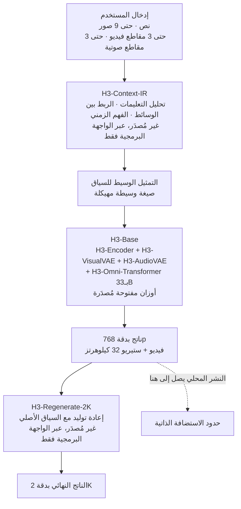

حين يصدر نموذج مفتوح الأوزان، تكون أول جملة تدور عادة صيغة من هذا القبيل: صار بإمكان الجميع تشغيله على خوادمهم. ولحق الوصف نفسه بـMiniMax H3 الذي أُطلق في 31 يوليو 2026. يفهم النموذج النص والصور والفيديو والصوت في سياق واحد، ويولّد فيديو بدقة تصل إلى 2K ولمدة تصل إلى 15 ثانية مع صوت ستيريو أصلي. لكن بين كون الأوزان متاحة وكونه يعمل على عنقودك مسافة لا تعرفها إلا بفتح قائمة الملفات وإجراء الحساب.


*إنتاج الصورة والصوت من تسلسل واحد بدل صنعهما منفصلين ثم خياطتهما هو منطلق تصميم H3.*

## لماذا يهمك هذا

هذا المقال لمن يدير عنقود وحدات معالجة رسومية داخليًا وعليه أن يقرر: هل يستضيف نموذج توليد فيديو ذاتيًا أم يستدعي واجهة برمجية؟ الخلاصة أولًا: H3-Base محوّل أحادي التيار بـ33 مليار بارامتر، فيبدو على الورق شبيهًا بتقديم النماذج اللغوية، لكن العنق الحقيقي ليس الأوزان بل طول التسلسل. فمقطع واحد بدقة 2K وطول 15 ثانية ينتج تسلسلًا يتجاوز 325 ألف رمز، والإصدار الأولي يخلو من تنفيذ sparse attention الذي يجعل ذلك محتملًا.

## نظرة عامة

MiniMax H3 نظام توليدي متعدد الوسائط للأغراض العامة. يفهم سياقًا متعدد الوسائط مؤلفًا من نص وصور وفيديو وصوت فهمًا موحّدًا، ويولّد منه فيديو مصحوبًا بصوت ستيريو. مواصفات الإخراج: من 4 إلى 15 ثانية، و24 إطارًا في الثانية، وصوت ستيريو بتردد 32 كيلوهرتز، والضلع القصير الافتراضي 768 بكسل. ويدعم نسب عرض من 21:9 حتى 9:16، ويدعم الحوار بإحدى عشرة لغة دعمًا مستقرًا، من بينها العربية والكورية.

ما يفصله عن مولّدات الفيديو السابقة هو غياب الخيط الذي خِيطت به الوسائط معًا. فرموز النص والرؤية والصوت لا تجلس في صوامع منفصلة لتُدمج في النهاية، بل تتشارك تيار محوّل واحدًا. وبتعبير بطاقة النموذج، لا طبقات الانتباه ولا طبقات FFN تحتوي بنى خاصة بوسيط، والبارامترات الخاصة بالوسائط تقتصر على طبقات الإدخال والإخراج وفروع AdaLN.

الترخيص هو MiniMax H3 Community License. وهو ليس ترخيصًا مفتوح المصدر قياسيًا مثل Apache أو MIT بل ترخيص مجتمعي خاص، فاقرأ بنوده أولًا إن كنت تدرس التوزيع التجاري.

## ما هذا النظام

H3 ليس نموذجًا واحدًا بل نظام من ثلاث وحدات. وهذا التمييز أول ما يجب معرفته عند التخطيط للاستضافة الذاتية، لأن المفتوح المصدر منها هو الوحدة الوسطى فقط.



H3-Context-IR نظام مستضاف للمعالجة المسبقة والتنسيق للمدخلات متعددة الوسائط الحرة الصيغة. ولأنه يعتمد على سير عمل متعدد المراحل وعلى نماذج وخدمات مستضافة متعددة، لم يُدرج في هذا الإصدار. وتوفّر MiniMax واجهة برمجية تعيد إنتاج سير العمل الرسمي، مع دليل مطالبات لبناء نظام معالجة مسبقة خاص بك. لكن كما تنص بطاقة النموذج صراحة، H3-Context-IR حاسم لجودة الناتج النهائي، فتشغيل H3-Base بدونه لن يضاهي العروض الرسمية.

وH3-Regenerate-2K غير مُصدَر أيضًا. والجزء المثير أنه ليس وحدة رفع دقة منفصلة. إذ يعيد إدخال ناتج 768p إلى H3 مع السياق الأصلي متعدد الوسائط ويعيد التوليد بدقة 2K. والميزة أن النصوص الصغيرة والتفاصيل الدقيقة، التي يضطر رفع الدقة التقليدي إلى تخمينها، يمكن استعادتها من السياق الأصلي.

القطعة الوسطى، H3-Base، هي المُصدَرة. يُرمَّز النص بـH3-Encoder الذي يستخدم أوزان Qwen3-VL-32B المدرَّبة مسبقًا كاملة ويمرر الحالات الخفية من طبقته الخمسين إلى المحوّل. وتمر المدخلات البصرية عبر H3-Encoder وH3-VisualVAE معًا، بينما يمر الصوت عبر H3-AudioVAE وحده. ثم يتنبأ H3-Omni-Transformer بكوامن الفيديو والصوت معًا.

مواصفات الـVAE مهمة للحساب لاحقًا. فـH3-VisualVAE مرمّز تلقائي للفيديو سببي زمنيًا بضغط مكاني 16 ضعفًا وضغط زمني 4 أضعاف و24 قناة كامنة. ويُضاف فوقه تقطيع إلى رقع بنسبة 1×2×2 على محاور الزمن والارتفاع والعرض، فيصبح معامل التخفيض المكاني الفعّال للرموز البصرية الداخلة إلى المحوّل 32 ضعفًا. ويبقى المعامل الزمني 4 أضعاف. أما H3-AudioVAE فيستخدم المرمّز وفاكّ الترميز نفسيهما للقناتين اليمنى واليسرى مع معالجة كل قناة على حدة، ويضغط صوت 32 كيلوهرتز إلى رموز كامنة بتردد 40 هرتز لكل قناة.

## التثبيت والتكامل

الوزن الإجمالي أولًا. سحبنا بيان الملفات من واجهة HuggingFace البرمجية وجمعنا ملفات safetensors فقط.

```bash
curl -s "https://huggingface.co/api/models/MiniMaxAI/MiniMax-H3?blobs=true" \
  | jq '[.siblings[] | select(.rfilename|endswith(".safetensors"))
         | {f:.rfilename, b:(.lfs.size // .size)}]'
```

سكربت الحساب موجود في مستودع ThakiCloud، ويجمع البايتات لكل وحدة ويشتق أطوال التسلسل في التشغيل نفسه.

```bash
.venv/bin/python scripts/experiments/minimax_h3_serving_budget.py
```

والمسار الأدنى عبر Diffusers موجود في بطاقة النموذج.

```bash
pip install -U diffusers transformers accelerate
```

```python
import torch
from diffusers import DiffusionPipeline

pipe = DiffusionPipeline.from_pretrained(
    "MiniMaxAI/MiniMax-H3", dtype=torch.bfloat16, device_map="cuda"
)
```

ولنكن صريحين: لم نحمّل H3-Base ونشغّل الاستدلال في هذا العمل. حسبنا الموارد التي يتطلبها أدناه، لكننا لم نخصص عقدة بهذا الحجم لهذه المهمة. لذا لا توجد هنا أرقام عن جودة التوليد أو زمن الاستجابة المقيس. الموجود مشتق كليًا وبصورة حتمية من أحجام الملفات المنشورة ومعاملات الضغط المنشورة.

## النتائج المقيسة

مجموع ملفات safetensors في المستودع كله 464 GiB. لكن لا تقرأ هذا الرقم كسعة مطلوبة، فالأوزان نفسها موزّعة تحت FL2VA وRef2VA وجذر المستودع. أما نشر نسخة واحدة فيتطلب هذا القدر.

| الوحدة | أوزان bf16 | البارامترات (مشتقة) |
|---|---|---|
| H3-Omni-Transformer (H3-Base) | 61.73 GiB | 33.14B |
| H3-Encoder (Qwen3-VL-32B) | 62.13 GiB | 33.36B |
| H3-VisualVAE | 9.70 GiB | 5.21B |
| H3-AudioVAE | 0.56 GiB | 0.30B |
| **مجموع النسخة الواحدة** | **134.12 GiB** | 71.9B |

ويطابق الرقم 33.14B المشتق من البايتات ما ذكرته بطاقة النموذج من 33B، وهو ما يؤكد صحة مسار الحساب.

وتصير جملة واحدة في بطاقة النموذج مهمة هنا. فمن أصل 33 مليار بارامتر في المحوّل، يقع نحو 13 مليارًا في فروع مرتبطة بـAdaLN، ولأن مخرجات تعديل AdaLN يمكن حسابها مسبقًا وتخزينها مؤقتًا، فلا حاجة لتحميل تلك البارامترات في نشر مخصص للاستدلال. وقد صدرت الأوزان كاملة لدعم التطوير اللاحق بما فيه الضبط الدقيق. فإن كنت تنوي الاستدلال فقط، ينخفض جانب المحوّل إلى نحو 20 مليارًا، أي 37.5 GiB بدقة bf16.


*اليسار أوزان كل وحدة مجموعة من بيان الملفات، واليمين أطوال التسلسل المشتقة من معاملات ضغط الـVAE.*

لكن المشكلة الحقيقية ليست الأوزان بل التسلسل. وبتطبيق معاملات الضغط أعلاه:

| إعداد المقطع | الإطارات الكامنة | رموز الفيديو | رموز الصوت | المجموع |
|---|---|---|---|---|
| 768p بنسبة 16:9، 4 ثوانٍ | 24 | 24,768 | 320 | 25,088 |
| 768p بنسبة 16:9، 15 ثانية | 90 | 92,880 | 1,200 | 94,080 |
| 2K بنسبة 16:9، 15 ثانية | 90 | 324,000 | 1,200 | 325,200 |

وطريقة القراءة كالآتي. المقطع بطول 15 ثانية هو 360 إطارًا أصليًا، يحوّلها الضغط الزمني بأربعة أضعاف إلى 90 إطارًا كامنًا. وباعتبار 768p بنسبة 16:9 مساوية لـ1376 في 768، يعطي الضغط المكاني الفعّال بـ32 ضعفًا مقدار 43 في 24، أي 1,032 رمزًا لكل إطار كامن. وبضربها في 90 إطارًا كامنًا نحصل على 92,880، يضاف إليها 1,200 رمز صوتي. والانتقال إلى 2K يرفع الرموز لكل إطار كامن إلى 3,600، فيصبح المجموع 325,200.

ارتفع عدد الرموز 3.5 أضعاف، لكن كلفة الانتباه الكامل تنمو تربيعيًا، أي نحو 12 ضعفًا. وهنا تذكر بطاقة النموذج أمرًا مهمًا. فقد أُدخل sparse attention أصلي في المرحلة الأخيرة من التدريب لخفض كلفة التسلسلات الطويلة، غير أن **الإصدار مفتوح المصدر الأولي يوفّر الاستدلال بالانتباه الكامل فقط**، على أن يُنشر تنفيذ sparse attention لاحقًا بصورة منفصلة.

وهذه أهم جملة على الإطلاق لأي خطة استضافة ذاتية. فالفجوة بين ما تنتجه الواجهة البرمجية الرسمية وما يمكنك إنتاجه محليًا بالأوزان التي نزّلتها للتو ليست فجوة جودة فحسب بل فجوة كلفة حوسبة أيضًا. فمعالجة تسلسل من 94 ألف رمز بانتباه كامل ميزانية مختلفة تمامًا عن وجود التنفيذ المتناثر.

## ماذا يعني هذا لمنتجات ThakiCloud

تجدول منصة ai-platform لدى ThakiCloud أحمال وحدات المعالجة الرسومية على K8s وKueue وتشغّل تقديمًا متعدد المستأجرين قائمًا على vLLM. ونموذج مثل H3 يفرض على تلك البنية مطالب محددة.

أولًا، تتغير وحدة النشر. فبـ134 GiB تكاد النسخة الواحدة تملأ 141 غيغابايت في بطاقة H200 واحدة بالأوزان وحدها. وبعد حساب القيم النشطة ومساحة عمل الانتباه لتسلسل من 94 ألف رمز، لا تكفي بطاقة واحدة، وحتى إسقاط AdaLN للاستدلال فقط لا يترك هامشًا كبيرًا. والتكوين الواقعي بطاقتا H200 أو أكثر، وتقديم النسختين FL2VA وRef2VA معًا يكلّف بالتناسب أكثر. وبتعبير أحمال Kueue، يصعب وضع هذا النموذج في الطابور نفسه مع حاويات تقديم النماذج اللغوية. فالإشغال لكل طلب طويل وملف الذاكرة مختلف، ففصله في نكهة موارد مستقلة أفضل.

ثانيًا، يتغير تصميم الطابور. فتقديم النماذج اللغوية يتدفق رمزًا رمزًا، فتمر الطلبات في دفعات قصيرة، بينما يحتجز توليد الفيديو وحدة معالجة رسومية مدة طويلة لطلب واحد. ويضيف سير عمل 2K فوق ذلك تمريرة إعادة توليد بعد التوليد بدقة 768p. ولأن زمن الاستجابة الذي يراه المستخدم مجموع المرحلتين، ينبغي تصميم سياسة الطابور حول زمن الإنجاز لا حول الإنتاجية.

ثالثًا، يلائم الطلب على التشغيل المحلي ملاءمة جيدة. فمواد توليد الفيديو حساسة بطبيعتها غالبًا. فاللقطات الخام وصور المنتجات والفيديوهات التي تظهر فيها وجوه من داخل المؤسسة أصول يصعب إرسالها إلى واجهة برمجية خارجية. والقدرة على تشغيل نموذج مفتوح الأوزان داخل حدود العميل تلبي هذا المطلب وحدها. غير أنه مع بقاء H3-Context-IR وH3-Regenerate-2K غير مُصدَرين، لا يمكن حاليًا بناء تكوين محلي بالكامل. إذ عليك بناء نظام معالجة مسبقة خاص بك وفق دليل المطالبات، وأما 2K فإما عبر الواجهة البرمجية أو تكتفي بـ768p. وشرح هذه الفجوة للعملاء بدقة هو أنزه ما يمكن فعله في هذه المرحلة.

ويبقى أمر يُضاف من عدسة Paxis. فما يفعله H3-Context-IR، أي تحليل المدخلات متعددة الوسائط الحرة الصيغة وتفسير العلاقات بين الوسائط وتسلسلها في تمثيل وسيط مهيكل، هو في حقيقته مسألة تنسيق وكلاء. وكونه غير مُصدَر يعني بالمقابل أن المكان شاغر لتملأه أنت. فباستخدام تركيب الوكلاء المتعددين بصيغة DAG وبوابات السياسات في Paxis، يمكنك جعل خط أنابيب تنقية المدخلات قابلًا للتدقيق وتتبّع أي إثراء للمطالبة أدى إلى أي ناتج. ولأي مؤسسة عليها أن تجيب عن النتائج المولَّدة، تأتي هذه القابلية للتتبع قبل جودة الصورة.

## الحدود والاعتراضات

لأرقام هذا المقال حدود واضحة. فلم نحمّل النموذج وننتج فيديو، لذا تغيب جودة التوليد وزمن الاستجابة الفعلي والذروة الفعلية للذاكرة. وأحجام الأوزان تأتي بدقة من بيان الملفات، لكن القيم النشطة ومساحة عمل الانتباه تتباين كثيرًا بحسب التنفيذ. لذا فإن الـ134 GiB أعلاه حد أدنى للذاكرة المطلوبة لا المتطلب الفعلي.

ويقوم حساب طول التسلسل كذلك على افتراض. فقد اعتبرنا 768p بنسبة 16:9 مساوية لـ1376 في 768 بكسل، بينما تنص بطاقة النموذج على أن الضلع القصير 768 فقط، فقد يختلف الضلع الطويل قليلًا بحسب التنفيذ. أما الضغط المكاني الفعّال بـ32 ضعفًا والزمني بأربعة أضعاف فقيمتان منشورتان، فلا تتغير رتبة المقدار.

ويستحق الترخيص إشارة أيضًا. فـMiniMax H3 Community License ليس ترخيصًا مفتوح المصدر قياسيًا ويتضمن قيود استخدام. وتنص بطاقة النموذج على أن النصوص والصور والفيديوهات المقدَّمة من المستخدمين، وكذلك المطالبات المُثراة، تخضع لمراجعة آلية، وأن المحتوى المشتبه بمخالفته للقانون أو بإباحيته أو بانتهاكه حقوق أطراف ثالثة قد يُحجب. كما تنص صراحة على أن هذه الضمانات لا تحل محل التزامات المرخَّص له. فإن كنت تخطط لخدمة تجارية، فالمراجعة القانونية تسبق المراجعة التقنية.

وأخيرًا، لا تنتصر الاستضافة الذاتية دائمًا. فبدون sparse attention قد لا تكون كلفة إنتاج مقطع 2K بطول 15 ثانية محليًا مواتية مقارنةً بتسعير الواجهة البرمجية. وإن كان التوليد نادرًا والمواد غير حساسة، فالواجهة البرمجية خيار معقول. فمسوّغ الاستضافة الذاتية عادةً هو حدود البيانات لا سعر الوحدة.

## الخلاصة

MiniMax H3 نموذج متعدد الوسائط ينتج الصورة والصوت في تيار واحد، وقد صدر قلبه H3-Base بـ33 مليار بارامتر بأوزان مفتوحة. وثلاثة أرقام تهم عند تقييم الاستضافة الذاتية: 134 GiB من الأوزان لنسخة واحدة، و94 ألف رمز لمقطع 768p بطول 15 ثانية، و325 ألف رمز عند الانتقال إلى 2K. ويلحق بها جميعًا شرط واحد: الإصدار الأولي بلا sparse attention، فيجب معالجة تلك التسلسلات بانتباه كامل.

وإن اخترت إجراءً واحدًا فليكن هذا. بدل أن تقرر الآن اعتماد H3 من عدمه، تحقق أولًا مما إذا كانت المواد التي تحتاج توليد فيديو لها لا يمكنها فعلًا مغادرة حدودك. فإن كانت كذلك، فنشر H3-Base محليًا بدقة 768p مع خط معالجة مسبقة خاص بك أمر تستطيع بدءه اليوم. وإن لم تكن كذلك، فالأفضل انتظار تنفيذ sparse attention والوحدتين الأخريين ثم إعادة الحساب. وحين يحين ذلك، أعد تشغيل سكربت هذا المقال كما هو.

## المصادر

- بطاقة النموذج: [MiniMaxAI/MiniMax-H3 على HuggingFace](https://huggingface.co/MiniMaxAI/MiniMax-H3)
- الإعلان الرسمي: [MiniMax H3: An Open Model Breaking the Boundaries Between Tasks and Modalities](https://www.minimax.io/blog/minimax-h3)
- واجهة بيان الملفات: `https://huggingface.co/api/models/MiniMaxAI/MiniMax-H3?blobs=true`
- سكربت الحساب لهذا المقال: `scripts/experiments/minimax_h3_serving_budget.py` (مستودع ThakiCloud الداخلي)
