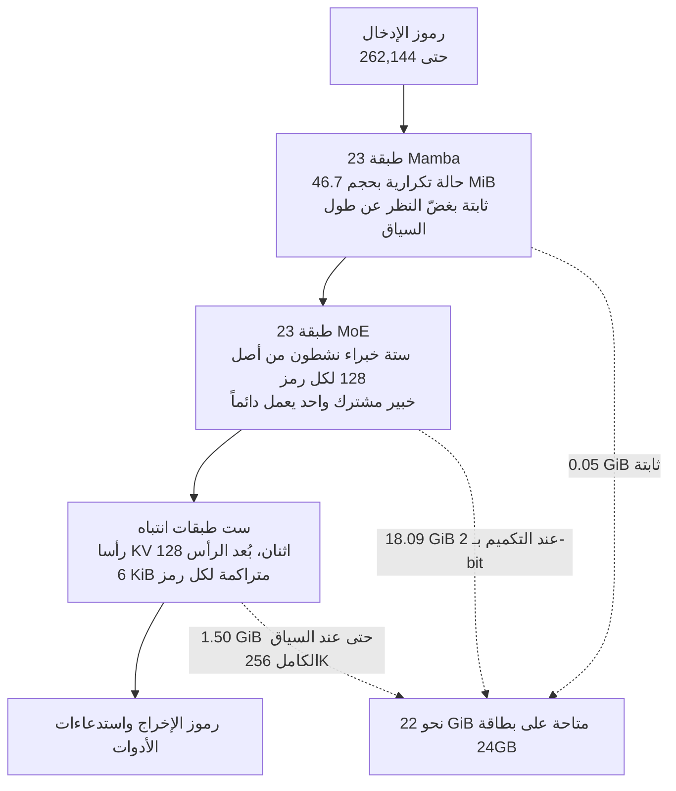

*لم يكن السؤال يوماً عمّا ضغطته، بل عمّا وضعته في المساحة التي حرّرتها.*

## لماذا تقرأ هذا

هذا المقال موجّه لمهندسي التعلّم الآلي ومسؤولي البنية التحتية الذين يدرسون الاستضافة الذاتية لوكيل يعمل لفترات طويلة عبر استدعاء الأدوات ضمن ميزانية وحدة معالجة رسومية واحدة. الخلاصة أولاً: عند تشغيل Nemotron 3.5 Lightning على بطاقة سعتها 24GB، ما يوقفك هو الأوزان لا السياق الطويل، ما يعني أن اختيار مستوى التكميم هو قرار النشر بأكمله.

عادةً ما يبدأ الحديث عن الوكلاء ذوي السياق الطويل بالقلق من ذاكرة KV. فبعد عشرات استدعاءات الأدوات وعشرات صفحات الويب ينتفخ السياق سريعاً. لكن هذا النموذج يقلب تلك البديهة. فيما يلي نقيس ملفات التكميم السبعة عشر المنشورة، ونقرأ ملف الإعداد الأصلي، ونوضّح سبب الانقلاب وأي مستوى ينبغي اختياره فعلياً.

## نظرة عامة

في الثاني عشر من أغسطس أعلنت Unsloth أن نسختها المكمّمة بـ 2-bit من NVIDIA Nemotron 3.5 Lightning نفّذت استدعاءات أدوات دون توقف لعشر دقائق على 22GB فقط من ذاكرة VRAM، مستشهدةً بأكثر من 80 موقعاً، ومنفّذةً شيفرة برمجية، وباحثةً عن عشرة مواقع حقيقية. هذا التقرير نتيجة عرض توضيحي من Unsloth نفسها وليس رقماً أعدنا إنتاجه، ونحرص على توضيح ذلك منذ البداية.

ما أثار اهتمامنا هو الشرط المسبق. حشر نموذج بحجم 30B داخل 22GB أمر يفسّره التكميم الحادّ. لكن استدعاء الأدوات لعشر دقائق والاستشهاد بثمانين مصدراً يتطلب سياقاً طويلاً، والسياق الطويل يلتهم عادةً ذاكرة VRAM عبر ذاكرة KV. فإذا كانت الأوزان بالكاد تتّسع في 22GB، فلا ينبغي أن يتبقّى مكان للذاكرة المؤقتة.

لذلك قِسنا الأمر. لا تتوفّر لدينا بيئة تشغيل بوحدة معالجة رسومية محلياً، فلم نتمكّن من تشغيل النموذج نفسه. بدلاً من ذلك جمعنا أحجام كل ملفات GGUF المنشورة وملف الإعداد الأصلي كاملاً، ثم حسبنا ميزانية الذاكرة. لم تطابق النتيجة توقّعنا، واتّضح أن الفارق هو قصة التصميم كلها.

## ما هو هذا النموذج

Nemotron 3.5 Lightning 30B-A3B هو، كما يوحي اسمه، نموذج Mixture-of-Experts بإجمالي 30B معامل و3B نشطة منها. لكنه ليس نموذج MoE اعتيادياً قائماً على المحوّلات. تصف بطاقة النموذج البنية بأنها "Mixture-of-Experts Hybrid (Mamba + Transformer)"، ويكشف ملف `config.json` الأصلي المعنى الدقيق لهذه العبارة.

تتوزّع الطبقات الاثنتان والخمسون على النحو التالي: 23 طبقة Mamba، و23 طبقة MoE، و**ست طبقات انتباه فقط**. هناك 128 خبيراً موجَّهاً يُختار منها ستة لكل رمز، إضافةً إلى خبير مشترك واحد يعمل دائماً. أما جانب الانتباه فيعتمد بنية GQA مكثّفة برأسَي KV اثنين وبُعد رأس يبلغ 128.

يغيّر هذا الترتيب طبيعة الذاكرة تماماً. فطبقات الانتباه وحدها تراكم ذاكرة KV تتناسب مع عدد الرموز، بينما تحمل طبقات Mamba حالة تكرارية ثابتة الحجم لا تنمو مع السياق إطلاقاً. ومقارنةً بنموذج تستخدم فيه الطبقات الاثنتان والخمسون كلها الانتباه، يقع عبء الذاكرة لكل رمز في فئة مختلفة كلياً.



جرى التدريب المسبق على أكثر من عشرين تريليون رمز باستخدام وصفة NVFP4. ويتضمّن النموذج طبقات Multi-Token Prediction، ويُشحن معه نموذجا مسوّدة منفصلان باسمَي DSpark وDFlash لغرض فكّ الترميز التخميني. تشير البطاقة إلى دعم سياق يصل إلى مليون رمز مع ملاحظة أن النشر على وحدة H100 واحدة يستخدم 256K، بينما قيمة `max_position_embeddings` في ملف الإعداد هي 262,144. اعتمدت الحسابات أدناه هذا الرقم حدّاً أعلى.

## التثبيت والدمج

حتى الثالث عشر من أغسطس يضمّ مستودع Unsloth تسعة عشر ملف GGUF. نزّل المستوى الذي تحتاجه فقط، فتنزيل كل شيء يتجاوز 400GB.

```bash
# تنزيل مستوى 2-bit واحد فقط
hf download unsloth/NVIDIA-Nemotron-3.5-Lightning-30B-A3B-GGUF \
  --include "*UD-IQ2_XXS*" \
  --local-dir nemotron-lightning
```

شغّله عبر خادم من عائلة llama.cpp. ويحتاج استدعاء الأدوات إلى الخيار `--jinja` كي يُطبَّق قالب المحادثة.

```bash
llama-server \
  -m nemotron-lightning/NVIDIA-Nemotron-3.5-Lightning-30B-A3B-UD-IQ2_XXS.gguf \
  --ctx-size 262144 \
  --jinja \
  --host 0.0.0.0 --port 8080
```

هنا تحذير مهم. قيمة `model_type` هي `nemotron_h` ويستخدم النموذج بنية Mamba هجينة، لذا تحتاج إلى إصدار حديث يدعم هذه البنية. أما إصدارات llama.cpp القديمة فتفشل عند التحميل. وبالنسبة للمعاينة، ابدأ من القيم الموصى بها في البطاقة: temperature 1.0 وtop_p 0.95.

ما شغّلناه فعلياً لم يكن النموذج بل نصاً برمجياً للقياس. يسحب أحجام الملفات من واجهة HuggingFace، ويجمعها لكل مستوى، ويقرأ تركيب الطبقات من ملف الإعداد لحساب ذاكرة KV.

```python
# طبقات الانتباه وحدها تراكم ذاكرة KV
blocks = Counter(config["layers_block_type"])
# {'mamba': 23, 'moe': 23, 'attention': 6}

kv_per_token = 2 * blocks["attention"] * config["num_key_value_heads"] \
                 * config["head_dim"] * 2   # K و V بدقة fp16
# 2 * 6 * 2 * 128 * 2 = 6,144 بايت

# الحالة التكرارية لطبقات Mamba ثابتة لكل تسلسل
ssm = config["mamba_num_heads"] * config["mamba_head_dim"] \
        * config["ssm_state_size"] * 4
```

## النتائج المقيسة

لنبدأ بأحجام الملفات. أظهر ترتيب المستويات السبعة عشر حسب الحجم نطاقاً لم نتوقّعه.

| المستوى | الأوزان | المستوى | الأوزان |
|---|---|---|---|
| UD-IQ1_M | 18.09 GiB | UD-Q4_K_M | 23.53 GiB |
| UD-IQ2_XXS | 18.09 GiB | UD-Q5_K_S | 24.42 GiB |
| UD-IQ2_M | 18.10 GiB | UD-Q5_K_M | 28.14 GiB |
| UD-IQ3_XXS | 18.40 GiB | Q8_0 | 32.60 GiB |
| UD-IQ3_S | 19.70 GiB | UD-Q8_K_XL | 35.96 GiB |
| UD-Q3_K_XL | 19.78 GiB | BF16 | 61.33 GiB |

مستوى 1-bit المسمّى UD-IQ1_M ومستوى 2-bit المسمّى UD-IQ2_XXS **كلاهما 18.09 GiB**، متطابقان حتى المنزلة العشرية الثانية. ويؤكّد فحص أسماء الملفات أنهما ملفان منفصلان فعلاً. تحتفظ طريقة Dynamic من Unsloth بالطبقات الحسّاسة للجودة بدقة أعلى، لذا مهما ضغطت الخبراء الموجَّهين تبقى أرضية عند حدود 18GB. والخلاصة العملية صريحة: **لا يوجد سبب لاختيار مستوى 1-bit.** الحجم نفسه وجودة أدنى.

ثانياً، ذاكرة KV. إذا افترضت أن الطبقات الاثنتين والخمسين كلها تستخدم الانتباه فستحصل على 52.0 KiB لكل رمز. أما حسابها وفق البنية الهجينة الحقيقية فيعطي 6.0 KiB لكل رمز، أي فارق يبلغ **8.7 مرة**. وملء 262,144 رمزاً كاملة يكلّف 1.50 GiB فقط من ذاكرة KV، بينما تبلغ الحالة التكرارية لطبقات Mamba مجتمعةً 46.7 MiB بغضّ النظر عن طول السياق.


*يساراً إجمالي ذاكرة VRAM لكل مستوى، ويميناً فارق ذاكرة KV لكل رمز الذي تصنعه البنية الهجينة.*

بجمع الأمرين، ومقابل 22 GiB التي تتيحها بطاقة 24GB واقعياً، يصبح الجدول كالتالي.

| المستوى | الأوزان | KV عند 256K | حالة Mamba | الإجمالي | الحكم |
|---|---|---|---|---|---|
| UD-IQ2_XXS | 18.09 | 1.50 | 0.05 | 19.64 GiB | مريح |
| UD-IQ3_XXS | 18.40 | 1.50 | 0.05 | 19.95 GiB | مريح |
| UD-IQ3_S | 19.70 | 1.50 | 0.05 | 21.25 GiB | يتّسع |
| UD-Q3_K_XL | 19.78 | 1.50 | 0.05 | 21.33 GiB | يتّسع |
| UD-Q4_K_S | 22.79 | 1.50 | 0.05 | 24.34 GiB | يتجاوز الميزانية |
| UD-Q4_K_M | 23.53 | 1.50 | 0.05 | 25.08 GiB | يتجاوز الميزانية |

وهنا بيت القصيد. المستويات السبعة التي تتّسع ضمن 22 GiB تستطيع جميعها تشغيل **الحدّ الأقصى الكامل البالغ 262,144 رمزاً**. لست مضطراً لتقليص السياق لإفساح المجال. وبالمقابل، كل مستوى عند 4-bit فما فوق يتجاوز الميزانية بالأوزان وحدها حتى لو ضبطت السياق على الصفر. على هذه البطاقة، المتغيّر الوحيد الذي يمكنك تحريكه فعلاً هو مستوى التكميم.

ويتّسق تقرير Unsloth عن عشر دقائق من استدعاء الأدوات المتواصل عند 22GB مع هذه البنية. فبتحميل أوزان 2-bit يتبقّى لديك أكثر من 2 GiB، وهذا الهامش يستوعب أكثر من مئة ألف رمز من سجلّ المحادثة ونصوص الصفحات. والاستشهاد بثمانين مصدراً يتطلّب بقاء تلك الصفحات في السياق، وبمعدّل 6 KiB لكل رمز يصبح ذلك محتملاً.

وينبغي أن نكون بالوضوح نفسه بشأن ما لم نقسه. **لم نُعِد إنتاج الإنتاجية ولا الجودة.** فمن دون بيئة تشغيل بوحدة معالجة رسومية محلياً لم نتمكّن من قياس الرموز في الثانية، ومقدار تدهور دقة استدعاء الأدوات بفعل تكميم 2-bit يقع خارج نطاق هذا القياس. كل الأرقام أعلاه حساب ذاكرة مستنبط من أحجام الملفات وقيم الإعداد، أما سرعة الاستدلال والدقة الفعليتان فتحتاجان تحقّقاً منفصلاً.

## ما يعنيه هذا لـ ThakiCloud

يلامس هذا القياس مباشرةً مشكلة نواجهها تكراراً أثناء تشغيل Metis وPaxis معاً.

**من منظور Metis**، يتبيّن أن الحكم على موضع النشر بعدد المعاملات وحده أمر خطير. فنموذجان بحجم 30B قد يختلفان بأكثر من ثماني مرات في منحنى ذاكرة VRAM عند السياق الطويل تبعاً لكون البنية هجينة أم محوّلات خالصة. ولو قرأت طبقة الخدمة في Metis تركيب الطبقات عند التسجيل، إلى جانب عدد المعاملات ومستوى التكميم، لأمكنها حساب منحنى الذاكرة مسبقاً لكل طول سياق والإجابة عن سؤال "هل يتّسع هذا على تلك البطاقة" قبل أي جدولة. والمعادلة التي استخدمناها هنا هي تحديداً ذلك الحساب. وكلما كانت البيئة أضيق، كما لدى عملاء الاستضافة المحلية الذين لا يستطيعون ببساطة إضافة وحدات معالجة رسومية، وجب أن يكون هذا الحكم صحيحاً من المرة الأولى.

**ومن منظور Paxis** تظهر زاوية أخرى. Paxis هو مستوى التحكّم لدينا في السحابة الأصلية للوكلاء، ويتعامل مع المهارات والأدوات والسياسات وسجلات التدقيق بوصفها موارد من الدرجة الأولى، ويتراكم السياق مع استدعاء الوكلاء للأدوات على مدى طويل. غير أن جزءاً كبيراً من عمل الوكلاء لا يحتاج استدلالاً من الطراز الأول: استدعاء الأدوات، والتحقّق من النتائج، والتنسيق، والتصنيف. ونقل هذه الطبقة إلى نموذج يتّسع على بطاقة واحدة يغيّر بنية تكلفة الرموز. وما يقوله هذا القياس هو أن هذا الخيار صار الآن ضمن ميزانية بطاقة واحدة سعتها 24GB. أما تحديد المهارات التي تُنقَل فعلياً فقرار يأتي بعد اختبار الدقة، وبوابة السياسات في Paxis هي المكان الذي يُفرَض فيه ذلك الحدّ.

ويلتقي المنظوران عند نقطة واحدة. يجب أن تنخفض تكلفة الخدمة كي تتمكّن من تشغيل الوكلاء طويلاً، ويجب أن يعمل الوكلاء طويلاً كي تغطّي الأتمتة عملاً حقيقياً.

## الحدود والاعتراضات

بدايةً، ميزانية 22 GiB نفسها افتراض. فذاكرة VRAM المتاحة فعلياً تتغيّر بحسب التعريف وبيئة التشغيل وما إذا كانت البطاقة تشغّل شاشة أيضاً، ولم نحتسب مخازن التنشيط ولا التجزئة. عملياً، افترض اختفاء 1 إلى 2 GiB إضافية.

وحساب ذاكرة KV بدقة fp16 هو الخيار المتحفّظ. فتكميم الذاكرة المؤقتة إلى 8-bit يخفضها إلى النصف، لكن المساحة الموفَّرة لا تعني الكثير في هذا النموذج لأن السياق لم يكن يوماً عنق الزجاجة. فـ 0.75 GiB المستعادة لا ترفعك مستوىً واحداً.

وأكبر منطقة غير متحقَّق منها هي الجودة. فوجود أرضية عند 18.09 GiB يعني أن Unsloth حمت الطبقات المهمة، لكنه لا يعني أن نموذج 2-bit يضاهي 4-bit. واستدعاء الأدوات تحديداً ينتج مخرجات مهيكلة قد تكون حسّاسة لضرر التكميم، وخطأ واحد في اسم وسيط يُفشل الاستدعاء بأكمله. لذا يلزم قبل التبنّي مرحلة تقيس معدّل نجاح الاستدعاء مقابل مخطّطات أدواتك أنت.

أخيراً، يفترض هذا الحساب طلباً متزامناً واحداً. فخدمة جلسات متعدّدة تضاعف ذاكرة KV وحالة Mamba بعدد الجلسات. غير أن العبء لكل جلسة يبقى صغيراً، ما يجعل البنية مواتية للتزامن أيضاً.

## الخلاصة

تشغيل Nemotron 3.5 Lightning على بطاقة سعتها 24GB يترك لك متغيّراً واحداً: مستوى التكميم. فالسياق يكلّف 1.50 GiB فقط حتى عند حدّه الأقصى، لأن ست طبقات من أصل 52 هي التي تستخدم الانتباه. تجنّب خطأ القلق من السياق الطويل ثم اللجوء إلى مستوى أعلى فتعجز عن تحميل النموذج أصلاً.

أمران تفعلهما الآن. أولاً، احذف مستوى 1-bit من قائمتك المختصرة، فحجمه كحجم 2-bit ولا يكلّفك سوى الجودة. ثانياً، نزّل UD-IQ2_XXS أو UD-Q3_K_XL وقِس معدّل نجاح الاستدعاء مقابل مخطّطات أدواتك. حسم هذا المقال مسألة الاتّساع في الذاكرة، فلم يبقَ سوى سؤال الجودة.

وعلى نطاق أوسع، عند تقييم أي نموذج اكتب تركيب الطبقات إلى جانب عدد المعاملات. فالحالات التي يبلغ فيها هذا الفارق 8.7 مرة ستزداد شيوعاً.

## المصادر

- [منشور Unsloth AI الأصلي على X](https://x.com/UnslothAI/status/2087598047589196052)
- [unsloth/NVIDIA-Nemotron-3.5-Lightning-30B-A3B-GGUF على HuggingFace](https://huggingface.co/unsloth/NVIDIA-Nemotron-3.5-Lightning-30B-A3B-GGUF)
- [دليل تشغيل NVIDIA Nemotron 3.5 Lightning من Unsloth](https://unsloth.ai/docs/models/nemotron-3.5)
- [ggml-org/NVIDIA-Nemotron-3.5-Lightning-30B-A3B-GGUF على HuggingFace](https://huggingface.co/ggml-org/NVIDIA-Nemotron-3.5-Lightning-30B-A3B-GGUF)

أُجريت القياسات في الثالث عشر من أغسطس 2026 مقابل واجهة HuggingFace وملف `config.json` الأصلي. وقد قُرئت جميع أحجام الملفات وقيم الإعداد مباشرةً من استجابات الواجهة.
