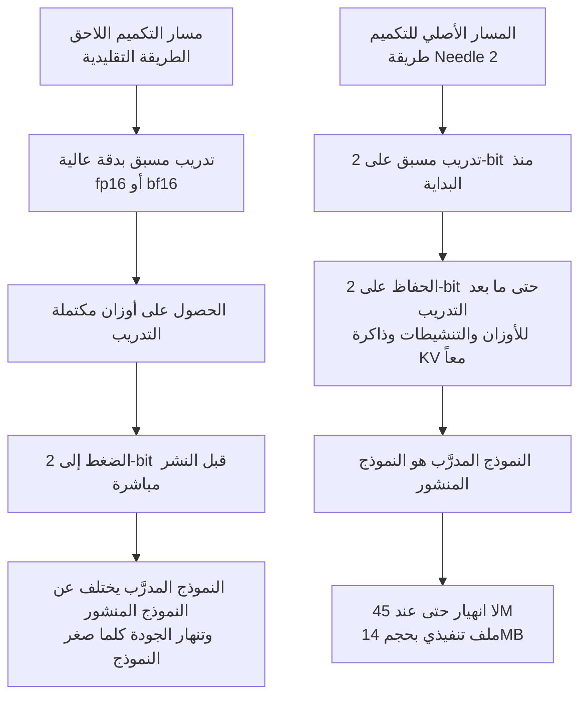

*نجح الضغط هنا لا بسبب حجم ما أُزيل، بل بسبب توقيت بدء الإزالة.*

## لماذا تقرأ هذا

هذا المقال موجّه لمهندسي الأجهزة الطرفية الذين يدرسون تشغيل وكلاء استدعاء الأدوات على المستشعرات والأجهزة القابلة للارتداء والروبوتات حيث لا تتوفّر الشبكة ولا الطاقة بسخاء، ولمسؤولي البنية التحتية الذين يقرّرون في أي مرحلة يُحسم مستوى التكميم. الخلاصة أولاً: ما يكسر النماذج الصغيرة عند 2-bit ليس الدقة نفسها بل عادة إضافتها بعد انتهاء التدريب، وقد عكس Needle 2 هذا الترتيب ليضع خمسة وأربعين مليون معامل في 14MB.

يهمّ هذا التمييز عملياً لأنه ينقل المسؤولية. إذا كان التكميم معالجة لاحقة تُطبّق قبل النشر مباشرة فهو من اختصاص فريق الخدمة. وإذا كان شرطاً مسبقاً للتدريب فيصبح قراراً في مسار التدريب، ولا يبقى عند النشر ما يمكن اختياره. فيما يلي نعرض البنية والأرقام المنشورة وما يغيّره هذا التحوّل.

## نظرة عامة

أطلقت Cactus Compute نموذج Needle 2 في الحادي عشر من أغسطس. هو نموذج بخمسة وأربعين مليون معامل مخصّص لاستدعاء الأدوات، يُوزّع كملف تنفيذي واحد حجمه 14MB، وينفّذ جلسة كاملة ضمن 28MB من الذاكرة. بلغ فك الترميز أكثر من 500 رمز في الثانية على Raspberry Pi 5، وتفيد الشركة بأنه يعمل على متحكمات ESP32-S3 وعلى Meta Quest 3S وعلى هواتف Android بأقل من مئتي دولار.

بالأرقام وحدها يبدو هذا نموذجاً صغيراً إضافياً. فالجيل الأول من Needle من الفريق نفسه كان نموذجاً مقطّراً بستة وعشرين مليون معامل، والنسب مألوف. لكن ما يستحق الانتباه في هذا الإصدار ليس عدد المعاملات بل طريقة التعامل مع الدقة.

بالأمس تناولنا Nemotron 3.5 Lightning بعد تكميمه إلى 2-bit على يد Unsloth. كان ذلك حديثاً عن وضع نموذج MoE بحجم 30B على بطاقة واحدة سعتها 24GB، وكان 2-bit هناك ضغطاً يُطبّق بعد التدريب على أوزان مكتملة. تنجح هذه الطريقة على النماذج الكبيرة، لأن كثرة المعاملات تترك فائضاً تعبيرياً حتى بعد خفض الدقة. المشكلة أن هذا الفائض يتلاشى كلما صغر النموذج، وتطبيق التكميم اللاحق إلى 2-bit عند خمسة وأربعين مليون معامل يُسقط الجودة ببساطة. تجاوز Needle 2 هذا الجدار بالالتفاف حوله لا باختراقه.

## ما هو هذا النموذج

Needle 2 ليس نموذج محادثة عاماً. يستهدف ثلاث مهام: استدعاء الأدوات والتحكّم بالأجهزة واستخراج المعلومات المهيكلة. هذا التضييق هو الشرط الأول الذي يجعل خمسة وأربعين مليون معامل ممكنة. ومقابل التخلّي عن المحادثة المفتوحة، تتركّز السعة على إنتاج استدعاءات دوال تطابق مخططاً معلَناً بثبات.

بنيوياً ينتمي إلى عائلة Simple Attention Network. يحلّ Hadamard MLP محلّ FFN المعتاد في المحوّلات، ويستخدم الانتباه آلية GQA. وفوق ذلك تأتي ذاكرة مفتاح وقيمة يسمّيها الفريق engram إضافة إلى وصلات فائقة متعدّدة المسارات. كما أن بواقي الانتباه وبواقي MLP معيّرة بنمط الشطيرة ومزوّدة ببوابات، وتعمل مواقع engram عند طبقتين.

تبدو هذه المكوّنات غريبة لكنها تشير إلى اتجاه واحد: تأمين القدرة التعبيرية دون زيادة المعاملات. فـ FFN هو أكثر أجزاء المحوّل استهلاكاً للمعاملات ولا يمكن إبقاؤه كما هو ضمن ميزانية خمسة وأربعين مليون معامل، بينما تُخرج ذاكرة منفصلة مثل engram الحقائق إلى صيغة قابلة للاستدعاء بدل حفظها موزّعة داخل الأوزان. ووضع التعيير والبوابات على كل مسار باقٍ يتبع المنطق نفسه، إذ يعمل على كبح تضخّم القيم أثناء التدريب منخفض الدقة. فجعل التدريب على 2-bit ممكناً يتطلّب أن تبقى البنية نفسها ضمن نطاق عددي مستقر، ويصعب قراءة خيارات هذا النموذج البنيوية بمعزل عن ذلك القيد.

أهم قرار تصميمي عملياً يقع في جانب فك الترميز. يقيّد Needle 2 فك الترميز بقواعد نحوية على مستوى البايت مُصرَّفة من المخططات المعلَنة، فيضيّق فضاء الإخراج بحيث لا ينتج النموذج إلا استدعاءات دوال صحيحة نحوياً. والإخفاق المألوف للنماذج الصغيرة في الإخراج المهيكل هو إصابة المقصد مع كسر الصيغة، وحين يفرض وقت التشغيل هذا القيد يختفي هذا الصنف من الإخفاق بأكمله. وتنخفض الصعوبة الملقاة على النموذج بالقدر نفسه.

## لماذا ينهار التكميم اللاحق في النماذج الصغيرة

يتطلّب تقييم ادّعاء Cactus Compute فهم موضع انكسار التكميم اللاحق أولاً. وهذا الجزء أقرب إلى فهم مشترك في أبحاث التكميم منه إلى ادّعاء شركة بعينها.

نقل نموذج مدرَّب إلى دقة أدنى هو في جوهره تقريب. يُقسَّم فضاء القيم المتصل الذي كانت الأوزان الأصلية تشغله إلى عدد محدود من الفئات، وينتقل كل وزن إلى أقرب قيمة ممثِّلة. والخطأ الناتج هو من منظور النموذج اضطراب لم يتدرّب عليه قط. عند 8-bit أو 4-bit تكون الفئات كثيفة بما يكفي ليبقى الاضطراب صغيراً، وتحمل النماذج الكبيرة تكراراً كافياً بين المعاملات بحيث تسند مسارات أخرى الوظيفة حين تهتزّ بعض الأوزان. هذه خلفية نجاح 2-bit عملياً على نموذج 30B الذي تناولناه أمس.

الوضع يختلف عند 2-bit. فالوزن الواحد لا يأخذ سوى أربع قيم، ما يجعل خطأ التقريب يكبر بحدّة. كما تحتوي توزيعات التنشيط عادة على عدد قليل من القيم المتطرفة، وتوسيع نطاق الفئات لاستيعاب تلك القيم يدمّر الدقة تحديداً حيث تتكدّس غالبية القيم. ويتراكم هذا الخطأ طبقة بعد طبقة، والنموذج قليل المعاملات الذي لا يملك مسارات بديلة لا يملك سعة لامتصاص هذا التراكم. والقول إن التكميم اللاحق إلى 2-bit ينهار عند خمسة وأربعين مليون معامل يعني أن هذه السعة قد نفدت.

افتراض 2-bit أثناء التدريب يكسر هذا المنطق. فلأن النموذج يتعلّم تقليل الخسارة على فضاء من أربع قيم منذ البداية، فإنه يجد بنفسه تمثيلات تناسب ذلك الفضاء. ولا يوجد خطأ تقريب يُذكر. ووصف Cactus Compute بأن النموذج المدرَّب والنموذج المنشور هما الملف نفسه فيزيائياً يشير إلى هذا بالضبط.

إدراج الدقة المنخفضة في التدريب ليس جديداً بحدّ ذاته. فالتدريب المدرك للتكميم تقنية قديمة. غير أن العرف جرى على إنهاء التدريب المسبق بدقة عالية ومحاكاة التكميم في نافذة الضبط الدقيق الأخيرة فقط، فبقي معظم التدريب المسبق في فضاء عالي الدقة. وما يقدّمه Needle 2 كفارق هو سحب نقطة التطبيق إلى بداية التدريب المسبق وتوسيع النطاق من الأوزان إلى التنشيطات وذاكرة KV. وشمول ذاكرة KV مهم عملياً بوجه خاص. فتشغيل جلسة كاملة ضمن 28MB لا ينتج عن تقليص الأوزان وحدها، بل يتطلّب ضغط الذاكرة التي تنمو مع طول المحادثة إلى الدقة نفسها.

## التثبيت والدمج

يُوزَّع Needle 2 عبر مستودع `Cactus-Compute/needle2` على Hugging Face، ويُنشر محرّك الاستدلال والنوى معه في `cactus-compute/cactus`. أما مستودع النموذج نفسه فهو `cactus-compute/needle`. وكون وحدة التوزيع ملفاً تنفيذياً واحداً مدمجاً في محرّك بدل ملف أوزان هو ما يميّزه عن إصدار GGUF المعتاد.

يجدر هنا ذكر تحفّظ مسبق. صدر الجيل الأول من Needle برخصة MIT، لكننا لم نتمكّن من التحقق من ترخيص Needle 2 نفسه وقت كتابة هذا المقال. فإن كنت تخطّط لإدراجه في منتج تجاري فراجع بطاقة النموذج مباشرة. كذلك لم يتأكد لنا طول السياق من المواد المنشورة، ولذلك لا نتناوله هنا.

## النتائج المقاسة

نبدأ بمحاولة إعادة الإنتاج بصراحة. بيئة العمل في هذا المقال تمنع تثبيت الحزم وتنزيل النماذج من الخارج، فلم نتمكّن من تنزيل Needle 2 وتشغيله. ولذلك فالأرقام أدناه قيم منشورة من Cactus Compute لا قياسات خاصة بنا، ويجب قراءتها على هذا الأساس. ولم نخلط بها أي أرقام من عندنا.

جرى التقييم على خمسة معايير عامة لاستدعاء الدوال: Mobile Actions من Google، وDroidCall، واختباري Seal-Tools داخل المجال وخارجه، وBFCL v4 أحادي الدور. هذه مجموعة شائعة لتقييم نماذج استدعاء الأدوات، ووجود اختبار خارج المجال يرشّح إلى حدّ ما فرط التخصيص لبيانات التدريب.

تُظهر نتيجة Mobile Actions طبيعة هذا النموذج بأوضح صورة.

| النموذج | درجة Mobile Actions |
|---|---|
| LFM2.5 | 69.1% |
| FunctionGemma | 64.0% |
| **Needle 2** | **63.7%** |

لا يحلّ Needle 2 أولاً في هذا البند. فهو متأخّر عن FunctionGemma بثلاثة أعشار النقطة وعن LFM2.5 بـ 5.4 نقطة. وتغليف ذلك كانتصار كان سيجعل هذا المقال كذباً، فتُرك كما هو. لكن حين نضع إلى جانبه أن كل نماذج المقارنة أكبر بخمسة إلى سبعين ضعفاً وتعمل بدقة f16 كاملة، تتغيّر القراءة. فبتعبير Cactus Compute يقف Needle 2 في موضع يتبادل فيه الغلبة مع هذه النماذج رغم فارق الحجم. أما هل خسارة ثلاثة أعشار النقطة مقابل تقليص الحجم عشرات المرات صفقة جيدة فتحسمه بيئة النشر.

لم تتأكد لنا الدرجات الفردية للبنود الأربعة المتبقية من المواد المنشورة فلم نوردها. ومع ذلك فتركيبة مجموعة التقييم تقول شيئاً. فقد قيس Seal-Tools منفصلاً داخل المجال وخارجه. ونماذج استدعاء الأدوات تفرط في التخصيص بسهولة لقائمة الأدوات التي رأتها أثناء التدريب، وعندها تبدو درجات المعايير قوية بينما ينهار النموذج أمام أول توقيع دالة غير مألوف في منتج حقيقي. ونشر اختبار خارج المجال منفصلاً يُقرأ كإشارة إلى أن هذا الإخفاق لم يُخفَ. فإن كنت تقيّم التبنّي فراجع هذا البند أولاً، لأن قائمة أدواتك ليست في بيانات التدريب على أي حال.

أرقام السرعة أوضح حدساً. يفكّ Raspberry Pi 5 الترميز بأكثر من 500 رمز في الثانية. وبما أن استدعاء أداة واحداً ينتج عادة بضع عشرات من الرموز، فإن هذه السرعة تقع في النطاق الذي لا يدرك فيه المستخدم أي تأخير. أما التشغيل على ESP32-S3 حيث تُقاس الذاكرة بمئات الكيلوبايت فهو الادّعاء الأكثر إثارة. فالأجهزة من هذه الفئة لم تكن حتى الآن أهدافاً لنماذج اللغة بل أطرافاً ترفع البيانات إليها.

## ما يعنيه هذا لـ ThakiCloud

تضع ThakiCloud منصة Paxis في المركز لأتمتة أعمال المؤسسات بالوكلاء، وتوفّر الاستدلال والتدريب والبنية التحتية التي يقوم عليها التنفيذ. والسؤال الذي يطرحه Needle 2 يلامس الحدّ الأدنى من هذا البناء.

من منظور Paxis، هذا النموذج ليس مرشّحاً لاستبدال الوكيل بأكمله بل لنقل الميل الأخير منه. فـ Paxis يعامل المهارات والأدوات والسياسات كموارد من الدرجة الأولى، ويقرّر أي مهارة يختار، ويشغّلها في بيئة معزولة، ويمرّر كل فعل عبر بوابة سياسات وسجلّ تدقيق. ويجب أن يبقى الحكم والسياسة في المركز ضمن هذا التدفّق، لكن حجّة إبقاء الخطوة الأخيرة المتمثّلة في تحويل مخطط محسوم إلى نص استدعاء في المركز ضعيفة. فإنتاج الاستدعاء على الجهاز يزيل تأخير الذهاب والإياب وكلفة الشبكة، والأهم أنه يُبقي العمل قائماً وقت انقطاع الشبكة. وفي المعدّات الميدانية أو المركبات حيث الاتصال غير موثوق، يحسم هذا الفارق وجود الوظيفة من عدمه.

من منظور Metis، يعني هذا درجة إضافية في أسفل سلّم الخدمة. فـ Metis يتولّى الاستدلال وإنتاج الرموز مع إدارة كلفة الوحدة عبر توجيه النماذج والتكميم. وحتى الآن كان أدنى حدود هذا التوجيه أصغر نموذج خادم. وحين تدخل نماذج من فئة Needle النطاق العملي، يمكن للحركة منخفضة الصعوبة وعالية الحجم، مثل الاستدعاءات المتكرّرة على مخطط ثابت، أن تغادر مركز البيانات كلياً. وهذه الحركة عادة قليلة القيمة لكل استدعاء وكثيرة العدد، ما يجعل حصّتها من كلفة الرموز أكبر مما يُتوقّع.

أما الأثر على Maxis فهو الأكثر بنيوية. فحين ينتقل التكميم إلى التدريب المسبق يصبح إنتاج نموذج صغير قابل للنشر ناتجاً من مسار التدريب لا تحسيناً في الخدمة. وMaxis هو الطبقة التي تتولّى الضبط الدقيق والتقطير، والاتجاه الذي يبيّنه Needle 2 يعيد تعريف هدف التقطير: لا تصغير نموذج كبير، بل التدريب عند الدقة المستهدفة منذ البداية ليتطابق النموذج المنشور مع النموذج المدرَّب. وحين يطلب عميل نموذج استدعاء أدوات صغيراً مخصّصاً لمجاله، فإن هذا الفارق يحدّد سقف جودة ما يُسلَّم.

من منظور Aegis، تصبح شروط الشبكات المغلقة أيسر بكثير. فملف تنفيذي بحجم 14MB يدخل دون عناء في معدّات بلا أي اتصال خارجي، ويقتصر تحديثه على استبدال ملف واحد. وكوسيلة لحصر الاستدلال داخل الجهاز في بيئات يُمنع فيها إخراج البيانات، هذه من أبسط الطرق.

## الحدود والاعتراضات

فيما يلي المواضع التي يسهل فيها المبالغة في تقدير هذا النموذج.

أولاً، Needle 2 مخصّص لاستدعاء الأدوات فقط. لا تتوقّع تلخيصاً ولا استدلالاً ولا محادثة. فرقم خمسة وأربعين مليوناً قائم لأن النطاق ضُيّق لا لأن القدرة العامة ضُغطت. وفي اللحظة التي تدخل فيها أي مهمة خارج استدعاء الأدوات يلزم نموذج منفصل، وعندها يجب إعادة حسم قرار وضع اثنين على الجهاز أو العودة إلى المركز.

ثانياً، ينبغي أخذ نتيجة المعيار كما هي: ليست المركز الأول. ففي Mobile Actions يحلّ Needle 2 أخيراً بين ثلاثة. وبإزالة محور الكفاءة مقابل الحجم والنظر إلى الدقة المطلقة وحدها، تكون النماذج الأكبر أفضل. فإن كانت الدقة أهمّ ولو قليلاً في حالتك فهذا النموذج ليس الجواب.

ثالثاً، لم نتمكّن من إعادة إنتاج أي من ذلك بأنفسنا. فكل رقم أعلاه قيمة منشورة من المطوّر لم تمرّ بتحقق مستقل. وتشغيل المتحكمات الدقيقة وإنتاجية Raspberry Pi على وجه الخصوص يتفاوتان كثيراً بحسب ظروف القياس، فقِس على عتادك المستهدف قبل الالتزام.

رابعاً، قيد القواعد النحوية على مستوى البايت سلاح ذو حدّين. فهو يزيل أخطاء الصيغة ويمنع في الوقت نفسه أي إخراج يخرج عن المخطط منعاً قاطعاً. فإن كانت قائمة أدواتك تتغيّر كثيراً أو تُركّب ديناميكياً وقت التشغيل، فيجب تصميم كلفة تصريف القواعد وإجراءات التحديث معها.

خامساً، الترخيص غير مؤكّد. وكون الجيل الأول برخصة MIT لا يضمن الجيل الثاني. فإن كنت تقيّم هذا للنشر التجاري فهذا البند أأمن نقطة للبدء.

## الخلاصة

ما يجب أخذه من Needle 2 ليس رقم 14MB بل الترتيب الذي أنتجه. فالاعتقاد الشائع بأن 2-bit يدمّر النماذج الصغيرة كان صحيحاً فقط بافتراض التكميم اللاحق، وهذا الإصدار يحتجّ بأن حمل الدقة منذ التدريب المسبق يتفادى الانهيار حتى عند خمسة وأربعين مليون معامل. وحين يصبح النموذج المدرَّب والنموذج المنشور شيئاً واحداً، تنتفي المسافة التي كانت الجودة تتسرّب فيها بينهما.

وهكذا يحدث فعلاً نقل المسؤولية الذي ذكرناه في المقدّمة. فحين ينتقل التكميم من مسألة نشر إلى مسألة تدريب، تكفّ استراتيجية النماذج الصغيرة عن كونها متغيّراً يضبطه فريق الخدمة لاحقاً وتصبح ثابتاً يجب تثبيته أثناء رسم خطة التدريب.

وإن اخترت إجراءً واحداً تالياً، فأحصِ الاستدعاءات التي توجّهها حالياً إلى نموذج مركزي وتملك مخططاً ثابتاً وتكراراً عالياً. فالقائمة الطويلة هي مجموعة مرشّحيك للدفع نحو الطرف، وأساس عملي لتقييم نموذج من فئة Needle. أما القائمة القصيرة فتعني أن هذه التقنية ليست مشكلتك بعد، وهذا الحكم أيضاً يُتّخذ بالأرقام.

## المصادر

- [التعريف الرسمي بـ Needle 2، Cactus Compute](https://cactuscompute.com/needle)
- [Cactus-Compute/needle2، Hugging Face](https://huggingface.co/Cactus-Compute/needle2)
- [cactus-compute/needle، GitHub](https://github.com/cactus-compute/needle)
- [محرّك وأنوية cactus-compute/cactus، GitHub](https://github.com/cactus-compute/cactus)
- [نقاش Show HN حول Needle2](https://news.ycombinator.com/item?id=49246804)
