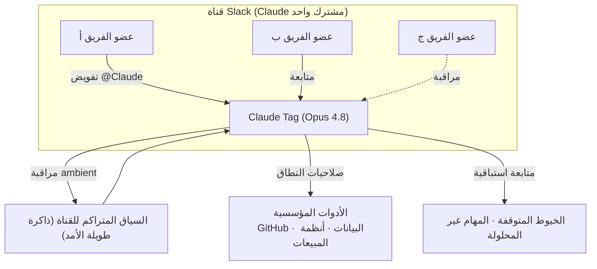

صورة تجسّد هيكل متعدد اللاعبين حيث يعمل Claude واحد في كل قناة Slack مع جميع أعضاء الفريق.

## نظرة عامة

تتحول ساحة منافسة الذكاء الاصطناعي المؤسسي من روبوتات المحادثة المنفردة إلى طبقة التعاون. إذ لا يعمل الناس في نافذة محادثة فردية، بل في قنوات مشتركة تضم الفريق بأكمله؛ ولكي يُستخدم الذكاء الاصطناعي كزميل حقيقي، يجب أن يكون حاضراً داخل تلك القنوات. في 23 يونيو 2026، أقدمت Anthropic على أجرأ خطوة في هذا الاتجاه.

أعلنت Anthropic عن Claude Tag ليحل محل تطبيق Claude in Slack الحالي — وهو وكيل ذكاء اصطناعي مشترك مدمج مباشرة في Slack التابعة لـ Salesforce، ومتاح كإصدار تجريبي وتجريبي للأبحاث لعملاء Claude Enterprise وTeam. يعمل على نموذج Claude Opus 4.8 الذي أُطلق حديثاً، ويمكن لأي شخص في القناة كتابة `@Claude` لتفويض مهام غير متزامنة كإنشاء طلبات السحب، واستخراج مقاييس المبيعات، وتحليل البيانات.

تتناول هذه المقالة Claude Tag من **منظور معمارية الوكلاء** لا من زاوية الأسعار أو العبارات التسويقية. نستعرض ما يميّزه عن تكاملات روبوتات المحادثة التقليدية، وما يغيّره تعدد اللاعبين والسلوك الاستباقي على مستوى العمليات، وما يمثله ذلك من انعكاسات على ThakiCloud بوصفها منصة وكلاء متعددة المستأجرين مبنية على K8s.

## ما الذي جرى؟

تتمحور الإعلانات حول أربعة محاور:

**أولاً، من روبوت محادثة منفرد إلى زميل متعدد اللاعبين.** كانت التكاملات السابقة تعتمد نموذج 1:1 حيث يرتبط كل مستخدم بنسخة ذكاء اصطناعي منفصلة. أما Claude Tag، فيوجد Claude واحد داخل قناة Slack واحدة، ويتفاعل مع جميع أعضائها. يمكن لأي شخص رؤية ما يعمل عليه Claude، والانضمام إلى المحادثة من حيث توقف الآخر.

**ثانياً، السلوك الاستباقي (ambient).** لا ينتظر Claude Tag التعليمات فحسب. فبتفعيل السلوك الاستباقي، يسحب المعلومات ذات الصلة بنشاط من القنوات التي يراقبها ومن الأدوات المتصلة بها، ويتابع تلقائياً الخيوط والمهام التي خمدت دون حل.

**ثالثاً، التعلم عبر الزمن.** يتابع القناة ويراكم سياق ما يجري فيها من عمل. لا يحتاج المستخدم إلى شرح المشروع من البداية في كل مرة — القناة نفسها هي الذاكرة طويلة الأمد للوكيل.

**رابعاً، الوصول إلى الأدوات المؤسسية والتحكم في نطاق البيانات.** يصل Claude Tag إلى الأدوات المؤسسية المتصلة مع إمكانية التحكم في نطاق الوصول إلى البيانات. بوصفه وكيلاً يتعامل مع أدوات العمل الفعلية لا مجرد الردود على الرسائل، تُعدّ حدود الصلاحيات عنصراً جوهرياً في المنتج.

أفصحت Anthropic عن أن نحو 65% من شيفرة فريق منتجاتها يتولد حالياً عبر الإصدار الداخلي من Claude Tag، وأن النمط ذاته يمتد إلى تحليل البيانات وحل تذاكر الدعم.

## كيف يعمل؟

يمكن تصوير Claude Tag من الناحية التشغيلية على النحو التالي:

النقطة الجوهرية هنا أن Claude يحتفظ بـ**الحالة المشتركة** للقناة كجهة واحدة. بخلاف روبوتات المحادثة الفردية التي تحتفظ كل منها بسياق محادثتها الخاص، يدمج Claude Tag سير عمل القناة بأكملها في سياق واحد. هذا هو السبب في أن أحداً يمكنه الاستمرار في عمل بدأه شخص آخر. في الوقت ذاته، يتحد هذا السياق المتكامل مع صلاحيات نطاق الوصول إلى الأدوات المؤسسية، ليكتمل حلقة الوكيل القائمة على "المراقبة + الذاكرة + الإجراء الاستباقي + تنفيذ الأدوات" داخل مساحة التعاون.

## لماذا يهمنا هذا؟

يتحول Slack تدريجياً إلى ميدان المنافسة الرئيسي للذكاء الاصطناعي المؤسسي. أضافت Salesforce في مارس 30 قدرة وكيل إلى Slackbot، وأطلق OpenAI Workspace Agents في أبريل. يتوقع Gartner أن 40% من تطبيقات المؤسسات ستدمج وكلاء ذكاء اصطناعي متخصصة في المهام بحلول نهاية 2026. Claude Tag هو إعلان من Anthropic بأنها ستسيطر مباشرةً على طبقة التعاون.

يدعم حجم رأس المال هذه الجرأة. جمعت Anthropic مؤخراً 65 مليار دولار في جولة Series H بتقييم ما بعد الاستثمار 965 مليار دولار، متجاوزةً معدل إيرادات سنوياً يبلغ 47 مليار دولار[تقديري]، منها أكثر من 2.5 مليار دولار تُسهم بها أداة المطورين Claude Code. بمعنى آخر، Claude Tag هو المنتج الذي ترسّخ به الشركة توجهها نحو "إخراج الذكاء الاصطناعي من نافذة المحادثة ليعيش داخل سير عمل الفريق". وأعلنت Anthropic عن خطط لتوسيع Claude Tag ليشمل Microsoft Teams والبريد الإلكتروني وأدوات إدارة المشاريع الأخرى خلال الأسابيع المقبلة.

## منظور ThakiCloud: مرآة منصة الوكلاء متعددة المستأجرين

تسعى ThakiCloud إلى بناء منصة SaaS للذكاء الاصطناعي والتعلم الآلي تشغّل وكلاء متعددي المستأجرين على K8s. يعرض Claude Tag بصيغة منتج تجاري المشكلات ذاتها التي يجب أن نحلّها. نرصد ثلاث نقاط جوهرية:

أولاً، **إدارة الحالة المشتركة والذاكرة طويلة الأمد.** يرتبط التصميم القائم على وكيل واحد يحتفظ بسياق متراكم لكل قناة ارتباطاً مباشراً بمشكلة عزل ذاكرة الوكيل وإدامتها لكل مستأجر (أو مساحة عمل) في بيئة متعددة المستأجرين. من يحق له الوصول إلى تلك الذاكرة؟ هل يحتفظ السياق بقيمته عند تغيُّر الأشخاص؟ هل تتجاوز الذاكرة حدود المستأجر؟ كل هذه قرارات تصميم في المنصة. Claude Tag مثال على رفع هذه القرارات إلى سطح المنتج.

ثانياً، **صلاحيات النطاق هي الثقة بعينها.** حين يتعامل الوكيل مباشرةً مع الأدوات المؤسسية، يصبح "ما يُمنع من فعله" أكثر أهمية من "ما يستطيع فعله". هذا بالضبط سبب تأكيد ThakiCloud على الاستضافة المحلية والمنطقة الإقليمية وself-hosting. التحدي الجوهري هو تمكين العملاء من الاستفادة من استباقية الوكيل دون أن يفقدوا السيطرة على بيانات مؤسساتهم. بالنسبة للعملاء الذين يجدون في التفويض الدائم للذاكرة المؤسسية لسحابة بائع واحد عبئاً، تمثّل منصة الوكلاء الذاتية المعزولة بديلاً واضحاً.

ثالثاً، **التحكم في تكلفة الاستباقية.** المراقبة الاستباقية قوية، لكنها تُغير كثيراً في استهلاك الرموز وملامح الفواتير. لتوفير وكلاء استباقيين في منصة متعددة المستأجرين، لا بد من حلقة تُمكّن من تحديد مستوى الاستباقية والحد الأقصى للميزانية لكل مستأجر، وقياس التكلفة الفعلية في جميع الأوقات. تجربة ThakiCloud في الجمع بين جدولة GPU المبنية على Kueue وقياس التكاليف تشكّل نقطة تمايز تحديداً هنا — الانتقال من مجرد "تشغيل الوكيل الاستباقي أو إيقافه" إلى معالجة "درجة استباقيته" كمتغير تشغيلي يُدار بجانب التكلفة.

## القيود والحجج المضادة

Claude Tag ليس الحل الفوري الأمثل لكل مؤسسة. ثمة مخاطر ينبغي لقادة التقنية المؤسسية أخذها بعين الاعتبار قبل التبني.

أولاً، **المراقبة غير المتزامنة المستمرة قد تُغير هيكل استهلاك الرموز والفواتير بصورة جذرية.** وكيل يعمل دائماً يولّد تكاليف دون أن يستدعيه المستخدم صراحةً — وهذا عبء على المؤسسات التي تريد فواتير متوقعة.

ثانياً، **التفويض الدائم للذاكرة المؤسسية إلى ذكاء اصطناعي بائع واحد يرفع ارتباطاً بالمنصة والاعتماد على البائع بصورة كبيرة.** حين تصبح سياقات القنوات أصولاً، يأتي معها خطر تقييد تلك الأصول في بنية تحتية بائع محدد.

ثالثاً، **التوازن بين الاستباقية والسيطرة.** السحب الاستباقي للمعلومات والمتابعة التلقائية مريحان، لكن أخطاء الحكم السياقي أو التدخل المفرط قد يعيقان التعاون. وحتى مع توافر التحكم في نطاق البيانات، تظل السلامة رهينة بكيفية تحديد المؤسسة لحدود الصلاحيات وتدقيقها فعلياً. أخيراً، ينبغي تذكّر أن الإصدار في مرحلة التجريبي وتجريبي الأبحاث. القدرات المُعلنة وأرقام كـ 65% مقيّسة ببيئة Anthropic الداخلية، ولا يوجد ضمان بأنها تتكرر بالقدر ذاته في أعباء عمل المؤسسات العامة.

## المصادر

- [Anthropic Launches Claude Tag to Turn Slack Channels into Agentic AI Workspaces (Techstrong.ai, 2026-06-23)](https://techstrong.ai/articles/anthropic-launches-claude-tag-to-turn-slack-channels-into-agentic-ai-workspaces/)
- [Anthropic launches Claude Tag, replacing its Slack app with a persistent AI teammate (VentureBeat, 2026-06-23)](https://venturebeat.com/technology/anthropic-launches-claude-tag-replacing-its-slack-app-with-a-persistent-ai-teammate-that-learns-monitors-and-works-autonomously)
- [Introducing Claude Tag (Anthropic الإعلان الرسمي)](https://www.anthropic.com/news/introducing-claude-tag)
