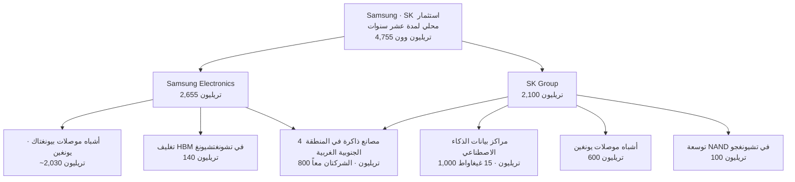

في 29 يونيو 2026، كُشف النقاب في قاعة ضيافة البيت الأزرق عن خطة تاريخية: تعهدت Samsung Electronics وSK hynix باستثمار مشترك قدره 4,755 تريليون وون على المستوى المحلي خلال عشر سنوات المقبلة. جرى ذلك برئاسة الرئيس لي جاه-ميونغ، وبحضور رئيس مجلس الإدارة لي جاي-يونغ ورئيس مجلس الإدارة تشوي تاي-وون جنباً إلى جنب. غير أن وسائل الإعلام الدولية ومنصات التواصل الاجتماعي تداولت الإعلان ذاته تحت رقم "880 مليار دولار"، فيما أشارت بعض المصادر إلى "1.3 تريليون دولار"، وأخرى إلى "520 مليار دولار".

فلماذا تتباين الأرقام إلى هذا الحد رغم أنها تصف الإعلان نفسه؟ تتولى هذه المقالة التحقق من مصدر كل رقم من خلال الوثائق الأولية، وإيضاح الهيكل الحقيقي للإعلان، واستجلاء ما يعنيه ذلك للمشغلين الذين يديرون بنية تحتية للذكاء الاصطناعي كمنصتنا.

## "880 مليار دولار" ليست رقماً رسمياً صادراً عن أي جهة

نبدأ بالخلاصة مباشرة: لم تُعلن Samsung، ولا SK، ولا الحكومة الكورية رسمياً عن رقم "880 مليار دولار". جميع التقارير الإعلامية الكورية الأولية استخدمت وحدة التريليون وون فحسب، دون تقديم أي تحويل إلى الدولار.

نشأ رقم 880 مليار دولار حين حولت وكالة Bloomberg جزءاً من الاستثمار الإجمالي فقط، وهو المتعلق بمراكز البيانات وبعض قطاع أشباه الموصلات، ما يعادل "ما لا يقل عن 1,350 تريليون وون"، باستخدام سعر صرف يبلغ نحو 1,534 وون للدولار، وهو ما أنتج تقديراً ثانوياً لا رقماً رسمياً. أما رقم 1.3 تريليون دولار فيُشير إلى نطاق تجميعي مختلف، في حين يمثل رقم 520 مليار دولار تحويلاً خاصاً بمصانع المنطقة الجنوبية الغربية وحدها. بمعنى آخر، الأرقام الدولارية المتداولة في العناوين الإخبارية الدولية تجمع بنوداً متباينة، وتطبق عليها أسعار صرف مختلفة.

الصورة الدقيقة لا تتضح إلا بالوون. يبلغ المجموع المُعلن 4,755 تريليون وون، وهو حاصل جمع 2,655 تريليون وون من Samsung و2,100 تريليون وون من SK. يتطابق هذا الرقم في تقارير الصحافة الكورية الأولية المتعددة، من بينها الأخبار المالية وآجو إيكونوميك نيوز وINA وMBC. وإذا أردنا التحويل إلى الدولار، فعند تطبيق سعر الصرف السائد وهو 1,380 وون للدولار، يبلغ الرقم نحو 3.4 تريليون دولار. أما 880 مليار دولار فلا تمثل سوى جزء من الإجمالي محسوباً بسعر صرف مرتفع.

> **ملاحظة للاستشهاد**: عند الاستشهاد بأرقام هذا الإعلان يجب الإشارة إلى القيمة الأصلية بالوون وسعر الصرف المستخدم. الاكتفاء بالرقم الدولاري وحده قد يوهم بتباين يصل إلى أربعة أضعاف بين تقارير تصف الحدث ذاته.

لاستيعاب حجم 4,755 تريليون وون، قارنه بالميزانية السنوية للحكومة البالغة نحو 728 تريليون وون؛ تمثل خطة الاستثمار العشرية للمجموعتين ما يعادل 6.5 أضعاف الميزانية السنوية للدولة. غير أن هذا رقم تراكمي يمتد على أكثر من عشر سنوات، وتجدر الإشارة إلى أن مجموع النفقات الرأسمالية السنوية الحالية للشركتين يبلغ نحو 70 تريليون وون (نحو 41 تريليون لقسم DS في Samsung، ونحو 29 تريليون لـ SK hynix).

## الهيكل الحقيقي للإعلان: مصنع الذاكرة بقيمة 800 تريليون وون في المنطقة الجنوبية الغربية

ضمن مجموع 4,755 تريليون وون، يمثل مصنع الذاكرة في المنطقة الجنوبية الغربية (هونام) التزاماً بالغ الأهمية. ستضخ Samsung وSK كل منهما 400 تريليون وون، بإجمالي 800 تريليون وون، لإنشاء أربعة مصانع للذاكرة (اثنان لكل شركة). وقد أشار رئيس مجلس الإدارة لي جاي-يونغ صراحةً إلى مدينة غوانغجو مرشحةً للمجمع الجديد. وتتوزع البنود الأخرى على النحو التالي:

ثمة رقمان يثيران التباساً متكرراً يستحق التوضيح: "1,000 تريليون وون" من SK تمثل المبلغ الإجمالي الذي تقوده SKT لبناء مراكز بيانات ذكاء اصطناعي بطاقة 15 غيغاواط على المستوى الوطني بحلول عام 2035. أما "100 تريليون وون" فبند مختلف تماماً، وهو استثمار SK hynix في توسعة إنتاج ذاكرة NAND Flash في تشيونغجو. الرقمان لا يتعارضان، بل يُشيران إلى مشروعين منفصلين. وإذا أخذنا في الاعتبار أن تكلفة بناء مركز بيانات بطاقة 1 غيغاواط تتراوح عادةً بين مليار و3 مليارات دولار، فإن 1,000 تريليون وون لـ 15 غيغاواط تبدو متسقة تقريباً مع هذه المعطيات.

## لماذا الآن وبهذا الحجم: دورة HBM الفائقة

يتمحور الدافع وراء هذه الأرقام الضخمة حول عامل واحد: الطلب على HBM أو الذاكرة عالية النطاق الترددي. HBM ذاكرة عالية القيمة المضافة تُركَّب في طبقات فوق معجلات الذكاء الاصطناعي، وتبلغ قيمتها الوحدوية 5 إلى 7 أضعاف قيمة DRAM التقليدية. ويُتوقع أن ينمو سوق HBM العالمي من نحو 35 مليار دولار في عام 2025 إلى ما بين 54.6 و58 مليار دولار في عام 2026، أي بمعدل نمو يتجاوز 58%.

جذور الطلب تضرب في نفقات مزودي الخدمات السحابية الكبرى. تجاوزت النفقات الرأسمالية لـ Amazon وMicrosoft وGoogle وMeta وOracle المخصصة للبنية التحتية للذكاء الاصطناعي في عام 2026 حاجز 600 مليار دولار، وارتفعت حصة الذاكرة منها إلى نحو 30%، وهو قفزة من 8% في الفترة بين 2023 و2024. أفضت طلبات Blackwell وRubin من NVIDIA وحدها إلى تراكم أوامر شراء بمئات المليارات من الدولارات، وقد بيع إنتاج عام 2026 بالكامل من موردي HBM الثلاثة: SK hynix وMicron وSamsung.

الأمر الجوهري هنا أن عنق الزجاجة ليس نقصاً في رأس المال، بل نقصاً في طاقة التصنيع؛ المشكلة ليست في التمويل بل في شح المصانع. ولهذا تتجه الشركتان في آن واحد نحو التوسع الكبير. سجلت SK hynix هامش ربح تشغيلياً بلغ 47% في الربع الثالث من عام 2025، وهو ما أتاح دورة حميدة يُعاد فيها توجيه هذه العوائد نحو مرافق يونغين وتشيونغجو.

## البنية الداعمة للسياسات: القانون الخاص بأشباه الموصلات

انتهجت كوريا الجنوبية دعم قطاع أشباه الموصلات عبر الإعفاءات الضريبية بدلاً من المنح النقدية المباشرة كما في الولايات المتحدة وأوروبا. رفع قانون K-Chips الصادر في فبراير 2025 نسبة الإعفاء الضريبي على استثمارات المنشآت للشركات الكبرى من 15% إلى 20%، ومدَّد الإعفاء على البحث والتطوير حتى عام 2031، بما يُقدَّر بتخفيض ضريبي إجمالي يناهز 6 تريليونات وون للشركتين مجتمعتين.

أضف إلى ذلك القانون الخاص بأشباه الموصلات الصادر في يناير 2026، الذي أرسى أساساً قانونياً لمساهمة الحكومة المركزية والمحلية المباشرة في إنشاء البنية التحتية الصناعية من طاقة ومياه وطرق. ومن المقرر تطبيق هذا القانون في الربع الثالث من 2026. يظل توفير البنية التحتية من طاقة ومياه في الوقت المحدد وفق هذا القانون متغيراً حاسماً لانطلاق مصانع هونام البالغة 800 تريليون وون. ولهذا السبب طلب غوك نو-جونغ الرئيس التنفيذي لـ SK hynix صراحةً، في الحفل الإعلاني، تطبيق القانون الخاص على مجمع يونغين وتحسين ظروف الإقامة في المناطق المحيطة به.

## المنافسة العالمية: التوسع المتزامن لموردي HBM الثلاثة

| الشركة | الترتيب | أبرز الاستثمارات | وضع HBM |
|---|---|---|---|
| SK hynix | رائدة الذاكرة | 600 تريليون وون ليونغين وغيرها | حصة HBM ~57%، أولوية إمداد HBM4 |
| Samsung Electronics | لاحقة في الذاكرة | ~2,030 تريليون وون لبيونغتاك ويونغين | حصة HBM ~35%، توسعة 50% في 2026 |
| Micron | المرتبة الثالثة في الذاكرة | نفقات رأسمالية ~20 مليار دولار للسنة المالية 2026 | HBM 2026 مبيع بالكامل، إنتاج HBM4 في الربع الثاني |
| TSMC | التصنيع بالعقود | 165 مليار دولار لأريزونا | تغليف CoWoS مبيع بالكامل حتى 2026 |

الإنتاج الحالي لموردي HBM الثلاثة لعام 2026 مبيع بالكامل. المعضلة تتعلق بالفترة 2027-2028؛ إذا لم تكن مصانع كوريا الجديدة جاهزة للعمل آنذاك، فقد يستحوذ Micron على نصيب من الطلب المتزايد على HBM4 وHBM5. على صعيد التصنيع بالعقود، ضخت TSMC 165 مليار دولار في أريزونا وحدها، وملأت طاقة تغليف CoWoS حتى عام 2026، فيما انسحبت Intel فعلياً من المنافسة في HBM بعد إعادة هيكلة أعمال التصنيع لديها.

## الطاقة عنق الزجاجة الحقيقي: التنافس على مواقع مراكز البيانات

منذ الربع الأول من عام 2026، انتقل عنق الزجاجة الرئيسي في البنية التحتية للذكاء الاصطناعي من الرقائق إلى الطاقة الكهربائية. في الولايات المتحدة، تأخرت مشاريع مراكز بيانات بطاقة إجمالية تناهز 7 غيغاواط أو أُلغيت بسبب شح الطاقة. ومفارقة القدر أن ذلك يرفع من جاذبية المنطقة الجنوبية الغربية في كوريا والشرق الأوسط كمواقع قادرة على توفير الطاقة والأراضي.

خطة SK لبناء مراكز بيانات ذكاء اصطناعي بطاقة 15 غيغاواط على المستوى الوطني بحلول 2035 بتكلفة 1,000 تريليون وون ليست مجرد استثمار عقاري. حين يبني مصنع الذاكرة مراكز البيانات التي يمد إليها HBM بنفسه، فإنه يُولّد الطلب بنفسه، ويستعيد قوة تفاوضية في سلسلة توريد تتحكم فيها NVIDIA ومزودو الخدمات السحابية في تحديد المواصفات. وتسير Samsung في الاتجاه ذاته من خلال مركز بيانات الذكاء الاصطناعي في هايانام ومصنع لوحات خوادم الذكاء الاصطناعي في سيجونغ، مستهدفةً التكامل الرأسي نفسه.

## منظور ThakiCloud: كلما توسعت قاعدة الأجهزة، ازدادت أهمية طبقة البرمجيات

جوهر هذا الإعلان أن كوريا الجنوبية تتجه نحو التكامل الرأسي للبنية التحتية للذكاء الاصطناعي على المستوى الوطني، وهو ما يتقاطع مباشرةً مع عمل منصة ai-platform لدى ThakiCloud.

أولاً، مع توسع مراكز البيانات المحلية إلى طاقة 15 غيغاواط، سيتنامى الطلب على البنية التحتية متعددة المستأجرين اللازمة لتدريب النماذج وتشغيلها فوقها. تستهدف ThakiCloud هذه الطبقة تحديداً من خلال جدولة GPU المبنية على Kubernetes وKueue، وتشغيل vLLM. حين توفر المصانع ومراكز البيانات الأجهزة، يصبح مستوى التحكم القادر على عزل أحمال عمل العملاء المتعددين وإدارتها بأمان ضرورةً لا غنى عنها.

ثانياً، سيتصاعد الطلب على الذكاء الاصطناعي السيادي والتشغيل المحلي. كثير من القطاعات الاستراتيجية والمؤسسات الحكومية ملزمة بتشغيل نماذجها داخل مراكز بياناتها الخاصة بدلاً من السحابة العامة، لا سيما تلك الخاضعة لمتطلبات أمنية صارمة. تتلاءم قدرات ThakiCloud في التشغيل الذاتي والعزل متعدد المستأجرين والتشغيل الفعال من حيث التكلفة تلاءماً دقيقاً مع هذا الطلب.

ثالثاً، وربما الأهم: كلما توافرت HBM ووحدات معالجة الرسوميات عالية الأداء، انتقل محور التنافس من "من اشترى أكثر" إلى "من يُدير بكفاءة أعلى". إدارة دورة حياة GPU وأنظمة الطابور التي تمنع توقف المعجلات الباهظة الثمن هي في نهاية المطاف ما يُحدد التكلفة. تُقدم ThakiCloud قيمتها بالضبط في طبقة البرمجيات التي تُعظّم الاستفادة من الأجهزة التي ستُنتجها هذه الاستثمارات البالغة 4,755 تريليون وون. الإنفاق الرأسمالي الكبير يبني الأجهزة، لكن رفع معدلات استخدامها يظل مهمة المُجدوِل ومحرك التشغيل.

## حدود التفاؤل: لا مجال للاسترخاء التام

قراءة هذا الإعلان على أنه بشرى خير لا غبار عليها قراءة مجتزأة. لنُدرج بصدق الحجج المعاكسة.

أولاً، 4,755 تريليون وون خطة تراكمية تمتد عشر سنوات، لا أرقام إنفاق سنوية موثقة. طبيعة الحدث الحكومية قد تضفي عليه تحيزاً تصاعدياً، وقد شهد مجمع يونغين البالغ 622 تريليون وون المُعلَن عام 2024 تأخيرات في الجدول الزمني. الفجوة بين الإعلان والتنفيذ ظاهرة دائمة.

ثانياً، إذا انتهت دورة HBM الفائقة، يتحول التوسع الراهن إلى فائض إنتاج مستقبلي. قطاع الذاكرة تاريخياً ذو دورات حادة. إذا كانت نفقات الذكاء الاصطناعي الرأسمالية مبالَغاً فيها كما يرى بعض المحللين، فقد يتزامن انطلاق المصانع التي ستُفتتح بين 2027 و2028 مع مرحلة تراجع الطلب.

ثالثاً، إذا تأخر توفير البنية التحتية من طاقة ومياه، فحتى المصانع التي كلفت 800 تريليون وون قد تتأخر في التشغيل. بما أن شح الطاقة هو السبب الرئيسي لتأخر مراكز البيانات عالمياً، فهذا مخاطرة فعلية لا مجرد قلق نظري.

أخيراً، حين تجاوزت SK hynix قيمة Samsung Electronics في سوق الأوراق المالية لتحتل المركز الأول في بورصة كوسبي بتاريخ 30 يونيو، ذكّر بعضهم بانعكاس ترتيب Cisco وMicrosoft إبان فقاعة الإنترنت عام 2000، وأشار إليه كإشارة على ذروة السوق. أرجأ معظم المحللين حكمهم إلى أن تتضح مزيد من البيانات التشغيلية والاقتصادية الكلية، غير أن التحذير من أن التقييمات تسبق الأرباح لا يمكن تجاهله.

## خلاصة

الرقم الحقيقي لإعلان 29 يونيو 2026 هو 4,755 تريليون وون، أما 880 مليار دولار فتقدير ثانوي أجرته وسائل الإعلام الدولية على جزء من الإجمالي بسعر صرف مرتفع. يقوم هيكل الإعلان على مصنع الذاكرة بقيمة 800 تريليون وون في المنطقة الجنوبية الغربية ومراكز البيانات الخاصة بالذكاء الاصطناعي السعة 15 غيغاواط من SK، ودورة HBM الفائقة هي المحرك وراء كل ذلك. أما نجاح المشروع فرهين في جوهره بتوفير البنية التحتية من طاقة ومياه في الوقت المحدد.

في حين تبني كوريا الجنوبية أجهزة الذكاء الاصطناعي على النطاق الوطني، تتعاظم قيمة طبقة البرمجيات التي تُعظّم الاستفادة من هذه الأجهزة. ThakiCloud تُرسّخ مكانتها في هذه المساحة تحديداً من خلال التشغيل المبني على K8s وKueue والبنية التحتية السيادية.

## المصادر

- Fnnews, مصانع الذاكرة الأربعة في المنطقة الجنوبية الغربية، Samsung وSK، 4,755 تريليون (2026-06-29): [https://www.fnnews.com/news/202606291837098645](https://www.fnnews.com/news/202606291837098645)
- Newsis, Samsung وSK، مركز أشباه الموصلات في هونام بقيمة 800 تريليون (2026-06-29): [https://www.newsis.com/view/NISX20260629_0003687807](https://www.newsis.com/view/NISX20260629_0003687807)
- Ajunews, مراكز بيانات الذكاء الاصطناعي SKT بطاقة 15 غيغاواط (2026-06-29): [https://www.ajunews.com/view/20260629171803513](https://www.ajunews.com/view/20260629171803513)
- Hankyung, 600 تريليون ليونغين و100 تريليون لتشيونغجو (2026-06-29): [https://www.hankyung.com/article/2026062943107](https://www.hankyung.com/article/2026062943107)
- CNBC, South Korea Samsung SK Hynix mega-projects (2026-06-29): [https://www.cnbc.com/2026/06/29/samsung-sk-hynix-reported-1point3-reported-trillion-spending-plans.html](https://www.cnbc.com/2026/06/29/samsung-sk-hynix-reported-1point3-reported-trillion-spending-plans.html)
- SK hynix, 2026 Market Outlook (HBM Supercycle): [https://news.skhynix.com/2026-market-outlook-focus-on-the-hbm-led-memory-supercycle/](https://news.skhynix.com/2026-market-outlook-focus-on-the-hbm-led-memory-supercycle/)
- TrendForce, Micron CapEx $20B · 2026 HBM booked (2025-12-18): [https://www.trendforce.com/news/2025/12/18/news-micron-hikes-capex-to-20b-with-2026-hbm-supply-fully-booked-hbm4-ramps-2q26/](https://www.trendforce.com/news/2025/12/18/news-micron-hikes-capex-to-20b-with-2026-hbm-supply-fully-booked-hbm4-ramps-2q26/)
- سياسة كوريا، قانون أشباه الموصلات الخاص يجتاز البرلمان (2026-01-30): [https://www.korea.kr/briefing/pressReleaseView.do?newsId=156742072](https://www.korea.kr/briefing/pressReleaseView.do?newsId=156742072)
