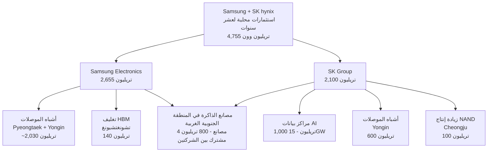

في 29 يونيو 2026، صدر إعلان ضخم من قصر الضيافة في الرئاسة الكورية. أعلنت شركتا Samsung Electronics وSK hynix عن خطط لاستثمار ما مجموعه 4,755 تريليون وون داخل كوريا خلال السنوات العشر المقبلة. جاء هذا الإعلان في اجتماع "التقرير الوطني الشعبي للمشاريع الثلاثة الكبرى للقفزة الكبرى في كوريا" الذي ترأسه الرئيس لي جيه-مونغ، وأعلن فيه الرئيسان التنفيذيان لي جيه-يونغ وتشوي تاي-وون عن هذا الالتزام مباشرة.

يستعرض هذا المقال تفاصيل ما أُعلن في ذلك اليوم بشكل منهجي: ما الذي سيُبنى، وأين، وبأي تكلفة، وما السياق الصناعي والسياسي وراء ذلك، وما الذي يعنيه هذا لمشغلي البنية التحتية للذكاء الاصطناعي.

## ما الذي أُعلن؟

لم يكن الإعلان مجرد تقرير مستقل من الشركتين، بل كان إعلاناً عن مشروع وطني ضخم وصفه الرئيس بـ"الثورة الصناعية للذكاء الاصطناعي على النمط الكوري". الجهتان المستثمرتان: مجموعة Samsung بمبلغ 2,655 تريليون وون، ومجموعة SK بمبلغ 2,100 تريليون وون، على مدى عشر سنوات داخل كوريا، ليبلغ المجموع 4,755 تريليون وون، أي ما يعادل 6.5 أضعاف الميزانية الحكومية السنوية (نحو 728 تريليون وون).

أشار الرئيس التنفيذي لي جيه-يونغ إلى مدينة غوانغجو مباشرة بوصفها الموقع المرشح لمجمع أشباه الموصلات الجديد، قائلاً: "نخطط لاتخاذ غوانغجو موقعاً مرشحاً حيث نتطلع إلى الحصول على دعم حوافز". وأكد الرئيس التنفيذي تشوي تاي-وون أن الهدف هو تحويل كوريا من "دولة تستهلك الذكاء الاصطناعي إلى دولة تصدّره". كما طالب الرئيس التنفيذي لـSK hynix غوانغ نو-جيونغ بتطبيق قانون أشباه الموصلات الخاص على مجمع Yongin وبتحسين ظروف المعيشة في المناطق.

تجدر الإشارة إلى أن مبلغ 4,755 تريليون وون يمثل إجمالي المبالغ المخططة للتنفيذ على مدى عشر سنوات أو أكثر، وليس نفقات سنوية. يبلغ إجمالي الإنفاق الرأسمالي السنوي للشركتين حالياً نحو 70 تريليون وون (نحو 41 تريليون لـSamsung DS ونحو 29 تريليون لـSK hynix). ينبغي التمييز بين حجم الإعلان ووتيرة التنفيذ السنوية.

> ملاحظة حول التحويل إلى الدولار: أفادت وسائل الإعلام الدولية بأرقام متباينة كـ880 مليار دولار و1.3 تريليون دولار و520 مليار دولار، وذلك بسبب اختلاف نطاقات الاحتساب وأسعار صرف العملات المعتمدة. المرجع الأوضح هو الرقم بالوون الكوري، وإذا أريد التحويل فإن 4,755 تريليون وون تعادل نحو 3.4 تريليون دولار بسعر 1,380 وون للدولار.

## هيكل الاستثمار: 800 تريليون وون لمصانع المنطقة الجنوبية الغربية و15 غيغاواط لمراكز البيانات

أكثر الالتزامات إلزامية ضمن إجمالي 4,755 تريليون وون هي مصانع الذاكرة في المنطقة الجنوبية الغربية (هونام). ستضخ كل من Samsung وSK hynix 400 تريليون وون، ليبلغ مجموع استثمارهما 800 تريليون وون لإنشاء أربعة مصانع ذاكرة (مصنعان لكل شركة). وتنظر Samsung في غوانغجو موقعاً مرشحاً. وتوزعت بقية البنود على النحو التالي:

يستحق الاهتمام بند مراكز بيانات الذكاء الاصطناعي من جانب SK، إذ تقود SKT مشروعاً بقيمة 1,000 تريليون وون لإنشاء مراكز بيانات ذكاء اصطناعي بسعة 15 غيغاواط على المستوى الوطني بحلول عام 2035. ونظراً إلى أن تكلفة إنشاء غيغاواط واحد من مراكز البيانات تتراوح عادةً بين مليار وثلاثة مليارات دولار، فإن هذا الحجم يبدو منطقياً مع ما يُخصص لـ15 غيغاواط. يُضاف إلى ذلك استثمار SK hynix المنفصل بقيمة 100 تريليون وون لزيادة إنتاج NAND Flash في Cheongju. وخصصت Samsung نحو 2,030 تريليون وون لأشباه الموصلات في Pyeongtaek وYongin، و140 تريليون وون لتغليف HBM في تشونغتشيونغ.

## لماذا الآن؟ ولماذا بهذا الحجم؟ دورة HBM الفائقة

تتمحور القوة الدافعة وراء هذه الأرقام الضخمة حول عامل واحد: طلب HBM، أي ذاكرة النطاق الترددي العالي. تُعدّ HBM ذاكرة فائقة القيمة تُكدَّس على مسرّعات الذكاء الاصطناعي، وتبلغ قيمتها بين خمسة وسبعة أضعاف DRAM العادية. ومن المتوقع أن ينمو سوق HBM العالمي من نحو 35 مليار دولار عام 2025 إلى نحو 54.6 إلى 58 مليار دولار عام 2026، أي بنسبة نمو تتجاوز 58%.

جذور الطلب هي إنفاق مشغلي الخدمات السحابية الكبار. تجاوز إنفاق Amazon وMicrosoft وGoogle وMeta وOracle الرأسمالي على البنية التحتية للذكاء الاصطناعي عام 2026 حاجز 600 مليار دولار، وارتفعت حصة الذاكرة منه إلى نحو 30% بعد أن كانت 8% بين عامَي 2023 و2024. ويمثل طلب Blackwell وRubin من NVIDIA وحده مئات المليارات من الدولارات في قوائم الطلبيات، وقد بيعت مسبقاً إنتاج عام 2026 لموردي HBM الثلاثة: SK hynix وMicron وSamsung.

الجوهر هنا أن هذه الاختناقات تنشأ من شح الطاقة الإنتاجية لا من شح رأس المال. فالمشكلة ليست نقص الأموال بل نقص المصانع. ولهذا السبب تتجه الشركتان في آنٍ واحد نحو توسع ضخم في الطاقة الإنتاجية. سجّلت SK hynix هامش ربح تشغيلي بلغ 47% في الربع الثالث من عام 2025، وهو ما أتاح دورة إعادة استثمار هذه الأرباح في منشآت Yongin وCheongju.

## دعم السياسات: قانون أشباه الموصلات الخاص

اعتمدت كوريا تاريخياً على الإعفاءات الضريبية لدعم قطاع أشباه الموصلات بدلاً من منح الدعم النقدي المباشر كما تفعل الولايات المتحدة وأوروبا. رفع قانون K-Chips الصادر في فبراير 2025 معدل الإعفاء الضريبي على استثمارات المنشآت للشركات الكبرى من 15% إلى 20%، ومدّد إعفاءات البحث والتطوير حتى عام 2031. ويُقدَّر الأثر الضريبي المشترك للشركتين بنحو 6 تريليونات وون.

يُضاف إلى ذلك قانون أشباه الموصلات الخاص الذي صدر في يناير 2026، والذي يتيح للدولة والسلطات المحلية دعم البنية التحتية الصناعية كالكهرباء والمياه والطرق. ومن المقرر تطبيقه في الربع الثالث من 2026. إن تشغيل مصانع هونام البالغة قيمتها 800 تريليون وون يتوقف توقفاً حاسماً على توفير البنية التحتية للكهرباء والمياه في الوقت المناسب وفق هذا القانون. ولهذا السبب طالب الرئيس التنفيذي غوانغ علناً بتطبيق القانون على مجمع Yongin.

## المنافسة العالمية: التوسع المتزامن لموردي HBM الثلاثة

| الشركة | الموقع | الاستثمارات الأخيرة | وضع HBM |
|---|---|---|---|
| SK hynix | المرتبة الأولى في الذاكرة | 600 تريليون وون في Yongin وغيرها | حصة سوقية ~57% في HBM، إمداد أولوي لـHBM4 |
| Samsung Electronics | منافس في الذاكرة | ~2,030 تريليون وون في Pyeongtaek وYongin | حصة سوقية ~35% في HBM، توسع 50% في 2026 |
| Micron | المرتبة الثالثة في الذاكرة | ~20 مليار دولار في السنة المالية 2026 | مبيعات HBM لعام 2026 مكتملة، بدء إنتاج HBM4 في الربع الثاني |
| TSMC | التصنيع بالعقد | 165 مليار دولار في أريزونا | طاقة تغليف CoWoS محجوزة بالكامل حتى 2026 |

بيعت مخزونات إنتاج HBM لعام 2026 لدى الموردين الثلاثة بالكامل. التحدي الحقيقي يكمن في عامَي 2027 و2028: إن لم تكن المصانع الكورية كافية عندئذٍ، فقد تذهب الحصة السوقية من طلب HBM4 وHBM5 إلى Micron. وعلى صعيد التصنيع، خصصت TSMC 165 مليار دولار في أريزونا وحدها لاستيعاب طاقة تغليف CoWoS حتى 2026، فيما انسحبت Intel فعلياً من منافسة HBM في سياق إعادة هيكلة أعمال التصنيع.

## الكهرباء هي الاختناق الحقيقي: التنافس على مواقع مراكز البيانات

منذ الربع الأول من 2026، انتقل الاختناق الرئيسي في البنية التحتية للذكاء الاصطناعي من الرقائق إلى الكهرباء. تأخرت أو أُلغيت مشاريع مراكز بيانات بسعة نحو 7 غيغاواط في الولايات المتحدة بسبب نقص الكهرباء. ومفارقةً، يرفع هذا من جاذبية المنطقة الجنوبية الغربية الكورية والشرق الأوسط كمواقع يمكن فيها تأمين الكهرباء والأراضي.

خطة SK لبناء مراكز بيانات ذكاء اصطناعي بسعة 15 غيغاواط بقيمة 1,000 تريليون وون بحلول 2035 ليست مجرد استثمار عقاري. فحين يبني مصنّع الذاكرة مراكز البيانات التي يُورّد إليها HBM مباشرةً، يتمكن من خلق طلبه الخاص واستعادة قوته التفاوضية في سلسلة التوريد التي تُحدد فيها NVIDIA ومشغلو الخدمات السحابية الكبار المواصفات. وتسير Samsung في الاتجاه ذاته نحو التكامل الرأسي من خلال مركز بيانات الذكاء الاصطناعي في Haenam ومصنع لوحات خوادم الذكاء الاصطناعي في Sejong.

## ردود فعل السوق

عقب الإعلان مباشرةً، أغلق سهم Samsung Electronics بعد تذبذب عند 323,000 وون، واستعادت SK hynix المرتبة الأولى من حيث القيمة السوقية في بورصة كوسبي متجاوزةً Samsung Electronics في 30 يونيو. قارن بعض المحللين هذا التطور بتجاوز Microsoft لـCisco إبان فقاعة الدوت كوم عام 2000 واعتبروه إشارةً محتملة إلى ذروة السوق، غير أن غالبية المحللين أحجموا عن الحكم بالمبالغة في التقييم معربين عن رغبتهم في متابعة الأداء الفعلي والظروف الاقتصادية الكلية. وثمة وجهة نظر ترى أن التحول في القيمة السوقية مبالغ فيه، إذ تبقى تقديرات الأرباح التشغيلية لـSamsung لعام 2026 أعلى (361 تريليون وون) مقارنةً بـSK hynix (262 تريليون وون).

## منظور ThakiCloud: كلما توسعت الأجهزة، ازداد الدور الحاسم لطبقة البرمجيات

جوهر هذا الإعلان هو أن كوريا تندمج رأسياً في البنية التحتية للذكاء الاصطناعي على المستوى الوطني، وهو ما يتقاطع مباشرةً مع أعمال ThakiCloud في منصة ai-platform.

مع توسع مراكز بيانات الذكاء الاصطناعي المحلية إلى سعة 15 غيغاواط، يتنامى الطلب على البنية التحتية متعددة المستأجرين لتدريب النماذج وخدمتها. تستهدف ThakiCloud هذه الطبقة تحديداً من خلال جدولة GPU المبنية على Kubernetes وKueue وخدمة النماذج عبر vLLM. حين توفر المصانع ومراكز البيانات الأجهزة، تصبح ثمة حاجة إلى مستوى تحكم يشغّل أحمال عمل العملاء المتعددين بشكل معزول وآمن.

طبيعة الطلب أيضاً في صالحنا. كثيراً ما يتعين على الصناعات الوطنية الاستراتيجية والقطاع العام تشغيل النماذج داخل مراكز البيانات الخاصة بها بدلاً من الاعتماد على السحابة الخارجية، ولا سيما في البيئات ذات الاشتراطات الأمنية الصارمة. تلبّي قدرات ThakiCloud في الاستضافة الذاتية وعزل المستأجرين المتعددين وخدمة النماذج بكفاءة عالية هذا الطلب السيادي على الذكاء الاصطناعي بدقة.

والأهم من ذلك: كلما زادت وفرة HBM وحسّاب الأداء العالي، انتقل محور المنافسة من "كم حجم ما اشتريته" إلى "كم كفاءة تشغيله". تُقرر إدارة دورة حياة GPU والجدولة في نهاية المطاف مستوى التكلفة. هنا تحديداً تكمن قيمة ThakiCloud: طبقة البرمجيات التي تُشغّل الأجهزة التي ستُنتجها هذه الاستثمارات البالغة 4,755 تريليون وون بكفاءة قصوى.

## المحاذير والحجج المضادة: التفاؤل المطلق سابق لأوانه

قراءة هذا الإعلان بوصفه خبراً إيجابياً حصراً ينطوي على مخاطر. إليك الحجج الصادقة في الاتجاه المعاكس.

أولاً، يمثل مبلغ 4,755 تريليون وون "خطة" تراكمية لعشر سنوات وليس إنفاقاً سنوياً موثقاً. الطابع الحكومي للمناسبة قد يضخ انحيازاً تصاعدياً في الأرقام، وقد عانى مجمع Yongin البالغ قيمته 622 تريليون وون الذي أُعلن عنه عام 2024 من تأخيرات في الجدول الزمني. ثمة دوماً فجوة بين الإعلان والتنفيذ.

ثانياً، إن انتهت دورة HBM الفائقة، تحولت عمليات التوسع الراهنة إلى طاقة فائضة مستقبلية. قطاع الذاكرة شهد تاريخياً دورات حادة التذبذب. إن كان الإنفاق الرأسمالي على الذكاء الاصطناعي مبالغاً فيه وفق بعض التحليلات، فقد تتزامن المصانع التي ستبدأ الإنتاج بين عامَي 2027 و2028 مع مرحلة تباطؤ الطلب.

ثالثاً، إن لم تُوفَّر البنية التحتية للكهرباء والمياه في الوقت المناسب، فقد تتأخر بداية تشغيل المصانع رغم الاستثمار البالغ 800 تريليون وون. وكون الكهرباء السبب الرئيسي في تأخر مراكز البيانات عالمياً يجعل هذه المخاوف حقيقية لا نظرية.

أخيراً، تبرز تحذيرات من أن التقييمات السوقية تجاوزت الأداء الفعلي. الحجم الإعلاني لا يضمن بالضرورة نتائج الأعمال.

## الخلاصة

إطار إعلان 29 يونيو 2026 واضح: Samsung وSK hynix ستستثمران 4,755 تريليون وون محلياً خلال عشر سنوات، يتمحور في جوهره حول أربعة مصانع ذاكرة في المنطقة الجنوبية الغربية بقيمة 800 تريليون وون ومراكز بيانات ذكاء اصطناعي بسعة 15 غيغاواط من SK بقيمة 1,000 تريليون وون. المحرك لكل هذا هو دورة HBM الفائقة، ونجاح المشروع مرتبط بسرعة توفير البنية التحتية للكهرباء والمياه.

بينما تبني كوريا أجهزة الذكاء الاصطناعي على المستوى الوطني، تتنامى معها قيمة طبقة البرمجيات التي تُشغّل هذه الأجهزة بكفاءة. وفي هذا التقاطع تحديداً، تُرسّخ ThakiCloud موقعها من خلال خدمة النماذج المبنية على Kubernetes وKueue والبنية التحتية السيادية.

## المصادر

- Financial News، أربعة مصانع في المنطقة الجنوبية الغربية، Samsung وSK بـ4,755 تريليون وون (2026-06-29): [https://www.fnnews.com/news/202606291837098645](https://www.fnnews.com/news/202606291837098645)
- Newsis، Samsung وSK: 800 تريليون وون لمحور أشباه الموصلات في هونام (2026-06-29): [https://www.newsis.com/view/NISX20260629_0003687807](https://www.newsis.com/view/NISX20260629_0003687807)
- Aju News، مراكز بيانات الذكاء الاصطناعي بـ15 غيغاواط من SKT (2026-06-29): [https://www.ajunews.com/view/20260629171803513](https://www.ajunews.com/view/20260629171803513)
- Hankyung، 600 تريليون وون لـYongin و100 تريليون وون لـCheongju (2026-06-29): [https://www.hankyung.com/article/2026062943107](https://www.hankyung.com/article/2026062943107)
- CNBC، South Korea Samsung SK Hynix mega-projects (2026-06-29): [https://www.cnbc.com/2026/06/29/samsung-sk-hynix-reported-1point3-reported-trillion-spending-plans.html](https://www.cnbc.com/2026/06/29/samsung-sk-hynix-reported-1point3-reported-trillion-spending-plans.html)
- SK hynix، توقعات السوق لعام 2026 (دورة HBM الفائقة): [https://news.skhynix.com/2026-market-outlook-focus-on-the-hbm-led-memory-supercycle/](https://news.skhynix.com/2026-market-outlook-focus-on-the-hbm-led-memory-supercycle/)
- TrendForce، Micron ترفع الإنفاق الرأسمالي إلى 20 مليار دولار مع بيع HBM لعام 2026 بالكامل (2025-12-18): [https://www.trendforce.com/news/2025/12/18/news-micron-hikes-capex-to-20b-with-2026-hbm-supply-fully-booked-hbm4-ramps-2q26/](https://www.trendforce.com/news/2025/12/18/news-micron-hikes-capex-to-20b-with-2026-hbm-supply-fully-booked-hbm4-ramps-2q26/)
- Korea Policy Briefing، قانون أشباه الموصلات الخاص يُقرّ في البرلمان (2026-01-30): [https://www.korea.kr/briefing/pressReleaseView.do?newsId=156742072](https://www.korea.kr/briefing/pressReleaseView.do?newsId=156742072)
