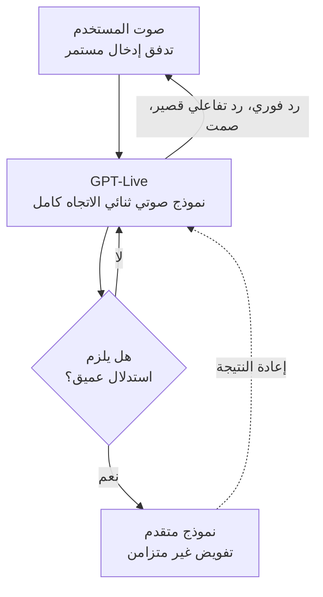

من استخدم مساعدًا صوتيًا من قبل يعرف ذلك الإيقاع المألوف وغير المريح: ينتظر النظام حتى تنهي حديثك، ثم بعد لحظة صمت قصيرة يرد عليك دفعة واحدة. GPT-Live، الذي كشفت عنه OpenAI في 8 يوليو 2026، محاولة لتغيير هذا الإيقاع. هذا المقال موجه للمطورين وفرق الذكاء الاصطناعي المهتمين بواجهات الصوت والبنية التحتية للاستدلال الفوري. نستعرض فيه ما الذي تغير تقنيًا في GPT-Live بالفعل، وما الذي يتطلبه هذا النوع من الصوت ثنائي الاتجاه الكامل من بنية الخدمة وتصميم الوكلاء.

## نظرة عامة: تحول جيلي في تجربة الصوت الافتراضية

GPT-Live نموذج صوتي من جيل جديد يحل محل تجربة الصوت الافتراضية في ChatGPT. جوهره بنية الاتصال الثنائي الكامل (full-duplex). فإذا كان وضع الصوت السابق نصف ثنائي، أي يستمع ثم يتحدث، فإن GPT-Live يستطيع الاستماع والحديث في الوقت نفسه. فبينما يتحدث المستخدم، يعبّر النموذج عن أنه يستمع بردود تفاعلية قصيرة مثل "همم" أو "نعم"، ويشارك في تبادل سريع للحديث، وينتظر بصمت حين يحتاج الطرف الآخر إلى وقت للتفكير. وتصف OpenAI هذه التجربة بأنها أقرب بكثير إلى محادثة حقيقية مع شخص آخر.

ينقسم الطرح إلى نسختين. GPT-Live-1 هو الافتراضي لمستخدمي Go وPlus وPro، بينما GPT-Live-1 mini هو الافتراضي للمستخدمين المجانيين. وقد بدأ طرح كلا النموذجين تدريجيًا لمستخدمي ChatGPT حول العالم على iOS وأندرويد والويب.

## ما الذي تغير تقنيًا بالفعل

التغيير الأكبر يكمن في طريقة التعامل مع المحور الزمني للمحادثة. تعتمد أنظمة الصوت نصف الثنائية على كشف نهاية الدور (end-of-turn detection): حين يقرر النظام أن المستخدم توقف عن الكلام، يبدأ عندها فقط في توليد الرد. هذا الأسلوب بسيط في التنفيذ، لكنه لا يستطيع التعبير عن التداخل الطبيعي والمقاطعة والردود التفاعلية القصيرة التي تحدث في المحادثة الحقيقية.

يواجه الاتصال الثنائي الكامل هذا القيد مباشرة. فلكي يستمر النظام في استقبال تدفق الصوت الوارد بينما يولّد في الوقت نفسه صوتًا صادرًا، يجب أن يعالج النموذج وطبقة الخدمة التدفقين في الاتجاهين معًا وبزمن استجابة منخفض. وحتى بينما يواصل المستخدم الحديث، يقرر النموذج في الوقت الفعلي متى يرد بردود تفاعلية قصيرة، ومتى يقاطع، ومتى يصمت. هذه ليست مسألة جودة توليف صوتي بسيطة، بل مسألة نمذجة توقيت المحادثة نفسها.

من التصاميم اللافتة أيضًا آلية التفويض (delegation). يُقدَّم GPT-Live بوصفه أذكى نموذج صوتي حتى الآن، لكن الأسئلة التي تحتاج إلى بحث على الويب أو استدلال أعمق أو مهام معقدة تُحال في الخلفية إلى أحدث نموذج متقدم (frontier model). وحين تجهز النتيجة، تُعاد إلى مسار المحادثة. بعبارة أخرى، هذه بنية طبقية: نموذج صوتي سريع وخفيف يتولى الطابع الفوري للمحادثة، بينما يعالج نموذج منفصل الاستدلال الثقيل بشكل غير متزامن.

هذا الفصل بين الطبقات نمط شائع في تصميم الأنظمة الفورية: يُفصل المسار الذي يحتاج زمن استجابة منخفضًا عن المسار الذي يحتاج دقة عالية، ويُشغَّل الثاني بشكل غير متزامن للحفاظ على استجابة الطبقة الأمامية. يمكن قراءة GPT-Live بوصفه تطبيقًا لهذا النمط على المحادثة الصوتية.

## دلالات التطبيق على منتجات ThakiCloud

GPT-Live نفسه منتج مغلق تابع لـ OpenAI، لكن المتطلبات التي تفرضها بنيته ترتبط مباشرة بالبنية التحتية التي نشغّلها.

من منظور ai-platform، يمثل الصوت ثنائي الاتجاه الكامل حالة صعبة من حالات الاستدلال الفوري المتدفق (streaming inference). تشغّل منصة ai-platform التابعة لـ ThakiCloud نطاقًا واسعًا من النماذج فوق جدولة GPU القائمة على K8s وKueue، وبخلاف الاستدلال الدفعي (batch inference)، تتطلب المحادثة الصوتية زمن استجابة منخفضًا وثابتًا. والتعامل مع تدفقات صوتية ثنائية الاتجاه في الوقت نفسه يتطلب من طبقة الخدمة أن تحافظ على استقرار الإدخال والإخراج المتدفقين وحالة الجلسة، كما يتطلب من موارد GPU إدارة ليس فقط الإنتاجية بل أيضًا زمن الاستجابة الأقصى (tail latency). هذا المتطلب المتعلق بزمن الاستجابة المنخفض مهم بوجه خاص في البيئات المحلية (on-premise) والسيادية. فالعملاء الذين لا يستطيعون إرسال بياناتهم إلى الخارج ويريدون تشغيل واجهة صوتية باستضافة ذاتية (self-hosting) يحتاجون، كشرط أساسي، إلى حزمة خدمة قادرة على التعامل مع البث الفوري.

من منظور الوكلاء، يرتبط الأمر بـ Paxis. Paxis هو مستوى التحكم الخاص بـ Agent-Native Cloud الذي يعمل فوق ai-platform، حيث يشغّل المهارات (skills) داخل بيئات معزولة (sandboxes) ويمرر كل إجراء عبر بوابات سياسات وسجلات تدقيق. وبنية التفويض في GPT-Live، أي أن الطبقة الأمامية الخفيفة تحيل الاستدلال الثقيل إلى الخلف، تتبع المبدأ نفسه الذي تقوم عليه طبقية تصميم الوكلاء. وحين يصبح الصوت واجهة إدخال جديدة للوكلاء، نحتاج إلى مسار يفسر ما قصده المستخدم، ويختار المهارة المناسبة، وينفذها بمعزل، ثم يعيد النتيجة إلى المحادثة. ويمكن لبنية المهارات وموصلات MCP وبوابات السياسات في Paxis أن تتولى بالضبط هذا الجزء الخلفي من خط أنابيب الوكيل الصوتي: الصوت الفوري يتولى الواجهة الأمامية، بينما تنفيذ الوكيل المضمون بسياسات وتدقيق يتولى الخلفية.

## القيود ووجهات النظر المضادة

الاتصال الثنائي الكامل لا يضمن بالضرورة تجربة أفضل. فبنية الاستماع والحديث في آن واحد تزيد من الطبيعية، لكنها في الوقت نفسه تفتح مجالًا أوسع للخلل. فقد يخطئ النظام في تفسير توقف قصير من المستخدم على أنه نهاية الدور فيقاطعه، أو قد تكون الردود التفاعلية القصيرة مفرطة إلى درجة تعطل المحادثة بدلًا من أن تخدمها. ونمذجة التوقيت الطبيعي مسألة أكثر دقة بكثير من جودة توليف الصوت، ومن الصواب تعليق الحكم عليها إلى حين التحقق منها عبر ردود فعل مستخدمين حقيقيين.

لبنية التفويض أيضًا جانبها المظلم. فإذا أخطأ النموذج الصوتي الأمامي في تقدير متى يحيل السؤال إلى النموذج المتقدم، فقد يترتب على سؤال بسيط تأخير مفرط، أو يخرج سؤال صعب بإجابة سطحية. ودقة قرار التوجيه هذا هي ما يحدد التجربة الكاملة، وهذا أمر لا يمكن التحقق منه من إعلانات الشركة المصنّعة وحدها، بل يظهر في الاستخدام الفعلي.

وأخيرًا، يستند التفسير المعماري الوارد في هذا المقال إلى ما أعلنته OpenAI وإلى التغطية الإعلامية الأولية، ولم تُكشف تفاصيل التنفيذ الداخلي. اتجاه الاتصال الثنائي الكامل والتفويض واضح، لكن أرقام زمن الاستجابة الدقيقة أو بنية النموذج لم نتحقق منها بشكل مستقل، وينبغي التعامل معها بوصفها تقديرات.

باختصار، يُظهر GPT-Live انتقال واجهات الصوت من كونها "أداة تتلقى الأوامر" إلى كونها "شريكًا في المحادثة". وما يحمل هذا الانتقال فعليًا ليس جودة الصوت اللافتة، بل البنية التحتية التي تخدم التدفقات ثنائية الاتجاه بزمن استجابة منخفض وتفوّض الاستدلال الثقيل بأمان. وهذا الجزء الخلفي، على صعيد الخدمة الفورية وتنفيذ الوكلاء معًا، هو بالضبط ما نستعد له.

## المصادر

- [Introducing GPT-Live · OpenAI](https://openai.com/index/introducing-gpt-live/)
- [OpenAI releases new voice models for more natural live conversations · TechCrunch](https://techcrunch.com/2026/07/08/openai-releases-new-voice-models-for-more-natural-live-conversations/)
- [OpenAI Introduces GPT-Live to Make ChatGPT Voice Feel Like a Real Conversation · MacRumors](https://www.macrumors.com/2026/07/08/openai-gpt-live-voice/)
