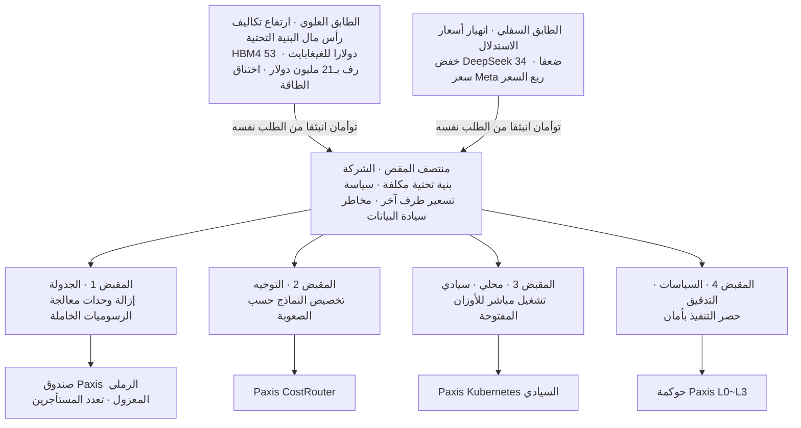

## في اليوم نفسه، سار رقمان بعيدا أحدهما عن الآخر

حملت أخبار هذا الصباح رقمين يتحركان في اتجاهين متضادين تماما، جنبا إلى جنب. أحدهما قفز صعودا: أُفيد أن متوسط سعر بيع رف Nvidia Rubin Ultra بلغ 21 مليون دولار، أي أكثر من خمسة أضعاف الجيل السابق Blackwell Ultra البالغ 4 ملايين دولار. أما الآخر فقد هوى إلى القاع: خفّضت DeepSeek أسعار V4-Pro بنسبة 75 بالمئة بشكل دائم، طارحة بطاقة سعر أرخص بـ34 ضعفا من OpenAI وبـ29 ضعفا من Anthropic على أساس رموز الإخراج.

من جهة، يرتفع سعر الحديد الذي يشغّل الذكاء الاصطناعي بشكل حاد. ومن جهة أخرى، تنهار قيمة الإجابات التي ينتجها ذلك الحديد. ما يبدو للوهلة الأولى تناقضا هو في الحقيقة حدث واحد. القصة التي تخترق ملخص اليوم ليست عن مدى ذكاء نموذج بعينه، بل عن حقيقة أن الطابقين العلوي والسفلي لاقتصاد الذكاء الاصطناعي يتباعدان في اتجاهين متضادين. والعالق بين الشفرتين المتباعدتين هو، في النهاية، الشركة التي تريد فعلا استخدام هذه التقنية.

## الطابق العلوي: الحديد يزداد غلاء باستمرار

القصة ليست عن أسعار الرفوف وحدها. الطابق العلوي بأكمله يرفع أسعاره. توقعت Bernstein أن ترتفع أسعار وحدة ذاكرة HBM4 وLPDDR5X إلى 53 دولارا لكل غيغابايت بحلول عام 2027. وبما أن أكثر من نصف تكلفة الرف يتركز في وحدات معالجة الرسوميات وذاكرة HBM، فإن ارتفاع أسعار الذاكرة يسحب معه سعر الخادم الواحد بأكمله إلى الأعلى. ومع ذلك، لا تُبطئ Samsung Electronics وSK hynix وMicron وتيرة توسعها، بل تسرّعها. الحساب وراء ذلك أن المصنع الجديد يحتاج ثلاث سنوات على الأقل ليقدّم كمية إنتاج فعلية، ما يعني أن زيادة معتبرة في العرض لن تكون ممكنة قبل عام 2028. التزمت Micron بضخ 250 مليار دولار في الولايات المتحدة حتى عام 2035، بينما تحركت SK hynix لإدراج إيصالات إيداع أمريكية بسعر اكتتاب 149 دولارا، بقيمة إدراج تبلغ نحو 40 تريليون وون، وهو أكبر إدراج لشركة أجنبية في البورصة الأمريكية على الإطلاق. استثمار اليوم ليس إشارة إلى أن الأسعار على وشك الانخفاض، بل رهان مسبق لتثبيت موقع أمام الطلب المدفوع بالذكاء الاصطناعي والذي سيستمر لسنوات مقبلة. مع ذلك، حملت أخبار اليوم نفسه أيضا أن وزير التجارة الأمريكي ضغط علنا، في فعالية لمصنع في نيويورك، على الشركات الكورية لتوسيع الإنتاج داخل الولايات المتحدة. وأصبح تحديد كيفية توزيع رأس المال والقوى العاملة بين استثمارات محلية ضخمة ومطالب بالاستثمار في أمريكا واجبا منزليا جديدا لشركات الذاكرة الثلاث.

الأسعار ليست وحدها ما يزداد غلاء، بل التعقيد أيضا. قالت Samsung Electronics إنها تطوّر تعبئة 2.xD تجمع HBM والمنطق والضوئيات السيليكونية في وحدة واحدة. تجاوز اختناقات النطاق الترددي يتطلب دمج شرائح مختلفة بدقة متناهية، وكلما حدث ذلك أكثر أصبحت سلسلة التوريد بأكملها رهينة لسعة المسابك والتعبئة المتقدمة. إنها بنية يتصاعد فيها التعقيد والتكلفة معا مع ارتفاع الأداء. تقول Nvidia إن مكاسب الأداء تحسّن إجمالي تكلفة الملكية، لكن مع تركز نصف تكلفة الرف في وحدات معالجة الرسوميات وذاكرة HBM، برزت سرعة الاسترداد الفعلي للاستثمار كالمتغير الحقيقي الذي يحدد مدى استدامة هذه الدورة.

يقف هنا جدار أثقل: الطاقة. كما أشارت صحيفتا JoongAng Ilbo وJoseA Ilbo، انتقل محور المنافسة في الذكاء الاصطناعي بالفعل من تأمين أشباه الموصلات إلى تشغيل مراكز البيانات. وضعت الحكومة هدفا لجذب أكثر من 550 تريليون وون من استثمارات مراكز بيانات الذكاء الاصطناعي بحلول عام 2029، وأكثر من 1000 تريليون وون بحلول عام 2035، وضمن ذلك تتولى مجموعة SK نسبة 81 بالمئة من هدف قدره 18.4 غيغاواط. المشكلة أن سيول ومقاطعة Gyeonggi تستحوذان على 78.7 بالمئة من عقود الطاقة ذات الصلة، بينما المواقع الأساسية هناك تقترب فعلا من التشبع. يتطلب ربط الشبكة الكهربائية وتوسيع محطات التحويل الفرعية فترة تصاريح أطول من مجرد شراء وحدات معالجة الرسوميات. يمكن للتبريد السائل، مثل التبريد بالغمر، أن يقلص طاقة التبريد بأكثر من 90 بالمئة، لكن نقص العمالة يُشار إليه كاختناق آخر، إذ ليس سهلا الاحتفاظ لثلاث إلى خمس سنوات أو أكثر بالكوادر التشغيلية العالية المهارة اللازمة لتشغيل هذه المرافق على مدار الساعة. لهذا السبب، يُعاد تسعير شركات تعدين البيتكوين السابقة، التي تمتلك بالفعل حقوق نقل كهربائي واسعة النطاق، كموردي بنية تحتية للذكاء الاصطناعي. ومع توقيع شركات مثل Core Scientific وIREN وTeraWulf عقود طاقة طويلة الأجل مع مزودي الحوسبة فائقة الحجم، بدأ السوق يعيد تقييمها ليس بناء على ربحية التعدين بل على سعة الطاقة التي تملكها، مقاسة بالميغاواط. المورد النادر حقا في الطابق العلوي الآن ليس الشريحة، بل الكهرباء.

## الطابق السفلي: قيمة الإجابة تنخفض باستمرار

في اليوم نفسه، عملت في الطابق السفلي قوة معاكسة تماما. لم يكن خفض أسعار DeepSeek عرضا ترويجيا لمرة واحدة، بل سياسة دائمة، وظهر أثره في الأرقام. على منصات المطورين مثل Vercel وOpenRouter، قفزت حصة حركة مرور النماذج الصينية إلى رقمين خلال فترة قصيرة، وحوّلت شركة ناشئة فعلية مثل Lindy خدمتها بالكامل من Anthropic إلى DeepSeek. العملاء الحساسون للسعر يتحركون بالفعل.

تُظهر تحركات Meta هذا الاتجاه بوضوح أكبر. Meta، التي كانت تبني منظومتها عبر إطلاق Llama كمصدر مفتوح، دخلت لأول مرة أعمال واجهة برمجة تطبيقات مدفوعة عبر Muse Spark 1.1، وطرحت سعرا مذهلا يبلغ نحو ربع سعر المنافسين. أعرب Zuckerberg عن ثقته بأن السعر سيكون جذابا. إلى جانب ذلك، تخطط Meta لبدء الإنتاج الضخم لشرائحها الخاصة بالذكاء الاصطناعي ابتداء من سبتمبر لتقليل اعتمادها على Nvidia، بل وتتحرك لبيع الحوسبة الخاملة للخارج لاسترداد إنفاق بنية تحتية قد يصل إلى 145 مليار دولار هذا العام. بعد TPU من Google وTrainium من Amazon، تنضم شريحة Meta المخصصة إلى المشهد، في مرحلة تطبع فيها شركات التقنية الكبرى شرائحها الخاصة وتعيد بيع ما يتبقى من الحوسبة. كلما زاد الضغط على التكلفة في الطابق العلوي، اشتدت حرب الأسعار في الطابق السفلي لنقل ذلك الضغط إلى طرف آخر.

تُظهر الأخبار المحلية أن حركة المقص هذه ليست قصة وادي السيليكون وحده. قال Ha Jung-woo إن مدينة أولسان تملك فرصة كبيرة للتحول الصناعي بالذكاء الاصطناعي نظرا لما تراكم لديها من بيانات صناعية تصنيعية، وتشاركت ITCEN Core مع KB Kookmin Bank، وطرحت SK AX تحولا متكاملا موجّها لمواقع التصنيع. بدأت LG تطوير نموذج عالمي يفهم قوانين الفيزياء، ووضعت Alipay رهانها في عصر الوكلاء على الدفع والثقة والانفتاح. هذا يعني أن التصنيع والتمويل والقطاع العام بدأوا كل على حدة بدفع الذكاء الاصطناعي إلى العمل الفعلي. المشكلة أن هذه الجهات، لحظة تبنيها الذكاء الاصطناعي، تقع مباشرة بين الشفرتين اللتين استعرضناهما للتو. تضغط تكاليف رأس مال البنية التحتية من الأعلى، بينما تضغط تكلفة النماذج ومخاطر السيادة من الأسفل، في آن واحد.

## لماذا هاتان القوتان واحدة في الجوهر

الاتجاهان اللذان بدَوَا تناقضا ينبعان في الحقيقة من الجذر نفسه. مع انفجار الطلب على الذكاء الاصطناعي، تدفع ندرة أشباه الموصلات والطاقة في المنبع الأسعار إلى الأعلى. وفي الوقت نفسه، تُسقط المنافسة بين موفري النماذج الساعين لالتقاط ذلك الطلب هوامش الربح في المصب. بمعنى آخر، ارتفاع تكاليف رأس المال من الأعلى وانخفاض أسعار البيع من الأسفل توأمان وُلدا من الطلب نفسه. لهذا يشبه هذا البناء مقصا: تتحرك الشفرتان في اتجاهين متضادين، لكنهما مرتبطتان بمحور واحد.

الموقع الذي تقف فيه الشركات هو بالضبط منتصف ذلك المقص. إن بنت الشركة بنيتها التحتية بنفسها، عليها تحمّل التكاليف المتصاعدة للطابق العلوي. وإن استخدمت النماذج فقط عبر واجهات برمجية خارجية، عليها أن تسلّم نفسها لسياسة تسعير طرف آخر ولمخاطر سيادة البيانات. فوق ذلك، DeepSeek نموذج صيني، وMeta تحولت إلى نموذج مغلق ومدفوع. في قطاعات مثل التمويل والقطاع العام، حيث لوائح فصل الشبكات وسيادة البيانات صارمة، يصعب الاستفادة من ذلك السعر الرخيص كما هو. حقيقة أن السعر رخيص وحقيقة أنه يمكن استخدامه بأمان مسألتان مختلفتان تماما.

## المقابض التي يجب الإمساك بها في منتصف المقص

يجدر هنا التوقف عند اعتراض شائع. بما أن DeepSeek أرخص بـ34 ضعفا وMeta طرحت ربع السعر، أفلا يكفي ببساطة اختيار أرخص واجهة برمجية خارجية واستخدامها؟ إذا نظرنا إلى السعر وحده، فهذا كلام معقول. لكن السعر الرخيص يأتي بشروط. DeepSeek نموذج صيني، وMeta تحولت من المصدر المفتوح إلى نموذج مغلق مدفوع، وأسعار كليهما يمكن أن ترتفع مجددا في أي وقت وفق ظروف المزوّد. تسليم بنية التكلفة بأكملها لسياسة تسعير طرف آخر ليس توفيرا، بل تبعية جديدة. التوفير الحقيقي لا يكتمل إلا حين تُدخل ذلك السعر الرخيص تحت سيطرتك أنت.

فما المتغيرات التي يمكن للشركات فعلا التحكم بها بين الشفرتين المتباعدتين؟ تركت الأخبار تلميحات. الدرس الجوهري من مقال مراكز بيانات الذكاء الاصطناعي كان أن وحدات معالجة الرسوميات التي أمّنتها الشركة لا قيمة لها إن لم تستطع تشغيلها. بمعنى آخر، المقبض الأول لامتصاص تكاليف الطابق العلوي هو الجدولة التي تقضي على الوقت الخامل. الدرس من حالة DeepSeek كان التوجيه، أي توزيع العمل بين نماذج رخيصة وأخرى مكلفة وفق صعوبة المهمة. المقبض الثاني هو التخصيص، اختيار النموذج المناسب لكل مهمة. الدرس من تحول Meta إلى التسعير المدفوع وانتشار النماذج الصينية كان أن امتصاص السعر الرخيص ضمن سيادة البيانات يتطلب تشغيل نماذج ذات أوزان مفتوحة مباشرة على بنية الشركة التحتية الخاصة. المقبض الثالث هو النشر المحلي والسيادي. وكما حدّد دليل اختبار الاختراق الأمني للذكاء الاصطناعي الصادر عن وزارة العلوم وتكنولوجيا المعلومات وKISA حقن التوجيهات وإساءة استخدام صلاحيات الوكيل كتهديدين معياريين، فإن المقبض الرابع هو السياسات والتدقيق التي تحصر التنفيذ بأمان.

صُمم Paxis، وهو Agent-Native Cloud الذي بنته ThakiCloud، ليتيح للمؤسسات الإمساك بهذه المقابض الأربعة بيد واحدة. يقوم CostRouter، الذي يختار النموذج المناسب لكل مهمة، بتوزيع أحمال العمل بين نماذج منخفضة التكلفة على طراز DeepSeek ونماذج عالية الأداء، محوّلا انهيار الأسعار في الطابق السفلي إلى وفورات فعلية في التكلفة. يقلّل التنفيذ داخل صندوق رملي معزول ونظام تعدد المستأجرين من الوقت الخامل لوحدات معالجة الرسوميات المؤمَّنة، مما يمتص تكاليف رأس المال في الطابق العلوي. تتيح بنية Kubernetes السيادية والمحلية تشغيل نماذج ذات أوزان مفتوحة مباشرة ضمن اللوائح المحلية، فتجمع بين السعر الرخيص وسيادة البيانات في آن واحد. أما الحوكمة التي تعامل Skills وTools وPolicies وAudit Logs كموارد من الدرجة الأولى، وتقسّم مستوى الاستقلالية من L0 إلى L3، فتزرع بوابات السياسات وسجلات التدقيق التي يطالب بها دليل اختبار الاختراق داخل المنتج منذ البداية.

## كلما اتسع المقص، ازدادت أهمية المقابض

من المرجح أن يستمر رقما اليوم في التباعد أكثر. سيبقى عرض الذاكرة ضيقا حتى عام 2028، ويتطلب اختناق الطاقة سنوات من التراخيص، لذا لن ينخفض الطابق العلوي بسهولة. في المقابل، تواصل موجة الشرائح الخاصة والنماذج فائقة الرخص سحب الطابق السفلي إلى الأسفل. كلما حدث ذلك أكثر، لم تعد النتيجة تُحسم بالشفرتين نفسيهما، بل بالمقبض الذي يمسك المسافة بينهما. لهذا، عند قراءة رقمي سعر الرف وسعر الاستدلال، يجب أيضا قراءة الجدولة والتوجيه والسيادة والأمان الواقعة بينهما. لم تسأل أخبار اليوم أي نموذج فاز. بل سألت عن تكلفة تشغيل ذلك النموذج وطريقة التعامل مع تلك التكلفة. لتقف ثابتا في منتصف المقص، عليك أولا أن تتحقق من مكان مقابضك.

## المراجع

- [توقعات ببيع رف Nvidia Rubin Ultra بـ21 مليون دولار](https://tech.ifeng.com/c/8uco339RORc) · Ifeng
- [Bernstein تتوقع رف Nvidia Vera Rubin بـ9.1 مليون دولار... ارتفاع أسعار HBM4 يضغط على التكاليف](https://www.weeklypost.kr/news/articleView.html?idxno=11422) · Weekly Post
- ["جائزة الـ40 تريليون وون"، SK hynix تتجاوز حتى Alibaba... رقم قياسي](https://www.hankyung.com/article/2026071072846) · Hankyung
- [Micron توسّع استثمارها في أشباه الموصلات الأمريكية إلى 250 مليار دولار... بدء بناء مصنع نيويورك](https://www.thelec.net/news/articleView.html?idxno=12157) · TheElec
- [Samsung Electronics: "نطوّر تعبئة 2.xD تجمع HBM والمنطق والضوئيات السيليكونية"](http://inews24.com/view/1984212) · iNews24
- [DeepSeek تجعل خفض 75% دائما... تصاعد حرب أسعار الذكاء الاصطناعي](https://thenextweb.com/news/deepseek-v4-pro-75-percent-price-cut-permanent) · TheNextWeb
- [Meta تسعّر واجهة Muse Spark 1.1 بـ1.25/4.25 دولار لكل مليون رمز](https://aiweekly.co/alerts/meta-prices-muse-spark-11-api-at-125425-per-m-tokens) · AI Weekly
- [شرائح Meta الجديدة للذكاء الاصطناعي تبدأ الإنتاج في سبتمبر](https://techcrunch.com/2026/07/09/metas-new-ai-chips-will-begin-production-in-september/) · TechCrunch
- [الشركة الناشئة Lindy تتخلى عن Claude كليا لصالح DeepSeek موفرة ملايين الدولارات](https://the-decoder.com/ai-startup-lindy-ditched-claude-entirely-for-deepseek-saving-millions-as-cost-pressure-mounts-on-anthropic/) · The Decoder
- [وزارة العلوم وتكنولوجيا المعلومات وKISA تصدران "دليل اختبار الاختراق الأمني للذكاء الاصطناعي"](https://www.digitaltoday.co.kr/news/articleView.html?idxno=682799) · Digital Today
