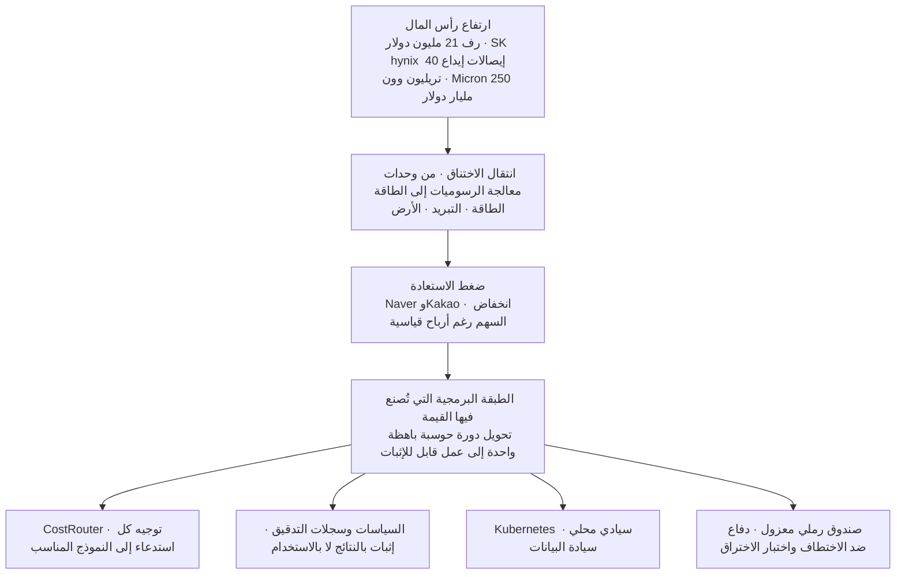

تخيل فاتورة واحدة. البند رف خادم واحد، والسعر 21 مليون دولار، أي نحو 31.6 مليار وون بعملتنا. هذا هو السعر المتوقع لوحدة رف Rubin Ultra الجديد من Nvidia، كما نقلت اليوم Global Economic. فقط قبل جيل واحد، كان سعر رف Blackwell يتراوح بين 3 و4 ملايين دولار، أي أن القفزة تراوحت بين خمس وسبع مرات. أكبر بند في هذه الفاتورة ليس شريحة المعالجة بل الذاكرة. تصل كمية HBM4e المحمّلة في رف واحد وحدها إلى 82,944 غيغابايت، وبحساب 18.49 دولارا لكل غيغابايت، يتجاوز سعر الذاكرة وحدها 1.53 مليون دولار. مبلغ كان يقترب من سعر رف خادم كامل من الجيل السابق أصبح الآن سعر قطعة واحدة فقط. القصة التي تجري عبر ملخص اليوم تبدأ من هنا، وحدة قياس المنافسة في الذكاء الاصطناعي انتقلت من مؤشرات الأداء إلى المال والطاقة.

## وحدة المال تغيّرت

حتى حجم الأرقام أصبح غريبا. حددت SK hynix سعر الطرح لإيصالات الإيداع الأمريكية الخاصة بإدراجها في ناسداك عند 149 دولارا للسهم. بإجمالي 26.5 مليار دولار، أي نحو 40 تريليون وون، وهو ما يتجاوز 25 مليار دولار التي حققتها Alibaba عام 2014، لتصبح أكبر إدراج لشركة أجنبية في السوق الأمريكية على الإطلاق. شركة تجاوزت قيمتها السوقية تريليون دولار تسحب الآن الدولارات مباشرة لتضخها في معدات الطباعة الضوئية فوق البنفسجية الشديدة في مصنعي يونغين وتشيونغجو، وفي التعبئة المتقدمة في الخارج. وسّعت Micron خطتها مجددا معلنة استثمار 250 مليار دولار، أي نحو 376 تريليون وون، في الولايات المتحدة وحدها حتى عام 2035. وقدّمت Meta توجيها للإنفاق الرأسمالي لهذا العام وحده يتراوح بين 115 و135 مليار دولار.

حين ننظر إلى وجهة هذا المال، يتضح الاتجاه بجلاء. كله يتجه نحو توسيع الذاكرة وبناء مراكز البيانات وتأمين أشباه الموصلات. تنظر بنوك استثمارية مثل Bank of America وMorgan Stanley إلى هذا الارتفاع الحاد في الأسعار بوصفه في آن واحد أساسا لتقييم أعلى لشركات الذاكرة الكورية، ومخاطرة هبوطية قد تُقلّص الإنفاق الرأسمالي لشركات التكنولوجيا الكبرى. ارتفاع السعر فرصة لمن يبيع، لكنه عبء على من عليه أن يدفع ذلك السعر ثم يشغّل خدمة فوقه. وإذا ترسّخت بنية يشكّل فيها ثمن الذاكرة نصف سعر الرف، فإن هامش ربح مشغّل الحوسبة السحابية لوحدات معالجة الرسوميات قد يتحدد فقط بتوقيت تبنّيه للرف من الجيل التالي.

لافت أيضا أن جبهة المنافسة لا تقف عند شريحة واحدة. أعلنت Samsung Electronics أنها تطوّر تكاملا هجينا من نوع 2.xD يجمع HBM والمنطق والفوتونيات السيليكونية في حزمة واحدة، كما دخلت سوق الاستدلال على الجهاز نفسه عبر Gaia، مسرّعها المخصص لأجهزة الحاسوب الشخصي بالذكاء الاصطناعي. صُممت Gaia حول فكرة المعالجة داخل الذاكرة لتقليل حركة البيانات ورفع كفاءة الطاقة. هذا يعني أن سباق تسريع الحوسبة أصبح فعليا السباق نفسه لتوفير الطاقة. هذا الاتجاه يترك لمشغّلي الحوسبة السحابية لوحدات معالجة الرسوميات واجبا آخر أيضا، وهو تجهيز عتاد متعدد الموردين يمتد إلى وحدات NPU والمعالجة داخل الذاكرة، لا الاعتماد على Nvidia وحدها.

## الاختناق انتقل من وحدات معالجة الرسوميات إلى الطاقة

الإشارة الأكثر إثارة هي المكان الذي انتقل إليه الاختناق. القصة التي نقلتها Joseilbo رمزية بامتياز. الشركات التي كانت تُعدّن العملات الرقمية تتحول إلى شركات بنية تحتية للذكاء الاصطناعي، واتضح أن أصلها الحقيقي لم يكن أجهزة التعدين بل الطاقة. وفقا لتقرير CoinShares، من المتوقع أن ترتفع حصة الذكاء الاصطناعي والحوسبة عالية الأداء من إيرادات شركات التعدين المدرجة من نحو 30% حاليا إلى ما يصل إلى 70% بنهاية العام، وقد تجاوزت العقود ذات الصلة الموقعة خلال العام الماضي وحده 70 مليار دولار. وقّعت TeraWulf عقد إيجار طويل الأجل لمدة 20 عاما مع Anthropic للتوسع إلى 401 ميغاواط بحلول أوائل 2028، بينما أضافت IREN موقعا في أوكلاهوما لترفع خط أنابيب الطاقة لديها إلى 4.5 غيغاواط. من أمّن عقود طاقة رخيصة ومنشآت تحويل أولا، هو من أصبح الفائز.

كوريا ليست استثناء. نقلت JoongAng Ilbo عن توقعات Nomura أن استثمار مراكز بيانات الذكاء الاصطناعي عالميا سينمو من 723 تريليون وون عام 2025 إلى 5,241 تريليون وون عام 2030، بمعدل نمو سنوي متوسط 48%. أعلنت الحكومة في التاسع والعشرين من الشهر الماضي عن ثلاثة مشاريع عملاقة، قائلة إنها ستضخ 550 تريليون وون في مراكز بيانات بسعة 8.4 غيغاواط في المرحلة الأولى، وستتجاوز إجمالي 18.4 غيغاواط واستثمارا تراكميا يفوق 1,000 تريليون وون بحلول 2035. تتعاون SK مع AWS لافتتاح 5 غيغاواط بحلول 2029 ورفعها إلى 15 غيغاواط بحلول 2035، بينما أعلنت KT أنها ستنفق 5 تريليونات وون على مدى خمس سنوات لبناء منشآت قائمة على الطلب الفعلي في 25 موقعا في أنحاء البلاد. وخبر أن SK Telecom تراهن على مركز بيانات بسعة 5 غيغاواط يقع في السياق نفسه. الاختناقات المشتركة تتجمع في نقطة واحدة، هي الطاقة والتبريد والأرض. في واقع تُعدّ فيه تأخيرات الربط بشبكة KEPCO وتراخيص محطات التحويل أكبر قيد على التوسع، فإن الدرس الأمريكي، القائل إن من يؤمّن الطاقة أولا يحصل على أفضلية بنيوية، ينتقل مباشرة إلى كوريا أيضا.

في مرحلة تعاد فيها هيكلة منافسة الحجم حول تحالفات الشركات الكبرى، لا يعني ذلك أن الشركات الصغيرة لا تملك أي مسار متبقٍ على الإطلاق. تبني LG Uplus منشأة في باجو تزوّد 200 ميغاواط، بينما تُعدّ LG CNS مركز بيانات صغيرا نمطيا يحشد 576 وحدة معالجة رسوميات داخل حاوية واحدة. وهناك أيضا نهج مثل استراتيجية KT الطرفية، وهو إلحاق المنشآت بمواقع الصناعة لتقليل زمن الاستجابة. بالنسبة لمشغّل لا يستطيع منافسة الكبار مباشرة على أراضي الحوسبة فائقة الحجم، فإن الخيار الأكثر واقعية هو رفع الكثافة في ثغرات مثل الوحدات النمطية، والحوسبة الطرفية، وتنويع عقود الطاقة.

## لكن هل يعود ذلك المال فعلا كنتائج؟

هنا يجب طرح السؤال من الاتجاه المعاكس لنحصل على صورة صادقة. هل يُستعاد فعلا هذا الرقم القياسي من رأس المال في صورة نتائج؟ أخبار اليوم ترسل في الواقع إشارة معاكسة. من المتوقع أن تسجّل Naver أفضل ربع ثانٍ في تاريخها بإيرادات 3.3562 تريليون وون وأرباح تشغيلية 570.1 مليار وون، لكن سعر سهمها انخفض من قمة جديدة بلغت 304,000 وون في الأول من يونيو إلى 184,400 وون في التاسع من يوليو، خلال أكثر بقليل من شهر. وصل عدد مستخدمي GPT in Kakao التراكمي إلى 11 مليون مستخدم، لكن شركات الوساطة خفّضت أسعارها المستهدفة بشكل موحد، لعدم كفاية الأدلة على تحقيق الدخل. السبب في عدم قدرة هذه الشركات على الابتسام رغم نتائجها القياسية بسيط، فالسوق لم يعد يسأل عن الاستثمار، بل عن الاستعادة.

رد فعل شركات التكنولوجيا الكبرى أكثر مباشرة. تخلّت Meta عن مسارها مفتوح المصدر وأطلقت أول نموذج مدفوع لها، Muse Spark 1.1، بسعر 4.25 دولار لكل مليون رمز إخراج، أي نحو 25% من سعر أفضل نماذج OpenAI وAnthropic. يوازن زوكربيرغ حتى فكرة إنشاء عمل لتأجير الحوسبة يقرض فيه مراكز البيانات ووحدات معالجة الرسوميات للخارج، وأنشأ لذلك تنظيما داخليا منفصلا باسم Meta Compute. بعد أن وقّعت Meta في أبريل عقد تأجير حوسبة بقيمة تصل إلى 21 مليار دولار مع CoreWeave، تسعى الآن إلى أن تصبح هي نفسها موردة حوسبة مثل CoreWeave. إنه إعلان بأنها، بعد أن ضخّت مئات المليارات من الدولارات، تنوي الآن كسب المال من ذلك الإنفاق. في المقابل، تمتص DeepSeek جزءا كبيرا من حركة مرور المطورين بريادتها بسعر 0.87 دولار لكل مليون رمز إخراج، أي أرخص بـ34 مرة من OpenAI. الرقم الذي يشير إلى أن حصة النماذج الصينية مفتوحة المصدر قفزت في وقت من الأوقات إلى 46% في إحصاءات OpenRouter يُظهر أن هذا الاتجاه ليس مسألة ذوق بل مسألة تكلفة. هذا هو السياق الذي يقف خلف التقييم القائل إن محور المنافسة انتقل من من يصنع النموذج الأفضل إلى من يجني المال فعلا.

حالة Naver تكشف هذه الفجوة الزمنية بالأرقام. مشروع AI Factory الذي تديره بالتعاون مع Nvidia مصمم لينمو من 55 ميغاواط عبر 200 ميغاواط بحلول 2028 وصولا إلى غيغاواط واحد في النهاية، بهدف تحقيق 20 تريليون وون في الإيرادات السنوية على المدى الطويل، لكن مصاريف الإهلاك الناتجة عن استثمار وحدات معالجة الرسوميات ضغطت على هامش الربح التشغيلي قصير المدى. هذا يعني أن بنية بناء البنية التحتية أولا واستعادتها لاحقا ليست استثناء حتى في منصة كبرى. هذا بالضبط سبب مطالبة المستثمرين بأدلة في صورة عقود وإيرادات، لا مجرد استخدام.

## الطبقة التي تحوّل الحوسبة الباهظة إلى عمل قابل للإثبات

خلاصة الأمر كالتالي، رأس المال ينهمر نحو أشباه الموصلات والطاقة، والشركات التي تشغّل خدماتها فوقه تخضع لضغط إثبات الاستعادة. إذا كان الأمر كذلك، فإن المكان الذي تُصنع فيه القيمة الحقيقية ليس تحت العتاد بل فوقه، في الطبقة البرمجية التي تحوّل كل دورة حوسبة باهظة إلى نتيجة دون هدر. هذا بالضبط ما دفع ThakiCloud لتصميم Paxis بوصفه سحابتها الأصيلة للوكلاء، Agent-Native Cloud.

يستخدم CostRouter، الذي يختار نموذجا لكل مهمة، الخيارات التي فتحتها واجهات برمجة التطبيقات منخفضة التكلفة من DeepSeek وMeta سلاحا مباشرا. وجّه أحمال العمل الحساسة للرموز، مثل تصنيف البريد الإلكتروني أو تلخيص المستندات، إلى نموذج رخيص، واستخدم النموذج المكلف فقط في الأجزاء التي تحتاج استدلالا دقيقا، فتحصل على النتيجة نفسها بتكلفة أقل. في عصر ينفجر فيه سعر الرف الواحد، لا يكمن طريق حماية التكلفة في عتاد أرخص، بل في الانضباط البرمجي الذي يوجّه كل استدعاء إلى النموذج المناسب.

بوابات السياسات وسجلات التدقيق هي أيضا إجابة على ضغط الإثبات الذي تواجهه Naver وKakao. تعامل Paxis كلا من Skills وTools وPolicies وAudit Logs كموارد من الدرجة الأولى، وتدير درجة استقلالية الوكيل عبر مستويات من L0 إلى L3. حين يُترك سجل لما فعله الوكيل وبأي صلاحية، يمكن الحديث عن الأداء استنادا إلى العمل المُنجز فعلا لا إلى الاستخدام وحده. وحين تفصل السياسة أي المهام تتطلب موافقة بشرية وأيها يمكن تفويضها بالكامل، يمكن تقديم دليل بدل رقم مجرد أمام سؤال الاستعادة. تكديس Alipay لـ300 مليون عملية دفع للوكلاء عبر المصادقة المفوّضة وتتبع المعاملات لبناء طبقة ثقة يتبع القواعد نفسها.

قضية السيادة تتقاطع هنا أيضا. أشارت إحدى مذكرات الصحفيين إلى أنه في مناسبة تُرفع فيها شعارات السيادة في الذكاء الاصطناعي، كانت الكلمة الأوضح التي بقيت عالقة هي Nvidia. تقول الحكومة إنها ستستخدم 5 تريليونات وون من العائدات الضريبية الفائضة لتأمين 10,000 وحدة معالجة رسوميات من طراز Vera Rubin من Nvidia ورفع حصة أشباه الموصلات المحلية إلى النصف بحلول 2030، لكن المعيار الذي يحدد ما إذا كانت السيادة تقتصر على البيانات والنماذج أم تمتد إلى الحوسبة وأشباه الموصلات أيضا لا يزال غامضا. هذه الفجوة تصبح نافذة تموضع لمشغّل أثبت عمليا تشغيل حزمة سيادية فوق Kubernetes محلي لا تغادر فيها البيانات المكان. وبينما تعلن الشركات الكبرى سيادتها فيما تندمج بعمق في منظومة Nvidia، فإن من يبني مراجع فعلية في توطين الحوسبة وسيادة البيانات قد يتقدم قبل أن يُحسم المعيار.

الأمن هو الحلقة الأخيرة في سلسلة الثقة هذه. حدّد دليل اختبار الاختراق الأمني للذكاء الاصطناعي الذي أصدرته وزارة العلوم وتكنولوجيا المعلومات والاتصالات وKISA هذا الأسبوع ثمانية تهديدات رئيسية، من بينها حقن الأوامر واختطاف الوكلاء، وقسّم المخاطر إلى خمسة مستويات. الاختطاف، حيث ينساق الوكيل خلف تعليمات خبيثة مخفية في مستند خارجي أو صفحة ويب، يمكن مواجهته مباشرة ببنية تحصر كل عملية تنفيذ داخل صندوق رملي معزول. في وقت تترسّخ فيه سجلات اختبار الاختراق كشرط في التمويل والمشتريات العامة، تصبح البنية التي تثبت مستوى العزل كميا استجابة تنظيمية وميزة تنافسية في المشتريات في آن واحد.

لنعد إلى قصة الفاتورة. في عصر يُطبع فيه رقم 21 مليون دولار على رف واحد، أفدح هدر هو أن تُشغّل فوق ذلك الرف نموذجا خاطئا لمهمة خاطئة ثم تعجز عن تفسير ما الذي فعلته فعلا. أصبح رأس المال والطاقة بالفعل ساحة معركة. الساحة التالية هي الطبقة التي تحوّل فوقهما كل دورة إلى عمل قابل للإثبات، وهذا بالضبط الموقع الذي تستهدفه ThakiCloud.

## المصادر

- [رف Rubin Ultra من Nvidia يُتوقع أن يُباع بـ21 مليون دولار](https://tech.ifeng.com/c/8uco339RORc) · ifeng
- ["يانصيب الأربعين تريليون وون"، SK hynix يتجاوز حتى Alibaba، رقم قياسي غير مسبوق](https://www.hankyung.com/article/2026071072846) · Korea Economic Daily
- [Micron توسّع استثمارها في أشباه الموصلات الأمريكية إلى 250 مليار دولار، وتبدأ بناء مصنع في نيويورك](https://www.thelec.net/news/articleView.html?idxno=12157) · TheLec
- [Meta تتوقع إنفاقا رأسماليا لعام 2026 بين 115 و135 مليار دولار، مع توسع إنفاق مراكز البيانات](https://www.datacenterdynamics.com/en/news/meta-estimates-2026-capex-to-be-between-115-135bn/) · Data Center Dynamics
- [مراكز بيانات الذكاء الاصطناعي تجتذب استثمار "ألف تريليون وون" في الأقاليم، والسؤال المتبقي هو "الطلب"](https://www.mt.co.kr/tech/2026/07/01/2026070110330467488) · Money Today
- [نائب رئيس الوزراء للعلوم وتكنولوجيا المعلومات والاتصالات: "550 تريليون وون في AIDC بحلول 2029، وأكثر من 1000 تريليون وون بحلول 2035"](https://www.fnnews.com/news/202606291445337094) · Financial News
- [شركات تعدين البيتكوين تتحول إلى شركات ذكاء اصطناعي وتبيع عملاتها لتمويل هذا التحول](https://www.coindesk.com/markets/2026/03/27/bitcoin-miners-are-becoming-ai-companies-and-selling-their-btc-to-fund-the-transition) · CoinDesk
- [TeraWulf تعلن عقد إيجار مع Anthropic في Justified Data Campus](https://investors.terawulf.com/news-events/press-releases/detail/142/terawulf-announces-anthropic-lease-at-justified-data-campus-and-sale-of-majority-interest-in-abernathy-joint-venture-to-fluidstack) · TeraWulf
- [الإعلانات والتجارة أنقذتا نتائج الربع الثاني لكل من Naver وKakao مجددا](https://zdnet.co.kr/view/?no=20260708165303) · ZDNet Korea
- [ضخ 5 تريليونات وون من العائدات الضريبية الفائضة، لتطوير "الذكاء الاصطناعي السيادي"](https://www.hankyung.com/article/2026070228011) · Korea Economic Daily
