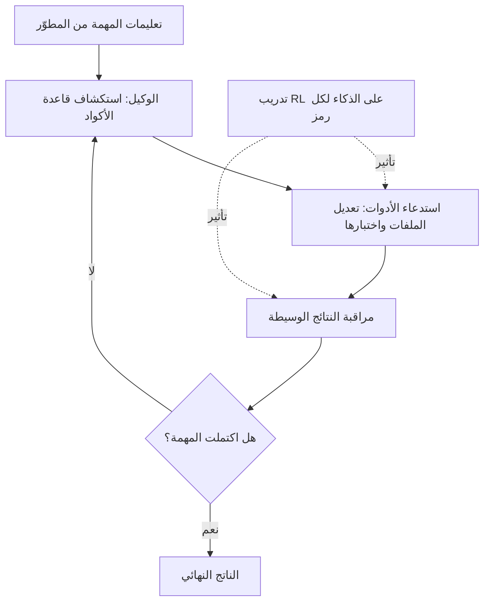

كل فريق جرّب كتابة الكود عبر وكيل ذكاء اصطناعي يعرف عائقاً واحداً. عندما تُسند مهمة طويلة إلى وكيل، يكرر النموذج قراءة الملفات واستدعاء الأدوات وإعادة التفكير عشرات المرات. في هذه الأثناء تتراكم الرموز (tokens) بسرعة، وكلما كان النموذج أقوى أداءً، ازدادت وطأة هذه التكلفة. حتى الآن كان "النموذج الأذكى في البرمجة" و"النموذج القابل للتشغيل فعلياً طوال اليوم" قصتين مختلفتين. Grok 4.5 الذي كشفته SpaceXAI يستهدف بالضبط هذه الفجوة.

*تجسيد تجريدي لفكرة نموذج صُمم من الأساس للبرمجة ومهام الوكلاء.*

## نظرة عامة

Grok 4.5 هو نموذج أعلنت SpaceXAI أنها دربته من الصفر للبرمجة والوكلاء المستقلين. لم يُموضَع كروبوت محادثة استهلاكي، بل كأداة للتطوير والعمل المعرفي، ويستهدف قواعد الأكواد الكبيرة واستخدام الأدوات والمهام طويلة الأمد. وصفه Elon Musk بأنه نموذج "بمستوى Opus لكنه أسرع وأكثر كفاءة من حيث الرموز وأقل تكلفة". وOpus المشار إليه هنا كان حتى وقت قريب فئة النماذج الأعلى لدى Anthropic.

سبب تجاوز هذا الإعلان مجرد إطلاق نموذج جديد يكمن في السعر وطريقة التدريب. سُعّر Grok 4.5 بـ2 دولار لكل مليون رمز إدخال، و6 دولارات لكل مليون رمز إخراج. طرح أداء بمستوى الطليعة (frontier) بهذا السعر يهز الافتراض السائد بأن "النماذج الذكية باهظة الثمن بحيث يصعب تشغيلها كوكلاء لفترات طويلة". من منظور Thaki Cloud، هذا التحول ليس شأناً بعيداً عنا. فالذكاء الوكيلي الرخيص يغيّر مباشرة اقتصاديات المنصات التي تشغّل الوكلاء بشكل دائم.

## ماذا أُعلن

فيما يلي ملخص الحقائق المُعلنة. Grok 4.5 هو أول نموذج من SpaceXAI مُدرَّب خصيصاً لمهام البرمجة والوكلاء، وتزعم الشركة أنه يتفوق على النماذج المماثلة في الهندسة والعمل المعرفي. جرى التدريب جنباً إلى جنب مع محرر الأكواد Cursor، في سياق استحواذ SpaceXAI على Cursor ثم صقل النموذج داخل بيئة استخدامه. وبالفعل، أصبح Grok 4.5 متاحاً منذ إطلاقه في جميع خطط Cursor، كما يُقدَّم عبر Grok Build وواجهة SpaceXAI. غير أنه، حتى وقت الإعلان، لا يزال غير متاح في الاتحاد الأوروبي.

كُشف أيضاً عن البنية التحتية للتدريب. أوضحت الشركة أنها دربت هذا النموذج على عشرات الآلاف من وحدات معالجة الرسوميات NVIDIA GB300، واستثمرت بشكل كبير في التعلم المعزز (RL) لرفع الذكاء لكل رمز (per-token intelligence). وتشرح SpaceXAI أن هذا الاستثمار بالتحديد هو ما خلق فجوة الكفاءة في الرموز مقارنةً بـOpus 4.8. بمعنى آخر، دُرِّب النموذج على إنجاز المهمة ذاتها بعدد أقل من الرموز، وهو ما يترجم مباشرة إلى خفض تكلفة الاستخدام الفعلي.

## ماذا يعني "التدريب المخصص للبرمجة والوكلاء"

عبارة "دُرِّب للبرمجة والوكلاء" يسهل تجاهلها كشعار تسويقي، لكنها تحمل توجهاً تصميمياً محدداً. تُحسَّن النماذج الحوارية العامة للإجابة بشكل طبيعي عن مواضيع واسعة النطاق. أما نماذج الوكلاء فجوهرها القدرة على استدعاء الأدوات عبر خطوات متعددة، ومراقبة النتائج الوسيطة، وتعديل الخطة، وإتمام مهام طويلة. هذه القدرة لا تُكتسب من جودة استجابة واحدة فقط، بل يلعب التعلم المعزز الذي يُعيد تغذية نجاح المسار (trajectory) بأكمله كإشارة مكافأة دوراً كبيراً فيها.

يجب قراءة "الذكاء لكل رمز" الذي شددت عليه SpaceXAI في هذا السياق. السبب البنيوي وراء انفجار استهلاك الرموز عندما يشغّل الوكيل مهمة طويلة هو أن النموذج يفكر بإسهاب أكثر من اللازم للوصول إلى الاستنتاج ذاته، أو يكرر استدعاءات أدوات غير ضرورية. عندما يُدرَّب النموذج على حمل قدر أكبر من الحكم في كل رمز، يمكنه إنهاء المهمة ذاتها بمسار أقصر. ويرتبط بهذا أيضاً كون التدريب جرى داخل بيئة برمجة فعلية هي Cursor. فاستخدام أنماط استدعاء الأدوات الفعلية كإشارة تدريب يمكن أن يدفع الوكيل إلى التعامل مع الأدوات بكفاءة أكبر.

## التحول الذي يصنعه السعر

تقديم أداء بمستوى الطليعة مقابل 2 دولار لكل مليون رمز إدخال و6 دولارات لكل مليون رمز إخراج يغيّر حسابات الربح والخسارة في تشغيل الوكلاء. في مسارات العمل التي يستهلك فيها الوكيل ملايين الرموز وهو يتنقل طوال اليوم عبر قاعدة الأكواد، يحدد سعر الرمز مباشرة هامش ربح الخدمة. وإذا تقارب الأداء، يفوز النموذج الأرخص. وبالفعل تشير عدة تحليلات إلى أن Grok 4.5 أرخص بكثير من Fable 5 وGPT 5.5، بحيث قد يُختار على أساس السعر وحده إذا لم تكن فجوة النتائج القياسية (benchmark) كبيرة.

أهمية هذه النقطة تكمن في أن الذكاء الوكيلي الرخيص يعيد فتح مسارات عمل كانت قد طُويت بسبب التكلفة. فكلما كانت المهمة أكثر استهلاكاً للرموز - كأتمتة مراجعة الأكواد، وإعادة الهيكلة (refactoring) واسعة النطاق، ووكلاء المراقبة الدائمة - كان أثر خفض السعر أكبر. لكن هذا الحساب يأتي مع تحفظ. فانخفاض سعر واجهة برمجة التطبيقات (API) هو أيضاً ثمن للتبعية لمزود سحابي. تخرج البيانات إلى الخارج، وتخضع سياسة التسعير والتوافر لقرارات المزود. وحقيقة أن Grok 4.5 لا يزال غير متاح في الاتحاد الأوروبي تُظهر أن هذه التبعية خطر حقيقي وليس افتراضياً.

## من منظور Thaki Cloud

ظهور نماذج الوكلاء الرخيصة يمسّ منتجَي Thaki Cloud كليهما.

من منظور Paxis، تعزز نماذج الوكلاء منخفضة التكلفة وعالية الأداء مثل Grok 4.5 فرضية Agent-Native Cloud. Paxis هي طبقة تحكم للوكلاء تعمل فوق ai-platform، وتتعامل مع المهارات والأدوات والسياسات وسجلات التدقيق كموارد من الدرجة الأولى. في بنية ينفّذ فيها الوكيل مهمة طويلة عبر عشرات الخطوات، تحتاج - أياً كان النموذج المستخدم - إلى طبقة تُمرِّر سلوكه عبر بوابات السياسات وتُسجّله في سجلات التدقيق. فكلما رخُص النموذج، زاد تشغيل الوكلاء أكثر ولفترات أطول، وكلما زادت قيمة التنسيق (orchestration) والحوكمة. الذكاء الرخيص لا يقلل من الحاجة إلى منصة الوكلاء، بل يزيدها.

من منظور ai-platform، تتضح المفاضلة مع الاستضافة الذاتية. سعر API المنخفض جذاب، لكنه عائق أمام المؤسسات التي لديها متطلبات سيادة البيانات والامتثال التنظيمي والنشر داخل المنشأة (on-premise) بسبب التبعية. تقدّم ai-platform التابعة لـThaki Cloud نماذج مفتوحة الأوزان (open-weight) تُخدَّم في بيئتها الخاصة اعتماداً على K8s وKueue، مما يتيح تشغيل مسارات عمل الوكلاء دون إخراج البيانات إلى الخارج. الجمع بين "الذكاء لكل رمز" والخدمة الفعالة الذي أظهره Grok 4.5 يطرح على معسكر الاستضافة الذاتية تحدياً في الاتجاه نفسه: للمنافسة مع واجهات برمجة التطبيقات السحابية الرخيصة، لا بد من تحقيق كفاءة في الرموز وتكلفة خدمة منخفضة أيضاً على مستوى المنشأة. وهذا يتقاطع تماماً مع توجهنا الذي يجعل من انخفاض تكلفة الخدمة ميزة تنافسية.

## القيود وحجج مضادة

عند تقييم هذا الإعلان، ينبغي التحفظ على عدة نقاط. أولاً، يستند جزء كبير من ادعاءات الأداء إلى إعلانات الشركة نفسها. تعبيرات مثل "بمستوى Opus" أو "يتفوق على النماذج المماثلة" من الأسلم التعامل معها كتسويق إلى أن يجري التحقق منها بشكل مستقل عبر نتائج قياسية (benchmarks) مستقلة. والتفوق الفعلي في مهام البرمجة والوكلاء يختلف بشكل كبير باختلاف عبء عمل كل مستخدم.

ثانياً، لا تعني القدرة التنافسية في السعر أنه الخيار الأفضل بالضرورة. يأتي السعر المنخفض مصحوباً بمخاطر التبعية للمزود وانتقال البيانات والتوافر. توجد قيود إقليمية وتنظيمية فعلية، مثل عدم التوفر في الاتحاد الأوروبي، ويمكن أن تشكل هذه القيود عائقاً حاسماً في مجالات تكون فيها سيادة البيانات أساسية، كالقطاع العام والمالي المحلي. واتخاذ قرار التبني بناءً على الأداء والسعر فقط قد يضطر المؤسسة لاحقاً إلى التراجع عند مواجهة متطلبات تنظيمية أو حوكمية.

أخيراً، الحقائق الواردة في هذا المقال هي تجميع للتقارير المنشورة وإعلانات الشركة. ينبغي التحقق من الأرقام التفصيلية للنتائج القياسية أو تفاصيل التدريب الدقيقة من المصادر الأصلية مباشرة، وقد تتغير الصورة مع تراكم التقييمات المستقلة بمرور الوقت.

## المصادر

- Axios, "Scoop: SpaceXAI launches new model, Grok 4.5"
- TechCrunch, "SpaceXAI releases Grok 4.5, which Elon describes as an 'Opus-class model'"
- The Decoder, "Grok 4.5 is so cheap compared to Fable 5 and GPT 5.5 that benchmark gaps may not matter much"
