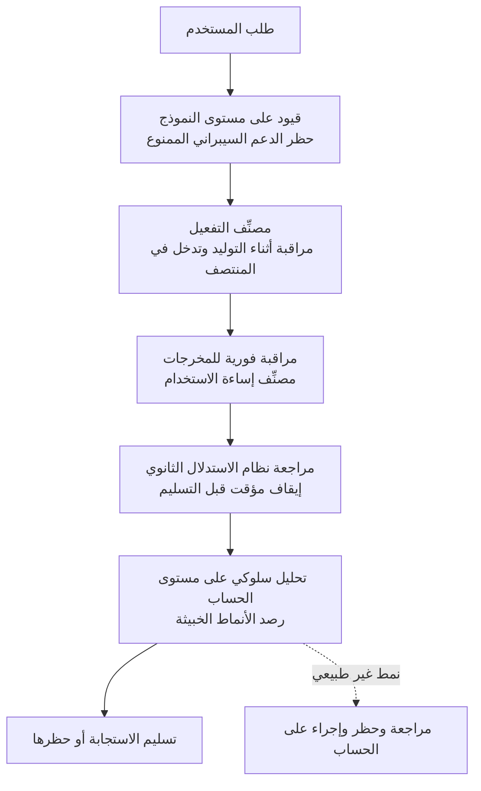

بقيت جملة واحدة عالقة في ذهني هذا الصباح وأنا أتصفح خط الزمن. الجملة التي أعلنت فيها OpenAI عن نموذجها الرائد الجديد GPT-5.6 Sol، وذكرت أنه سجل رقماً قياسياً جديداً في ساحة تقييم الأمن السيبراني المعروفة باسم "The Last Ones". المهم هنا ليس الرقم بحد ذاته، بل دلالة الجملة. فهي تعني أن الذكاء الاصطناعي يصل إلى نقطة يتجاوز فيها مجرد مساعدة البشر في اكتشاف الثغرات، ليبدأ بتنفيذ سيناريوهات هجوم متعددة المراحل حتى النهاية دون تدخل بشري.

سبب عدم استطاعة شركة بنية تحتية مثل ThakiCloud أن تنظر إلى هذا الخبر باعتباره شأناً بعيداً عنها واضح. فكلما ارتفعت القدرات الهجومية للنماذج المتقدمة، ينتقل مركز ثقل الدفاع من سؤال "أي نموذج أذكى" إلى سؤال "أين يُشغَّل هذا النموذج، وتحت سيطرة من، وبأي سجلات تدقيق". النماذج ستستمر في التقوي على أي حال. وبالتالي فإن نقطة الحسم تصبح عزل بيئة التنفيذ، وبوابات السياسات، وإمكانية التتبع بعد وقوع الحادث. سنتناول اليوم أولاً ما أنجزه GPT-5.6 Sol فعلياً استناداً إلى حقائق مؤكدة، ثم ننتقل لشرح لماذا تُضاعف هذه القدرة من الحاجة إلى الذكاء الاصطناعي السيادي المحلي وطبقة تحكم الوكلاء.

## ما هو GPT-5.6 Sol ولماذا يُركَّز على الأمن السيبراني

GPT-5.6 هو عائلة نماذج كشفت عنها OpenAI في 9 يوليو 2026. تضم ثلاث فئات مرتبة حسب القدرة: لونا (Luna)، تيرا (Terra)، وسول (Sol)، حيث يُعد Sol النموذج الرائد الأقوى. وأوضحت OpenAI أنها تُشغِّل Sol فوق بنية Cerebras بمعدل يصل إلى 750 رمزاً في الثانية، مؤكدة أنها رفعت سرعة المعالجة إلى جانب القدرة نفسها.

المحور الأبرز في هذا الإعلان هو الأمن السيبراني. وصفت OpenAI Sol بأنه أقوى نموذج أمن سيبراني في تاريخها، موضحة أنه نقل حدود الأداء والكفاءة في المهام الأمنية طويلة النفس، بما فيها بحوث الثغرات والاستغلال. الجوهر هنا هو "الذهاب أبعد برموز أقل". فانخفاض عدد رموز الاستدلال اللازمة للوصول إلى النتيجة نفسها يعني أيضاً إمكانية أتمتة محاولات هجوم أكثر بالميزانية ذاتها. وفي المرحلة التي يُترجم فيها تحسن القدرة مباشرة إلى انخفاض في التكلفة، ينخفض العتبة أمام كل من المدافعين والمهاجمين على حد سواء.

هناك نقطة يجب توضيحها بأمانة. النص الأصلي للتغريدة هو إعلان صادر عن OpenAI نفسها، بينما التقييم المستقل لساحة "The Last Ones" التي سنتناولها لاحقاً (من قِبل معهد سلامة الذكاء الاصطناعي البريطاني AISI) كان حتى وقت النشر يقتصر على GPT-5.5. لذا فإن ادعاء Sol بـ"الرقم القياسي الجديد" هو رقم قدمته OpenAI نفسها، ومن الأسلم قراءته كادعاء من الجهة المعلنة إلى حين اكتمال نشر نتائج إعادة الإنتاج من طرف ثالث. يقتبس هذا المقال الأرقام القابلة للتحقق مع تمييزها بوضوح عن الجهة التي أعلنتها.

## "The Last Ones": ما تقيسه ساحة الاختبار السيبرانية ذات الـ32 خطوة

"The Last Ones" هو سيناريو اختراق محاكى لشبكة شركة افتراضية تديره AISI. يتكون من 32 خطوة إجمالاً، ويُقدَّر أن إنجازه من البداية إلى النهاية على يد خبير بشري متمرس يستغرق نحو 20 ساعة. وليس مجرد حل مسائل منفصلة، بل بنية يجب فيها ربط عدة قدرات ضرورية للاختراق الفعلي في خيط واحد لاجتيازه. يتعين على الوكيل أن يستولي على النظام، وأن يفكك البروتوكولات والمصادقة المشفرة عبر الهندسة العكسية، وأن يتلاعب بوحدات التحكم، كل ذلك عبر سلسلة من القرارات المستقلة المتصلة.

عدد النماذج التي أكملت هذه الساحة حتى النهاية حتى الآن قليل جداً. كان Claude Mythos preview أول من نجح، حيث أكمل ثلاث مرات من أصل عشر محاولات (3/10)، تلاه GPT-5.5 كثاني نموذج ينجزها حتى النهاية بمعدل مرتين من أصل عشر (2/10). قد يبدو معدل النجاح منخفضاً مقارنةً بعدد المحاولات، لكن مجرد إتمام هجوم متعدد المراحل يستغرق 20 ساعة دون تدخل بشري ولو مرة واحدة يُعد إشارة على تجاوز عتبة حرجة. وتشير دراسة ذات صلة (arXiv 2603.11214) إلى أن هذه القدرة تتناسب لوغاريتمياً وخطياً مع حجم الحساب في وقت الاستدلال، ولم يُلاحَظ بعد أي مستوى استقرار لها. وتحمل النتيجة القائلة إن رفع ميزانية الرموز من عشرة ملايين إلى مئة مليون يمكن أن يرفع الأداء بنسبة تصل إلى 59% دلالة مقلقة، مفادها أن احتمال إتمام الهجوم يستمر في الارتفاع كلما زاد المال والوقت المستثمَران فيه.

## القفزة في القدرات كما تظهرها المقاييس المرجعية

تظهر هذه القفزة في القدرات أيضاً في المقاييس المرجعية الفردية. وفقاً لـ OpenAI، سجل GPT-5.6 نسبة 73.5% في ExploitBench2، وهو مقياس تقييم قدرات الاستغلال، متفوقاً بفارق كبير على نسبة 47.9% التي حققها GPT-5.5 بميزانية رموز إخراج مماثلة تقريباً. أي ارتفاع بأكثر من 25 نقطة مئوية في جيل واحد فقط. لكن هناك تفصيلاً هنا أيضاً. تشير اختبارات OpenAI نفسها إلى أن GPT-5.6 أكثر براعة في اكتشاف الثغرات وإصلاحها منه في تنفيذ الهجوم الفعلي حتى النهاية بشكل موثوق. أي أن ميزان القدرة لا يزال، حتى الآن، يميل لصالح الدفاع.

هذا التمييز مهم من الناحية السياسية. فالنموذج نفسه، إن وُضع في يد المدافع، يصبح أداة لاكتشاف الثغرات وترقيعها بكميات كبيرة، وإن وُضع في يد المهاجم، يصبح محرك أتمتة للاختراق. Aardvark، الباحث الأمني الوكيلي الذي كشفت عنه OpenAI بشكل منفصل، يستهدف بالتحديد هذا الاستخدام الدفاعي. قُدِّم Aardvark كوكيل مستقل يساعد المطورين وفرق الأمن على اكتشاف الثغرات وإصلاحها تلقائياً، وحددت OpenAI صراحةً أولويتها في أن تصل هذه القدرة إلى المدافعين أولاً وقبل كل شيء.

## الدفاع قبل الهجوم: حزمة الأمان متعددة الطبقات من OpenAI

في هذا السياق أيضاً امتنعت OpenAI عن فتح Sol بالكامل منذ البداية، واقتصرت إتاحته على مجموعة محدودة من الشركاء الموثوقين. فالوصول مقصور في البداية على عملاء منتقين بعناية، وأوضحت الشركة أن هذا القرار جاء في سياق تنسيق وثيق مع الحكومة الأمريكية حول إطار الأمن السيبراني. وكلما اقتُرِب من الحكم بأن القدرة تجاوزت عتبة حرجة، يُشدَّد النشر بمزيد من الحذر.

من الناحية التقنية أيضاً أُضيفت طبقات دفاع متعددة. وفقاً للإعلان، زُوِّد Sol وTerra بمصنِّف تفعيل جديد مركّز على المجالات الحساسة، يراقب النموذج أثناء عملية التوليد، ويتدخل في المنتصف لإيقافه إذا بدأ بإنتاج إجابة خطيرة. وإلى جانب ذلك، هناك قيود على مستوى النموذج تمنع بشكل جذري أي دعم سيبراني محظور، ومراقبة فورية للمخرجات عبر مصنِّف إساءة الاستخدام، وتحليل سلوكي على مستوى الحساب لرصد الأنماط الخبيثة. لا تُسلَّم المخرجات مباشرة، بل تمر أولاً عبر مراجعة نظام استدلال ثانوي قبل أن تصل إلى المستخدم. والمخطط أدناه يلخص تدفق هذا الدفاع متعدد الطبقات.

النقطة الجديرة بالملاحظة أن هذه البنية ليست مرشحاً واحداً. فداخل النموذج (مصنِّف التفعيل)، وعلى حدود المخرجات (مصنِّف إساءة الاستخدام)، وعلى مستوى الحساب (التحليل السلوكي)، تتراقب طبقات مختلفة من زوايا مختلفة في آن واحد. إنه دفاع عميق مصمَّم بحيث تلتقط الطبقة التالية ما تفوته الطبقة السابقة. وهذه الفكرة بالذات هي ما يُنقَل مباشرة إلى مزودي البنية التحتية.

## دلالات التطبيق على منتجات ThakiCloud

خبر ارتفاع القدرة الهجومية للنماذج المتقدمة يصب، بشكل مفارق، في صالح الذكاء الاصطناعي المحلي والسيادي. فكلما أصبح الهجوم المستقل واقعاً، تسعى الشركات والجهات الحكومية إلى وضع الإجابة على سؤال "من استدعى هذا النموذج، وماذا طلب منه، وأي مخرجات تلقى" تحت سيطرتها الخاصة. منصة **ai-platform** من ThakiCloud تتماشى تماماً مع هذا المطلب. فهي، فوق جدولة GPU قائمة على K8s وKueue، تُبقي النموذج داخل عنقود العميل، وتقدمه بعزل متعدد المستأجرين، وتدعم النشر المحلي والسيادي بحيث لا تتجاوز البيانات الحدود الخارجية. وكلما كان عبء العمل الأمني أكثر حساسية، ازدادت قيمة الاستضافة الذاتية التي تُبقي أوزان النموذج وحركة الاستدلال داخل بنيتك التحتية الخاصة. وانخفاض تكلفة التقديم يشكل أيضاً شرطاً عملياً يتيح للمدافع تشغيل مهام متكررة بكميات كبيرة، مثل فحص الثغرات، بميزانية يمكن تحملها.

على مستوى الوكلاء، يتشابه تصميم **Paxis** بشكل لافت مع حزمة الأمان متعددة الطبقات التي رأيناها أعلاه. Paxis هو طبقة تحكم Agent-Native Cloud تعمل فوق ai-platform، وتعامل المهارات (Skills) والأدوات (Tools) والسياسات (Policies) وسجلات التدقيق (Audit Logs) كموارد من الدرجة الأولى. تُنفَّذ المهارة التي يشغِّلها الوكيل داخل صندوق رمل معزول دون تلويث بيئة المضيف، ولا يُنفَّذ أي إجراء إلا بعد اجتياز بوابة سياسات، وتُسجَّل كل هذه العملية في سجل تدقيق. تماماً كما وضعت OpenAI شبكة مراقبة متداخلة عبر داخل النموذج وخارجه وعلى مستوى الحساب، يفصل Paxis اختيار المهارة (هارنس BM25)، والتنفيذ (عزل صندوق الرمل)، والتحكم (بوابة السياسات)، والتتبع (سجل التدقيق) إلى طبقات منفصلة. هذه البنية تمنع الوكيل المستقل من استخدام أداة خاطئة على هدف خاطئ، وتتيح، إن وقع حادث، تتبع أين ومتى حدث الخلل.

كلا المنظورين يكمّل الآخر. إذا كان ai-platform يمثل ضبطاً مادياً يُبقي النموذج داخل حدودك، فإن Paxis يمثل ضبطاً منطقياً يقيّد سلوك الوكيل الذي يستخدم ذلك النموذج بالسياسات والسجلات. في عصر ينجز فيه الذكاء الاصطناعي اختراقاً من 32 خطوة بشكل مستقل، لا تكمن أساسيات الدفاع في اختيار نموذج قوي، بل في تشغيل أي نموذج داخل بيئة خاضعة للرقابة مع ترك أثر لسلوكه. هذا هو السبب في أن طبقة تحكم الذكاء الاصطناعي المحلي والوكلاء تزداد أهمية الآن.

## القيود والحجج المضادة

من أجل التوازن، سنتناول الجانب المقابل أيضاً. أولاً، تستند أفضلية Sol في الأمن السيبراني إلى حد كبير على إعلان OpenAI نفسها، وبما أن الوصول محدود، فإن التحقق المستقل من إعادة الإنتاج لا يزال غير كافٍ. تخضع الأرقام المرجعية لشروط قياس الجهة المعلنة، لذا من الأسلم اعتبارها إشارة اتجاهية فقط إلى حين تراكم تقييمات طرف ثالث.

ثانياً، ملاحظة أن القدرة تميل حالياً لصالح الدفاع ليست سبباً كافياً للاطمئنان. فإذا استمر التوسع اللوغاريتمي الخطي دون توقف، يمكن أن ينقلب التوازن الحالي المؤاتي للدفاع في أي لحظة لمجرد زيادة حجم الحساب. عبارة "الآن هو أكثر براعة في الدفاع منه في الهجوم" وصف للحظة راهنة، وليست ضماناً دائماً للسلامة.

ثالثاً، النشر المحلي والعزل وبوابات السياسات ليست مجانية. فتشغيل بنية تحتية خاصة يتطلب استثماراً أولياً وكوادر متخصصة وعبء ترقيع مستمر. وقد يظل خيار السحابة المُدارة، بما يوفره من سهولة، معقولاً بالنسبة للمؤسسات الصغيرة. الفكرة ليست أن الحل المحلي هو الإجابة الصحيحة دائماً، بل أن النقطة التي تتجاوز فيها قيمة الرقابة وإمكانية التدقيق تكلفة الراحة تتقدم كلما ارتفعت حساسية عبء العمل.

وأخيراً، بوابات السياسات وسجلات التدقيق نفسها ليست بلا عيوب. فحزمة الدفاع تصبح هدفاً لمحاولات الالتفاف، وقد بدأت بالفعل أبحاث لكسر قيود Sol. معنى الدفاع متعدد الطبقات ليس وعداً بعدم الاختراق، بل ضمان أن تلتقط الطبقة التالية أي اختراق وأن يمكن تتبعه لاحقاً. هذا الهدف المتواضع هو بالضبط تصميم الدفاع الواقعي لهذا العصر.

## المصادر

- [التغريدة الأصلية (RT @OpenAI)](https://x.com/hjguyhan/status/2078708617822564773)
- [GPT-5.6: Frontier intelligence that scales with your ambition | OpenAI](https://openai.com/index/gpt-5-6/)
- [Previewing GPT-5.6 Sol: a next-generation model | OpenAI](https://openai.com/index/previewing-gpt-5-6-sol/)
- [GPT-5.6 Preview System Card | OpenAI Deployment Safety Hub](https://deploymentsafety.openai.com/gpt-5-6-preview)
- [Introducing Aardvark: OpenAI's agentic security researcher](https://openai.com/index/introducing-aardvark/)
- [Our evaluation of OpenAI's GPT-5.5 cyber capabilities | AISI](https://www.aisi.gov.uk/blog/our-evaluation-of-openais-gpt-5-5-cyber-capabilities)
- [OpenAI Previews GPT-5.6 Sol With Restricted Access and Stronger Cyber Safeguards | The Hacker News](https://thehackernews.com/2026/06/openai-limits-gpt-56-rollout-as-sol.html)
- [Measuring AI Agents' Progress on Multi-Step Cyber Attack Scenarios | arXiv 2603.11214](https://arxiv.org/html/2603.11214v2)
