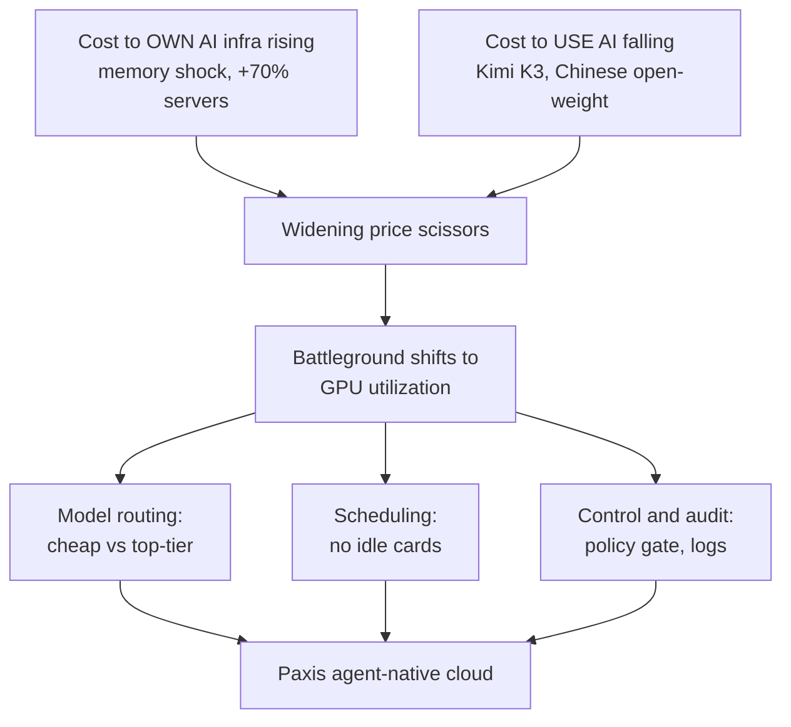

أثناء تصفح الأخبار هذا الصباح، لفت انتباهي أمر واحد. بطاقتا سعر تتحركان في اتجاهين متعاكسين تمامًا في التاريخ نفسه، موضوعتان جنبًا إلى جنب. من جهة، كانت تكلفة شراء المعدات اللازمة لتشغيل الذكاء الاصطناعي ترتفع إلى أعلى مستوى في تاريخها. ومن جهة أخرى، كانت تكلفة تشغيل الذكاء الاصطناعي مرة واحدة تنهار إلى أدنى مستوى في تاريخها. عادة، حين ترتفع تكلفة المدخلات ترتفع أسعار البيع أيضًا. لكن الآن، يتباعد سعر المواد الخام عن سعر المنتج النهائي، وكأنهما يديران ظهريهما لبعضهما البعض. هذا التباعد هو كل القصة التي أريد سردها اليوم.

## تكلفة الامتلاك ترتفع إلى أعلى مستوى في تاريخها

لنبدأ بالجانب المرتفع. تفيد سلسلة تقارير "تضخم حزمة الذكاء الاصطناعي" في ديجيتال ديلي بأن صدمة الذاكرة وصلت إلى ما هو أبعد من كبرى شركات الحوسبة السحابية، حتى غرف الخوادم الخاصة بالشركات الناشئة في مجال الذكاء الاصطناعي. ارتفعت تكلفة تركيب الخوادم الجديدة لدى شركة 42Maru، المتخصصة في الذكاء الاصطناعي للأسئلة والأجوبة، بنحو 70% مقارنة بالسابق. عرض سعر لقرص SSD سعة 4 تيرابايت كان 1.3 مليون وون قبل أسبوعين وصل هذا الأسبوع إلى 2.8 مليون وون، أي أكثر من الضعف. أخطرت سامسونج إلكترونيكس وإس كيه هاينيكس عملاءها الكبار مثل جوجل ومايكروسوفت برفع أسعار عقود ذاكرة DRAM للخوادم بنسبة 60 إلى 70%، وهما الآن لا تورّدان سوى 70% من الكميات المطلوبة. تقلصت مدة صلاحية عروض الأسعار من عدة أشهر إلى أسبوع أو أسبوعين، لذا تتحرك الشركات إما بحجز الكميات مسبقًا قبل ارتفاع الأسعار أكثر أو بتأجيل عمليات التركيب غير العاجلة.

بمجرد ارتفاع الأسعار، تحركت الشركات الأخف عبئًا أولًا. حولت خدمة تلخيص البحث لاينر (Liner) مزود الخدمة السحابية بالكامل، مستشهدة بتقلبات تكلفة السحابة التي هزّتها أسعار الذاكرة. كلما كانت الشركة تحمل غرفة خوادم خاصة بها أثقل، واجهت هذه الصدمة مباشرة، وكلما اعتمدت الشركة على بنية تحتية مستأجرة، تحركت بسرعة أكبر. هذه هي اللحظة التي تتحول فيها كلفة الامتلاك إلى جمود.

لا يقتصر الأمر على ارتفاع أسعار المعدات فقط. تنغلق أيضًا محافظ كبار اللاعبين الذين يمولون اللعبة بأكملها. تتوقع UBS أن ينخفض معدل نمو الإنفاق الرأسمالي لدى أربع كبريات شركات الحوسبة السحابية، بما فيها مايكروسوفت وأمازون، بشكل حاد من 76% في 2026 إلى 25% في 2027 ثم إلى 6% في 2028. في استطلاع بنك أوف أمريكا لمديري الصناديق في يوليو، اعتبر 82% من المستجيبين أشباه الموصلات أكثر تجارة مزدحمة في السوق حاليًا، وهي أعلى نسبة سجلها الاستطلاع على الإطلاق. أصبحت أزمة الطاقة والمخاطر التنظيمية واقعًا ملموسًا أيضًا، لدرجة أن ولاية نيويورك فرضت تجميدًا لمدة عام على بناء مراكز بيانات جديدة. انتهى عصر التوسع العشوائي، وتحوّل السؤال من "هل نبني" إلى "كم سنربح". لم يسبق أن كان قرار امتلاك البنية التحتية بهذا الثقل وهذه التكلفة.

## تكلفة الاستخدام تنهار إلى أدنى مستوى في تاريخها

الآن لننظر إلى بطاقة السعر الأخرى. أطلقت صحيفة كوريا إيكونوميك ديلي على هذا الوضع اسم "مفارقة انهيار أشباه الموصلات". قفز مؤشر فيلادلفيا لأشباه الموصلات 89% في الربع الثاني ثم تراجع 15% في يوليو، وارتفع صندوق مؤشرات متداولة للذاكرة أُدرج في أبريل بنسبة 166% خلال ثلاثة أشهر فقط قبل أن يتراجع أكثر من 20%. وبينما كانت سوق المواد الخام تتأرجح بهذا الشكل الحاد، كانت تكلفة استخدام الذكاء الاصطناعي فعليًا تخترق القاع بهدوء.

كان الزناد هو كيمي K3، النموذج مفتوح الأوزان الذي أطلقته شركة Moonshot AI الصينية هذا الأسبوع. يحمل النموذج 2.8 تريليون معامل ضمن بنية خليط من الخبراء، ويُفعّل جزءًا فقط من شبكاته الخبيرة البالغ عددها 896 لتوفير الحساب. يدعم نافذة سياق تصل إلى مليون رمز، وهو متوافق مع OpenAI SDK، ما يخفض عتبة الانتقال أمام المطورين الحاليين. اللافت هو السعر. تبلغ تكلفة معالجة مهمة واحدة 0.94 دولار، أي نحو نصف تكلفة أنثروبيك أوبس 4.8 البالغة 1.80 دولار. وينخفض السعر إلى 0.02 دولار لدى DeepSeek V4 Flash، وإلى 0.37 دولار لدى GLM 5.2.

لم يكن الأمر تفردًا لنموذج واحد، بل مالت الموجة بأكملها. وفقًا لنيوسيس، استحوذت النماذج الصينية مفتوحة الأوزان مثل Tencent وXiaomi وDeepSeek وMiniMax وZhipu AI على المراكز الخمسة الأولى في استخدام الرموز الأسبوعي على منصة OpenRouter الوسيطة للنماذج. حتى الأسبوع الأخير من يونيو، بلغت حصة النماذج الصينية 48%، متقدمة بفارق كبير على حصة الولايات المتحدة البالغة 20%، في انعكاس كامل للوضع قبل عام واحد، حين كانت الولايات المتحدة تتصدر بنسبة 74% مقابل 20% للصين. وأوضح رافي كريكوريان، كبير مسؤولي التقنية في موزيلا، أنه بحسب طبيعة العمل يمكن خفض التكلفة إلى 1/50 من تكلفة أفضل النماذج. تُباع واجهات برمجة تطبيقات نماذج مثل DeepSeek وQwen بأسعار أرخص بمقدار 10 إلى 150 مرة من أفضل النماذج الأمريكية. تتحول الشركات إلى نهج مزدوج، تعهد فيه بالمهام الروتينية إلى النماذج الرخيصة مفتوحة الأوزان وتحتفظ بالمهام الصعبة فقط لأفضل النماذج.

مع ذلك، لا يعني انخفاض السعر إمكانية استخدامه في أي مكان. خلف السعر الجذاب للنماذج ذات المنشأ الصيني يكمن ظل سيادة البيانات والمراجعة الأمنية، ما يجعل القطاعين العام والمالي مترددين في تبنيها بسهولة. عند إصدار الأوزان الكاملة لكيمي K3 في 27 يوليو، ستتمكن الشركات من تحميل النموذج وتشغيله مباشرة على بنيتها التحتية الخاصة. الجمع بين جاذبية السعر وأمان السيطرة يقود في النهاية إلى تشغيل النماذج مفتوحة الأوزان على العنقود الخاص بك. لهذا السبب لا تقتل النماذج الأرخص الطلب على الحلول المحلية، بل تؤججه.

## حين يتسع المقص، تتغير ساحة المعركة

حين نضع بطاقتي السعر فوق بعضهما، تتضح الصورة. إنه مقص، تكلفة امتلاك المعدات تتجه للأعلى، وتكلفة استخدام الذكاء الاصطناعي تتجه للأسفل. أريد أن أشير هنا إلى سوء فهم شائع، وهو الاستنتاج بأن النماذج أصبحت شائعة ورخيصة، وبالتالي لم تعد البنية التحتية مهمة. العكس تمامًا هو الصحيح. كلما أصبح المنتج النهائي أرخص، أصبحت نسبة تكلفة المعدات التي تنتجه هي التي تحدد الهامش الربحي بأكمله.

كلام المستثمر غافين بيكر، الذي نقلته كوريا إيكونوميك ديلي، يصيب هذه النقطة تمامًا. يرى أن انتشار النماذج منخفضة التكلفة هو، على العكس، "أقوى سيناريو صاعد للبنية التحتية للذكاء الاصطناعي". حين تنخفض تكلفة الرموز، يستخدم الناس رموزًا أكثر. لا يستخدمون أقل بما يتناسب مع انخفاض السعر، بل يستخدمون أكثر بكثير لأن السعر انخفض. المفارقة التي رصدها جيفونز في الفحم تتكرر الآن فوق وحدات معالجة الرسوميات. إذا كان الأمر كذلك، تنتقل ساحة المعركة من "من يملك النموذج الأفضل" إلى "من يستخرج أكبر قدر من الرموز من وحدات المعالجة التي يملكها بالفعل"، أي معدل الاستغلال.

فيما يلي رسم واحد يلخص كيف يؤدي اتساع بطاقتي السعر إلى تحويل ساحة المعركة.

يُظهر مقال "الذكاء الاصطناعي للجميع" في ديجيتال ديلي هذه المشكلة على المستوى الوطني. مع نشر الحكومة 512 وحدة معالجة رسوميات من طراز Nvidia B200 لروبوت دردشة وطني بالذكاء الاصطناعي، وقعت في معضلة حول تقسيم العمل بين مزودَين أو ثلاثة أم تركيزه لدى جهة واحدة. التقسيم يعني أن كل خدمة لن تتحمل ذروة حركة المرور، والتركيز يعني فقدان تنوع النظام البيئي. اللافت هو أن الحكومة تخطط لتعديل الطاقة الاستئجارية شهريًا بأثر رجعي، استنادًا إلى عدد المستخدمين النشطين شهريًا واستخدام الرموز. حيثما يكون عدد البطاقات محدودًا، تحسم القدرة على إعادة توزيع الموارد ديناميكيًا وفق الاستخدام من يفوز ومن يخسر. سواء كانت 512 بطاقة أو 50 ألف بطاقة، الجوهر واحد.

## إذن، ما الذي يجب أن تمتلكه

كلما اتسع المقص، يضيق التمايز المتبقي إلى ثلاثة أمور. التوجيه الذي يرسل كل مهمة تلقائيًا إلى النموذج المناسب من حيث السعر، والجدولة التي تملأ أحمال العمل من دون ترك بطاقات خاملة، والتحكم والتسجيل اللذان يتيحان تتبع كل عملية تنفيذ لاحقًا. هذا هو السبب الذي يدفعني لذكر Paxis، السحابة الأصلية للوكلاء من تاكي كلاود (ThakiCloud)، في هذا السياق تحديدًا. تعامل Paxis المهارات والأدوات والسياسات وسجلات التدقيق كموارد من الدرجة الأولى، وتضمّن في صميم المنتج النهج المزدوج، الذي يوزع العمل بين النماذج الرخيصة مفتوحة الأوزان والنماذج المتقدمة، عبر CostRouter المسؤول عن اختيار النموذج لكل مهمة. الاستراتيجية المزدوجة التي تتبناها الشركات المذكورة أعلاه هي بالضبط حالة استخدام هذه الميزة.

تعمل الجدولة عبر Kueue فوق منصة Kubernetes سيادية محلية، ما يجعلها تتعامل مع نفس فئة المشكلة التي تواجهها حالة "الذكاء الاصطناعي للجميع" في إعادة التوزيع القائمة على الاستخدام. أما التحكم فتتولاه بوابات السياسات وسجلات التدقيق والتنفيذ في بيئة معزولة. هذه النقطة تتقاطع مع أخبار السياسات اليوم. يفرض قانون الذكاء الاصطناعي الأساسي المعدَّل، الذي يدخل حيز التنفيذ في 21 يوليو، بالفعل التزامًا بوسم الذكاء الاصطناعي التوليدي ومعايير إدارة للذكاء الاصطناعي عالي التأثير، ويمنح المشتريات العامة مزايا مثل تخفيف شروط العقود للمنتجات المعتمدة. وهذا يتماشى مع نصيحة هيئة البحوث التشريعية في الجمعية الوطنية بإعادة تعريف جوهر الذكاء الاصطناعي السيادي، ليس بحسب منشأ النموذج، بل بـ"القدرة على السيطرة السيادية". وقد أظهرت واقعة قطع وزارة التجارة الأمريكية الوصول الخارجي إلى نماذج أنثروبيك لثلاثة أيام في يونيو الماضي، ثم إعادته بعد ثلاثة أسابيع، مدى هشاشة الخدمة المبنية على واجهة برمجة تطبيقات تابعة لجهة أخرى. القدرة على تنفيذ العمليات داخل عنقودك الخاص، وتصفيتها عبر السياسات، وإثباتها بالسجلات هي امتثال تنظيمي وسيطرة فعلية في آن واحد.

خلاصة القول، الامتلاك يزداد كلفة، والنماذج تزداد شيوعًا. وما يخلق القيمة بين الاثنين ليس الحصول على نموذج جيد، بل كثافة التشغيل، أي توجيه النماذج الشائعة بتكلفة منخفضة، وجدولتها من دون فجوات، والتحكم بها بطريقة قابلة للتدقيق. بطاقتا السعر اللتان تحركتا في اتجاهين متعاكسين هذا الصباح كانتا، في النهاية، تطرحان السؤال نفسه: إلى أي مدى تُدير جيدًا ما تملكه بالفعل؟

## المصادر

كُتب هذا المقال استنادًا إلى تجميع الأخبار التالية.

- نيوز1، ["اعتماد بعد تجربة K-NPU"... فيريوسا AI تسرّع "استراتيجية إثبات الجدوى الكاملة" في أوروبا](https://www.news1.kr/industry/sb-founded/6226804)
- ديجيتال ديلي، [[تضخم حزمة الذكاء الاصطناعي ⑤] صدمة الذاكرة تصل حتى شركات الذكاء الاصطناعي... "تكلفة شراء الخوادم ترتفع 70%"](https://www.ddaily.co.kr/page/view/2026071617390023984)
- كوريا إيكونوميك ديلي، ["كلما رخُص، ازداد الاستخدام"... مفارقة انهيار أشباه الموصلات التي هزّها الذكاء الاصطناعي "بأفضل قيمة مقابل السعر"](https://www.hankyung.com/article/202607192100i)
- ويكي تري، [إتشد تُقيَّم بـ20 مليار دولار قبل شحن أي رقاقة... جين ستريت وسيكويا يراهنان في آن واحد](https://www.wikitree.co.kr/articles/1147129)
- غلوبال إيكونوميك، [استثمارات الذكاء الاصطناعي تتحول من "التوسع" إلى "الانتقاء"... تباطؤ إنفاق شركات الحوسبة السحابية الرأسمالي يرتد على أشباه الموصلات](https://www.g-enews.com/view.php?ud=2026071906435432182bd56fbc3c_1)
- ديجيتال ديلي، [[الذكاء الاصطناعي للجميع ④ الأخيرة] معضلة توزيع وحدات معالجة الرسوميات... "انتشار متعدد الشركات مقابل التركيز والاختيار"](https://www.ddaily.co.kr/page/view/2026071613325666245)
- زد دي نت كوريا، [سبيس إكس تتفاوض مع البنتاغون الأمريكي على صفقة توريد حوسبة ذكاء اصطناعي بمليارات الدولارات](https://zdnet.co.kr/view/?no=20260719071015)
- زد دي نت كوريا، [مونشوت الصينية تكشف عن نموذج الذكاء الاصطناعي الجديد "كيمي K3"... تطارد OpenAI وأنثروبيك عن قرب](https://zdnet.co.kr/view/?no=20260718173700)
- زد دي نت كوريا، [ZTE تكشف عن هاتف وكيل الذكاء الاصطناعي "NaviX Ultra"](https://zdnet.co.kr/view/?no=20260719003653)
- آي نيوز24، ["ما تقييمات السكن الفعلي لهذه الشقة؟"... تبويب البحث الحواري بالذكاء الاصطناعي من نايفر يطور المعلومات المخصصة](http://www.inews24.com/view/1986464)
- ذا بيز، [[قضية البنك الأسبوعية] "الذكاء الاصطناعي هو المستقبل"... انتشار "AX" على نطاق واسع في القطاع المصرفي](http://www.the-biz.co.kr/news/articleView.html?idxno=724547)
- نيوز1، ["نمنحكم خصمًا على جيميناي"... شركات الاتصالات الكورية الثلاث تتنافس على جذب المستخدمين في عصر الذكاء الاصطناعي كسلعة أساسية](https://www.news1.kr/it-science/cc-newmedia/6230746)
- يونهاب نيوز، [[قانون الذكاء الاصطناعي الأساسي] الجزء 1: القانون المعدَّل يدخل حيز التنفيذ في 21... التشريع الكوري للذكاء الاصطناعي جاهز](https://www.yna.co.kr/view/AKR20260717029400017?input=1195m)
- نيوسيس، [بعد أشباه الموصلات، يصبح الذكاء الاصطناعي أيضًا أصلًا استراتيجيًا... هيئة البحوث التشريعية تنصح بـ"إعادة صياغة استراتيجية الذكاء الاصطناعي السيادي"](https://www.newsis.com/view/NISX20260714_0003709278)
- نيوسيس، [الصين تكتسح المراكز 1 إلى 5 في الاستخدام الأسبوعي لمنصات الذكاء الاصطناعي... تهز الذكاء الاصطناعي الأمريكي المرتفع الثمن](https://www.newsis.com/view/NISX20260719_0003713825)
- زد دي نت كوريا، [داتابريكس الأمريكية تجمع تمويلًا جديدًا... تصل قيمتها إلى 188 مليار دولار](https://zdnet.co.kr/view/?no=20260718234826)
- زد دي نت كوريا، ["تطوير أمن الذكاء الاصطناعي التوليدي"... مونيتورلاب ترتقي بحلول أمن الذكاء الاصطناعي](https://zdnet.co.kr/view/?no=20260718202637)
