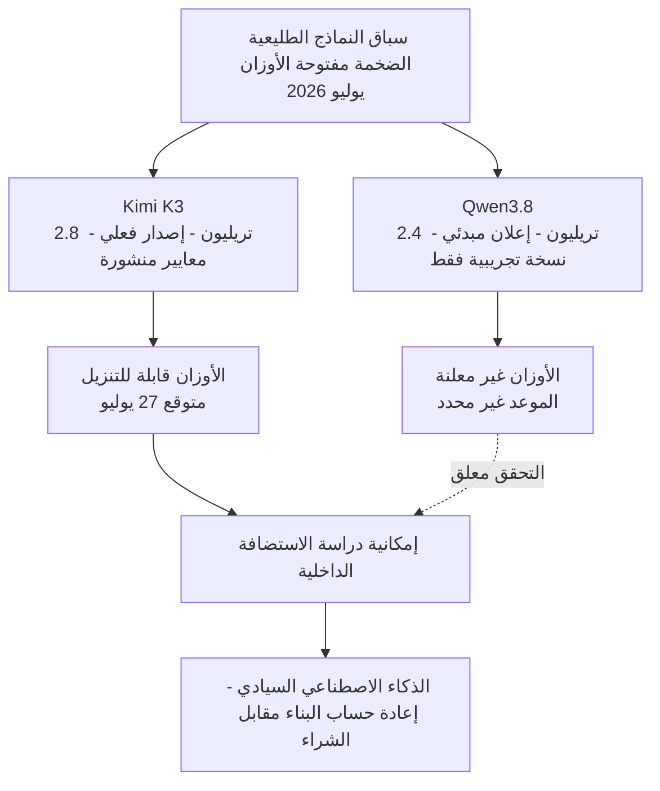

مساء يوم الأحد، ظهر إعلان قصير من فريق Qwen التابع لعلي بابا على الخط الزمني. تضمن الإعلان أن Qwen3.8 سيصدر قريبا وسيُطرح كأوزان مفتوحة، مع رقم حجم المعلمات المرافق وهو 2.4 تريليون. وبما أن هذا الإعلان جاء بعد أيام قليلة فقط من إصدار Moonshot الفعلي لنموذج Kimi K3 بحجم 2.8 تريليون معلمة، فقد عزز هذا الإعلان الانطباع بأن "سباق النماذج المفتوحة الضخمة بات يحدث على أساس أسبوعي".

لكن الإعلان ليس إصدارا. يسعى هذا المقال إلى نزع فتيل الحماس، والفصل بين ما تأكد فعلا في هذا الإعلان وما لا يزال مجرد ادعاء. فبالنسبة لشركة مثل ThakiCloud التي تستضيف النماذج على بنية تحتية خاصة بالعملاء، لا يمكن بناء خارطة طريق على سطر واحد من نتائج المعايير القياسية أو رقم واحد للمعلمات. إن التمييز بين ما هو مؤكد وما ليس كذلك هو في حد ذاته من صميم عمل شركة البنية التحتية.

## ماذا أُعلن عن Qwen3.8

لنبدأ بالحقائق المؤكدة. أعلن فريق Qwen التابع لعلي بابا في 19 يوليو 2026 عن Qwen3.8 مع الإفصاح عن سياسة الإصدار كأوزان مفتوحة. الرقم الرئيسي هو 2.4 تريليون معلمة، وقُدّم النموذج كنموذج متعدد الوسائط. هذا هو الجزء الذي صرّحت به الجهة المعلنة صراحة.

كما تأكد مسار الوصول إلى النموذج. أصبح Qwen3.8-Max-Preview متاحا بالفعل للاختبار عبر Token Plan التابع لعلي بابا، وكذلك عبر Qoder وQoderWork. بعبارة أخرى، ما يمكن تجربته الآن فعليا هو النسخة التجريبية (Preview)، وهي خدمة مستضافة على منصة علي بابا نفسها. وذكرت الشركة أن النسخة الكاملة من Qwen3.8 ستُطرح لاحقا كأوزان مفتوحة، لكنها لم تلتزم بتاريخ محدد.

يجب هنا التمييز بوضوح بين أمرين. أولا، ما هو متاح للاستخدام الآن هو "نسخة تجريبية" وليس "أوزانا مفتوحة". ثانيا، عبارة "الإصدار قريبا" لا تحمل أي جدول زمني فعلي. وعندما يختلط هذان الأمران ببعضهما، يسهل الوقوع في وهم امتلاك نموذج لا يمكن تنزيله بعد.

## إلى أي مدى يمكن الوثوق بادعاءات الأداء

الجزء الذي يستوجب أقصى درجات الحذر هو الأداء. ادّعت علي بابا أن Qwen3.8 يضاهي النماذج الرائدة المتقدمة، وأنه يأتي في المرتبة التالية مباشرة بعد Fable 5 من Anthropic. وعلى منصة X، ذهبت بعض التفاعلات إلى أبعد من ذلك، مدّعية أنه "يتفوق على GPT-5.6". غير أن هذه الادعاءات لا تستند إلى أي معايير قياسية منشورة حتى الآن، إذ لم تُرفق أي نتائج تقييم قياسية مع الإعلان. لذلك، يجب قراءة جميع العبارات المتعلقة بالأداء على أنها ادعاءات [تقديري] من الجهة المعلنة والمجتمع، لا أكثر.

كما يوجد الكثير من الغموض على المستوى البنيوي. لم تفصح علي بابا عن عدد المعلمات النشطة (active parameters) ولا عن تكوين مزيج الخبراء (Mixture-of-Experts). وهذا إغفال مهم من الناحية العملية. فرقم 2.4 تريليون يمثل الحجم الإجمالي فقط، ولا يخبرنا بحجم الحساب الفعلي الذي يعمل مع كل رمز (token). وبالمقارنة مع Kimi K3 الذي صدر قبل أيام قليلة وأوضح صراحة أنه يُفعّل 16 خبيرا فقط من أصل 896 خبيرا من إجمالي 2.8 تريليون معلمة، يظل رقم 2.4 تريليون الخاص بـQwen3.8 أقرب إلى رقم إعلاني رئيسي لا يمكن من خلاله تقدير تكلفة الاستضافة بعد.

وفيما يلي ملخص لذلك:

| البند | الحالة |
|---|---|
| الإعلان وسياسة الأوزان المفتوحة | مؤكد |
| 2.4 تريليون معلمة (إجمالي) | مؤكد (رقم رئيسي) |
| متعدد الوسائط | مؤكد |
| توفر اختبار Max-Preview | مؤكد (مستضاف) |
| موعد إصدار الأوزان الكاملة | غير محدد |
| المعايير القياسية | غير معلن |
| المعلمات النشطة وتكوين MoE | غير معلن |
| أداء "المرتبة التالية بعد Fable 5" | ادعاء غير متحقق منه [تقديري] |

## لماذا تظهر النماذج المفتوحة الضخمة تباعا الآن

هذا الإعلان ليس حدثا منعزلا، بل مشهد ضمن تيار أوسع. وصفت إحدى وسائل الإعلام Qwen3.8 بأنه محاولة من علي بابا للحاق بـKimi K3، وهذا الإطار يلخص الوضع جيدا. ففي غضون أيام قليلة، ظهرت نماذج مفتوحة (أو على وشك أن تصبح مفتوحة) ضخمة جدا بحجمي 2.8 تريليون و2.4 تريليون معلمة تباعا، وبات ميزان القوى يتحول نحو أن تصبح القدرات على مستوى الطليعة (frontier) غير حكر على واجهات برمجة التطبيقات المغلقة.

الأثر المترتب على هذا التيار بالنسبة لشركات البنية التحتية واضح. فبالنسبة للعملاء الذين لا يمكنهم استخدام واجهات برمجة التطبيقات الخارجية، أي أولئك الذين يجب عليهم تشغيل النماذج داخل حدودهم الخاصة بسبب سيادة البيانات أو القيود التنظيمية، تفتح النماذج المفتوحة الضخمة خيارا جديدا. غير أن هذا الخيار لا يصبح فعّالا فعليا عند الإعلان عن النموذج، بل عندما تصبح الأوزان قابلة للتنزيل ونتمكن نحن من إعادة إنتاجها على أجهزتنا الخاصة.

## وجهة نظر ThakiCloud: ماذا يعني استضافة نموذج بحجم 2.4 تريليون معلمة داخليا

لنفترض جدلا أن Qwen3.8 صدر فعلا كأوزان مفتوحة كما أُعلن. عندئذ تصبح مهمة استضافة نموذج متعدد الوسائط بحجم 2.4 تريليون معلمة في بيئة داخلية لدى العميل أمرا واقعا. وفي هذه الحالة، لا تكمن العقبة في مدى ذكاء النموذج، بل في ذاكرة وحدات معالجة الرسومات (GPU)، والربط البيني (interconnect)، واستراتيجيات نقل الخبراء (expert offloading) والتكميم (quantization). ونظرا لعدم الإفصاح حتى الآن عن عدد المعلمات النشطة وتكوين MoE، لا يمكننا حساب هذه التكلفة بدقة، ولذلك فإننا لا نحدد خارطة طريق للاستضافة بناء على الإعلان وحده.

توفر منصة ai-platform التابعة لـThakiCloud الأساس اللازم لنقل مثل هذه النماذج المفتوحة الضخمة إلى بيئات العملاء. فجدولة وحدات معالجة الرسومات القائمة على K8s وKueue، والاستضافة المعتمدة على عائلة vLLM، والعزل متعدد المستأجرين (multi-tenant)، كلها عناصر تتيح لنا الشروع سريعا في التحقق فور صدور النموذج فعليا. والقدرة الأساسية هنا هي تحويل "الإعلان" إلى "تحقق" بسرعة فوق خط أنابيب جاهز، لا الانجراف في الحماس المبكر عند مرحلة الإعلان. فميزتا انخفاض تكلفة الاستضافة والسيادة الداخلية لا تؤتيان ثمارهما إلا عندما يصبح النموذج المفتوح في متناول اليد فعليا.

## القيود والحجج المضادة

لا يهدف هذا المقال إلى التقليل من شأن Qwen3.8. فسياسة إصدار نموذج متعدد الوسائط بحجم 2.4 تريليون معلمة كأوزان مفتوحة في حد ذاتها إشارة إيجابية للنظام البيئي، ولو تحققت فعليا لكانت حدثا كبيرا. كما أن إمكانية اختبار النسخة التجريبية بالفعل ليست أمرا بلا قيمة.

غير أنه، من باب التوازن، تجدر الإشارة إلى أن الإعلان ليس إصدارا، والنسخة التجريبية ليست أوزانا مفتوحة، والادعاء الذاتي ليس معيارا قياسيا. وعندما يختلط هذا التمييز الثلاثي، ينجرف الحكم التقني وراء التسويق. وفي المقابل، فإن موقف "لنتجاهل الأمر حتى الإصدار الكامل" مبالغ فيه أيضا. والموقف الصحيح يقع بين هذين الطرفين: متابعة التيار عن كثب، لكن بناء خارطة الطريق فقط على الحقائق التي تم التحقق منها. وفي ظل ظهور النماذج المفتوحة الضخمة وإصدارها بفارق أسابيع قليلة، فإن الالتزام بهذا التمييز هو ما يبني ثقة شركة البنية التحتية.

## المصادر

- [Alibaba Launches Qwen 3.8 With 2.4 Trillion Parameters, Claims Near-Frontier Performance - MLQ News](https://mlq.ai/news/alibaba-launches-qwen-38-with-24-trillion-parameters-claims-near-frontier-performance/)
- [Alibaba Announces 2.4 Trillion-Parameter Open-Weight Qwen 3.8 - OfficeChai](https://officechai.com/ai/alibaba-qwen-3-8/)
- [Qwen3.8 Preview: 2.4T Params, Open Weights, Release - BuildFastWithAI](https://www.buildfastwithai.com/blogs/qwen3-8-preview-2-4t-params-open-weights-release)
- [Qwen3.8 Teases a 2.4 Trillion Parameter Open Model as Alibaba Chases Kimi K3 - Startup Fortune](https://startupfortune.com/qwen38-teases-a-24-trillion-parameter-open-model-as-alibaba-chases-kimi-k3/)
- [Qwen on X (announcement)](https://x.com/Alibaba_Qwen/status/2078759124914098291)
