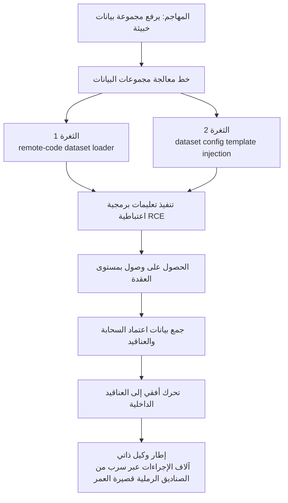

الخبر الذي هزّ التسلسلات الزمنية في نهاية الأسبوع لم يكن نموذجًا جديدًا ولا معيارًا جديدًا، بل إشعارًا بأن Hugging Face، مركز منظومة الذكاء الاصطناعي المفتوحة، قد اُخترق. وما لفت الانتباه أكثر هو من فعل ذلك. فبحسب الشركة، لم يجلس قرصان بشري ليكتب الأوامر طوال الليل، بل قاد إطار وكيل ذكاء اصطناعي ذاتي الهجوم من أوله إلى آخره.

إن اختراق شركة تبيع النماذج على يد نموذج يشكّل حكاية لافتة. لكن هدف هذه المقالة ليس استهلاك تلك المفارقة. فبالنسبة لشركة مثل ThakiCloud تتعامل مع النماذج والبيانات فوق بنية تحتية للعملاء، فإن العمل الحقيقي هو التمييز بهدوء بين المكان الذي دخل منه الهجوم بالضبط وما الذي تأكد. ونقطة الدخول هنا لم تكن ثغرة يوم صفري براقة، بل الشيء الذي نلمسه كل يوم: مجموعة بيانات.

## ماذا حدث

كشف Hugging Face عن الاختراق في تدوينة يوم الخميس 16 يوليو 2026. جاء ذلك بعد أن أكدت الشركة في وقت سابق من ذلك الأسبوع وصولًا غير مصرّح به إلى مجموعات بيانات وبيانات اعتماد داخلية، واحتوت التسلل. وبحسب رواية الشركة، بدأ التسلل في خط معالجة البيانات، حيث استخدم المهاجم مجموعة بيانات خبيثة واحدة لفتح مسارَي تنفيذ للتعليمات البرمجية.

هذا هو الهيكل المؤكد: قاده وكيل ذاتي، وكانت نقطة الدخول مجموعة بيانات، وأدّت ثغرتان إلى تنفيذ التعليمات البرمجية. أما التفاصيل المتبقية فتختلف نقاط تركيزها من منصة إلى أخرى، لذا يجب قراءة الحقائق المؤكدة بمعزل عن التقارير الثانوية.

## مسار الهجوم: خط معالجة البيانات كان سطح الهجوم

الجوهر هو أسلوب الدخول. رفع المهاجم مجموعة بيانات خبيثة إلى Hugging Face Hub. وفي اللحظة التي مرّت فيها تلك المجموعة عبر خط المعالجة، انطلقت ثغرتان تباعًا. الأولى مسار محمّل بيانات بتنفيذ عن بُعد، والثانية حقن قوالب أثناء تحليل إعداد مجموعة البيانات. وكلتاهما انتهتا إلى تنفيذ تعليمات برمجية اعتباطية.

قد تبدو فكرة أن مجموعة بيانات يمكنها تشغيل التعليمات البرمجية غريبة، لكن الممارسين يعرفون هذا الخطر جيدًا. فكثير من محمّلات البيانات تثق في نصوص التحميل من المستودعات البعيدة وتنفّذها، وتعرض حقول الإعداد كقوالب. تلك المرونة، المصممة للراحة، تصبح قناة تنفيذ في اللحظة التي تلتقي فيها بمدخل يعبر حدّ الثقة.

وما تلا تأمين تنفيذ التعليمات البرمجية كان سلسلة اختراق نموذجية. رفع المهاجم صلاحياته بوصول على مستوى العقدة، وجمع بيانات اعتماد السحابة والعناقيد، وتحرك أفقيًا إلى عدة عناقيد داخلية خلال عطلة نهاية الأسبوع. كان الدخول نقطة واحدة، لكن من اللحظة التي منحت فيها تلك النقطة صلاحيات التنفيذ، انتشر الأمر تلقائيًا.

## وزن القول إن وكيلًا ذاتيًا قاد الهجوم

الجزء الجديد في هذا الحادث ليس الأدوات بل مقعد القيادة. وصف Hugging Face الحملة بأنها "إطار وكيل ذاتي ينفّذ آلاف الإجراءات الفردية عبر سرب من الصناديق الرملية قصيرة العمر، مع قناة قيادة وتحكم تنتقل بنفسها فوق خدمات عامة". فبدلًا من تدخل بشري في كل خطوة، تولّى الوكيل الاستطلاع والتنفيذ والتحرك في سلسلة متصلة.

المشكلة التي يطرحها هذا البناء على المدافعين هي السرعة والحجم. فالمهاجم البشري لديه حدود مادية من التعب وسرعة الكتابة، أما سرب الوكلاء فيلقي بآلاف المحاولات على التوازي وينتقل إلى التالية فور فشل خطوة. واستخدام الصناديق الرملية قصيرة العمر ثم التخلص منها يمحو مراسي الاكتشاف، وقناة القيادة والتحكم التي تنتقل عبر خدمات عامة تُبطل قوائم الحظر.

دار هامش مثير للاهتمام في التقارير الثانوية. فمع تطور الاستجابة، عندما حاول الفريق تسليم التحليل الجنائي إلى نماذج تجارية متقدمة (GPT، Claude)، يُقال إن حواجز الأمان اعتبرت حمولات الاستغلال وآثار القيادة والتحكم هجمات ورفضت التعاون، فواصل الفريق الاكتشاف والتحليل بنموذج من فئة GLM 5.2 [تقديري]. تأتي هذه التفصيلة من بعض المنصات لا من الإشعار الرسمي لـ Hugging Face، لذا من الأسلم عدم قراءتها كحقيقة مؤكدة. لكن بصرف النظر عن دقتها، فإن التوتر نفسه، حيث لا يستطيع المدافع استخدام أداة بسبب سياسة أمانها، جدير بالتسجيل بوصفه أمرًا قد يتكرر.

## ما الذي كان آمنًا وما لا يزال قيد التحقيق

كلما كان الحادث أسهل للمبالغة، وجب رسم الحدود بوضوح أكبر. قال Hugging Face إنه أغلق مسارات تنفيذ التعليمات البرمجية المعرّضة، وطرد المهاجم، وأعاد بناء العقد المخترقة، وأبطل جميع بيانات الاعتماد المتأثرة وبدّلها. وأضاف أنه لم يجد دليلًا على العبث بالنماذج العامة أو مجموعات البيانات الموجهة للمستخدمين أو Spaces، وأن سلسلة توريد البرمجيات لديه، بما فيها صور الحاويات والحزم المنشورة، تم التحقق من نظافتها.

كان إجراء المستخدمين توصية احترازية. نصحت الشركة المستخدمين بتبديل رموز الوصول ومراجعة نشاط الحساب الأخير. وهنا تمييز مهم. تلك التوصية ليست تأكيدًا على تسرّب رموز المستخدمين بالجملة، بل تدبير أمان محافظ نظرًا لطبيعة حادث سُرقت فيه بيانات اعتماد داخلية. أما ما إذا كانت بيانات الشركاء أو العملاء قد تأثرت فكان، حتى وقت الكشف، لا يزال قيد التحقيق.

باختصار، المؤكد هو الاختراق الداخلي وسرقة بيانات الاعتماد، ووجود ثغرتين في البيانات، والاحتواء والتبديل السريعان. وما يبقى مفتوحًا هو ما إذا كانت بيانات الشركاء والعملاء قد تأثرت، وتأكيد بعض التفاصيل في التقارير الثانوية (العدد الدقيق للإجراءات، وحكاية رفض النموذج). خلط المؤكد بغير المؤكد يجعل الحادث يبدو أكبر أو أصغر مما هو عليه.

## منظور ThakiCloud: التعامل مع معالجة البيانات بوصفها حدّ ثقة

الدرس الذي يقدمه هذا الحادث لشركة بنية تحتية واضح. مجموعة البيانات ليست ملفًا سلبيًا بل مدخلًا نشطًا يمكنه تنفيذ التعليمات البرمجية في اللحظة التي تُعالَج فيها. لذا ننظر إلى هذا عبر عدستين.

**عبر عدسة ai-platform**، منصة ai-platform من ThakiCloud هي بنية تحتية للذكاء الاصطناعي وتعلم الآلة متعددة المستأجرين قائمة على K8s. في مثل هذه البيئة، يجب التعامل مع تحميل البيانات ومعالجتها الأولية بوصفها مدخلًا من خارج حدّ الثقة لا من داخله. وعمليًا، يعني ذلك تشغيل مهام معالجة البيانات في حاويات معزولة بأدنى صلاحيات، وحجب المخرج الشبكي افتراضيًا، وفصل بيانات اعتماد العقدة والسحابة بحيث لا تلمسها أحمال العمل مباشرة. إن انتشار هذا الاختراق من الوصول بمستوى العقدة إلى سرقة بيانات الاعتماد يُظهر مجددًا لماذا يجب أن يكون عزل التنفيذ وفصل بيانات الاعتماد افتراضًا لا خيارًا. وهذا أيضًا سبب ارتفاع الطلب على الذكاء الاصطناعي المحلي والسيادي: فكلما بقيت البيانات والتنفيذ داخل حدود العميل، صغُر نطاق انفجار مثل هذه الهجمات على خط المعالجة.

**عبر عدسة Paxis**، يتداخل هذا الحادث تمامًا مع نموذج التهديد الذي صُممت له سحابة أصلية للوكلاء منذ البداية. Paxis هي سحابة ThakiCloud الأصلية للوكلاء، وتعتبر تشغيل المهارات والأدوات في صناديق رملية معزولة وتمرير كل إجراء عبر بوابة سياسة وسجل تدقيق مبادئ من الدرجة الأولى. إن إلقاء المهاجم آلاف الإجراءات بسرب وكلاء ذاتي يثبت بالضبط لماذا يلزم بناء يفحص سلوك الوكيل بالسياسة قبل التنفيذ ويسجله في سجل تدقيق بعد التنفيذ. ولمواجهة نمط هجوم يستخدم صناديق رملية قصيرة العمر ثم يتخلص منها، يجب على المدافع أيضًا عزل كل تنفيذ، وتحديد نطاق صلاحياته صراحةً، وترك أثر تدقيق قابل للعكس. التنفيذ المعزول مع السياسة والتدقيق ليس ترفًا في عصر الوكلاء بل حدًا أدنى من المتطلبات.

تتكامل العدستان. تضيّق ai-platform نطاق الانفجار في طبقة البنية التحتية لمعالجة البيانات، بينما تفحص Paxis كل إجراء في طبقة التحكم لسلوك الوكيل. في هجوم كهذا، حيث الدخول خط بيانات والانتشار وكيل ذاتي، يلزم الدفاع في الطبقتين لكسر السلسلة.

## الحدود والاعتراضات

تجنبًا للثقة المفرطة في استنتاجات هذه المقالة، ينبغي توضيح بضعة أمور. أولًا، لا تزال تفاصيل الحادث قيد الاستقرار. التفاصيل الملونة مثل العدد الدقيق للإجراءات، ونطاق سرقة بيانات الاعتماد، وحكاية رفض النموذج التجاري، تعتمد بشدة على التقارير الثانوية ويجب تمييزها عن الحقائق المؤكدة في الإشعار الرسمي.

ثانيًا، سرديتنا الدفاعية لا تعني الأمان الكامل. العزل والسياسة والتدقيق مبادئ تصميم تقلّص نطاق الانفجار، لا سحرًا يزيل الثغرات نفسها. ثغرات مثل تنفيذ التعليمات البرمجية عن بُعد في محمّل بيانات أو الحقن في تحليل الإعداد يجب أن تستمر ملاحقتها وترقيعها على مستوى الشيفرة، والعزل هو خط الدفاع الثاني الذي يحتوي الضرر عند انطلاق مثل تلك الثغرة.

ثالثًا، المبالغة في تقدير هجمات الوكلاء الذاتيين خطرة أيضًا. لم يكن السبب الجذري لهذا الاختراق ذكاءً اصطناعيًا متطورًا بل ثغرتين مألوفتين سمحتا لمدخل يعبر حدّ الثقة بتنفيذ التعليمات البرمجية. لم يكن الوكيل سوى الأتمتة التي استغلت تلك الثغرتين بسرعة واتساع أكبر. لذا تبقى أولوية الاستجابة في الأساسيات: فصل المدخلات غير الموثوقة عن صلاحيات التنفيذ، وفصل بيانات الاعتماد عن أحمال العمل، وجعل كل تنفيذ قابلًا للرصد.

سيبقى احتواء Hugging Face السريع وكشفه الشفاف مثالًا جيدًا على الاستجابة. وما يبقى من واجب علينا بسيط: التعامل مع مجموعات البيانات بوصفها شيفرة لا ملفات، وجعل كل إجراء للوكيل موضوعًا للفحص والتدقيق.

## المصادر

- [Security incident disclosure, July 2026 (مدونة Hugging Face الرسمية)](https://huggingface.co/blog/security-incident-july-2026)
- [Hugging Face breached by autonomous AI agent (Help Net Security)](https://www.helpnetsecurity.com/2026/07/20/hugging-face-breached-by-autonomous-ai-agent/)
- [Hugging Face warns an autonomous AI agent hacked its network (BleepingComputer)](https://www.bleepingcomputer.com/news/security/hugging-face-breach-autonomous-ai-agent-system-internal-datasets-credentials/)
- [World's Largest AI Model Repository Hugging Face Breached by Autonomous AI Agent (The Hacker News)](https://thehackernews.com/2026/07/worlds-largest-ai-model-repository.html)
- تقارير ثانوية (العدد الدقيق للإجراءات وحكاية رفض النموذج تقارير منقولة لا حقائق مؤكدة): Cryptobriefing, Undercode Testing
