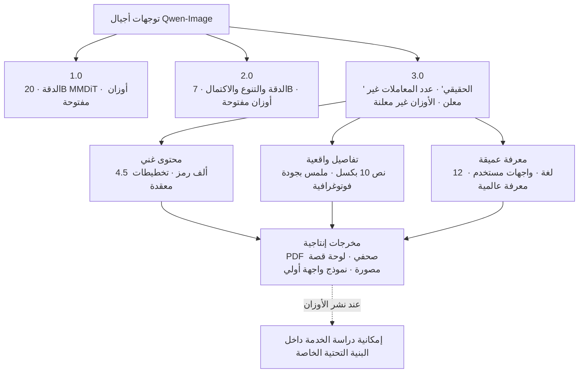

صباح يوم الثلاثاء، نشر فريق Qwen على مدونته إعلان الجيل الثالث من نموذج توليد الصور. اسم النموذج هو Qwen-Image-3.0، وقد اختصر الفريق مرة أخرى الكلمات المفتاحية التي كان يطلقها مع كل جيل في عبارة واحدة. إذا كان الجيل 1.0 يحمل شعار "الدقة"، والجيل 2.0 شعار "الدقة والتنوع والاكتمال والجمالية والأصالة"، فإن جوهر الجيل 3.0 يتلخص في كلمة واحدة: "الحقيقي (实، Real)".

غير أن الإعلان ليس إصدارًا فعليًا للنموذج. يحاول هذا المقال أن يزيل بريق العروض التوضيحية، ويوضح ما تأكد فعلًا في هذا الإعلان وما لا يزال بعيد المنال. فمن موقع من يقدّم خدمة نماذج توليد الصور على البنية التحتية لدى العملاء، لا يمكن الجزم بخارطة الطريق اعتمادًا فقط على بضع صور توضيحية وعبارات تسويقية عن القدرات. فالتمييز بين ما هو مؤكد وما ليس كذلك هو بالضبط ما تفعله شركات البنية التحتية في عملها اليومي.

## ما الذي أُعلن عنه في Qwen-Image-3.0

لنبدأ بالحقائق المؤكدة. أعلن فريق Qwen في 21 يوليو 2026 عن Qwen-Image-3.0، ووصف توجّه هذا النموذج عبر ثلاثة محاور رئيسية.

المحور الأول هو "المحتوى الغني (Rich Content)". يستوعب النموذج مدخلات تعليمات (instructions) بطول يصل إلى 4.5 ألف رمز، ما يسمح له برسم تخطيطات عالية الكثافة المعلوماتية دفعة واحدة، مثل الصحف أو لوحات القصة المصورة (storyboard) أو أوراق الاختبارات. وأبرز مثال في الإعلان كان شبكة صور بتنسيق 3×3، حيث تمثل كل خانة إنفوغرافيك مختلف: كوميكس عن السلامة في الأنفاق، ومحاضرة في الهندسة الفراغية، وحركة القذائف في الفيزياء، ومقارنة بنية الحمض النووي للخلايا. وأُنتجت هذه الشبكة بالكامل من تعليمة واحدة بطول 3.7 ألف رمز. وشدّد الفريق على أن هذا لم يكن عبارة عن دمج صور متعددة، بل توليد واحد فقط. إلى جانب ذلك، عُرض مثال على رسم "شاشة داخل شاشة داخل شاشة" متداخل: شاشة VSCode تحتوي على Qwen Chat، وداخله شاشة WeChat، وداخلها ملصق (بوستر).

المحور الثاني هو "التفاصيل الواقعية (Authentic Details)". يرسم النموذج نصوصًا صغيرة بحجم 10 بكسل تظل قابلة للقراءة، ويصوّر مسام البشرة والشعر وملمس الجلد بدقة تقارب الصورة الفوتوغرافية. وقُدّمت أيضًا أمثلة على صفحات أبحاث أكاديمية مكتظة بمعادلات LaTeX، وصفحات صحف حقيقية، وحالات استخدام في التحرير مثل إضافة ملاحظات مكتوبة بخط اليد أو ترميم لوحات تقليدية متضررة.

المحور الثالث هو "المعرفة العميقة (Deep Knowledge)". يرسم النموذج نصوصًا أصلية بأكثر من 12 لغة، ويستحضر أكثر من 100 أسلوب فني ومختلف واجهات المستخدم استنادًا إلى معرفة عالمية واسعة. وتضمّن الإعلان أمثلة على رسم نصوص دقيقة باليابانية والكورية والإسبانية، مع الإشارة إلى أن النموذج متصل بالإنترنت ما يتيح له استحضار معلومات حديثة. ومن الأمثلة على توليد شخصيات معروفة تحديدًا، عُرض مشهد يظهر فيه تشي بايشي وفان جوخ وهما يقدّمان Qwen-Image-3.0 في بث مباشر.

مسار الوصول إلى النموذج مؤكد أيضًا. جميع أزرار التجربة في منشور الإعلان تُحيل إلى ميزة تحويل النص إلى صورة داخل Qwen Chat. أي أن ما يمكن تجربته الآن هو خدمة مستضافة على منصة علي بابا، وهذا يعني توفّرًا بطابع نسخة معاينة (preview) فقط.

## ما الذي لم يُعلن عنه بعد

هنا يبدأ الجزء الذي يستوجب قراءة حذرة. يفتقر منشور الإعلان هذا إلى معلومة أساسية يجب التحقق منها أولًا قبل أي تبنٍّ فعلي لنموذج توليد صور.

لا توجد أوزان (weights). الإعلان بمثابة عرض توضيحي للقدرات، ولا يُحيل إلى نقاط تفتيش (checkpoints) قابلة للتنزيل على Hugging Face أو ModelScope. حتى الموقع الخارجي غير الرسمي الذي يقدّم مولّدًا مجتمعيًا للنموذج ما يزال يضع بجانب 3.0 عبارة "الوصول قيد الانتظار (access pending)". كذلك لم يُذكر في منشور الإعلان عدد المعاملات (parameters) ولا بنية النموذج (architecture) ولا الترخيص. وبالمقارنة مع الإعلان السابق عن أن الجيل 1.0 كان بمعمارية MMDiT بحجم 20 مليار معامل، وأن الجيل 2.0 خفّض عدد المعاملات إلى 7 مليارات، لا توجد في 3.0 حتى الآن أي إشارة تسمح بتقدير بنيته.

كذلك لا توجد معايير قياسية (benchmarks) معتمدة. قدرات مثل استيعاب مدخلات بطول 4.5 ألف رمز أو رسم نصوص بحجم 10 بكسل عُرضت فقط عبر أمثلة اختارها فريق الإعلان بعناية، ولم تُرفق بجداول تقييم قابلة لإعادة الإنتاج مثل DPG أو GenEval. لذلك، فإن عبارات مثل "أفضل من الجيل السابق" أو "قابل للاستخدام كأداة إنتاجية" ينبغي قراءتها لا كأرقام موثّقة بل كادّعاء من الجهة المعلنة [غير مؤكد]. والعروض التوضيحية عادة ما تنتقي أفضل النتائج، لذا فإن نسبة الإخفاق أو مدى الاتساق يحتاجان إلى تحقق مستقل.

نلخّص ذلك في الجدول التالي:

| البند | الحالة |
|---|---|
| الإعلان عن النموذج من الجيل الثالث | مؤكد |
| استيعاب مدخلات بطول 4.5 ألف رمز · تخطيطات معقدة | مؤكد (عرض توضيحي) |
| نصوص بحجم 10 بكسل · رسم بـ12 لغة | مؤكد (عرض توضيحي) |
| التوفر عبر Qwen Chat | مؤكد (استضافة) |
| الأوزان المفتوحة (Hugging Face / ModelScope) | غير معلن |
| عدد المعاملات · البنية · الترخيص | غير معلن |
| المعايير القياسية | غير معلنة |
| الأداء بمستوى "أداة إنتاجية" | ادعاء غير مؤكد [غير مؤكد] |

## توليد الصور: من "رسم جميل" إلى "أداة إنتاجية"

العبارة المتكررة في الإعلان هي الانتقال من "جيد المظهر (good-looking)" إلى "مفيد (useful)". هذا الإطار يلخّص جيدًا الوجهة التي يستهدفها هذا الجيل من النموذج. فالهدف ليس إنتاج لوحة فنية واحدة جميلة، بل استهداف مخرجات يمكن استخدامها مباشرة في العمل، مثل ملفات PDF لصفحات صحفية، أو لوحات قصة مصورة لمسلسل قصير، أو نماذج أولية معقدة لواجهات المستخدم (UI mockups).

هذا التوجه يحمل دلالتين لشركة بنية تحتية. الأولى تتعلق بالخدمة (serving). عندما يصبح نموذج توليد الصور أداة موثوقة لإنتاج المستندات والإنفوغرافيك ونماذج واجهات المستخدم الأولية، يظهر طلب على تشغيل هذا النوع من النماذج داخل حدود بنية العميل التحتية. ومن الأمثلة النموذجية على ذلك العملاء الذين لا يمكنهم إرسال أصول التصميم أو المستندات الداخلية إلى واجهة برمجة تطبيقات (API) خارجية. أما الدلالة الثانية فتتعلق بالاستخدام الفعلي. فالقدرة على رسم نصوص عالية الكثافة وواجهات مستخدم بدقة تفتح الباب أمام أتمتة إنتاج الإنفوغرافيك والنماذج الأولية التي كانت تُصنع يدويًا.

غير أن هذا الخيار لا يصبح متاحًا فعلًا لحظة الإعلان عن النموذج، بل عندما تصبح الأوزان قابلة للتنزيل ونتمكن نحن من إعادة إنتاجها على أجهزتنا الخاصة. وفي الوقت الراهن، ما زال 3.0 قبل هذه المرحلة.

## من منظور ThakiCloud: ماذا يعني تقديم خدمة نموذج توليد صور داخل البنية التحتية الخاصة (on-prem)

لنفترض جدلًا أن Qwen-Image-3.0 سيُنشر بأوزان مفتوحة كما حصل مع الأجيال السابقة. عندها ستصبح مهمة تقديم خدمة نموذج توليد صور قائم على الانتشار (diffusion) داخل بيئة العميل التحتية الخاصة أمرًا واقعيًا. وفي هذه الحالة، لن يكون عنق الزجاجة قدرة النموذج التعبيرية، بل ذاكرة وحدة معالجة الرسوميات (GPU)، وكفاءة المعالجة الدفعية (batch processing)، وضبط إعدادات الخدمة لتحقيق التوازن بين زمن الاستجابة والإنتاجية. وبما أن عدد المعاملات والبنية غير معلنَين حاليًا، لا يمكننا حساب هذه التكلفة بدقة، ولذلك لا نبني خارطة طريق الخدمة استنادًا إلى الإعلان وحده.

توفّر منصة ai-platform التابعة لـThakiCloud الأساس اللازم لنشر مثل هذه النماذج في بيئة العميل. فجدولة وحدات معالجة الرسوميات القائمة على K8s وKueue، والعزل متعدد المستأجرين (multi-tenant isolation)، تتيح لنا الشروع سريعًا في التحقق من النموذج فور إعلان توفره فعليًا. وبما أن أحمال عمل توليد الصور تختلف في خصائصها عن أحمال عمل النماذج اللغوية، فإن تعديل حجم الدفعة (batch size) وتوزيع وحدات معالجة الرسوميات وفقًا لهذه الخصائص هو ما يحدد تكلفة الخدمة. وميزتا انخفاض تكلفة الخدمة وسيادة البيانات داخل البنية التحتية الخاصة لا تُثبتان قيمتهما إلا حين يصبح النموذج المفتوح متاحًا فعليًا بين أيدينا.

وثمة زاوية أخرى تتعلق بالاستخدام الفعلي. فالقدرة على رسم المستندات والإنفوغرافيك ونماذج واجهات المستخدم بدقة تجعل من هذه القدرة أداة يمكن للوكيل الذكي (agent) استخدامها. ومن منظور Paxis، السحابة الأصيلة للوكلاء الذكية (Agent-Native Cloud) التابعة لـThakiCloud، يمكن تغليف قدرة التوليد هذه كمهارة (skill) وإخضاعها للتنفيذ المعزول الذي يمر عبر بوابات السياسات (policy gates) وسجلات التدقيق (audit logs). غير أن هذه الزاوية أيضًا لن تكون واقعية إلا بعد أن يصبح النموذج متاحًا فعلًا بين أيدينا.

## الحدود والرأي المضاد

لا يهدف هذا المقال إلى التقليل من شأن Qwen-Image-3.0. فالتوجه نحو رسم تخطيطات معقدة بطول 4.5 ألف رمز دفعة واحدة، ورسم نصوص بحجم 10 بكسل قابلة للقراءة، إذا تحقق فعليًا، سيرفع من الجدوى العملية لتوليد الصور خطوة إضافية. كما أن إمكانية تجربته فعليًا الآن عبر Qwen Chat ليست أمرًا بلا قيمة.

لكن حرصًا على التوازن، يجب التذكير بأن الإعلان ليس إصدارًا، وأن العرض التوضيحي ليس معيارًا قياسيًا، وأن توفر الاستضافة ليس أوزانًا مفتوحة. وعندما يتلاشى هذا التمييز الثلاثي، ينجرف الحكم التقني وراء التسويق. كما أن ميزة توليد صور لشخصيات حقيقية بعينها، أو محاكاة واجهات مستخدم حقيقية بدقة، تستدعي مراجعة منفصلة من زاوية حقوق النشر وحقوق الصورة الشخصية وانتحال العلامات التجارية. وفي المقابل، فإن موقف "لنتجاهل الأمر إلى حين الإصدار الكامل" مبالغ فيه أيضًا. والموقف الصحيح يقع بين الاثنين: متابعة التطورات عن كثب، مع بناء خارطة الطريق على وقائع تم التحقق منها فقط. وفي ظل هذه الوتيرة السريعة بين الإعلانات والإصدارات الفعلية، فإن الالتزام بهذا التمييز هو ما يبني ثقة شركات البنية التحتية.

## المصادر

- [Qwen-Image-3.0: Rich Content, Authentic Details, Deep Knowledge - Qwen Team Blog](https://qwen.ai/blog?id=qwen-image-3.0)
- [Qwen Image 3 Generator (third-party, يُظهر access pending)](https://qwenimage3.com/)
- [Qwen-Image GitHub (للرجوع إلى الأوزان المفتوحة للأجيال السابقة)](https://github.com/QwenLM/Qwen-Image)
