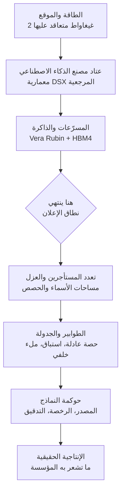

*تجسيد لبنية تتجمع فيها طاقة بمقياس الغيغاواط داخل منشأة حوسبة واحدة.*

## لماذا يستحق هذا المقال القراءة

كُتب هذا المقال لمهندسي المنصات وصنّاع القرار التقني الذين عليهم شراء عناقيد وحدات معالجة الرسوميات أو تشغيل خدمات ذكاء اصطناعي في بيئات محلية وسيادية. إن كنتم تضعون الآن خطط البنية التحتية لعام 2027 وما بعده، فهذا المقال موجّه إليكم.

أبدأ بالخلاصة. حتى حين يبدأ مصنع ذكاء اصطناعي بقدرة 2 غيغاواط عمله في 2027، لن يقصر طابور وحدات المعالجة في مؤسستكم لهذا السبب وحده. حين يزداد العرض لا يختفي الاختناق بل ينتقل إلى الطابق الأعلى. تتحول المسألة من الحصول على العتاد إلى توزيع العتاد المتوفر توزيعا عادلا وكثيفا على المؤسسة كلها. والفرق الوحيد سيكون لمن بنى تلك الطبقة مسبقا، فهو وحده من يحوّل العرض الإضافي إلى إنتاجية فعلية.

## الحقائق المعلنة، ولا شيء سواها

في 24 و25 يوليو 2026 أعلنت SK Group وNVIDIA توسيع شراكتهما الاستراتيجية. وبالاقتصار على ما جرى الإفصاح عنه:

أولا، تتجاوز القيمة الإجمالية للاتفاقيتين 500 مليار دولار. هذا الرقم ليس مبلغا نقديا تدفعه شركة واحدة دفعة واحدة، بل هو الإجمالي الممتد لسنوات ويشمل بناء مصنع الذكاء الاصطناعي وتوريد الذاكرة معا. البيان نفسه يصفه بأنه قيمة مجمّعة عبر اتفاقيتين، لذا فإن قراءته كبند إنفاق رأسمالي واحد تضخّم الحجم.

ثانيا، ستبني SK Telecom مصنع ذكاء اصطناعي بقدرة تصل إلى 2 غيغاواط داخل كوريا، باستخدام منصة DSX من NVIDIA، وتستهدف المرحلة الأولى التشغيل خلال 2027. ويجب التمييز هنا: الرقم 2 غيغاواط هو السقف عند الاكتمال، وما يعمل في 2027 هو المرحلة الأولى فقط.

ثالثا، تقوم منصة DSX على معمارية الحوسبة المتسارعة Vera Rubin التي تعدّها NVIDIA. وهي تجمع عتاد الحوسبة المتسارعة والشبكات والبرمجيات وتقنيات الشركاء في حزمة واحدة، مع هدف تصميمي معلن هو رفع كفاءة الطاقة إلى أقصى حد وخفض تكلفة وحدة المخرجات.

رابعا، وقّعت SK hynix وNVIDIA اتفاقية طويلة الأمد منفصلة لتطوير ذاكرة ذكاء اصطناعي من الجيل التالي. الهدف ذاكرة عالية النطاق الترددي تشمل HBM4، وقد وضعتها الشركتان في سياق طلب يمتد من تدريب النماذج اللغوية الكبيرة إلى الذكاء الاصطناعي الوكيلي والذكاء الاصطناعي المادي.

خامسا، أعلنت الشركتان هدفا مشتركا هو توسيع الوصول إلى بنية تحتية واسعة النطاق للذكاء الاصطناعي في منطقة آسيا والمحيط الهادئ، وترسيخ كوريا مركزا للابتكار في هذا المجال.

هذا هو السجل الموثق. وما يأتي بعده تفسير من زاوية مشغّل بنية تحتية، وكل رقم غير وارد في البيان مذكور بوصفه تقديرا.

## ماذا تعني 2 غيغاواط عمليا

كون الإعلان مقوّما بالطاقة لا بعدد الآلات يقول شيئا عن هذه المرحلة. كانت مراكز البيانات تُحسب بالخوادم أو الرفوف، أما الآن فتُحسب بالقدرة الكهربائية المتعاقد عليها، لأن ارتفاع كثافة الحوسبة جعل السقف محكوما لا بعدد الشرائح التي يمكن وضعها بل بكمية الكهرباء التي يمكن جلبها وتبديد حرارتها.

للتقريب، مفاعل APR1400 الواحد، وهو الوحدة الكبيرة القياسية في كوريا، تبلغ قدرته نحو 1.4 غيغاواط. أي أن 2 غيغاواط تعني استهلاكا مستمرا في موقع واحد يعادل تقريبا إنتاج مفاعل ونصف. وهذه مقارنة تقريبية للتوضيح فقط، لأن القدرة المتعاقد عليها والحمل المتوسط يتحركان بصورة مختلفة في الواقع.

التحويل إلى رفوف يجعل الصورة أوضح. بافتراض نحو 130 كيلوواط للرف الواحد من الجيل الأحدث عالي الكثافة، ومع استبعاد التبريد والمنظومات المساندة، نتحدث عن منشأة تتسع لعشرات الآلاف من الرفوف. هذا الحساب تقدير يستند إلى أرقام معلنة لقدرة الرف، والرقم الحقيقي يتغير كثيرا بحسب كفاءة استخدام الطاقة وتصميم التوزيع ومراحل التوسعة.

لكن لمن شغّل بنية تحتية من قبل، ثمة نقطة أهم. الحمل الجديد بمقياس الغيغاواط ليس مسألة شراء بل مسألة ربط بالشبكة الكهربائية. يجب أن تُحل بالترتيب مسائل الأرض وسعة النقل ومحطات التحويل والتراخيص قبل أن تصل الكهرباء إلى أول رف. وهذا جزء من سبب بدو تاريخ 2027 متحفظا.

## كيف تغيّر DSX وHBM4 طبيعة التوريد

هناك نقطتان تقنيتان تستحقان الانتباه.

الأولى هي المعمارية المرجعية الكاملة التي تحمل اسم DSX. وهي إشارة إلى أن مركز البيانات يتحول من مبنى تملؤه بالخوادم إلى مصنع تنسخه من مخطط مُختبر. فحين يسلّم مورّد واحد الحوسبة والشبكات والتخزين والطاقة والتبريد والبرمجيات فوقها كحزمة، ينخفض زمن التصميم والتحقق انخفاضا حادا. والمقابل أن الحزمة كلها ترتبط بخارطة طريق مورّد واحد. والدخول في هذه المقايضة عن وعي يختلف تماما عن الدخول فيها بغير وعي بعد بضع سنوات.

الثانية هي التطوير المشترك للذاكرة. أي فريق شغّل نموذجا كبيرا من نوع خليط الخبراء يعرف أن سقف الإنتاجية الحقيقية يحدده النطاق الترددي للذاكرة لا قدرة الحساب الخام. فكل رمز يُولَّد يتطلب قراءة المعاملات النشطة من الذاكرة، ولذلك يتحول النطاق الترددي مباشرة إلى زمن استجابة عند الدفعات الصغيرة. ومواءمة شركة ذاكرة وشركة معالجات لخارطتي طريقهما مسبقا تعني أن الإنتاجية الفعلية للجيل التالي من المسرّعات ستصبح أكثر قابلية للتنبؤ مما هي عليه اليوم.

يفصل الرسم أدناه بين الطبقات التي يملؤها هذا الإعلان وتلك التي تبقى فارغة.

*يملأ الإعلان الطبقات الثلاث السفلى، بينما تبقى الطبقات الأربع فوقها من عمل كل مؤسسة.*

## ما الذي يتبدل في مشهد البنية التحتية الكورية

حتى الآن كان الاختناق الأكثر شيوعا لدى الشركات الكورية التي تشغّل أحمال ذكاء اصطناعي هو الكمية نفسها. متى وكم وحدة معالجة يمكن الحصول عليها كان يحدد جداول المشاريع، وهو ما جعل التوريد نفسه استراتيجية.

هذا الافتراض يبدأ بالاهتزاز بعد 2027. فحين تستقر حوسبة متسارعة واسعة النطاق داخل الإقليم المحلي، يتسع خيار التدريب والخدمة دون نقل البيانات عبر الحدود. وفي مجالات مثل القطاع العام والرعاية الصحية والدفاع، حيث يُمنع تصدير البيانات أصلا، يصبح هذا الفارق حاسما. عندها يتوقف الذكاء الاصطناعي السيادي عن كونه شعارا سياسيا ويصير منتجا قابلا للشراء.

ووضع هذا الإعلان فوق تحركات الأسابيع الأخيرة يجعل الاتجاه أوضح. فقد ربطت اليابان الحكومة والقطاع الصناعي حول الذكاء الاصطناعي الروبوتي بميزانيات ضخمة متجهة نحو جبهة الذكاء الاصطناعي المادي. وفي كوريا خُصصت موارد وطنية من وحدات المعالجة لبرامج النماذج الأساسية المستقلة ومسابقات الذكاء الاصطناعي الأمني، وانتقل مركز ثقل التقييم من الأداء المجرد إلى قابلية التطبيق الميداني في الخدمات العامة والرعاية الصحية والتصنيع والدفاع. وإعلان 2 غيغاواط يحطّ فوق هذا التيار الذي تسحب فيه الدول النماذج والحوسبة إلى داخل حدودها. لقد صار عرض الحوسبة بندا في السياسة الصناعية الوطنية.

وهنا سوء قراءة شائع. مصنع الذكاء الاصطناعي منشأة تورّد مادة خاما، وهو ليس المنصة التي تستخدمها مؤسستكم. فما إن تجهز الطاقة والرفوف والمسرّعات حتى تبدأ مشكلة مختلفة تماما لحظة تقاسم عدة فرق لعنقود واحد. من يحصل على كم، وهل يجوز لحمل استدلال عاجل أن يزيح مهمة تدريب طويلة، ومن أين تستأنف المهمة المُزاحة، وبأي قاعدة تُملأ السعة الخاملة، كل ذلك يجب أن يُحسم مسبقا. وبدون هذه القواعد تظهر وحدات معالجة خاملة وطوابير طويلة في العنقود نفسه في اللحظة نفسها. ومضاعفة العرض عشر مرات لا تزيل هذه الظاهرة.

## ما الذي يعنيه هذا لمنتجات ThakiCloud

أكدت لنا قراءة هذا الإعلان أمرا واحدا: المنتجان اللذان نبنيهما يستهدفان بالضبط الطبقات الأربع العليا في ذلك الرسم.

منصة ai-platform هي طبقة البنية التحتية التي تشغّل أحمال الذكاء الاصطناعي والتعلم الآلي فوق Kubernetes. تستخدم Kueue لإدارة الطوابير والحصص، وتفرض التقاسم العادل والاستباق والملء الخلفي على مستوى المؤسسة كقواعد لا كأعراف. وتدير إنتاجية الاستدلال عبر خدمة قائمة على vLLM، ويتيح عزل المستأجرين المتعددين لفرق وعملاء كثيرين تقاسم عنقود واحد بأمان. ولأنها صُممت منذ البداية للبيئات المحلية والسيادية، يمكن وضع الحوسبة المتسارعة الواصلة إلى الإقليم المحلي تحتها مباشرة. فما يزيده مصنع الذكاء الاصطناعي هو البسط، وما تعالجه هذه الطبقة هو الكفاءة التي تحوّل ذلك البسط إلى إنتاجية.

أما Paxis فهي مستوى التحكم السحابي الأصيل للوكلاء الذي يعمل فوقها. تتعامل مع المهارات والأدوات والسياسات وسجلات التدقيق بوصفها موارد من الدرجة الأولى. فالعرض الكبير يعني استخداما كبيرا، والاستخدام الكبير يتحول بلا استثناء إلى مسألة حوكمة. ولهذا تحتاجون إلى كتالوج نماذج يفحص مصدر النموذج ورخصته، وبوابة سياسات تسمح بتنفيذ الوكلاء بحسب درجة الاستقلالية، وسجلات تدقيق تحفظ ما نُفّذ ومتى. وكلما صارت الحوسبة وفيرة، صارت القدرة على التحكم بها هي عامل التمايز.

والعدستان تكمّلان بعضهما. فأنتم بحاجة إلى قاعدة خدمة رخيصة ووفيرة قبل أن يصبح تشغيل الوكلاء باستمرار مجديا اقتصاديا، وبحاجة إلى التحكم في تنفيذ الوكلاء قبل أن تتمكنوا من بيع تلك الحوسبة الوفيرة للقطاعات الخاضعة للتنظيم.

## الحدود والاعتراضات

كي لا تُقرأ هذه الأخبار بتفاؤل فقط، إليكم الوجه الآخر.

الإعلان ليس بدء إنشاء. فالمادة المفصح عنها تتضمن بنودا في مرحلة خطاب النوايا، وما يعمل في 2027 هو المرحلة الأولى من سقف 2 غيغاواط. أما موعد تحقق الحجم الكامل فليس معلومة مؤكدة بعد.

ورقم 500 مليار دولار يحتاج تعاملا حذرا أيضا. فهو إجمالي ممتد لسنوات عبر اتفاقيتين، ويجمع صفقات مختلفة الطبيعة مثل عقود توريد الذاكرة. وتحويله إلى إنفاق رأسمالي على بناء مراكز بيانات واقتباسه بوصفه استثمارا محليا يبالغ في الصورة.

ومعظم مخاطر الجدول الزمني تقع في الطاقة والأرض لا في أشباه الموصلات. فالربط بالشبكة وسعة النقل والتراخيص بنود لا تستطيع التقنية ضغطها.

والاعتراض الأقوى يقول: إذا ارتفع العرض انخفضت أسعار الوحدة، وعندها يُحل جزء كبير من هموم التشغيل بالمال. وفي هذا وجاهة. غير أن ما أظهره العقد الماضي من تاريخ الحوسبة السحابية هو أن انخفاض الأسعار نمّى الطلب بسرعة أكبر، فصارت إدارة التكلفة وتوزيع الموارد مشكلة أصعب نتيجة لذلك. فكلما رخص المورد وضعت فرق أكثر أحمالا أكثر فوقه، وعند تلك اللحظة تعودون إلى سؤال من يستخدم كم.

## الخلاصة

ثلاثة أمور حسمها هذا الإعلان: مصنع ذكاء اصطناعي بقدرة تصل إلى 2 غيغاواط قادم إلى كوريا، ومرحلته الأولى تعمل في 2027، والمسرّعات والذاكرة فوقه مرتبطة بخارطة طريق واحدة. الحجم كبير، لكن طبيعته توريد مادة خام.

وهذا يعيدنا إلى الخلاصة المذكورة في البداية. يمكن أن يزداد العرض دون أن يختفي الاختناق، لأنه ينتقل إلى الأعلى. وما ينبغي إعداده من الآن حتى 2027 ليس عقد شراء وحدات معالجة بل الطريقة التي تقسّم بها مؤسستكم تلك الوحدات.

عمليا، أقترح فحص ثلاثة أمور. أولا، تأكدوا أن الحصص لكل فريق والأولويات وسياسة الاستباق موجودة داخل العنقود كشيفرة لا كوثيقة. ثانيا، اختبروا فعليا أن مهمة التدريب المُزاحة تستأنف من نقطة تفتيش لا من الصفر. ثالثا، اسألوا هل يمكنكم إخراج قائمة بمصدر ورخصة كل نموذج تشغّلونه الآن. فإن لم تستطيعوا الإجابة عن هذه الثلاثة فورا، فالأرجح أن الطابور سيبقى قائما يوم تشتغل الـ2 غيغاواط.

## المصادر

- NVIDIA Newsroom, [SK Group and NVIDIA Expand Strategic Partnership Across AI Factories and Next-Generation Memory](https://nvidianews.nvidia.com/news/sk-group-and-nvidia-expand-strategic-partnership-across-ai-factories-and-next-generation-memory)
- GlobeNewswire, [SK Group and NVIDIA Expand Strategic Partnership Across AI Factories and Next-Generation Memory](https://www.globenewswire.com/news-release/2026/07/25/3333161/0/en/SK-Group-and-NVIDIA-Expand-Strategic-Partnership-Across-AI-Factories-and-Next-Generation-Memory.html)
- SK hynix Newsroom, [SK Group and NVIDIA Expand Strategic Partnership Across AI Factories and Next-Generation Memory](https://news.skhynix.com/en/skhynix-nvidia-partnership-2026/)
- Tom's Hardware, [Nvidia and SK Group enter $500 billion AI partnership](https://www.tomshardware.com/tech-industry/artificial-intelligence/nvidia-and-sk-group-enter-usd500-billion-ai-partnership-plan-to-supercharge-ai-infrastructure-with-next-gen-memory-and-massive-ai-factories)
- StockTitan, [SK Telecom Plans 2-Gigawatt AI Factory to Come Online in 2027](https://www.stocktitan.net/news/NVDA/sk-group-and-nvidia-expand-strategic-partnership-across-ai-factories-flao3olat3l2.html)
