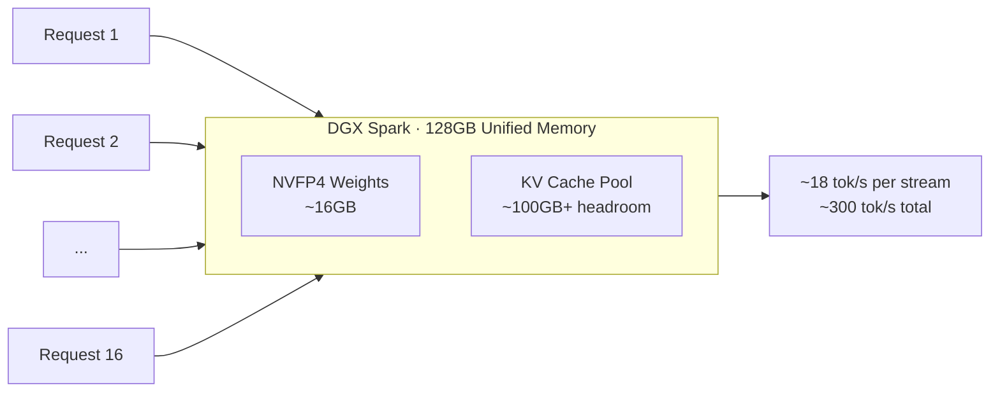

⏱️ **وقت القراءة المتوقع**: 12 دقيقة

## نظرة عامة

أثار اهتماماً واسعاً عرضٌ تجريبي يُظهر تشغيل نموذج MoE كبير في 16 جلسة متزامنة على جهاز صغير يُوضع على المكتب. يتعلق الأمر بنموذج `Gemma-4-26B-A4B-NVFP4` الذي أصدرته NVIDIA، إذ يعمل على جهاز DGX Spark واحد (128 جيجابايت من الذاكرة الموحدة) بتوازي 16 ضعفاً، محققاً نحو 18 رمزاً في الثانية لكل تدفق وما يزيد على 300 رمز في الثانية إجمالاً. وقد أشار صاحب العرض إلى أن التزامن العالي جداً جعل من الصعب إظهاره بصرياً فاضطر إلى تقديمه برمجياً، مؤكداً إمكانية الوصول إلى 32 ضعفاً وأن flashinfer لم تُطبق بعد في هذه المرحلة.

ثمة نقطتان جوهريتان نود تسليط الضوء عليهما. الأولى: هذا ليس نموذجاً خفيف الوزن من نوع E2B أو E4B يعمل على الحواسيب المحمولة، بل هو **نموذج Gemma MoE كبير** يبلغ مجموع معاملاته 25.2 مليار معامل. الثانية: ما يجعل هذا ممكناً هو التقاء ثلاثة عوامل: **تكميم NVFP4 رباعي البت، وصغر المعاملات النشطة في MoE، وسعة الذاكرة الموحدة الكبيرة في DGX Spark**.

تُدير ThakiCloud منصة لتقديم نماذج اللغة الكبيرة بصورة متعددة المستأجرين فوق Kubernetes. لذا فإن سؤال "كم طلباً متزامناً يمكن استقباله على جهاز خاص صغير واحد؟" ليس مجرد عرض مثير للاهتمام، بل هو سؤال مباشر يتعلق بنموذج التكلفة. يُرتب هذا المقال الحقائق التقنية للنموذج، ويفصل بين أداء التدفق المفرد والتزامن، ويناقش بصدق ما إذا كان DGX Spark يوفر قيمة حقيقية مقارنة بوحدات Blackwell الأخرى، فضلاً عن تحديد مدى صلاحية هذا النموذج لمنظومة المهارات لدينا.

## ما الذي قدمه العرض التجريبي؟

يمكن تلخيص ادعاءات العرض الأصلي ([تغريدة فريق Google Gemma](https://x.com/googlegemma/status/2069452783523401804)) على النحو التالي:

- الجهاز: **جهاز DGX Spark واحد، ذاكرة موحدة 128 جيجابايت (GB10 Grace-Blackwell)**
- النموذج: [`nvidia/Gemma-4-26B-A4B-NVFP4`](https://huggingface.co/nvidia/Gemma-4-26B-A4B-NVFP4)
- التزامن: **16 ضعفاً متوازياً**، بمعدل **نحو 18 رمزاً/ثانية** لكل تدفق و**نحو 300 رمز/ثانية** إجمالاً
- قابلية التوسع: ممكنة حتى **32 ضعفاً**، لكنه عُرض بـ 16 ضعفاً لاعتبارات وضوح الشاشة
- هامش التحسين: **flashinfer لم تُطبق بعد**، مما يعني إمكانية تحسين الأداء لاحقاً

نوضح هنا نقطة يسهل إساءة فهمها: "18 رمزاً/ثانية لكل تدفق" هي القيمة عند تشغيل 16 تدفقاً متزامناً، وتدفق واحد وحيد يعطي أداءً أسرع. سيتم تناول المقايضة بين التزامن والتأخير المفرد بالأرقام الفعلية في قسم لاحق.

## الحقائق التقنية لنموذج Gemma-4-26B-A4B-NVFP4

النموذج الذي رفعته NVIDIA هو نسخة مُكممة بتقنية NVFP4 من نموذج `gemma-4-26B-A4B-it` الخاص بـ Google DeepMind، وذلك باستخدام NVIDIA Model Optimizer. المواصفات الرئيسية وفقاً لبطاقة النموذج:

| العنصر | القيمة |
|---|---|
| النموذج الأساسي | google/gemma-4-26B-A4B-it |
| البنية | Mixture-of-Experts (Transformer) |
| إجمالي المعاملات | 25.2 مليار |
| المعاملات النشطة | 3.8 مليار (لكل رمز) |
| تكوين الخبراء | 8 من أصل 128 نشطون + خبير مشترك واحد |
| عدد الطبقات | 30 |
| طول السياق | 256 ألف رمز |
| نافذة الانزلاق | 1024 رمز |
| أنماط الإدخال | نص + صورة |
| التكميم | NVFP4 (Model Optimizer v0.43.0) |
| الجهاز المستهدف | NVIDIA Blackwell |
| الرخصة | Apache 2.0 |

### ما هو NVFP4 ولماذا يستلزم Blackwell؟

NVFP4 هو تنسيق نقطة عائمة رباعي البت تُعجله NVIDIA بالجهاز في جيل Blackwell. خلافاً لتكميم INT4 الذي يقطع الأوزان إلى أعداد صحيحة رباعية البت فحسب، يعتمد NVFP4 على مقياس FP8 لكل كتلة صغيرة (micro-scaling)، مما يتيح تقليص الذاكرة المعادل لأربعة بتات مع الحفاظ على دقة عالية.

يظهر الأثر بوضوح في متطلبات الذاكرة: تحميل 25.2 مليار معامل بتنسيق BF16 يتطلب نحو 50 جيجابايت، بينما يُقلص NVFP4 الأوزان إلى **14-16 جيجابايت** تقريباً. في DGX Spark بذاكرته الموحدة البالغة 128 جيجابايت، يعني الاحتفاظ بالأوزان في 16 جيجابايت أن ما يزيد على 100 جيجابايت تبقى متاحة بالكامل لذاكرة التخزين المؤقت KV Cache. هذا الهامش الواسع هو ما يتيح التزامن من 16 إلى 32 ضعفاً واستيعاب سياقات طويلة تصل إلى 256 ألف رمز.

غير أن تسريع جهاز NVFP4 مقصور على Blackwell حصراً. الأجيال السابقة كـ Hopper (H100) وAda (RTX 4090) تفتقر إلى مسار Tensor Core الخاص بـ NVFP4، مما يعني عدم الاستفادة الكاملة من هذا التنسيق. بمعنى آخر، هذا النموذج مبني عملياً "للتشغيل على Blackwell".

### المعايير القياسية: هل خسارة الدقة في NVFP4 مقبولة؟

تقدم بطاقة النموذج مقارنة جنباً إلى جنب بين نسخة NVFP4 والنموذج الأساسي غير المُكمم:

| المعيار | NVFP4 | الأساس | المجال |
|---|---|---|---|
| AIME 2025 | 90.00% | 88.95% | الرياضيات التنافسية |
| MMLU Pro | 84.80% | 85.00% | المعرفة العامة والاستدلال |
| IFBench | 78.1% | 77.77% | اتباع التعليمات |
| GPQA Diamond | 79.90% | 80.30% | الاستدلال العلمي |

جميع المعايير الأربعة في فارق أقل من 1% مقارنة بالأساس. تتفوق نسخة NVFP4 قليلاً في AIME وIFBench، لكن يُفضل قراءة هذا الفارق باعتباره ضمن نطاق التشتت القياسي. الخلاصة: "ضغط الأوزان إلى أربعة بتات يحافظ على الجودة فعلياً"، وهذا ما يُميز NVFP4 عن INT4. مع ذلك، يُنصح بإجراء تقييم مستقل على مجموعات بيانات المهام العربية وغيرها من اللغات، إذ لا تظهر هذه في المعايير العامة المنشورة.

## الأداء الفعلي: التدفق المفرد مقابل التزامن

قد تُوهم "18 رمزاً/ثانية لكل تدفق" في العرض بالبطء. الفصل بين التدفق المفرد والتزامن ضروري. بالاستناد إلى تقارير المجتمع من قياسات على DGX Spark:

- **التدفق المفرد الأساسي**: نحو 32 رمزاً/ثانية (بدون MTP، بإعداد 64 ألف رمز)
- **التدفق المفرد + MTP (التنبؤ بعدة رموز)**: نحو **55-61 رمزاً/ثانية** (بإعداد 32 ألف رمز، أعلى أداء للاستجابات القصيرة إلى المتوسطة و JSON المنظم)
- **16 تدفقاً متزامناً**: نحو 18 رمزاً/ثانية لكل تدفق و**نحو 300 رمز/ثانية** إجمالاً
- **معالجة السياق الطويل**: نحو 11.9 ثانية لمدخل 25 ألف رمز، ونحو 28.6 ثانية لمدخل 50 ألف رمز (بإعداد 64 ألف رمز)

تبرز هنا حقيقتان:

الأولى: **فك ترميز MoE محدود بالنطاق الترددي للذاكرة**. صحيح أن المعاملات النشطة لكل رمز تبلغ 3.8 مليار فقط مما يُقلل العمليات الحسابية (FLOPs)، لكن كل رمز يتطلب قراءة أوزان الخبراء النشطين من الذاكرة. النطاق الترددي لذاكرة LPDDR5X الموحدة في DGX Spark أدنى من HBM في مراكز البيانات، وهذا ما يُفسر سبب كون سرعة التدفق المفرد "متحفظة لجهاز Blackwell". فائض قدرة FP4 الحسابية يصطدم بسقف النطاق الترددي.

الثانية: **القوة الحقيقية لهذا الجهاز ليست في التأخير المفرد بل في الإنتاجية المتزامنة**. الحصول على 300 رمز/ثانية إجمالاً مع تشغيل 16 ضعفاً يعني أن طلبات متعددة تتشارك النطاق الترددي معاً لرفع الكفاءة. الهامش الواسع للذاكرة الموحدة يتيح KV Cache سخياً، وهذا ما يُمكن هذا السيناريو. باختصار: الجهاز مُصمم لـ "استجابات كافية لعدة وكلاء ومستخدمين في آن واحد" لا لـ "استجابة سريعة لشخص واحد".

## مراجعة صريحة 1: هل يوفر DGX Spark قيمة حقيقية مقابل التكلفة؟

الخلاصة المباشرة: **"قيمة استثنائية من حيث السعة التخزينية للجيجابايت، وقيمة متوسطة من حيث التأخير لكل رمز"**. حتى ضمن جيل Blackwell الواحد، تتباين طبيعة كل شريحة.

| الشريحة | السعر (دولار) | الذاكرة | النطاق الترددي | حالة NVFP4 MoE (يونيو 2026) | الطابع |
|---|---|---|---|---|---|
| **DGX Spark** (GB10, SM121) | نحو $4,699 | 128 جيجابايت LPDDR5X موحدة | 273 جيجابايت/ث | ✅ يعمل (vLLM Marlin backend) | ذاكرة كبيرة وتزامن عالٍ، نطاق ترددي أدنى |
| **RTX 5090** (SM120) | نحو $2,000 [تقديري] | 32 جيجابايت GDDR7 | 1,792 جيجابايت/ث | ⚠️ غير مستقر حالياً (flashinfer #2577) | أعلى إمكانية لتكلفة الرمز، ذاكرة VRAM محدودة |
| **RTX PRO 6000** Blackwell (SM120) | نحو $8,500 | 96 جيجابايت GDDR7 | 1,792 جيجابايت/ث | ⚠️ نفس مشكلة SM120 | ذاكرة VRAM كبيرة، مبالغ فيه لهذا النموذج |
| **B200** (SM100، مراكز البيانات) | سحابة نحو $3-10/ساعة [تقديري] | 192 جيجابايت HBM3e | 8,000 جيجابايت/ث | ✅ دعم كامل (TRT-LLM/flashinfer) | أعلى أداء، فارق كبير في التكلفة |

أهم خانة في هذا الجدول ليست السعر بل **"حالة NVFP4 MoE"**، لأنها حيث تنفصل الحسابات النظرية عن الواقع.

- **نظرياً، RTX 5090 هو الأكثر كفاءة من حيث التكلفة لكل رمز.** نطاقه الترددي يبلغ 6.6 أضعاف DGX Spark (1,792 مقابل 273 جيجابايت/ث)، وفك ترميز MoE يعتمد على النطاق الترددي، مما يعني أن السقف النظري يتبع هذه النسبة مباشرة. قراءة 16 جيجابايت من الأوزان بـ 273 جيجابايت/ث تُعطي نظرياً نحو 170 رمزاً/ثانية، بينما بـ 1,792 جيجابايت/ث تصل إلى نحو 1,100 رمز/ثانية. والسعر هو نصف الثمن، فالحساب البسيط يُرجح الـ 5090 بمقدار 5 إلى 6 أضعاف.
- **لكن في الواقع، نواة NVFP4 MoE معطوبة حالياً على شرائح Blackwell الاستهلاكية والمهنية (SM120).** مشكلة NVFP4 GEMM في flashinfer على SM120 ([#2577](https://github.com/flashinfer-ai/flashinfer/issues/2577)) مفتوحة، مما يجعل تشغيل هذا النموذج رباعي البت على RTX 5090 وRTX PRO 6000 أمراً صعباً حالياً. الأفضل على الورق هو عملياً "لا يعمل الآن".
- **لذا يبقى DGX Spark (SM121) الجهاز الاستهلاكي الوحيد الذي يعمل عليه NVFP4 MoE فعلاً.** النطاق الترددي أدنى والسرعة متحفظة، لكن "صندوق MoE رباعي البت يعمل اليوم" هو السبب الحقيقي لصدور العرض من DGX Spark.
- **Blackwell لمراكز البيانات (B200, SM100)** مدعوم بالكامل عبر TRT-LLM وflashinfer NVFP4، لكن فارق التكلفة شاسع. للاستضافة الذاتية المستمرة يُفضل امتلاك الجهاز، أما لتحميل الأعباء المتفرقة ومتعددة المستأجرين فـ B200 سحابياً أجدى.

خلاصة: DGX Spark ليس "آلة شراء أداء الطليعة"، بل هو **"آلة شراء ذاكرة كبيرة وتزامن عالٍ بشكل يعمل اليوم، للتطوير والنمذجة الأولية والخدمة المتزامنة الصغيرة"**. حين تُصلح مشكلة SM120، ستنزل الكفاءة النظرية لـ RTX 5090 إلى الواقع، لكن حتى ذلك الحين موقع DGX Spark واضح. العرض المبهر بتوازي 16 ضعفاً مبني بالضبط على هذه الميزة.

## مراجعة صريحة 2: ما المهام الملائمة لهذا النموذج؟

حين يتضح طابع الكفاءة، تتضح المهام الملائمة.

**المهام الأنسب**

- تشغيل عدة وكلاء متزامنين: نمط 16 إلى 32 عاملاً يعملون معاً بسرعة معقولة. الإنتاجية الإجمالية هي نقطة القوة.
- أعباء المخرجات المنظمة: تدعم بطاقة النموذج استدعاء الدوال ومخرجات JSON المنظمة، و MTP يُحقق أعلى سرعة للاستجابات القصيرة إلى المتوسطة والـ JSON التحكمي. مناسب للتصنيف والتسمية والاستخراج المنظم.
- معالجة السياق الطويل: سياق 256 ألف رمز مع KV Cache واسع يمنح مرونة في تلخيص الوثائق الطويلة وحقن سياق RAG.
- النمذجة الأولية في البيئات الخاصة: تجربة خدمة نماذج MoE الكبيرة دون وحدات GPU لمراكز البيانات.

**المهام الأقل ملاءمة**

- محادثة فردية منخفضة التأخير: سرعة التدفق لكل مستخدم واحد أبطأ من بطاقات GDDR7. إن كان الهدف "أسرع استجابة لشخص واحد"، فهذا الجهاز ليس المناسب.
- استدلال أحادي عالي الصعوبة: المهام التي تتطلب أعلى دقة ممكنة تستفيد من نماذج أكثر كثافة أو أكبر حجماً. 26 ملياراً هي فئة الإنتاجية لا الدقة القصوى.

## دليل التشغيل

الطريق الموصى به في بطاقة النموذج هو vLLM. ثمة قيود موثقة حالياً:

- **vLLM TP=1 فقط**: البنية الحالية تدعم التوازي التنسوري 1 فقط (GPU واحد/جهاز واحد).
- **محلل Gemma 4 مخصص**: يلزم تحديد `--tool-call-parser gemma4` و`--reasoning-parser gemma4` عند التشغيل لتحليل مخرجات استدعاء الدوال والاستدلال بشكل صحيح.
- **flashinfer غير مُطبقة**: كما أشار صاحب العرض، لم تُستخدم flashinfer بعد. تطبيق تحسينات نواة الانتباه سيضيف هامشاً إضافياً من الأداء.

يستلزم التشغيل نظام Linux وجهاز Blackwell (Tensor Cores لـ NVFP4). الأجيال السابقة لا تستفيد من ميزة التسريع رباعي البت.

## دلالات التطبيق على منصة ThakiCloud K8s للذكاء الاصطناعي

تُدير ThakiCloud منصة متعددة المستأجرين تستخدم Kueue لإدارة حصص GPU وvLLM لخدمة النماذج. ثمة ثلاثة دلالات رئيسية يمنحها هذا العرض لنموذج تشغيلنا:

**مرشح للاستضافة الذاتية في طبقة العمال.** انضباطنا في التكاليف يتبع قاعدة "العمال بالرخيص، والبوابات بالغالي". مهام العمال كالاستكشاف والتصنيف والتلخيص والاستخراج المنظم لا تستلزم النماذج الأعلى رتبة. NVFP4 26B بإنتاجيته الإجمالية البالغة 300 رمز/ثانية ودعمه لاستدعاء الدوال ومخرجات JSON، مرشح مناسب لتشغيل عمال متعددين محلياً في آن واحد. إبقاء مراحل التحقق والتوليف والأحكام المعمارية للنماذج الأعلى رتبة يُقلص تكلفة الرموز هيكلياً.

**الذاكرة الموحدة الكبيرة تُبسط ميزانية KV لمتعدد المستأجرين.** مع أوزان تبلغ 16 جيجابايت في ذاكرة موحدة 128 جيجابايت، يتجاوز هامش KV Cache 100 جيجابايت. في البيئات متعددة المستأجرين، KV Cache هو أول مورد ينضب، وهذا الهامش يتيح تحديد حدود تزامن سخية لكل مستأجر.

**مرجع لاقتراحات الخوادم الخاصة والامتثال.** رخصة Apache 2.0 والتشغيل على جهاز واحد تكوين قابل للاقتراح مباشرة على عملاء القطاع العام والمالي الذين يشترطون الاستضافة الذاتية. إمكانية تشغيل MoE كبيرة على صندوق صغير دون GPU لمراكز البيانات توفر مساراً عملياً للبيئات التي تحظر نقل البيانات خارجياً أو تستلزم امتثالاً أمنياً صارماً.

## مراجعة صريحة 3: ما حدود استخدام هذا النموذج في منظومة مهاراتنا؟

معظم مهارات ThakiCloud ووكلائها تعتمد النماذج الأعلى رتبة كـ Opus/Sonnet أساساً. إذن أين يمكن إدراج NVFP4 26B؟ بصدق:

- **قابل للاستبدال فوراً (طبقة العمال)**: قراءة الملفات وتلخيص Grep، التصنيف وتطبيع Enum (عمال حتمية التنسيق)، توليد المسودات الأولى، استخراج الأخبار والوثائق. مهام read-only والمهام المنظمة التي يتولاها حالياً haiku/sonnet كعمال فرعيين يمكن نقل جزء كبير منها إلى 26B محلياً.
- **ممكن بشروط (مع تعزيز التحقق)**: عمال استدعاء أدوات الوكيل. دعم استدعاء الدوال ومخرجات JSON يجعله صالحاً كعامل طرفي في حلقات استدعاء الأدوات. لكن نتائج fan-out يجب دائماً إغلاقها بـ adversarial verify من نموذج أعلى (منع تراكم هلوسات العمال).
- **غير موصى به (طبقة البوابات)**: الاستدلال المعماري متعدد الخطوات، وأحكام التوليف والتحقق، وتوليد المحتوى عالي المخاطر. المراحل التي تتطلب أعلى دقة ممكنة تبقى على Opus.

الجوهر هو مطابقة رتبة النموذج مع رتبة المهمة. رؤية NVFP4 26B كـ "بديل لـ Opus" تُخيب الآمال، لكن رؤيته كـ "مرشح للاستضافة الذاتية في طبقة عمال haiku/sonnet" تجعله بطاقة قادرة على تغيير هيكل التكاليف. هذا بالضبط ما تقوله قاعدة توجيهنا: الاستكشاف بالرخيص، والبوابات بالغالي.

## القيود والنقد

للتوازن، نذكر الجوانب التي تستحق المراجعة:

- **سرعة التدفق المفرد متحفظة.** بطء النطاق الترددي يجعله أبطأ من بطاقات GDDR7. أعباء العمل الحساسة للتأخير تستلزم إعادة النظر في اختيار الجهاز.
- **أرقام العرض مرتبطة بالإعداد.** 18 رمزاً/ثانية و300 رمز/ثانية هي قيم لتزامن 16 ضعفاً وإعداد محدد، وتتفاوت حسب طول المدخل والمخرج وتطبيق MTP. يجب إعادة القياس على أعباء العمل الخاصة بك.
- **vLLM TP=1 وغياب flashinfer قيود اللحظة الحالية.** إضافة التحسينات قد تُغير الأرقام، لذا يُقرأ هذا المقال كـ "لقطة الحال".
- **تعقيد تشغيل MoE.** رغم أن المعاملات النشطة 3.8 مليار، تبقى الأوزان الكاملة في الذاكرة، وتوجيه الخبراء يؤثر على كفاءة الدفعات. "صغير الحجم" تفسير مبسط.
- **يلزم التحقق من الاستخدام الفعلي بالعربية والكورية.** المعايير العامة تُركز على اللغة الإنجليزية. دقة RAG واستدعاء الأدوات بالعربية تستلزم تقييماً داخلياً منفصلاً.

مع ذلك، يبقى الجمع بين رخصة Apache 2.0 وخدمة MoE كبيرة على جهاز واحد وتزامن مبني على ذاكرة واسعة خياراً جذاباً حقاً للمؤسسات التي تدرس الاستضافة الذاتية. بالنظر إليه من زاوية "شراء ذاكرة رخيصة وتزامن" لا "شراء سرعة الطليعة"، يُقدم DGX Spark + NVFP4 26B قيمة واضحة.

## روابط مرجعية

- [بطاقة نموذج Gemma-4-26B-A4B-NVFP4 (Hugging Face)](https://huggingface.co/nvidia/Gemma-4-26B-A4B-NVFP4)
- [تغريدة العرض الأصلي (Google Gemma)](https://x.com/googlegemma/status/2069452783523401804)
- [ملخص تشكيلة Gemma 4 الكاملة (مدونة ThakiCloud)](https://thakicloud.github.io/owm/gemma-4-open-weight-lineup/)
- [NVIDIA TensorRT Model Optimizer](https://github.com/NVIDIA/TensorRT-Model-Optimizer)
- [مقدمة NVFP4 (NVIDIA Developer)](https://developer.nvidia.com/blog/introducing-nvfp4-for-efficient-and-accurate-low-precision-inference/)
- [مشكلة NVFP4 GEMM على SM120 في flashinfer #2577](https://github.com/flashinfer-ai/flashinfer/issues/2577)
- [معايير DGX Spark مع Gemma 4 26B NVFP4 (ai-muninn)](https://ai-muninn.com/en/blog/dgx-spark-gemma4-26b-nvfp4-52-toks)
