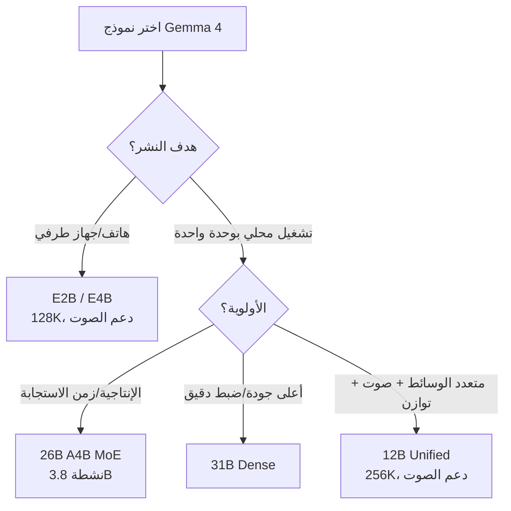

⏱️ **وقت القراءة المقدر**: 10 دقائق

## نظرة عامة على Gemma 4

أصدرت Google DeepMind نموذج Gemma 4 في الثاني من أبريل 2026، وهو أذكى عائلة نماذج مفتوحة الأوزان أطلقتها Gemma حتى الآن. وتذكر Google أنه بُني على نفس الأبحاث والتقنيات التي يقوم عليها Gemini 3. بعبارة أخرى، يمكن اعتباره وصفة التدريب وراء نموذج رائد مغلق، مقطّرة إلى تشكيلة مفتوحة الأوزان.

من منظور ThakiCloud، يبرز تغييران في هذا الجيل. أولًا، انتقلت الرخصة إلى **Apache 2.0**. فخلافًا للأجيال السابقة من Gemma التي كانت تحمل سياسة استخدام منفصلة، يتبنى Gemma 4 رخصة مفتوحة المصدر قياسية ومتساهلة تجاريًا. ثانيًا، لا يُطرح بحجم واحد بل كتشكيلة من خمسة نماذج تمتد من **الحافة (الهواتف) إلى وحدة معالجة رسومية واحدة على الخادم**. أي أنه يمكنك اختيار هدف النشر حسب فئة الجهاز ضمن نفس عائلة النماذج.

بدلًا من التعمق في نموذج واحد، يهدف هذا المقال إلى **مقارنة النماذج الخمسة دفعة واحدة وتوضيح أيها يُختار لكل حالة**.

## تشكيلة Gemma 4: النماذج الخمسة كاملة

يتكوّن Gemma 4 من النماذج الخمسة التالية، منظمة حسب المعاملات والسياق والوسائط والبنية وفق بطاقة النموذج:

| النموذج | المعاملات | السياق | وسائط الإدخال | البنية |
|---|---|---|---|---|
| **E2B** | 2.3B فعّالة (5.1B مع التضمينات) | 128K | نص + صورة + صوت | Dense |
| **E4B** | 4.5B فعّالة (8B مع التضمينات) | 128K | نص + صورة + صوت | Dense |
| **12B Unified** | 11.95B | 256K | نص + صورة + صوت | Dense |
| **26B A4B** | 25.2B إجمالًا / 3.8B نشطة | 256K | نص + صورة | MoE (8 خبراء نشطون من 128) |
| **31B Dense** | 30.7B | 256K | نص + صورة | Dense |

تُخرج النماذج الخمسة جميعها نصًا. ودعم إدخال الصوت متاح فقط في نماذج E2B وE4B و12B، بينما يتعامل 26B و31B مع النص والصورة.

يرمز حرف "E" في `E2B` و`E4B` إلى المعاملات الفعّالة (effective). وهو الحجم المبني على معاملات الحوسبة الفعلية باستثناء جدول التضمينات، والقيم الفعّالة هي الرقم الأكثر واقعية عند تقدير ميزانيات الذاكرة والحوسبة. ويستهدف هذان النموذجان مباشرةً الأجهزة الطرفية كالهواتف والحواسيب المحمولة.

جوهر التشكيلة هو **تقسيم العمل بين النموذجين الأعلى: 26B A4B (MoE) و31B (Dense)**.

- **26B A4B** هو نموذج Mixture-of-Experts. يضم 25.2B معاملًا إجماليًا لكنه يُفعّل نحو 3.8B فقط لكل رمز. ولا تزال الأوزان الكاملة بحاجة إلى الوجود في ذاكرة VRAM، لكن حوسبة كل رمز (FLOPs) تُحسب على أساس المعاملات النشطة، وهو ما **يصب في صالح زمن الاستجابة والإنتاجية**. ويناسب الخدمة التي تتطلب تمرير أعداد كبيرة من الطلبات بسرعة.
- **31B Dense** نموذج كثيف قياسي يشارك فيه كل معامل في كل رمز. وهو موجّه نحو تعظيم الجودة وملاءمة الضبط الدقيق، وتضع Google نموذج 31B كسقف الجودة في التشكيلة.

ووفقًا لـ Google، احتل 31B المركز الثالث بين النماذج المفتوحة عالميًا على لوحة Arena AI النصية، وحل 26B في المركز السادس، ووصفت التشكيلة بأنها "تنافس نماذج أكبر منها بعشرين ضعفًا". وتتغير مثل هذه الترتيبات بمرور الوقت، لذا يُفضّل قراءتها كاتجاه ("كثافة ذكاء عالية مقارنة بفئتها") لا كأرقام مطلقة.

### مسار اختيار النموذج

## البنية: الانتباه الهجين وتعدد الوسائط

تتشارك نماذج Gemma 4 الخمسة آلية **انتباه هجين**. فهي تتناوب بين انتباه النافذة المنزلقة المحلية والانتباه العالمي الكامل. تُعالَج النطاقات القصيرة بثمن زهيد عبر النافذة المنزلقة، بينما يُدرَج الانتباه العالمي دوريًا لالتقاط ترابطات السياق الكامل، بهدف كبح كلفة الذاكرة والحوسبة في السياقات الطويلة. وهذا التصميم هو الخلفية وراء قدرة النماذج العليا (12B/26B/31B) على التعامل مع سياق 256K.

تعدد الوسائط هو الإعداد الافتراضي في هذا الجيل. تستقبل النماذج الخمسة جميعها النص والصورة كمدخل، وتتعامل الفئات الطرفية والمتوسطة (E2B/E4B/12B) مع إدخال الصوت أيضًا. كما أن الميزات الموجهة لسير عمل الوكلاء مدمجة أيضًا. فاستدعاء الدوال، وإخراج JSON المنظّم، وتعليمات النظام الأصلية مدعومة رسميًا، وتؤكد التشكيلة تحسينات في التخطيط متعدد الخطوات والاستدلال المنطقي مقارنة بالجيل السابق. وتاريخ قطع بيانات التدريب هو يناير 2025.

ودعم اللغات واسع: أكثر من 35 لغة جاهزة، وأكثر من 140 لغة على مستوى التدريب المسبق. وتتطلب الجودة الفعلية في التشغيل بالكورية تقييمًا مباشرًا، لكن التغطية متعددة اللغات نفسها واسعة.

## المعايير

فيما يلي المعايير التمثيلية التي نشرتها Google لنموذج 31B المضبوط على التعليمات، وفق بطاقة النموذج.

| المعيار | 31B (IT) | المجال المقيس |
|---|---|---|
| MMLU-Pro | 85.2% | المعرفة العامة والاستدلال |
| GPQA Diamond | 84.3% | الاستدلال العلمي بمستوى الدراسات العليا |
| LiveCodeBench v6 | 80.0% | توليد الشيفرة |
| MATH-Vision | 85.6% | الرياضيات المعتمدة على الرؤية |
| Codeforces (ELO) | 2150 | البرمجة التنافسية |

عند حجم 31B بعقدة واحدة، يُعد GPQA Diamond بنسبة 84.3% وMMLU-Pro بنسبة 85.2% في الصدارة بين النماذج المفتوحة الأوزان المماثلة. ومع ذلك، فالمعايير خاصة بالنسخة المضبوطة على التعليمات، ويجب التحقق من الأداء في المهام الواقعية بشكل منفصل. وعلى وجه الخصوص، لا تنعكس مهام الاستدلال والبرمجة بالكورية مباشرةً في المعايير العامة، لذا يُنصح بقياسها بمجموعة تقييم داخلية.

## الخدمة والنشر

أمّن Gemma 4 دعمًا واسعًا من منظومة الخدمة منذ الإطلاق. والمسارات الرسمية هي:

- **خوادم الاستدلال**: vLLM، SGLang، llama.cpp، Ollama، LM Studio، NVIDIA NIM
- **الأطر**: Hugging Face Transformers / TRL / Transformers.js / Candle، Keras، MaxText، NeMo
- **الحافة/على الجهاز**: LiteRT-LM، Cactus
- **الضبط الدقيق/التكميم**: Unsloth، Tunix
- **بنية النشر**: Docker، Baseten، Google Cloud (Vertex AI)

يمكن تنزيل الأوزان من [مجموعة google/gemma-4 على Hugging Face](https://huggingface.co/collections/google/gemma-4) وKaggle وOllama.

### متطلبات وحدة المعالجة الرسومية للتشغيل المحلي (تقديري)

دليل تقريبي للنشر المحلي مبني على ذاكرة أوزان BF16 لكل نموذج. هذه تقديرات للأوزان تستثني ذاكرة KV وأعباء وقت التشغيل، لذا اترك هامشًا لطول السياق وعدد الطلبات المتزامنة في النشر الفعلي.

| النموذج | أوزان BF16 (تقديري) | نقطة بداية واقعية للتشغيل المحلي |
|---|---|---|
| E2B / E4B | نحو 5–16GB [تقديري] | وحدة استهلاكية، حاسوب محمول، هاتف (LiteRT) |
| 12B Unified | نحو 24GB [تقديري] | وحدة 24GB واحدة (فئة RTX 4090/L4)، هامش عند التكميم |
| 26B A4B (MoE) | نحو 50GB [تقديري] | وحدة H100/A100 80GB واحدة |
| 31B Dense | نحو 62GB [تقديري] | وحدة H100/A100 80GB واحدة |

تكمن القوة العملية للتشكيلة في أن النموذجين الأعلى (26B و31B) يتسعان في **وحدة معالجة رسومية واحدة بسعة 80GB** بدقة BF16. أي أنه يمكنك تشغيل استدلال بمستوى متقدم على خادم واحد دون توازي موترات متعدد العقد، وهو ما يخفض كثيرًا حاجز التبني المحلي. وبميزانية وحدة أصغر، انزل إلى نموذج 12B أو إلى مسار مكمَّم (GGUF Q4/Q8). وبفضل طبيعته MoE التي تحسب فقط 3.8B النشطة، يتمتع 26B بأفضلية في الإنتاجية لكل رمز مقارنة بـ31B Dense عند نفس سعة VRAM.

## دلالات للتطبيق على منصة ThakiCloud K8s AI/ML SaaS

تتناغم تشكيلة Gemma 4 جيدًا مع استراتيجية الخدمة متعددة المستأجرين لدى ThakiCloud. وهي مهمة على ثلاث جبهات.

**Apache 2.0 يفتح حاجز التبني.** إن إطلاق عائلة مفتوحة الأوزان بمستوى متقدم تحت رخصة Apache 2.0 القياسية أمر بالغ الأهمية للتبني المؤسسي والمحلي. إذ يمكنك دمجها في خدمات تجارية دون عبء مراجعة سياسة استخدام منفصلة، وتوزيع نواتج الضبط الدقيق بحرية. وهي عائلة نماذج يمكن اقتراحها مباشرةً على البيئات ذات الامتثال الصارم للترخيص، كالقطاع العام والمالي محليًا، وعلى العملاء المحليين الذين يشترطون الاستضافة الذاتية.

**التشكيلة نفسها تتوافق مع توجيه وحدات المعالجة الرسومية متعدد المستأجرين.** تدير ThakiCloud حصص وحدات المعالجة الرسومية عبر Kueue وتخدم النماذج عبر vLLM. وتشكيلة Gemma 4 المكوّنة من خمسة نماذج بنية تتيح توجيه فئات النماذج ضمن عائلة واحدة لتلائم احتياجات المستأجرين (حساسية زمن الاستجابة، أولوية الجودة، استدلال الحافة). وجّه المحادثة/التلخيص الخفيف إلى 12B، والدفعات الحرجة للإنتاجية إلى 26B MoE، والاستدلال/البرمجة عالية الصعوبة إلى 31B، فتتمكن من تحسين ميزانية الوحدات حسب فئة المهمة مع الحفاظ على نفس المُرمِّز وصيغة المُوجِّه.

**الخدمة بوحدة 80GB واحدة تبسّط نموذج الكلفة.** كون 26B و31B يتسعان في وحدة H100/A100 واحدة يبسّط تقدير كلفة مهام وحدات المعالجة الرسومية في Kueue. إذ تختفي أعباء الاتصال وتعقيد الجدولة في توازي الموترات متعدد العقد، فيمكنك التسعير بوضوح بنموذج وحدة مخصصة لكل مستأجر. وميزة 26B MoE بتفعيل 3.8B تعني أنه يستطيع استقبال طلبات متزامنة أكثر على نفس الوحدة، وهو ما يصب أيضًا في صالح كلفة الوحدة لكل طلب.

باختصار، يصلح Gemma 4 كعائلة نماذج مرجعية حين تقترح ThakiCloud نمط تشغيل "تشغيل محلي بوحدة واحدة + توجيه نماذج متعدد المستأجرين" على العملاء.

## القيود والاعتراضات

من باب التوازن، تستحق بضع ملاحظات الذكر.

- **الفجوة بين المعايير والاستخدام الواقعي.** تتركز الأرقام المنشورة على المعايير المضبوطة على التعليمات وباللغة الإنجليزية. ويجب إعادة قياس المهام الكورية، خصوصًا دقة RAG واستدعاء أدوات الوكلاء، بمجموعة تقييم خاصة بك.
- **صعوبة تشغيل MoE.** نموذج 26B A4B منخفض الحوسبة لكل رمز لكنه يجب أن يُبقي الأوزان الكاملة مقيمة في VRAM، ويؤثر توجيه الخبراء في كفاءة الدُفعات وأنماط الذاكرة. والقراءة المبسطة "إنه صغير لأن النشط 3.8B" قراءة محفوفة بالمخاطر.
- **عدم تماثل دعم الصوت.** إدخال الصوت موجود فقط في E2B/E4B/12B. وإن أردت أعلى جودة (26B/31B) والصوت معًا، تنشأ مقايضة ضمن التشكيلة.
- **قطع التدريب في يناير 2025.** المهام التي تحتاج أحدث المعلومات يجب تعزيزها بـRAG وتكامل الأدوات.

ومع ذلك، فإن رخصة Apache 2.0، وجدوى الخدمة بوحدة واحدة، وتشكيلة تصل الحافة بالخادم، أسباب كافية لوضع Gemma 4 على رأس قائمة التقييم لأي مؤسسة تفكر في التشغيل المحلي والاستضافة الذاتية.

## المراجع

- [مدونة الإعلان الرسمي عن Gemma 4 (Google)](https://blog.google/innovation-and-ai/technology/developers-tools/gemma-4/)
- [بطاقة نموذج Gemma 4 (Google AI for Developers)](https://ai.google.dev/gemma/docs/core/model_card_4)
- [وثائق نظرة عامة على نموذج Gemma 4](https://ai.google.dev/gemma/docs/core)
- [مجموعة google/gemma-4 على Hugging Face](https://huggingface.co/collections/google/gemma-4)
- [مكتبة Gemma على GitHub من Google DeepMind](https://github.com/google-deepmind/gemma)
- [توفّر Gemma 4 على Google Cloud](https://cloud.google.com/blog/products/ai-machine-learning/gemma-4-available-on-google-cloud)
