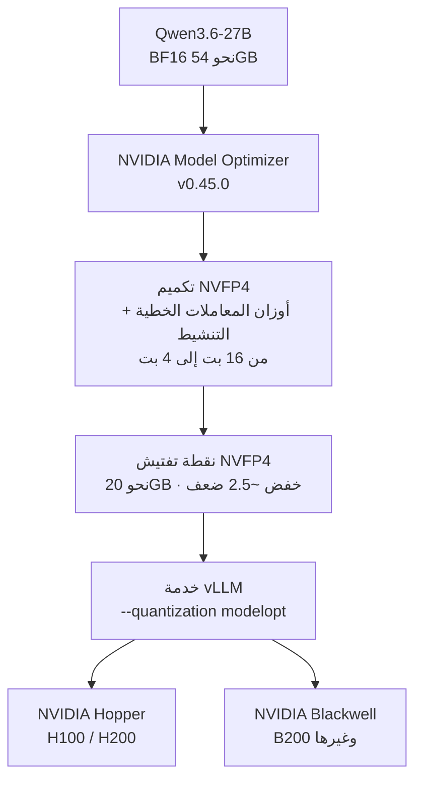

⏱️ **وقت القراءة المتوقع**: 11 دقيقة


## نظرة عامة

أصدرت NVIDIA النموذج `nvidia/Qwen3.6-27B-NVFP4`، وهو نسخة مكمّمة بدقة NVFP4 رباعية البت من نموذج Qwen3.6-27B الخاص بشركة Alibaba. يضغط نموذج استدلال بـ 27 مليار معامل ذا انتباه هجين إلى 4 بت، فيخفض ذاكرة الأوزان بنحو 2.5 ضعف مع إبقاء الفجوة عن خط أساس FP8 ضمن نقطة واحدة عبر المعايير التسعة كلها. والرخصة هي Apache 2.0.

هناك ثلاث نقاط جديرة بالتوضيح. أولاً، خلافاً لإصدار `Gemma-4-26B-A4B-NVFP4` السابق الذي لم يحصل على تسريع 4 بت عملياً إلا على Blackwell، تذكر بطاقة هذا الإصدار **معماريتَي Hopper وBlackwell معاً ضمن العتاد المدعوم**. أي أن الفريق الذي يشغّل H100 أو H200 يستطيع تجربته اليوم دون شراء عتاد جديد. ثانياً، هذا ليس نموذجاً لغوياً نصياً فقط بل **نموذج استدلال متعدد الوسائط يستقبل مدخلات نصية وصورية وفيديو**. ثالثاً، تتسع نافذة السياق حتى **262 ألف رمز**، فتستوعب المستندات الطويلة والمحادثات الممتدة دفعة واحدة.

تشغّل ThakiCloud منصة تدير حصص وحدات GPU عبر Kueue وتخدم النماذج بأسلوب متعدد المستأجرين عبر vLLM على Kubernetes. لذا فإن سؤال "كم نموذجاً أكبر، وكم مستأجراً إضافياً، يمكننا وضعه على وحدات GPU التي نملكها أصلاً؟" ليس خبراً طريفاً بل يغذّي نموذج التكلفة مباشرة. يستعرض هذا المقال حقائق النموذج، ويحلل سبب نزول NVFP4 إلى Hopper، ثم يقيّم بصراحة مسار الخدمة وفائدته على منصتنا.

## ما هذا النموذج

`nvidia/Qwen3.6-27B-NVFP4` هو نموذج `Qwen3.6-27B` من Alibaba مكمّماً بدقة NVFP4 عبر NVIDIA Model Optimizer (nvidia-modelopt v0.45.0). وفيما يلي المواصفات الأساسية حسب بطاقة النموذج.

| العنصر | القيمة |
|---|---|
| النموذج الأساسي | Alibaba Qwen3.6-27B |
| المعمارية | انتباه هجين (Gated DeltaNet + Gated Attention) |
| إجمالي المعاملات | 27 مليار |
| السياق | 262 ألف رمز |
| وسائط الإدخال | نص + صورة + فيديو |
| الإخراج | نص |
| التكميم | NVFP4 (Model Optimizer v0.45.0) |
| العتاد المستهدف | NVIDIA Hopper، Blackwell |
| الرخصة | Apache 2.0 |

الجزء اللافت هو معمارية **الانتباه الهجين**. فـ Gated DeltaNet مسار من فئة الانتباه الخطي، مصمَّم لمعالجة المتتاليات الطويلة بكفاءة، خلافاً للانتباه المعتاد الذي تنمو كلفته مع طول المتتالية. ومزجه مع Gated Attention الذي يحمل القدرة التعبيرية يمنح توازناً يستوعب سياقاً بطول 262 ألف رمز مع الحفاظ على الجودة. كما أن اشتراط `--reasoning-parser qwen3` عند الخدمة يؤكد أن هذا **نموذج استدلال** يولّد أثر التفكير قبل الإجابة النهائية.

ونذكر بصراحة أمراً واحداً: تذكر بطاقة النموذج الانتباه الهجين لكنها لا تفصح عن عدد الطبقات الدقيق أو تكوين الخبراء أو المعاملات النشطة لكل رمز. لذا يقتصر هذا المقال على الحقائق المذكورة في البطاقة ولا يقدّر الأرقام غير المعلنة.

## تكميم NVFP4: ماذا يُضغط وكيف

‏NVFP4 هو صيغة الفاصلة العائمة رباعية البت التي تدفع بها NVIDIA. وخلافاً لـ INT4 الذي يقتطع الأوزان إلى أعداد صحيحة رباعية البت ببساطة، فهو أسلوب قياس مصغّر يضع مقياس FP8 لكل كتلة صغيرة، فينعم بتوفير الذاكرة على مستوى 4 بت مع إبقاء فقدان الدقة صغيراً.

في هذا الإصدار، أهداف التكميم هي **أوزان وقيم تنشيط المعاملات الخطية داخل كتل المحوّل**. أما الطبقات غير الخطية فتُترك دون مساس. وتذكر البطاقة أن خفض عدد البتات لكل معامل من 16 إلى 4 يقلّص متطلبات القرص وذاكرة GPU بنحو **2.5 ضعف**. فتحميل 27 مليار معامل بدقة BF16 يحتاج نحو 54 جيجابايت، وبتطبيق الخفض بنحو 2.5 ضعف تنزل نقطة التفتيش إلى نحو 20 جيجابايت. وهذا يفتح مجالاً لوضع أكثر من ضعف النموذج على وحدة GPU نفسها، أو لتحويل الذاكرة المحرَّرة إلى مخزن KV لرفع التزامن.

وهنا يفترق الأمر عن مراجعة Gemma NVFP4 السابقة. فقد كان لدى إصدار Gemma نواة NVFP4 لنماذج MoE معطّلة على Blackwell الاستهلاكي والاحترافي (SM120)، فكان المسار الاستهلاكي الوحيد الذي يعمل فعلاً هو DGX Spark. أما إصدار Qwen3.6 هذا فتذكر بطاقته **معماريتَي Hopper وBlackwell معاً ضمن العتاد المدعوم**، وتستخدم الخدمة مسار `--quantization modelopt` في vLLM. ومع تكميم قيم التنشيط إلى جانب الأوزان ووجود مسار خدمة modelopt، يمكن تشغيل هذا النموذج رباعي البت على وحدات H100 وH200 المثبتة أصلاً في مراكز البيانات. لقد تراخى هذه المرة بشكل ملموس قيد "يجب شراء Blackwell جديد لرؤية مكاسب 4 بت".



## المعايير: كم تكلّف الدقة الرباعية

تعرض بطاقة النموذج النسخة المكمّمة بـ NVFP4 جنباً إلى جنب مع خط أساس FP8 عبر تسعة معايير.

| المعيار | FP8 | NVFP4 | مجال القياس |
|---|---|---|---|
| MMLU Pro | 86.1 | 86.3 | المعرفة العامة والاستدلال |
| GPQA Diamond | 86.0 | 85.5 | الاستدلال العلمي للدراسات العليا |
| HLE | 21.7 | 21.8 | الاستدلال العام الصعب |
| τ²-Bench Telecom | 95.2 | 95.4 | استخدام الوكيل للأدوات |
| MMMU Pro | 74.6 | 74.3 | الاستدلال متعدد الوسائط |
| SciCode | 44.8 | 44.5 | البرمجة العلمية |
| AIME 2025 | 93.1 | 92.7 | مسابقة الرياضيات |
| AA-LCR | 68.8 | 68.3 | الاستدلال ذو السياق الطويل |
| IFBench | 65.1 | 65.5 | اتباع التعليمات |

جميع البنود التسعة ضمن نقطة واحدة من FP8. وفي MMLU Pro وHLE وτ²-Bench Telecom وIFBench يتفوق إصدار NVFP4 بفارق ضئيل، والأسلم قراءة ذلك ضمن تباين القياس. الاتجاه واضح: **الجودة محفوظة عملياً تحت 4 بت**، وهنا تظهر ميزة NVFP4 على INT4.

كما يشير تكوين المعايير نفسه إلى طابع النموذج. فـ τ²-Bench Telecom يقيس وكيلاً يستدعي الأدوات لإنجاز المهام، وAA-LCR يقيس الاستدلال ذا السياق الطويل، وMMMU Pro يقيس الفهم متعدد الوسائط. أي أن هذا النموذج يستهدف **استخدام الأدوات لدى الوكلاء، والسياق الطويل، وتعدد الوسائط**، لا مجرد أسئلة المعرفة. ومع ذلك، لا تظهر مهام النطاق الكوري في المعايير العامة، لذا نوصي بتحقق منفصل عبر مجموعة تقييم داخلية قبل التبني.

## دليل الخدمة

المسار الموصى به في بطاقة النموذج هو vLLM. وأمر التشغيل كالآتي.

```bash
vllm serve nvidia/Qwen3.6-27B-NVFP4 \
  --port 8000 \
  --quantization modelopt \
  --max-model-len 262144 \
  --reasoning-parser qwen3
```

ثلاث نقاط تشغيلية مهمة. أولاً، `--quantization modelopt` هو العلَم الأساسي الذي يحمّل نقطة تفتيش NVFP4. ثم `--reasoning-parser qwen3` لازم كي يُحلَّل أثر التفكير والإجابة النهائية تحليلاً صحيحاً. وأخيراً `--max-model-len 262144` يفتح سياق 262 ألف رمز كاملاً، وتنمو ميزانية مخزن KV تبعاً لذلك، فالأكفأ للذاكرة خفضه إلى الطول الذي تحتاجه فعلاً.

يفترض العتاد Hopper أو Blackwell، ونظام التشغيل Linux. وبفضل دعم Hopper، يمكنك التحقق من مسار الخدمة على عُقد H100 وH200 الموجودة أصلاً في مركز البيانات دون معدات إضافية.

## منظور خدمة ThakiCloud

تشغّل ThakiCloud منصة AI/ML قائمة على K8s تدير حصص GPU عبر Kueue وتخدم النماذج بأسلوب متعدد المستأجرين عبر vLLM. وتأتي دلالات هذا النموذج على نموذج تشغيلنا من اتجاهين: البنية التحتية والوكلاء.

**مضاعفة الكثافة على أصول Hopper القائمة.** هذه أبرز قيمة عملية لهذا الإصدار. فدعم NVFP4 لـ Hopper يعني إمكان جني مكسب 4 بت على H100 وH200 التي تملكها أصلاً، دون استثمار جديد في Blackwell. وحين تنزل أوزان نموذج بـ 27 مليار معامل إلى نحو 20 جيجابايت، يمكنك وضع مزيد من نسخ النموذج على وحدة GPU نفسها، أو تحويل الذاكرة المحرَّرة إلى مخزن KV لضبط حدود تزامن سخية لكل مستأجر. ومن منظور حصص Kueue، تتحمل البطاقة نفسها عبئاً أكبر، فتنخفض تكلفة الوحدة ببساطة.

**مرشح على الخوادم الخاصة لعامل استدلال متعدد الوسائط.** إن Paxis، مستوى التحكم بالوكلاء لدى ThakiCloud، سحابةٌ أصيلة الوكلاء تشغّل المهارات في صناديق رمل معزولة وتمرّر كل إجراء عبر بوابات السياسات وسجلات التدقيق. وفي هذه البنية يقرأ عدد من العمّال المستندات ويستدعون الأدوات وينجزون المهام. ويتميز Qwen3.6-27B-NVFP4 في معايير استخدام الأدوات لدى الوكلاء مثل τ²-Bench Telecom، ويستقبل الصورة والفيديو إلى جانب النص، ويستوعب سياق 262 ألف رمز. فهو مرشح مناسب للتشغيل على الخوادم الخاصة كعامل متعدد الوسائط يتعامل مع المستندات والشاشات والفيديو، وكعامل طرفي في حلقات استدعاء الأدوات. وبحسب انضباط التكلفة لدينا، شغّل العامل بثمن زهيد لكن أغلق التوسع بمرحلة تحقق على نموذج أعلى كي لا تتراكم هلوسات العامل.

**مرجع لعروض الخوادم الخاصة والامتثال.** إن تكويناً برخصة Apache 2.0 وخدمة على عقدة واحدة هو تكوين يمكن اقتراحه مباشرة على عملاء القطاع العام والمالي حيث يُحظر تسريب البيانات. وفي البيئات المقيَّدة مثل متطلبات الأمن القومي أو الذكاء الاصطناعي السيادي، يصبح تشغيل نموذج استدلال كبير متعدد الوسائط على وحدات GPU خاصة دون واجهة برمجة تجارية مساراً حقيقياً للتبني.

## القيود والاعتراضات

من باب التوازن، إليك التحفظات.

- **تفاصيل المعمارية غير معلنة.** الانتباه الهجين مذكور، لكن عدد الطبقات وتكوين الخبراء والمعاملات النشطة غائبة عن البطاقة. وحساب كفاءة الدفعة والذاكرة المقيمة بدقة يتطلب مزيداً من المعلومات.
- **لا توجد أرقام إنتاجية مقيسة.** يستند هذا المقال إلى حقائق البطاقة مثل توفير الذاكرة والمعايير. وتتفاوت سرعة الرموز لكل تدفق وحدود التزامن كثيراً بحسب العتاد والإعدادات، فأعد القياس بحمل عملك قبل التبني.
- **تباين ناتج عن تكميم التنشيط.** دفع قيم التنشيط، لا الأوزان فحسب، إلى 4 بت قد يُدخل تبايناً في الدقة على الأحمال ذات التوزيعات المائلة. وحتى مع بقاء المعايير العامة ضمن نقطة واحدة، تحقق من المهام الخاصة بالنطاق منفصلة.
- **نضج مسار الخدمة متعدد الوسائط.** استقبال الصورة والفيديو بثبات في الإنتاج يتطلب التحقق من كل من خط المعالجة الأولية ونضج مسار vLLM متعدد الوسائط.
- **التحقق من الاستخدام الكوري الفعلي.** المعايير العامة تتمحور حول الإنجليزية. ويجب التحقق من دقة RAG واستدعاء الأدوات بالكورية منفصلة عبر مجموعة تقييم داخلية.

ومع ذلك، فإن مزيج Apache 2.0، وتسريع 4 بت الذي بات يصل إلى Hopper، والاستدلال متعدد الوسائط، وسياق 262 ألف رمز، خيارٌ جذاب للمؤسسات التي تدرس الخدمة على الخوادم الخاصة. ومجرد انخفاض جدار "اشترِ عتاداً جديداً لتنال مكاسب 4 بت" يجعله جديراً بالتحقق اليوم لأي فريق يملك أسطول Hopper.

## روابط مرجعية

- [بطاقة نموذج Qwen3.6-27B-NVFP4 (Hugging Face)](https://huggingface.co/nvidia/Qwen3.6-27B-NVFP4)
- [NVIDIA TensorRT Model Optimizer](https://github.com/NVIDIA/TensorRT-Model-Optimizer)
- [التعريف بـ NVFP4 (NVIDIA Developer)](https://developer.nvidia.com/blog/introducing-nvfp4-for-efficient-and-accurate-low-precision-inference/)
- [توثيق vLLM](https://docs.vllm.ai/)
- [مراجعة Gemma-4-26B-NVFP4 على DGX Spark (مدونة ThakiCloud)](https://thakicloud.github.io/ar/owm/gemma-4-26b-nvfp4-dgx-spark/)
