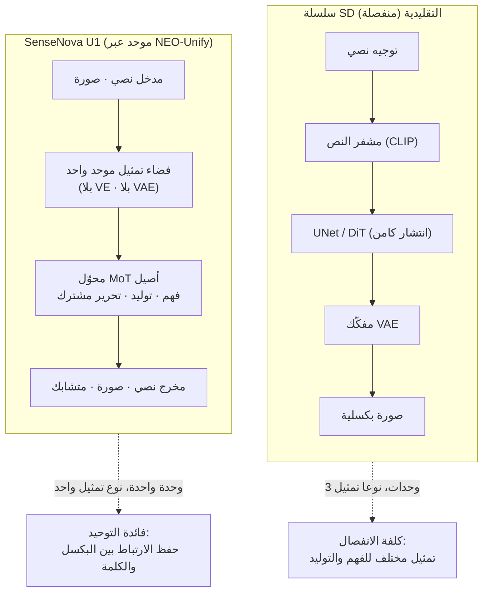

⏱️ **وقت القراءة المقدر: 15 دقيقة**


## نظرة عامة

ظلت نماذج توليد الصور لفترة طويلة منقسمة إلى مسارين. في جانب، هناك نموذج لغوي يفهم النص. وفي الجانب الآخر، هناك نموذج انتشار (diffusion) يرسم البكسلات. وتُعد سلسلة Stable Diffusion المثال الأبرز على ذلك. يفسّر مشفر النص التوجيه (prompt)، ثم يزيل UNet أو DiT الضوضاء في الفضاء الكامن، ثم يعيد VAE (المشفر التلقائي التبايني) بناء تلك القيم الكامنة إلى بكسلات من جديد. إنها بنية يحدث فيها الفهم والتوليد في وحدتين مختلفتين وبتمثيلين مختلفين.

أما 日日新 SenseNova U1 من SenseTime (سنسه‌تايم)، الذي أُطلق بشكل تدريجي ابتداءً من أبريل 2026، فيرفض هذا الانفصال جملة وتفصيلاً. فهو يلغي كلاً من المشفر البصري و VAE، ويطرح بدلاً منهما بنية NEO-Unify التي تعالج المعلومات اللغوية والبصرية حتى النهاية داخل فضاء تمثيل واحد. يتولى النموذج المفرد معالجة الفهم والتوليد والتحرير، وصولاً إلى التوليد المتشابك (interleave) الذي يبثّ النص والصورة بالتناوب. أُتيحت الأوزان برخصة Apache 2.0، وبحجم يقارب 8B فإنها تعمل على بطاقة RTX 5090 واحدة. وهذا يعني إمكانية الاستضافة الذاتية لأغراض تجارية.

يستعرض هذا المقال حقائق SenseNova U1، وما يمكننا فعلياً تشغيله في بيئتنا المحلية (on-premise)، بصراحة تامة، بما في ذلك سبب استحالة تشغيله مباشرة على أدوات شائعة كـ Automatic1111 كما قد يتوقع البعض. وبما أن ThakiCloud تعمل على تقديم النماذج ضمن بيئات عملاء متنوعة، فإن جوهر هذا المقال هو سدّ الفجوة بين عنوان "صدرت أوزان مفتوحة" وواقع "يمكن تشغيلها على مجموعتنا الحاسوبية".

## ما هو SenseNova U1: معنى التخلي عن VAE

تنطلق NEO-Unify من ملاحظة بسيطة: البكسلات والكلمات مترابطة بعمق في جوهرها، لكن خطوط الأنابيب (pipelines) التقليدية أجبرتها على الانفصال. لذلك يزيل U1 محوّلين وسيطين كاملين. لا يوجد مشفر بصري (VE) كان يضغط الصورة إلى سمات، ولا يوجد VAE كان يعيد القيم الكامنة إلى بكسلات. بدلاً من ذلك، يدمج المعلومات اللغوية والبصرية في تمثيل مركّب واحد ويعالجه من البداية إلى النهاية. وتوضح SenseTime أن هذا يعمل فوق بنية MoT (خليط من المحولات، Mixture-of-Transformers) أصيلة، مما يتيح استنتاجاً كفؤاً بلا تعارض بين الوسائط المختلفة.

من منظور المستخدم، يتجلى هذا الفرق في "نموذج واحد يقوم بكل شيء". فهو يفهم الصور (الإجابة عن أسئلة بصرية، VQA)، ويولّد الصور، ويحرّرها، ويولّد النص والصورة بالتناوب ضمن تدفق واحد. ويُطرح كمثال بارز إنتاج محتوى يتناوب فيه الشرح مع الرسوم التوضيحية، كدروس الطهي أو يوميات السفر، وذلك في عملية توليد واحدة. كما تشدد SenseTime على قدرته في مجال الذكاء المكاني (spatial intelligence) على فهم التخطيطات المعقدة والعلاقات بين الأجسام، وهو ما يمهد لمستقبل يكتمل فيه الإدراك والاستدلال والتنفيذ في نموذج واحد ضمن الذكاء الاصطناعي المتجسّد (embodied AI) للروبوتات.

فيما يلي مخطط مفاهيمي يضع خط أنابيب سلسلة SD التقليدي جنباً إلى جنب مع خط الأنابيب الموحد لـ U1.



الجوهر هو أن U1 ليس نقطة تفتيش انتشارية (diffusion checkpoint)، بل محوّل موحد يعمل كنموذج لغوي كبير. وهذه الحقيقة الواحدة هي ما يحدد بالكامل طريقة التقديم وتوافقية الأدوات التي سنتناولها لاحقاً.

## ما أُتيح ليس U1 Pro بل سلسلة U1 Lite

هنا يجب التنويه بتمييز جوهري. **U1 Pro** الظاهر على صفحة منصة SenseTime (`sensenova.cn`) هو النسخة التجارية الرائدة المستضافة. ورغم أن أمثلة توليد الرسوم البيانية والملصقات عالية الكثافة مثيرة للإعجاب، فإن أوزان هذه الفئة "Pro" غير متاحة على HuggingFace. فمن الصواب اعتباره طبقة تجارية يُصار إليها عبر واجهة برمجية (API) فقط.

أما ما يمكن استضافته ذاتياً فهي **سلسلة U1 Lite**. وفيما يلي أهم الأوزان المتاحة:

| النموذج | المعاملات | الطابع |
|---|---|---|
| SenseNova-U1-8B-MoT | 8B (MoT كثيف) | العمود الفقري المفتوح الرائد. وسائط متعددة عامة الغرض |
| SenseNova-U1-A3B-MoT | A3B (MoE، حوالي 3B نشطة) | عمود فقري MoE خفيف |
| SenseNova-U1-8B-MoT-SFT / A3B-SFT | 8B / A3B | أوزان مرحلة SFT (تقليل أخذ العينات ×32) |
| SenseNova-U1-8B-MoT-Infographic (V1/V2/V3) | 8B | متخصص في الرسوم البيانية، والإصدار V3 محدّث بتاريخ 15/7 |
| SenseNova-U1-8B-MoT-Interleaved | 8B | متخصص في التوليد المتشابك |
| SenseNova-U1-8B-MoT-LoRA-8step | 0.4B | LoRA للتوليد السريع بثماني خطوات |

تمر نماذج SFT بمراحل: إحماء الفهم ← التدريب المسبق للتوليد ← التدريب المتوسط الموحد ← الضبط الدقيق الموحد (SFT)، ويُحصل على النموذج النهائي بإضافة تعلم معزز (RL) للتحويل من نص إلى صورة (T2I) فوق ذلك. وتشير SenseTime إلى أن ما صدر اليوم هو نسخة "Lite"، مع الإعلان عن نسخة أكبر حجماً قادمة. أي أن النموذجين 8B/A3B الحاليين نسخة مدمجة نسبياً، والسقف ما زال مفتوحاً.

باختصار، إذا قيل في مدونة أو عرض توضيحي "لقد شغّلنا U1 Pro"، فهذا غير دقيق. النموذج المفتوح الذي نضعه في بيئتنا المحلية هو **U1-8B-MoT** (أو A3B).

## الموقع على المعايير القياسية

تدّعي SenseTime أن U1 هو "أفضل أداء (SoTA) ضمن المعسكر مفتوح المصدر في كل من الفهم والتوليد معاً". أُجري التقييم على معايير OneIG (بالإنجليزية/الصينية)، LongText (بالإنجليزية/الصينية)، BizGenEval (سهل/صعب)، CVTG، IGenBench، ومعايير الرسوم البيانية. وتُبرز بطاقة النموذج مخطط المفاضلة بين الأداء وزمن استجابة التوليد (latency)، مع التركيز على تحقيق الجودة نفسها بسرعة أكبر.

بدلاً من نقل الأرقام كما هي، ينبغي النظر إلى طبيعتها. يُقدَّم U1 Lite بوصفه قادراً على تحقيق نتائج بمستوى تجاري في توليد الرسوم البيانية المعقدة تحديداً، أي في المجالات التي تكون فيها اتساقية التخطيط ودقة عرض النص أموراً حاسمة. وتذكر بعض المصادر الإعلامية أن جودة مخرجات U1 Lite تضاهي Qwen-Image 2.0 Pro أو Seedream 4.5، لكن هذا مستند إلى مصادر البائع أو مصادر ثانوية، لذا يبقى مصنّفاً بـ[تقدير] ويحتاج إلى تحقق فعلي. معيارنا واحد فقط: نثق بالأرقام التي نحصل عليها من تشغيله فعلياً ببياناتنا وتوجيهاتنا على معالجاتنا الرسومية (GPU).

## التثبيت والتقديم: مساران

حقيقة أن U1 ليس نقطة تفتيش انتشارية بل محوّل موحد تنعكس مباشرة على طريقة تقديمه. فبدلاً من وضعه فوق واجهة انتشار (diffusion UI)، يُقدَّم كما يُقدَّم أي نموذج لغوي كبير.

**المسار الأول: transformers الأصيل.** يوفر المستودع الرسمي تثبيت التبعيات عبر uv وسكربتات أمثلة مخصصة لكل مهمة، منها: تحويل النص إلى صورة، وتحرير الصور، والتوليد المتشابك.

```bash
# مثال على تحرير صورة (يمكن التحرير على مستوى البكسل حتى بلا VAE)
python examples/editing/inference.py \
  --model_path sensenova/SenseNova-U1-8B-MoT \
  --prompt "Change the animal's fur color to a darker shade." \
  --image examples/editing/data/images/1.webp \
  --cfg_scale 4.0 --img_cfg_scale 1.0 --num_steps 50 \
  --output output_edited.png --profile --compare

# التوليد المتشابك (شرح + رسوم توضيحية في تدفق واحد)
python examples/interleave/inference.py \
  --model_path sensenova/SenseNova-U1-8B-MoT \
  --prompt "أنشئ دليلاً مصوراً للمبتدئين لطبق البيض المقلي بالطماطم." \
  --resolution "16:9" --output_dir outputs/interleave/ --stem demo
```

**المسار الثاني: التقديم عبر vLLM-Omni.** لإلحاق النموذج بعرض توضيحي أو منتج، يلزم وجود نقطة نهاية متوافقة مع OpenAI. يدعم vLLM-Omni نموذج U1 رسمياً، ويوفر أمثلة لكل من الاستدلال دون اتصال (offline) والتقديم عبر الشبكة (online). ولتخفيف الضغط على ذاكرة VRAM، توجد إمكانية نقل الحمل إلى المعالج المركزي (CPU offload) على مستوى الوحدات. يطبّق خط الأنابيب اكتشاف المكونات (component discovery)، فينقل النموذج اللغوي إلى المعالج المركزي أثناء مراحل ترميز النص/الرؤية، وينقل المشفر البصري إلى المعالج المركزي أثناء حلقة الانتشار، لتقليل الأوزان المقيمة على معالج الرسوميات إلى الحد الأدنى.

```bash
# vLLM-Omni: تحويل نص إلى صورة مع تفعيل نقل الحمل إلى المعالج المركزي
python end2end.py \
  --prompt "A cute cat sitting on a windowsill" \
  --width 2048 --height 2048 \
  --enable-cpu-offload --think
```

**خيارات لذاكرة VRAM المحدودة.** يوفر المستودع الرسمي نمط نقل الطبقات (layer offload) على معالج رسوميات واحد (`--vram_mode full|low|balanced`) إلى جانب تحميل التكميم GGUF. تشير التوجيهات إلى أن الجمع بين Q4 GGUF ووضع `balanced` يتيح التشغيل حتى على بطاقات استهلاكية بذاكرة تقارب 10 إلى 12 جيجابايت. أي أن النشر ينقسم إلى ثلاث مستويات: للحصول على أقصى سرعة استخدم `full` مع 24 جيجابايت فأكثر، وإن لم تتوفر تلك الموارد فاستخدم GGUF مع `balanced`، وللتقشف الشديد استخدم `low`.

## أي الأدوات تُستخدم: ComfyUI نعم، A1111 لا

أكثر توقع شائع هو "لنحمّل النموذج كنقطة تفتيش في Stable Diffusion WebUI (Automatic1111)". والخلاصة أن ذلك غير ممكن. صُمم A1111 لتحميل نقاط تفتيش سلسلة SD المكوّنة من UNet/DiT + VAE + مشفر نص CLIP حصراً. وبما أن U1 محوّل MoT موحد لا يحوي VAE، فإن وضع ملف `.safetensors` في مجلد نقاط التفتيش لا يؤدي حتى إلى نجاح عملية التحميل. إنه عدم توافق جوهري ناتج عن اختلاف البنية.

إن أردت إدخال التوجيهات يدوياً بطريقة تفاعلية، فإن البديل الفعلي لـ A1111 هو **ComfyUI**. توفر عقدة مخصصة أنشأها المجتمع (`smthemex/ComfyUI_SenseNova_U1`) دعماً أصيلاً لنموذج U1، وتتعامل مع 8B-MoT و A3B-MoT وLoRA بثماني خطوات وGGUF جميعاً.

| الأداة | الدعم | ملاحظات |
|---|---|---|
| ComfyUI | مدعوم | عقدة مخصصة `smthemex/ComfyUI_SenseNova_U1`. البديل الفعلي لـ A1111 |
| Automatic1111 | غير متوافق | يحمّل نقاط تفتيش SD فقط. النموذج الموحد بلا VAE غير ممكن بنيوياً |
| vLLM-Omni | مدعوم | تقديم متوافق مع OpenAI. مناسب للعروض التوضيحية والخلفيات البرمجية للمنتجات |
| transformers | مدعوم | أصيل. سكربتات أمثلة مخصصة لكل مهمة |
| diffusers + GGUF | مدعوم | مسار تحميل لذاكرة VRAM المحدودة |
| Replicate | مدعوم | نشر مرجعي (`lucataco/sensenova-u1-8b-mot`) |

باختصار، محوران: الواجهة التفاعلية التي يستخدمها الأشخاص يدوياً هي ComfyUI، والخلفية البرمجية للعروض التوضيحية والمنتجات التي يستدعيها البرنامج هي vLLM-Omni (متوافق مع OpenAI). من كان يتوقع A1111 فعليه تغيير اختيار الأداة.

## منظور ThakiCloud في التقديم

يعمل ai-platform لدى ThakiCloud فوق Kubernetes على تقديم النماذج ضمن بيئات عملاء متنوعة. ويُعد SenseNova U1 مرشحاً جيداً للتناول من هذا المنظور تحديداً.

أولاً، الحجم ملائم للبيئة المحلية (on-premise). فبحجم 8B، يقيم النموذج في نحو 16 إلى 20 جيجابايت وفق دقة fp16، ما يسمح ببناء حاوية تقديم (serving pod) على بطاقة واحدة من RTX 4090 أو 5090 أو A6000، بينما نموذج A3B أخف من ذلك. وهذا ينسجم تماماً مع طريقتنا في وضع معالجات الرسوميات في طابور عبر Kueue وتوزيعها متعددة المستأجرين. فبخلاف النماذج الحدودية الضخمة التي تتطلب 8 وحدات H200، يمكن لعبء عمل فعلي أن يقوم على بطاقة أو بطاقتين من معالجات رسوميات العميل نفسه.

ثانياً، تخفض نقطة النهاية المتوافقة مع OpenAI في vLLM-Omni تكلفة التكامل. وبما أن طبقة التقديم Metis وخطوط أنابيب العروض التوضيحية لدينا مبنية أصلاً على افتراض واجهة متوافقة مع OpenAI، يمكن إلحاق U1 دون الحاجة إلى مكدس انتشار (diffusion stack) منفصل. وتوحيد واجهة توليد الصور مع النموذج اللغوي النصي تحت نظام واحد للمراقبة وقياس التكلفة ميزة عملية حقيقية.

ثالثاً، تتطابق رخصة Apache 2.0 والاستضافة الذاتية الكاملة تماماً مع متطلبات السيادة والتقديم المحلي. بالنسبة للعملاء في القطاعين العام والمالي الذين يجب ألا تغادر بياناتهم عبر واجهة برمجية خارجية، فإن نموذج توليد الصور الذي يعمل على معالجات رسوميات محلية يمثّل بحد ذاته ميزة تنافسية. وتنبع هذه الميزة أيضاً من انخفاض تكلفة التقديم.

كما ينفتح منظور الوكلاء (agents). فـ Paxis، سحابة ThakiCloud الأصيلة للوكلاء (Agent-Native Cloud)، تنفّذ المهارات في بيئات معزولة (sandboxes) وتُخضع كل سلوك لبوابات سياسات وسجلات تدقيق، ونموذج صور موحد مستضاف ذاتياً كـ U1 مناسب تماماً للتسجيل بوصفه "أداة توليد صور" يستدعيها الوكيل. فحين تُستكمل عملية توليد الرسوم البيانية والملصقات في حاويات داخلية دون واجهة برمجية خارجية، فإن التقديم منخفض التكلفة (ai-platform) يرفع مباشرة من جدوى اقتصاديات سير عمل الوكلاء (Paxis).

## القيود والحجج المضادة

للحفاظ على التوازن، لا بد من النظر إلى الجانب الآخر أيضاً. أولاً، ما هو مُتاح الآن هو النسخة Lite (8B/A3B)، ومن المرجح أن تكون الجودة الفائقة محصورة في نسخة U1 Pro المستضافة. فتعبير "أفضل أداء مفتوح" هو مقارنة ضمن المعسكر مفتوح المصدر، وليس ضماناً لمساواته بأفضل النماذج التجارية.

ثانياً، ميزة البنية الموحدة هي في الوقت نفسه نقطة ضعف في النظام البيئي. فبما أن U1 ليس نموذج SD، فإنه لا يرث أصول سير عمل A1111/SD المتراكمة على مدى سنوات، كـ ControlNet ومكتبات LoRA المجتمعية الضخمة وامتدادات إعادة الرسم (inpainting). ونقل خطوط الأنابيب القائمة إلى U1 يتطلب إعادة بناء منظومة الأدوات من الصفر. صحيح أن عقد ComfyUI ومدرّب LoRA الخاص متاحان، لكن نضج النظام البيئي لا يزال في مراحله الأولى.

ثالثاً، معظم أرقام المعايير القياسية مصدرها تقارير البائع الذاتية، وبخاصة عرض النص باللغة الكورية والالتزام بالتوجيه، فهذه تتطلب تحققاً منفصلاً. أما استمرار قوة الرسوم البيانية في تنضيد الحروف الكورية فهو أمر لا يمكن التأكد منه إلا بالتشغيل الفعلي.

رابعاً، وضع ذاكرة VRAM المنخفضة ليس مجانياً. فنقل الحمل إلى المعالج المركزي وتسلسل الطبقات (layer streaming) يوفّران ذاكرة VRAM لكن على حساب زيادة زمن الاستجابة بسبب النقل بين المعالج المركزي ومعالج الرسوميات. وإذا كانت الاستجابة اللحظية أمراً حاسماً للخدمة، فالأفضل التشغيل بوضع `full` على بطاقة بذاكرة 24 جيجابايت فأكثر دون نقل حمل، وهذا ينعكس بدوره على تكلفة معالج الرسوميات.

## الخاتمة

يمثّل SenseNova U1 تحقيقاً فعلياً لاتجاه "الوسائط المتعددة الموحدة بلا VAE" عبر أوزان مفتوحة. ورغم أن مدى ما يمكن أن يبلغه نهج دمج الفهم والتوليد في تمثيل واحد لن يتضح إلا مع صدور نسخة أكبر، فإن النسختين الحاليتين 8B/A3B جذابتان بما يكفي بوصفهما مرشحتين للتقديم المحلي. في المقال القادم، سنضع هذا النموذج فعلياً على RunPod وخط أنابيب العروض التوضيحية لدينا، ونشغّل تقديم vLLM-Omni وسير عمل ComfyUI جنباً إلى جنب، ونستعرض النتائج مدعومة بالأرقام.

**روابط مرجعية**

- بطاقة النموذج: [sensenova/SenseNova-U1-8B-MoT](https://huggingface.co/sensenova/SenseNova-U1-8B-MoT)
- الكود/التوثيق: [OpenSenseNova/SenseNova-U1 (GitHub)](https://github.com/OpenSenseNova/SenseNova-U1)
- الورقة البحثية: [SenseNova-U1: Unifying Multimodal Understanding and Generation with NEO-unify (arXiv:2605.12500)](https://arxiv.org/abs/2605.12500)
- التقديم: [مثال vLLM-Omni لنموذج SenseNova-U1](https://docs.vllm.ai/projects/vllm-omni/en/latest/user_guide/examples/offline_inference/sensenova_u1/)
- عقدة ComfyUI: [smthemex/ComfyUI_SenseNova_U1](https://github.com/smthemex/ComfyUI_SenseNova_U1)
- نسخة U1 Pro المستضافة: [SenseNova U1 Pro](https://www.sensenova.cn/en/u1-pro)
