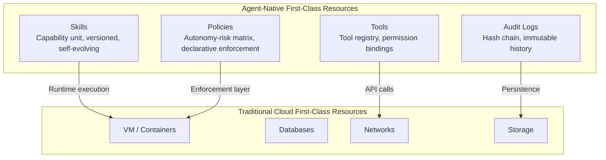

## نظرة عامة

ركّزت الحوسبة السحابية حتى الآن على سؤال واحد: "كيف نُجرّد البيئة التي تعمل فيها التطبيقات؟" كان التطور من الخوادم المادية إلى الآلات الافتراضية (VM)، ومن الآلات الافتراضية إلى الحاويات، ومن الحاويات إلى الخدمات اللاسيرفرية، مساراً لتحسين الإجابة على هذا السؤال بصورة متزايدة الدقة.

غير أننا نواجه اليوم نوعاً مختلفاً من الأسئلة: "كيف نُجرّد البيئة التي تعمل فيها وكلاء الذكاء الاصطناعي -- الوكلاء الذين يفكرون ويتصرفون باستقلالية؟" يتطلب هذا السؤال شيئاً لم تُصمَّم أطر تجريد السحابة الحالية لتوفيره قط.

تستعرض هذه المقالة تلك الفجوة وتتناول مبادئ تجريد البنية التحتية المطلوبة في عصر الوكلاء. هذه قصة عن نموذج، وليست عرضاً تجارياً لمنتج.

## تطور التجريد في السحابة

تاريخ البنية التحتية السحابية هو تاريخ تراكم طبقات التجريد.

**الجيل الأول: استئجار الخوادم المادية.** نموذج مراكز البيانات المشتركة، حيث يستأجر المشغلون مساحة في الرفوف. كان المشغلون مسؤولين عن كل شيء من تثبيت نظام التشغيل إلى تكوين الشبكة. كانت تكلفة التغيير عالية جداً، وكان من الصعب الاستجابة بمرونة لتقلبات الطلب.

**الجيل الثاني: الآلات الافتراضية (VMs).** النموذج الذي تمثله AWS EC2 وGCP Compute Engine. قُسِّمت الخوادم المادية إلى وحدات منطقية، وأصبح بإمكان المشغلين توفير موارد الحوسبة -- المعالج والذاكرة والتخزين -- عبر واجهة برمجية. أحدث التجريد تحسناً كبيراً في مرونة البنية التحتية.

**الجيل الثالث: الحاويات والتنسيق.** العالم الذي حدده Docker وKubernetes. أصبح معياراً تغليف بيئة التنفيذ ذاتها كصورة ونشر أعباء العمل عبر مواصفات إعلانية. ازدهرت مفاهيم كالبنية التحتية الثابتة وGitOps وشبكة الخدمات في هذا الجيل.

**الجيل الرابع (مرحلة انتقالية حالية): الخدمات اللاسيرفرية والدوال.** النموذج الذي تمثله AWS Lambda وGoogle Cloud Functions. لم يعد المشغلون بحاجة إلى إدارة الخوادم على الإطلاق. يدفعون فقط مقابل تكاليف التنفيذ في وحدات على مستوى الدوال التي تستجيب للأحداث.

تشترك كل هذه الأجيال في شيء واحد: كانت الكيانات المُدارة دائماً **بيئة التنفيذ**. سواء أكانت آلات افتراضية أم حاويات أم دوال، ركّزت السحابة على توفير "مساحة لتشغيل شيء ما."

تخرج وكلاء الذكاء الاصطناعي المستقلون عن هذا الإطار.

## المشكلات الأربع الصعبة في تشغيل الوكلاء

تواجه الفرق التي نشرت وكلاء ذكاء اصطناعي مستقلين في بيئات الإنتاج مجموعة مشتركة من التحديات.

### المشكلة الصعبة الأولى: اختيار النموذج والتحكم في التكلفة

لا يكتمل الوكيل بمجرد استدعاء نموذج لغوي كبير واحد. لحل الأهداف المعقدة، يمر بمراحل متعددة: التخطيط والتنفيذ والتوليف.

تكمن المشكلة في أن كل مرحلة تتطلب قدرات نموذج مختلفة. يحتاج التخطيط إلى سياق واسع واستدلال معقد، في حين لا يحتاج إلى ذلك مرحلة الاسترداد البسيطة. ومع ذلك، يصعب مع الأساليب الحالية التحكم في هذا بدقة. على المطورين إما تحديد نموذج لكل مرحلة يدوياً، أو معالجة كل شيء بنموذج واحد قوي (ومكلف).

الأول يزيد من تعقيد الكود، والثاني يؤدي إلى انفجار في التكاليف. [تقديري] ليس من النادر أن تشكّل تكاليف النماذج أكثر من 60% من إجمالي تكاليف البنية التحتية في المؤسسات التي تُشغّل وكلاء على نطاق واسع.

### المشكلة الصعبة الثانية: إدارة المهارات والانتشار غير المنضبط

لنسمّ مجموعة الأدوات والقدرات التي يستخدمها الوكيل "مهارات" لأغراض الراحة. مع نمو النظام البيئي للوكلاء، تتكاثر المهارات بسرعة. تظهر مهارات متعددة بوظائف متشابهة، بعضها لا يُصان. يصعب تحديد أي مهارة هي الأنسب لأي موقف.

مثلما يحدث انتشار لصور AMI عند عدم إدارة صور الآلات الافتراضية بشكل منهجي، يحدث انتشار للمهارات في النظم البيئية للوكلاء. غير أن البنية التحتية السحابية الحالية لا توفر تجريداً للتعامل مع هذا.

### المشكلة الصعبة الثالثة: التوازن بين الحوكمة والاستقلالية

يواجه وكلاء الذكاء الاصطناعي المستقلون سؤالاً جوهرياً: "إلى أي مدى ينبغي أن يحكموا ويتصرفوا بأنفسهم؟" القيود المفرطة تُلغي قيمة الوكيل؛ التحرير المفرط يُفضي إلى سلوك غير متوقع.

يتطلب التحكم في هذا على مستوى طبقة العمليات محركاً للسياسات. يجب تعريف وإنفاذ الأدوات المسموح بها وإمكانية الوصول إلى البيانات والإجراءات التي تتطلب موافقة بشرية بصورة إعلانية.

تتعامل إدارة الهوية والوصول IAM التقليدية للسحابة ومجموعات الأمان مع سؤال "من يمكنه استدعاء أي API؟". لكن حوكمة الوكلاء يجب أن تعالج السؤال السياقي المعتمد: "هل يمكن لهذا الوكيل اتخاذ هذا الحكم في هذا الموقف؟" يتطلب هذا تجريداً مختلفاً نوعياً.

من الناحية العملية، تأمّل هذا السيناريو: عندما يحاول وكيل يملك حق الوصول إلى قاعدة بيانات العملاء إجراء استعلام جماعي في وقت غير معتاد، هل ينبغي السماح له فقط لأنه يملك صلاحية API؟ كانت التفويض السياقي منطقة وضعتها نماذج IAM التقليدية خارج نطاق تصميمها عمداً.

### المشكلة الصعبة الرابعة: التعلم المستمر وتطور المهارات

الوكلاء ليسوا برمجيات ثابتة. خلال التشغيل، تتراكم بيانات حول الاستراتيجيات الفعّالة والمهارات التي تفشل كثيراً. تحتاج إلى حلقة تغذية راجعة لتحسين الوكلاء والمهارات بناءً على هذه البيانات.

مثلما تُحدَّث صور الحاويات عبر خطوط أنابيب النشر، يجب تحديث قدرات الوكيل بصورة منهجية. غير أن البنية التحتية السحابية الحالية لا تعامل "تطور القدرة" هذا كمواطن من الدرجة الأولى.

هذا التحدي واضح بشكل خاص في البيئات المؤسسية. في نظام وكلاء يستخدمه مئات أعضاء الفريق، يتطلب فهم المهارات التي تراجع أداؤها مقارنةً بالشهر الماضي والسيناريوهات التي تحتاج مهارات جديدة تكاليف تشغيلية هائلة. بدون أتمتة هذه العملية، تميل أنظمة الوكلاء إلى التدهور التدريجي في الجودة بعد النشر الأولي.

## المهارات والأدوات والسياسات وسجلات التدقيق كموارد من الدرجة الأولى

تشير هذه المشكلات الأربع الصعبة كلها إلى نفس السبب الجذري: الأشياء التي تعاملها السحابة الحالية كموارد من الدرجة الأولى -- الآلات الافتراضية والحاويات والدوال والتخزين والشبكات -- ليست الأهم في تشغيل الوكلاء.

يجب أن تعامل السحابة الأصيلة للوكلاء الأربعة التالية كموارد من الدرجة الأولى.

**المهارات هي وحدة القدرة.** يجب أن تكون أكثر من مجرد مجموعات موجّهات بسيطة -- يجب أن تكون كائنات قابلة للإدارة ذات إصدارات ومقاييس تقييم وقدرة على المقارنة والدمج. يجب اتخاذ قرارات بشأن المهارات التي يجب الاحتفاظ بها وتلك التي يجب إلغاؤها بناءً على مقاييس كتكرار الاستخدام ومعدل النجاح وكفاءة التكلفة.

**الأدوات هي سجل الأدوات.** تمثل قائمة الواجهات الخارجية التي يمكن للوكيل استدعاؤها، مع ربط أذونات الوصول بكل أداة. يجب أن يكون بالإمكان إدارة أي وكيل يمكنه استدعاء أي أداة بشكل مركزي.

**السياسات هي لغة الحوكمة.** تُعبَّر عن السياسات كمصفوفة تتقاطع فيها مستوى استقلالية الوكيل مع نطاق المخاطر المقبولة. يجب إنفاذ السياسات الإعلانية في وقت التشغيل، ويجب تشغيل سير العمل تلقائياً عند الحاجة إلى موافقة بشرية.

**سجلات التدقيق هي أساس الثقة.** يجب تسجيل تاريخ الأحكام التي أصدرها الوكيل والإجراءات التي اتخذها بطريقة غير قابلة للتلاعب. هذا، قبل أن يكون مسألة امتثال تنظيمي، مبدأ تصميمي يجعل أنظمة الوكلاء موثوقة.

معاملة هذه الموارد الأربعة كمواطنين من الدرجة الأولى يعني أكثر من مجرد القدرة على تخزينها واسترجاعها. يعني إدارة كاملة لدورة الحياة: توفيرها كموارد حوسبة، والإصدار، والتحكم في الوصول من خلال السياسات، وتتبع التكاليف، والتراجع عند الفشل. مثلما تتعامل Kubernetes مع الحاويات من خلال تجريدات "Deployment" و"ReplicaSet"، يجب أن تتعامل منصة الوكلاء الأصيلة مع المهارات من خلال تجريدات "SkillRelease" و"SkillPolicy".

## تطبيق ThakiCloud: Praxis والتكامل مع منصة الذكاء الاصطناعي

طوّرت ThakiCloud منصة **Praxis** كمنصة تجسّد مبادئ التصميم هذه. تحت مفهوم "AWS للوكلاء"، الهدف هو معاملة المهارات والأدوات والسياسات وسجلات التدقيق كموارد من الدرجة الأولى -- بنفس الطريقة التي تتعامل فيها السحابة التقليدية مع الآلات الافتراضية وقواعد البيانات والشبكات.

**جهاز توجيه LLM والمهارات** يختار تلقائياً النموذج المناسب لكل مرحلة من مراحل تنفيذ الوكيل (التخطيط والتنفيذ والتوليف). يدعم أكثر من 10 مزودين بما فيهم Claude وGPT وGemini وKimi وOllama ونموذج ThakiCloud الخاص Metis، ويقلل من استدعاءات النماذج المرتفعة التكلفة غير الضرورية من خلال التوجيه المدرك للتكلفة. اختيار المهارات عملية من مرحلتين: أولاً تضييق مجموعة المرشحين في النطاق، ثم اختيار المهارة الأمثل بناءً على 7 معايير بما فيها الملاءمة والتكلفة والموثوقية.

**دايمون Curator للتطور الذاتي** يدير النظام البيئي للمهارات باستمرار. يكتشف المهارات المتشابهة ويدمجها، ويرقّع تلقائياً المهارات ذات الأداء المتدهور، ويكتشف مهارات جديدة بناءً على البيانات التشغيلية. من خلال تقطير الذاكرة، تتراكم الرؤى المكتسبة من التنفيذ المتكرر في قاعدة معرفية.

**طبقة الأمان والحوكمة** توفر مصفوفة سياسات تتقاطع فيها 4 مستويات من الاستقلالية مع 7 مستويات من المخاطر. يُطبَّق حماية الموجّهات لـ11 نوعاً من المدخلات ونوعين من المخرجات، إلى جانب إخفاء هوية 16 فئة من المعلومات الشخصية. بيئات تنفيذ متجزئة قائمة على Docker وحاويات Kata تعزل الوكلاء، وسجلات تدقيق بسلسلة تجزئة تغطي أكثر من 20 نوعاً من الأحداث تُحفظ لمدة 90 يوماً.

**طبقة الوارد متعددة القنوات** تُتيح التفاعل مع الوكلاء عبر تطبيق React SPA للويب وSlack (يدعم 48 أمراً) وواجهة سطر الأوامر CLI. يتضمن أيضاً جدولاً زمنياً ديناميكياً يعرّف المهام المخصصة باللغة الطبيعية. تعليمات مثل "اجمع أخبار المنافسين كل صباح وقدّم ملخصاً" يسجّلها الوكيل مباشرةً كجدول زمني خاص به.

**محرك المعرفة الهجين (HKE)** يجمع بين RAG القائم على wiki الخاص بكل فريق وبين رسم بياني للمعرفة. يرجع كل وكيل إلى قاعدة معرفية متخصصة في نطاقه، ويُثريها باستمرار من خلال تجربة التنفيذ.

تعمل Praxis بالتنسيق مع **منصة الذكاء الاصطناعي (ai-suite)**. هي بنية من ثلاث طبقات حيث تتولى منصة الذكاء الاصطناعي سياسة LLM المركزية والتحكم في التكلفة، وتوفر Praxis وقت تشغيل الوكيل، ويتولى Metis طبقة الاستدلال. الطريقة التي تتمتع بها كل طبقة بمسؤوليات واضحة وتتحد تشبه فصل مستوى التحكم عن مستوى البيانات في السحابة التقليدية.

المكدس البرمجي مبني بـGo 1.26 (الواجهة الخلفية) وReact 19 (الواجهة الأمامية)، مستخدماً PostgreSQL وRedis وMinIO كطبقة تخزين في بيئات الإنتاج.

## القيود والآفاق

مفهوم السحابة الأصيلة للوكلاء ذاته لم ينضج بعد. تستدعي بعض الصعوبات الجوهرية فحصاً صادقاً.

**مشكلة قياس جودة المهارات.** يمكن تقييم موثوقية صور الحاويات من خلال طرق راسخة نسبياً كالفحص عن الثغرات والتحقق من التوقيع. في المقابل، تعتمد جودة المهارة اعتماداً عميقاً على سياق التنفيذ. "هل هذه المهارة مناسبة لهذا الموقف؟" يصعب تقييمه بالكامل مسبقاً بطرق آلية. مقاييس التقييم الحالية (معدل النجاح وكفاءة التكلفة) مقاييس وكالة فحسب -- لا تقيس الفاعلية الحقيقية.

**وهم اكتمال السياسة.** تُنفَّذ السياسات الإعلانية للمواقف المُصرَّح بها، لكن تنوع المواقف التي يواجهها الوكيل يتجاوز خيال مصمميها. الحذر ضروري لضمان أن السياسات لا تخلق الانطباع الزائف بأن "الحوكمة قد حُلّت". السياسات شبكة أمان، وليست ضماناً.

**تعقيد تنسيق الوكلاء المتعددين.** التعامل مع وكيل واحد والتعامل مع نظام تتعاون فيه وكلاء متعددون مشكلتان مختلفتان نوعياً. نماذج الثقة بين الوكلاء وآليات حل النزاعات وإسناد المسؤولية كلها مجالات لم تُحسم بعد بشكل كافٍ على مستوى طبقة البنية التحتية.

**غياب المعايير الصناعية.** للآلات الافتراضية، توجد معايير للصور كـOVF/OCI وأنماط API متوافقة بين مزودي السحابة. معايير وصف مهارات الوكيل وسياساته لا تزال في طور التشكّل. ثمة حركات تحاول توحيد واجهات الأدوات مثل MCP (Model Context Protocol)، لكن التوافق الأوسع للنظام البيئي يحتاج وقتاً.

الاتجاه مع ذلك واضح. مع ترسّخ الوكلاء كجزء من الأنظمة البرمجية، يجب أن يرتفع مستوى التجريد في البنية التحتية التي تديرها. مثلما انتقلنا من عصر الإدارة المباشرة للخوادم المادية إلى عصر استدعاء واجهات برمجة الآلات الافتراضية، يقترب عصر تُعرَّف فيه "قدرات الوكيل ونطاق تصرفاته عبر API وتُنفّذها المنصة".

رحلة Praxis، مع سوق المهارات [تقديري] على خارطة طريق الربع الرابع من 2026 وشهادة SOC2 والنشر المعزول [تقديري] للربع الثاني من 2027 وما بعده، هي جزء من هذا التدفق. مع نضج المنصة، سيتمكن المطورون من التركيز على تصميم قدرات الوكيل، في حين تتولى البنية التحتية سلامة التنفيذ وتحسين التكلفة.

السحابة الأصيلة للوكلاء ليست مفهوماً مكتملاً بعد. لكن ما تحتاج أنظمة تشغيل البرمجيات من الجيل التالي إلى حله على مستوى طبقة البنية التحتية يتشكّل، في هذه اللحظة بالذات، كمبادئ تصميم.
